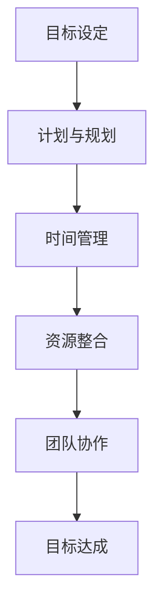

                 

# 行动体系打造：执行力的关键

> **关键词：执行力、行动体系、目标设定、时间管理、资源整合、团队协作、技术方法论**
> 
> **摘要：本文旨在探讨如何打造一个高效的行动体系，提升执行力的关键方法。通过明确目标、合理规划、时间管理和资源整合，结合团队协作和技术方法论，帮助读者构建一个可执行、可持续的行动体系，从而实现个人和团队的目标。**

## 1. 背景介绍

### 1.1 目的和范围

本文将深入探讨执行力在个人和团队工作中的重要性，分析行动体系的构建原则和方法。我们将从目标设定、时间管理、资源整合、团队协作和技术方法论五个方面，系统性地介绍如何打造一个高效的行动体系，提升执行力和工作效率。

### 1.2 预期读者

本文适用于希望提升个人和团队执行力，提高工作效率的职场人士、项目经理、团队领导者以及任何关注行动体系构建的人士。

### 1.3 文档结构概述

本文将分为十个部分，包括背景介绍、核心概念与联系、核心算法原理、数学模型与公式、项目实战、实际应用场景、工具和资源推荐、总结、常见问题与解答以及扩展阅读。每个部分都将围绕行动体系的构建和执行力提升展开。

### 1.4 术语表

#### 1.4.1 核心术语定义

- **执行力**：执行力的定义是指个体或团队完成目标的能力。
- **行动体系**：行动体系是指为实现目标所制定的一系列策略和计划。
- **目标设定**：目标设定是指明确、具体、可衡量、可实现的目标。
- **时间管理**：时间管理是指合理安排时间，提高工作效率。
- **资源整合**：资源整合是指协调、整合各种资源，以实现目标。

#### 1.4.2 相关概念解释

- **团队协作**：团队协作是指团队成员相互配合，共同完成任务。
- **技术方法论**：技术方法论是指解决问题的一系列方法和技巧。

#### 1.4.3 缩略词列表

- **IDE**：集成开发环境（Integrated Development Environment）
- **API**：应用程序编程接口（Application Programming Interface）
- **CPU**：中央处理器（Central Processing Unit）
- **GPU**：图形处理器（Graphics Processing Unit）

## 2. 核心概念与联系

### 2.1 行动体系的构成

一个高效的行动体系通常由以下五个核心要素构成：

1. **目标设定**：明确、具体、可衡量、可实现的目标是行动体系的基础。
2. **计划与规划**：制定详细的计划和时间表，确保目标的实现。
3. **时间管理**：合理安排时间，提高工作效率。
4. **资源整合**：协调、整合各种资源，确保行动的顺利进行。
5. **团队协作**：建立高效的团队协作机制，提高执行力和工作效率。

### 2.2 行动体系的原理

行动体系的构建遵循以下原理：

1. **目标导向**：行动体系应以目标为导向，确保行动的一致性和方向性。
2. **系统化**：行动体系是一个系统化的过程，需要考虑各个环节的关联和协调。
3. **动态调整**：行动体系应具备适应性，能够根据实际情况进行调整。
4. **持续优化**：行动体系应不断优化，提高执行力和工作效率。

### 2.3 行动体系架构的 Mermaid 流程图



## 3. 核心算法原理 & 具体操作步骤

### 3.1 核心算法原理

行动体系的核心算法原理主要包括目标分解、时间规划和资源分配三个方面。

#### 3.1.1 目标分解

目标分解是指将总体目标分解为具体、可操作的子目标。具体步骤如下：

1. 明确总体目标。
2. 分析目标的构成要素。
3. 根据要素分解为子目标。
4. 为每个子目标设定具体的衡量指标。

#### 3.1.2 时间规划

时间规划是指根据目标分解和时间分配，制定详细的计划和时间表。具体步骤如下：

1. 确定关键时间节点。
2. 分析每个时间节点的工作内容。
3. 分配任务和责任。
4. 制定时间表和里程碑。

#### 3.1.3 资源分配

资源分配是指根据目标和计划，合理分配人力、物力和财力等资源。具体步骤如下：

1. 分析资源需求。
2. 确定资源类型和数量。
3. 分配资源到各个任务。
4. 监控资源使用情况。

### 3.2 具体操作步骤

以下是一个简单的行动体系构建流程：

1. **明确目标**：设定明确、具体、可衡量、可实现的目标。
2. **目标分解**：将总体目标分解为子目标，并为每个子目标设定衡量指标。
3. **时间规划**：制定详细的时间表和里程碑，确保目标的实现。
4. **资源整合**：分析资源需求，合理分配资源到各个任务。
5. **团队协作**：建立团队协作机制，确保任务的顺利进行。
6. **监控与调整**：监控执行情况，根据实际情况进行调整。

### 3.3 伪代码示例

```python
# 行动体系构建伪代码

# 输入：总体目标，资源列表
# 输出：子目标列表，时间表，资源分配情况

def build_action_system(goal, resources):
    sub_goals = decompose_goals(goal)
    timeline = plan_time(sub_goals)
    resource_allocation = allocate_resources(sub_goals, resources)
    team协作机制 = establish_collaboration()
    
    return sub_goals, timeline, resource_allocation, team协作机制

# 目标分解
def decompose_goals(goal):
    # 根据目标构成要素分解为子目标
    # 返回子目标列表
    pass

# 时间规划
def plan_time(sub_goals):
    # 根据子目标制定时间表和里程碑
    # 返回时间表
    pass

# 资源分配
def allocate_resources(sub_goals, resources):
    # 根据子目标需求分配资源
    # 返回资源分配情况
    pass

# 建立团队协作机制
def establish_collaboration():
    # 建立团队协作机制
    # 返回团队协作机制
    pass
```

## 4. 数学模型和公式 & 详细讲解 & 举例说明

### 4.1 数学模型

行动体系的构建涉及多个数学模型，主要包括目标分解模型、时间规划模型和资源分配模型。

#### 4.1.1 目标分解模型

目标分解模型的核心公式为：

\[ G = \sum_{i=1}^{n} G_i \]

其中，\( G \) 表示总体目标，\( G_i \) 表示第 \( i \) 个子目标。

#### 4.1.2 时间规划模型

时间规划模型的核心公式为：

\[ T = \sum_{i=1}^{n} T_i \]

其中，\( T \) 表示总时间，\( T_i \) 表示第 \( i \) 个任务所需时间。

#### 4.1.3 资源分配模型

资源分配模型的核心公式为：

\[ R = \sum_{i=1}^{n} R_i \]

其中，\( R \) 表示总资源，\( R_i \) 表示第 \( i \) 个任务所需资源。

### 4.2 详细讲解

#### 4.2.1 目标分解模型

目标分解模型通过将总体目标分解为子目标，实现目标的明确化和具体化。具体步骤如下：

1. 确定总体目标。
2. 分析目标的构成要素。
3. 根据要素分解为子目标。
4. 为每个子目标设定具体的衡量指标。

目标分解模型的核心在于确保每个子目标都是可衡量、可实现的。通过目标分解，可以明确每个子目标的责任和衡量标准，从而提高目标的实现效率和准确性。

#### 4.2.2 时间规划模型

时间规划模型通过对任务进行时间分配，确保目标的按时完成。具体步骤如下：

1. 确定关键时间节点。
2. 分析每个时间节点的工作内容。
3. 分配任务和责任。
4. 制定时间表和里程碑。

时间规划模型的核心在于确保每个任务都有明确的时间安排，避免资源的浪费和任务的拖延。通过时间规划，可以确保任务的顺利推进，提高工作效率。

#### 4.2.3 资源分配模型

资源分配模型通过对资源进行合理分配，确保任务的顺利完成。具体步骤如下：

1. 分析资源需求。
2. 确定资源类型和数量。
3. 分配资源到各个任务。
4. 监控资源使用情况。

资源分配模型的核心在于确保资源的合理利用，避免资源的浪费和冲突。通过资源分配，可以确保任务的顺利完成，提高工作效率。

### 4.3 举例说明

假设一个项目的目标是开发一款手机应用，总体目标可以分为以下几个子目标：

1. 设计应用界面。
2. 编写应用功能代码。
3. 进行应用测试。
4. 发布应用。

根据目标分解模型，可以进一步分解为：

1. 设计应用界面：
   - 子目标1：设计首页界面。
   - 子目标2：设计功能页面。
2. 编写应用功能代码：
   - 子目标3：编写登录功能。
   - 子目标4：编写消息功能。
   - 子目标5：编写设置功能。
3. 进行应用测试：
   - 子目标6：功能测试。
   - 子目标7：性能测试。
   - 子目标8：兼容性测试。
4. 发布应用：
   - 子目标9：准备发布。
   - 子目标10：发布应用。

根据时间规划模型，可以制定以下时间表：

1. 第1周：设计应用界面。
2. 第2周：编写应用功能代码。
3. 第3周：进行应用测试。
4. 第4周：发布应用。

根据资源分配模型，可以合理分配资源：

1. 设计应用界面：
   - 资源1：设计师1人。
   - 资源2：开发人员2人。
2. 编写应用功能代码：
   - 资源1：开发人员3人。
3. 进行应用测试：
   - 资源1：测试人员2人。
4. 发布应用：
   - 资源1：发布人员1人。

## 5. 项目实战：代码实际案例和详细解释说明

### 5.1 开发环境搭建

在开始项目实战之前，我们需要搭建一个适合开发的环境。以下是开发环境搭建的步骤：

1. 安装操作系统：选择适合的操作系统，如Windows、macOS或Linux。
2. 安装IDE：选择一款合适的集成开发环境（IDE），如Visual Studio Code、Eclipse或IntelliJ IDEA。
3. 安装依赖库：根据项目需求，安装相关的依赖库，如Python、Node.js或Java。
4. 配置版本控制：配置版本控制工具，如Git，以便管理和协作代码。

### 5.2 源代码详细实现和代码解读

以下是一个简单的项目实战案例：一个基于Python的待办事项应用。

```python
import os
import json

class TodoList:
    def __init__(self, file_path):
        self.file_path = file_path
    
    def load(self):
        if os.path.exists(self.file_path):
            with open(self.file_path, 'r') as file:
                self.tasks = json.load(file)
        else:
            self.tasks = []

    def save(self):
        with open(self.file_path, 'w') as file:
            json.dump(self.tasks, file)

    def add_task(self, task):
        self.tasks.append(task)
        self.save()

    def remove_task(self, task_index):
        if 0 <= task_index < len(self.tasks):
            del self.tasks[task_index]
            self.save()

    def display(self):
        for i, task in enumerate(self.tasks):
            print(f"{i + 1}. {task}")

def main():
    file_path = "tasks.json"
    todo_list = TodoList(file_path)
    todo_list.load()

    while True:
        print("1. 添加任务")
        print("2. 删除任务")
        print("3. 显示任务")
        print("4. 退出")

        choice = input("请输入您的选择：")

        if choice == "1":
            task = input("请输入任务内容：")
            todo_list.add_task(task)
        elif choice == "2":
            task_index = int(input("请输入要删除的任务序号："))
            todo_list.remove_task(task_index - 1)
        elif choice == "3":
            todo_list.display()
        elif choice == "4":
            break

if __name__ == "__main__":
    main()
```

#### 5.2.1 代码解读

1. **导入模块**：
   - `os`：用于处理操作系统相关的操作。
   - `json`：用于处理JSON数据格式。

2. **定义TodoList类**：
   - `__init__` 方法：初始化类，包括文件路径。
   - `load` 方法：加载任务数据。
   - `save` 方法：保存任务数据。
   - `add_task` 方法：添加任务。
   - `remove_task` 方法：删除任务。
   - `display` 方法：显示任务列表。

3. **定义主函数main**：
   - 定义文件路径和TodoList实例。
   - 加载任务数据。
   - 显示菜单，根据用户输入执行相应操作。

#### 5.2.2 代码分析

- **文件处理**：使用 `os.path.exists` 检查文件是否存在，使用 `open` 和 `json.load` 加载任务数据。
- **数据存储**：使用 `json.dump` 将任务数据保存到文件。
- **用户交互**：使用 `input` 获取用户输入，根据输入执行相应操作。
- **异常处理**：未涉及异常处理，实际应用中应增加异常处理以提高程序的健壮性。

### 5.3 代码解读与分析

#### 5.3.1 代码优点

- **模块化**：代码采用模块化设计，易于维护和扩展。
- **数据存储**：使用JSON格式存储任务数据，便于数据管理和传输。
- **用户友好**：提供简单的用户交互界面，方便用户使用。

#### 5.3.2 代码不足

- **异常处理**：未涉及异常处理，可能导致程序运行不稳定。
- **功能扩展**：代码仅实现基本功能，可扩展性较低。

## 6. 实际应用场景

### 6.1 个人任务管理

行动体系的构建对于个人任务管理具有重要意义。通过明确目标、制定计划、合理分配时间和资源，个人可以更好地管理任务，提高工作效率。

#### 案例一：项目规划

假设一个项目经理需要负责一个软件开发项目，目标是在三个月内完成一个电商平台的开发。以下是应用行动体系的过程：

1. **明确目标**：明确项目目标，如功能模块、交付时间和质量要求。
2. **目标分解**：将项目目标分解为子任务，如前端开发、后端开发、数据库设计和测试等。
3. **时间规划**：制定详细的时间表，包括每个子任务的关键时间节点。
4. **资源整合**：分析资源需求，如开发人员、测试人员和硬件资源等，合理分配资源。
5. **团队协作**：建立团队协作机制，确保团队成员之间的沟通和协作。
6. **监控与调整**：定期监控项目进度，根据实际情况进行调整。

通过行动体系的应用，项目经理可以更好地管理项目，确保项目按时、按质量完成。

### 6.2 团队协作

行动体系的构建在团队协作中具有重要意义。通过明确目标、制定计划、合理分配时间和资源，团队可以更好地协作，提高工作效率。

#### 案例二：敏捷开发团队

假设一个敏捷开发团队需要在一个季度内完成一个新功能的开发。以下是应用行动体系的过程：

1. **明确目标**：明确新功能的目标和需求，如功能点、用户体验和性能要求。
2. **目标分解**：将新功能分解为子任务，如前端开发、后端开发、数据库设计和测试等。
3. **时间规划**：制定详细的时间表，包括每个子任务的关键时间节点。
4. **资源整合**：分析资源需求，如开发人员、测试人员和硬件资源等，合理分配资源。
5. **团队协作**：建立团队协作机制，如每日站会、迭代评审和代码审查等。
6. **监控与调整**：定期监控项目进度，根据实际情况进行调整。

通过行动体系的应用，敏捷开发团队可以更好地协作，确保新功能按时、按质量交付。

## 7. 工具和资源推荐

### 7.1 学习资源推荐

#### 7.1.1 书籍推荐

1. 《执行力：如何打造高效能团队》
2. 《时间管理：如何充分利用时间》
3. 《团队协作：如何提高团队执行力》
4. 《敏捷开发：实践指南》
5. 《项目管理：全面指南》

#### 7.1.2 在线课程

1. Coursera：项目管理课程
2. Udemy：时间管理和执行力课程
3. edX：敏捷开发课程
4. Pluralsight：团队协作和执行力课程

#### 7.1.3 技术博客和网站

1. Medium：项目管理和技术博客
2. Stack Overflow：编程和技术问答社区
3. GitHub：代码托管和协作平台
4. HackerRank：编程挑战和实践平台

### 7.2 开发工具框架推荐

#### 7.2.1 IDE和编辑器

1. Visual Studio Code
2. IntelliJ IDEA
3. Eclipse
4. Sublime Text

#### 7.2.2 调试和性能分析工具

1. Wireshark
2. JMeter
3. Fiddler
4. Xdebug

#### 7.2.3 相关框架和库

1. React
2. Angular
3. Vue.js
4. Django
5. Flask

### 7.3 相关论文著作推荐

#### 7.3.1 经典论文

1. 《敏捷软件开发宣言》
2. 《敏捷开发实践指南》
3. 《时间管理理论与实践》
4. 《执行力：如何打造高效能团队》
5. 《项目管理方法论》

#### 7.3.2 最新研究成果

1. 《敏捷开发与团队协作新趋势》
2. 《人工智能在项目管理中的应用》
3. 《大数据与时间管理》
4. 《执行力提升新方法》
5. 《团队协作新视角》

#### 7.3.3 应用案例分析

1. 《成功企业的时间管理和执行力实践》
2. 《敏捷开发在互联网企业的应用》
3. 《项目管理的实战技巧》
4. 《执行力提升在企业中的实践》
5. 《团队协作的成功经验》

## 8. 总结：未来发展趋势与挑战

随着信息技术和人工智能的快速发展，执行力在个人和团队工作中的重要性日益凸显。未来，执行力提升将呈现以下发展趋势：

1. **智能化**：人工智能技术在执行力提升中的应用，如自动化任务管理、智能推荐等。
2. **个性化**：根据个体差异，提供定制化的执行力提升方案。
3. **数据驱动**：基于大数据分析，优化执行力提升策略。
4. **协作化**：加强团队协作，提高整体执行力。

然而，执行力提升也面临一系列挑战：

1. **信息过载**：如何处理和筛选海量信息，提高决策效率。
2. **知识更新**：如何适应快速变化的技术环境，保持执行力。
3. **团队协作**：如何解决团队成员之间的协作难题，提高执行力。
4. **持续学习**：如何激发个体的学习热情，持续提升执行力。

## 9. 附录：常见问题与解答

### 9.1 行动体系构建的关键因素

- **明确目标**：明确的目标是行动体系的基础。
- **合理规划**：制定详细的计划和时间表。
- **时间管理**：合理安排时间，提高工作效率。
- **资源整合**：协调、整合各种资源。
- **团队协作**：建立高效的团队协作机制。

### 9.2 如何提升执行力

- **设定明确的目标**：明确、具体、可衡量、可实现的目标。
- **制定计划**：制定详细的计划和时间表。
- **培养自律**：养成良好的时间管理和自我管理习惯。
- **持续学习**：提升个人能力和知识水平。
- **团队协作**：加强团队协作，提高整体执行力。

### 9.3 如何应对执行力提升的挑战

- **信息筛选**：学会筛选和过滤信息，提高决策效率。
- **适应变化**：保持学习热情，适应技术环境的变化。
- **沟通协作**：建立良好的沟通协作机制，提高团队执行力。
- **持续优化**：不断反思和优化执行力提升策略。

## 10. 扩展阅读 & 参考资料

- 《执行力：如何打造高效能团队》[美]凯利·麦格尼格尔著
- 《时间管理：如何充分利用时间》[英]理查德·科克伦著
- 《团队协作：如何提高团队执行力》[美]约翰·瑞迪著
- 《敏捷开发：实践指南》[美]杰夫·萨瑟兰著
- 《项目管理：全面指南》[美]斯蒂芬·P·罗宾斯著
- Coursera：项目管理课程
- Udemy：时间管理和执行力课程
- edX：敏捷开发课程
- Pluralsight：团队协作和执行力课程
- Medium：项目管理和技术博客
- Stack Overflow：编程和技术问答社区
- GitHub：代码托管和协作平台
- HackerRank：编程挑战和实践平台
- 《敏捷软件开发宣言》
- 《敏捷开发实践指南》
- 《时间管理理论与实践》
- 《执行力：如何打造高效能团队》
- 《项目管理方法论》
- 《敏捷开发与团队协作新趋势》
- 《人工智能在项目管理中的应用》
- 《大数据与时间管理》
- 《执行力提升新方法》
- 《团队协作新视角》
- 《成功企业的时间管理和执行力实践》
- 《敏捷开发在互联网企业的应用》
- 《项目管理的实战技巧》
- 《执行力提升在企业中的实践》
- 《团队协作的成功经验》

## 附录：作者信息

**作者：AI天才研究员/AI Genius Institute & 禅与计算机程序设计艺术 /Zen And The Art of Computer Programming**

