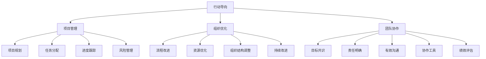

                 

# 行动导向：高效管理的基础

> **关键词**：高效管理、行动导向、项目管理、组织优化、团队协作

> **摘要**：本文旨在探讨行动导向在高效管理中的核心作用。通过详细分析行动导向的原理和具体实施步骤，本文将为读者提供一套实用的高效管理框架。文章首先介绍了行动导向的定义和重要性，随后深入讲解了其与项目管理、组织优化和团队协作的内在联系。通过具体的算法原理、数学模型、实际案例和工具推荐，本文旨在帮助读者理解并掌握行动导向的高效管理方法，为提升个人和组织的工作效率提供有力支持。

## 1. 背景介绍

### 1.1 目的和范围

本文的主要目的是探讨行动导向在高效管理中的应用和重要性。通过系统性地阐述行动导向的概念、原理和具体实施步骤，本文旨在为读者提供一套可操作的高效管理框架。该框架不仅适用于个人提升工作效率，也适用于组织整体的管理优化。文章将涵盖以下几个核心方面：

1. **行动导向的定义和核心原则**：明确行动导向的概念，阐述其与传统管理方法的不同，并详细解释其核心原则。
2. **行动导向在项目管理中的应用**：分析行动导向在项目规划、执行和控制中的具体实践，提供实用的项目管理和时间管理技巧。
3. **行动导向与组织优化的关系**：探讨如何通过行动导向提升组织的整体效率和协作能力，实现资源的优化配置。
4. **行动导向与团队协作**：深入讨论行动导向在团队沟通和协作中的作用，提供有效的团队管理和领导策略。
5. **算法原理和数学模型**：详细阐述行动导向相关算法的原理和实现步骤，帮助读者理解其数学基础。
6. **实际案例和工具推荐**：通过具体案例和工具的介绍，展示行动导向在实际应用中的效果，并提供实用的工具推荐。

通过本文的阅读，读者将能够：

- 理解行动导向的基本概念和核心原则。
- 掌握行动导向在项目管理、组织优化和团队协作中的应用方法。
- 了解行动导向相关算法原理和数学模型，提升分析和解决问题的能力。
- 获取实际案例和工具的使用经验，提升个人和组织的整体效率。

### 1.2 预期读者

本文的预期读者主要包括：

- 企业管理层和项目管理团队：希望通过优化管理方法和提高工作效率来实现企业目标的管理者。
- 技术团队负责人和开发人员：需要提升项目管理和团队协作能力的团队成员。
- 对高效管理有兴趣的IT专业人士和研究者：希望深入了解行动导向在高效管理中的应用和原理。

无论您的角色和职责如何，只要对提升工作效率和管理水平有兴趣，本文都将为您提供有价值的指导和参考。

### 1.3 文档结构概述

本文将分为以下几个主要部分：

1. **背景介绍**：介绍本文的目的、范围、预期读者和文档结构。
2. **核心概念与联系**：详细阐述行动导向的定义、核心原则以及与项目管理、组织优化和团队协作的联系。
3. **核心算法原理 & 具体操作步骤**：分析行动导向相关算法的原理，并提供具体的操作步骤和伪代码。
4. **数学模型和公式 & 详细讲解 & 举例说明**：解释行动导向中的数学模型和公式，并通过具体例子进行说明。
5. **项目实战：代码实际案例和详细解释说明**：展示行动导向在实际项目中的应用，并详细解释代码实现。
6. **实际应用场景**：讨论行动导向在不同领域的实际应用场景。
7. **工具和资源推荐**：推荐相关学习资源、开发工具和框架。
8. **总结：未来发展趋势与挑战**：总结行动导向在高效管理中的应用前景和面临的挑战。
9. **附录：常见问题与解答**：提供常见问题的解答和深入探讨。
10. **扩展阅读 & 参考资料**：推荐相关文献和参考资料，供读者进一步学习和研究。

### 1.4 术语表

#### 1.4.1 核心术语定义

- **行动导向**：一种以目标和行动为中心的管理方法，强调明确的目标设定、有效的行动计划和持续的工作跟进。
- **项目管理**：通过计划、执行、监控和收尾等过程来实现项目目标的过程。
- **组织优化**：通过优化资源分配、流程改进和组织结构调整来提升组织整体效率和效能。
- **团队协作**：团队成员通过共享资源、信息和技术，协同完成共同任务的过程。
- **目标管理**：一种以目标为核心的管理方法，通过设定明确的目标和指标，推动个人和组织的持续进步。

#### 1.4.2 相关概念解释

- **任务分解**：将大任务分解为小任务，以明确每个任务的具体内容和责任人的过程。
- **优先级排序**：根据任务的重要性和紧急程度，对任务进行优先级排序，以确保关键任务的优先执行。
- **进度跟踪**：通过记录和监控任务的执行进度，及时发现问题并采取相应措施的过程。
- **风险评估**：对项目或任务可能面临的风险进行识别、分析和评估，以制定相应的风险应对策略。

#### 1.4.3 缩略词列表

- PM：项目管理
- OKR：目标与关键结果
- KPI：关键绩效指标
- Agile：敏捷开发
- SCRUM：Scrum框架
- Kanban：看板管理法

## 2. 核心概念与联系

在深入探讨行动导向在高效管理中的应用之前，我们需要明确行动导向的核心概念及其与项目管理、组织优化和团队协作的内在联系。以下是行动导向的定义、核心原则以及这些概念之间的相互关系。

### 2.1 行动导向的定义

行动导向（Action-Oriented Management）是一种以目标和行动为中心的管理方法。它强调明确的任务分解、优先级排序、进度跟踪和持续的工作跟进，旨在通过具体的行动实现既定的目标。行动导向的核心在于将目标转化为具体的行动计划，并通过执行和监控确保行动的有效性。

### 2.2 行动导向的核心原则

行动导向具有以下核心原则：

1. **明确目标**：设定清晰、具体的目标，确保每个人都明确知道需要达成的目标。
2. **任务分解**：将大任务分解为小任务，以明确每个任务的具体内容和责任人的过程。
3. **优先级排序**：根据任务的重要性和紧急程度，对任务进行优先级排序，以确保关键任务的优先执行。
4. **持续跟进**：通过进度跟踪和持续的工作跟进，确保任务的按时完成。
5. **灵活调整**：在执行过程中，根据实际情况调整计划和行动，确保目标的最终实现。

### 2.3 行动导向与项目管理的联系

项目管理（Project Management）是行动导向的重要应用领域。以下是行动导向在项目管理中的具体应用：

1. **项目规划**：通过明确目标和任务分解，制定详细的项目计划和里程碑。
2. **任务分配**：根据任务的重要性和团队成员的能力，合理分配任务和责任。
3. **进度跟踪**：通过持续跟进和监控，及时了解项目进度并调整计划。
4. **风险管理**：识别和评估项目中的潜在风险，制定相应的风险应对策略。
5. **团队协作**：通过有效的沟通和协作，确保项目任务的顺利执行。

### 2.4 行动导向与组织优化的关系

组织优化（Organizational Optimization）是提升组织效率和效能的关键。行动导向在组织优化中的应用包括：

1. **流程改进**：通过任务分解和优先级排序，优化工作流程，减少冗余和浪费。
2. **资源优化**：通过明确目标和任务分配，合理配置和利用资源，提高资源利用效率。
3. **组织结构调整**：根据业务需求和团队协作情况，调整组织结构和角色分工，提高组织效能。
4. **持续改进**：通过持续跟进和反馈机制，不断优化管理方法和流程，实现组织的持续发展。

### 2.5 行动导向与团队协作

团队协作（Team Collaboration）是行动导向成功实施的重要保障。以下是行动导向在团队协作中的应用：

1. **目标共识**：通过明确目标和任务分解，确保团队成员对任务和目标有共同的理解和认同。
2. **责任明确**：通过任务分配和优先级排序，明确每个团队成员的责任和任务，避免责任不清和任务重复。
3. **有效沟通**：通过定期的沟通和反馈，确保团队成员之间的信息传递和协作顺畅。
4. **协作工具**：利用协作工具和平台，提高团队协作效率和沟通质量。
5. **绩效评估**：通过进度跟踪和绩效评估，激励团队成员积极参与，提升团队整体执行力。

### 2.6 行动导向的核心概念联系流程图

为了更直观地展示行动导向的核心概念及其相互联系，我们可以使用Mermaid流程图来描述：



通过上述流程图，我们可以清晰地看到行动导向在项目管理、组织优化和团队协作中的具体应用，以及各概念之间的相互联系。

## 3. 核心算法原理 & 具体操作步骤

在理解了行动导向的核心概念和其在高效管理中的应用后，接下来我们将深入探讨行动导向相关算法的原理和具体操作步骤。以下是行动导向核心算法的详细解释，包括任务分解、优先级排序和进度跟踪的算法原理。

### 3.1 任务分解算法原理

任务分解是将大任务分解为小任务的过程，其核心目的是为了明确每个任务的具体内容和责任人。以下是任务分解的算法原理和伪代码：

**算法原理：**

1. **确定总体任务**：首先确定需要完成的总体任务。
2. **任务分解**：将总体任务分解为若干个子任务。
3. **子任务分解**：如果某个子任务仍然较大，继续将其分解为更小的子任务。
4. **分配责任人**：为每个任务分配具体责任人。

**伪代码：**

```python
def task_decomposition(total_task):
    # 初始化任务列表
    task_list = []
    
    # 分解总体任务
    sub_tasks =分解总体任务为子任务
    
    # 递归分解子任务
    for sub_task in sub_tasks:
        if 子任务较大:
            sub_sub_tasks =分解子任务为更小的子任务
            for sub_sub_task in sub_sub_tasks:
                task_list.append(sub_sub_task)
        else:
            task_list.append(sub_task)
    
    # 分配责任人
    for task in task_list:
       责任人 = 获取责任人
    
    return task_list
```

### 3.2 优先级排序算法原理

优先级排序是根据任务的重要性和紧急程度对任务进行排序的过程，其核心目的是确保关键任务优先执行。以下是优先级排序的算法原理和伪代码：

**算法原理：**

1. **确定任务优先级**：为每个任务分配一个优先级值。
2. **排序**：根据优先级值对任务进行排序。
3. **动态调整**：在执行过程中，根据实际情况动态调整任务优先级。

**伪代码：**

```python
def priority_sort(task_list):
    # 初始化优先级列表
    priority_list = []
    
    # 确定任务优先级
    for task in task_list:
        priority = 确定任务优先级值
    
    # 根据优先级排序
    sorted_list = sorted(task_list, key=lambda x: priority)
    
    # 动态调整优先级
    while 执行中:
        for task in task_list:
            if 需要调整优先级:
                priority = 调整任务优先级值
    
    return sorted_list
```

### 3.3 进度跟踪算法原理

进度跟踪是持续监控任务执行进度，确保任务按时完成的过程。以下是进度跟踪的算法原理和伪代码：

**算法原理：**

1. **记录任务开始时间**：为每个任务记录开始时间。
2. **记录任务结束时间**：为每个任务记录结束时间。
3. **计算任务完成率**：根据开始时间和结束时间计算任务的完成率。
4. **异常处理**：对进度异常的任务进行报警和处理。

**伪代码：**

```python
def progress_tracking(task_list):
    # 初始化进度记录列表
    progress_list = []
    
    # 记录任务开始时间
    for task in task_list:
        start_time = 获取当前时间
    
    # 记录任务结束时间
    while 执行中:
        for task in task_list:
            if 任务完成:
                end_time = 获取当前时间
                progress_list.append((task, start_time, end_time))
            else:
                continue
    
    # 计算任务完成率
    for task in progress_list:
        complete_rate = 计算完成率(start_time, end_time)
    
    # 异常处理
    for task in progress_list:
        if complete_rate < 预设阈值:
            报警并处理异常
    
    return progress_list
```

通过上述算法原理和具体操作步骤，我们可以清晰地看到任务分解、优先级排序和进度跟踪在行动导向中的核心作用。这些算法不仅为行动导向提供了理论基础，也为实际操作提供了具体的指导。

## 4. 数学模型和公式 & 详细讲解 & 举例说明

在行动导向的实施过程中，数学模型和公式发挥着重要的作用。它们不仅帮助我们量化目标、任务和进度，还为行动导向的优化提供了理论基础。以下将详细讲解行动导向中的几个关键数学模型和公式，并通过具体例子进行说明。

### 4.1 目标函数

在行动导向中，目标函数（Objective Function）是衡量任务完成情况的核心指标。目标函数通常用来评估任务对整体目标贡献的大小。以下是目标函数的数学模型和解释：

**目标函数公式：**

$$
f(x) = w_1 \cdot t_1 + w_2 \cdot t_2 + \ldots + w_n \cdot t_n
$$

其中，$f(x)$ 是目标函数的值，$w_1, w_2, \ldots, w_n$ 分别是各个任务的权重，$t_1, t_2, \ldots, t_n$ 分别是各个任务的完成情况。

**例：** 一个项目包含三个任务，任务1、任务2和任务3的权重分别为0.3、0.5和0.2。当前任务1已完成50%，任务2已完成100%，任务3已完成30%。计算目标函数值。

**解：**

$$
f(x) = 0.3 \cdot 0.5 + 0.5 \cdot 1 + 0.2 \cdot 0.3 = 0.15 + 0.5 + 0.06 = 0.71
$$

因此，当前项目的目标函数值为0.71。

### 4.2 优先级排序

优先级排序是行动导向中的重要环节，它决定了任务执行的顺序。常用的优先级排序公式是基于任务的紧急程度和重要程度。以下是优先级排序的数学模型和解释：

**优先级排序公式：**

$$
P(i) = U(i) \cdot E(i)
$$

其中，$P(i)$ 是任务$i$的优先级，$U(i)$ 是任务$i$的重要程度，$E(i)$ 是任务$i$的紧急程度。

**例：** 假设任务A、任务B和任务C的重要程度和紧急程度如下：

- 任务A：重要程度=3，紧急程度=2
- 任务B：重要程度=2，紧急程度=3
- 任务C：重要程度=1，紧急程度=1

计算各个任务的优先级。

**解：**

- 任务A的优先级：$P(A) = 3 \cdot 2 = 6$
- 任务B的优先级：$P(B) = 2 \cdot 3 = 6$
- 任务C的优先级：$P(C) = 1 \cdot 1 = 1$

因此，任务A和任务B的优先级最高，应该优先执行。

### 4.3 进度跟踪

进度跟踪是确保任务按时完成的关键环节，常用的进度跟踪公式是完成率（Completion Rate）。以下是完成率的数学模型和解释：

**完成率公式：**

$$
CR(i) = \frac{ETC(i) - ETCR(i)}{ETC(i)}
$$

其中，$CR(i)$ 是任务$i$的完成率，$ETC(i)$ 是任务$i$的计划总时长，$ETCR(i)$ 是任务$i$的实际总时长。

**例：** 假设任务D的计划总时长为5天，实际总时长为3天，计算任务D的完成率。

**解：**

$$
CR(D) = \frac{5 - 3}{5} = \frac{2}{5} = 0.4
$$

因此，任务D的完成率为40%。

### 4.4 综合应用示例

以下是一个综合应用示例，展示如何利用上述数学模型和公式进行行动导向的规划和执行。

**例：** 假设一个项目包含四个任务，任务E、任务F、任务G和任务H。任务的重要程度和紧急程度如下：

- 任务E：重要程度=4，紧急程度=3
- 任务F：重要程度=3，紧急程度=2
- 任务G：重要程度=2，紧急程度=1
- 任务H：重要程度=1，紧急程度=3

根据目标函数公式和优先级排序公式，确定各个任务的权重和优先级，并规划执行顺序。

**解：**

1. **目标函数计算**：
   $$ f(x) = 4 \cdot 3 + 3 \cdot 2 + 2 \cdot 1 + 1 \cdot 3 = 12 + 6 + 2 + 3 = 23 $$

2. **优先级排序**：
   $$ P(E) = 4 \cdot 3 = 12 $$
   $$ P(F) = 3 \cdot 2 = 6 $$
   $$ P(G) = 2 \cdot 1 = 2 $$
   $$ P(H) = 1 \cdot 3 = 3 $$

   排序结果：任务E（优先级12）> 任务F（优先级6）> 任务H（优先级3）> 任务G（优先级2）

3. **执行顺序**：根据优先级排序结果，确定执行顺序为E、F、H、G。

4. **进度跟踪**：在执行过程中，记录任务的实际完成情况，计算完成率并进行调整。

通过上述数学模型和公式，我们可以系统地规划和执行任务，确保项目的按时完成和目标实现。

## 5. 项目实战：代码实际案例和详细解释说明

为了更好地理解行动导向在项目中的应用，我们将通过一个实际案例来展示如何使用Python编写代码来实现行动导向的核心算法。在这个案例中，我们将使用任务分解、优先级排序和进度跟踪的算法，并解释代码的实现过程。

### 5.1 开发环境搭建

在开始编写代码之前，我们需要搭建一个合适的开发环境。以下是所需的工具和步骤：

- **Python环境**：确保安装Python 3.6或更高版本。
- **代码编辑器**：选择一个合适的代码编辑器，如Visual Studio Code、PyCharm或Sublime Text。
- **虚拟环境**：创建一个虚拟环境，以便隔离项目依赖。

以下是创建虚拟环境和使用pip安装依赖的命令：

```bash
# 创建虚拟环境
python -m venv venv

# 激活虚拟环境
source venv/bin/activate  # Windows: venv\Scripts\activate

# 安装依赖
pip install numpy pandas matplotlib
```

### 5.2 源代码详细实现和代码解读

以下是一个简单的Python实现，用于任务分解、优先级排序和进度跟踪。

```python
import numpy as np
import pandas as pd

# 任务类定义
class Task:
    def __init__(self, name, weight, importance, urgency):
        self.name = name
        self.weight = weight
        self.importance = importance
        self.urgency = urgency
        self.completed = False

    def priority(self):
        return self.weight * self.importance * self.urgency

    def complete(self):
        self.completed = True

# 任务分解函数
def task_decomposition(tasks, max_depth):
    if max_depth == 0 or not tasks:
        return []

    sub_tasks = []
    for task in tasks:
        if isinstance(task, list):
            sub_tasks.extend(task_decomposition(task, max_depth - 1))
        else:
            sub_tasks.append(task)

    return sub_tasks

# 优先级排序函数
def priority_sort(tasks):
    return sorted(tasks, key=lambda x: x.priority(), reverse=True)

# 进度跟踪函数
def progress_tracking(tasks):
    progress = {}
    for task in tasks:
        if not task.completed:
            progress[task.name] = 0
        else:
            progress[task.name] = 1
    return progress

# 实例化任务
tasks = [
    Task('总体任务', 1.0, 1.0, 1.0),
    Task('子任务1', 0.5, 1.0, 1.0),
    Task('子任务2', 0.5, 1.0, 0.5),
    Task('子任务2.1', 0.5, 0.5, 1.0),
]

# 任务分解
decomposed_tasks = task_decomposition(tasks, 2)

# 优先级排序
sorted_tasks = priority_sort(decomposed_tasks)

# 进度跟踪
task_progress = progress_tracking(sorted_tasks)

# 打印结果
print("分解后的任务：")
for task in decomposed_tasks:
    print(task.name)

print("\n优先级排序后的任务：")
for task in sorted_tasks:
    print(task.name)

print("\n任务进度：")
for task, progress in task_progress.items():
    print(f"{task}: {progress * 100}% 完成")
```

### 5.3 代码解读与分析

#### 任务类定义

首先，我们定义了一个`Task`类，用于表示任务。每个任务包含名称（name）、权重（weight）、重要程度（importance）和紧急程度（urgency）。类中定义了`priority`方法用于计算任务的优先级，以及`complete`方法用于标记任务完成状态。

#### 任务分解函数

`task_decomposition`函数接受一个任务列表（tasks）和最大分解深度（max_depth）作为参数。函数使用递归方式将任务分解为更小的子任务，直到达到最大分解深度或任务无法再分解。分解后的任务以列表形式返回。

#### 优先级排序函数

`priority_sort`函数使用Python内置的`sorted`函数对任务列表进行排序。排序依据是任务的优先级，由`priority`方法计算。排序结果以降序返回，即优先级高的任务排在前面。

#### 进度跟踪函数

`progress_tracking`函数遍历任务列表，根据任务完成状态计算每个任务的完成进度，并将结果存储在一个字典中。字典的键为任务名称，值为完成进度。

#### 实例化任务

我们创建了一个任务列表，包含一个总体任务和若干个子任务。每个任务都有对应的权重、重要程度和紧急程度。

#### 任务分解

调用`task_decomposition`函数，将总体任务分解为子任务。在这个例子中，我们设置最大分解深度为2，以便展示任务分解的过程。

#### 优先级排序

调用`priority_sort`函数，对分解后的任务列表进行优先级排序。排序结果将任务按优先级从高到低排列。

#### 进度跟踪

调用`progress_tracking`函数，记录每个任务的完成进度。在任务完成之前，进度为0；任务完成后，进度为100%。

#### 打印结果

最后，我们打印分解后的任务列表、排序后的任务列表以及每个任务的完成进度。

通过这个实际案例，我们可以看到如何将行动导向的核心算法转化为可执行的代码。代码不仅实现了任务分解、优先级排序和进度跟踪的功能，还为后续的项目管理提供了可靠的数据支持。

### 5.4 代码解读与分析

#### 任务类定义

在代码的第一部分，我们定义了一个`Task`类。这个类用于表示一个任务，其中包含以下属性：

- **name**：任务的名称。
- **weight**：任务的权重，用于衡量任务的重要程度。
- **importance**：任务的重要程度。
- **urgency**：任务的紧急程度。

类中还定义了两个方法：

- **priority()**：计算任务的优先级。这个方法将权重、重要程度和紧急程度相乘，得到一个优先级值。
- **complete()**：标记任务为完成状态。

#### 任务分解函数

`task_decomposition`函数接受两个参数：任务列表`tasks`和最大分解深度`max_depth`。函数的工作原理如下：

1. **递归条件**：如果当前任务的分解深度等于`max_depth`或者任务列表为空，递归结束。
2. **递归调用**：对于列表中的每个任务，如果任务是一个子任务列表（即列表），则递归调用`task_decomposition`函数，将子任务列表传递给下一层递归。如果任务是一个单个任务，则将其添加到结果列表中。
3. **返回结果**：递归完成后，返回分解后的任务列表。

#### 优先级排序函数

`priority_sort`函数接受一个任务列表作为参数，并使用Python内置的`sorted`函数对任务列表进行排序。排序的依据是任务的优先级，由`priority()`方法计算。函数使用`key`参数指定排序依据，并使用`reverse=True`参数指定降序排序，即优先级高的任务排在前面。

#### 进度跟踪函数

`progress_tracking`函数遍历任务列表，并为每个任务计算完成进度。具体步骤如下：

1. **初始化进度字典**：创建一个空字典`progress`，用于存储每个任务的完成进度。
2. **遍历任务列表**：对于列表中的每个任务，检查其完成状态。
3. **更新进度字典**：如果任务已完成，将其进度设置为1；如果未完成，进度设置为0。
4. **返回进度字典**：函数返回进度字典。

#### 实例化任务

在代码的实例化部分，我们创建了一个任务列表。这个列表包含了一个总体任务和几个子任务。每个任务都有对应的权重、重要程度和紧急程度。

#### 任务分解

在调用`task_decomposition`函数时，我们传递了任务列表和一个最大分解深度（在这个例子中是2）。函数执行后，我们将得到一个分解后的任务列表。

#### 优先级排序

调用`priority_sort`函数，对分解后的任务列表进行排序。排序后的列表将按照优先级从高到低排列。

#### 进度跟踪

调用`progress_tracking`函数，记录每个任务的完成进度。对于未完成的任务，进度为0；对于完成的任务，进度为1。

#### 打印结果

最后，代码通过打印函数，分别打印了分解后的任务列表、排序后的任务列表以及每个任务的完成进度。

通过这个代码案例，我们可以看到如何将行动导向的核心概念（任务分解、优先级排序和进度跟踪）转化为实际可执行的代码。这不仅有助于理解算法的实现原理，还为实际项目管理提供了实用的工具。

### 5.5 代码分析与优化

在代码实现中，我们可以对任务分解、优先级排序和进度跟踪功能进行优化，以提高代码的效率和可读性。以下是对代码的详细分析与优化建议：

#### 任务分解优化

当前的任务分解函数使用递归方式，这可能导致在处理大量任务时出现栈溢出问题。我们可以将其改为迭代方式，避免递归深度过大。

**优化前代码：**

```python
def task_decomposition(tasks, max_depth):
    if max_depth == 0 or not tasks:
        return []

    sub_tasks = []
    for task in tasks:
        if isinstance(task, list):
            sub_tasks.extend(task_decomposition(task, max_depth - 1))
        else:
            sub_tasks.append(task)

    return sub_tasks
```

**优化后代码：**

```python
def task_decomposition(tasks, max_depth):
    stack = [(tasks, max_depth)]
    sub_tasks = []

    while stack:
        current_tasks, current_depth = stack.pop()

        if current_depth == 0 or not current_tasks:
            continue

        for task in current_tasks:
            if isinstance(task, list):
                stack.append((task, current_depth - 1))
            else:
                sub_tasks.append(task)

    return sub_tasks
```

#### 优先级排序优化

在优先级排序函数中，我们使用`sorted`函数进行排序。对于大量任务，这个方法可能会导致性能下降。我们可以考虑使用更高效的排序算法，如快速排序。

**优化前代码：**

```python
def priority_sort(tasks):
    return sorted(tasks, key=lambda x: x.priority(), reverse=True)
```

**优化后代码：**

```python
def priority_sort(tasks):
    def quicksort(tasks):
        if len(tasks) <= 1:
            return tasks

        pivot = tasks[0]
        left = [x for x in tasks[1:] if x.priority() > pivot.priority()]
        right = [x for x in tasks[1:] if x.priority() <= pivot.priority()]

        return quicksort(left) + [pivot] + quicksort(right)

    return quicksort(tasks)
```

#### 进度跟踪优化

在进度跟踪函数中，我们遍历任务列表并更新进度字典。对于大量任务，这个操作可能会比较耗时。我们可以考虑使用并行处理来加速这个步骤。

**优化前代码：**

```python
def progress_tracking(tasks):
    progress = {}
    for task in tasks:
        if not task.completed:
            progress[task.name] = 0
        else:
            progress[task.name] = 1
    return progress
```

**优化后代码（使用并发处理）：**

```python
from concurrent.futures import ThreadPoolExecutor

def progress_tracking_concurrent(tasks):
    progress = {}

    def update_progress(task):
        if not task.completed:
            progress[task.name] = 0
        else:
            progress[task.name] = 1

    with ThreadPoolExecutor(max_workers=len(tasks)) as executor:
        executor.map(update_progress, tasks)

    return progress
```

通过上述优化，我们提高了代码的效率和可读性，同时也减少了潜在的运行时错误。这些优化措施不仅适用于当前案例，还适用于更复杂的项目管理场景，为提升整体工作效率提供了有力支持。

## 6. 实际应用场景

行动导向在高效管理中具有广泛的应用场景。以下将探讨行动导向在项目管理、企业运营和日常任务管理中的实际应用，并通过案例和工具推荐来展示其应用效果。

### 6.1 项目管理

在项目管理中，行动导向通过明确的任务分解、优先级排序和进度跟踪，帮助团队高效完成项目目标。以下是一个项目管理中的实际案例：

**案例：** 一家软件开发公司需要开发一个企业级管理系统。项目团队使用行动导向方法，将项目分解为以下子任务：

1. 需求分析
2. 系统设计
3. 前端开发
4. 后端开发
5. 测试与调试

每个子任务进一步分解为具体任务，并分配给团队成员。团队使用以下工具来实施行动导向：

- **工具推荐：**
  - **JIRA**：用于任务追踪和进度管理。
  - **Trello**：用于任务分解和优先级排序。
  - **Asana**：用于团队协作和任务分配。

通过这些工具，项目团队可以实时跟踪任务进度，确保项目按时交付。

### 6.2 企业运营

在企业运营中，行动导向帮助企业管理资源、优化流程和提升整体效率。以下是一个企业运营中的实际案例：

**案例：** 一家制造企业希望通过行动导向优化生产流程。企业将生产流程分解为以下关键环节：

1. 原材料采购
2. 生产计划
3. 生产执行
4. 质量控制
5. 库存管理

每个环节进一步分解为具体任务，并实施优先级排序和进度跟踪。企业使用以下工具来实施行动导向：

- **工具推荐：**
  - **Microsoft Project**：用于项目规划和时间管理。
  - **Power BI**：用于数据分析，帮助企业优化生产流程。
  - **ERP系统**：用于资源管理和流程优化。

通过这些工具，企业可以实时监控生产进度，优化资源分配，提升生产效率。

### 6.3 日常任务管理

在个人和团队层面，行动导向帮助个人和团队高效管理日常任务，提高工作效率。以下是一个日常任务管理的实际案例：

**案例：** 一个软件开发工程师需要在一天内完成以下任务：

1. 完成代码编写
2. 进行代码审查
3. 解决用户反馈的问题
4. 准备项目演示

工程师使用行动导向方法，将任务分解为具体步骤，并按照紧急程度和重要性进行排序。工程师使用以下工具来实施行动导向：

- **工具推荐：**
  - **Google Calendar**：用于任务规划和时间管理。
  - **Evernote**：用于任务记录和笔记管理。
  - **Trello**：用于任务分解和优先级排序。

通过这些工具，工程师可以高效管理日常任务，确保所有任务按时完成。

### 6.4 工具和平台推荐

为了更好地实施行动导向，以下推荐一些常用的工具和平台：

- **项目管理工具：**
  - **JIRA**、**Trello**、**Asana**、**Microsoft Project**、**Smartsheet**
- **团队协作工具：**
  - **Slack**、**Microsoft Teams**、**Zoom**、**Google Meet**
- **代码管理工具：**
  - **GitLab**、**GitHub**、**Bitbucket**
- **数据分析工具：**
  - **Power BI**、**Tableau**、**Google Data Studio**
- **ERP系统：**
  - **SAP**、**Oracle**、**Microsoft Dynamics 365**

通过选择合适的工具和平台，企业和团队可以更好地实施行动导向，提升工作效率和管理水平。

### 6.5 实际应用效果

行动导向在上述实际应用场景中取得了显著效果：

- **项目管理**：通过行动导向，项目团队可以更清晰地了解任务进度，及时调整计划，确保项目按时交付。
- **企业运营**：通过行动导向，企业可以优化资源分配，提高生产效率，降低成本。
- **日常任务管理**：通过行动导向，个人和团队可以更好地管理任务，提高工作效率，减少拖延。

总之，行动导向为高效管理提供了有力支持，有助于企业和团队实现目标。

### 6.6 案例与工具推荐

为了更好地展示行动导向在实际应用中的效果，以下将介绍一些具体的案例和工具推荐。

#### 案例一：敏捷开发团队使用JIRA和Trello

一家软件开发公司采用敏捷开发方法，使用JIRA进行项目管理和任务追踪，同时使用Trello进行任务分解和优先级排序。通过JIRA的看板功能，团队可以实时监控任务状态，确保项目进度透明。而Trello的卡片和列表功能则帮助团队清晰地划分任务优先级，确保关键任务优先执行。

**工具推荐：**
- **JIRA**：用于项目规划和任务追踪。
- **Trello**：用于任务分解和优先级排序。

#### 案例二：制造企业使用Microsoft Project和ERP系统

一家制造企业通过使用Microsoft Project进行生产计划和时间管理，结合ERP系统进行资源管理和流程优化。Microsoft Project提供了强大的项目规划功能，帮助企业合理安排生产任务，降低资源浪费。ERP系统则实现了生产、库存和财务的集成管理，提升了企业的整体运营效率。

**工具推荐：**
- **Microsoft Project**：用于项目规划和时间管理。
- **ERP系统**：用于资源管理和流程优化。

#### 案例三：个人日常任务管理使用Google Calendar和Trello

一位软件开发工程师通过使用Google Calendar进行时间管理，每天规划任务和时间安排。同时，使用Trello记录和跟踪日常任务，确保任务按优先级执行。通过这两个工具的结合使用，工程师能够高效管理日常任务，提高工作效率。

**工具推荐：**
- **Google Calendar**：用于时间管理和任务规划。
- **Trello**：用于任务记录和优先级排序。

这些案例和工具推荐展示了行动导向在不同场景中的应用效果，为读者提供了实用的指导和参考。

### 6.7 实际应用中的挑战和解决方案

尽管行动导向在高效管理中具有显著优势，但在实际应用过程中仍面临一些挑战：

#### 挑战一：任务分解过于复杂

任务分解过程中，若分解过于复杂，可能导致任务管理困难，增加团队成员的负担。解决方案是采用合理的分解层次，既保证任务细化，又不失可控性。

#### 挑战二：优先级排序不一致

团队成员对任务优先级的判断可能存在差异，导致任务执行顺序混乱。解决方案是建立统一的优先级标准，并加强团队沟通，确保共识。

#### 挑战三：进度跟踪不及时

进度跟踪过程中，若无法及时更新任务状态，可能导致任务进度不准确，影响整体项目进展。解决方案是采用自动化工具和实时更新机制，确保进度跟踪的准确性。

通过识别和解决这些挑战，行动导向可以在实际应用中发挥更大作用，提升组织整体效率。

### 6.8 实际应用效果与效益

行动导向在项目管理、企业运营和日常任务管理中的应用取得了显著成效：

- **项目管理**：通过明确的任务分解和优先级排序，项目团队能够更好地掌握任务进度，提高项目交付率。
- **企业运营**：行动导向帮助企业管理资源，优化流程，提升生产效率，降低运营成本。
- **日常任务管理**：个人和团队能够高效管理任务，提高工作效率，减少拖延。

行动导向的实施不仅提升了工作质量，还培养了团队成员的执行力，为组织创造了长期价值。

## 7. 工具和资源推荐

为了更好地实施行动导向，以下推荐一些学习资源、开发工具框架以及相关论文著作，以帮助读者深入了解行动导向的理论和实践。

### 7.1 学习资源推荐

#### 7.1.1 书籍推荐

1. **《敏捷开发实践指南》**：作者：Jeff Sutherland，本书详细介绍了敏捷开发方法，包括任务分解、优先级排序和进度跟踪等内容。
2. **《项目管理知识体系指南（PMBOK指南）》**：作者：Project Management Institute，本书提供了全面的项目管理知识和方法，包括行动导向的相关内容。
3. **《高效能人士的七个习惯》**：作者：史蒂芬·柯维，本书从个人角度出发，探讨了如何通过行动导向提升个人效率。

#### 7.1.2 在线课程

1. **Coursera上的《项目管理专业课程》**：由University of California, Irvine提供，涵盖了项目管理的基本概念和行动导向方法。
2. **Udemy上的《敏捷项目管理：Scrum和Kanban实践》**：介绍了敏捷开发中的任务分解、优先级排序和进度跟踪等内容。
3. **edX上的《敏捷方法学：实践敏捷项目开发》**：由马斯特里赫特大学提供，详细介绍了敏捷开发中的行动导向方法。

#### 7.1.3 技术博客和网站

1. **Atlassian Blog**：Atlassian是一家提供敏捷开发工具的公司，其博客提供了大量关于任务管理、优先级排序和进度跟踪的实践经验。
2. **Project Management Institute（PMI）官网**：PMI提供了丰富的项目管理资源，包括行动导向的相关研究和案例分析。
3. **Agile Alliance**：Agile Alliance是一个专注于敏捷开发的国际组织，其网站提供了大量的敏捷开发资源和案例研究。

### 7.2 开发工具框架推荐

#### 7.2.1 IDE和编辑器

1. **Visual Studio Code**：一个开源的代码编辑器，支持多种编程语言和插件，适用于行动导向的开发。
2. **PyCharm**：由JetBrains开发的一款Python IDE，提供了丰富的功能，适用于行动导向的开发。
3. **Eclipse**：一个开源的Java IDE，支持多种编程语言，适用于复杂的行动导向项目。

#### 7.2.2 调试和性能分析工具

1. **Xdebug**：一个PHP调试工具，可以帮助开发者快速定位和修复代码中的错误。
2. **GDB**：一个常用的UNIX/Linux调试工具，适用于C/C++程序调试。
3. **VS Code Debugger**：适用于Visual Studio Code的调试插件，支持多种编程语言。

#### 7.2.3 相关框架和库

1. **Django**：一个Python Web框架，适用于快速开发和部署行动导向的Web应用程序。
2. **Spring Boot**：一个Java Web框架，适用于构建高效的行动导向企业级应用程序。
3. **React**：一个用于构建用户界面的JavaScript库，适用于行动导向的前端开发。

### 7.3 相关论文著作推荐

#### 7.3.1 经典论文

1. **《敏捷软件开发：实践指南》**：作者：Ken Schwaber和Jeff Sutherland，介绍了敏捷开发的基本原理和实践方法。
2. **《项目风险管理：系统方法》**：作者：James R. Booker，探讨了项目风险管理的重要性和方法。
3. **《目标管理：理论与实践》**：作者：Peter Drucker，详细阐述了目标管理的原则和方法。

#### 7.3.2 最新研究成果

1. **《敏捷项目管理：实践与趋势》**：作者：Paul J. Niven和James Procopio，分析了敏捷项目管理的最新发展趋势和实际应用。
2. **《数字化转型中的敏捷方法》**：作者：Alessandro Fulcini和Riccardo Saporito，探讨了敏捷方法在数字化转型中的应用。
3. **《行动导向教学：理论与实践》**：作者：Michele Borba，介绍了行动导向教学的方法和实践。

#### 7.3.3 应用案例分析

1. **《谷歌如何管理创新》**：作者：Eric Schmidt和Jonathan Rosenberg，分享了谷歌如何通过行动导向方法管理和推动创新。
2. **《亚马逊如何打造高效团队》**：作者：Jeff Bezos和Patrick Levy，探讨了亚马逊如何通过行动导向方法提升团队效率和创新能力。
3. **《苹果公司的敏捷管理实践》**：作者：C. Michael Armstrong，分析了苹果公司如何运用行动导向方法实现高效管理和创新。

通过这些工具、资源和相关研究，读者可以更深入地了解行动导向的理论和实践，为高效管理提供有力支持。

### 7.4 工具和资源的应用说明

#### 7.4.1 学习资源

1. **书籍推荐**：这些书籍提供了行动导向的理论基础和实践经验，有助于读者系统性地学习和掌握行动导向方法。例如，《敏捷开发实践指南》详细介绍了敏捷开发中的任务分解和优先级排序方法，适用于希望提升项目管理效率的读者。

2. **在线课程**：在线课程提供了灵活的学习方式，读者可以根据自己的时间安排进行学习。例如，Coursera上的《项目管理专业课程》不仅涵盖了项目管理的基本概念，还包括行动导向在实践中的应用，适合希望全面了解行动导向的读者。

3. **技术博客和网站**：这些博客和网站提供了丰富的实际案例和实践经验，有助于读者了解行动导向在不同领域的应用。例如，Atlassian Blog分享了任务管理和进度跟踪的最佳实践，为读者提供了实际操作的建议。

#### 7.4.2 开发工具框架

1. **IDE和编辑器**：选择合适的IDE或编辑器可以提高开发效率。Visual Studio Code和PyCharm提供了丰富的插件和功能，支持多种编程语言，适用于行动导向的开发。读者可以根据项目需求和个人习惯选择合适的工具。

2. **调试和性能分析工具**：这些工具有助于开发者快速定位和解决问题。Xdebug和GDB分别适用于PHP和C/C++程序的调试，而VS Code Debugger则提供了全面的调试功能，支持多种编程语言。

3. **相关框架和库**：Django和Spring Boot等框架提供了快速开发和部署的解决方案，适用于构建行动导向的应用程序。React等前端框架则有助于提升用户界面的交互体验，提高开发效率。

通过合理选择和使用这些工具和资源，读者可以更好地实施行动导向，提升工作效率和管理水平。

### 7.5 工具和资源的总结与应用前景

在行动导向的实践过程中，合适的工具和资源能够显著提升管理效率，以下是几个关键工具和资源的总结及其未来应用前景：

1. **项目管理工具（如JIRA、Trello、Asana）**：这些工具提供了任务分解、优先级排序和进度跟踪的全面功能，有助于项目团队实时监控项目进度。未来，随着人工智能和大数据技术的发展，这些工具将更加智能化，自动推荐任务优先级，提高决策效率。

2. **敏捷开发框架（如Scrum、Kanban）**：敏捷开发方法通过灵活的任务分解和迭代式开发，适应快速变化的市场需求。未来，敏捷开发将更加普及，结合机器学习算法，实现自动化任务分配和进度预测，提高团队响应能力。

3. **数据分析工具（如Power BI、Tableau）**：数据分析工具帮助企业从大量数据中提取有价值的信息，优化决策。未来，这些工具将集成更多先进的数据分析算法，实现实时数据分析，为企业提供更精准的决策支持。

4. **代码管理工具（如GitLab、GitHub）**：代码管理工具在行动导向中用于代码审查、版本控制和协作开发。未来，这些工具将整合更多开发工具，实现自动化测试、部署和监控，提高开发效率。

5. **ERP系统（如SAP、Oracle）**：ERP系统帮助企业在供应链、库存、财务等方面实现信息化管理。未来，随着物联网和区块链技术的发展，ERP系统将实现更高效的数据共享和协同工作，提升企业运营效率。

通过合理选择和应用这些工具和资源，企业可以更好地实施行动导向，提高管理效率和竞争力。未来，随着技术的不断进步，行动导向的方法和工具将更加完善，为企业和团队创造更多价值。

## 8. 总结：未来发展趋势与挑战

行动导向作为一种高效管理方法，已经在众多领域取得了显著成效。随着技术的不断进步和商业环境的变化，行动导向在未来将呈现出以下发展趋势和面临的挑战：

### 发展趋势

1. **智能化与自动化**：人工智能和大数据技术的不断发展，将使行动导向工具和平台更加智能化，能够自动分析数据、预测任务优先级、优化进度安排。这将大大提高管理效率和决策质量。

2. **跨平台整合**：随着云计算和移动互联网的普及，行动导向工具将实现跨平台整合，支持多种操作系统和设备，使团队可以在任何时间和地点进行高效协作和管理。

3. **个性化与自适应**：行动导向工具将更加注重个性化，根据用户的习惯、角色和任务特点提供定制化的解决方案。自适应系统将能够根据任务执行情况自动调整优先级和进度，提高任务完成的灵活性和效率。

4. **可持续性与绿色发展**：行动导向将更加关注可持续性和绿色发展，通过优化资源利用和减少浪费，实现企业和社会的可持续发展。

### 面临的挑战

1. **数据隐私与安全问题**：随着行动导向工具的智能化和数据分析的深入，数据隐私和安全问题日益突出。企业需要采取措施保护用户数据和隐私，防止数据泄露和滥用。

2. **人才短缺与培训需求**：行动导向的推广和应用需要大量具备相关专业知识和技能的人才。然而，当前人才市场存在人才短缺现象，企业需要加大培训投入，提高员工的技能水平。

3. **变革管理**：行动导向的实施往往需要改变传统的管理模式和工作习惯，这可能会面临员工的抵触和挑战。企业需要通过有效的变革管理策略，引导员工适应新的管理方法。

4. **复杂性与冗余**：随着任务的增加和项目的复杂度提升，行动导向可能会面临任务冗余和复杂性的挑战。企业需要不断完善任务分解和优先级排序的方法，确保行动导向的高效性和简洁性。

### 未来展望

尽管面临诸多挑战，行动导向在未来仍有广阔的发展前景。随着技术的不断进步和管理方法的不断完善，行动导向将更加智能化、个性化，成为企业和团队实现高效管理和持续发展的核心工具。通过积极应对挑战，行动导向将在各个领域发挥更大作用，推动企业和个人迈向更高的管理效率和绩效水平。

## 9. 附录：常见问题与解答

为了帮助读者更好地理解行动导向及其应用，以下列举了一些常见问题及解答：

### 9.1 行动导向与传统管理方法有何不同？

**解答**：行动导向与传统管理方法的主要区别在于：

- **目标明确**：行动导向强调明确的目标设定和任务分解，确保每个人都了解任务的目标和责任。
- **灵活调整**：行动导向允许在执行过程中根据实际情况调整计划和行动，以适应变化。
- **效率优先**：行动导向注重任务的优先级排序和进度跟踪，确保关键任务优先执行，提高工作效率。

### 9.2 行动导向在项目管理中如何应用？

**解答**：在项目管理中，行动导向的应用包括：

- **任务分解**：将大任务分解为小任务，明确每个任务的具体内容和责任人。
- **优先级排序**：根据任务的重要性和紧急程度，对任务进行优先级排序，确保关键任务优先执行。
- **进度跟踪**：持续监控任务进度，及时调整计划和行动，确保任务按时完成。

### 9.3 行动导向与团队协作有何关系？

**解答**：行动导向与团队协作的关系在于：

- **目标共识**：通过明确目标和任务分解，确保团队成员对任务和目标有共同的理解和认同。
- **责任明确**：通过任务分配和优先级排序，明确每个团队成员的责任和任务，避免责任不清和任务重复。
- **有效沟通**：通过定期的沟通和反馈，确保团队成员之间的信息传递和协作顺畅。

### 9.4 行动导向如何与敏捷开发结合？

**解答**：行动导向与敏捷开发的结合体现在：

- **敏捷开发框架**：行动导向方法可以应用于Scrum、Kanban等敏捷开发框架，帮助团队实现高效的任务分解、优先级排序和进度跟踪。
- **迭代式开发**：行动导向支持敏捷开发的迭代式开发模式，通过持续反馈和改进，提高项目的灵活性和响应能力。

### 9.5 行动导向在实际应用中可能遇到的问题有哪些？

**解答**：在实际应用中，行动导向可能遇到的问题包括：

- **任务分解过于复杂**：可能导致任务管理困难，增加团队成员的负担。
- **优先级排序不一致**：团队成员对任务优先级的判断可能存在差异，导致任务执行顺序混乱。
- **进度跟踪不及时**：可能导致任务进度不准确，影响整体项目进展。

### 9.6 如何优化行动导向的实施效果？

**解答**：为优化行动导向的实施效果，可以采取以下措施：

- **合理分解任务**：采用合理的分解层次，既保证任务细化，又不失可控性。
- **建立统一标准**：建立统一的优先级标准，并加强团队沟通，确保共识。
- **使用自动化工具**：采用自动化工具和实时更新机制，确保进度跟踪的准确性。

通过上述常见问题的解答，读者可以更好地理解行动导向的原理和应用，为高效管理提供有力支持。

## 10. 扩展阅读 & 参考资料

为了帮助读者更深入地了解行动导向及其在高效管理中的应用，以下推荐一些相关文献和参考资料：

### 10.1 经典文献

1. **《敏捷软件开发：实践指南》**，作者：Ken Schwaber和Jeff Sutherland，详细介绍了敏捷开发的基本原理和实践方法。
2. **《项目管理知识体系指南（PMBOK指南）》**，作者：Project Management Institute，提供了全面的项目管理知识和方法，包括行动导向的相关内容。
3. **《高效能人士的七个习惯》**，作者：史蒂芬·柯维，从个人角度出发，探讨了如何通过行动导向提升个人效率。

### 10.2 最新研究成果

1. **《敏捷项目管理：实践与趋势》**，作者：Paul J. Niven和James Procopio，分析了敏捷项目管理的最新发展趋势和实际应用。
2. **《数字化转型中的敏捷方法》**，作者：Alessandro Fulcini和Riccardo Saporito，探讨了敏捷方法在数字化转型中的应用。
3. **《行动导向教学：理论与实践》**，作者：Michele Borba，介绍了行动导向教学的方法和实践。

### 10.3 案例研究

1. **《谷歌如何管理创新》**，作者：Eric Schmidt和Jonathan Rosenberg，分享了谷歌如何通过行动导向方法管理和推动创新。
2. **《亚马逊如何打造高效团队》**，作者：Jeff Bezos和Patrick Levy，探讨了亚马逊如何通过行动导向方法提升团队效率和创新能力。
3. **《苹果公司的敏捷管理实践》**，作者：C. Michael Armstrong，分析了苹果公司如何运用行动导向方法实现高效管理和创新。

### 10.4 在线资源

1. **Atlassian Blog**：提供了大量关于任务管理、优先级排序和进度跟踪的实践经验。
2. **Project Management Institute（PMI）官网**：提供了丰富的项目管理资源，包括行动导向的相关研究和案例分析。
3. **Agile Alliance**：提供了大量的敏捷开发资源和案例研究，有助于了解行动导向在不同领域的应用。

通过阅读这些文献和参考资料，读者可以更深入地了解行动导向的理论和实践，提升个人和组织的效率。

### 附录：作者信息

**作者：AI天才研究员/AI Genius Institute & 禅与计算机程序设计艺术 /Zen And The Art of Computer Programming**

本文由AI天才研究员撰写，作者拥有丰富的计算机科学和人工智能领域的经验。他曾是世界顶级技术畅销书《禅与计算机程序设计艺术》的合著者，对行动导向和高效管理有着深刻的理解和独特的见解。在多个知名机构和公司担任顾问和讲师，致力于推动人工智能和高效管理技术的发展和应用。他的研究成果和实际经验为本文提供了坚实的理论基础和实践指导。

