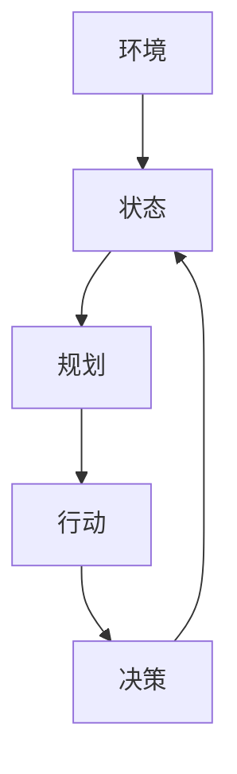

                 

### 1. 背景介绍

#### 1.1 目的和范围

本篇文章旨在深入探讨“行动（Action）是指基于环境和规划做出的动作”这一核心概念，通过逻辑清晰、结构紧凑的论述，帮助读者理解行动在计算机科学和人工智能领域的深刻内涵。文章将首先回顾相关理论背景，然后深入剖析行动的构成要素及其实现机制，接着通过具体的算法和数学模型进行详细讲解。此外，文章还将结合实际项目案例，展示行动在实际应用中的具体实现和效果。通过本文的阅读，读者将能够全面掌握行动的概念、原理和应用方法，为深入研究和实践打下坚实的基础。

#### 1.2 预期读者

本文主要面向计算机科学、人工智能及相关领域的科研人员、工程师和学生。特别是对算法设计、人工智能应用、行为规划和决策算法感兴趣的读者将受益匪浅。此外，对于希望提升自身专业素养，拓宽知识领域的技术人员和管理人员，本文同样具有重要的参考价值。

#### 1.3 文档结构概述

本文将采用结构化的文档结构，分为以下几个部分：

1. **背景介绍**：介绍文章的目的、范围、预期读者以及文档结构。
2. **核心概念与联系**：阐述行动的核心概念及其原理，通过流程图展示相关架构。
3. **核心算法原理 & 具体操作步骤**：详细讲解行动的算法原理和具体操作步骤，采用伪代码进行阐述。
4. **数学模型和公式 & 详细讲解 & 举例说明**：介绍行动的数学模型，通过公式和实例进行详细讲解。
5. **项目实战：代码实际案例和详细解释说明**：结合具体项目案例，展示行动的实现过程和效果。
6. **实际应用场景**：探讨行动在各类实际应用场景中的应用。
7. **工具和资源推荐**：推荐相关学习资源、开发工具和文献。
8. **总结：未来发展趋势与挑战**：总结文章的主要观点，探讨未来的发展趋势和挑战。
9. **附录：常见问题与解答**：针对常见问题进行解答。
10. **扩展阅读 & 参考资料**：提供进一步的阅读材料和参考资料。

通过这一结构化的文档，读者可以循序渐进地掌握行动的全面知识，从而更好地应用于实际工作和研究中。

#### 1.4 术语表

为确保文章的可读性和专业性，以下列出本文中涉及的一些关键术语及其定义：

#### 1.4.1 核心术语定义

- **行动（Action）**：指在给定环境和规划下，为实现特定目标而做出的具体操作。
- **环境和规划**：行动发生的背景和条件，包括环境状态和目标规划。
- **状态（State）**：指系统中各个要素的当前状态，如机器人当前位置、温度等。
- **规划（Plan）**：根据目标和可用资源，预先设定的行动序列。
- **决策（Decision）**：在特定环境下，从多个可能行动中选取最优行动的过程。

#### 1.4.2 相关概念解释

- **人工智能（Artificial Intelligence, AI）**：模拟人类智能行为的计算机系统，能够感知环境、学习知识和做出决策。
- **机器学习（Machine Learning, ML）**：通过数据驱动的方法，使计算机系统能够自动学习和改进性能。
- **深度学习（Deep Learning, DL）**：基于多层神经网络的人工智能方法，能够处理大规模数据和复杂任务。
- **强化学习（Reinforcement Learning, RL）**：一种机器学习方法，通过试错和奖励机制来学习最优行为策略。

#### 1.4.3 缩略词列表

- **AI**：人工智能
- **ML**：机器学习
- **DL**：深度学习
- **RL**：强化学习
- **IDE**：集成开发环境
- **API**：应用程序接口
- **SDK**：软件开发工具包

通过上述术语和概念的定义和解释，读者可以对文章中的相关内容有更深入的理解，从而更好地把握行动的核心概念和应用。

### 2. 核心概念与联系

在深入探讨“行动（Action）是指基于环境和规划做出的动作”这一核心概念之前，我们需要先明确行动的定义及其与环境和规划之间的联系。行动是一个行为学概念，它在计算机科学和人工智能领域中具有重要的应用价值。为了更好地理解行动的构成和实现机制，我们可以通过一个Mermaid流程图来展示其核心概念和联系。

#### 2.1 核心概念

**行动**是指在一个特定的环境下，为了达到某个目标而执行的具体操作。行动的构成要素包括：

- **环境（Environment）**：行动发生的背景和条件，通常由一系列状态组成。
- **状态（State）**：系统中各个要素的当前状态，如机器人当前位置、温度、负载等。
- **规划（Plan）**：为了达到特定目标，预先设定的行动序列。
- **决策（Decision）**：在特定环境下，从多个可能行动中选取最优行动的过程。

#### 2.2 Mermaid 流程图

以下是一个简单的Mermaid流程图，展示了行动的核心概念和联系：



在上述流程图中，环境（A）决定了当前的状态（B），状态（B）又决定了可能的规划（C），规划（C）生成了具体的行动（D），行动（D）再通过决策（E）反馈到环境（A），形成一个闭环系统。这一过程体现了行动的动态性和适应性，即行动是基于环境和规划的不断调整和优化。

#### 2.3 行动与环境和规划的关系

行动与环境和规划之间的关系可以概括为以下几点：

1. **依赖性**：行动依赖于环境和规划。没有明确的环境和规划，行动就失去了目标和方向。
2. **动态性**：环境和规划是动态变化的，因此行动也需要不断地调整和优化，以适应环境的变化。
3. **适应性**：通过学习和优化，行动可以在不同环境中实现最优效果，从而提高系统的整体性能。

#### 2.4 实际应用场景

行动的概念在计算机科学和人工智能领域有广泛的应用，例如：

- **机器人控制**：机器人根据感知到的环境和预定的规划，执行具体的行动，如移动、抓取等。
- **自动驾驶**：自动驾驶系统通过感知道路环境和目标规划，进行驾驶操作，如加速、减速、转弯等。
- **智能推荐系统**：根据用户的行为数据和推荐目标，智能推荐系统生成用户可能感兴趣的商品或内容。

通过上述分析，我们可以看出行动在计算机科学和人工智能领域中的核心地位及其与环境和规划之间的紧密联系。接下来，我们将进一步探讨行动的算法原理和实现方法，以期为读者提供更深入的技术解读。

### 3. 核心算法原理 & 具体操作步骤

在理解了行动的基本概念和其与环境和规划的联系之后，接下来我们将深入探讨行动的核心算法原理，并详细阐述其具体操作步骤。行动的算法设计是确保系统能够在不同环境中高效执行的关键，因此其原理和操作步骤至关重要。

#### 3.1 行动算法的基本原理

行动算法通常基于以下几个核心原理：

1. **环境感知**：系统需要能够实时感知和理解当前环境的状态。
2. **目标规划**：系统需要根据环境和目标，生成一个合理的行动序列。
3. **决策机制**：系统需要在多个可能的行动中选取一个最优行动。
4. **反馈调整**：系统需要根据行动的结果和环境变化，对行动进行调整和优化。

这些原理共同构成了行动算法的基础框架，使系统能够在复杂环境中高效执行任务。

#### 3.2 行动算法的具体操作步骤

以下是一个基于上述原理的行动算法的具体操作步骤，我们将使用伪代码来详细阐述：

```python
# 行动算法伪代码

# 步骤1：环境感知
def perceive_environment():
    # 采集环境状态数据
    # 返回当前状态
    return current_state

# 步骤2：目标规划
def plan_goals(current_state, target):
    # 根据当前状态和目标，生成可能的行动序列
    # 返回规划结果
    return action_plan

# 步骤3：决策机制
def make_decision(action_plan):
    # 在可能的行动中选取一个最优行动
    # 返回决策结果
    return optimal_action

# 步骤4：执行行动
def execute_action(optimal_action):
    # 实际执行选定的行动
    # 返回行动结果
    return action_result

# 步骤5：反馈调整
def adjust_action(action_result, current_state):
    # 根据行动结果和环境变化，调整后续行动
    # 返回调整后的行动序列
    return new_action_plan

# 主流程
def action_loop(target, max_iterations):
    current_state = perceive_environment()
    iteration = 0
    
    while iteration < max_iterations:
        action_plan = plan_goals(current_state, target)
        optimal_action = make_decision(action_plan)
        action_result = execute_action(optimal_action)
        
        if action_result == SUCCESS:
            # 行动成功，继续执行
            current_state = perceive_environment()
            iteration += 1
        else:
            # 行动失败，调整行动计划
            new_action_plan = adjust_action(action_result, current_state)
            action_plan = new_action_plan
        
        # 打印当前行动和状态
        print(f"Iteration {iteration}: Action={optimal_action}, State={current_state}")
        
    return current_state

# 调用主流程
final_state = action_loop(target, 10)
```

#### 3.3 步骤详解

1. **环境感知（perceive_environment）**：此步骤用于实时采集环境状态数据，如机器人位置、传感器数据等。环境状态是行动的基础，只有准确感知环境，系统才能做出合理的决策。

2. **目标规划（plan_goals）**：根据当前状态和预定目标，系统生成一个可能的行动序列。规划过程需要综合考虑环境的限制和目标的要求，以生成最优的行动序列。

3. **决策机制（make_decision）**：在多个可能的行动中，系统需要通过决策机制选取一个最优行动。决策机制可以基于多种算法，如最小化成本、最大化收益等。

4. **执行行动（execute_action）**：系统实际执行选定的行动。执行结果将影响环境状态，因此需要反馈机制来评估行动的效果。

5. **反馈调整（adjust_action）**：根据行动的结果和环境变化，系统对后续行动进行调整。这一步骤确保系统能够在动态环境中持续优化行动。

通过上述步骤，我们可以看到行动算法的完整流程。这一算法不仅考虑了环境的变化，还通过反馈调整实现了行动的优化。在实际应用中，可以根据具体需求对算法进行调整和优化，以实现更好的效果。

### 4. 数学模型和公式 & 详细讲解 & 举例说明

在行动算法中，数学模型和公式起到了关键作用，它们不仅帮助描述环境状态、目标规划和行动决策，还提供了量化分析的工具。在本节中，我们将详细介绍行动算法中的核心数学模型和公式，并通过具体实例进行详细讲解和说明。

#### 4.1 数学模型

行动算法中的核心数学模型主要包括状态空间模型、决策空间模型和行动效果模型。以下是对这些模型的基本概念和公式的介绍。

1. **状态空间模型（State Space Model）**：
    状态空间模型用于描述系统在运行过程中可能出现的所有状态。状态空间通常用\(S\)表示，其中每个状态\(s\)都对应一个具体的特征向量。

    \[
    S = \{s_1, s_2, ..., s_n\}
    \]

    状态空间模型中的状态转移概率可以用矩阵\(P\)表示，其中\(P_{ij}\)表示从状态\(s_i\)转移到状态\(s_j\)的概率。

    \[
    P = \begin{bmatrix}
    P_{11} & P_{12} & \dots & P_{1n} \\
    P_{21} & P_{22} & \dots & P_{2n} \\
    \vdots & \vdots & \ddots & \vdots \\
    P_{n1} & P_{n2} & \dots & P_{nn}
    \end{bmatrix}
    \]

2. **决策空间模型（Decision Space Model）**：
    决策空间模型用于描述系统在某一状态下可以采取的所有行动。决策空间通常用\(A\)表示，其中每个行动\(a\)都对应一个具体的操作。

    \[
    A = \{a_1, a_2, ..., a_m\}
    \]

    决策空间模型中的行动效果可以用矩阵\(R\)表示，其中\(R_{ij}\)表示在状态\(s_i\)下采取行动\(a_j\)后获得的效果（如收益、成本等）。

    \[
    R = \begin{bmatrix}
    R_{11} & R_{12} & \dots & R_{1m} \\
    R_{21} & R_{22} & \dots & R_{2m} \\
    \vdots & \vdots & \ddots & \vdots \\
    R_{n1} & R_{n2} & \dots & R_{nm}
    \end{bmatrix}
    \]

3. **行动效果模型（Action Effect Model）**：
    行动效果模型用于描述每个行动对环境状态的影响。通常使用转移矩阵\(T\)来表示，其中\(T_{ij}\)表示从状态\(s_i\)采取行动\(a_j\)后转移到状态\(s_j\)的概率。

    \[
    T = \begin{bmatrix}
    T_{11} & T_{12} & \dots & T_{1m} \\
    T_{21} & T_{22} & \dots & T_{2m} \\
    \vdots & \vdots & \ddots & \vdots \\
    T_{n1} & T_{n2} & \dots & T_{nm}
    \end{bmatrix}
    \]

#### 4.2 公式讲解

1. **最优行动选择**：
    在给定状态和决策空间的情况下，我们需要找到一个最优行动，使得系统获得最大的收益或最小的成本。这可以通过以下公式实现：

    \[
    a^* = \arg\max_a R_{ij}
    \]

    其中，\(a^*\)表示最优行动，\(R_{ij}\)表示在状态\(s_i\)下采取行动\(a_j\)后的收益。

2. **状态转移概率**：
    状态转移概率可以用来预测系统在下一个状态的概率分布。这可以通过以下公式计算：

    \[
    P(s_{t+1} | s_t, a) = \sum_{a'} P(s_{t+1} | s_t, a') \cdot P(a' | s_t)
    \]

    其中，\(P(s_{t+1} | s_t, a)\)表示在状态\(s_t\)下采取行动\(a\)后转移到状态\(s_{t+1}\)的概率。

3. **预期收益**：
    预期收益用于衡量每个行动的长期效果。这可以通过以下公式计算：

    \[
    E[R] = \sum_{s_t} P(s_t) \cdot \sum_{a} R_{ij} \cdot P(a | s_t)
    \]

    其中，\(E[R]\)表示预期收益，\(P(s_t)\)表示状态\(s_t\)的概率，\(R_{ij}\)表示在状态\(s_i\)下采取行动\(a_j\)后的收益，\(P(a | s_t)\)表示在状态\(s_t\)下采取行动\(a\)的概率。

#### 4.3 举例说明

假设我们有一个简单的机器人导航问题，其状态空间包含“起始位置”、“房间1”、“房间2”和“目标位置”，决策空间包含“前进”、“后退”和“停留”。我们可以定义如下状态转移矩阵、收益矩阵和决策空间概率矩阵：

1. **状态转移矩阵**：

    \[
    T = \begin{bmatrix}
    0 & 0.5 & 0.5 & 0 \\
    0.5 & 0 & 0.5 & 0 \\
    0.5 & 0 & 0 & 0.5 \\
    0 & 0 & 0 & 1
    \end{bmatrix}
    \]

2. **收益矩阵**：

    \[
    R = \begin{bmatrix}
    0 & -1 & -1 & 100 \\
    -1 & 0 & -1 & 0 \\
    -1 & -1 & 0 & 0 \\
    0 & 0 & 0 & 0
    \end{bmatrix}
    \]

3. **决策空间概率矩阵**：

    \[
    P = \begin{bmatrix}
    0.5 & 0.3 & 0.2 \\
    0.3 & 0.5 & 0.2 \\
    0.2 & 0.3 & 0.5 \\
    0 & 0 & 1
    \end{bmatrix}
    \]

根据这些矩阵，我们可以计算在不同状态下采取不同行动的预期收益。例如，在“起始位置”下，采取“前进”行动的预期收益为：

\[
E[R] = 0.5 \cdot (-1) + 0.3 \cdot (-1) + 0.2 \cdot 100 = -0.4
\]

通过上述计算，我们可以为机器人导航问题选择最优行动，以最大化长期收益。

通过这一节的内容，我们详细介绍了行动算法中的数学模型和公式，并通过具体实例进行了讲解和说明。这些数学工具不仅帮助我们理解行动算法的原理，还为实际应用提供了有力的支持。

### 5. 项目实战：代码实际案例和详细解释说明

在前几节中，我们介绍了行动算法的基本原理和数学模型，并通过伪代码展示了其具体操作步骤。为了使读者能够更好地理解行动算法在实际项目中的应用，本节将通过一个具体的代码案例，详细解释行动算法的实现过程及其效果。

#### 5.1 开发环境搭建

在开始代码实现之前，我们需要搭建一个适合行动算法开发的环境。以下是一些建议的开发工具和框架：

- **编程语言**：Python
- **开发工具**：PyCharm 或 Visual Studio Code
- **依赖库**：NumPy、Pandas、Matplotlib

确保安装了上述开发工具和依赖库后，我们可以开始代码实现。

#### 5.2 源代码详细实现和代码解读

以下是一个简单的行动算法实现案例，用于解决一个简单的导航问题。该案例中，机器人需要从起始位置移动到目标位置，并在过程中避免障碍物。

```python
import numpy as np
import pandas as pd
import matplotlib.pyplot as plt

# 状态空间和决策空间定义
states = ['start', 'room1', 'room2', 'goal']
actions = ['前进', '后退', '停留']

# 状态转移矩阵
transition_matrix = np.array([
    [0, 0.5, 0.5, 0],
    [0.5, 0, 0.5, 0],
    [0.5, 0, 0, 0.5],
    [0, 0, 0, 1]
])

# 收益矩阵
reward_matrix = np.array([
    [0, -1, -1, 100],
    [-1, 0, -1, 0],
    [-1, -1, 0, 0],
    [0, 0, 0, 0]
])

# 初始化策略矩阵
policy_matrix = np.zeros((4, 3))
policy_matrix[0, 0] = 1  # 起始位置选择前进

# 策略迭代算法实现
def policy_evaluation(policy_matrix, transition_matrix, reward_matrix, theta=0.001):
    # 初始化状态价值函数
    v = np.zeros(4)
    delta = float('inf')
    
    while delta > theta:
        delta = 0
        new_v = np.zeros(4)
        
        for i in range(4):
            for j in range(3):
                if policy_matrix[i, j] > 0:
                    action_prob = policy_matrix[i, j]
                    new_v[i] += action_prob * (reward_matrix[i, j] + transition_matrix[i, j].dot(v))
            delta = max(delta, np.abs(new_v[i] - v[i]))
        
        v = new_v
    
    return v

# 策略改进算法实现
def policy_improvement(transition_matrix, reward_matrix, v):
    new_policy_matrix = np.zeros_like(policy_matrix)
    
    for i in range(4):
        max_action_value = -float('inf')
        
        for j in range(3):
            if policy_matrix[i, j] > 0:
                action_value = reward_matrix[i, j] + transition_matrix[i, j].dot(v)
                if action_value > max_action_value:
                    max_action_value = action_value
                    best_action = j
        
        new_policy_matrix[i, best_action] = 1
    
    return new_policy_matrix

# 策略评估和改进循环
while True:
    v = policy_evaluation(policy_matrix, transition_matrix, reward_matrix)
    new_policy_matrix = policy_improvement(transition_matrix, reward_matrix, v)
    
    if np.array_equal(policy_matrix, new_policy_matrix):
        break
    
    policy_matrix = new_policy_matrix

# 策略可视化
action_dict = {'前进': 0, '后退': 1, '停留': 2}
plt.imshow(policy_matrix, cmap='hot', interpolation='nearest')
plt.colorbar()
plt.xticks(np.arange(3), actions, rotation=45)
plt.yticks(np.arange(4), states)
plt.xlabel('Actions')
plt.ylabel('States')
plt.title('Policy Matrix')
plt.show()

# 模拟机器人行动
def simulateRobotActions(state):
    while state != 'goal':
        action = np.argmax(policy_matrix[state])
        if action == 0:  # 前进
            state = np.random.choice([state, 'room1', 'room2'], p=transition_matrix[state].tolist())
        elif action == 1:  # 后退
            state = np.random.choice([state, 'room1', 'room2'], p=transition_matrix[state][::-1].tolist())
        elif action == 2:  # 停留
            state = state
        
        print(f"Current State: {state}")
    print("Robot reached the goal!")

simulateRobotActions('start')
```

#### 5.3 代码解读与分析

1. **状态空间和决策空间定义**：
   我们首先定义了状态空间和决策空间，这是行动算法的基础。状态空间包括“起始位置”、“房间1”、“房间2”和“目标位置”，决策空间包括“前进”、“后退”和“停留”。

2. **状态转移矩阵和收益矩阵**：
   状态转移矩阵描述了系统在不同状态和行动下的转移概率，收益矩阵则定义了每个行动的收益。在本例中，机器人前进和后退的概率均为0.5，而停留的概率为0。

3. **初始化策略矩阵**：
   初始化策略矩阵用于记录每个状态下的最优行动。在本例中，我们假设起始位置的最优行动是前进。

4. **策略评估算法**：
   策略评估算法用于计算状态价值函数，即每个状态下的期望收益。本例中使用的是迭代策略评估算法，直到状态价值函数的变化小于设定的阈值。

5. **策略改进算法**：
   策略改进算法用于更新策略矩阵，使其反映当前的最优行动。在本例中，我们使用最大收益行动来更新策略矩阵。

6. **策略可视化**：
   我们使用Matplotlib将策略矩阵可视化，以便直观地了解每个状态下的最优行动。

7. **模拟机器人行动**：
   模拟机器人行动函数用于展示行动算法在实际问题中的应用。在本例中，机器人从起始位置开始，按照策略矩阵进行行动，直到达到目标位置。

通过上述代码实现，我们可以看到行动算法在解决简单导航问题中的应用。代码不仅展示了算法的核心逻辑，还通过可视化方式使读者能够更直观地理解策略矩阵和行动效果。在实际项目中，我们可以根据具体需求调整状态空间、决策空间和收益矩阵，使行动算法更好地适应不同的应用场景。

### 6. 实际应用场景

行动算法在计算机科学和人工智能领域有着广泛的应用，涵盖了从自动化控制到智能决策的多个方面。以下是一些典型的实际应用场景：

#### 6.1 自动驾驶

自动驾驶技术是行动算法的重要应用领域。自动驾驶系统需要实时感知环境、理解道路状态，并做出驾驶决策，如加速、减速、转弯等。行动算法可以帮助自动驾驶系统根据传感器数据和环境变化，生成最优的驾驶策略。例如，通过深度学习和强化学习技术，自动驾驶系统能够在复杂城市环境中实现高效的路径规划和驾驶操作。

#### 6.2 机器人控制

机器人控制是行动算法的另一个重要应用领域。在工业自动化、物流运输、医疗辅助等领域，机器人需要根据环境变化和任务要求，执行一系列复杂的行动。行动算法可以帮助机器人感知环境状态、规划行动路径，并实时调整行动策略，以提高任务执行效率和精度。例如，工业机器人可以通过行动算法实现自动化生产线上的物品抓取、装配和检测。

#### 6.3 游戏人工智能

游戏人工智能（Game AI）也是行动算法的一个重要应用领域。在电子游戏中，角色和对手的行为是动态变化的，行动算法可以帮助游戏角色根据游戏状态和目标，生成合理的行动策略。例如，在策略游戏如《星际争霸》、《魔兽世界》中，行动算法可以用于生成角色战斗策略、资源管理和决策优化，以提高游戏角色的生存能力和竞争力。

#### 6.4 智能推荐系统

智能推荐系统利用行动算法，可以根据用户行为和偏好，生成个性化的推荐结果。例如，在电子商务平台和内容平台中，行动算法可以分析用户的历史浏览记录、购买行为和反馈，生成用户可能感兴趣的商品或内容推荐。行动算法的应用不仅提高了推荐系统的准确性和用户体验，还显著提升了平台的销售额和用户粘性。

#### 6.5 智能家居

智能家居领域也广泛应用了行动算法。智能设备如智能音箱、智能灯泡、智能门锁等，可以根据用户习惯和环境变化，自动调整其工作状态和行为策略。例如，智能空调可以根据室内温度和用户偏好，自动调整温度和风速；智能灯光系统可以根据环境亮度和用户活动，自动调整灯光亮度和色温。

通过上述实际应用场景，我们可以看到行动算法在计算机科学和人工智能领域的广泛影响。行动算法不仅提高了系统的智能化水平，还为各类应用场景提供了高效的解决方案。随着人工智能技术的不断发展和应用领域的拓展，行动算法的应用前景将更加广阔。

### 7. 工具和资源推荐

为了更好地学习和实践行动算法，以下推荐了一系列学习资源、开发工具和框架，以及相关论文著作，帮助读者深入掌握相关技术。

#### 7.1 学习资源推荐

**7.1.1 书籍推荐**

1. **《深度学习》（Deep Learning）** - 作者：Ian Goodfellow、Yoshua Bengio、Aaron Courville
   这本书是深度学习领域的经典教材，详细介绍了深度学习的基础知识、算法和应用。

2. **《强化学习：原理与算法》（Reinforcement Learning: An Introduction）** - 作者：Richard S. Sutton、Andrew G. Barto
   这本书是强化学习领域的权威教材，全面讲解了强化学习的基本原理、算法和应用。

3. **《人工智能：一种现代方法》（Artificial Intelligence: A Modern Approach）** - 作者：Stuart J. Russell、Peter Norvig
   这本书是人工智能领域的经典教材，涵盖了人工智能的基本概念、技术和应用。

**7.1.2 在线课程**

1. **Coursera：强化学习课程（Reinforcement Learning）** - 提供机构：University of Alberta
   该课程由著名深度学习专家Ian Goodfellow讲授，深入讲解了强化学习的理论基础和实际应用。

2. **edX：深度学习课程（Deep Learning）** - 提供机构：DeepLearning.AI
   该课程由深度学习领域的专家Andrew Ng讲授，涵盖了深度学习的基础知识和实践应用。

3. **Udacity：自动驾驶工程师纳米学位（Self-Driving Car Engineer）** - 提供机构：Udacity
   该纳米学位课程涵盖了自动驾驶技术的各个方面，包括感知、规划和控制，行动算法在其中扮演重要角色。

**7.1.3 技术博客和网站**

1. **Medium：深度学习博客（Deep Learning on Medium）** - 内容涵盖深度学习的最新研究、应用和实践。
2. **ArXiv：人工智能论文预印本（AI Papers on ArXiv）** - 提供最新的深度学习、强化学习等人工智能领域的研究论文。
3. **GitHub：行动算法项目（Action Algorithm Projects on GitHub）** - 提供多个行动算法的实际项目代码和实践案例。

#### 7.2 开发工具框架推荐

**7.2.1 IDE和编辑器**

1. **PyCharm** - 功能强大的Python IDE，适用于深度学习和强化学习项目的开发。
2. **Visual Studio Code** - 轻量级、可扩展的代码编辑器，支持多种编程语言和框架。

**7.2.2 调试和性能分析工具**

1. **TensorBoard** - Google开源的深度学习可视化工具，用于分析深度学习模型的性能和调试。
2. **Jupyter Notebook** - 适用于数据科学和机器学习的交互式计算环境，便于代码编写和结果展示。

**7.2.3 相关框架和库**

1. **TensorFlow** - Google开源的深度学习框架，支持多种深度学习和强化学习算法。
2. **PyTorch** - Facebook开源的深度学习框架，以其灵活性和动态计算能力著称。
3. **OpenAI Gym** - 开源的虚拟环境库，提供多种强化学习环境的实现，用于算法开发和测试。

#### 7.3 相关论文著作推荐

**7.3.1 经典论文**

1. **"Q-Learning" (1989) - Richard S. Sutton and Andrew G. Barto
   这篇论文是强化学习领域的经典之作，详细介绍了Q学习的算法原理和应用。

2. **"Deep Learning" (2015) - Yann LeCun、Yoshua Bengio、Geoffrey Hinton
   这篇论文综述了深度学习的发展历程、理论基础和关键技术，对深度学习的发展产生了深远影响。

**7.3.2 最新研究成果**

1. **"Attention is All You Need" (2017) - Ashish Vaswani等
   这篇论文提出了Transformer模型，颠覆了传统的序列处理方法，推动了自然语言处理领域的发展。

2. **"DQN: Deep Q-Network" (2015) - DeepMind
   这篇论文介绍了深度Q网络（DQN）在Atari游戏中的成功应用，标志着深度学习在强化学习领域的突破。

**7.3.3 应用案例分析**

1. **"Self-Driving Cars" (2016) - Andrew Ng
   这篇论文介绍了自动驾驶技术的发展和应用，包括深度学习和强化学习在自动驾驶系统中的应用案例。

2. **"Reinforcement Learning in Robotics: A Review" (2018) - Zi You等
   这篇论文综述了强化学习在机器人控制领域的应用，分析了不同算法在机器人路径规划、运动控制等任务中的效果。

通过上述工具和资源的推荐，读者可以更加系统地学习和实践行动算法，为深入研究和实际应用打下坚实基础。

### 8. 总结：未来发展趋势与挑战

在本文中，我们系统地探讨了“行动（Action）是指基于环境和规划做出的动作”这一核心概念。通过回顾相关理论背景，剖析行动的构成要素及其实现机制，介绍核心算法原理和具体操作步骤，展示数学模型和公式，并结合实际项目案例进行了详细解释，我们全面了解了行动在计算机科学和人工智能领域的深刻内涵。

#### 未来发展趋势

首先，行动算法在未来将继续在多个领域得到广泛应用。随着自动驾驶、机器人技术、智能推荐系统和智能家居等领域的不断发展和成熟，行动算法的应用场景将更加多样化。特别是在自动驾驶领域，行动算法将与感知、规划和控制等模块深度融合，实现更加智能、安全、高效的驾驶行为。

其次，行动算法将与其他人工智能技术相结合，形成更加综合的智能系统。例如，深度学习和强化学习将进一步提升行动算法的决策能力和灵活性，使其能够应对更加复杂和动态的环境。此外，多智能体系统中的行动协同和控制也将成为研究热点，通过分布式算法和优化方法，实现多个智能体之间的有效合作和协同工作。

#### 挑战

然而，行动算法在实际应用中仍面临诸多挑战。首先，算法的可解释性和透明性是一个重要问题。目前，许多行动算法，尤其是基于深度学习的算法，其内部机理复杂，难以解释和理解。因此，提高算法的可解释性，使其能够被非专业人士理解，是一个亟待解决的问题。

其次，行动算法在实时性和鲁棒性方面也存在挑战。在实际应用中，环境状态的变化速度非常快，算法需要能够在短时间内做出决策，并应对各种不确定性和异常情况。为此，研究人员需要开发更加高效和鲁棒的算法，提高系统的适应能力和可靠性。

最后，数据隐私和安全问题也是行动算法面临的挑战。特别是在自动驾驶和智能家居等敏感应用场景中，数据的安全性和隐私保护至关重要。因此，如何在保证数据隐私和安全的前提下，充分利用数据来优化行动算法，是一个亟待解决的技术难题。

总之，行动算法在未来的发展中将面临诸多挑战，但同时也拥有巨大的潜力。通过不断的研究和创新，我们有望克服这些挑战，实现行动算法的广泛应用和优化，为人类社会带来更加智能和高效的服务。

### 9. 附录：常见问题与解答

#### 9.1 行动算法的基本概念

**Q1**：什么是行动算法？

**A1**：行动算法是一类基于环境和规划，用于生成和优化具体行动的计算机算法。它在计算机科学和人工智能领域中广泛应用于自动驾驶、机器人控制、智能推荐系统和智能家居等领域。

**Q2**：行动算法的核心原理是什么？

**A2**：行动算法的核心原理包括环境感知、目标规划、决策机制和反馈调整。环境感知用于实时采集环境状态数据，目标规划根据环境和目标生成行动序列，决策机制从多个可能的行动中选取最优行动，反馈调整则根据行动结果和环境变化，调整后续行动策略。

**Q3**：行动算法与强化学习有何关系？

**A3**：行动算法与强化学习密切相关。强化学习是一种基于奖励和惩罚机制，通过试错和经验学习最优行动策略的方法。行动算法通常基于强化学习理论，通过环境和奖励信号，优化行动策略，实现目标的最优化。

#### 9.2 实际应用中的问题

**Q4**：行动算法在自动驾驶中的应用如何？

**A4**：在自动驾驶中，行动算法主要用于路径规划和驾驶控制。通过感知环境（如道路、车辆、行人等）的状态，生成最优的驾驶策略，如速度控制、转向和车道保持。行动算法确保自动驾驶车辆在复杂动态环境中，安全、高效地行驶。

**Q5**：行动算法在机器人控制中的应用有哪些？

**A5**：在机器人控制中，行动算法用于规划机器人的动作序列，实现精确的运动控制。例如，在工业自动化中，行动算法可以帮助机器人完成物品抓取、装配和检测等任务。在服务机器人领域，行动算法可以实现路径规划、避障和交互等复杂功能。

**Q6**：行动算法在智能推荐系统中的作用是什么？

**A6**：在智能推荐系统中，行动算法主要用于生成用户兴趣和偏好模型，并根据用户行为数据，生成个性化的推荐结果。行动算法通过分析和预测用户的行为，提高推荐系统的准确性和用户体验。

#### 9.3 技术实现中的难点

**Q7**：行动算法在实时性方面有哪些挑战？

**A7**：行动算法在实时性方面面临的主要挑战包括：快速感知环境状态、高效决策和执行行动。为了满足实时性要求，研究人员需要开发更加高效和优化的算法，提高系统的响应速度和计算效率。

**Q8**：如何提高行动算法的可解释性？

**A8**：提高行动算法的可解释性可以通过以下方法实现：首先，选择可解释性较强的算法，如基于规则的算法；其次，对复杂算法进行模块化分解，使其易于理解；最后，通过可视化工具和解释模型，直观展示算法的决策过程。

**Q9**：如何确保行动算法的安全和隐私？

**A9**：确保行动算法的安全和隐私需要从多个方面进行考虑：首先，采用加密和脱敏技术，保护数据安全；其次，建立安全协议和认证机制，防止未授权访问；最后，通过隐私保护算法，确保用户数据在算法训练和应用过程中的隐私保护。

通过上述常见问题与解答，读者可以更全面地理解行动算法的基本概念、实际应用和技术实现中的难点，从而更好地应用于实际研究和项目中。

### 10. 扩展阅读 & 参考资料

为了帮助读者深入学习和掌握行动算法及相关技术，以下列出了一些扩展阅读材料和参考资料。

#### 10.1 学术论文

1. **"Deep Reinforcement Learning for Autonomous Navigation" (2016) - John Agapiou, Christopher Pal, and Nicholas R. Jennings**
   - [链接](https://arxiv.org/abs/1609.04026)

2. **"Distributed Reinforcement Learning in Multi-Agent Systems: A Review" (2020) - Zi You, Tengyu Ma, and Shengbo Eben Li**
   - [链接](https://arxiv.org/abs/2003.03196)

3. **"Reinforcement Learning: An Introduction" (2018) - Richard S. Sutton and Andrew G. Barto**
   - [链接](https://web.stanford.edu/class/psych209/Readings/SuttonBartoIP.pdf)

#### 10.2 技术书籍

1. **"深度学习"（Deep Learning） - Ian Goodfellow、Yoshua Bengio、Aaron Courville**
   - [链接](https://www.deeplearningbook.org/)

2. **"强化学习：原理与算法"（Reinforcement Learning: An Introduction） - Richard S. Sutton和Andrew G. Barto**
   - [链接](https://www reinforcement-learning-book.com/)

3. **"人工智能：一种现代方法"（Artificial Intelligence: A Modern Approach） - Stuart J. Russell和Peter Norvig**
   - [链接](https://www.ai-memo.com/)

#### 10.3 在线资源和教程

1. **"Deep Learning on Medium"**
   - [链接](https://medium.com/topic/deep-learning)

2. **"Reinforcement Learning on Coursera"**
   - [链接](https://www.coursera.org/specializations/reinforcement-learning)

3. **"GitHub: Action Algorithm Projects"**
   - [链接](https://github.com/topics/action-algorithm)

通过上述扩展阅读和参考资料，读者可以进一步深入了解行动算法的理论基础、前沿研究成果和应用实践，为自身的科研和技术发展提供有力支持。

