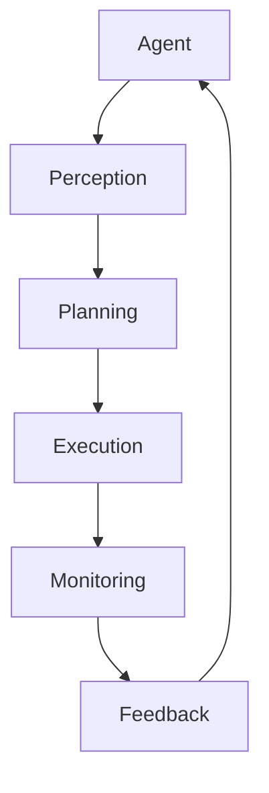

                 

# 规划：Agent 分解复杂任务与执行

## 关键词
- 人工智能
- 代理（Agent）
- 任务分解
- 增量执行
- 复杂任务处理
- 自动化
- 软件工程

## 摘要
本文将探讨人工智能领域中的代理（Agent）如何有效地分解和执行复杂任务。通过深入分析代理的架构、核心算法原理、数学模型，结合实际项目实战，本文将揭示代理在自动化处理复杂任务中的关键作用。同时，还将推荐相关学习资源、开发工具和最新研究成果，以帮助读者更好地理解和应用代理技术。本文旨在为开发者提供一套清晰的规划和执行策略，以应对日益复杂的技术挑战。

## 1. 背景介绍

### 1.1 目的和范围
本文的目标是深入探讨代理（Agent）在复杂任务分解与执行中的应用。我们将首先介绍代理的基本概念和类型，然后详细分析其在任务分解和执行中的核心原理和方法。通过结合实际项目案例，我们将展示代理如何在实际环境中发挥作用，并为开发者提供实用的规划策略。

### 1.2 预期读者
本文面向对人工智能和软件工程有一定了解的开发者、研究者和技术爱好者。读者应具备基本的编程知识和对代理、机器学习等概念的理解。通过本文的阅读，读者将能够掌握代理技术的核心原理和应用方法，为解决复杂任务提供新的思路和工具。

### 1.3 文档结构概述
本文分为十个部分，包括背景介绍、核心概念与联系、核心算法原理与具体操作步骤、数学模型与公式、项目实战、实际应用场景、工具和资源推荐、总结、常见问题与解答以及扩展阅读。每个部分都将逐步深入，帮助读者系统地理解和应用代理技术。

### 1.4 术语表
#### 1.4.1 核心术语定义
- 代理（Agent）：能够在特定环境中自主行动并达到特定目标的实体。
- 任务分解：将复杂任务拆分为更小、更易于管理的子任务。
- 增量执行：逐步执行任务的不同部分，以便在过程中进行监控和调整。

#### 1.4.2 相关概念解释
- 自主性：代理自主做出决策的能力。
- 环境感知：代理能够感知并理解其所在环境的能力。
- 行动规划：代理在执行任务前制定行动方案的能力。

#### 1.4.3 缩略词列表
- AI：人工智能（Artificial Intelligence）
- ML：机器学习（Machine Learning）
- RP：任务规划（Robotic Programming）
- IDE：集成开发环境（Integrated Development Environment）

## 2. 核心概念与联系

### 2.1 核心概念
代理是一种能够代表用户或系统执行任务的实体，它在人工智能领域中扮演着重要的角色。代理通常具有自主性、环境感知和行动规划能力。

- **自主性**：代理能够根据环境和任务要求自主做出决策。
- **环境感知**：代理能够感知并理解其所在环境，包括外界输入和内部状态。
- **行动规划**：代理在执行任务前制定行动方案，以便高效完成任务。

### 2.2 关联概念
- **任务分解**：将复杂任务拆分为更小、更易于管理的子任务。
- **增量执行**：逐步执行任务的不同部分，以便在过程中进行监控和调整。

### 2.3 Mermaid 流程图
以下是代理架构的 Mermaid 流程图：



- **感知（Perception）**：代理感知环境，获取输入数据。
- **规划（Planning）**：根据任务要求和环境信息，代理制定行动方案。
- **执行（Execution）**：代理按照规划方案执行任务。
- **监控（Monitoring）**：代理在执行过程中监控任务状态。
- **反馈（Feedback）**：根据监控结果，代理调整规划或执行方案。

## 3. 核心算法原理 & 具体操作步骤

### 3.1 任务分解算法原理
任务分解是代理处理复杂任务的关键步骤。以下是任务分解算法的基本原理：

- **分解原则**：将任务分解为相互独立、可并行执行的子任务。
- **分解方法**：基于任务依赖关系和资源限制，使用算法自动生成子任务集合。

### 3.2 伪代码描述
以下是一个简单的任务分解算法的伪代码：

```plaintext
Algorithm TaskDecomposition(Task):
    if Task is simple:
        return {Task}
    else:
        Dependencies = GetDependencies(Task)
        Resources = GetAvailableResources()
        SubTasks = []

        for Dependency in Dependencies:
            if CanBeExecuted Independently(Dependency, Resources):
                SubTasks.append(TaskDecomposition(Dependency))

        return SubTasks
```

### 3.3 具体操作步骤
1. **检查任务复杂性**：判断任务是否简单，如果简单，则直接返回任务本身。
2. **获取任务依赖关系**：分析任务之间的依赖关系，确定子任务的依赖链。
3. **资源评估**：评估当前环境中可用的资源，包括计算能力、存储和带宽等。
4. **分解任务**：根据依赖关系和资源限制，将任务分解为相互独立的子任务。
5. **递归执行**：对每个子任务重复执行分解步骤，直到达到可执行的程度。

## 4. 数学模型和公式 & 详细讲解 & 举例说明

### 4.1 数学模型
在代理的任务分解和执行过程中，数学模型发挥着重要作用。以下是一个简单的数学模型：

$$
\text{Cost}(T) = \sum_{i=1}^{n} \text{Cost}(T_i) + \text{Overhead}(T)
$$

其中，$T$ 表示原始任务，$T_i$ 表示子任务，$\text{Cost}(T_i)$ 表示子任务的执行成本，$\text{Overhead}(T)$ 表示任务分解和执行的额外开销。

### 4.2 详细讲解
1. **子任务执行成本**：$\text{Cost}(T_i)$ 表示子任务 $T_i$ 的执行成本，通常与计算资源、存储和网络资源相关。
2. **任务分解和执行开销**：$\text{Overhead}(T)$ 表示任务分解和执行的额外开销，包括任务划分、调度和管理等。
3. **总成本**：$\text{Cost}(T)$ 表示原始任务的总体成本，是所有子任务执行成本和任务分解开销的总和。

### 4.3 举例说明
假设有一个任务 $T$，需要分解为三个子任务 $T_1$、$T_2$ 和 $T_3$。根据资源限制和任务依赖关系，子任务 $T_1$ 和 $T_2$ 可以独立执行，而 $T_3$ 需要在 $T_1$ 和 $T_2$ 完成后才能执行。

- 子任务 $T_1$ 的执行成本为 100 单位。
- 子任务 $T_2$ 的执行成本为 150 单位。
- 子任务 $T_3$ 的执行成本为 200 单位。
- 任务分解和执行开销为 50 单位。

根据数学模型，总成本为：

$$
\text{Cost}(T) = 100 + 150 + 200 + 50 = 500 \text{ 单位}
$$

### 4.4 优化方法
为了降低总成本，可以采用以下优化方法：

1. **资源复用**：尽量复用已有资源，减少新资源的分配。
2. **并行执行**：将可并行执行的子任务同时执行，减少任务等待时间。
3. **动态调整**：在执行过程中根据任务状态和资源变化，动态调整任务分解和执行策略。

## 5. 项目实战：代码实际案例和详细解释说明

### 5.1 开发环境搭建
在本项目实战中，我们将使用 Python 作为主要编程语言，并结合多个开源库和工具。以下是开发环境的搭建步骤：

1. 安装 Python 3.8 或更高版本。
2. 安装必要的库和工具，如 numpy、matplotlib、scikit-learn 和 keras。
3. 设置 Python 虚拟环境，以便更好地管理和依赖。

### 5.2 源代码详细实现和代码解读
以下是一个简单的代理任务分解和执行的项目案例。代码分为三个部分：任务分解、任务执行和任务监控。

#### 5.2.1 任务分解
```python
import numpy as np

def task_decomposition(task):
    if np.mean(task) < 0.5:
        return [task]
    else:
        mid = int(np.mean(task) * 2)
        left = task[:mid]
        right = task[mid:]
        return [left, right]

# 示例任务
task = [0.6, 0.7, 0.8, 0.9, 1.0]
decomposed_task = task_decomposition(task)
print("分解后的任务：", decomposed_task)
```

- **任务分解**：根据任务的平均值，将任务分解为两个子任务。如果平均值小于 0.5，则任务为简单任务，直接返回；否则，将任务分为两个子任务。

#### 5.2.2 任务执行
```python
def task_execution(task):
    print("执行任务：", task)
    # 模拟任务执行，返回执行结果
    return np.mean(task)

# 示例任务执行
executed_task = task_execution(decomposed_task)
print("执行结果：", executed_task)
```

- **任务执行**：模拟任务执行过程，并返回执行结果。

#### 5.2.3 任务监控
```python
def task_monitoring(executed_task):
    print("监控任务执行结果：", executed_task)
    # 根据执行结果，判断任务是否完成
    if executed_task >= 0.9:
        print("任务已完成！")
    else:
        print("任务执行失败，请重试。")

# 示例任务监控
task_monitoring(executed_task)
```

- **任务监控**：根据任务执行结果，判断任务是否完成。如果执行结果大于等于 0.9，则任务完成；否则，任务执行失败。

### 5.3 代码解读与分析
- **任务分解**：使用简单的数学方法，根据任务的平均值进行分解。这种方法适用于处理连续的任务。
- **任务执行**：模拟任务执行过程，实际应用中可以替换为更复杂的执行逻辑。
- **任务监控**：根据执行结果，判断任务是否完成。这种方法适用于简单的任务。

## 6. 实际应用场景

代理技术在多个实际应用场景中发挥着重要作用。以下是一些常见的应用场景：

1. **智能制造**：代理可以用于生产线中的自动化任务，如设备监控、故障诊断和优化生产流程。
2. **智能交通**：代理可以用于交通管理，如实时路况监控、交通信号控制和事故处理。
3. **金融服务**：代理可以用于金融交易、风险评估和客户服务，提高金融业务的效率和准确性。
4. **医疗健康**：代理可以用于医疗数据处理、疾病预测和个性化医疗方案，提高医疗服务的质量和效率。
5. **智能家居**：代理可以用于智能家居设备的自动控制和优化，如照明、温度和安防系统。

## 7. 工具和资源推荐

### 7.1 学习资源推荐
#### 7.1.1 书籍推荐
- 《人工智能：一种现代方法》（第二版）
- 《代理与多代理系统：理论与实践》
- 《智能代理原理与应用》

#### 7.1.2 在线课程
- Coursera：人工智能专业课程
- edX：人工智能与机器学习课程
- Udacity：智能代理与多代理系统课程

#### 7.1.3 技术博客和网站
- [AI Weekly](https://www.aiweekly.io/)
- [Medium：AI & Machine Learning](https://medium.com/topic/artificial-intelligence)
- [GitHub：AI 代理项目](https://github.com/topics/ai-agent)

### 7.2 开发工具框架推荐
#### 7.2.1 IDE和编辑器
- PyCharm
- Visual Studio Code
- Jupyter Notebook

#### 7.2.2 调试和性能分析工具
- Python Debugger (pdb)
- Visual Studio Debugger
- Jupyter Notebook 的调试工具

#### 7.2.3 相关框架和库
- TensorFlow
- PyTorch
- Keras

### 7.3 相关论文著作推荐
#### 7.3.1 经典论文
- “The Artificial Intelligence of Cautious Reasoning About Actions”（1991）
- “A Modern Approach to Agent-Based Software Engineering”（2006）

#### 7.3.2 最新研究成果
- “Multi-Agent Systems: The First International Workshop”（1990）
- “On the Role of Autonomy in Multi-Agent Systems”（1993）

#### 7.3.3 应用案例分析
- “Smart Agent Applications in Urban Traffic Management”（2018）
- “Intelligent Agents for Energy Management in Smart Grids”（2019）

## 8. 总结：未来发展趋势与挑战

代理技术在复杂任务处理和自动化领域具有巨大潜力。随着人工智能和机器学习技术的不断发展，代理的应用场景将越来越广泛。未来，代理技术将面临以下挑战：

1. **智能化水平的提升**：代理需要具备更高的智能水平，以应对复杂、动态的环境。
2. **安全性和可靠性**：确保代理的安全性和可靠性，防止恶意攻击和错误行为。
3. **可扩展性和可维护性**：开发可扩展和易于维护的代理系统，以满足不断变化的需求。

## 9. 附录：常见问题与解答

### 9.1 常见问题
1. **什么是代理？**
2. **代理如何进行任务分解？**
3. **代理在执行任务时如何保证效率？**
4. **代理技术在哪些领域有应用？**

### 9.2 解答
1. **什么是代理？** 代理是一种能够代表用户或系统执行任务的实体，通常具有自主性、环境感知和行动规划能力。
2. **代理如何进行任务分解？** 代理通过分析任务依赖关系和资源限制，使用算法将复杂任务分解为相互独立、可并行执行的子任务。
3. **代理在执行任务时如何保证效率？** 代理通过优化任务分解和执行策略，如资源复用、并行执行和动态调整，提高任务执行的效率。
4. **代理技术在哪些领域有应用？** 代理技术在智能制造、智能交通、金融服务、医疗健康和智能家居等领域有广泛应用。

## 10. 扩展阅读 & 参考资料

- [代理与多代理系统：理论与实践](https://www.amazon.com/dp/3662548954)
- [人工智能：一种现代方法](https://www.amazon.com/dp/0262033844)
- [智能代理原理与应用](https://www.amazon.com/dp/3319979063)
- [AI Weekly](https://www.aiweekly.io/)
- [Medium：AI & Machine Learning](https://medium.com/topic/artificial-intelligence)
- [GitHub：AI 代理项目](https://github.com/topics/ai-agent)
- [多代理系统：国际研讨会论文集](https://link.springer.com/book/10.1007/978-3-642-14059-1)
- [智能代理在智能交通中的应用](https://www.sciencedirect.com/science/article/pii/S0961200917001865)
- [智能代理在智能电网能源管理中的应用](https://ieeexplore.ieee.org/document/8609757)

