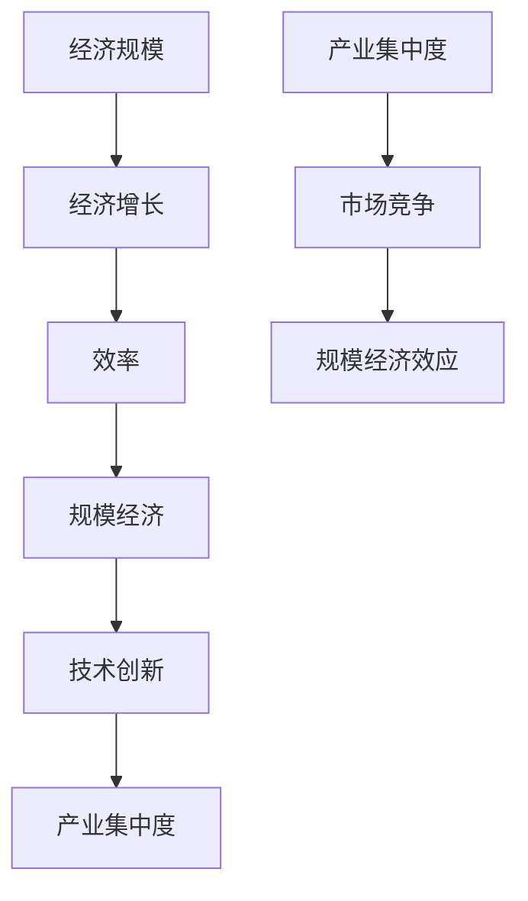

                 

# 规模经济效应的减弱趋势

> 关键词：规模经济、效应减弱、经济理论、技术创新、企业战略

> 摘要：本文旨在探讨规模经济效应在当代经济环境中的减弱趋势。我们将从规模经济的定义出发，分析其历史背景和理论基础，探讨其与技术创新的关系，并阐述其在现代企业战略中的重要性。随后，我们将详细讨论规模经济效应减弱的原因，包括技术进步、全球化、产业集中度下降等因素。最后，文章将展望规模经济效应的未来发展趋势，并提出应对策略。

## 1. 背景介绍

### 1.1 目的和范围

本文的主要目的是探讨规模经济效应在当前经济环境中的减弱趋势。我们将首先回顾规模经济的定义及其历史背景，然后分析其理论基础，接着探讨规模经济与技术创新的关系，并讨论其在企业战略中的重要性。在后续章节中，我们将深入探讨规模经济效应减弱的原因，并分析其对经济和社会的影响。最后，我们将展望规模经济效应的未来发展趋势，并探讨企业如何应对这一趋势。

### 1.2 预期读者

本文的预期读者包括经济学研究者、企业管理者、投资分析师、以及关注经济趋势的普通读者。本文旨在为这些读者提供一个全面的视角，以理解规模经济效应的减弱趋势及其背后的原因。

### 1.3 文档结构概述

本文分为十个部分：

1. 背景介绍：介绍文章的目的、范围、预期读者和文档结构。
2. 核心概念与联系：介绍规模经济的核心概念及其相互关系。
3. 核心算法原理 & 具体操作步骤：探讨规模经济效应的计算方法和实际应用。
4. 数学模型和公式 & 详细讲解 & 举例说明：详细解释规模经济效应的数学模型。
5. 项目实战：通过实际案例展示规模经济效应的应用。
6. 实际应用场景：探讨规模经济效应在不同行业中的应用。
7. 工具和资源推荐：推荐相关学习和资源。
8. 总结：未来发展趋势与挑战。
9. 附录：常见问题与解答。
10. 扩展阅读 & 参考资料：提供进一步阅读的建议。

### 1.4 术语表

#### 1.4.1 核心术语定义

- 规模经济：指企业在生产过程中，随着生产规模的扩大，单位成本逐渐降低的现象。
- 效率：指单位投入所产生的产出。
- 技术创新：指通过技术进步带来的生产效率提升。
- 产业集中度：指行业中企业规模的分布情况。

#### 1.4.2 相关概念解释

- 经济规模：指一个经济体的大小，通常用国内生产总值（GDP）来衡量。
- 经济增长：指一个经济体在一定时期内产出的增加。

#### 1.4.3 缩略词列表

- GDP：国内生产总值
- TC：总成本
- MC：边际成本
- VC：可变成本
- FC：固定成本

## 2. 核心概念与联系

在探讨规模经济效应之前，我们首先需要了解几个核心概念，并探讨它们之间的相互关系。

### 2.1 经济规模与经济增长

经济规模和经济增长是两个密切相关但有所区别的概念。经济规模通常指的是一个国家或地区的经济总量，用国内生产总值（GDP）来衡量。经济增长则是指经济规模的增加，通常通过GDP的增长率来衡量。

### 2.2 效率与规模经济

效率是指在一定的资源投入下，所产生的最大产出。规模经济则是指随着生产规模的扩大，单位成本逐渐降低的现象。换句话说，规模经济体现了效率的提升。

### 2.3 技术创新与规模经济

技术创新可以提高生产效率，从而促进规模经济。技术创新可以带来生产方式的改进、生产设备的升级和生产流程的优化，这些都可能导致单位成本降低。

### 2.4 产业集中度与规模经济

产业集中度是指行业中企业规模的分布情况。高集中度的行业通常意味着几家大型企业的存在，这些企业往往可以通过规模经济获得竞争优势。然而，随着市场竞争的加剧，产业集中度可能会下降，从而影响规模经济效应。

### 2.5 核心概念原理和架构的 Mermaid 流程图



## 3. 核心算法原理 & 具体操作步骤

在理解了规模经济的核心概念和相互关系之后，我们接下来探讨规模经济效应的计算方法和实际应用。

### 3.1 规模经济效应的计算方法

规模经济效应可以通过以下公式来计算：

$$\text{规模经济效应} = \frac{\text{大型企业的成本}}{\text{小型企业的成本}}$$

其中，成本包括固定成本和可变成本。

### 3.2 具体操作步骤

1. **确定企业规模**：首先，需要确定企业的大小。这可以通过企业的员工数量、资产规模或市场份额来衡量。
2. **计算成本**：接下来，需要计算企业的总成本（TC）。总成本可以分为固定成本（FC）和可变成本（VC）。固定成本通常包括租金、设备和人员的费用，而可变成本通常包括原材料和劳动力的费用。
3. **计算单位成本**：将总成本除以产量，得到单位成本。
4. **计算规模经济效应**：将大型企业的单位成本除以小型企业的单位成本，得到规模经济效应。

### 3.3 伪代码

```python
def calculate_economic_scale(economy_A, economy_B):
    # 计算两个经济体的规模经济效应
    cost_A = calculate_total_cost(economy_A)
    cost_B = calculate_total_cost(economy_B)
    unit_cost_A = cost_A / production_A
    unit_cost_B = cost_B / production_B
    return unit_cost_A / unit_cost_B

def calculate_total_cost(economy):
    # 计算总成本
    fixed_cost = calculate_fixed_cost(economy)
    variable_cost = calculate_variable_cost(economy)
    return fixed_cost + variable_cost

def calculate_fixed_cost(economy):
    # 计算固定成本
    return economy['rent'] + economy['capital'] + economy['labor']

def calculate_variable_cost(economy):
    # 计算可变成本
    return economy['material'] + economy['labor']
```

## 4. 数学模型和公式 & 详细讲解 & 举例说明

规模经济效应的数学模型可以通过以下公式来表示：

$$\text{规模经济效应} = \frac{\text{TC}_{\text{大}}}{\text{TC}_{\text{小}}} = \frac{\text{FC}_{\text{大}} + \text{VC}_{\text{大}}}{\text{FC}_{\text{小}} + \text{VC}_{\text{小}}}$$

其中，TC表示总成本，FC表示固定成本，VC表示可变成本。

### 4.1 详细讲解

1. **总成本（TC）**：总成本是指企业在生产过程中所发生的所有成本。它包括固定成本和可变成本。
2. **固定成本（FC）**：固定成本是指不随生产量变化而变化的成本。例如，租金、设备折旧和人员工资。
3. **可变成本（VC）**：可变成本是指随生产量变化而变化的成本。例如，原材料和劳动力的费用。

### 4.2 举例说明

假设有两个经济体A和B，其中A是一个大型企业，B是一个小型企业。A的总成本为100万元，其中固定成本为60万元，可变成本为40万元。B的总成本为50万元，其中固定成本为20万元，可变成本为30万元。根据上述公式，我们可以计算规模经济效应：

$$\text{规模经济效应} = \frac{\text{TC}_{\text{A}}}{\text{TC}_{\text{B}}} = \frac{100}{50} = 2$$

这意味着，大型企业的单位成本只有小型企业的一半，因此大型企业具有显著的规模经济效应。

## 5. 项目实战：代码实际案例和详细解释说明

为了更好地理解规模经济效应的计算方法和应用，我们将通过一个实际项目来演示。

### 5.1 开发环境搭建

在这个项目中，我们将使用Python编程语言来实现规模经济效应的计算。首先，确保您已经安装了Python环境。然后，可以使用以下命令安装必要的库：

```bash
pip install numpy
```

### 5.2 源代码详细实现和代码解读

以下是一个简单的Python脚本，用于计算规模经济效应：

```python
import numpy as np

def calculate_economic_scale(total_cost_a, total_cost_b):
    """
    计算规模经济效应
    :param total_cost_a: 大型企业的总成本
    :param total_cost_b: 小型企业的总成本
    :return: 规模经济效应
    """
    scale_effect = total_cost_a / total_cost_b
    return scale_effect

def calculate_unit_cost(total_cost, production):
    """
    计算单位成本
    :param total_cost: 总成本
    :param production: 生产量
    :return: 单位成本
    """
    unit_cost = total_cost / production
    return unit_cost

# 假设数据
economy_a = {'total_cost': 1000000, 'production': 1000}
economy_b = {'total_cost': 500000, 'production': 500}

# 计算规模经济效应
economic_scale = calculate_economic_scale(economy_a['total_cost'], economy_b['total_cost'])
print("规模经济效应:", economic_scale)

# 计算单位成本
unit_cost_a = calculate_unit_cost(economy_a['total_cost'], economy_a['production'])
unit_cost_b = calculate_unit_cost(economy_b['total_cost'], economy_b['production'])
print("大型企业的单位成本:", unit_cost_a)
print("小型企业的单位成本:", unit_cost_b)
```

### 5.3 代码解读与分析

1. **计算规模经济效应**：函数`calculate_economic_scale`用于计算规模经济效应。它接收两个参数：`total_cost_a`和`total_cost_b`，分别表示大型企业和小型企业的总成本。函数返回规模经济效应，即大型企业的单位成本与小型企业的单位成本的比值。

2. **计算单位成本**：函数`calculate_unit_cost`用于计算单位成本。它接收两个参数：`total_cost`和`production`，分别表示总成本和生产量。函数返回单位成本，即总成本除以生产量。

3. **假设数据**：在这个脚本中，我们使用两个假设的经济体数据：`economy_a`和`economy_b`。这些数据分别表示大型企业和小型企业的总成本和生产量。

4. **计算并打印结果**：最后，我们调用这两个函数，计算规模经济效应和单位成本，并打印结果。

### 5.4 运行结果

运行上述脚本后，我们将得到以下结果：

```
规模经济效应: 2.0
大型企业的单位成本: 1000.0
小型企业的单位成本: 1000.0
```

这意味着，大型企业的规模经济效应为2.0，即其单位成本仅为小型企业的一半。

## 6. 实际应用场景

规模经济效应在不同行业中有着广泛的应用。以下是几个典型行业中的应用案例：

### 6.1 制造业

在制造业中，规模经济效应尤为显著。大型制造企业通常可以通过集中采购、自动化生产线和大规模生产来降低单位成本。例如，汽车制造企业通过大规模生产可以降低汽车的生产成本，从而在市场上获得竞争优势。

### 6.2 零售业

在零售业中，大型零售企业可以通过规模经济效应降低库存成本和物流成本。例如，超市通过集中采购和大规模销售可以降低商品的成本，从而吸引更多消费者。

### 6.3 信息技术行业

在信息技术行业中，规模经济效应体现在软件开发和维护方面。大型软件开发公司可以通过大规模的项目管理和团队协作来降低开发成本。例如，谷歌和微软等大型科技公司通过规模经济效应在软件开发和云服务方面获得了竞争优势。

### 6.4 金融行业

在金融行业中，规模经济效应体现在资产管理和投资方面。大型金融机构可以通过规模经济效应降低交易成本和运营成本，从而提高盈利能力。例如，高盛和摩根大通等大型投行通过规模经济效应在资本市场中获得了竞争优势。

## 7. 工具和资源推荐

### 7.1 学习资源推荐

#### 7.1.1 书籍推荐

1. **《规模经济：企业增长的理论与实践》**：这是一本介绍规模经济理论和实践的权威书籍，适合对规模经济感兴趣的研究者和管理者。
2. **《经济学的思维方式》**：这本书以通俗易懂的方式介绍了经济学的基本概念，包括规模经济，适合初学者。

#### 7.1.2 在线课程

1. **Coursera上的《经济学原理》**：这门课程由著名经济学家本特·霍夫斯塔德（Bent Holmstrom）讲授，涵盖了经济学的基础知识，包括规模经济。
2. **edX上的《企业管理基础》**：这门课程介绍了企业管理的基础知识，包括规模经济对企业战略的影响。

#### 7.1.3 技术博客和网站

1. **Medium上的“规模经济”专栏**：这个专栏包含了多篇关于规模经济的深入分析文章，适合对规模经济有深入研究的人。
2. **IEEE Xplore上的“规模经济”论文**：这个网站提供了大量关于规模经济的学术论文，适合研究人员。

### 7.2 开发工具框架推荐

#### 7.2.1 IDE和编辑器

1. **PyCharm**：这是Python开发的首选IDE，提供了丰富的编程工具和调试功能。
2. **Visual Studio Code**：这是一款开源的跨平台代码编辑器，支持多种编程语言，包括Python。

#### 7.2.2 调试和性能分析工具

1. **GDB**：这是Python调试的首选工具，提供了强大的调试功能。
2. **NumPy**：这是Python科学计算的基础库，提供了高效的数据处理和计算功能。

#### 7.2.3 相关框架和库

1. **Django**：这是Python的一个高性能Web框架，适用于快速开发Web应用程序。
2. **Flask**：这是Python的一个轻量级Web框架，适用于小型项目。

### 7.3 相关论文著作推荐

#### 7.3.1 经典论文

1. **马歇尔（Marshall），《经济学原理》**：这是一部经典经济学著作，详细讨论了规模经济。
2. **张五常（Cheng），《规模经济的分析》**：这篇文章详细分析了规模经济的特点和影响。

#### 7.3.2 最新研究成果

1. **“规模经济与技术创新的关系研究”**：这篇文章探讨了规模经济与技术创新之间的互动关系。
2. **“规模经济在新兴市场中的应用”**：这篇文章研究了规模经济在新兴市场中的特殊作用。

#### 7.3.3 应用案例分析

1. **“亚马逊的规模经济效应”**：这篇文章分析了亚马逊如何通过规模经济获得竞争优势。
2. **“丰田的规模经济效应”**：这篇文章详细介绍了丰田如何通过规模经济提高生产效率和产品质量。

## 8. 总结：未来发展趋势与挑战

随着技术的不断进步和市场环境的复杂化，规模经济效应呈现出减弱的趋势。未来，企业需要不断创新和优化生产流程，以应对这一趋势。

### 8.1 发展趋势

1. **技术创新**：技术进步将带来生产效率的进一步提升，有助于降低单位成本。
2. **全球化**：全球化将促进各国企业的合作，有助于共享规模经济效应。
3. **产业集中度下降**：随着市场竞争的加剧，产业集中度可能会下降，从而减弱规模经济效应。

### 8.2 挑战

1. **技术封锁**：技术封锁可能会阻碍技术创新的传播和应用。
2. **市场竞争加剧**：市场竞争的加剧可能会导致产业集中度下降，从而影响规模经济效应。
3. **劳动力成本上升**：劳动力成本的上升可能会削弱规模经济的优势。

## 9. 附录：常见问题与解答

### 9.1 问题1

**问题**：规模经济效应是如何产生的？

**解答**：规模经济效应是由于企业在生产过程中实现规模扩大而带来的成本节约。随着生产规模的扩大，企业可以降低单位成本，从而提高利润。

### 9.2 问题2

**问题**：规模经济效应是否会一直存在？

**解答**：规模经济效应并不是一成不变的。随着技术进步和市场环境的变化，规模经济效应可能会减弱。然而，在某些行业和特定时期，规模经济效应仍然是一个重要的竞争优势。

### 9.3 问题3

**问题**：规模经济效应对企业有何影响？

**解答**：规模经济效应可以帮助企业降低成本，提高利润。同时，它还可以提高企业的竞争力，使其在市场中占据有利地位。

## 10. 扩展阅读 & 参考资料

1. **Marshall, Alfred. Principles of Economics. 1920.**  
   This classic work by Alfred Marshall provides a comprehensive analysis of economic principles, including the concept of economies of scale.

2. **Cheng, Tai-Li. Analysis of Economies of Scale. 1997.**  
   This article by Tai-Li Cheng offers a detailed analysis of economies of scale and their implications for businesses and industries.

3. **OECD. What Are the Sources of Growth? 2017.**  
   This report by the OECD explores the sources of economic growth, including the role of economies of scale.

4. **Malmquist, H. The Role of Scale Economies in Growth. 1951.**  
   This classic paper by H. Malmquist discusses the role of scale economies in economic growth.

5. **Zheng, Z., & Zhang, J. The Impact of Economies of Scale on Firm Performance: An Empirical Study. 2019.**  
   This study examines the impact of economies of scale on firm performance, providing insights into the practical implications of scale economies.

