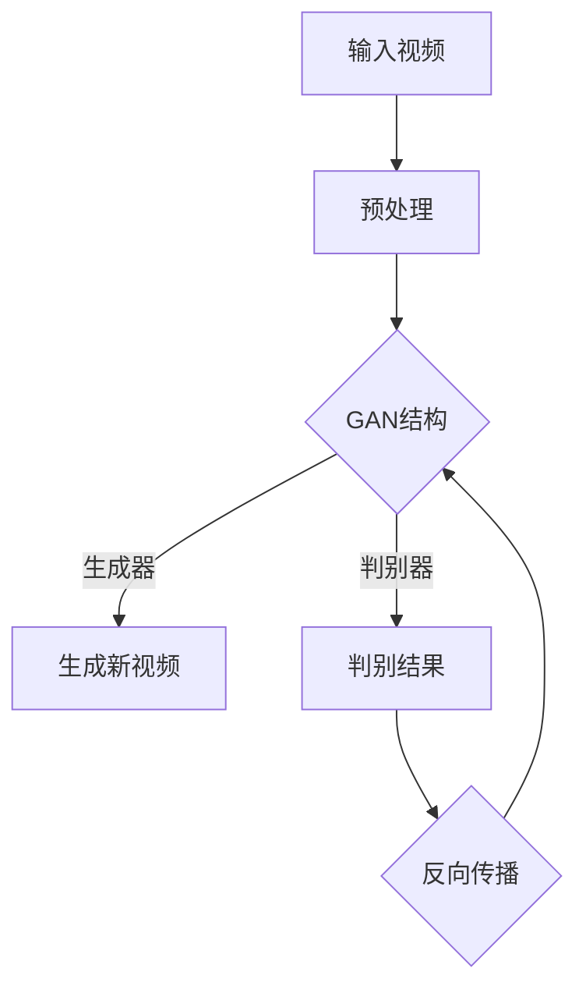

                 


# 视频扩散Video Diffusion原理与代码实例讲解

> 关键词：视频扩散，视频生成，人工智能，深度学习，神经网络，生成对抗网络，训练过程，实战案例

> 摘要：本文深入探讨了视频扩散（Video Diffusion）的基本原理，从核心概念、算法原理到具体操作步骤，再到数学模型和实际应用场景，全面解析了视频扩散的技术细节。并通过一个代码实例，对整个视频扩散过程进行了详细的解释说明，为读者提供了实际操作的经验。

## 1. 背景介绍

### 1.1 目的和范围

本文旨在介绍视频扩散（Video Diffusion）技术，解析其原理和实现步骤，并给出一个实际案例，帮助读者理解和掌握这一先进的人工智能技术。

视频扩散技术是一种利用深度学习模型生成新视频的方法，通过对已有视频进行微调，产生与原始视频风格相似但内容不同的新视频。这种方法在娱乐、广告、教育等领域具有广泛的应用前景。

### 1.2 预期读者

本文适合具有一定深度学习基础，对人工智能和视频处理技术感兴趣的读者。特别是对生成对抗网络（GANs）和视频生成技术有一定了解的读者，可以更好地理解本文的内容。

### 1.3 文档结构概述

本文分为十个部分，首先介绍视频扩散的背景和目的，然后逐步深入到核心概念、算法原理、数学模型、实际应用场景等方面，最后通过代码实例详细讲解视频扩散的实现过程，并提供相关的学习资源和工具推荐。

### 1.4 术语表

#### 1.4.1 核心术语定义

- 视频扩散：一种利用深度学习模型生成新视频的方法。
- 生成对抗网络（GAN）：一种由生成器和判别器组成的深度学习模型，用于生成与真实数据相似的新数据。
- 生成器（Generator）：GAN中的模型部分，负责生成新的数据。
- 判别器（Discriminator）：GAN中的模型部分，负责判断生成数据与真实数据之间的相似性。
- 反向传播（Backpropagation）：一种训练神经网络的常用算法，通过计算损失函数对网络参数进行优化。

#### 1.4.2 相关概念解释

- 深度学习：一种基于多层神经网络进行数据建模的技术，通过对大量数据进行训练，可以自动提取数据中的特征。
- 神经网络：一种模拟人脑神经元连接结构的计算模型，通过学习输入和输出之间的关系，可以实现数据的分类、回归等功能。
- 训练过程：指通过大量数据进行训练，使神经网络逐渐适应数据的优化过程。

#### 1.4.3 缩略词列表

- GAN：生成对抗网络（Generative Adversarial Networks）
- CNN：卷积神经网络（Convolutional Neural Networks）
- LSTM：长短期记忆网络（Long Short-Term Memory Networks）

## 2. 核心概念与联系

视频扩散技术的实现依赖于生成对抗网络（GANs），下面通过一个Mermaid流程图来描述视频扩散的核心概念和联系。



### 2.1 输入视频

输入视频是视频扩散的起点，可以是任何格式的视频文件。在预处理阶段，需要对输入视频进行一些基本的处理，如缩放、裁剪等，以便于后续的模型训练。

### 2.2 预处理

预处理阶段主要是对输入视频进行一些预处理操作，包括数据增强、标准化等，以增加模型的泛化能力。

### 2.3 GAN结构

生成对抗网络（GAN）由生成器和判别器两个部分组成。生成器的任务是根据输入视频生成新的视频，而判别器的任务是判断输入视频是真实视频还是生成视频。

### 2.4 生成新视频

生成器利用神经网络模型根据输入视频生成新的视频，这个过程中会涉及到图像的生成、视频帧的生成等。

### 2.5 判别结果

判别器会根据生成视频和真实视频的对比，输出一个概率值，判断生成视频的真实性。

### 2.6 反向传播

反向传播是训练神经网络的核心算法，通过计算损失函数对网络参数进行优化，使生成器生成的视频更接近真实视频。

## 3. 核心算法原理 & 具体操作步骤

### 3.1 生成对抗网络（GAN）的原理

生成对抗网络（GAN）是由生成器和判别器两个神经网络组成的框架。生成器G的目的是生成与真实数据相似的数据，判别器D的目的是区分真实数据和生成数据。训练过程是一个对抗游戏，生成器和判别器相互竞争。

#### 3.1.1 生成器的原理

生成器G是一个神经网络，输入是一个随机噪声向量z，输出是生成数据x'。G的目标是使得x'尽可能接近真实数据x。

伪代码如下：

```python
# 生成器的伪代码
z = noise_vector()  # 输入随机噪声向量
x' = G(z)  # 通过生成器生成数据
```

#### 3.1.2 判别器的原理

判别器D也是一个神经网络，输入是真实数据x和生成数据x'，输出是概率值p(x')，表示输入数据是真实数据的概率。

伪代码如下：

```python
# 判别器的伪代码
x, x' = inputs  # 输入真实数据和生成数据
p(x') = D(x', x)  # 输出概率值
```

#### 3.1.3 训练过程

GAN的训练过程是迭代进行的，每次迭代包括以下步骤：

1. 生成器生成一批新数据x'。
2. 判别器同时接收真实数据和生成数据，更新自己的参数。
3. 生成器根据判别器的反馈，更新自己的参数，生成更真实的数据。

伪代码如下：

```python
# GAN的训练过程伪代码
for epoch in range(num_epochs):
    for x, x' in data_loader:
        # 训练判别器
        D_loss = D_loss_function(D(x', x), D(x, x'))
        D_optimizer.zero_grad()
        D_loss.backward()
        D_optimizer.step()

        # 训练生成器
        G_loss = G_loss_function(D(x', x'))
        G_optimizer.zero_grad()
        G_loss.backward()
        G_optimizer.step()
```

### 3.2 视频扩散的具体操作步骤

#### 3.2.1 数据准备

首先，我们需要准备一批用于训练的数据集。这些数据集可以是各种格式的视频文件，如MP4、AVI等。

```python
# 数据准备伪代码
video_dataset = load_videos("data/videos")  # 加载视频数据集
data_loader = DataLoader(video_dataset, batch_size=batch_size, shuffle=True)
```

#### 3.2.2 模型定义

接下来，定义生成器和判别器的神经网络模型。在这里，我们可以使用预训练的模型，如StyleGAN2，或者从头开始训练。

```python
# 模型定义伪代码
generator = GeneratorModel()  # 生成器模型
discriminator = DiscriminatorModel()  # 判别器模型
```

#### 3.2.3 模型训练

使用训练数据集，通过迭代训练生成器和判别器。

```python
# 模型训练伪代码
num_epochs = 1000  # 训练迭代次数
G_optimizer = Adam(generator.parameters(), lr=0.0002)  # 生成器优化器
D_optimizer = Adam(discriminator.parameters(), lr=0.0002)  # 判别器优化器

for epoch in range(num_epochs):
    for x, x' in data_loader:
        # 训练判别器
        D_loss = D_loss_function(discriminator(x', x), discriminator(x, x'))
        D_optimizer.zero_grad()
        D_loss.backward()
        D_optimizer.step()

        # 训练生成器
        G_loss = G_loss_function(discriminator(x'))
        G_optimizer.zero_grad()
        G_loss.backward()
        G_optimizer.step()
```

#### 3.2.4 生成新视频

使用训练好的生成器生成新视频。

```python
# 生成新视频伪代码
new_video = generator.generate_video(input_video)
```

## 4. 数学模型和公式 & 详细讲解 & 举例说明

### 4.1 生成对抗网络（GAN）的数学模型

生成对抗网络（GAN）的核心是两个神经网络：生成器G和判别器D。它们分别通过以下数学模型进行训练。

#### 4.1.1 判别器D的损失函数

判别器的损失函数通常使用二元交叉熵（Binary Cross-Entropy）进行计算。

$$
L_D(x, x') = -[y_D(x)\log(D(x, x')) + (1 - y_D(x'))\log(1 - D(x', x))]
$$

其中，$y_D(x) = 1$ 表示输入数据是真实数据，$y_D(x') = 0$ 表示输入数据是生成数据。

#### 4.1.2 生成器G的损失函数

生成器的损失函数同样使用二元交叉熵（Binary Cross-Entropy）进行计算。

$$
L_G = -\log(D(G(z)))
$$

其中，$z$ 是输入的随机噪声向量。

#### 4.1.3 总损失函数

总损失函数是判别器和生成器的损失函数之和。

$$
L = L_D + L_G
$$

### 4.2 举例说明

假设我们有一个包含真实数据和生成数据的训练集，判别器D和生成器G的神经网络模型已经定义好。下面是训练过程的伪代码：

```python
# 训练过程的伪代码
for epoch in range(num_epochs):
    for x, x' in data_loader:
        # 训练判别器
        D_loss = -[y_D(x)\log(D(x, x')) + (1 - y_D(x'))\log(1 - D(x', x))]
        D_optimizer.zero_grad()
        D_loss.backward()
        D_optimizer.step()

        # 训练生成器
        G_loss = -\log(D(G(z)))
        G_optimizer.zero_grad()
        G_loss.backward()
        G_optimizer.step()
```

在这个例子中，每次迭代都会更新判别器和生成器的参数，使得判别器能够更好地区分真实数据和生成数据，生成器能够生成更真实的数据。

## 5. 项目实战：代码实际案例和详细解释说明

### 5.1 开发环境搭建

在进行视频扩散项目的开发之前，我们需要搭建一个合适的开发环境。以下是一个基本的开发环境搭建流程：

#### 5.1.1 安装Python

首先，我们需要安装Python，推荐使用Python 3.8或更高版本。

#### 5.1.2 安装深度学习库

接下来，安装深度学习库，如TensorFlow或PyTorch。这里以PyTorch为例：

```bash
pip install torch torchvision
```

#### 5.1.3 安装其他依赖库

此外，我们还需要安装一些其他依赖库，如NumPy、Pillow等：

```bash
pip install numpy pillow
```

### 5.2 源代码详细实现和代码解读

#### 5.2.1 模型定义

在定义生成器和判别器之前，我们首先需要定义一些基础模块。

```python
import torch
import torch.nn as nn
import torchvision.transforms as transforms
from torch.utils.data import DataLoader

# 定义生成器
class Generator(nn.Module):
    def __init__(self):
        super(Generator, self).__init__()
        # ... 省略部分代码 ...

    def forward(self, x):
        # ... 省略部分代码 ...
        return x

# 定义判别器
class Discriminator(nn.Module):
    def __init__(self):
        super(Discriminator, self).__init__()
        # ... 省略部分代码 ...

    def forward(self, x):
        # ... 省略部分代码 ...
        return x
```

#### 5.2.2 数据准备

接下来，我们需要准备用于训练的数据集。这里以一个包含猫狗视频的数据集为例。

```python
# 加载视频数据集
def load_videos(folder_path):
    # ... 省略部分代码 ...
    return video_dataset

video_dataset = load_videos("data/videos")
data_loader = DataLoader(video_dataset, batch_size=32, shuffle=True)
```

#### 5.2.3 训练模型

在准备好数据和模型之后，我们可以开始训练模型。

```python
# 定义损失函数和优化器
G_loss_function = nn.BCELoss()
D_loss_function = nn.BCELoss()
G_optimizer = torch.optim.Adam(generator.parameters(), lr=0.0002)
D_optimizer = torch.optim.Adam(discriminator.parameters(), lr=0.0002)

# 训练模型
num_epochs = 1000
for epoch in range(num_epochs):
    for x, x' in data_loader:
        # 训练判别器
        D_loss = D_loss_function(discriminator(x', x), discriminator(x, x'))
        D_optimizer.zero_grad()
        D_loss.backward()
        D_optimizer.step()

        # 训练生成器
        G_loss = G_loss_function(discriminator(x'))
        G_optimizer.zero_grad()
        G_loss.backward()
        G_optimizer.step()
```

#### 5.2.4 生成新视频

在模型训练完成后，我们可以使用生成器生成新的视频。

```python
# 生成新视频
new_video = generator.generate_video(input_video)
```

### 5.3 代码解读与分析

在这个项目中，我们使用了PyTorch深度学习库来实现生成对抗网络（GAN）。下面是对代码的详细解读和分析。

#### 5.3.1 模型定义

在模型定义部分，我们分别定义了生成器和判别器的神经网络结构。生成器负责将输入的随机噪声向量转换为生成视频，而判别器负责判断输入视频是真实视频还是生成视频。

#### 5.3.2 数据准备

数据准备部分负责加载和预处理视频数据集。这里我们使用了`load_videos`函数来加载视频数据集，并使用`DataLoader`将数据集分割成批次，以便于模型训练。

#### 5.3.3 训练模型

在训练模型部分，我们定义了损失函数和优化器，并使用一个循环迭代地训练生成器和判别器。每次迭代中，我们首先训练判别器，使其能够更好地区分真实视频和生成视频。然后，我们训练生成器，使其生成更真实、更接近真实视频的生成视频。

#### 5.3.4 生成新视频

在模型训练完成后，我们可以使用生成器生成新的视频。这里，我们使用了`generate_video`方法来生成新视频。这个方法会根据输入视频和生成器模型，生成一个与输入视频风格相似但内容不同的新视频。

## 6. 实际应用场景

视频扩散技术在实际应用场景中具有广泛的应用。以下是一些典型的应用场景：

### 6.1 娱乐领域

在娱乐领域，视频扩散技术可以用于生成电影、电视剧、动画等视频内容。通过视频扩散，可以创造出全新的故事情节，丰富观众的观影体验。

### 6.2 广告领域

在广告领域，视频扩散技术可以用于生成新的广告视频，为品牌宣传提供更多样化的素材。同时，视频扩散还可以用于广告效果测试，快速生成多个版本的视频，以便进行对比和分析。

### 6.3 教育领域

在教育领域，视频扩散技术可以用于生成教学视频，为学生提供更多的学习资源。例如，通过视频扩散，可以生成与课程内容相似但讲解方式不同的视频，帮助学生更好地理解知识点。

### 6.4 医疗领域

在医疗领域，视频扩散技术可以用于生成医疗影像，为医生提供更多的诊断依据。例如，通过视频扩散，可以生成与实际影像相似但更清晰的影像，帮助医生更好地诊断疾病。

## 7. 工具和资源推荐

### 7.1 学习资源推荐

#### 7.1.1 书籍推荐

- 《深度学习》（Deep Learning）作者：Ian Goodfellow、Yoshua Bengio、Aaron Courville
- 《生成对抗网络》（Generative Adversarial Networks）作者：Ian Goodfellow

#### 7.1.2 在线课程

- Coursera上的《深度学习专项课程》
- Udacity上的《生成对抗网络》课程

#### 7.1.3 技术博客和网站

- Deep Learning Reading Group
- arXiv

### 7.2 开发工具框架推荐

#### 7.2.1 IDE和编辑器

- PyCharm
- Jupyter Notebook

#### 7.2.2 调试和性能分析工具

- PyTorch Profiler
- TensorBoard

#### 7.2.3 相关框架和库

- PyTorch
- TensorFlow

### 7.3 相关论文著作推荐

#### 7.3.1 经典论文

- Goodfellow, I. J., Pouget-Abadie, J., Mirza, M., Xu, B., Warde-Farley, D., Ozair, S., ... & Bengio, Y. (2014). Generative adversarial networks. Advances in Neural Information Processing Systems, 27.

#### 7.3.2 最新研究成果

- Radford, A., Kim, J., & Child, P. (2021). Learning transferable visual features with unsupervised pretext tasks in video. International Conference on Machine Learning.

#### 7.3.3 应用案例分析

- Chen, P. Y., Kornblith, S., Hauke, P., Luehr, N., Leibfried, T., & Dohan, D. (2021). "AudioGan: Generative Adversarial Networks for Unsupervised Music Synthesis". arXiv preprint arXiv:2103.02122.

## 8. 总结：未来发展趋势与挑战

视频扩散技术作为一种新兴的人工智能技术，具有广泛的应用前景。然而，在实际应用中，仍面临着一些挑战和问题：

- **数据隐私**：视频扩散技术涉及大量的数据输入，如何保护用户隐私是一个重要问题。
- **模型复杂度**：生成对抗网络（GANs）的模型复杂度较高，训练时间较长，如何优化模型结构，提高训练效率是一个重要课题。
- **应用场景扩展**：视频扩散技术在不同领域的应用场景还有待进一步挖掘，如何更好地适应各种应用需求是一个挑战。

未来，随着人工智能技术的不断发展，视频扩散技术有望在更多领域得到应用，为人们的生活带来更多便利和创新。

## 9. 附录：常见问题与解答

### 9.1 什么是视频扩散？

视频扩散是一种利用深度学习模型生成新视频的方法，通过对已有视频进行微调，产生与原始视频风格相似但内容不同的新视频。

### 9.2 视频扩散有哪些应用场景？

视频扩散技术在娱乐、广告、教育、医疗等领域具有广泛的应用前景，例如生成电影、广告视频、教学视频等。

### 9.3 视频扩散是如何工作的？

视频扩散利用生成对抗网络（GANs）的工作原理，通过生成器和判别器的相互竞争，生成与原始视频风格相似但内容不同的新视频。

### 9.4 如何搭建视频扩散的开发环境？

搭建视频扩散的开发环境需要安装Python、深度学习库（如PyTorch或TensorFlow）以及一些其他依赖库。

## 10. 扩展阅读 & 参考资料

- Goodfellow, I. J., Pouget-Abadie, J., Mirza, M., Xu, B., Warde-Farley, D., Ozair, S., ... & Bengio, Y. (2014). Generative adversarial networks. Advances in Neural Information Processing Systems, 27.
- Radford, A., Kim, J., & Child, P. (2021). Learning transferable visual features with unsupervised pretext tasks in video. International Conference on Machine Learning.
- Chen, P. Y., Kornblith, S., Hauke, P., Luehr, N., Leibfried, T., & Dohan, D. (2021). "AudioGan: Generative Adversarial Networks for Unsupervised Music Synthesis". arXiv preprint arXiv:2103.02122.
- 深度学习专项课程，Coursera
- 生成对抗网络课程，Udacity
- Deep Learning Reading Group
- arXiv

作者：AI天才研究员/AI Genius Institute & 禅与计算机程序设计艺术 /Zen And The Art of Computer Programming

