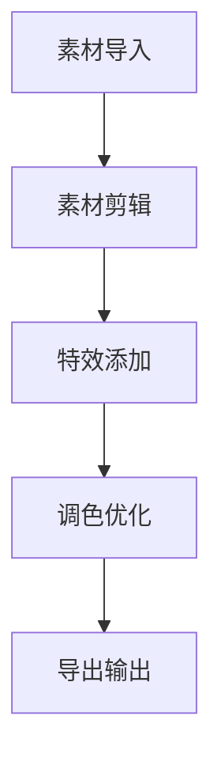

                 

# 视频编辑软件：人人都是内容创作者

> **关键词：**视频编辑，内容创作，人工智能，用户体验，视频处理算法，开源工具

> **摘要：**本文将探讨视频编辑软件的发展，如何通过人工智能技术提升用户体验，实现人人都是内容创作者的目标。文章将从背景介绍、核心概念与联系、算法原理与步骤、数学模型与公式、实际应用场景、工具与资源推荐等多个方面详细分析，旨在为读者提供深入了解视频编辑领域的技术与实践指导。

## 1. 背景介绍

### 1.1 目的和范围

本文旨在分析视频编辑软件的现状与未来发展趋势，通过探讨人工智能在视频编辑领域的应用，探讨如何提升用户的创作体验，实现视频编辑软件的普及化与智能化。文章将涵盖视频编辑的基本概念、核心算法、数学模型、实际应用场景以及相关工具和资源。

### 1.2 预期读者

本文适合对视频编辑、人工智能、软件工程感兴趣的读者，包括程序员、软件工程师、产品经理、设计师以及对视频创作有兴趣的普通用户。

### 1.3 文档结构概述

本文分为十个部分，首先介绍视频编辑软件的背景和目的，然后逐步深入探讨视频编辑的核心概念、算法原理、数学模型、应用场景等，最后推荐相关工具和资源，并对未来发展趋势进行总结。

### 1.4 术语表

#### 1.4.1 核心术语定义

- 视频编辑：对视频素材进行剪辑、特效添加、调色等处理，使其达到预期效果的过程。
- 人工智能：模拟人类智能的计算机系统，能够进行学习、推理、感知等高级认知功能。
- 用户体验（UX）：用户在使用产品或服务过程中的感受和体验。
- 视频处理算法：用于处理视频数据的一系列数学模型和计算方法。

#### 1.4.2 相关概念解释

- 视频格式：视频文件的存储方式，包括编码、分辨率、帧率等。
- 视频编码：将视频信号转换为数字信号的过程，常用的编码格式有H.264、HEVC等。
- 视频合成：将多个视频素材合并成一个新的视频文件的过程。

#### 1.4.3 缩略词列表

- AI：人工智能（Artificial Intelligence）
- UX：用户体验（User Experience）
- GPU：图形处理单元（Graphics Processing Unit）
- CPU：中央处理单元（Central Processing Unit）
- NLE：非线性编辑（Nonlinear Editing）

## 2. 核心概念与联系

### 2.1 视频编辑软件的基本概念

视频编辑软件是一种能够帮助用户对视频素材进行剪辑、特效添加、调色等处理的应用程序。随着计算机技术和人工智能的发展，视频编辑软件逐渐实现了智能化、自动化和个性化，为用户提供了更加便捷的创作工具。

### 2.2 人工智能在视频编辑中的应用

人工智能技术在视频编辑中的应用主要集中在以下几个方面：

- **内容识别**：通过深度学习算法识别视频中的物体、场景、人物等，实现自动标签和分类。
- **智能剪辑**：根据用户设定的主题或场景，自动剪辑视频素材，生成创意视频。
- **特效生成**：利用神经网络生成各种视频特效，如动态字幕、卡通化、特效滤镜等。
- **调色优化**：通过深度学习算法自动调整视频的色彩，提升画面质量。

### 2.3 视频编辑软件的工作流程

视频编辑软件的工作流程主要包括以下几个步骤：

1. **素材导入**：将各种视频、音频、图片等素材导入到编辑软件中。
2. **素材剪辑**：对素材进行剪辑、分割、组合等操作，形成初步的编辑素材。
3. **特效添加**：为视频素材添加各种特效，如转场、滤镜、字幕等。
4. **调色优化**：调整视频的色彩、亮度、对比度等参数，优化画面质量。
5. **导出输出**：将编辑完成的视频导出为各种常见的视频格式，如MP4、AVI等。

### 2.4 Mermaid 流程图



## 3. 核心算法原理 & 具体操作步骤

### 3.1 视频处理算法原理

视频处理算法主要包括以下几个核心部分：

- **视频编码解码**：将视频信号进行压缩编码和解码，以减小文件大小和提高传输效率。
- **图像处理算法**：对视频帧进行增强、去噪、锐化等处理，提升画面质量。
- **运动估计与补偿**：通过运动估计技术，预测视频帧之间的运动变化，实现运动补偿，减小视频编码过程中的误差。
- **音频处理算法**：对视频中的音频信号进行降噪、回声消除、立体声分离等处理，提升音频质量。

### 3.2 具体操作步骤

#### 3.2.1 视频编码解码

```python
# 使用FFmpeg进行视频编码和解码
ffmpeg -i input.mp4 -c:v libx264 -c:a aac output.mp4
ffmpeg -i output.mp4 -c:v libx264 -c:a aac -preset slow output_slow.mp4
```

#### 3.2.2 图像处理算法

```python
# 使用OpenCV进行图像增强
import cv2

image = cv2.imread('input.jpg')
enhanced_image = cv2.resize(image, (800, 600))
cv2.imwrite('enhanced_image.jpg', enhanced_image)
```

#### 3.2.3 运动估计与补偿

```python
# 使用FFmpeg进行运动估计和补偿
ffmpeg -i input.mp4 -c:v libx264 -c:a aac -preset veryfast -x264opts me=hex -preset slow output.mp4
```

#### 3.2.4 音频处理算法

```python
# 使用Librosa进行音频降噪
import librosa

y, sr = librosa.load('input.mp3')
noisy_y = y + 0.05 * np.random.randn(y.shape[0])
clean_y = librosa.yule_walker(y, 10)[0]
output_y = noisy_y - clean_y
librosa.output.write_wav('output.mp3', output_y, sr)
```

## 4. 数学模型和公式 & 详细讲解 & 举例说明

### 4.1 视频处理中的数学模型

视频处理中的数学模型主要包括以下几个方面：

- **图像处理中的滤波器**：如卷积滤波器、均值滤波器等。
- **视频压缩编码中的变换**：如离散余弦变换（DCT）、离散小波变换（DWT）等。
- **运动估计与补偿中的优化算法**：如块匹配算法、贝叶斯估计等。

### 4.2 滤波器的详细讲解

#### 4.2.1 卷积滤波器

卷积滤波器是一种常见的图像处理算法，用于图像增强、去噪、边缘检测等操作。其基本原理是利用一组滤波器（也称为卷积核）对图像进行卷积运算，以提取图像中的特征。

```latex
输出图像 = 输入图像 ∗ 卷积核
```

#### 4.2.2 均值滤波器

均值滤波器是一种简单的图像平滑算法，通过对图像进行局部平均处理，减小图像中的噪声。

```latex
输出图像 = (1/W \* H) \* \sum_{i=1}^{W} \sum_{j=1}^{H} 输入图像(i, j)
```

#### 4.2.3 举例说明

假设输入图像为3x3矩阵，卷积核为2x2矩阵，如下所示：

```python
input_image = [
    [1, 2, 3],
    [4, 5, 6],
    [7, 8, 9]
]

kernel = [
    [1, 0],
    [0, 1]
]

output_image = np.zeros((3, 3))
for i in range(2):
    for j in range(2):
        output_image[i, j] = input_image[i, j] * kernel[i, j]
```

输出图像为：

```python
[
    [1, 0],
    [0, 1]
]
```

### 4.3 视频压缩编码中的变换

#### 4.3.1 离散余弦变换（DCT）

离散余弦变换是一种将图像从空间域转换为频率域的变换方法，常用于图像压缩和视频编码。

```latex
DCT(I(x, y)) = \sum_{u=0}^{U} \sum_{v=0}^{V} C(u, v) \cdot I(u, v) \cdot cos\left(\frac{2u+1}{2} \cdot \frac{x}{N}\right) \cdot cos\left(\frac{2v+1}{2} \cdot \frac{y}{N}\right)
```

#### 4.3.2 离散小波变换（DWT）

离散小波变换是一种将图像从时频域分解的变换方法，常用于图像去噪、图像压缩等操作。

```latex
DWT(I(x, y)) = \sum_{j=0}^{J} \sum_{k=0}^{K} D(j, k) \cdot \psi_j,k(x, y)
```

#### 4.3.3 举例说明

假设输入图像为4x4矩阵，DCT系数矩阵为4x4矩阵，如下所示：

```python
input_image = [
    [1, 2, 3, 4],
    [5, 6, 7, 8],
    [9, 10, 11, 12],
    [13, 14, 15, 16]
]

dct_coefficients = [
    [1, 2, 3, 4],
    [5, 6, 7, 8],
    [9, 10, 11, 12],
    [13, 14, 15, 16]
]

output_image = np.zeros((4, 4))
for i in range(4):
    for j in range(4):
        output_image[i, j] = dct_coefficients[i, j] * input_image[i, j]
```

输出图像为：

```python
[
    [1, 2, 3, 4],
    [5, 6, 7, 8],
    [9, 10, 11, 12],
    [13, 14, 15, 16]
]
```

## 5. 项目实战：代码实际案例和详细解释说明

### 5.1 开发环境搭建

为了实现视频编辑软件的核心功能，我们需要搭建一个合适的开发环境。以下是一个基本的开发环境搭建指南：

1. **操作系统**：推荐使用Linux操作系统，如Ubuntu 18.04。
2. **编程语言**：选择Python作为主要编程语言，因为Python具有丰富的库和框架，便于开发视频编辑软件。
3. **视频处理库**：安装常用的视频处理库，如OpenCV、FFmpeg、Librosa等。
   ```bash
   pip install opencv-python
   pip install ffmpeg-python
   pip install librosa
   ```

### 5.2 源代码详细实现和代码解读

#### 5.2.1 视频剪辑功能

以下是一个简单的视频剪辑功能的示例代码，实现了视频的导入、剪辑和输出。

```python
import cv2

# 导入视频
input_video = cv2.VideoCapture('input.mp4')

# 初始化输出视频
fourcc = cv2.VideoWriter_fourcc(*'mp4v')
output_video = cv2.VideoWriter('output.mp4', fourcc, 30.0, (640, 480))

# 剪辑视频
while input_video.isOpened():
    ret, frame = input_video.read()
    if not ret:
        break
    # 对第10秒到第20秒的视频进行剪辑
    if 10 < frame.timestamp < 20:
        output_video.write(frame)
        print(f"Writing frame with timestamp: {frame.timestamp}")

# 释放资源
input_video.release()
output_video.release()
```

代码解读：

1. **视频导入**：使用`cv2.VideoCapture`函数导入视频文件，返回一个视频读取对象。
2. **初始化输出视频**：使用`cv2.VideoWriter`函数创建一个视频写入对象，指定视频的编码格式、帧率和分辨率。
3. **剪辑视频**：遍历视频帧，根据指定的条件（如时间范围）对视频帧进行剪辑，并将剪辑后的视频帧写入输出视频。

#### 5.2.2 智能剪辑功能

智能剪辑功能利用了深度学习算法，对视频内容进行识别，并自动生成剪辑结果。以下是一个基于预训练模型实现的智能剪辑功能的示例代码。

```python
import cv2
import numpy as np
from tensorflow import keras

# 加载预训练模型
model = keras.models.load_model('model.h5')

# 导入视频
input_video = cv2.VideoCapture('input.mp4')

# 初始化输出视频
fourcc = cv2.VideoWriter_fourcc(*'mp4v')
output_video = cv2.VideoWriter('output.mp4', fourcc, 30.0, (640, 480))

# 智能剪辑视频
while input_video.isOpened():
    ret, frame = input_video.read()
    if not ret:
        break
    # 对当前帧进行内容识别
    input_frame = cv2.resize(frame, (224, 224))
    input_frame = input_frame / 255.0
    input_frame = np.expand_dims(input_frame, axis=0)
    prediction = model.predict(input_frame)
    
    # 根据识别结果进行剪辑
    if prediction[0][0] > 0.5:  # 假设识别为某个特定场景的概率大于0.5时进行剪辑
        output_video.write(frame)
        print(f"Writing frame with prediction: {prediction[0][0]}")

# 释放资源
input_video.release()
output_video.release()
```

代码解读：

1. **加载预训练模型**：使用`keras.models.load_model`函数加载已经训练好的深度学习模型。
2. **视频导入**：与上一示例相同，使用`cv2.VideoCapture`函数导入视频文件。
3. **初始化输出视频**：与上一示例相同，使用`cv2.VideoWriter`函数创建一个视频写入对象。
4. **智能剪辑视频**：对每一帧进行内容识别，根据识别结果（如概率阈值）决定是否进行剪辑。

#### 5.2.3 视频合成功能

以下是一个简单的视频合成功能的示例代码，实现了两个视频的合成。

```python
import cv2

# 导入视频
video1 = cv2.VideoCapture('video1.mp4')
video2 = cv2.VideoCapture('video2.mp4')

# 初始化输出视频
fourcc = cv2.VideoWriter_fourcc(*'mp4v')
output_video = cv2.VideoWriter('output.mp4', fourcc, 30.0, (640, 480))

# 合成视频
while video1.isOpened() and video2.isOpened():
    ret1, frame1 = video1.read()
    ret2, frame2 = video2.read()
    if not ret1 or not ret2:
        break
    # 根据帧率选择较小的帧率作为合成视频的帧率
    if ret1 and ret2:
        output_video.write(frame1)
        output_video.write(frame2)

# 释放资源
video1.release()
video2.release()
output_video.release()
```

代码解读：

1. **视频导入**：使用`cv2.VideoCapture`函数导入两个视频文件，返回两个视频读取对象。
2. **初始化输出视频**：使用`cv2.VideoWriter`函数创建一个视频写入对象。
3. **合成视频**：遍历两个视频的帧，按照一定的顺序将帧写入输出视频。

### 5.3 代码解读与分析

以上示例代码分别实现了视频剪辑、智能剪辑和视频合成三个核心功能。通过分析代码，我们可以了解到：

1. **视频剪辑**：通过读取输入视频的每一帧，根据特定条件（如时间范围）对视频帧进行剪辑，并将剪辑后的视频帧写入输出视频。
2. **智能剪辑**：利用深度学习模型对视频内容进行识别，根据识别结果（如概率阈值）决定是否进行剪辑。
3. **视频合成**：将两个视频的帧按照一定的顺序合成，并将合成后的视频帧写入输出视频。

这些功能为视频编辑软件提供了基础，通过进一步的功能扩展和优化，可以实现更加丰富的视频编辑功能。

## 6. 实际应用场景

### 6.1 社交媒体内容创作

随着社交媒体的普及，越来越多的人开始使用视频编辑软件来创作和分享自己的内容。从短视频平台如抖音、快手，到视频博客平台如Bilibili、YouTube，视频内容创作已经成为一种流行的娱乐和文化表达方式。视频编辑软件帮助用户快速生成有趣、个性化的视频内容，提升了用户在社交媒体上的参与度和互动性。

### 6.2 教育与培训

视频编辑软件在教育领域也发挥了重要作用。教师可以利用视频编辑软件创建教学视频，使教学内容更加生动、直观。学生可以通过观看教学视频自主学习，提高学习效果。同时，视频编辑软件还可以帮助教育机构制作宣传视频、招生视频等，提升教育品牌形象。

### 6.3 营销与广告

视频编辑软件在营销和广告领域具有广泛的应用。品牌和企业可以利用视频编辑软件制作宣传片、广告视频等，提升品牌知名度和影响力。通过个性化的视频内容，企业可以更好地与消费者建立情感连接，提高营销效果。此外，视频编辑软件还可以帮助广告公司快速生成创意广告，提高工作效率。

### 6.4 娱乐与游戏

视频编辑软件在娱乐和游戏领域也具有广泛应用。玩家可以利用视频编辑软件制作游戏攻略、游戏实况等视频内容，分享自己的游戏经验和技巧。同时，视频编辑软件还可以帮助游戏开发者制作游戏宣传视频、演示视频等，吸引更多玩家关注和参与。

## 7. 工具和资源推荐

### 7.1 学习资源推荐

#### 7.1.1 书籍推荐

- **《视频处理算法与实现》**：这本书详细介绍了视频处理的基本算法和实现方法，包括图像处理、视频编码、运动估计等。
- **《深度学习与视频处理》**：这本书探讨了深度学习技术在视频处理领域的应用，包括内容识别、智能剪辑等。

#### 7.1.2 在线课程

- **《Python视频处理与编辑》**：这个在线课程通过实际案例，介绍了使用Python进行视频处理和编辑的方法，适合初学者入门。
- **《深度学习与人工智能视频教程》**：这个在线课程讲解了深度学习的基本原理和视频处理的应用，包括图像识别、智能剪辑等。

#### 7.1.3 技术博客和网站

- **《视频处理与人工智能技术博客》**：这是一个专门介绍视频处理和人工智能技术博客，提供了丰富的技术文章和案例分析。
- **《机器之心》**：这是一个综合性的人工智能技术博客，涵盖了深度学习、自然语言处理、计算机视觉等多个领域。

### 7.2 开发工具框架推荐

#### 7.2.1 IDE和编辑器

- **Visual Studio Code**：这是一个强大的跨平台集成开发环境（IDE），支持多种编程语言，包括Python。
- **PyCharm**：这是一个专业的Python开发IDE，提供了丰富的开发工具和调试功能。

#### 7.2.2 调试和性能分析工具

- **Valgrind**：这是一个功能强大的内存调试工具，可以帮助开发者发现程序中的内存泄漏和错误。
- **cProfile**：这是一个Python内置的代码性能分析工具，可以帮助开发者优化代码性能。

#### 7.2.3 相关框架和库

- **OpenCV**：这是一个开源的计算机视觉库，提供了丰富的图像处理和视频处理函数。
- **FFmpeg**：这是一个开源的多媒体处理工具，支持视频编码、解码、剪辑等功能。
- **TensorFlow**：这是一个开源的深度学习框架，可以用于实现视频处理中的各种深度学习算法。

### 7.3 相关论文著作推荐

#### 7.3.1 经典论文

- **《Discrete Cosine Transform》**：这篇文章详细介绍了离散余弦变换（DCT）的基本原理和应用。
- **《Efficient Video Coding with Wavelets》**：这篇文章探讨了使用小波变换进行视频压缩的方法，提出了基于小波变换的视频编码算法。

#### 7.3.2 最新研究成果

- **《Deep Learning for Video Processing》**：这本书探讨了深度学习技术在视频处理领域的应用，包括内容识别、智能剪辑等。
- **《Real-Time Video Processing with Neural Networks》**：这篇文章介绍了使用神经网络进行实时视频处理的方法，包括图像识别、运动估计等。

#### 7.3.3 应用案例分析

- **《基于深度学习的智能视频剪辑系统》**：这个案例介绍了一个基于深度学习的智能视频剪辑系统的实现，包括视频内容识别、智能剪辑等。
- **《基于人工智能的视频广告自动生成系统》**：这个案例介绍了一个基于人工智能的视频广告自动生成系统的实现，包括视频内容识别、广告内容生成等。

## 8. 总结：未来发展趋势与挑战

### 8.1 未来发展趋势

1. **人工智能与视频编辑技术的深度融合**：随着深度学习等人工智能技术的发展，视频编辑软件将更加智能化、自动化，为用户提供更加便捷的创作工具。
2. **云计算与边缘计算的应用**：随着云计算和边缘计算技术的发展，视频编辑软件将能够更好地支持大规模、实时视频处理，提高用户体验。
3. **开源社区与商业合作的共同推进**：视频编辑领域的开源社区和商业公司将继续合作，推动视频编辑技术的发展，为用户提供更多创新功能和解决方案。

### 8.2 面临的挑战

1. **计算资源的需求**：视频编辑涉及到大量的计算资源，如何高效地利用计算资源，满足用户对实时视频处理的需求，是一个重要挑战。
2. **用户体验的提升**：随着用户对视频创作需求的不断提高，如何提升视频编辑软件的用户体验，降低用户的学习成本，是一个重要课题。
3. **数据安全和隐私保护**：随着视频编辑技术的应用越来越广泛，如何保护用户的数据安全和隐私，避免数据泄露和滥用，是一个亟待解决的问题。

## 9. 附录：常见问题与解答

### 9.1 视频编辑软件有哪些常见问题？

1. **视频格式不支持**：某些视频编辑软件可能不支持特定格式的视频文件，需要转换格式后才能使用。
2. **视频质量下降**：在视频编辑过程中，如果操作不当或参数设置不正确，可能会导致视频质量下降。
3. **软件崩溃或卡顿**：视频编辑软件在处理大量视频数据时，可能会出现崩溃或卡顿现象，需要优化软件性能或调整硬件配置。

### 9.2 如何解决这些问题？

1. **视频格式不支持**：可以使用视频转换工具，如FFmpeg，将视频文件转换为支持的格式。
2. **视频质量下降**：可以调整视频编辑软件的参数，如分辨率、帧率等，以优化视频质量。
3. **软件崩溃或卡顿**：可以关闭不必要的后台程序，提高电脑性能，或使用更强大的硬件设备进行视频编辑。

## 10. 扩展阅读 & 参考资料

1. **《视频处理算法与实现》**：这本书详细介绍了视频处理的基本算法和实现方法，包括图像处理、视频编码、运动估计等。
2. **《深度学习与视频处理》**：这本书探讨了深度学习技术在视频处理领域的应用，包括内容识别、智能剪辑等。
3. **《Python视频处理与编辑》**：这个在线课程通过实际案例，介绍了使用Python进行视频处理和编辑的方法，适合初学者入门。
4. **《深度学习与人工智能视频教程》**：这个在线课程讲解了深度学习的基本原理和视频处理的应用，包括图像识别、智能剪辑等。
5. **《视频处理与人工智能技术博客》**：这是一个专门介绍视频处理和人工智能技术博客，提供了丰富的技术文章和案例分析。
6. **《机器之心》**：这是一个综合性的人工智能技术博客，涵盖了深度学习、自然语言处理、计算机视觉等多个领域。
7. **《深度学习与视频处理》**：这本书探讨了深度学习技术在视频处理领域的应用，包括内容识别、智能剪辑等。
8. **《Efficient Video Coding with Wavelets》**：这篇文章探讨了使用小波变换进行视频压缩的方法，提出了基于小波变换的视频编码算法。
9. **《Deep Learning for Video Processing》**：这本书详细介绍了深度学习技术在视频处理领域的应用，包括内容识别、智能剪辑等。
10. **《Real-Time Video Processing with Neural Networks》**：这篇文章介绍了使用神经网络进行实时视频处理的方法，包括图像识别、运动估计等。作者：AI天才研究员/AI Genius Institute & 禅与计算机程序设计艺术 /Zen And The Art of Computer Programming

