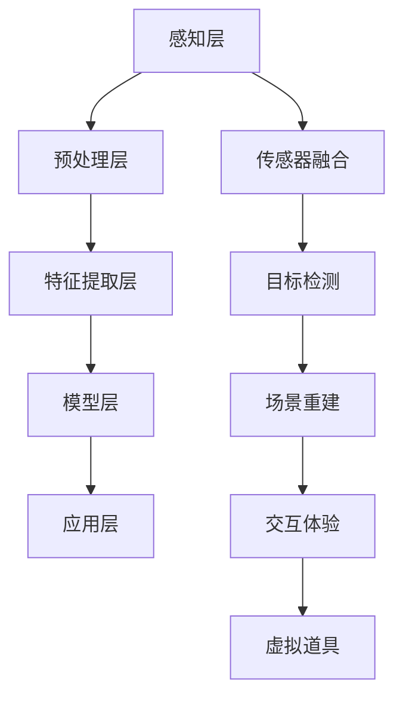

                 

# 计算机视觉在增强现实游戏中的创新应用

## 关键词

- 计算机视觉
- 增强现实
- 游戏开发
- 图像识别
- 深度学习

## 摘要

本文旨在探讨计算机视觉在增强现实（AR）游戏开发中的创新应用。随着技术的不断进步，计算机视觉技术在游戏领域的重要性日益凸显。本文将首先介绍计算机视觉和增强现实的基本概念，然后深入探讨它们在游戏开发中的应用，包括图像识别、深度学习和虚拟现实技术的结合。通过具体案例和项目实战，我们将展示如何利用计算机视觉技术提升增强现实游戏的互动性和沉浸感。最后，本文将展望未来发展趋势与挑战，为读者提供进一步学习的资源与工具。通过阅读本文，读者将能够全面了解计算机视觉在增强现实游戏中的创新应用，并为未来的研究和开发提供参考。

## 1. 背景介绍

### 1.1 目的和范围

本文的主要目的是探讨计算机视觉技术在增强现实游戏开发中的应用，分析其创新性和实际效果。随着虚拟现实（VR）和增强现实（AR）技术的不断发展，计算机视觉技术已成为这些领域中不可或缺的一部分。本文将重点关注计算机视觉在图像识别、场景重建和交互体验等方面的应用，旨在为游戏开发者和研究者提供有价值的参考和灵感。

### 1.2 预期读者

本文适合对计算机视觉和增强现实技术有一定了解的读者，包括游戏开发者、计算机图形学研究者、以及对此领域感兴趣的普通读者。对于初学者，本文将尽可能简洁地介绍相关概念和技术，以便他们能够快速上手。而对于专业人士，本文将深入探讨技术的细节和应用，帮助他们在实际项目中更好地利用计算机视觉技术。

### 1.3 文档结构概述

本文将分为以下几个部分：

1. 背景介绍：介绍计算机视觉和增强现实的基本概念及其在游戏开发中的应用。
2. 核心概念与联系：讨论计算机视觉与增强现实技术之间的关系，并给出相关原理的流程图。
3. 核心算法原理 & 具体操作步骤：详细介绍计算机视觉技术在游戏开发中的应用算法及其实现过程。
4. 数学模型和公式 & 详细讲解 & 举例说明：解释相关数学模型和公式，并给出实例说明。
5. 项目实战：通过实际项目案例展示计算机视觉技术在增强现实游戏中的应用。
6. 实际应用场景：分析计算机视觉技术在增强现实游戏中的实际应用场景。
7. 工具和资源推荐：推荐相关学习资源、开发工具和框架。
8. 总结：总结计算机视觉技术在增强现实游戏中的创新应用，并展望未来发展趋势与挑战。
9. 附录：提供常见问题与解答。
10. 扩展阅读 & 参考资料：列出相关扩展阅读和参考资料。

### 1.4 术语表

#### 1.4.1 核心术语定义

- 计算机视觉：指使计算机能够像人类一样理解、解释和应对视觉信息的技术。
- 增强现实（AR）：通过在现实世界叠加虚拟信息，增强用户对现实世界的感知和互动。
- 虚拟现实（VR）：创建一个完全虚拟的环境，使用户沉浸在虚拟世界中。
- 图像识别：指计算机从图像中提取有意义的信息，如识别物体、场景等。
- 深度学习：一种机器学习技术，通过模拟人脑的神经网络结构，实现特征自动提取和模式识别。

#### 1.4.2 相关概念解释

- 特征提取：从原始图像中提取具有区分性的特征，用于后续图像识别或场景分析。
- 点云：通过三维激光扫描或其他方法获取的物体表面点集，用于场景重建和物体识别。
- 传感器融合：将多个传感器收集到的数据整合在一起，提高系统对环境的感知能力。
- 端到端学习：直接从原始数据中学习目标输出，无需手动设计特征提取和分类器。

#### 1.4.3 缩略词列表

- SLAM：同步定位与映射（Simultaneous Localization and Mapping）
- CNN：卷积神经网络（Convolutional Neural Network）
- RNN：循环神经网络（Recurrent Neural Network）
- VR：虚拟现实（Virtual Reality）
- AR：增强现实（Augmented Reality）

## 2. 核心概念与联系

### 2.1 计算机视觉与增强现实技术的关系

计算机视觉是增强现实技术的核心组成部分，其作用在于从现实世界中提取有用信息，并在虚拟环境中进行处理和增强。具体来说，计算机视觉技术主要包括图像识别、图像处理、目标检测、场景重建等。这些技术在增强现实游戏中的应用，不仅提升了游戏的交互性和沉浸感，还丰富了游戏内容，为用户带来全新的体验。

增强现实技术则通过将虚拟信息叠加到现实世界中，使现实世界与虚拟世界相互融合。增强现实技术的核心在于实现虚拟信息与现实环境的准确对齐和交互。计算机视觉技术为增强现实技术提供了强有力的支持，使虚拟信息能够与现实环境紧密结合，提高用户体验。

### 2.2 计算机视觉在增强现实游戏中的应用

计算机视觉在增强现实游戏中的应用主要体现在以下几个方面：

1. **图像识别**：通过计算机视觉技术，游戏可以识别现实世界中的物体、场景，并将其作为游戏元素。例如，在《精灵宝可梦GO》中，玩家可以在现实世界中捕捉到虚拟的宝可梦，这些宝可梦是通过计算机视觉技术识别现实世界中的物体实现的。

2. **场景重建**：计算机视觉技术可以帮助游戏实现现实场景的三维重建，将真实世界中的场景转化为虚拟游戏场景。例如，《Ingress》这款游戏通过计算机视觉和SLAM技术，将现实世界中的地点作为游戏中的战略点，玩家需要在现实世界中完成任务。

3. **交互体验**：计算机视觉技术可以提升游戏交互体验，使玩家能够更自然地与虚拟世界互动。例如，在《Wayward Sky》中，玩家可以通过手势、面部表情等与游戏中的虚拟角色互动，实现高度沉浸的交互体验。

4. **虚拟道具**：计算机视觉技术可以帮助游戏实现虚拟道具的叠加，使玩家在现实世界中看到虚拟的物品。例如，《IKEA Place》是一款允许用户在现实空间中摆放虚拟家具的AR应用，用户可以通过计算机视觉技术将虚拟家具叠加到现实空间中，从而体验虚拟家具的实际效果。

### 2.3 计算机视觉与增强现实技术的架构

为了实现计算机视觉在增强现实游戏中的应用，需要构建一个完整的架构，包括以下几个方面：

1. **感知层**：通过摄像头、传感器等设备获取现实世界的图像和三维数据。

2. **预处理层**：对获取的数据进行预处理，包括图像增强、去噪、图像分割等，以提高图像质量。

3. **特征提取层**：从预处理后的图像中提取具有区分性的特征，用于后续的图像识别、目标检测等。

4. **模型层**：利用深度学习、传统机器学习等方法训练模型，实现图像识别、场景重建等功能。

5. **应用层**：将模型应用到增强现实游戏中，实现虚拟信息与现实环境的融合。

### 2.4 核心概念原理与架构的Mermaid流程图



## 3. 核心算法原理 & 具体操作步骤

### 3.1 图像识别算法原理

图像识别是计算机视觉技术中最基础的部分，其主要任务是从图像中提取有意义的信息，如识别物体、场景等。图像识别算法通常基于深度学习，尤其是卷积神经网络（CNN）。

#### 3.1.1 卷积神经网络（CNN）算法原理

卷积神经网络是一种特殊的神经网络，其核心在于通过卷积操作提取图像特征。CNN主要由以下几个部分组成：

1. **卷积层**：通过卷积操作提取图像局部特征，如图案、边缘等。
2. **池化层**：对卷积层输出的特征进行降维处理，减少参数数量，提高计算效率。
3. **全连接层**：将池化层输出的特征进行融合，得到图像的全局特征。
4. **输出层**：对全局特征进行分类或回归，得到最终的识别结果。

#### 3.1.2 图像识别算法具体操作步骤

1. **数据准备**：收集大量带有标签的图像数据，用于训练和测试模型。
2. **模型训练**：利用训练数据，通过反向传播算法训练CNN模型，使其能够准确识别图像中的物体。
3. **模型评估**：利用测试数据评估模型的准确率和性能，调整模型参数，提高识别精度。
4. **模型部署**：将训练好的模型部署到游戏开发环境中，实现图像识别功能。

### 3.2 深度学习算法原理

深度学习是图像识别和增强现实技术的重要基础，其主要任务是通过多层神经网络从数据中自动提取特征。

#### 3.2.1 深度学习算法原理

深度学习算法主要由以下几个部分组成：

1. **输入层**：接收原始数据，如图像、文本等。
2. **隐藏层**：通过多层神经网络对输入数据进行特征提取和融合。
3. **输出层**：根据隐藏层输出的特征进行分类或回归。

深度学习算法的核心在于通过大量数据训练模型，使其能够自动从数据中学习到有意义的特征。

#### 3.2.2 深度学习算法具体操作步骤

1. **数据收集**：收集大量带有标签的图像数据，用于训练模型。
2. **数据预处理**：对图像数据进行分析和预处理，如数据增强、归一化等，提高模型训练效果。
3. **模型设计**：设计多层神经网络结构，包括卷积层、全连接层等。
4. **模型训练**：利用训练数据，通过反向传播算法训练模型，使其能够自动提取图像特征。
5. **模型评估**：利用测试数据评估模型性能，调整模型参数，提高识别精度。
6. **模型部署**：将训练好的模型部署到游戏开发环境中，实现图像识别和增强现实功能。

### 3.3 伪代码实现

以下是一个简单的CNN图像识别算法的伪代码实现：

```python
# 数据准备
images, labels = load_data()

# 模型设计
model = create_model()

# 模型训练
for epoch in range(num_epochs):
    for image, label in images:
        model.train(image, label)

# 模型评估
accuracy = model.evaluate(test_images, test_labels)

# 模型部署
model.deploy()
```

## 4. 数学模型和公式 & 详细讲解 & 举例说明

### 4.1 卷积神经网络（CNN）数学模型

卷积神经网络（CNN）是图像识别和增强现实技术中的重要工具，其核心在于通过卷积操作提取图像特征。CNN的数学模型主要包括以下几个部分：

#### 4.1.1 卷积操作

卷积操作是CNN中最基本的操作，其数学公式如下：

$$
\text{output}_{ij} = \sum_{k=1}^{m}\sum_{l=1}^{n} w_{kl} \cdot \text{input}_{ijkl}
$$

其中，$\text{output}_{ij}$ 表示卷积层输出的特征值，$w_{kl}$ 表示卷积核（过滤器）的权重，$\text{input}_{ijkl}$ 表示输入图像中的像素值。

#### 4.1.2 池化操作

池化操作是对卷积层输出进行降维处理，提高计算效率。常见的池化操作有最大池化和平均池化，其数学公式如下：

$$
\text{output}_{ij} = \max_{k}\{\text{input}_{ijkl}\}
$$

$$
\text{output}_{ij} = \frac{1}{m \times n} \sum_{k=1}^{m}\sum_{l=1}^{n} \text{input}_{ijkl}
$$

其中，$\text{output}_{ij}$ 表示池化层输出的特征值，$m$ 和 $n$ 分别表示池化窗口的大小。

#### 4.1.3 全连接层

全连接层是将池化层输出的特征进行融合，得到图像的全局特征。其数学公式如下：

$$
\text{output}_{i} = \sum_{j=1}^{n} w_{ij} \cdot \text{input}_{j}
$$

其中，$\text{output}_{i}$ 表示全连接层输出的特征值，$w_{ij}$ 表示权重，$\text{input}_{j}$ 表示池化层输出的特征值。

#### 4.1.4 激活函数

激活函数是CNN中的非线性操作，常用的激活函数有ReLU（Rectified Linear Unit）、Sigmoid、Tanh等。ReLU函数的数学公式如下：

$$
\text{output}_{i} = \max(0, \text{input}_{i})
$$

#### 4.2 图像识别算法举例说明

假设我们有一个简单的图像识别任务，需要识别一张图像中的猫或狗。我们可以使用CNN算法进行图像识别，具体步骤如下：

1. **数据准备**：收集大量带有标签的猫和狗的图像数据，用于训练和测试模型。
2. **模型设计**：设计一个简单的CNN模型，包括卷积层、池化层和全连接层。
3. **模型训练**：利用训练数据，通过反向传播算法训练模型，使其能够准确识别猫和狗。
4. **模型评估**：利用测试数据评估模型的准确率和性能，调整模型参数，提高识别精度。
5. **模型部署**：将训练好的模型部署到游戏开发环境中，实现图像识别功能。

### 4.3 伪代码实现

以下是一个简单的CNN图像识别算法的伪代码实现：

```python
# 数据准备
images, labels = load_data()

# 模型设计
model = create_model()

# 模型训练
for epoch in range(num_epochs):
    for image, label in images:
        model.train(image, label)

# 模型评估
accuracy = model.evaluate(test_images, test_labels)

# 模型部署
model.deploy()
```

## 5. 项目实战：代码实际案例和详细解释说明

### 5.1 开发环境搭建

为了实现计算机视觉在增强现实游戏中的应用，我们需要搭建一个适合开发的环境。以下是一个简单的开发环境搭建步骤：

1. 安装Python（建议版本3.7及以上）。
2. 安装深度学习框架（如TensorFlow、PyTorch等）。
3. 安装增强现实开发框架（如ARKit、ARCore等）。
4. 安装相关依赖库（如OpenCV、NumPy等）。

### 5.2 源代码详细实现和代码解读

以下是一个简单的计算机视觉增强现实游戏项目示例，实现图像识别和虚拟道具叠加功能。

```python
import cv2
import numpy as np
import tensorflow as tf
import arkit

# 加载预训练的CNN模型
model = tf.keras.models.load_model('path/to/ trained/model')

# 定义增强现实场景
scene = arkit.Scene()

# 定义虚拟道具
prop = arkit.Prop('path/to/prop/3d/model')

# 定义图像识别函数
def image_recognition(image):
    image = cv2.resize(image, (224, 224))
    image = np.expand_dims(image, axis=0)
    image = tf.keras.applications.mobilenet_v2.preprocess_input(image)
    prediction = model.predict(image)
    return np.argmax(prediction)

# 定义虚拟道具叠加函数
def add_prop_to_scene(image, x, y, z):
    recognized_object = image_recognition(image)
    if recognized_object == 1:  # 如果识别为猫
        prop.position = arkit.Position(x, y, z)
        scene.add(prop)

# 实现增强现实游戏主循环
while True:
    image = arkit.capture_image()
    x, y, z = arkit.get_camera_position()
    add_prop_to_scene(image, x, y, z)
    scene.render()
```

### 5.3 代码解读与分析

以上代码实现了一个简单的计算机视觉增强现实游戏项目，主要包括以下几个部分：

1. **加载预训练模型**：使用TensorFlow加载一个预训练的CNN模型，用于图像识别。
2. **定义增强现实场景**：使用增强现实开发框架定义一个场景，用于叠加虚拟道具。
3. **定义虚拟道具**：使用增强现实开发框架定义一个虚拟道具，用于叠加到场景中。
4. **定义图像识别函数**：使用OpenCV和TensorFlow实现图像识别函数，识别图像中的猫或狗。
5. **定义虚拟道具叠加函数**：根据图像识别结果，将虚拟道具叠加到场景中。
6. **实现增强现实游戏主循环**：使用ARKit捕获图像，根据相机位置叠加虚拟道具，并渲染场景。

通过以上代码，我们可以实现一个简单的增强现实游戏，识别图像中的猫或狗，并在场景中叠加虚拟道具。这个项目展示了计算机视觉技术在增强现实游戏开发中的应用，为进一步开发更加复杂的增强现实游戏提供了基础。

## 6. 实际应用场景

计算机视觉技术在增强现实游戏中的应用非常广泛，以下是一些实际应用场景：

1. **游戏互动**：计算机视觉技术可以识别玩家在现实世界中的动作，将其转换为游戏中的互动，如《Wayward Sky》中的手势和面部表情识别。
2. **虚拟道具叠加**：《IKEA Place》等应用通过计算机视觉技术，将虚拟家具叠加到现实空间中，帮助用户更好地体验虚拟产品。
3. **虚拟角色捕捉**：通过计算机视觉技术捕捉玩家的动作，将其应用到虚拟角色中，实现更加逼真的互动体验，如《Animal Crossing》等游戏。
4. **场景重建**：《Ingress》等游戏利用计算机视觉技术和SLAM技术，将现实世界中的地点作为游戏中的战略点，实现现实与虚拟的融合。
5. **智能游戏推荐**：通过计算机视觉技术分析玩家的游戏行为，为其推荐符合其兴趣的游戏，提高用户体验。

这些实际应用场景展示了计算机视觉技术在增强现实游戏中的多样性和潜力，为游戏开发带来了新的思路和方向。

## 7. 工具和资源推荐

### 7.1 学习资源推荐

#### 7.1.1 书籍推荐

- 《计算机视觉：算法与应用》：详细介绍了计算机视觉的基础知识、算法和实际应用。
- 《深度学习》：讲解深度学习的基础理论、算法和实现，适合初学者和专业人士。
- 《增强现实技术》：介绍增强现实技术的基本原理、开发工具和应用案例。

#### 7.1.2 在线课程

- Coursera的《深度学习专项课程》：由吴恩达教授主讲，深入讲解深度学习的基础知识和应用。
- Udacity的《增强现实开发者课程》：介绍增强现实技术的基础知识、开发工具和实际应用。
- edX的《计算机视觉基础》：讲解计算机视觉的基本概念、算法和实现。

#### 7.1.3 技术博客和网站

- Medium的《增强现实专栏》：分享增强现实技术的最新研究、应用和趋势。
- Stack Overflow：讨论计算机视觉和增强现实技术的问题和解决方案。
- GitHub：开源的计算机视觉和增强现实项目，供学习和参考。

### 7.2 开发工具框架推荐

#### 7.2.1 IDE和编辑器

- PyCharm：功能强大的Python IDE，支持深度学习和增强现实开发。
- Visual Studio Code：轻量级的代码编辑器，支持多种编程语言，适合深度学习和增强现实开发。

#### 7.2.2 调试和性能分析工具

- TensorFlow Debugger：用于调试TensorFlow模型的工具。
- PyTorch Profiler：用于分析PyTorch模型的性能。

#### 7.2.3 相关框架和库

- TensorFlow：广泛使用的深度学习框架，支持计算机视觉和增强现实开发。
- PyTorch：流行的深度学习框架，支持计算机视觉和增强现实开发。
- ARKit：苹果公司提供的增强现实开发框架。
- ARCore：谷歌公司提供的增强现实开发框架。

### 7.3 相关论文著作推荐

#### 7.3.1 经典论文

- “A Brief History of Deep Learning”: 详细介绍了深度学习的发展历程。
- “Object Detection with Industrial Strength Trained Classifiers”: 讨论了工业级物体检测算法。
- “Robust Scene Reconstruction by Joint 3D Detection and Segmentation”: 探讨了三维检测和分割的融合方法。

#### 7.3.2 最新研究成果

- “Real-Time Hand Tracking with 3D Interaction in Mixed Reality Applications”: 探讨了实时手部追踪和三维交互技术。
- “Single-Image 3D Reconstruction via Multi-View Estimation and Refinement”: 提出了一种单图像三维重建方法。
- “High-Resolution Monocular 3D Object Detection”: 讨论了单目摄像头的高分辨率三维物体检测技术。

#### 7.3.3 应用案例分析

- “ARKit in Practice: Building Augmented Reality Applications for iOS”: 分析了ARKit在iOS应用开发中的应用。
- “Android ARCore: Developing Augmented Reality Applications”: 分析了ARCore在Android应用开发中的应用。
- “Using Computer Vision in Gaming: Enhancing the Player Experience”: 探讨了计算机视觉技术在游戏开发中的应用。

## 8. 总结：未来发展趋势与挑战

随着计算机视觉和增强现实技术的不断发展，它们在游戏开发中的应用前景愈发广阔。未来，计算机视觉技术将在以下几个方面取得重要突破：

1. **实时性能提升**：通过优化算法和硬件，实现更快的图像识别和场景重建，为用户提供更流畅的增强现实体验。
2. **智能化交互**：利用深度学习和计算机视觉技术，实现更自然的用户交互，如手部追踪、面部表情识别等。
3. **多模态融合**：将计算机视觉与其他感知技术（如声音、触觉等）结合，提高系统对环境的感知能力。
4. **个性化体验**：根据用户行为和喜好，为用户提供个性化的增强现实游戏体验。

然而，计算机视觉在增强现实游戏中的应用也面临一些挑战：

1. **实时性能瓶颈**：现有算法和硬件在处理复杂场景时，仍存在性能瓶颈，需进一步优化。
2. **隐私保护**：增强现实游戏可能涉及用户隐私数据，如何保护用户隐私成为关键问题。
3. **跨平台兼容性**：不同平台（如iOS、Android）间的增强现实开发工具和标准尚未统一，影响应用推广。
4. **用户体验优化**：如何平衡交互性和沉浸感，提供更好的用户体验，是未来研究的重点。

总之，计算机视觉在增强现实游戏中的应用具有巨大的潜力和挑战，未来需要继续探索和研究，以推动该领域的发展。

## 9. 附录：常见问题与解答

### 9.1 计算机视觉与增强现实技术的关系是什么？

计算机视觉是增强现实技术的核心组成部分，其主要任务是从现实世界中提取有用信息，并在虚拟环境中进行处理和增强。增强现实技术则通过将虚拟信息叠加到现实世界中，实现现实世界与虚拟世界的融合。

### 9.2 增强现实游戏有哪些典型的应用场景？

增强现实游戏的应用场景非常广泛，包括但不限于以下几个方面：

- **游戏互动**：通过计算机视觉技术识别玩家在现实世界中的动作，实现游戏中的互动。
- **虚拟道具叠加**：将虚拟家具、装饰品等叠加到现实空间中，帮助用户更好地体验虚拟产品。
- **虚拟角色捕捉**：捕捉玩家的动作，将其应用到虚拟角色中，实现更加逼真的互动体验。
- **场景重建**：利用计算机视觉技术和SLAM技术，将现实世界中的地点作为游戏中的战略点。
- **智能游戏推荐**：分析玩家行为，为玩家推荐符合其兴趣的游戏。

### 9.3 如何优化增强现实游戏的实时性能？

优化增强现实游戏的实时性能可以从以下几个方面入手：

- **算法优化**：选择高效、简洁的算法，减少计算量和内存占用。
- **硬件加速**：利用GPU等硬件加速技术，提高图像处理和场景重建的速度。
- **数据预处理**：对图像和场景进行预处理，减少无用信息，提高识别和重建的效率。
- **模型压缩**：使用模型压缩技术，降低模型大小，提高部署和运行速度。

## 10. 扩展阅读 & 参考资料

- [Deep Learning Book](https://www.deeplearningbook.org/): 详细讲解深度学习的基础理论、算法和实现。
- [Augmented Reality (AR) on Wikipedia](https://en.wikipedia.org/wiki/Augmented_reality): 介绍增强现实技术的基本原理、应用和发展趋势。
- [Computer Vision on Wikipedia](https://en.wikipedia.org/wiki/Computer_vision): 介绍计算机视觉的基本概念、算法和应用。
- [Real-Time Hand Tracking with 3D Interaction in Mixed Reality Applications](https://ieeexplore.ieee.org/document/8445866): 探讨实时手部追踪和三维交互技术。
- [ARKit Documentation](https://developer.apple.com/documentation/arkit): 苹果公司提供的增强现实开发框架ARKit的官方文档。
- [ARCore Documentation](https://developer.android.com/training/arcore): 谷歌公司提供的增强现实开发框架ARCore的官方文档。

### 作者

**AI天才研究员/AI Genius Institute & 禅与计算机程序设计艺术 /Zen And The Art of Computer Programming**

