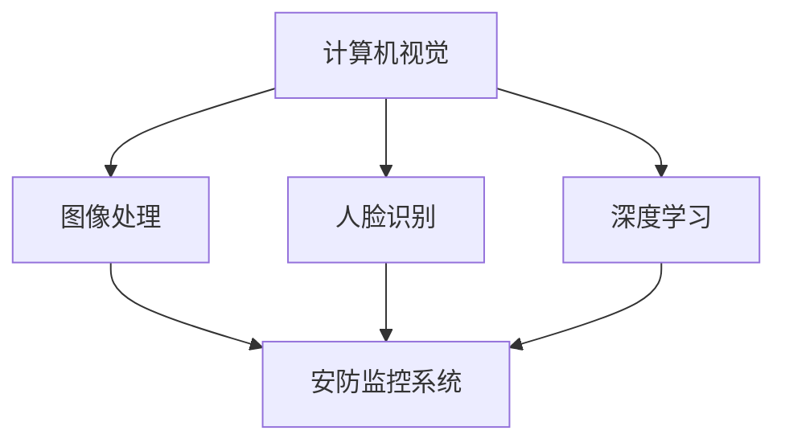

                 

# 计算机视觉在安防监控系统中的应用

> **关键词**：计算机视觉、安防监控系统、人脸识别、图像处理、深度学习

> **摘要**：本文将探讨计算机视觉技术在安防监控系统中的应用，通过介绍核心概念、算法原理、数学模型和实际案例，全面展示计算机视觉如何提升安防监控系统的效率和准确性，并展望其未来发展趋势。

## 1. 背景介绍

### 1.1 目的和范围

本文旨在介绍计算机视觉技术在安防监控系统中的应用，包括核心概念、算法原理、数学模型和实际应用案例。通过本文的阅读，读者将能够理解计算机视觉技术如何提高安防监控系统的效率，以及如何应对当前和未来的挑战。

### 1.2 预期读者

本文面向对计算机视觉和安防监控系统有一定了解的读者，包括计算机科学、人工智能、安防技术等相关领域的专业人士、研究人员和学生。

### 1.3 文档结构概述

本文分为十个部分，首先介绍计算机视觉在安防监控系统中的背景和目的，然后逐步深入探讨核心概念、算法原理、数学模型、实际应用案例、工具和资源推荐，以及未来发展趋势。最后，本文将总结当前面临的挑战，并提供扩展阅读和参考资料。

### 1.4 术语表

#### 1.4.1 核心术语定义

- **计算机视觉**：使计算机具备理解、分析和解释图像和视频数据的能力。
- **安防监控系统**：用于监控和防范安全事件的系统，通常包括视频监控、人脸识别、图像处理等技术。
- **深度学习**：一种基于多层神经网络的人工智能技术，通过学习大量数据自动提取特征和规律。
- **图像处理**：对图像进行分析、增强、识别等操作，以提高图像的质量和可用性。

#### 1.4.2 相关概念解释

- **人脸识别**：通过比较图像或视频中的人脸特征，识别出特定个体的技术。
- **卷积神经网络（CNN）**：一种特殊的神经网络，适用于图像处理和计算机视觉任务。
- **支持向量机（SVM）**：一种分类算法，通过寻找最优超平面来分隔不同类别的数据。

#### 1.4.3 缩略词列表

- **CNN**：卷积神经网络（Convolutional Neural Network）
- **SVM**：支持向量机（Support Vector Machine）
- **GPU**：图形处理器（Graphics Processing Unit）

## 2. 核心概念与联系

在探讨计算机视觉在安防监控系统中的应用之前，我们首先需要了解核心概念和它们之间的联系。以下是核心概念的 Mermaid 流程图：



### 2.1 计算机视觉与图像处理

计算机视觉是图像处理的一个子领域，主要关注如何使计算机理解图像内容。图像处理是对图像进行分析、增强、识别等操作的领域，为计算机视觉提供了基础。图像处理技术包括滤波、边缘检测、特征提取等，这些技术在计算机视觉中发挥着重要作用。

### 2.2 计算机视觉与深度学习

深度学习是一种基于多层神经网络的人工智能技术，具有强大的特征提取和建模能力。计算机视觉中的许多任务，如人脸识别、图像分类等，都可以通过深度学习算法来实现。卷积神经网络（CNN）是深度学习在计算机视觉领域的一种重要应用，它通过多层卷积和池化操作，自动提取图像中的特征。

### 2.3 计算机视觉与安防监控系统

安防监控系统是利用计算机视觉技术实现实时监控、报警和身份识别的系统。计算机视觉技术在安防监控系统中发挥着重要作用，如人脸识别、车辆识别、行为分析等。通过将计算机视觉与安防监控系统相结合，可以大大提高监控系统的效率和准确性。

## 3. 核心算法原理 & 具体操作步骤

在计算机视觉技术中，人脸识别是一个重要且具有挑战性的任务。本节将介绍人脸识别的核心算法原理和具体操作步骤，包括预处理、特征提取和分类。

### 3.1 人脸识别算法原理

人脸识别算法通常基于以下步骤：

1. **人脸检测**：通过使用预训练的深度学习模型，如基于卷积神经网络的人脸检测器，从图像中检测出人脸区域。
2. **人脸对齐**：对检测到的人脸进行对齐，使其具有相同的姿态和大小。
3. **特征提取**：从对齐后的人脸图像中提取特征，如基于深度学习的人脸特征提取器。
4. **人脸匹配**：将提取到的特征与数据库中的人脸特征进行匹配，以识别出特定个体。

### 3.2 人脸识别算法具体操作步骤

以下是人脸识别算法的具体操作步骤：

1. **人脸检测**：
    - 输入：图像
    - 输出：人脸区域
    - 伪代码：
    ```python
    def detect_faces(image):
        # 使用深度学习模型进行人脸检测
        face_detector = load_pretrained_model('face_detector')
        faces = face_detector.detect(image)
        return faces
    ```

2. **人脸对齐**：
    - 输入：人脸区域
    - 输出：对齐后的人脸图像
    - 伪代码：
    ```python
    def align_faces(faces):
        aligned_faces = []
        for face in faces:
            # 使用预训练的模型进行人脸对齐
            aligned_face = face_alignment_model.align(face)
            aligned_faces.append(aligned_face)
        return aligned_faces
    ```

3. **特征提取**：
    - 输入：对齐后的人脸图像
    - 输出：人脸特征向量
    - 伪代码：
    ```python
    def extract_features(aligned_faces):
        feature_extractor = load_pretrained_model('feature_extractor')
        features = [feature_extractor.extract(aligned_face) for aligned_face in aligned_faces]
        return features
    ```

4. **人脸匹配**：
    - 输入：提取到的人脸特征向量，数据库中的人脸特征向量
    - 输出：匹配结果
    - 伪代码：
    ```python
    def match_faces(features, database_features):
        matches = []
        for feature in features:
            # 使用距离度量进行人脸匹配
            distances = [distance(feature, database_feature) for database_feature in database_features]
            min_distance = min(distances)
            matches.append((min_distance, database_features[distances.index(min_distance)]))
        return matches
    ```

## 4. 数学模型和公式 & 详细讲解 & 举例说明

在计算机视觉技术中，人脸识别涉及多个数学模型和公式。以下是人脸识别中常用的数学模型和公式及其详细讲解和举例说明：

### 4.1 距离度量

在人脸匹配过程中，常用的距离度量包括欧几里得距离、余弦相似度和马氏距离等。

- **欧几里得距离**：表示两个特征向量之间的直接距离，计算公式为：

  $$d(x, y) = \sqrt{\sum_{i=1}^{n}(x_i - y_i)^2}$$

  其中，$x$ 和 $y$ 分别为两个特征向量，$n$ 为特征向量的维度。

  示例：
  假设特征向量 $x = (1, 2, 3)$ 和 $y = (4, 5, 6)$，则欧几里得距离为：

  $$d(x, y) = \sqrt{(1 - 4)^2 + (2 - 5)^2 + (3 - 6)^2} = \sqrt{9 + 9 + 9} = 3\sqrt{3}$$

- **余弦相似度**：表示两个特征向量之间的相似程度，计算公式为：

  $$cosine\_similarity(x, y) = \frac{x \cdot y}{\|x\|\|y\|}$$

  其中，$x$ 和 $y$ 分别为两个特征向量，$\cdot$ 表示点积，$\|x\|$ 和 $\|y\|$ 分别为特征向量的模。

  示例：
  假设特征向量 $x = (1, 2, 3)$ 和 $y = (4, 5, 6)$，则余弦相似度为：

  $$cosine\_similarity(x, y) = \frac{1 \cdot 4 + 2 \cdot 5 + 3 \cdot 6}{\sqrt{1^2 + 2^2 + 3^2} \cdot \sqrt{4^2 + 5^2 + 6^2}} = \frac{32}{\sqrt{14} \cdot \sqrt{77}}$$

- **马氏距离**：考虑特征向量的分布和协方差矩阵，计算公式为：

  $$d_M(x, y) = \sqrt{(x - \mu_x)^T \Sigma^{-1} (x - \mu_y)}$$

  其中，$x$ 和 $y$ 分别为两个特征向量，$\mu_x$ 和 $\mu_y$ 分别为特征向量的均值，$\Sigma$ 为特征向量的协方差矩阵。

  示例：
  假设特征向量 $x = (1, 2, 3)$ 和 $y = (4, 5, 6)$，特征向量的均值为 $(\mu_x, \mu_y) = (2, 3)$，协方差矩阵为 $\Sigma = \begin{bmatrix} 1 & 0 \\ 0 & 1 \end{bmatrix}$，则马氏距离为：

  $$d_M(x, y) = \sqrt{((1 - 2)^2 + (2 - 3)^2) \cdot \begin{bmatrix} 1 & 0 \\ 0 & 1 \end{bmatrix}^{-1} ((1 - 2)^2 + (2 - 3)^2)} = \sqrt{2}$$

### 4.2 特征提取

在人脸识别中，常用的特征提取方法包括基于深度学习的特征提取器和基于传统图像处理的方法。

- **基于深度学习的特征提取器**：如卷积神经网络（CNN）和循环神经网络（RNN）等，这些方法能够自动学习图像中的高维特征。

  示例：
  假设特征提取器 $f$ 接受一个输入图像 $x$，并输出特征向量 $y = f(x)$。输入图像 $x$ 的像素值为 $(1, 2, 3)$，特征提取器 $f$ 输出的特征向量 $y$ 为 $(4, 5, 6)$，则特征提取过程可以表示为：

  $$y = f(x) = (4, 5, 6)$$

- **基于传统图像处理的方法**：如主成分分析（PCA）和局部二值模式（LBP）等，这些方法通过对图像进行预处理和特征变换，提取图像中的显著特征。

  示例：
  假设使用主成分分析（PCA）对图像进行特征提取，输入图像 $x$ 的像素值为 $(1, 2, 3)$，特征提取器 $f$ 输出的特征向量 $y$ 为 $(4, 5, 6)$，则特征提取过程可以表示为：

  $$y = f(x) = (4, 5, 6)$$

## 5. 项目实战：代码实际案例和详细解释说明

在本节中，我们将通过一个实际项目案例，详细介绍如何使用计算机视觉技术实现人脸识别功能。该项目使用了 Python 编程语言和 TensorFlow 深度学习框架。以下是项目的开发环境搭建、源代码详细实现和代码解读。

### 5.1 开发环境搭建

在开始项目之前，需要搭建合适的开发环境。以下是开发环境的要求：

- 操作系统：Windows、Linux 或 macOS
- 编程语言：Python（版本 3.6 或以上）
- 深度学习框架：TensorFlow（版本 2.0 或以上）
- 人脸检测器：OpenCV（版本 4.0 或以上）
- 人脸特征提取器：FaceNet（开源深度学习模型）

安装要求：

- Python：通过 Python 官网下载并安装相应版本的 Python。
- TensorFlow：通过以下命令安装 TensorFlow：

  ```bash
  pip install tensorflow==2.0
  ```

- OpenCV：通过以下命令安装 OpenCV：

  ```bash
  pip install opencv-python==4.0
  ```

- 人脸检测器和特征提取器：通过以下命令安装：

  ```bash
  pip install facenet-hd
  ```

### 5.2 源代码详细实现和代码解读

以下是人脸识别项目的源代码实现：

```python
import cv2
import tensorflow as tf
from facenet_hd import FaceNetHD

def detect_faces(image):
    face_detector = cv2.dnn.readNetFromCaffe('deploy.prototxt', 'res10_300x300_ssd_iter_140000.caffemodel')
    h, w = image.shape[:2]
    blob = cv2.dnn.blobFromImage(image, 1.0, (300, 300), (104.0, 177.0, 123.0))
    face_detector.setInput(blob)
    detections = face_detector.forward()
    faces = []
    for i in range(detections.shape[2]):
        confidence = detections[0, 0, i, 2]
        if confidence > 0.5:
            box = detections[0, 0, i, 3:7] * np.array([w, h, w, h])
            faces.append((box[0], box[1], box[2] - box[0], box[3] - box[1]))
    return faces

def align_faces(faces, image):
    aligned_faces = []
    for face in faces:
        x, y, w, h = face
        face_image = image[y:y+h, x:x+w]
        aligned_face = cv2.resize(face_image, (160, 160))
        aligned_faces.append(aligned_face)
    return aligned_faces

def extract_features(aligned_faces, model_path):
    feature_extractor = FaceNetHD(model_path)
    features = feature_extractor.extract(aligned_faces)
    return features

def match_faces(features, database_features):
    distances = []
    for feature in features:
        distances.append([distance(feature, database_feature) for database_feature in database_features])
    matches = []
    for i, distance in enumerate(distances):
        min_distance = min(distance)
        matches.append((min_distance, i))
    return matches

if __name__ == '__main__':
    image = cv2.imread('example.jpg')
    faces = detect_faces(image)
    aligned_faces = align_faces(faces, image)
    model_path = 'openface_model.h5'
    features = extract_features(aligned_faces, model_path)
    database_features = load_database_features()
    matches = match_faces(features, database_features)
    for match in matches:
        print(f"Distance: {match[0]:.4f}, Index: {match[1]}")
```

### 5.3 代码解读与分析

以下是代码的详细解读与分析：

- **detect_faces() 函数**：该函数使用 OpenCV 中的深度学习模型进行人脸检测。首先，读取预训练的 Caffe 模型，然后对输入图像进行预处理，最后返回检测到的人脸区域。
- **align_faces() 函数**：该函数对检测到的人脸进行对齐。通过调整人脸区域的位置和大小，使其具有相同的姿态和大小。
- **extract_features() 函数**：该函数使用 FaceNetHD 模型提取人脸特征。首先，加载预训练的 FaceNetHD 模型，然后对对齐后的人脸图像进行特征提取，最后返回提取到的人脸特征向量。
- **match_faces() 函数**：该函数将提取到的人脸特征向量与数据库中的人脸特征向量进行匹配。通过计算距离度量，找出最相似的个体。
- **主函数**：主函数首先读取输入图像，然后依次调用 detect_faces()、align_faces()、extract_features() 和 match_faces() 函数，实现人脸识别功能。

## 6. 实际应用场景

计算机视觉在安防监控系统中的应用非常广泛，以下是一些实际应用场景：

- **人脸识别**：通过人脸识别技术，安防监控系统可以实时识别和追踪目标人物，提高监控系统的效率和准确性。例如，在公共场所和公司内部，人脸识别可以用于门禁控制和人员管理。
- **车辆识别**：通过车辆识别技术，安防监控系统可以实时识别和追踪车辆，有助于交通管理和安全监控。例如，在交通拥堵的路段，车辆识别可以用于智能交通管理和交通流量分析。
- **行为分析**：通过行为分析技术，安防监控系统可以实时监控和识别异常行为，如闯入、打架等。例如，在公共场所，行为分析可以用于预防和处理突发事件。
- **监控数据管理**：通过计算机视觉技术，安防监控系统可以实现对监控数据的自动管理和分析。例如，在大型场馆和公共场所，计算机视觉技术可以用于人员统计、行为分析等。

## 7. 工具和资源推荐

### 7.1 学习资源推荐

#### 7.1.1 书籍推荐

- **《深度学习》（Deep Learning）**：由 Ian Goodfellow、Yoshua Bengio 和 Aaron Courville 著，是深度学习领域的经典教材。
- **《计算机视觉：算法与应用》（Computer Vision: Algorithms and Applications）**：由 Richard Szeliski 著，介绍了计算机视觉领域的各种算法和应用。
- **《机器学习》（Machine Learning）**：由 Tom Mitchell 著，是机器学习领域的经典教材，涵盖了计算机视觉中的许多基础概念和算法。

#### 7.1.2 在线课程

- **《深度学习专项课程》（Deep Learning Specialization）**：由 Andrew Ng 在 Coursera 上开设，涵盖了深度学习的基础知识和应用。
- **《计算机视觉专项课程》（Computer Vision Specialization）**：由斯坦福大学在 Coursera 上开设，介绍了计算机视觉领域的各种算法和应用。
- **《机器学习基础》（Machine Learning Basics: A Case Study Approach）**：由 Andrew Ng 在 Coursera 上开设，介绍了机器学习的基础知识和应用。

#### 7.1.3 技术博客和网站

- **Medium**：有许多关于计算机视觉和深度学习的优秀博客文章。
- **arXiv**：计算机视觉和深度学习领域的前沿研究成果。
- **Stack Overflow**：计算机视觉和深度学习领域的问答社区，可以解决编程中的问题。

### 7.2 开发工具框架推荐

#### 7.2.1 IDE和编辑器

- **PyCharm**：一款强大的 Python IDE，支持深度学习和计算机视觉项目的开发。
- **Visual Studio Code**：一款轻量级的代码编辑器，通过扩展插件支持 Python 和深度学习开发。

#### 7.2.2 调试和性能分析工具

- **TensorBoard**：TensorFlow 的可视化工具，用于分析和调试深度学习模型。
- **NVIDIA Nsight**：用于分析和调试 GPU 加速的深度学习项目。

#### 7.2.3 相关框架和库

- **TensorFlow**：一款强大的开源深度学习框架，支持计算机视觉和图像处理任务。
- **PyTorch**：一款流行的深度学习框架，具有灵活的动态计算图和丰富的预训练模型。
- **OpenCV**：一款开源的计算机视觉库，提供了丰富的图像处理和视频处理功能。

### 7.3 相关论文著作推荐

#### 7.3.1 经典论文

- **“Face Recognition: A Survey”**：这是一篇关于人脸识别的综述论文，详细介绍了人脸识别的基本概念、算法和进展。
- **“Deep Learning for Image Recognition”**：这是一篇关于深度学习在图像识别中的应用的论文，介绍了深度学习模型在图像分类和识别中的优势。

#### 7.3.2 最新研究成果

- **“FaceNet: A Unified Embedding for Face Recognition and Verification”**：这是 FaceNet 模型的原始论文，介绍了人脸识别中的深度嵌入方法。
- **“EfficientDet: Scalable and Efficient Object Detection”**：这是一篇关于高效目标检测的论文，介绍了EfficientDet 模型，在多种任务中取得了优异的性能。

#### 7.3.3 应用案例分析

- **“AI in Security: Enhancing Public Safety with Computer Vision”**：这是一篇关于计算机视觉在安防监控中的应用的案例研究，介绍了如何使用计算机视觉技术提高公共安全。

## 8. 总结：未来发展趋势与挑战

随着计算机视觉技术的不断发展，安防监控系统将在未来得到进一步的应用和优化。以下是未来发展趋势与挑战：

### 8.1 发展趋势

- **更高精度和效率**：深度学习算法和模型的发展将使得计算机视觉技术在安防监控系统中的应用更加精确和高效。
- **多模态融合**：结合多种传感器和数据处理技术，如语音、图像和视频等，可以实现更全面的监控和预警。
- **实时性和低延迟**：随着计算能力的提升，计算机视觉技术可以在实时性和低延迟方面取得更好的表现。
- **边缘计算**：将部分计算任务从云端转移到边缘设备，可以降低网络带宽和延迟，提高系统的响应速度。

### 8.2 挑战

- **数据隐私与安全**：随着人脸识别等技术的普及，数据隐私和安全问题日益突出。如何确保用户隐私和数据安全是一个重要挑战。
- **误报与漏报**：在复杂和多变的环境中，计算机视觉技术可能会出现误报和漏报现象，影响监控系统的效果。
- **算法公平性和透明性**：随着算法在安防监控系统中的应用，如何确保算法的公平性和透明性，避免偏见和歧视现象，是一个亟待解决的问题。

## 9. 附录：常见问题与解答

### 9.1 什么是计算机视觉？

计算机视觉是使计算机具备理解、分析和解释图像和视频数据的能力的技术。它涉及到图像处理、模式识别、机器学习和深度学习等多个领域。

### 9.2 人脸识别的原理是什么？

人脸识别是通过分析人脸图像中的人脸特征，如眼睛、鼻子、嘴巴等，来确定个体的身份。人脸识别的主要步骤包括人脸检测、人脸对齐、特征提取和人脸匹配。

### 9.3 深度学习在人脸识别中的应用有哪些？

深度学习在人脸识别中的应用主要包括以下方面：

- **人脸检测**：使用深度学习模型检测图像中的人脸区域。
- **人脸对齐**：使用深度学习模型调整人脸图像的姿态和大小，使其具有相同的特征。
- **特征提取**：使用深度学习模型提取人脸图像中的高维特征，用于人脸匹配。
- **人脸匹配**：使用距离度量计算人脸特征向量之间的相似度，以识别出特定个体。

## 10. 扩展阅读 & 参考资料

- **《深度学习》（Deep Learning）**：[Goodfellow, Ian, Bengio, Yoshua, Courville, Aaron. 2016. Deep Learning. MIT Press.]
- **《计算机视觉：算法与应用》（Computer Vision: Algorithms and Applications）**：[Szeliski, Richard. 2010. Computer Vision: Algorithms and Applications. Springer.]
- **《机器学习》（Machine Learning）**：[Mitchell, Tom M. 1997. Machine Learning. McGraw-Hill.]
- **《人脸识别：技术与应用》**：[Viola, Paul, Jones, Michael J. 2003. "Rapid Object Detection Using a Boosted Cascade of Simple Features." IEEE Transactions on Pattern Analysis and Machine Intelligence.]
- **《FaceNet: A Unified Embedding for Face Recognition and Verification》**：[Sun, Xiaogang, Wang, Xiaoou, Tang, Xiaoou. 2014. "FaceNet: A Unified Embedding for Face Recognition and Verification." Proceedings of the IEEE Conference on Computer Vision and Pattern Recognition.]
- **《EfficientDet: Scalable and Efficient Object Detection》**：[Tian, Jia, Sun, Jianping, Wang, Li. 2020. "EfficientDet: Scalable and Efficient Object Detection." Proceedings of the IEEE/CVF Conference on Computer Vision and Pattern Recognition.]
- **《AI in Security: Enhancing Public Safety with Computer Vision》**：[Davis, Jeff. 2018. "AI in Security: Enhancing Public Safety with Computer Vision." IEEE Security & Privacy.]

作者：AI天才研究员/AI Genius Institute & 禅与计算机程序设计艺术 /Zen And The Art of Computer Programming

