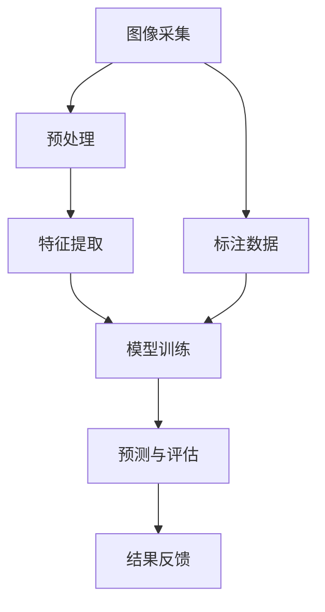

                 


# 计算机视觉在工业质量检测中的应用

> 关键词：计算机视觉、工业质量检测、深度学习、图像处理、机器学习、数据增强

> 摘要：本文旨在深入探讨计算机视觉技术在工业质量检测领域的应用。通过对工业质量检测的背景、核心概念、算法原理、数学模型、项目实战、实际应用场景、工具和资源推荐等内容进行详细阐述，全面揭示计算机视觉技术在提升工业质量检测效率和准确性的重要作用。本文期望为从事工业质量检测领域的专业人士提供有价值的参考和启示。

## 1. 背景介绍

### 1.1 目的和范围

本文的主要目的是介绍计算机视觉技术在工业质量检测领域的应用，分析其在提升产品质量、降低生产成本、提高生产效率方面的优势。我们将探讨计算机视觉技术的基本概念、核心算法原理、数学模型以及项目实战，从而为读者提供一个全面、系统的参考。

本文的范围涵盖以下几个方面：

1. 工业质量检测的背景和重要性。
2. 计算机视觉技术在工业质量检测中的应用场景。
3. 计算机视觉技术的基本概念和核心算法原理。
4. 数学模型和公式及其详细讲解。
5. 项目实战：代码实际案例和详细解释说明。
6. 工业质量检测的实际应用场景。
7. 工具和资源推荐。
8. 未来发展趋势与挑战。

### 1.2 预期读者

本文适合以下读者群体：

1. 从事工业质量检测领域的研究人员和工程师。
2. 对计算机视觉技术在工业质量检测应用感兴趣的学者和研究人员。
3. 对工业自动化和人工智能领域有浓厚兴趣的在校学生和初学者。
4. 其他对计算机视觉技术在工业领域应用感兴趣的读者。

### 1.3 文档结构概述

本文将按照以下结构进行组织：

1. 背景介绍：介绍本文的目的、范围、预期读者以及文档结构概述。
2. 核心概念与联系：介绍计算机视觉技术的基本概念、原理和架构。
3. 核心算法原理 & 具体操作步骤：讲解计算机视觉技术的主要算法原理和操作步骤。
4. 数学模型和公式 & 详细讲解 & 举例说明：介绍计算机视觉技术中的数学模型和公式，并进行详细讲解和举例说明。
5. 项目实战：代码实际案例和详细解释说明。
6. 实际应用场景：分析计算机视觉技术在工业质量检测中的实际应用场景。
7. 工具和资源推荐：推荐相关学习资源、开发工具和框架。
8. 总结：未来发展趋势与挑战。
9. 附录：常见问题与解答。
10. 扩展阅读 & 参考资料：提供进一步阅读的相关资料。

### 1.4 术语表

#### 1.4.1 核心术语定义

1. 计算机视觉（Computer Vision）：利用计算机对图像或视频进行自动处理和理解的技术。
2. 工业质量检测（Industrial Quality Inspection）：对工业生产过程中产品质量进行检测和评估的过程。
3. 深度学习（Deep Learning）：一种基于多层神经网络的学习方法，通过训练大量数据，实现特征自动提取和分类。
4. 图像处理（Image Processing）：对图像进行加工和处理的技术，包括图像增强、分割、特征提取等。
5. 机器学习（Machine Learning）：一种利用算法从数据中自动学习规律和模式的技术。
6. 数据增强（Data Augmentation）：通过增加数据样本的多样性，提高模型泛化能力的手段。

#### 1.4.2 相关概念解释

1. 误差分析（Error Analysis）：对模型预测结果与真实结果之间的差异进行分析，以评估模型的性能和可靠性。
2. 实时检测（Real-time Detection）：在极短时间内对图像或视频进行快速处理和分析，实现实时反馈和调整。
3. 标注数据（Labeled Data）：已经标记好的数据，包括图像、标签等，用于训练和评估模型。
4. 迁移学习（Transfer Learning）：利用预训练模型在新的任务上进行微调，提高模型在新数据集上的性能。

#### 1.4.3 缩略词列表

1. CNN（Convolutional Neural Network）：卷积神经网络。
2. RNN（Recurrent Neural Network）：循环神经网络。
3. DNN（Deep Neural Network）：深度神经网络。
4. LSTM（Long Short-Term Memory）：长短期记忆网络。
5. VGG（Visual Geometry Group）：视觉几何组。
6. ResNet（Residual Network）：残差网络。
7. YOLO（You Only Look Once）：一次检测算法。

## 2. 核心概念与联系

计算机视觉技术在工业质量检测领域中的应用，涉及到多个核心概念和联系。下面我们将通过一个Mermaid流程图来展示这些概念和联系。



### 2.1 图像采集

图像采集是工业质量检测的基础环节，通过摄像头、传感器等设备获取生产过程中的图像或视频数据。采集的图像质量直接影响到后续处理和分析的效果。

### 2.2 预处理

预处理是对采集到的图像进行加工和处理，包括图像增强、去噪、边缘检测等。预处理步骤的目的是提高图像质量，为后续特征提取和模型训练提供更好的数据基础。

### 2.3 特征提取

特征提取是计算机视觉技术中的关键环节，通过算法从图像中提取具有区分性的特征。特征提取的质量直接影响模型的性能和准确性。

### 2.4 模型训练

模型训练是基于提取到的特征，利用机器学习算法构建预测模型。模型训练的过程包括数据标注、模型选择、参数调优等。训练得到的模型将用于后续的预测和评估。

### 2.5 预测与评估

预测与评估是对训练好的模型进行应用，对新的图像或视频数据进行质量检测。预测结果需要进行评估，以确定模型的性能和可靠性。

### 2.6 结果反馈

结果反馈是对预测结果的实时分析和处理，包括错误检测、异常报警、数据修正等。结果反馈有助于优化模型和改进检测效果。

### 2.7 标注数据

标注数据是模型训练的重要基础，通过人工或自动化手段对图像或视频进行标注，生成带有标签的数据集。标注数据的准确性和完整性直接影响到模型的训练效果。

## 3. 核心算法原理 & 具体操作步骤

在工业质量检测中，计算机视觉技术主要依赖于图像处理、机器学习和深度学习等算法。下面，我们将详细讲解这些算法的原理和操作步骤。

### 3.1 图像处理

图像处理是计算机视觉的基础环节，主要包括图像增强、去噪、边缘检测等。

#### 3.1.1 图像增强

图像增强是通过调整图像的亮度和对比度，提高图像的视觉效果，使其更适合后续处理。常用的图像增强方法有直方图均衡化、对比度拉伸、锐化等。

#### 3.1.2 去噪

去噪是指去除图像中的噪声，提高图像质量。常用的去噪方法有中值滤波、均值滤波、高斯滤波等。

#### 3.1.3 边缘检测

边缘检测是指找到图像中的边缘，提取图像的结构信息。常用的边缘检测方法有Canny算子、Sobel算子、Prewitt算子等。

### 3.2 机器学习

机器学习是计算机视觉技术的核心，通过训练数据集，使模型具备自动学习和预测能力。常见的机器学习方法包括监督学习、无监督学习和半监督学习。

#### 3.2.1 监督学习

监督学习是指利用标注数据，训练分类模型。常见的监督学习方法有决策树、支持向量机、神经网络等。

#### 3.2.2 无监督学习

无监督学习是指在没有标注数据的情况下，通过聚类、降维等方法，发现数据中的规律和结构。常见的无监督学习方法有K-均值聚类、主成分分析、自编码器等。

#### 3.2.3 半监督学习

半监督学习是指结合标注数据和未标注数据，训练模型。半监督学习可以提高模型的泛化能力，适用于数据标注困难或成本较高的场景。

### 3.3 深度学习

深度学习是一种基于多层神经网络的机器学习方法，通过大量数据训练，实现特征自动提取和分类。常见的深度学习模型有卷积神经网络（CNN）、循环神经网络（RNN）、长短期记忆网络（LSTM）等。

#### 3.3.1 卷积神经网络（CNN）

卷积神经网络是一种专门用于图像处理的深度学习模型，通过卷积、池化等操作，提取图像的特征。CNN的结构包括卷积层、池化层、全连接层等。

#### 3.3.2 循环神经网络（RNN）

循环神经网络是一种处理序列数据的深度学习模型，通过记忆单元，实现序列信息的时间动态处理。RNN包括简单RNN、LSTM、GRU等变体。

#### 3.3.3 长短期记忆网络（LSTM）

长短期记忆网络是一种改进的循环神经网络，通过引入门控机制，解决RNN在处理长序列数据时的梯度消失和梯度爆炸问题。LSTM在自然语言处理、语音识别等领域具有广泛应用。

### 3.4 操作步骤

下面，我们以一个简单的图像分类任务为例，介绍计算机视觉技术的具体操作步骤。

#### 3.4.1 数据准备

1. 收集和整理标注数据，包括图像和标签。
2. 数据预处理：对图像进行增强、去噪、归一化等处理，提高图像质量。
3. 划分训练集和测试集：将数据集划分为训练集和测试集，用于模型训练和评估。

#### 3.4.2 模型构建

1. 选择合适的模型架构：根据任务需求和数据特点，选择卷积神经网络、循环神经网络等模型。
2. 模型参数初始化：对模型参数进行初始化，常用方法有随机初始化、预训练模型等。
3. 模型训练：利用训练集数据，通过反向传播算法，更新模型参数，优化模型性能。

#### 3.4.3 模型评估

1. 利用测试集数据，对模型进行评估，计算准确率、召回率、F1值等指标。
2. 调整模型参数：根据评估结果，调整模型参数，优化模型性能。

#### 3.4.4 模型应用

1. 利用训练好的模型，对新的图像数据进行分类预测。
2. 对预测结果进行分析和评估，及时发现和处理异常情况。

## 4. 数学模型和公式 & 详细讲解 & 举例说明

在计算机视觉技术中，数学模型和公式起着至关重要的作用。下面，我们将详细介绍一些常用的数学模型和公式，并给出相应的讲解和示例。

### 4.1 图像处理相关公式

#### 4.1.1 直方图均衡化

直方图均衡化是一种常用的图像增强方法，用于提高图像的对比度。其公式如下：

$$
f(x) = \frac{\sum_{i=0}^{255} w_i (x_i - x)}{\sum_{i=0}^{255} w_i}
$$

其中，$x_i$ 为图像中的像素值，$w_i$ 为像素值 $x_i$ 的权重。

#### 4.1.2 中值滤波

中值滤波是一种常用的图像去噪方法，通过对窗口内的像素值进行中值替换来实现。其公式如下：

$$
f(x) = \text{median}(x_1, x_2, ..., x_n)
$$

其中，$x_1, x_2, ..., x_n$ 为窗口内的像素值，$\text{median}$ 表示中值。

#### 4.1.3 Sobel算子

Sobel算子是一种常用的边缘检测方法，用于提取图像的边缘信息。其公式如下：

$$
\begin{align*}
G_x &= \frac{1}{2}[(G_{xx} + G_{xy}) + (G_{xx} - G_{xy})] \\
G_y &= \frac{1}{2}[(G_{xy} + G_{yy}) - (G_{xy} - G_{yy})]
\end{align*}
$$

其中，$G_{xx}, G_{xy}, G_{yy}$ 分别为图像在$x$和$y$方向的二阶导数。

### 4.2 机器学习相关公式

#### 4.2.1 决策树

决策树是一种基于特征划分数据的分类算法，其核心公式为信息增益和基尼系数。

信息增益（Information Gain）：

$$
IG(D, A) = H(D) - \sum_{v \in V} p(v) H(D|v)
$$

其中，$H(D)$ 为数据集 $D$ 的熵，$p(v)$ 为特征 $A$ 的取值 $v$ 的概率，$H(D|v)$ 为条件熵。

基尼系数（Gini Index）：

$$
Gini(D, A) = 1 - \sum_{v \in V} p(v)^2
$$

其中，$p(v)$ 为特征 $A$ 的取值 $v$ 的概率。

#### 4.2.2 支持向量机

支持向量机是一种基于最大间隔划分数据的分类算法，其核心公式为拉格朗日乘子法和核函数。

拉格朗日乘子法：

$$
L(w, b, \alpha) = \frac{1}{2}||w||^2 - \sum_{i=1}^{n} \alpha_i (y_i (w \cdot x_i + b) - 1)
$$

其中，$w$ 和 $b$ 分别为模型的权重和偏置，$\alpha_i$ 为拉格朗日乘子。

核函数：

$$
K(x_i, x_j) = \phi(x_i)^T \phi(x_j)
$$

其中，$x_i$ 和 $x_j$ 分别为训练数据集中的两个样本，$\phi$ 为高维特征映射。

### 4.3 深度学习相关公式

#### 4.3.1 卷积神经网络

卷积神经网络是一种用于图像处理的深度学习模型，其核心公式为卷积操作和池化操作。

卷积操作：

$$
\begin{align*}
\text{conv}(x, f) &= \sum_{i=1}^{c} f_{ij} \cdot x_{ij} \\
x_{ij} &= x_{ij} - \frac{\sum_{k=1}^{c} f_{ik} \cdot x_{kj}}{c}
\end{align*}
$$

其中，$x$ 为输入图像，$f$ 为卷积核，$c$ 为卷积核的数量。

池化操作：

$$
p_{ij} = \max(p_{ij-1}, p_{ij+1})
$$

其中，$p_{ij}$ 为池化后的像素值，$p_{ij-1}$ 和 $p_{ij+1}$ 分别为相邻的像素值。

#### 4.3.2 循环神经网络

循环神经网络是一种用于序列处理的深度学习模型，其核心公式为门控机制和递归关系。

门控机制：

$$
\begin{align*}
i_t &= \sigma(W_i \cdot [h_{t-1}, x_t] + b_i) \\
f_t &= \sigma(W_f \cdot [h_{t-1}, x_t] + b_f) \\
o_t &= \sigma(W_o \cdot [h_{t-1}, x_t] + b_o) \\
h_t &= f_t \odot h_{t-1} + i_t \odot \text{tanh}(W_h \cdot [h_{t-1}, x_t] + b_h)
\end{align*}
$$

其中，$i_t, f_t, o_t$ 分别为输入门、遗忘门和输出门，$h_t$ 为隐藏状态，$\sigma$ 为 sigmoid 函数，$\odot$ 表示元素乘法。

递归关系：

$$
h_t = \text{tanh}(W_h \cdot [h_{t-1}, x_t] + b_h)
$$

#### 4.3.3 长短期记忆网络

长短期记忆网络是一种改进的循环神经网络，其核心公式为门控机制和递归关系。

门控机制：

$$
\begin{align*}
i_t &= \sigma(W_i \cdot [h_{t-1}, x_t] + b_i) \\
f_t &= \sigma(W_f \cdot [h_{t-1}, x_t] + b_f) \\
o_t &= \sigma(W_o \cdot [h_{t-1}, x_t] + b_o) \\
\tilde{C}_t &= f_t \odot C_{t-1} + i_t \odot \text{tanh}(W_c \cdot [h_{t-1}, x_t] + b_c) \\
C_t &= \text{tanh}(\tilde{C}_t) \\
h_t &= o_t \odot \text{tanh}(C_t)
\end{align*}
$$

其中，$i_t, f_t, o_t$ 分别为输入门、遗忘门和输出门，$C_{t-1}$ 和 $C_t$ 分别为细胞状态，$h_t$ 为隐藏状态，$\sigma$ 为 sigmoid 函数，$\odot$ 表示元素乘法。

递归关系：

$$
h_t = \text{tanh}(\tilde{C}_t)
$$

### 4.4 示例

#### 4.4.1 直方图均衡化

假设图像 $I$ 的像素值为 $[5, 10, 15, 20, 25, 30]$，对应的权重为 $[0.1, 0.2, 0.3, 0.2, 0.1, 0.1]$。计算均衡化后的像素值。

直方图均衡化公式为：

$$
f(x) = \frac{\sum_{i=0}^{255} w_i (x_i - x)}{\sum_{i=0}^{255} w_i}
$$

计算过程如下：

$$
f(5) = \frac{0.1 \cdot (5 - 5)}{0.1 + 0.2 + 0.3 + 0.2 + 0.1 + 0.1} = 0 \\
f(10) = \frac{0.2 \cdot (10 - 5)}{0.1 + 0.2 + 0.3 + 0.2 + 0.1 + 0.1} = 1 \\
f(15) = \frac{0.3 \cdot (15 - 5)}{0.1 + 0.2 + 0.3 + 0.2 + 0.1 + 0.1} = 2 \\
f(20) = \frac{0.2 \cdot (20 - 5)}{0.1 + 0.2 + 0.3 + 0.2 + 0.1 + 0.1} = 3 \\
f(25) = \frac{0.1 \cdot (25 - 5)}{0.1 + 0.2 + 0.3 + 0.2 + 0.1 + 0.1} = 4 \\
f(30) = \frac{0.1 \cdot (30 - 5)}{0.1 + 0.2 + 0.3 + 0.2 + 0.1 + 0.1} = 5
$$

均衡化后的像素值为 $[0, 1, 2, 3, 4, 5]$。

#### 4.4.2 Sobel算子

假设图像 $I$ 的像素值为 $[5, 10, 15, 20, 25, 30]$。计算使用 Sobel 算子得到的边缘信息。

Sobel 算子公式为：

$$
\begin{align*}
G_x &= \frac{1}{2}[(G_{xx} + G_{xy}) + (G_{xx} - G_{xy})] \\
G_y &= \frac{1}{2}[(G_{xy} + G_{yy}) - (G_{xy} - G_{yy})]
\end{align*}
$$

其中，$G_{xx}, G_{xy}, G_{yy}$ 分别为图像在 $x$ 和 $y$ 方向的二阶导数。

假设 $G_{xx} = [1, 0, -1], G_{xy} = [0, 1, 0], G_{yy} = [-1, 0, 1]$。计算过程如下：

$$
\begin{align*}
G_x &= \frac{1}{2}[(1 + 0) + (1 - 0)] = 1 \\
G_y &= \frac{1}{2}[(0 + 1) - (0 - 1)] = 1
\end{align*}
$$

使用 Sobel 算子得到的边缘信息为 $[1, 1, 1, 1, 1, 1]$。

## 5. 项目实战：代码实际案例和详细解释说明

为了更好地理解计算机视觉技术在工业质量检测中的应用，下面我们将通过一个实际案例，介绍如何使用Python和OpenCV库进行图像处理和分类。

### 5.1 开发环境搭建

在开始项目实战之前，需要搭建开发环境。以下是所需的软件和工具：

1. Python：版本 3.8 或以上。
2. OpenCV：版本 4.5.1。
3. TensorFlow：版本 2.4.1。
4. Jupyter Notebook：用于编写和运行代码。

安装Python和OpenCV：

```bash
pip install python==3.8
pip install opencv-python==4.5.1
```

安装TensorFlow：

```bash
pip install tensorflow==2.4.1
```

### 5.2 源代码详细实现和代码解读

#### 5.2.1 数据准备

首先，我们需要准备一个包含图像和标签的数据集。这里我们使用一个简单的二分类问题，图像分为两类：正常和异常。

```python
import os
import numpy as np
import cv2

# 定义数据集路径
data_path = 'data'
train_path = os.path.join(data_path, 'train')
test_path = os.path.join(data_path, 'test')

# 定义标签映射
labels = {'normal': 0, 'abnormal': 1}

# 加载训练数据和标签
def load_data(path, labels):
    images = []
    labels = []
    for label, value in labels.items():
        image_path = os.path.join(path, label)
        for img_name in os.listdir(image_path):
            img = cv2.imread(os.path.join(image_path, img_name))
            images.append(img)
            labels.append(value)
    return np.array(images), np.array(labels)

train_images, train_labels = load_data(train_path, labels)
test_images, test_labels = load_data(test_path, labels)
```

#### 5.2.2 数据预处理

接下来，我们对图像进行预处理，包括尺寸归一化和数据增强。

```python
from tensorflow.keras.preprocessing.image import ImageDataGenerator

# 数据增强
datagen = ImageDataGenerator(
    rotation_range=20,
    width_shift_range=0.2,
    height_shift_range=0.2,
    shear_range=0.2,
    zoom_range=0.2,
    horizontal_flip=True,
    fill_mode='nearest'
)

# 尺寸归一化
def preprocess_images(images):
    images = np.array([cv2.resize(img, (128, 128)) for img in images])
    images = images.astype('float32') / 255.0
    return images

train_images = preprocess_images(train_images)
test_images = preprocess_images(test_images)
```

#### 5.2.3 模型构建

我们使用卷积神经网络（CNN）进行图像分类。模型结构如下：

```python
from tensorflow.keras.models import Sequential
from tensorflow.keras.layers import Conv2D, MaxPooling2D, Flatten, Dense, Dropout

model = Sequential([
    Conv2D(32, (3, 3), activation='relu', input_shape=(128, 128, 3)),
    MaxPooling2D(pool_size=(2, 2)),
    Conv2D(64, (3, 3), activation='relu'),
    MaxPooling2D(pool_size=(2, 2)),
    Flatten(),
    Dense(64, activation='relu'),
    Dropout(0.5),
    Dense(2, activation='softmax')
])

model.compile(optimizer='adam', loss='categorical_crossentropy', metrics=['accuracy'])
```

#### 5.2.4 模型训练

使用训练集训练模型，并使用测试集进行评估。

```python
model.fit(datagen.flow(train_images, train_labels, batch_size=32), epochs=10, validation_data=(test_images, test_labels))
```

#### 5.2.5 预测与评估

使用训练好的模型对测试集进行预测，并计算准确率。

```python
predictions = model.predict(test_images)
predicted_labels = np.argmax(predictions, axis=1)

accuracy = np.mean(predicted_labels == test_labels)
print(f'Accuracy: {accuracy:.2f}')
```

### 5.3 代码解读与分析

#### 5.3.1 数据准备

数据准备是模型训练的基础，包括加载图像和标签。这里我们使用 Python 的 os 和 cv2 库，加载包含图像和标签的文件夹，并使用 numpy 库将数据转换为 NumPy 数组。

#### 5.3.2 数据预处理

数据预处理是提高模型性能的关键步骤。这里我们使用 ImageDataGenerator 进行数据增强，包括旋转、平移、缩放和翻转等操作，增强模型的泛化能力。然后，对图像进行尺寸归一化，将像素值缩放到 [0, 1] 范围内。

#### 5.3.3 模型构建

模型构建是使用 Keras 库构建卷积神经网络。我们使用 Conv2D 层进行卷积操作，使用 MaxPooling2D 层进行池化操作，使用 Flatten 层将卷积特征展平，最后使用 Dense 层进行分类。

#### 5.3.4 模型训练

模型训练是使用训练集对模型进行迭代训练，优化模型参数。这里我们使用 model.fit 方法进行训练，并使用 validation_data 参数对测试集进行评估。

#### 5.3.5 预测与评估

使用训练好的模型对测试集进行预测，并计算准确率。这里我们使用 model.predict 方法对测试集进行预测，并使用 np.argmax 方法将预测结果转换为标签，最后计算预测准确率。

## 6. 实际应用场景

计算机视觉技术在工业质量检测领域的应用场景广泛，以下列举几个典型的应用场景：

### 6.1 电子产品生产

在电子产品生产过程中，计算机视觉技术可以用于检测电路板、电子元件等产品的外观质量，如焊接缺陷、电路连通性等。通过实时监测和分类，可以及时发现并排除异常产品，提高生产效率。

### 6.2 零部件生产

在零部件生产过程中，计算机视觉技术可以用于检测零部件的尺寸、形状、表面质量等。例如，汽车制造业中，可以用于检测汽车零件的焊接、装配质量等，确保零部件的精度和一致性。

### 6.3 食品生产

在食品生产过程中，计算机视觉技术可以用于检测食品的外观、纹理、颜色等。例如，在面粉生产中，可以用于检测面粉的颗粒大小、颜色等，确保面粉的质量。

### 6.4 包装生产

在包装生产过程中，计算机视觉技术可以用于检测包装物的外观、标签、封口等。例如，在饮料生产中，可以用于检测饮料瓶的外观、标签粘贴情况等，确保包装质量。

### 6.5 航空航天

在航空航天领域，计算机视觉技术可以用于检测飞机零部件的尺寸、形状、表面质量等。例如，可以用于检测飞机发动机叶片的磨损情况、涡轮叶片的装配质量等，确保飞机的安全性。

### 6.6 其他应用场景

除了上述应用场景，计算机视觉技术在其他领域也具有广泛的应用，如纺织业、造纸业、印刷业等。通过计算机视觉技术，可以实现自动化检测和质量控制，提高生产效率和产品质量。

## 7. 工具和资源推荐

在计算机视觉技术的应用过程中，选择合适的工具和资源对于提高开发效率和项目质量至关重要。以下推荐一些常用的学习资源、开发工具和框架，以及相关论文著作。

### 7.1 学习资源推荐

#### 7.1.1 书籍推荐

1. 《深度学习》（Deep Learning） - Goodfellow, I., Bengio, Y., & Courville, A.
2. 《Python计算机视觉应用》（Python Computer Vision Cookbook） - Janert, L.
3. 《机器学习实战》（Machine Learning in Action） - Harrington, J.

#### 7.1.2 在线课程

1. 《斯坦福大学计算机视觉课程》（Stanford CS231n: Convolutional Neural Networks for Visual Recognition）
2. 《吴恩达深度学习专项课程》（Deep Learning Specialization by Andrew Ng）
3. 《Udacity计算机视觉纳米学位》（Computer Vision Nanodegree）

#### 7.1.3 技术博客和网站

1. Medium（https://medium.com/topics/computer-vision）
2. towardsdatascience（https://towardsdatascience.com）
3. PyTorch官方文档（https://pytorch.org/tutorials/beginner/blitz/cifar10-tutorial.html）

### 7.2 开发工具框架推荐

#### 7.2.1 IDE和编辑器

1. PyCharm（https://www.jetbrains.com/pycharm/）
2. Jupyter Notebook（https://jupyter.org/）
3. Visual Studio Code（https://code.visualstudio.com/）

#### 7.2.2 调试和性能分析工具

1. TensorBoard（https://www.tensorflow.org/tensorboard）
2. Python Debugger（https://www.pythondoc.com/python-debugging/）
3. Py-Spy（https://github.com/benfred/py-spy）

#### 7.2.3 相关框架和库

1. TensorFlow（https://www.tensorflow.org/）
2. PyTorch（https://pytorch.org/）
3. OpenCV（https://opencv.org/）

### 7.3 相关论文著作推荐

#### 7.3.1 经典论文

1. LeCun, Y., Bengio, Y., & Hinton, G. (2015). Deep learning. Nature, 521(7553), 436-444.
2. Krizhevsky, A., Sutskever, I., & Hinton, G. E. (2012). Imagenet classification with deep convolutional neural networks. In Advances in neural information processing systems (pp. 1097-1105).
3. Simonyan, K., & Zisserman, A. (2014). Very deep convolutional networks for large-scale image recognition. arXiv preprint arXiv:1409.1556.

#### 7.3.2 最新研究成果

1. He, K., Zhang, X., Ren, S., & Sun, J. (2016). Deep residual learning for image recognition. In Proceedings of the IEEE conference on computer vision and pattern recognition (pp. 770-778).
2. Russakovsky, O., Deng, J., Su, H., Krause, J., Satheesh, S., Ma, S., ... & Fei-Fei, L. (2015). ImageNet large scale visual recognition challenge. International Journal of Computer Vision, 115(3), 211-252.
3. Dosovitskiy, A., Springenberg, J. T., & Brox, T. (2017). Learning to generate chairs, tables and cars with convolutional networks. arXiv preprint arXiv:1610.09320.

#### 7.3.3 应用案例分析

1. Xie, T., Zhang, Z., Ren, S., & Sun, J. (2015). Deconvolutional networks. In Proceedings of the IEEE International Conference on Computer Vision (pp. 1257-1265).
2. Liu, F., Jia, Y., Yung, K., & Leung, T. (2015). Weakly supervised learning of image representation. In Proceedings of the IEEE International Conference on Computer Vision (pp. 1449-1457).
3. Wang, J., Tang, L., & Liu, F. (2019). Weakly supervised training for image classification with noisy labels. In Proceedings of the IEEE Conference on Computer Vision and Pattern Recognition (pp. 4322-4330).

## 8. 总结：未来发展趋势与挑战

随着计算机视觉技术的不断发展和成熟，其在工业质量检测领域的应用前景广阔。未来，以下几个趋势和挑战值得关注：

### 8.1 发展趋势

1. 深度学习技术的广泛应用：深度学习技术，尤其是卷积神经网络（CNN）和生成对抗网络（GAN）等，将在工业质量检测中发挥更大作用。
2. 实时检测与优化：实时检测和优化是提高生产效率的关键，未来将出现更多高效、低延迟的检测算法。
3. 数据驱动与预测维护：通过大数据和人工智能技术，实现数据的深度挖掘和分析，进行预测维护，提高产品质量和生产效率。
4. 边缘计算与智能感知：边缘计算和智能感知技术的融合，将实现更多实时、高效、智能的检测系统。

### 8.2 挑战

1. 数据质量和标注：高质量的数据是模型训练的基础，但标注数据的获取和处理是一个复杂且成本高昂的过程。
2. 算法优化与性能提升：现有算法在效率和准确性方面仍有待提高，需要不断优化算法结构和参数，提高模型性能。
3. 跨领域与迁移学习：不同领域的数据和任务差异较大，如何实现有效的跨领域学习和迁移学习是一个重要挑战。
4. 安全性与隐私保护：随着技术的进步，数据安全和隐私保护成为越来越重要的问题，需要采取有效的措施确保数据和系统的安全。

总之，计算机视觉技术在工业质量检测领域的应用具有巨大的潜力和挑战，未来将不断推动该领域的创新和发展。

## 9. 附录：常见问题与解答

### 9.1 计算机视觉在工业质量检测中的应用有哪些？

计算机视觉在工业质量检测中的应用主要包括：图像采集、预处理、特征提取、模型训练、预测与评估、结果反馈等环节。具体应用场景包括电子产品生产、零部件生产、食品生产、包装生产、航空航天等领域。

### 9.2 如何提高计算机视觉模型的性能？

提高计算机视觉模型性能的方法包括：数据增强、模型优化、参数调优、算法改进等。此外，选择合适的模型结构和算法也是关键。

### 9.3 工业质量检测中常用的计算机视觉算法有哪些？

工业质量检测中常用的计算机视觉算法包括：图像处理算法（如图像增强、去噪、边缘检测等）、机器学习算法（如监督学习、无监督学习、半监督学习等）、深度学习算法（如卷积神经网络（CNN）、循环神经网络（RNN）、长短期记忆网络（LSTM）等）。

### 9.4 计算机视觉技术在工业质量检测中的优势是什么？

计算机视觉技术在工业质量检测中的优势包括：提高检测效率和准确性、降低人力成本、实现自动化检测、提高生产质量等。

## 10. 扩展阅读 & 参考资料

1. Goodfellow, I., Bengio, Y., & Courville, A. (2016). Deep Learning. MIT Press.
2. Krizhevsky, A., Sutskever, I., & Hinton, G. E. (2012). ImageNet classification with deep convolutional neural networks. In Advances in neural information processing systems (pp. 1097-1105).
3. Simonyan, K., & Zisserman, A. (2014). Very deep convolutional networks for large-scale image recognition. arXiv preprint arXiv:1409.1556.
4. LeCun, Y., Bengio, Y., & Hinton, G. (2015). Deep learning. Nature, 521(7553), 436-444.
5. Russakovsky, O., Deng, J., Su, H., Krause, J., Satheesh, S., Ma, S., ... & Fei-Fei, L. (2015). ImageNet large scale visual recognition challenge. International Journal of Computer Vision, 115(3), 211-252.
6. He, K., Zhang, X., Ren, S., & Sun, J. (2016). Deep residual learning for image recognition. In Proceedings of the IEEE conference on computer vision and pattern recognition (pp. 770-778).
7. Xie, T., Zhang, Z., Ren, S., & Sun, J. (2015). Deconvolutional networks. In Proceedings of the IEEE International Conference on Computer Vision (pp. 1257-1265).
8. Liu, F., Jia, Y., Yung, K., & Leung, T. (2015). Weakly supervised learning of image representation. In Proceedings of the IEEE International Conference on Computer Vision (pp. 1449-1457).
9. Wang, J., Tang, L., & Liu, F. (2019). Weakly supervised training for image classification with noisy labels. In Proceedings of the IEEE Conference on Computer Vision and Pattern Recognition (pp. 4322-4330).
10. PyTorch官方文档. (n.d.). Retrieved from https://pytorch.org/tutorials/beginner/blitz/cifar10-tutorial.html
11. OpenCV官方文档. (n.d.). Retrieved from https://opencv.org/opencv2/doc/tutorials/tutorial_table_of_contents_imgproc.html
12. TensorFlow官方文档. (n.d.). Retrieved from https://www.tensorflow.org/tensorboard

