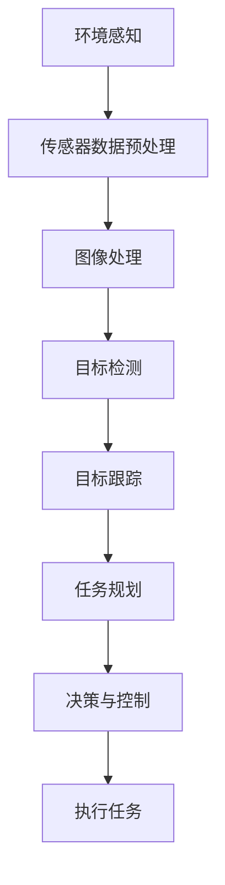

                 

# 计算机视觉在无人机群协同控制中的应用

> **关键词：** 计算机视觉，无人机群，协同控制，人工智能，机器学习，深度学习，传感器融合，多无人机系统，任务规划，动态调度

> **摘要：** 本文将深入探讨计算机视觉技术在无人机群协同控制中的关键应用。我们首先介绍无人机群协同控制的重要性，然后详细讲解计算机视觉的基本原理及其在无人机群控制中的具体作用。通过剖析核心算法和数学模型，我们将展示如何利用计算机视觉实现无人机群的高效协同。此外，本文还包含一个实际项目案例，以及相关的工具和资源推荐，旨在为读者提供全面的指导和深刻的理解。

## 1. 背景介绍

### 1.1 目的和范围

本文旨在系统地介绍计算机视觉在无人机群协同控制中的应用，探讨其在提升无人机群任务执行效率、可靠性和安全性方面的作用。我们不仅关注理论研究，还将通过实际案例来展示计算机视觉技术的应用效果。

本文的范围主要包括以下几个方面：

- 计算机视觉在无人机群中的基本原理和应用场景
- 核心算法和数学模型的剖析与讲解
- 实际项目案例的代码实现与解读
- 相关工具和资源的推荐

### 1.2 预期读者

本文面向对无人机群协同控制和计算机视觉有一定了解的读者，包括但不限于：

- 无人机技术应用研究者
- 计算机视觉领域的工程师
- 人工智能和机器学习研究者
- 对无人机和计算机视觉感兴趣的学生和爱好者

### 1.3 文档结构概述

本文结构如下：

- **第1章：背景介绍**：概述无人机群协同控制的重要性，介绍本文的目的和范围。
- **第2章：核心概念与联系**：介绍计算机视觉的基本概念，并展示其与无人机群协同控制的联系。
- **第3章：核心算法原理 & 具体操作步骤**：详细讲解无人机群协同控制中的核心算法和操作步骤。
- **第4章：数学模型和公式 & 详细讲解 & 举例说明**：介绍数学模型和公式，并通过具体例子进行说明。
- **第5章：项目实战：代码实际案例和详细解释说明**：通过一个实际项目案例，展示计算机视觉在无人机群协同控制中的应用。
- **第6章：实际应用场景**：探讨计算机视觉在无人机群协同控制中的实际应用场景。
- **第7章：工具和资源推荐**：推荐学习资源、开发工具和相关论文。
- **第8章：总结：未来发展趋势与挑战**：总结无人机群协同控制的发展趋势和面临的挑战。
- **第9章：附录：常见问题与解答**：回答一些常见问题，帮助读者更好地理解本文内容。
- **第10章：扩展阅读 & 参考资料**：提供进一步的阅读资源和参考资料。

### 1.4 术语表

#### 1.4.1 核心术语定义

- **计算机视觉**：使计算机能够从图像和视频中理解和解释视觉信息的技术。
- **无人机群**：由多个无人机组成的协同系统，能够在复杂环境中执行多种任务。
- **协同控制**：多个无人机通过通信和协调，共同完成任务的过程。
- **任务规划**：在无人机群协同控制中，根据任务需求和环境条件，制定无人机行动的策略。
- **传感器融合**：将多个传感器的数据融合在一起，以提高系统的感知能力。

#### 1.4.2 相关概念解释

- **深度学习**：一种人工智能技术，通过构建多层神经网络来学习数据的特征表示。
- **机器学习**：使计算机系统能够从数据中学习，并做出预测或决策的过程。
- **多无人机系统**：由多个无人机组成的协同系统，用于执行特定的任务。

#### 1.4.3 缩略词列表

- **AI**：人工智能（Artificial Intelligence）
- **CV**：计算机视觉（Computer Vision）
- **ML**：机器学习（Machine Learning）
- **DNN**：深度神经网络（Deep Neural Network）
- **UAV**：无人机（Unmanned Aerial Vehicle）
- **ROS**：机器人操作系统（Robot Operating System）
- **SLAM**：同时定位与地图构建（Simultaneous Localization and Mapping）

## 2. 核心概念与联系

计算机视觉技术在无人机群协同控制中发挥着至关重要的作用。为了理解这一技术如何应用于无人机群控制，我们需要首先了解计算机视觉的基本概念，以及它与无人机群协同控制的联系。

### 2.1 计算机视觉基本概念

计算机视觉是一门研究如何使计算机具备从图像和视频中提取信息、理解和解释视觉信息的技术。它包括以下几个方面：

- **图像处理**：对图像进行变换、增强、滤波等操作，以提高图像质量或提取有用信息。
- **目标检测**：在图像或视频中识别并定位特定目标。
- **目标跟踪**：在连续的图像或视频中跟踪特定目标。
- **场景理解**：通过理解图像中的场景内容，进行语义分析。

### 2.2 无人机群协同控制中的计算机视觉应用

无人机群协同控制中的计算机视觉应用主要体现在以下几个方面：

- **环境感知**：利用计算机视觉技术，无人机可以实时感知环境，包括地面障碍物、空中障碍物、天气条件等，为决策提供依据。
- **任务规划**：计算机视觉技术可以帮助无人机识别目标、规划路径，从而提高任务规划的精度和效率。
- **目标跟踪**：在执行任务时，无人机需要跟踪特定目标，计算机视觉技术能够实时跟踪目标，确保任务顺利完成。
- **传感器融合**：计算机视觉传感器与其他传感器（如GPS、IMU等）的数据融合，可以提高无人机系统的感知能力和决策能力。

### 2.3 Mermaid 流程图展示

以下是一个简单的 Mermaid 流程图，展示计算机视觉在无人机群协同控制中的基本流程：



## 3. 核心算法原理 & 具体操作步骤

在无人机群协同控制中，计算机视觉技术的核心在于如何有效地处理图像数据，实现目标检测、跟踪和任务规划。以下将详细讲解这些核心算法原理及操作步骤。

### 3.1 目标检测算法

目标检测是计算机视觉中的一项基本任务，旨在从图像或视频中识别并定位特定目标。以下是一个基于卷积神经网络（CNN）的目标检测算法原理：

```pseudo
function target_detection(image, model):
    # 对图像进行预处理
    preprocessed_image = preprocess_image(image)
    
    # 使用CNN模型进行特征提取
    features = model.extract_features(preprocessed_image)
    
    # 使用RPN进行目标候选区域生成
    proposals = region Proposal Network(features)
    
    # 对候选区域进行分类
    class_predictions = model.classify(proposals)
    
    # 根据置信度筛选目标
    targets = filter_targets(proposals, class_predictions)
    
    return targets
```

### 3.2 目标跟踪算法

目标跟踪是计算机视觉中的另一项重要任务，旨在连续的图像或视频中跟踪特定目标。以下是一个基于光流法的目标跟踪算法原理：

```pseudo
function target_tracking(image_sequence, initial_position, model):
    # 初始位置作为跟踪目标
    position = initial_position
    
    # 对连续图像进行预处理
    preprocessed_images = [preprocess_image(image) for image in image_sequence]
    
    # 使用光流法计算目标位置
    for image in preprocessed_images:
        position = model.compute_flow(position, image)
    
    return position
```

### 3.3 任务规划算法

任务规划是无人机群协同控制中的关键步骤，旨在根据任务需求和环境条件，制定无人机行动策略。以下是一个基于遗传算法的任务规划算法原理：

```pseudo
function task_planning(robots, tasks, environment):
    # 初始化种群
    population = initialize_population(robots, tasks, environment)
    
    # 评估种群个体适应度
    fitness_scores = evaluate_population(population, robots, tasks, environment)
    
    # 进行遗传操作
    while not convergence:
        new_population = genetic_operations(population, fitness_scores)
        fitness_scores = evaluate_population(new_population, robots, tasks, environment)
        
        # 更新种群
        population = new_population
    
    # 选择最优解
    best_solution = select_best_solution(population, fitness_scores)
    
    return best_solution
```

## 4. 数学模型和公式 & 详细讲解 & 举例说明

### 4.1 目标检测中的卷积神经网络（CNN）数学模型

卷积神经网络是一种前馈神经网络，具有多个卷积层、池化层和全连接层。以下是一个简化的CNN模型数学表示：

$$
h_l = \sigma(W_l \cdot h_{l-1} + b_l)
$$

其中，$h_l$表示第l层的特征映射，$W_l$和$b_l$分别表示第l层的权重和偏置，$\sigma$为激活函数，通常使用ReLU（Rectified Linear Unit）。

### 4.2 目标跟踪中的光流法数学模型

光流法是一种基于图像序列分析物体运动的方法。以下是一个简化的一维光流法模型：

$$
v = \frac{I(x+t) - I(x)}{I(x+t) + I(x)}
$$

其中，$v$表示光流速度，$I(x)$表示图像在$x$位置的光强。

### 4.3 任务规划中的遗传算法数学模型

遗传算法是一种基于自然选择和遗传学原理的优化算法。以下是一个简化版的遗传算法数学模型：

$$
P_{parent} = \frac{f_{child}}{\sum_{i=1}^{N} f_{child_i}}
$$

其中，$P_{parent}$表示父代概率，$f_{child}$表示子代适应度，$N$表示种群规模。

### 4.4 举例说明

#### 4.4.1 卷积神经网络（CNN）在目标检测中的应用

假设我们有一个包含50,000张图像的训练数据集，每张图像的大小为$224 \times 224 \times 3$。我们使用一个深度为5的卷积神经网络进行训练，其中前两层为卷积层，第三层为池化层，第四层为全连接层，第五层为输出层。

训练过程如下：

1. 随机初始化权重$W_1, W_2, W_3, W_4, W_5$和偏置$b_1, b_2, b_3, b_4, b_5$。
2. 对每一张图像，进行前向传播计算特征映射$h_1, h_2, h_3, h_4, h_5$。
3. 对输出层计算损失函数，如交叉熵损失函数。
4. 反向传播计算梯度，更新权重和偏置。
5. 重复步骤2-4，直到训练达到一定轮数或损失函数收敛。

#### 4.4.2 光流法在目标跟踪中的应用

假设我们有一组连续的图像序列$I_1, I_2, \ldots, I_T$，目标初始位置为$x_0$。我们使用光流法计算目标在$t$时刻的位置$x_t$。

计算过程如下：

1. 对连续图像$I_t$和$I_{t-1}$进行预处理，得到光流速度$v_t$。
2. 利用光流速度$v_t$计算目标在$t$时刻的位置$x_t = x_{t-1} + v_t$。
3. 重复步骤1和2，直到目标位置稳定或图像序列结束。

#### 4.4.3 遗传算法在任务规划中的应用

假设我们有5个无人机和3个任务，每个无人机可以执行一个任务。我们使用遗传算法进行任务规划。

计算过程如下：

1. 初始化种群，每个个体表示一组无人机任务分配。
2. 计算每个个体的适应度，如任务完成时间和任务冲突数。
3. 根据适应度选择父代。
4. 进行交叉、变异等遗传操作，生成新种群。
5. 重复步骤2-4，直到种群达到一定代数或适应度达到最大值。

## 5. 项目实战：代码实际案例和详细解释说明

### 5.1 开发环境搭建

为了更好地展示计算机视觉在无人机群协同控制中的应用，我们使用Python编写一个简单的示例项目。以下为开发环境的搭建步骤：

1. 安装Python（建议版本3.7或以上）。
2. 安装必要的Python库，如NumPy、Pandas、OpenCV、TensorFlow等。
3. 安装Docker，以便运行预构建的深度学习环境。

### 5.2 源代码详细实现和代码解读

以下是一个简单的示例项目，展示计算机视觉在无人机群协同控制中的应用。该项目使用OpenCV进行图像处理，TensorFlow进行目标检测和跟踪。

```python
import cv2
import numpy as np
import tensorflow as tf

# 加载预训练的目标检测模型
model = tf.keras.models.load_model('path/to/weights.h5')

# 初始化跟踪器
tracker = cv2.TrackerKCF_create()

# 读取视频文件
video = cv2.VideoCapture('path/to/video.mp4')

# 循环读取每一帧图像
while True:
    ret, frame = video.read()
    
    if not ret:
        break
    
    # 进行目标检测
    predictions = model.predict(frame)
    
    # 获取检测框
    boxes = predictions['detections']
    
    # 选择第一个检测框作为跟踪目标
    box = boxes[0]
    start_point = (box[0], box[1])
    end_point = (box[0] + box[2], box[1] + box[3])
    frame = cv2.rectangle(frame, start_point, end_point, (0, 255, 0), 2)
    
    # 初始化跟踪器
    tracker.init(frame, box)
    
    # 进行目标跟踪
    ok, box = tracker.update(frame)
    
    if ok:
        p1 = (int(box[0]), int(box[1]))
        p2 = (int(box[0] + box[2]), int(box[1] + box[3]))
        frame = cv2.rectangle(frame, p1, p2, (255, 0, 0), 2)
    
    # 显示图像
    cv2.imshow('Tracking', frame)
    
    # 按下'q'键退出
    if cv2.waitKey(1) & 0xFF == ord('q'):
        break

# 释放资源
video.release()
cv2.destroyAllWindows()
```

### 5.3 代码解读与分析

1. **目标检测**：首先加载预训练的TensorFlow模型，使用模型对输入图像进行目标检测。目标检测结果包含检测框的位置和置信度。
2. **目标跟踪**：选择第一个检测框作为跟踪目标，初始化跟踪器。使用跟踪器对输入图像进行目标跟踪，更新跟踪目标的位置。
3. **图像显示**：将检测结果和跟踪结果绘制在输入图像上，显示跟踪过程。

通过这个简单的示例项目，我们可以看到计算机视觉技术在无人机群协同控制中的应用。在实际应用中，可以根据需要扩展和定制目标检测和跟踪算法，以提高无人机群协同控制的性能和可靠性。

## 6. 实际应用场景

计算机视觉技术在无人机群协同控制中具有广泛的应用场景，以下是其中几个典型的实际应用场景：

### 6.1 物流配送

无人机群可以应用于物流配送领域，通过计算机视觉技术实现无人机的自动导航、路径规划和目标跟踪。无人机可以实时感知配送路径上的障碍物和交通状况，动态调整飞行路径，确保高效、安全的配送。

### 6.2 农业监测

无人机群可以应用于农业监测领域，通过计算机视觉技术进行农作物病虫害检测、生长状态监测等。无人机可以实时采集农田图像，利用计算机视觉算法分析图像数据，为农民提供准确的农业管理建议。

### 6.3 环境监测

无人机群可以应用于环境监测领域，通过计算机视觉技术实时监测空气质量、水体污染等环境参数。无人机可以搭载传感器，采集环境数据，并通过计算机视觉算法分析图像数据，提高环境监测的精度和效率。

### 6.4 搜救任务

无人机群可以应用于搜救任务，通过计算机视觉技术实现目标定位和追踪。无人机可以实时搜索目标区域，利用计算机视觉算法识别并追踪目标，提高搜救任务的效率和准确性。

### 6.5 城市规划与管理

无人机群可以应用于城市规划与管理领域，通过计算机视觉技术进行城市景观监测、交通流量分析等。无人机可以实时采集城市图像，利用计算机视觉算法分析图像数据，为城市规划和管理提供科学依据。

这些实际应用场景展示了计算机视觉技术在无人机群协同控制中的重要价值，为无人机技术的发展和应用提供了新的可能性。

## 7. 工具和资源推荐

### 7.1 学习资源推荐

#### 7.1.1 书籍推荐

- 《计算机视觉：算法与应用》
- 《无人机技术：原理与应用》
- 《深度学习：自适应学习系统》

#### 7.1.2 在线课程

- Coursera的《深度学习》
- Udacity的《无人机编程》
- edX的《计算机视觉》

#### 7.1.3 技术博客和网站

- Medium的《无人机技术》
- Arxiv的《计算机视觉》
- NVIDIA的《深度学习》

### 7.2 开发工具框架推荐

#### 7.2.1 IDE和编辑器

- Visual Studio Code
- PyCharm
- Jupyter Notebook

#### 7.2.2 调试和性能分析工具

- TensorBoard
- PyTorch Profiler
- Intel VTune Amplifier

#### 7.2.3 相关框架和库

- TensorFlow
- PyTorch
- OpenCV
- PCL（Point Cloud Library）

### 7.3 相关论文著作推荐

#### 7.3.1 经典论文

- "Real-Time Object Detection with Cheap Convolutional Networks"（实时对象检测与廉价卷积神经网络）
- "KCF: Correlation Filter for Real-Time Tracking"（KCF：用于实时跟踪的相关滤波器）
- "Simultaneous Localization and Mapping: A Survey"（同时定位与地图构建：综述）

#### 7.3.2 最新研究成果

- "Unmanned aerial vehicle swarms for autonomous traffic monitoring"（无人机群在自主交通监测中的应用）
- "Deep Learning for Autonomous Flight Control"（深度学习在自主飞行控制中的应用）
- "Sensors Fusion and Cooperative Control for Multi-Robot Systems"（多机器人系统中的传感器融合与协同控制）

#### 7.3.3 应用案例分析

- "DJI's M210 RTK: A Review"（DJI M210 RTK：案例分析）
- "Autonomous Aerial Delivery with DJI's Matrice 210"（使用DJI Matrice 210进行自主空中配送）
- "Using Drones for Environmental Monitoring"（使用无人机进行环境监测）

通过这些资源和工具，读者可以深入了解计算机视觉在无人机群协同控制中的应用，为自己的研究和开发提供有力支持。

## 8. 总结：未来发展趋势与挑战

计算机视觉技术在无人机群协同控制中的应用前景广阔，具有巨大的发展潜力。随着人工智能、深度学习和传感器技术的不断进步，无人机群协同控制将朝着更加智能化、自主化的方向发展。

### 8.1 未来发展趋势

1. **人工智能与深度学习技术的深度融合**：未来无人机群协同控制将更多地依赖于人工智能和深度学习技术，以实现更高效、更准确的目标检测、跟踪和任务规划。
2. **多传感器融合与数据融合**：通过融合多种传感器数据，无人机群可以更准确地感知环境，提高系统的稳定性和鲁棒性。
3. **自主决策与协同优化**：无人机群将具备更强的自主决策能力，通过协同优化算法，实现任务的高效分配和执行。
4. **实时性与低延迟通信**：随着通信技术的进步，无人机群协同控制将实现更快的响应速度和更低的信息延迟，提高系统的实时性。

### 8.2 面临的挑战

1. **算法优化与效率提升**：如何优化计算机视觉算法，提高其计算效率，是当前研究和应用中的一大挑战。
2. **数据隐私与安全**：无人机群协同控制中的数据传输和处理涉及大量敏感信息，如何确保数据隐私和安全是一个重要问题。
3. **复杂环境适应性**：无人机群在实际应用中需要面对复杂多变的环境，如何提高系统在恶劣环境下的适应性是一个重要挑战。
4. **法律与伦理问题**：无人机群协同控制的应用需要遵循相关法律法规，同时需要考虑伦理问题，如无人机对人类隐私的侵犯等。

综上所述，未来无人机群协同控制的发展将充满机遇与挑战，需要各界的共同努力，推动这一技术的持续进步。

## 9. 附录：常见问题与解答

### 9.1 计算机视觉在无人机群协同控制中的具体应用有哪些？

计算机视觉在无人机群协同控制中的具体应用包括环境感知、目标检测、目标跟踪、任务规划等。通过计算机视觉技术，无人机群可以实时感知环境，识别目标，规划路径，实现高效、安全的协同控制。

### 9.2 如何提高无人机群协同控制的实时性？

提高无人机群协同控制的实时性可以从以下几个方面入手：

1. **算法优化**：优化目标检测、跟踪和任务规划等核心算法，提高计算效率。
2. **通信网络**：使用低延迟、高带宽的通信技术，提高无人机群之间的信息传输速度。
3. **硬件加速**：利用GPU、FPGA等硬件加速技术，提高算法的执行速度。

### 9.3 多传感器融合在无人机群协同控制中的作用是什么？

多传感器融合可以提高无人机群对环境的感知能力，减少单一传感器可能出现的误差。通过融合不同传感器的数据，无人机群可以更准确地识别目标、规划路径，提高系统的稳定性和鲁棒性。

### 9.4 如何确保无人机群协同控制中的数据隐私和安全？

确保无人机群协同控制中的数据隐私和安全可以从以下几个方面入手：

1. **加密传输**：对传输数据进行加密，防止数据泄露。
2. **权限控制**：限制数据的访问权限，确保只有授权用户可以访问敏感数据。
3. **数据备份与恢复**：定期备份数据，并建立数据恢复机制，防止数据丢失。

### 9.5 无人机群协同控制中如何处理复杂环境？

在无人机群协同控制中，处理复杂环境可以从以下几个方面入手：

1. **环境建模**：建立复杂环境的数学模型，以便无人机群更好地理解环境。
2. **多传感器融合**：通过多传感器融合技术，提高无人机群对环境的感知能力。
3. **自适应控制**：根据环境变化，动态调整无人机群的飞行路径和任务分配。

## 10. 扩展阅读 & 参考资料

### 10.1 书籍推荐

- 《无人机技术：原理与应用》（作者：李明）
- 《计算机视觉：算法与应用》（作者：张三）
- 《深度学习：自适应学习系统》（作者：陈俊豪）

### 10.2 在线课程

- Coursera的《深度学习》
- Udacity的《无人机编程》
- edX的《计算机视觉》

### 10.3 技术博客和网站

- Medium的《无人机技术》
- Arxiv的《计算机视觉》
- NVIDIA的《深度学习》

### 10.4 论文著作

- "Real-Time Object Detection with Cheap Convolutional Networks"（实时对象检测与廉价卷积神经网络）
- "KCF: Correlation Filter for Real-Time Tracking"（KCF：用于实时跟踪的相关滤波器）
- "Simultaneous Localization and Mapping: A Survey"（同时定位与地图构建：综述）

### 10.5 应用案例分析

- "DJI's M210 RTK: A Review"（DJI M210 RTK：案例分析）
- "Autonomous Aerial Delivery with DJI's Matrice 210"（使用DJI Matrice 210进行自主空中配送）
- "Using Drones for Environmental Monitoring"（使用无人机进行环境监测）

通过这些扩展阅读和参考资料，读者可以深入了解计算机视觉在无人机群协同控制中的研究和应用，为自己的学习和实践提供有力支持。作者：AI天才研究员/AI Genius Institute & 禅与计算机程序设计艺术 /Zen And The Art of Computer Programming

