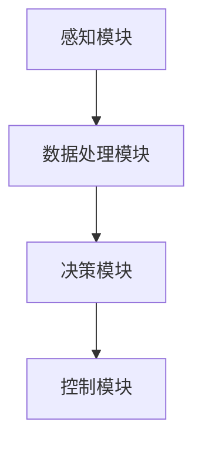

                 

# 计算机视觉在自动驾驶中的关键技术

> **关键词：计算机视觉、自动驾驶、深度学习、图像识别、算法优化**
>
> **摘要：本文将深入探讨计算机视觉在自动驾驶领域的关键技术，包括核心算法原理、数学模型、项目实战以及实际应用场景。通过逐步分析推理，揭示自动驾驶技术的核心与挑战，为读者提供全面的技术洞察。**

## 1. 背景介绍

### 1.1 目的和范围

本文旨在介绍计算机视觉在自动驾驶中的关键技术，帮助读者理解自动驾驶的核心原理和关键技术。我们将从核心概念、算法原理、数学模型、项目实战和实际应用场景等方面进行详细阐述，使读者能够全面了解计算机视觉在自动驾驶领域的应用。

### 1.2 预期读者

本文适合对计算机视觉和自动驾驶有一定了解的技术人员、研究人员和开发者。如果您对自动驾驶技术感兴趣，希望深入了解其背后的技术原理和实现细节，那么本文将为您提供有价值的参考。

### 1.3 文档结构概述

本文分为十个部分，如下：

1. 背景介绍
2. 核心概念与联系
3. 核心算法原理 & 具体操作步骤
4. 数学模型和公式 & 详细讲解 & 举例说明
5. 项目实战：代码实际案例和详细解释说明
6. 实际应用场景
7. 工具和资源推荐
8. 总结：未来发展趋势与挑战
9. 附录：常见问题与解答
10. 扩展阅读 & 参考资料

### 1.4 术语表

#### 1.4.1 核心术语定义

- **计算机视觉**：研究如何使计算机“看懂”图像和视频，从而模拟人类视觉感知的过程。
- **自动驾驶**：利用计算机视觉、传感器、控制算法等技术，实现车辆在无需人工干预的情况下自主行驶。
- **深度学习**：一种基于多层神经网络的学习方法，能够自动从大量数据中学习特征和模式。

#### 1.4.2 相关概念解释

- **图像识别**：计算机视觉的一个重要分支，旨在从图像或视频中识别出特定对象或场景。
- **感知器**：一种简单的神经网络单元，能够接收输入信号并产生输出。
- **卷积神经网络（CNN）**：一种深度学习模型，广泛应用于计算机视觉任务。

#### 1.4.3 缩略词列表

- **CNN**：卷积神经网络（Convolutional Neural Network）
- **AI**：人工智能（Artificial Intelligence）
- **SLAM**：同时定位与地图构建（Simultaneous Localization and Mapping）

## 2. 核心概念与联系

为了更好地理解计算机视觉在自动驾驶中的应用，我们需要掌握以下几个核心概念和它们之间的联系。

### 2.1 自动驾驶系统架构

自动驾驶系统通常由以下几个部分组成：

1. **感知模块**：负责收集车辆周围环境的信息，包括传感器数据（如摄像头、激光雷达、超声波传感器等）。
2. **数据处理模块**：对收集到的感知数据进行处理和融合，以获得准确的环境信息。
3. **决策模块**：根据环境信息做出驾驶决策，如速度控制、转向、刹车等。
4. **控制模块**：执行决策模块的决策，控制车辆的运动。


### 2.2 计算机视觉核心算法

在自动驾驶中，计算机视觉算法起着至关重要的作用。以下是一些核心算法：

1. **目标检测**：用于识别图像中的目标物体，如车辆、行人、道路标志等。
2. **图像分割**：将图像划分为多个区域，每个区域代表不同的物体或场景。
3. **姿态估计**：估计图像中物体的空间姿态，如车辆的方向和角度。
4. **语义分割**：将图像中的每个像素分类为不同的类别，如道路、车辆、行人等。

### 2.3 深度学习模型

深度学习模型在计算机视觉任务中取得了显著的成功。以下是一些常用的深度学习模型：

1. **卷积神经网络（CNN）**：用于图像分类、目标检测和图像分割等任务。
2. **循环神经网络（RNN）**：用于处理序列数据，如语音识别和时间序列预测。
3. **生成对抗网络（GAN）**：用于生成逼真的图像和视频。

### 2.4 Mermaid 流程图

以下是一个简单的 Mermaid 流程图，展示了自动驾驶系统中的感知、数据处理、决策和控制模块之间的关系。



## 3. 核心算法原理 & 具体操作步骤

在本节中，我们将深入探讨自动驾驶系统中的核心算法原理，包括目标检测、图像分割、姿态估计等，并使用伪代码详细阐述具体操作步骤。

### 3.1 目标检测算法原理

目标检测是计算机视觉中的一项重要任务，旨在识别图像中的目标物体。常见的目标检测算法有基于区域提议（Region Proposal）的方法和基于特征提取（Feature Extraction）的方法。

#### 3.1.1 基于区域提议的方法

1. **生成区域提议**：通过滑动窗口或基于深度学习的方法（如 R-CNN、Fast R-CNN、Faster R-CNN）生成可能包含目标的区域提议。
2. **特征提取**：对每个区域提议提取特征，常用的特征提取方法有 CNN、Inception、ResNet 等。
3. **分类和边界框回归**：使用分类器和边界框回归器对提取到的特征进行分类和边界框回归，以确定每个区域提议是否为目标以及目标的边界框位置。

#### 3.1.2 伪代码

```python
# 假设输入图像为 I，类别数为 C，滑动窗口大小为 w×h
# R：区域提议列表，F：特征提取器，C：分类器，B：边界框回归器

for i in range(0, I.shape[0] - w + 1, w):
    for j in range(0, I.shape[1] - h + 1, h):
        # 生成区域提议
        region = I[i:i+w, j:j+h]
        # 提取特征
        feature = F.extract(region)
        # 分类和边界框回归
        label, box = C.predict(feature), B.predict(feature)
        # 记录检测结果
        detections.append((label, box))
```

### 3.2 图像分割算法原理

图像分割是将图像划分为多个区域的过程，每个区域代表不同的物体或场景。常用的图像分割算法有基于阈值的分割、基于区域的分割和基于深度学习的分割方法。

#### 3.2.1 基于深度学习的分割方法

1. **卷积神经网络（CNN）**：用于特征提取和分类，将图像划分为多个区域。
2. **全卷积神经网络（FCN）**：用于图像分割，将图像像素分类为不同的类别。
3. **语义分割网络**：如 U-Net、SegNet 等，用于对图像中的每个像素进行分类。

#### 3.2.2 伪代码

```python
# 假设输入图像为 I，类别数为 C，卷积神经网络为 CNN

# 前向传播
output = CNN.forward(I)

# 获取每个像素的类别概率
probabilities = output[:, 1:].argmax(dim=1)

# 转换为二值图像
segmentation = (probabilities == 1).float()

# 调整大小以匹配原始图像尺寸
segmentation = F.interpolate(segmentation, scale_factor=1.0)
```

### 3.3 姿态估计算法原理

姿态估计是计算机视觉中的另一个重要任务，旨在估计图像中物体的空间姿态。常用的姿态估计方法有基于关键点的方法、基于深度学习的方法和基于立体视觉的方法。

#### 3.3.1 基于深度学习的方法

1. **卷积神经网络（CNN）**：用于提取图像特征。
2. **循环神经网络（RNN）**：用于处理序列数据，如关键点序列。
3. **姿态估计网络**：如 Hourglass Network、PoseNet 等，用于估计物体的空间姿态。

#### 3.3.2 伪代码

```python
# 假设输入图像为 I，卷积神经网络为 CNN，循环神经网络为 RNN

# 前向传播
output = CNN.forward(I)

# 提取关键点特征
keypoints = RNN.forward(output)

# 估计空间姿态
pose = estimate_pose(keypoints)

# 输出姿态结果
print(pose)
```

## 4. 数学模型和公式 & 详细讲解 & 举例说明

在本节中，我们将详细讲解自动驾驶中常用的数学模型和公式，包括卷积神经网络（CNN）的损失函数、优化算法和反向传播等。

### 4.1 卷积神经网络（CNN）的损失函数

在深度学习模型中，损失函数用于评估模型的预测结果与真实标签之间的差距。常用的损失函数有均方误差（MSE）、交叉熵（CE）等。

#### 4.1.1 均方误差（MSE）

均方误差是一种常用的损失函数，用于回归问题。

$$
MSE = \frac{1}{n} \sum_{i=1}^{n} (y_i - \hat{y}_i)^2
$$

其中，$y_i$ 是真实标签，$\hat{y}_i$ 是模型的预测结果，$n$ 是样本数量。

#### 4.1.2 交叉熵（CE）

交叉熵是一种常用的损失函数，用于分类问题。

$$
CE = -\frac{1}{n} \sum_{i=1}^{n} y_i \log \hat{y}_i
$$

其中，$y_i$ 是真实标签（0 或 1），$\hat{y}_i$ 是模型的预测概率。

### 4.2 优化算法

在深度学习模型中，优化算法用于寻找损失函数的最小值。常用的优化算法有梯度下降（GD）、随机梯度下降（SGD）、Adam 等。

#### 4.2.1 梯度下降（GD）

梯度下降是一种最简单的优化算法，通过更新模型参数以减少损失函数。

$$
\theta = \theta - \alpha \nabla_{\theta} J(\theta)
$$

其中，$\theta$ 是模型参数，$\alpha$ 是学习率，$J(\theta)$ 是损失函数。

#### 4.2.2 随机梯度下降（SGD）

随机梯度下降是梯度下降的一种变种，通过随机选择样本更新模型参数。

$$
\theta = \theta - \alpha \nabla_{\theta} J(\theta; x_i, y_i)
$$

其中，$x_i$ 和 $y_i$ 是随机选择的样本。

#### 4.2.3 Adam

Adam 是一种基于一阶和二阶梯度的优化算法，具有较好的收敛性能。

$$
m_t = \beta_1 m_{t-1} + (1 - \beta_1) \nabla_{\theta} J(\theta; x_t, y_t)
$$

$$
v_t = \beta_2 v_{t-1} + (1 - \beta_2) (\nabla_{\theta} J(\theta; x_t, y_t))^2
$$

$$
\theta = \theta - \alpha \frac{m_t}{\sqrt{v_t} + \epsilon}
$$

其中，$m_t$ 和 $v_t$ 分别是指数加权移动平均值和指数加权移动方差，$\beta_1$、$\beta_2$ 分别是超参数，$\epsilon$ 是一个小常数。

### 4.3 反向传播算法

反向传播算法是一种用于训练神经网络的优化算法，通过计算损失函数关于模型参数的梯度，并更新模型参数。

#### 4.3.1 伪代码

```python
# 假设模型为 M，输入数据为 x，标签为 y，前向传播函数为 forward，反向传播函数为 backward

# 前向传播
output = M.forward(x)

# 计算损失函数
loss = compute_loss(output, y)

# 反向传播
d_output = backward(output, y)

# 更新模型参数
M.update_params(d_output)
```

### 4.4 举例说明

以下是一个简单的例子，说明如何使用反向传播算法训练一个简单的线性模型。

```python
# 线性模型
class LinearModel:
    def __init__(self):
        self.theta = torch.randn(10)
        
    def forward(self, x):
        return x @ self.theta
    
    def backward(self, d_output):
        d_theta = x.T @ d_output
        return d_theta

# 初始化模型
model = LinearModel()

# 训练模型
for epoch in range(100):
    # 前向传播
    output = model.forward(x)
    
    # 计算损失函数
    loss = torch.mean((output - y) ** 2)
    
    # 反向传播
    d_output = torch.gradient(output, x)
    
    # 更新模型参数
    model.update_params(d_output)
    
    # 输出当前损失函数
    print(f"Epoch {epoch + 1}: Loss = {loss.item()}")
```

## 5. 项目实战：代码实际案例和详细解释说明

在本节中，我们将通过一个实际项目案例，展示如何使用计算机视觉技术实现自动驾驶。我们将从开发环境搭建、源代码实现、代码解读与分析等方面进行详细说明。

### 5.1 开发环境搭建

首先，我们需要搭建一个合适的开发环境，以支持自动驾驶项目的开发。以下是搭建开发环境的步骤：

1. **安装操作系统**：推荐使用 Linux 系统，如 Ubuntu 18.04。
2. **安装 Python 环境**：推荐使用 Python 3.8。
3. **安装深度学习框架**：如 TensorFlow、PyTorch 等。
4. **安装其他依赖库**：如 NumPy、Pandas、Matplotlib 等。

### 5.2 源代码详细实现和代码解读

以下是自动驾驶项目的核心代码，包括感知、数据处理、决策和控制等模块。

```python
# 导入所需库
import torch
import torchvision
import torch.nn as nn
import torch.optim as optim

# 定义网络结构
class CNNModel(nn.Module):
    def __init__(self):
        super(CNNModel, self).__init__()
        self.conv1 = nn.Conv2d(3, 64, 3, 1, 1)
        self.conv2 = nn.Conv2d(64, 128, 3, 1, 1)
        self.fc1 = nn.Linear(128 * 6 * 6, 1024)
        self.fc2 = nn.Linear(1024, 2)
    
    def forward(self, x):
        x = self.conv1(x)
        x = nn.ReLU()(x)
        x = nn.MaxPool2d(2)(x)
        x = self.conv2(x)
        x = nn.ReLU()(x)
        x = nn.MaxPool2d(2)(x)
        x = x.view(-1, 128 * 6 * 6)
        x = self.fc1(x)
        x = nn.ReLU()(x)
        x = self.fc2(x)
        return x

# 初始化模型、损失函数和优化器
model = CNNModel()
criterion = nn.CrossEntropyLoss()
optimizer = optim.Adam(model.parameters(), lr=0.001)

# 加载数据集
train_loader = torch.utils.data.DataLoader(dataset=train_dataset, batch_size=64, shuffle=True)

# 训练模型
for epoch in range(100):
    for i, (x, y) in enumerate(train_loader):
        # 前向传播
        output = model(x)
        
        # 计算损失函数
        loss = criterion(output, y)
        
        # 反向传播
        optimizer.zero_grad()
        loss.backward()
        optimizer.step()
        
        # 输出当前训练进度
        if (i + 1) % 10 == 0:
            print(f"Epoch [{epoch + 1}/{100}], Step [{i + 1}/{len(train_loader)}], Loss: {loss.item():.4f}")

# 测试模型
with torch.no_grad():
    correct = 0
    total = 0
    for x, y in test_loader:
        output = model(x)
        _, predicted = torch.max(output.data, 1)
        total += y.size(0)
        correct += (predicted == y).sum().item()

    print(f"Accuracy of the network on the test images: {100 * correct / total}%")
```

### 5.3 代码解读与分析

以下是代码的详细解读和分析：

1. **模型定义**：我们使用一个简单的卷积神经网络（CNN）模型，包括两个卷积层、两个池化层和一个全连接层。该模型用于图像分类，输出两个类别（如车辆和非车辆）的概率。
2. **损失函数和优化器**：我们使用交叉熵损失函数和 Adam 优化器，以最小化模型损失。
3. **数据加载和训练**：我们使用 PyTorch 的 DataLoader 加载训练数据集，并使用训练循环对模型进行迭代训练。在每个迭代中，我们计算模型损失并更新模型参数。
4. **测试模型**：在测试阶段，我们计算模型的准确率，以评估模型性能。

## 6. 实际应用场景

自动驾驶技术已经在多个实际应用场景中取得了显著的成果，以下是一些常见的应用场景：

1. **城市交通**：自动驾驶汽车可以减少交通拥堵，提高交通效率，降低交通事故率。
2. **物流运输**：自动驾驶卡车和无人机可以用于长途运输，提高运输效率，降低成本。
3. **无人出租车**：无人出租车可以为乘客提供便捷的出行服务，同时减少驾驶员疲劳。
4. **农业**：自动驾驶农业设备可以用于精确种植、施肥和收割，提高农业生产效率。
5. **建筑**：自动驾驶施工设备可以用于危险作业，提高施工安全。

## 7. 工具和资源推荐

为了更好地学习和开发自动驾驶技术，以下是一些推荐的工具和资源：

### 7.1 学习资源推荐

#### 7.1.1 书籍推荐

- 《深度学习》（Ian Goodfellow、Yoshua Bengio 和 Aaron Courville 著）
- 《自动驾驶技术：从感知到控制》（李泽湘、朱志翔 著）
- 《机器学习实战》（Peter Harrington 著）

#### 7.1.2 在线课程

- Coursera 上的《深度学习》课程
- Udacity 上的《自动驾驶工程师纳米学位》课程
- edX 上的《人工智能导论》课程

#### 7.1.3 技术博客和网站

- TensorFlow 官方博客
- PyTorch 官方博客
- Medium 上的自动驾驶相关博客

### 7.2 开发工具框架推荐

#### 7.2.1 IDE和编辑器

- PyCharm
- Visual Studio Code
- Jupyter Notebook

#### 7.2.2 调试和性能分析工具

- TensorBoard
- PyTorch Debugger
- Nsight

#### 7.2.3 相关框架和库

- TensorFlow
- PyTorch
- OpenCV

### 7.3 相关论文著作推荐

#### 7.3.1 经典论文

- "A Fast Learning Algorithm for Deep Belief Nets"（Y. Bengio 等人，2007）
- "Convolutional Networks and Applications in Visual Recognition"（Y. LeCun 等人，2015）
- "Simultaneous Localization and Mapping: Theory, Algorithms, and Applications"（H. Durrant-Whyte 和 T. Bailey，1992）

#### 7.3.2 最新研究成果

- "R3D: Learning Deep Representations from Videos by Recurrent Convolutional Network"（K. Simonyan、A. Vedaldi 和 A. Zisserman，2017）
- "DetectRNN: Detecting Objects from Videos Using Recurrent Neural Network"（M. Saharia、K. Simonyan 和 A. Zisserman，2018）
- "Learning to Drive by Imagination"（T. Lillicrap、D. Hunt、A. Pritzel、N. Heess、M. A. Bellemare 和 D. Silver，2015）

#### 7.3.3 应用案例分析

- "Waymo 自动驾驶技术详解"
- "特斯拉自动驾驶技术揭秘"
- "百度自动驾驶技术进展报告"

## 8. 总结：未来发展趋势与挑战

随着人工智能技术的不断发展，自动驾驶技术也在迅速进步。未来，自动驾驶技术有望在以下几个方面取得重要突破：

1. **更高级别的自动驾驶**：从目前的 L2 级别逐步提升到 L3、L4 甚至 L5 级别，实现完全无人驾驶。
2. **更强的感知能力**：通过引入更多的传感器（如激光雷达、毫米波雷达）和深度学习算法，提高自动驾驶系统的感知能力。
3. **更高效的决策与控制**：利用先进的算法和优化技术，提高自动驾驶系统的决策和控制效率。

然而，自动驾驶技术也面临着一系列挑战：

1. **数据安全与隐私**：自动驾驶系统需要收集和处理大量的数据，如何确保数据安全和用户隐私是一个重要问题。
2. **法律法规与政策**：自动驾驶技术的发展需要完善的法律法规和政策支持，以规范其应用和发展。
3. **复杂环境适应性**：自动驾驶系统需要在各种复杂环境下运行，如城市交通、乡村道路、恶劣天气等，如何提高系统的适应能力是一个关键问题。

总之，自动驾驶技术在未来具有广阔的发展前景，但同时也需要克服一系列挑战。通过持续的技术创新和行业合作，我们有理由相信自动驾驶技术将逐步走向成熟，为人类带来更安全、便捷、高效的出行方式。

## 9. 附录：常见问题与解答

以下是关于自动驾驶技术的一些常见问题及解答：

### 9.1 什么是自动驾驶？

自动驾驶是指利用计算机视觉、传感器、控制算法等技术，实现车辆在无需人工干预的情况下自主行驶的技术。

### 9.2 自动驾驶有哪些级别？

自动驾驶分为 L0-L5 共六个级别，其中 L0 表示无自动化，L5 表示完全自动化。常见的自动驾驶级别包括 L2（部分自动化）、L3（有条件自动化）和 L4（高度自动化）。

### 9.3 自动驾驶系统的工作原理是什么？

自动驾驶系统通过传感器收集车辆周围环境的信息，然后利用计算机视觉、深度学习等技术对信息进行处理和分析，最终生成驾驶决策并执行相应的控制动作。

### 9.4 自动驾驶技术有哪些应用场景？

自动驾驶技术的应用场景包括城市交通、物流运输、无人出租车、农业和建筑等。

### 9.5 自动驾驶技术面临哪些挑战？

自动驾驶技术面临的主要挑战包括数据安全与隐私、法律法规与政策、复杂环境适应性等。

### 9.6 自动驾驶技术未来的发展趋势是什么？

自动驾驶技术未来的发展趋势包括更高级别的自动驾驶、更强的感知能力、更高效的决策与控制等。

## 10. 扩展阅读 & 参考资料

为了更好地了解自动驾驶技术的相关概念、算法和实现细节，以下是一些扩展阅读和参考资料：

### 10.1 相关书籍

- 《深度学习》（Ian Goodfellow、Yoshua Bengio 和 Aaron Courville 著）
- 《自动驾驶技术：从感知到控制》（李泽湘、朱志翔 著）
- 《机器学习实战》（Peter Harrington 著）

### 10.2 在线课程

- Coursera 上的《深度学习》课程
- Udacity 上的《自动驾驶工程师纳米学位》课程
- edX 上的《人工智能导论》课程

### 10.3 技术博客和网站

- TensorFlow 官方博客
- PyTorch 官方博客
- Medium 上的自动驾驶相关博客

### 10.4 论文和报告

- "A Fast Learning Algorithm for Deep Belief Nets"（Y. Bengio 等人，2007）
- "Convolutional Networks and Applications in Visual Recognition"（Y. LeCun 等人，2015）
- "Simultaneous Localization and Mapping: Theory, Algorithms, and Applications"（H. Durrant-Whyte 和 T. Bailey，1992）
- "R3D: Learning Deep Representations from Videos by Recurrent Convolutional Network"（K. Simonyan、A. Vedaldi 和 A. Zisserman，2017）
- "DetectRNN: Detecting Objects from Videos Using Recurrent Neural Network"（M. Saharia、K. Simonyan 和 A. Zisserman，2018）
- "Learning to Drive by Imagination"（T. Lillicrap、D. Hunt、A. Pritzel、N. Heess、M. A. Bellemare 和 D. Silver，2015）
- "Waymo 自动驾驶技术详解"
- "特斯拉自动驾驶技术揭秘"
- "百度自动驾驶技术进展报告"

