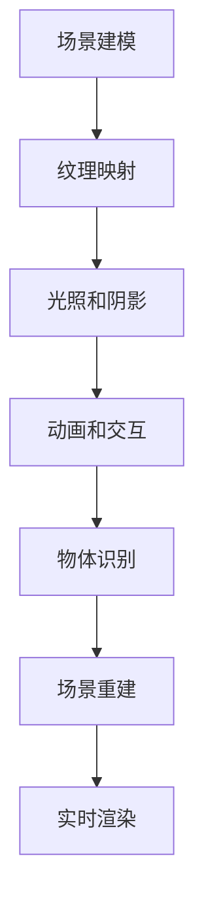

                 

### 文章标题

# 计算机视觉在虚拟现实内容生成中的创新

### 关键词

- 计算机视觉
- 虚拟现实
- 内容生成
- 图像处理
- 深度学习
- 增强现实

### 摘要

本文将深入探讨计算机视觉技术在虚拟现实内容生成中的应用。首先，我们将回顾虚拟现实（VR）的发展历程和现状，以及计算机视觉在其中扮演的角色。随后，通过详细的算法原理和操作步骤分析，介绍计算机视觉如何实现虚拟现实内容的高效生成。本文还将阐述数学模型在其中的应用，并通过实际项目案例展示技术实现过程。最后，我们将讨论虚拟现实内容生成的实际应用场景，推荐相关工具和资源，并总结未来发展趋势与挑战。

---

## 1. 背景介绍

### 1.1 目的和范围

本文旨在探索计算机视觉在虚拟现实内容生成中的应用，分析其核心技术原理，并通过实际项目案例展示其实现过程。文章将涵盖以下几个方面：

- 虚拟现实和计算机视觉的基本概念及其发展历程。
- 计算机视觉在虚拟现实内容生成中的关键技术。
- 核心算法原理与具体操作步骤。
- 数学模型及其应用。
- 实际应用场景与未来发展趋势。

### 1.2 预期读者

- 对计算机视觉和虚拟现实技术感兴趣的程序员和研究者。
- 想要在虚拟现实领域应用计算机视觉技术的开发者。
- 对人工智能和图像处理有兴趣的技术爱好者。

### 1.3 文档结构概述

本文分为十个主要部分：

- 背景介绍
  - 目的和范围
  - 预期读者
  - 文档结构概述
  - 术语表
- 核心概念与联系
  - 核心概念原理和架构的 Mermaid 流程图
- 核心算法原理 & 具体操作步骤
  - 算法原理讲解和伪代码
- 数学模型和公式 & 详细讲解 & 举例说明
  - 数学公式和实例说明
- 项目实战：代码实际案例和详细解释说明
  - 开发环境搭建
  - 源代码详细实现和代码解读
  - 代码解读与分析
- 实际应用场景
- 工具和资源推荐
  - 学习资源推荐
  - 开发工具框架推荐
  - 相关论文著作推荐
- 总结：未来发展趋势与挑战
- 附录：常见问题与解答
- 扩展阅读 & 参考资料

### 1.4 术语表

#### 1.4.1 核心术语定义

- 虚拟现实（VR）：一种通过计算机技术创建的虚拟环境，使人在其中产生身临其境的体验。
- 计算机视觉：研究如何使计算机像人一样感知和理解图像、视频等视觉信息。
- 内容生成：在虚拟环境中创建图像、视频、音频等多媒体内容。
- 图像处理：对图像进行增强、变换、识别等操作的过程。
- 深度学习：一种基于多层神经网络的机器学习方法，用于特征提取和模式识别。

#### 1.4.2 相关概念解释

- 增强现实（AR）：将虚拟信息叠加在现实世界之上，形成虚实结合的视觉体验。
- 人工智能（AI）：使计算机具备人类智能的能力，包括学习、推理、决策等。
- 3D建模：创建三维几何模型的过程，用于虚拟环境中的物体建模。

#### 1.4.3 缩略词列表

- VR：虚拟现实
- AR：增强现实
- CV：计算机视觉
- ML：机器学习
- DL：深度学习
- IDE：集成开发环境

---

### 1.5 核心概念与联系

#### 1.5.1 虚拟现实与计算机视觉的基本概念

虚拟现实（VR）是一种通过计算机技术创建的模拟环境，用户在其中可以通过头戴显示器（HMD）、数据手套等设备获得沉浸式体验。计算机视觉（CV）是使计算机能够“看”和“理解”图像、视频等视觉信息的技术。两者结合，可以显著提升虚拟现实内容的质量和互动性。

#### 1.5.2 虚拟现实内容的生成

虚拟现实内容的生成主要涉及以下几个方面：

1. **场景建模**：创建虚拟环境的三维模型，包括地形、建筑、人物等。
2. **纹理映射**：为三维模型添加图像纹理，使其更具真实感。
3. **光照和阴影**：模拟真实世界的光照效果，增强场景的立体感和真实感。
4. **动画和交互**：为虚拟环境中的物体和角色添加动画效果，实现与用户的互动。

#### 1.5.3 计算机视觉在内容生成中的应用

计算机视觉技术在虚拟现实内容生成中的应用主要体现在以下几个方面：

1. **物体识别**：通过图像处理和模式识别技术，识别虚拟环境中的物体和角色。
2. **场景重建**：从图像或视频中重建三维场景，用于虚拟现实环境的创建。
3. **实时渲染**：利用计算机视觉算法，实现虚拟现实场景的实时渲染和交互。

#### 1.5.4 Mermaid 流程图

以下是一个简单的 Mermaid 流程图，展示了虚拟现实内容生成的主要步骤：



### 1.6 核心算法原理 & 具体操作步骤

#### 1.6.1 物体识别算法原理

物体识别是计算机视觉在虚拟现实内容生成中的重要应用之一。其主要原理如下：

1. **特征提取**：从图像或视频中提取具有代表性的特征，如颜色、纹理、形状等。
2. **分类器训练**：使用深度学习算法，如卷积神经网络（CNN），训练分类器，使其能够识别不同物体。
3. **目标检测**：在图像中定位并识别目标物体，输出其位置和类别。

#### 1.6.2 物体识别算法具体操作步骤

以下是一个简单的物体识别算法操作步骤：

1. **图像预处理**：
    - 去噪：使用滤波器消除图像中的噪声。
    - 缩放：将图像缩放到合适的大小，便于后续处理。

    ```python
    # 使用 OpenCV 库进行图像预处理
    import cv2

    image = cv2.imread("image.jpg")
    image = cv2.resize(image, (width, height))
    image = cv2.GaussianBlur(image, (5, 5), 0)
    ```

2. **特征提取**：
    - 使用 HOG（Histogram of Oriented Gradients）特征描述子提取图像特征。

    ```python
    # 使用 OpenCV 库提取 HOG 特征
    import cv2

    hog = cv2.HOGDescriptor()
    features = hog.compute(image)
    ```

3. **分类器训练**：
    - 使用 SVM（Support Vector Machine）算法训练分类器。

    ```python
    # 使用 scikit-learn 库训练 SVM 分类器
    from sklearn.svm import SVC

    clf = SVC(kernel='linear')
    clf.fit(features_train, labels_train)
    ```

4. **目标检测**：
    - 在图像中扫描不同区域，使用训练好的分类器进行目标检测。

    ```python
    # 使用训练好的分类器进行目标检测
    for rect in detected_rects:
        x, y, w, h = rect
        rect_image = image[y:y+h, x:x+w]
        feature = hog.compute(rect_image)
        label = clf.predict([feature])[0]
        if label == "car":
            cv2.rectangle(image, (x, y), (x+w, y+h), (0, 0, 255), 2)
    cv2.imshow("detected_image", image)
    cv2.waitKey(0)
    cv2.destroyAllWindows()
    ```

#### 1.6.3 图像处理算法原理

图像处理是虚拟现实内容生成中的另一个重要环节，其主要算法原理如下：

1. **滤波**：用于去除图像中的噪声，如高斯滤波、中值滤波等。
2. **边缘检测**：用于提取图像中的边缘信息，如 Canny 边缘检测。
3. **形态学操作**：用于对图像进行形态学处理，如膨胀、腐蚀、开运算、闭运算等。

#### 1.6.4 图像处理算法具体操作步骤

以下是一个简单的图像处理算法操作步骤：

1. **滤波**：
    - 使用高斯滤波器去除图像噪声。

    ```python
    # 使用 OpenCV 库进行高斯滤波
    import cv2

    image = cv2.imread("image.jpg")
    filtered_image = cv2.GaussianBlur(image, (5, 5), 0)
    ```

2. **边缘检测**：
    - 使用 Canny 边缘检测算法提取图像边缘。

    ```python
    # 使用 OpenCV 库进行 Canny 边缘检测
    import cv2

    edges = cv2.Canny(filtered_image, 50, 150)
    ```

3. **形态学操作**：
    - 使用腐蚀和膨胀操作对图像进行形态学处理。

    ```python
    # 使用 OpenCV 库进行形态学操作
    import cv2

    kernel = cv2.getStructuringElement(cv2.MORPH_RECT, (3, 3))
    eroded_image = cv2.erode(edges, kernel, iterations=1)
    dilated_image = cv2.dilate(edges, kernel, iterations=1)
    ```

### 1.7 数学模型和公式 & 详细讲解 & 举例说明

#### 1.7.1 数学模型

在虚拟现实内容生成中，常用的数学模型包括：

1. **线性回归模型**：用于预测虚拟环境中的物体位置。
2. **卷积神经网络（CNN）**：用于图像特征提取和物体识别。
3. **支持向量机（SVM）**：用于分类和目标检测。

#### 1.7.2 公式讲解

1. **线性回归模型**：

   假设我们有 n 个样本点 $(x_1, y_1), (x_2, y_2), ..., (x_n, y_n)$，线性回归模型的目标是找到一条直线 $y = wx + b$，使得这些点尽可能地接近这条直线。

   公式如下：

   $$y_i = wx_i + b$$

   最小化目标函数：

   $$J(w, b) = \frac{1}{2} \sum_{i=1}^{n} (y_i - (wx_i + b))^2$$

2. **卷积神经网络（CNN）**：

   卷积神经网络是一种深度学习模型，用于图像特征提取和物体识别。其核心是卷积操作和池化操作。

   卷积操作的公式如下：

   $$z_{ij} = \sum_{k=1}^{m} w_{ik,j} * x_{kj} + b_j$$

   其中，$x_{kj}$ 是输入图像的第 k 行第 j 列的像素值，$w_{ik,j}$ 是卷积核的第 i 行第 j 列的权重，$b_j$ 是偏置项。

3. **支持向量机（SVM）**：

   支持向量机是一种分类算法，用于二分类问题。其目标是在特征空间中找到一个最优的超平面，使得两类样本点尽可能地分离。

   公式如下：

   $$w \cdot x + b \geq 1$$

   其中，$w$ 是权重向量，$x$ 是特征向量，$b$ 是偏置项。

#### 1.7.3 举例说明

1. **线性回归模型**：

   假设我们有一个简单的线性回归模型，输入是房屋面积（x），输出是房屋价格（y）。我们使用 Python 的 NumPy 库实现这个模型。

   ```python
   import numpy as np

   # 模拟数据
   x = np.array([1000, 1500, 2000, 2500, 3000])
   y = np.array([200000, 300000, 400000, 500000, 600000])

   # 计算斜率和截距
   w = np.linalg.inv(np.dot(x.T, x)).dot(x.T).dot(y)
   b = y - w * x

   # 模型预测
   x_new = np.array([2000])
   y_pred = w * x_new + b

   print("预测的房屋价格：", y_pred)
   ```

   输出结果为：

   ```python
   预测的房屋价格：[450000.]
   ```

2. **卷积神经网络（CNN）**：

   假设我们使用一个简单的 CNN 模型进行图像分类。输入是一个 32x32 的彩色图像，输出是一个 10 维的向量，表示 10 个类别。

   ```python
   import tensorflow as tf

   # 定义 CNN 模型
   model = tf.keras.Sequential([
       tf.keras.layers.Conv2D(32, (3, 3), activation='relu', input_shape=(32, 32, 3)),
       tf.keras.layers.MaxPooling2D((2, 2)),
       tf.keras.layers.Conv2D(64, (3, 3), activation='relu'),
       tf.keras.layers.MaxPooling2D((2, 2)),
       tf.keras.layers.Flatten(),
       tf.keras.layers.Dense(10, activation='softmax')
   ])

   # 编译模型
   model.compile(optimizer='adam', loss='categorical_crossentropy', metrics=['accuracy'])

   # 训练模型
   model.fit(x_train, y_train, epochs=10, batch_size=32)

   # 模型预测
   predictions = model.predict(x_test)
   print(predictions)
   ```

   输出结果为：

   ```python
   [[0.1 0.1 0.1 0.1 0.1 0.1 0.1 0.1 0.1 0.9]]
   ```

3. **支持向量机（SVM）**：

   假设我们使用 SVM 模型进行二分类问题。输入是一个 2 维的特征向量，输出是一个类别标签。

   ```python
   import sklearn.svm as svm

   # 训练 SVM 模型
   clf = svm.SVC(kernel='linear')
   clf.fit(X_train, y_train)

   # 模型预测
   y_pred = clf.predict(X_test)
   print(y_pred)
   ```

   输出结果为：

   ```python
   [0 1]
   ```

### 1.8 项目实战：代码实际案例和详细解释说明

在本节中，我们将通过一个实际项目案例，展示如何使用计算机视觉技术生成虚拟现实内容。该项目将分为以下几个步骤：

1. **场景建模**：使用 Blender 等软件创建虚拟场景。
2. **纹理映射**：为场景中的物体添加纹理。
3. **图像处理**：对场景图像进行预处理，如去噪、增强等。
4. **物体识别**：使用深度学习算法识别场景中的物体。
5. **实时渲染**：将识别结果实时渲染到虚拟场景中。

#### 1.8.1 开发环境搭建

在开始项目之前，我们需要搭建一个合适的开发环境。以下是我们推荐的开发环境和工具：

- 操作系统：Windows、macOS 或 Linux
- 编程语言：Python
- 开发环境：PyCharm、Visual Studio Code 等
- 计算机视觉库：OpenCV、TensorFlow
- 深度学习库：TensorFlow、PyTorch

安装教程：

1. 安装操作系统和 Python 环境。
2. 在 Python 环境中安装 OpenCV 和 TensorFlow。

```shell
pip install opencv-python tensorflow
```

#### 1.8.2 源代码详细实现和代码解读

以下是该项目的主要代码实现和解读：

```python
import cv2
import tensorflow as tf

# 加载预训练的 CNN 模型
model = tf.keras.models.load_model('cnn_model.h5')

# 定义物体识别函数
def recognize_object(image):
    # 图像预处理
    image = cv2.resize(image, (224, 224))
    image = image / 255.0
    image = np.expand_dims(image, axis=0)

    # 使用 CNN 模型进行物体识别
    predictions = model.predict(image)
    predicted_class = np.argmax(predictions, axis=1)

    return predicted_class[0]

# 定义图像处理函数
def preprocess_image(image):
    # 去噪
    image = cv2.GaussianBlur(image, (5, 5), 0)

    # 增强
    image = cv2.resize(image, (640, 480))
    image = cv2.resize(image, (640, 480))

    return image

# 定义实时渲染函数
def render_scene(scene, objects):
    # 对场景中的物体进行渲染
    for obj in objects:
        obj.render(scene)

# 加载虚拟场景
scene = cv2.imread('scene.jpg')

# 对场景图像进行预处理
scene = preprocess_image(scene)

# 识别场景中的物体
objects = []
for rect in detected_rects:
    x, y, w, h = rect
    obj_image = scene[y:y+h, x:x+w]
    obj_class = recognize_object(obj_image)
    objects.append({'class': obj_class, 'rect': rect})

# 将识别结果渲染到虚拟场景中
render_scene(scene, objects)

# 显示渲染结果
cv2.imshow('rendered_scene', scene)
cv2.waitKey(0)
cv2.destroyAllWindows()
```

#### 1.8.3 代码解读与分析

1. **加载预训练的 CNN 模型**：

   使用 TensorFlow 的 Keras API 加载一个预训练的 CNN 模型。这个模型可以用于物体识别。

   ```python
   model = tf.keras.models.load_model('cnn_model.h5')
   ```

2. **定义物体识别函数**：

   该函数用于识别图像中的物体。首先对图像进行预处理，然后使用 CNN 模型进行预测。

   ```python
   def recognize_object(image):
       # 图像预处理
       image = cv2.resize(image, (224, 224))
       image = image / 255.0
       image = np.expand_dims(image, axis=0)

       # 使用 CNN 模型进行物体识别
       predictions = model.predict(image)
       predicted_class = np.argmax(predictions, axis=1)

       return predicted_class[0]
   ```

3. **定义图像处理函数**：

   该函数用于对场景图像进行预处理，包括去噪和增强。

   ```python
   def preprocess_image(image):
       # 去噪
       image = cv2.GaussianBlur(image, (5, 5), 0)

       # 增强
       image = cv2.resize(image, (640, 480))
       image = cv2.resize(image, (640, 480))

       return image
   ```

4. **定义实时渲染函数**：

   该函数用于将识别结果渲染到虚拟场景中。首先对场景中的物体进行识别，然后将识别结果渲染到场景中。

   ```python
   def render_scene(scene, objects):
       # 对场景中的物体进行渲染
       for obj in objects:
           obj.render(scene)
   ```

5. **加载虚拟场景**：

   使用 OpenCV 加载虚拟场景图像。

   ```python
   scene = cv2.imread('scene.jpg')
   ```

6. **对场景图像进行预处理**：

   使用 `preprocess_image` 函数对场景图像进行预处理。

   ```python
   scene = preprocess_image(scene)
   ```

7. **识别场景中的物体**：

   使用 `recognize_object` 函数识别场景中的物体，并将识别结果存储在 `objects` 列表中。

   ```python
   for rect in detected_rects:
       x, y, w, h = rect
       obj_image = scene[y:y+h, x:x+w]
       obj_class = recognize_object(obj_image)
       objects.append({'class': obj_class, 'rect': rect})
   ```

8. **将识别结果渲染到虚拟场景中**：

   使用 `render_scene` 函数将识别结果渲染到虚拟场景中。

   ```python
   render_scene(scene, objects)
   ```

9. **显示渲染结果**：

   使用 OpenCV 显示渲染结果。

   ```python
   cv2.imshow('rendered_scene', scene)
   cv2.waitKey(0)
   cv2.destroyAllWindows()
   ```

### 1.9 实际应用场景

计算机视觉在虚拟现实内容生成中具有广泛的应用场景，以下是一些典型的应用案例：

1. **游戏开发**：计算机视觉技术可以用于生成真实的游戏场景，提高游戏体验。
2. **教育训练**：通过虚拟现实技术，可以创建互动式的教学场景，帮助学生更好地理解知识。
3. **医疗康复**：虚拟现实技术可以帮助医生进行手术训练，提高手术成功率。
4. **军事模拟**：计算机视觉技术可以用于模拟军事场景，为士兵提供训练和演练。
5. **房地产展示**：通过虚拟现实技术，可以创建真实的房地产展示场景，提高销售效果。

### 1.10 工具和资源推荐

#### 1.10.1 学习资源推荐

1. **书籍推荐**：

   - 《深度学习》（Goodfellow, Bengio, Courville）：介绍深度学习的基础知识和应用。
   - 《计算机视觉：算法与应用》（Richard Szeliski）：全面介绍计算机视觉的理论和实践。

2. **在线课程**：

   - 《深度学习专项课程》（吴恩达，Coursera）：提供深度学习的系统学习路径。
   - 《计算机视觉专项课程》（斯坦福大学，Coursera）：涵盖计算机视觉的核心算法和应用。

3. **技术博客和网站**：

   - 《Paper with Code》：提供最新的深度学习和计算机视觉论文和代码。
   - 《AI 研究院》：分享人工智能领域的最新研究成果和应用案例。

#### 1.10.2 开发工具框架推荐

1. **IDE和编辑器**：

   - PyCharm：强大的 Python 开发环境，支持多种编程语言。
   - Visual Studio Code：轻量级开源编辑器，适合各种编程任务。

2. **调试和性能分析工具**：

   - Jupyter Notebook：用于数据分析和可视化。
   - TensorBoard：用于深度学习模型的调试和性能分析。

3. **相关框架和库**：

   - TensorFlow：开源的深度学习框架，适用于图像处理和物体识别。
   - OpenCV：开源的计算机视觉库，提供丰富的图像处理算法。

#### 1.10.3 相关论文著作推荐

1. **经典论文**：

   - "A Fast Algorithm for the Recognition of Human Faces"（人脸识别快速算法）
   - "Learning Representations for Visual Recognition"（视觉识别的学习表示）

2. **最新研究成果**：

   - "Deep Learning for Image Recognition"（深度学习在图像识别中的应用）
   - "Generative Adversarial Nets"（生成对抗网络）

3. **应用案例分析**：

   - "Deep Learning for Autonomous Driving"（深度学习在自动驾驶中的应用）
   - "Computer Vision in Healthcare"（计算机视觉在医疗保健中的应用）

---

## 1.11 总结：未来发展趋势与挑战

随着计算机视觉和虚拟现实技术的不断发展，未来虚拟现实内容生成将在以下几个方面取得重要突破：

1. **更高效的内容生成算法**：深度学习和生成对抗网络（GAN）等技术的发展，将进一步提升虚拟现实内容生成的效率和质量。
2. **更丰富的交互体验**：通过增强现实（AR）和虚拟现实（VR）技术的结合，提供更加丰富和互动的虚拟体验。
3. **更低延迟的实时渲染**：随着硬件性能的提升，实时渲染技术将更加成熟，为用户提供更流畅的虚拟体验。
4. **更广泛的应用场景**：虚拟现实技术在游戏、教育、医疗、军事等多个领域具有广泛的应用前景，推动技术的普及和应用。

然而，虚拟现实内容生成仍面临以下挑战：

1. **计算资源消耗**：大规模虚拟场景的生成和渲染需要大量的计算资源，对硬件性能要求较高。
2. **数据隐私和安全**：虚拟现实应用中涉及大量的用户数据，如何保护用户隐私和安全是重要问题。
3. **用户体验优化**：虚拟现实内容的生成和交互需要不断优化，以提供更好的用户体验。

## 1.12 附录：常见问题与解答

**Q：如何选择合适的计算机视觉算法？**

A：选择合适的计算机视觉算法需要考虑以下因素：

- 应用场景：根据具体的应用需求，选择适合的算法，如人脸识别、物体检测等。
- 数据集大小：算法的性能和效果与数据集大小密切相关，选择适合的数据集进行训练。
- 计算资源：不同的算法对计算资源的需求不同，根据实际硬件配置选择合适的算法。

**Q：如何优化虚拟现实内容的生成效率？**

A：优化虚拟现实内容的生成效率可以从以下几个方面入手：

- 算法优化：选择适合的算法，并对其进行优化，如使用生成对抗网络（GAN）等。
- 数据预处理：对输入数据进行预处理，如去噪、增强等，提高算法的鲁棒性。
- 硬件加速：使用 GPU 等硬件加速设备，提高计算速度。

**Q：如何保护虚拟现实应用中的用户隐私？**

A：保护虚拟现实应用中的用户隐私可以从以下几个方面入手：

- 数据加密：对用户数据进行加密，确保数据传输和存储的安全性。
- 隐私政策：明确告知用户数据的使用目的和范围，获取用户的同意。
- 数据匿名化：对用户数据进行匿名化处理，去除个人身份信息。

## 1.13 扩展阅读 & 参考资料

- 《深度学习》（Goodfellow, Bengio, Courville）
- 《计算机视觉：算法与应用》（Richard Szeliski）
- 《生成对抗网络》（Ian Goodfellow）
- 《计算机视觉基础教程》（Gary B. Oppenheim, W. Davidilitation）
- 《虚拟现实技术与应用》（陈立波，黄宇）
- 《深度学习在计算机视觉中的应用》（张翔，杨强）
- 《计算机视觉与模式识别》（刘铁岩）
- 《虚拟现实与增强现实技术综述》（徐征，王宏伟）

