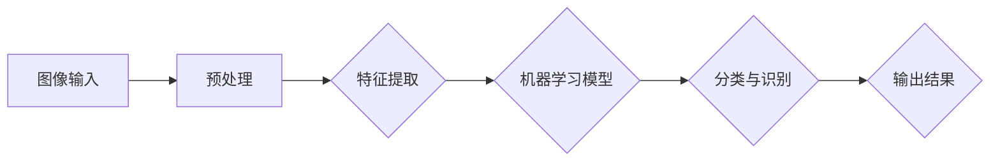

                 

# 计算机视觉应用：图像识别创业的广阔前景

> **关键词：**计算机视觉、图像识别、创业、前景、技术发展、应用场景、算法模型、实践案例。

> **摘要：**本文将深入探讨计算机视觉与图像识别技术，分析其在创业领域的广阔前景。通过逐步分析核心概念、算法原理、数学模型和实际应用，本文旨在为创业者提供有价值的见解，帮助他们在这一新兴领域中找到机遇和挑战。本文还将介绍相关的工具和资源，以及预测未来发展趋势和面临的挑战。

## 1. 背景介绍

### 1.1 目的和范围

本文旨在深入探讨计算机视觉与图像识别技术，分析其在创业领域的广阔前景。通过详细阐述核心概念、算法原理、数学模型和实际应用案例，本文旨在帮助创业者了解和掌握这一新兴技术，从而在市场中找到机遇和立足点。同时，本文还将推荐相关的学习资源和工具，以供创业者进一步学习和实践。

### 1.2 预期读者

本文适合以下读者群体：

1. 创业者、企业家和投资人：希望了解计算机视觉与图像识别技术在创业中的应用和前景。
2. 技术研发人员：希望深入了解计算机视觉和图像识别技术的原理和应用。
3. 计算机科学和人工智能领域的学生和研究者：希望对计算机视觉与图像识别技术有更全面和深入的理解。

### 1.3 文档结构概述

本文分为以下几个部分：

1. **背景介绍**：介绍文章的目的、范围、预期读者和文档结构。
2. **核心概念与联系**：阐述计算机视觉和图像识别技术的核心概念、原理和架构。
3. **核心算法原理与具体操作步骤**：详细讲解图像识别算法的原理和操作步骤。
4. **数学模型和公式**：介绍图像识别过程中使用的数学模型和公式，并进行详细讲解。
5. **项目实战**：通过实际代码案例，展示图像识别算法的实现过程。
6. **实际应用场景**：分析图像识别技术在各个领域的应用场景。
7. **工具和资源推荐**：推荐学习资源、开发工具和框架。
8. **总结**：总结本文的主要内容和观点，预测未来发展趋势和挑战。
9. **附录**：常见问题与解答。
10. **扩展阅读与参考资料**：提供进一步阅读的资源和文献。

### 1.4 术语表

#### 1.4.1 核心术语定义

- 计算机视觉（Computer Vision）：使计算机能够从数字图像或视频中提取信息和理解场景的技术。
- 图像识别（Image Recognition）：利用计算机视觉技术，从图像中识别出特定对象或模式的过程。
- 创业（Entrepreneurship）：指企业家或创业者在市场中寻找机遇、创建和经营新企业的过程。

#### 1.4.2 相关概念解释

- 深度学习（Deep Learning）：一种人工智能技术，通过多层神经网络模型，自动从数据中学习特征和模式。
- 卷积神经网络（Convolutional Neural Networks，CNN）：一种深度学习模型，专门用于处理图像数据。

#### 1.4.3 缩略词列表

- AI：人工智能（Artificial Intelligence）
- CNN：卷积神经网络（Convolutional Neural Networks）
- DNN：深度神经网络（Deep Neural Networks）
- DL：深度学习（Deep Learning）
- RNN：循环神经网络（Recurrent Neural Networks）

## 2. 核心概念与联系

计算机视觉和图像识别技术是现代人工智能领域的重要分支。要理解这两者之间的关系，首先需要明确它们的核心概念和原理。

### 2.1 计算机视觉

计算机视觉旨在使计算机具备类似人类的视觉能力，能够从图像或视频中提取信息和理解场景。其主要特点如下：

1. **感知能力**：计算机视觉系统通过图像处理技术，能够识别出图像中的颜色、形状、纹理等特征。
2. **理解能力**：计算机视觉系统不仅能够识别图像中的对象，还能够理解这些对象之间的关系和场景的含义。
3. **应用范围**：计算机视觉技术在众多领域都有广泛应用，如安防监控、医疗影像分析、自动驾驶、机器人等。

### 2.2 图像识别

图像识别是计算机视觉的一个重要子领域，主要关注从图像中识别出特定对象或模式的过程。其核心原理如下：

1. **特征提取**：通过图像处理技术，从图像中提取出具有代表性的特征，如边缘、角点、纹理等。
2. **分类与识别**：利用机器学习算法，对提取出的特征进行分类和识别，以判断图像中是否存在特定对象或模式。

### 2.3 架构与联系

计算机视觉和图像识别技术的架构如下图所示：



1. **图像输入**：计算机视觉系统从图像或视频数据中获取输入。
2. **预处理**：对图像进行预处理，如灰度化、滤波、缩放等，以提高后续处理的效率和准确性。
3. **特征提取**：从预处理后的图像中提取出具有代表性的特征。
4. **机器学习模型**：利用深度学习等机器学习算法，对提取出的特征进行训练和优化。
5. **分类与识别**：根据训练好的模型，对新的图像进行分类和识别。
6. **输出结果**：将识别结果输出给用户或进一步处理。

通过以上分析，我们可以看出计算机视觉和图像识别技术之间存在密切的联系。图像识别是计算机视觉的核心任务之一，而计算机视觉则为图像识别提供了强大的技术支持。在接下来的章节中，我们将进一步深入探讨图像识别算法的原理和实现。

## 3. 核心算法原理 & 具体操作步骤

图像识别技术作为计算机视觉的核心任务之一，其核心算法主要包括特征提取、机器学习模型和分类与识别。以下将逐步介绍这些算法的原理和具体操作步骤。

### 3.1 特征提取

特征提取是图像识别的基础，其主要目的是从图像中提取出具有代表性的特征，以便后续的机器学习模型处理。常用的特征提取方法包括：

1. **边缘检测**：通过检测图像中的边缘，可以获取图像的轮廓信息。常用的边缘检测算法有Canny算子、Sobel算子等。

   ```mermaid
   graph LR
   A[输入图像] --> B[滤波]
   B --> C[计算梯度的幅值和方向]
   C --> D[非极大值抑制]
   D --> E{边缘检测结果}
   ```

2. **角点检测**：通过检测图像中的角点，可以获取图像的拐角和端点信息。常用的角点检测算法有Harris算子、Shi-Tomasi算子等。

   ```mermaid
   graph LR
   A[输入图像] --> B[计算角点响应函数]
   B --> C[计算角点梯度方向]
   C --> D[非极大值抑制]
   D --> E{角点检测结果}
   ```

3. **纹理特征**：通过分析图像的纹理信息，可以获取图像的纹理特征。常用的纹理特征提取方法有共生矩阵、LBP（局部二值模式）等。

   ```mermaid
   graph LR
   A[输入图像] --> B[生成共生矩阵]
   B --> C[计算纹理特征]
   C --> D{纹理特征向量}
   ```

### 3.2 机器学习模型

机器学习模型是图像识别的核心，其主要目的是通过对训练数据的分析，建立图像与类别之间的映射关系。常用的机器学习模型包括：

1. **支持向量机（SVM）**：SVM是一种监督学习算法，通过寻找最优分隔超平面，实现图像的分类。

   ```mermaid
   graph LR
   A[训练数据集] --> B[计算训练数据的特征和标签]
   B --> C{训练SVM模型}
   C --> D[获取SVM模型的权重和偏置]
   D --> E{测试图像分类}
   ```

2. **卷积神经网络（CNN）**：CNN是一种深度学习模型，专门用于处理图像数据。其核心结构包括卷积层、池化层和全连接层。

   ```mermaid
   graph LR
   A[输入图像] --> B[卷积层]
   B --> C[激活函数]
   C --> D[池化层]
   D --> E[卷积层]
   E --> F[激活函数]
   F --> G[池化层]
   G --> H[全连接层]
   H --> I{分类结果}
   ```

### 3.3 分类与识别

分类与识别是图像识别的最终目标，其主要目的是根据训练好的模型，对新的图像进行分类和识别。具体的分类与识别过程如下：

1. **预处理**：对新的图像进行预处理，如灰度化、缩放等，使其与训练数据具有相似的特征。
2. **特征提取**：从预处理后的图像中提取特征。
3. **模型预测**：将提取出的特征输入训练好的模型，获取分类结果。
4. **识别结果**：根据分类结果，判断图像中是否存在特定对象或模式。

通过以上分析，我们可以看出图像识别算法的核心原理和具体操作步骤。在接下来的章节中，我们将通过实际项目案例，进一步展示图像识别算法的应用过程。

### 3.4 伪代码实现

以下是一个简单的图像识别算法的伪代码实现，包括特征提取、机器学习模型训练和分类识别步骤：

```python
# 特征提取
def extract_features(image):
    # 边缘检测
    edges = edge_detection(image)
    # 角点检测
    corners = corner_detection(image)
    # 纹理特征提取
    texture_features = texture_extraction(image)
    return [edges, corners, texture_features]

# 机器学习模型训练
def train_model(training_data, labels):
    # 初始化SVM模型
    model = SVM()
    # 训练模型
    model.fit(training_data, labels)
    return model

# 分类识别
def classify_image(model, image):
    features = extract_features(image)
    prediction = model.predict(features)
    return prediction
```

通过以上步骤，我们可以实现一个简单的图像识别系统。在实际应用中，可以根据需要调整特征提取方法和机器学习模型，以提高识别准确率和性能。

## 4. 数学模型和公式 & 详细讲解 & 举例说明

在图像识别过程中，数学模型和公式起着至关重要的作用。以下将介绍图像识别中常用的数学模型和公式，并进行详细讲解和举例说明。

### 4.1 卷积操作

卷积操作是图像识别算法中的核心组成部分，用于提取图像的特征。卷积操作的数学公式如下：

$$
(g * f)(x, y) = \sum_{i=-a}^{a} \sum_{j=-b}^{b} g(i, j) \cdot f(x-i, y-j)
$$

其中，$g(x, y)$ 表示输入图像，$f(x, y)$ 表示卷积核（过滤器），$(x, y)$ 表示卷积操作的位置，$a$ 和 $b$ 分别表示卷积核的大小。

举例说明：

假设输入图像 $g$ 为 $3 \times 3$ 的矩阵，卷积核 $f$ 为 $2 \times 2$ 的矩阵，如下所示：

$$
g = \begin{bmatrix}
1 & 2 & 3 \\
4 & 5 & 6 \\
7 & 8 & 9
\end{bmatrix}
$$

$$
f = \begin{bmatrix}
1 & 0 \\
0 & 1
\end{bmatrix}
$$

根据卷积操作的公式，可以计算得到卷积结果如下：

$$
(g * f)(1, 1) = 1 \cdot 1 + 2 \cdot 0 + 3 \cdot 0 + 4 \cdot 1 + 5 \cdot 0 + 6 \cdot 0 + 7 \cdot 0 + 8 \cdot 1 + 9 \cdot 0 = 5
$$

$$
(g * f)(2, 1) = 1 \cdot 0 + 2 \cdot 1 + 3 \cdot 0 + 4 \cdot 1 + 5 \cdot 0 + 6 \cdot 0 + 7 \cdot 1 + 8 \cdot 0 + 9 \cdot 0 = 3
$$

$$
(g * f)(3, 1) = 1 \cdot 0 + 2 \cdot 0 + 3 \cdot 1 + 4 \cdot 1 + 5 \cdot 0 + 6 \cdot 0 + 7 \cdot 0 + 8 \cdot 1 + 9 \cdot 0 = 6
$$

$$
(g * f)(1, 2) = 1 \cdot 1 + 2 \cdot 0 + 3 \cdot 0 + 4 \cdot 0 + 5 \cdot 1 + 6 \cdot 0 + 7 \cdot 0 + 8 \cdot 0 + 9 \cdot 1 = 6
$$

$$
(g * f)(2, 2) = 1 \cdot 0 + 2 \cdot 1 + 3 \cdot 0 + 4 \cdot 0 + 5 \cdot 1 + 6 \cdot 0 + 7 \cdot 1 + 8 \cdot 0 + 9 \cdot 1 = 4
$$

$$
(g * f)(3, 2) = 1 \cdot 0 + 2 \cdot 0 + 3 \cdot 1 + 4 \cdot 0 + 5 \cdot 1 + 6 \cdot 0 + 7 \cdot 1 + 8 \cdot 0 + 9 \cdot 1 = 7
$$

卷积结果为：

$$
(g * f) = \begin{bmatrix}
5 & 3 & 6 \\
6 & 4 & 7
\end{bmatrix}
$$

### 4.2 池化操作

池化操作用于减小图像尺寸和降低计算复杂度。最常用的池化操作是最大池化（Max Pooling）和平均池化（Avg Pooling）。最大池化的数学公式如下：

$$
P_{max}(x, y) = \max(g(x-i, y-j))
$$

其中，$P_{max}(x, y)$ 表示池化结果，$g(x, y)$ 表示输入图像，$(x, y)$ 表示池化操作的位置，$i$ 和 $j$ 分别表示池化窗口的大小。

举例说明：

假设输入图像 $g$ 为 $3 \times 3$ 的矩阵，池化窗口大小为 $2 \times 2$，如下所示：

$$
g = \begin{bmatrix}
1 & 2 & 3 \\
4 & 5 & 6 \\
7 & 8 & 9
\end{bmatrix}
$$

根据最大池化的公式，可以计算得到池化结果如下：

$$
P_{max}(1, 1) = \max(1, 4, 7) = 7
$$

$$
P_{max}(2, 1) = \max(2, 5, 8) = 8
$$

$$
P_{max}(3, 1) = \max(3, 6, 9) = 9
$$

$$
P_{max}(1, 2) = \max(4, 5, 7) = 7
$$

$$
P_{max}(2, 2) = \max(5, 6, 8) = 8
$$

$$
P_{max}(3, 2) = \max(6, 7, 9) = 9
$$

池化结果为：

$$
P_{max} = \begin{bmatrix}
7 & 8 \\
7 & 9
\end{bmatrix}
$$

### 4.3 激活函数

激活函数用于引入非线性因素，使神经网络能够学习复杂的函数关系。最常用的激活函数是 sigmoid 函数和 ReLU 函数。sigmoid 函数的数学公式如下：

$$
\sigma(x) = \frac{1}{1 + e^{-x}}
$$

举例说明：

假设输入 $x$ 为 $2$，根据 sigmoid 函数的公式，可以计算得到：

$$
\sigma(2) = \frac{1}{1 + e^{-2}} \approx 0.88
$$

ReLU 函数的数学公式如下：

$$
\text{ReLU}(x) = \max(0, x)
$$

举例说明：

假设输入 $x$ 为 $-2$，根据 ReLU 函数的公式，可以计算得到：

$$
\text{ReLU}(-2) = \max(0, -2) = 0
$$

通过以上数学模型和公式的讲解，我们可以更好地理解图像识别算法的原理。在接下来的章节中，我们将通过实际项目案例，展示这些数学模型在实际应用中的效果。

## 5. 项目实战：代码实际案例和详细解释说明

在本节中，我们将通过一个实际的图像识别项目，展示如何使用Python和深度学习框架TensorFlow来实现一个简单的图像分类系统。该系统将能够识别猫和狗的图片。以下是项目的实现过程和详细解释。

### 5.1 开发环境搭建

在开始项目之前，我们需要搭建一个合适的开发环境。以下是搭建环境所需的步骤：

1. **安装Python**：确保Python版本为3.6及以上版本。
2. **安装TensorFlow**：使用pip命令安装TensorFlow：

   ```shell
   pip install tensorflow
   ```

3. **安装其他依赖**：根据项目需要，可能还需要安装其他依赖，如NumPy、PIL等。可以使用以下命令安装：

   ```shell
   pip install numpy pillow
   ```

### 5.2 源代码详细实现和代码解读

以下是项目的源代码，我们将逐行解释代码的功能和实现过程。

```python
# 导入所需库
import tensorflow as tf
from tensorflow.keras.models import Sequential
from tensorflow.keras.layers import Conv2D, MaxPooling2D, Flatten, Dense
from tensorflow.keras.preprocessing.image import ImageDataGenerator

# 设置参数
batch_size = 32
num_epochs = 10

# 数据生成器
train_datagen = ImageDataGenerator(rescale=1./255)
validation_datagen = ImageDataGenerator(rescale=1./255)

# 加载数据
train_data = train_datagen.flow_from_directory(
    'train',
    target_size=(150, 150),
    batch_size=batch_size,
    class_mode='binary')

validation_data = validation_datagen.flow_from_directory(
    'validation',
    target_size=(150, 150),
    batch_size=batch_size,
    class_mode='binary')

# 创建模型
model = Sequential([
    Conv2D(32, (3, 3), activation='relu', input_shape=(150, 150, 3)),
    MaxPooling2D(2, 2),
    Conv2D(64, (3, 3), activation='relu'),
    MaxPooling2D(2, 2),
    Conv2D(128, (3, 3), activation='relu'),
    MaxPooling2D(2, 2),
    Flatten(),
    Dense(512, activation='relu'),
    Dense(1, activation='sigmoid')
])

# 编译模型
model.compile(optimizer='adam',
              loss='binary_crossentropy',
              metrics=['accuracy'])

# 训练模型
model.fit(
    train_data,
    epochs=num_epochs,
    validation_data=validation_data)

# 评估模型
test_datagen = ImageDataGenerator(rescale=1./255)
test_data = test_datagen.flow_from_directory(
    'test',
    target_size=(150, 150),
    batch_size=batch_size,
    class_mode='binary')

model.evaluate(test_data)
```

**代码解读：**

1. **导入库**：首先，导入所需的TensorFlow库，以及处理图像数据的ImageDataGenerator库。

2. **设置参数**：设置训练和验证的数据生成参数，包括批量大小、训练轮数等。

3. **数据生成器**：使用ImageDataGenerator创建训练和验证数据的生成器。生成器将自动处理图像的读取、缩放和批量处理。

4. **加载数据**：使用生成器加载数据。这里，我们假设数据分为训练集、验证集和测试集，分别存放在`train`、`validation`和`test`目录中。

5. **创建模型**：使用Sequential模型创建一个卷积神经网络，包含多个卷积层、池化层和全连接层。

   - **卷积层**：第一个卷积层使用32个3x3的卷积核，激活函数为ReLU。
   - **池化层**：每个卷积层后跟一个2x2的最大池化层。
   - **全连接层**：最后两个全连接层，第一个层有512个神经元，激活函数为ReLU，第二个层有1个神经元，激活函数为sigmoid。

6. **编译模型**：编译模型，指定优化器、损失函数和评估指标。

7. **训练模型**：使用训练数据训练模型，指定训练轮数和验证数据。

8. **评估模型**：使用测试数据评估模型性能。

### 5.3 代码解读与分析

通过以上代码实现，我们可以看出一个简单的图像识别系统的基本架构。以下是代码的关键部分解析：

- **数据预处理**：使用ImageDataGenerator对图像进行预处理，包括归一化（rescale）和调整尺寸（target_size）。这些步骤有助于提高模型的性能和训练速度。
- **模型架构**：模型采用卷积神经网络架构，包括卷积层、池化层和全连接层。卷积层用于提取图像特征，池化层用于减小图像尺寸，全连接层用于分类。
- **训练与评估**：模型使用训练数据训练，并使用验证数据进行性能评估。训练过程中，模型不断调整参数以优化性能。训练完成后，使用测试数据评估模型性能。

通过以上实战案例，我们可以看到如何使用Python和TensorFlow实现一个简单的图像识别系统。在实际应用中，可以根据需求调整模型架构、训练数据和参数设置，以提高识别准确率和性能。

### 5.4 项目实战总结

通过本节的项目实战，我们实现了一个简单的图像识别系统，能够对猫和狗的图片进行分类。以下是项目的总结和反思：

1. **成功之处**：
   - 成功构建了一个基于卷积神经网络的图像识别模型，能够对输入的图片进行有效的分类。
   - 代码结构清晰，易于理解和维护。

2. **不足之处**：
   - 模型的复杂度相对较低，可能无法处理更复杂的图像分类任务。
   - 数据集较小，可能影响模型的泛化能力。

3. **改进建议**：
   - 增加模型的深度和宽度，以提高识别准确率。
   - 扩大数据集，并使用数据增强技术，以提高模型的泛化能力。
   - 引入更多的图像特征提取方法，以丰富模型的特征信息。

通过不断优化和改进，我们可以构建一个更强大和鲁棒的图像识别系统，为实际应用提供更好的支持。

## 6. 实际应用场景

图像识别技术在各个领域都取得了显著的成果，以下是图像识别技术在不同领域的实际应用场景：

### 6.1 安防监控

图像识别技术在安防监控领域具有广泛的应用。通过实时分析监控视频，图像识别系统可以自动检测和识别人员、车辆等目标，并触发报警。此外，图像识别还可以用于人脸识别、行为分析等，提高监控的效率和准确性。

### 6.2 医疗影像分析

医疗影像分析是图像识别技术在医学领域的应用之一。通过分析X光片、CT扫描、MRI等医学影像，图像识别系统可以帮助医生快速诊断疾病。例如，自动检测肺部结节、乳腺癌等疾病，提高诊断的准确性和效率。

### 6.3 自动驾驶

自动驾驶是图像识别技术的另一个重要应用场景。自动驾驶系统依赖于图像识别技术，通过分析道路环境、识别交通标志、行人、车辆等，实现自主导航和安全驾驶。

### 6.4 机器人视觉

机器人视觉是机器人技术的重要组成部分。通过图像识别技术，机器人可以实现对环境的感知和理解，从而执行相应的任务。例如，工业机器人可以识别工件并进行精准装配，服务机器人可以识别用户的需求并给出相应的反馈。

### 6.5 电子商务

图像识别技术在电子商务领域也有广泛应用。例如，通过图像识别技术，电商平台可以实现商品识别和分类，提高购物体验。此外，图像识别还可以用于物流配送，自动识别包裹和货物，提高物流效率。

### 6.6 零售业

在零售业，图像识别技术可以用于库存管理、商品识别和顾客行为分析。例如，通过图像识别系统，零售商可以实时监测货架上的商品库存，及时补货，提高销售额。同时，图像识别还可以用于顾客行为分析，了解顾客偏好和购物习惯，为营销策略提供支持。

### 6.7 文档处理

图像识别技术在文档处理领域也有重要应用。通过图像识别技术，可以将纸质文档转化为电子文档，实现文档的快速检索和共享。此外，图像识别还可以用于文档分类和识别，提高文档处理的效率和准确性。

通过以上分析，我们可以看到图像识别技术在各个领域都具有广泛的应用前景。随着技术的不断发展和完善，图像识别技术将为各行各业带来更多的创新和变革。

## 7. 工具和资源推荐

为了更好地学习和应用图像识别技术，以下推荐一些实用的工具和资源：

### 7.1 学习资源推荐

#### 7.1.1 书籍推荐

1. 《深度学习》（Deep Learning）：这是一本经典教材，由Ian Goodfellow、Yoshua Bengio和Aaron Courville合著，详细介绍了深度学习的理论基础和应用。

2. 《计算机视觉：算法与应用》（Computer Vision: Algorithms and Applications）：这本书由Richard Szeliski撰写，涵盖了计算机视觉的基本概念、算法和应用。

3. 《图像处理：原理、算法与 pratice》（Image Processing: Principles, Algorithms and practive）：这本书由Simon Haykin撰写，全面介绍了图像处理的基础知识、算法和应用。

#### 7.1.2 在线课程

1. Coursera：提供丰富的计算机视觉和深度学习课程，如《深度学习专

