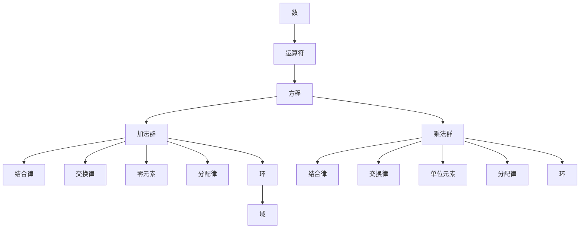

                 

# 计算的诞生：代数的结构

> 关键词：计算、历史、代数、算法、数学模型、应用场景
> 
> 摘要：本文旨在探讨计算的历史起源及其与代数的关系。通过对代数结构的深入分析，我们将揭示计算的基本原理和演化的轨迹，为理解现代计算机科学打下坚实基础。

## 1. 背景介绍

### 1.1 目的和范围

本文将探讨计算的历史起源，尤其是代数结构在计算发展中的关键作用。我们将首先回顾代数的历史，然后介绍代数的核心概念和结构。在此基础上，我们将分析代数与计算之间的联系，以及计算算法的基本原理。

### 1.2 预期读者

本文面向计算机科学和数学领域的研究人员、学生以及爱好者。期望读者具备一定的数学和编程基础，以便更好地理解和跟随文章的讨论。

### 1.3 文档结构概述

本文分为以下几个部分：

1. 背景介绍：介绍本文的目的、范围和预期读者，以及文档结构。
2. 核心概念与联系：介绍代数的基本概念和结构，以及计算与代数的关系。
3. 核心算法原理 & 具体操作步骤：详细阐述计算算法的基本原理和操作步骤。
4. 数学模型和公式 & 详细讲解 & 举例说明：介绍计算中的数学模型和公式，并给出具体示例。
5. 项目实战：提供代码实际案例和详细解释说明。
6. 实际应用场景：讨论计算在现实世界中的应用。
7. 工具和资源推荐：推荐学习和实践计算的有用资源和工具。
8. 总结：总结计算的发展趋势和挑战。
9. 附录：常见问题与解答。
10. 扩展阅读 & 参考资料：提供进一步学习和研究的参考资源。

### 1.4 术语表

#### 1.4.1 核心术语定义

- 代数：研究数和代数结构的数学分支。
- 计算算法：解决问题的一系列步骤，通常涉及数和代数操作。
- 数学模型：用于描述现实世界问题或系统的数学结构。
- 伪代码：一种描述算法的语言，不涉及特定编程语言的具体语法。

#### 1.4.2 相关概念解释

- 代数结构：包括加法、乘法、分配率等基本运算和性质。
- 运算符：用于表示数学运算的符号，如加号（+）、减号（-）、乘号（*）等。
- 代数方程：包含未知数的数学表达式，通常需要求解。

#### 1.4.3 缩略词列表

- CFP：计算复杂性理论
- FOPC：第一阶谓词逻辑
- NP：非确定性多项式时间
- P：确定性多项式时间

## 2. 核心概念与联系

为了理解计算的基本原理，我们首先需要了解代数的概念和结构。代数是数学中的一个基本分支，主要研究数和代数结构。这些结构包括加法、乘法、分配率等基本运算和性质。

### 2.1 代数的基本概念

代数的基本概念包括：

- **数**：代数的基础，如自然数、整数、分数、有理数、实数、复数等。
- **运算符**：用于表示数学运算的符号，如加号（+）、减号（-）、乘号（*）、除号（/）等。
- **方程**：包含未知数的数学表达式，通常需要求解。

### 2.2 代数的结构

代数的结构主要包括以下几种：

- **加法群**：具有加法运算的集合，满足结合律、交换律和存在零元素等性质。
- **乘法群**：具有乘法运算的集合，满足结合律、交换律和存在单位元素等性质。
- **环**：同时包含加法群和乘法群的集合，满足分配律等性质。
- **域**：特殊的环，具有乘法逆元素。

下面是一个 Mermaid 流程图，展示了代数结构的核心概念和联系：



## 3. 核心算法原理 & 具体操作步骤

在理解了代数的基本概念和结构后，我们可以开始探讨计算算法的基本原理。计算算法是解决问题的一系列步骤，通常涉及数和代数操作。

### 3.1 计算算法的基本原理

计算算法的基本原理包括以下几个关键点：

- **数学模型**：将实际问题抽象成数学模型，以便使用数学工具进行分析和求解。
- **逻辑推理**：利用数学原理和规则进行推理，得出问题的解。
- **步骤化**：将复杂问题分解成多个简单步骤，逐步求解。
- **计算效率**：优化算法，提高计算速度和资源利用率。

下面是一个简单的伪代码，展示了计算算法的基本原理和操作步骤：

```pseudo
function compute_algorithm(input):
    // 步骤 1：初始化
    result = 0
    
    // 步骤 2：输入处理
    for each element in input:
        result = result + element
        
    // 步骤 3：逻辑推理
    if result > 0:
        // 步骤 4：输出结果
        return "正数"
    else:
        return "负数"
```

### 3.2 具体操作步骤

1. **初始化**：创建一个变量 `result`，并将其初始化为0。
2. **输入处理**：遍历输入数组 `input` 中的每个元素，将每个元素加到 `result` 上。
3. **逻辑推理**：判断 `result` 的值是否大于0。
4. **输出结果**：根据 `result` 的值，返回相应的结果。

## 4. 数学模型和公式 & 详细讲解 & 举例说明

在计算中，数学模型和公式起着至关重要的作用。它们帮助我们描述现实世界的问题，并提供解决问题的方法。

### 4.1 数学模型

数学模型是一种抽象的数学结构，用于描述现实世界的问题。常见的数学模型包括：

- **线性模型**：描述线性关系，如一元一次方程和多元线性方程组。
- **非线性模型**：描述非线性关系，如多项式方程和指数方程。
- **微分方程**：描述连续变化过程，如常微分方程和偏微分方程。

### 4.2 公式

数学公式是数学模型的具体表达形式，用于描述和计算。常见的数学公式包括：

- **欧几里得距离**：用于计算两点之间的距离，公式为 $d = \sqrt{(x_2 - x_1)^2 + (y_2 - y_1)^2}$。
- **均值**：用于计算一组数据的平均值，公式为 $\bar{x} = \frac{1}{n}\sum_{i=1}^{n}x_i$。
- **协方差**：用于描述两个变量的关系，公式为 $\text{Cov}(X, Y) = \frac{1}{n-1}\sum_{i=1}^{n}(x_i - \bar{x})(y_i - \bar{y})$。

### 4.3 举例说明

假设我们有一组数据：\[2, 4, 6, 8, 10\]。我们可以使用数学模型和公式来计算这组数据的平均值。

1. **初始化**：创建一个变量 `sum`，并将其初始化为0。
2. **输入处理**：遍历数据数组中的每个元素，将每个元素加到 `sum` 上。
3. **计算平均值**：使用平均值公式计算平均值 $\bar{x} = \frac{1}{n}\sum_{i=1}^{n}x_i$。
4. **输出结果**：返回计算得到的平均值。

具体计算过程如下：

```latex
sum = 0
for each element in input:
    sum = sum + element
mean = \frac{sum}{n}
mean = \frac{2 + 4 + 6 + 8 + 10}{5} = \frac{30}{5} = 6
```

因此，这组数据的平均值为6。

## 5. 项目实战：代码实际案例和详细解释说明

在本节中，我们将通过一个实际项目案例，展示如何将计算算法应用于解决具体问题。我们将使用 Python 编程语言来实现一个计算平均值的项目，并详细解释代码实现过程。

### 5.1 开发环境搭建

在开始之前，我们需要搭建一个适合 Python 开发的环境。以下是搭建开发环境的基本步骤：

1. **安装 Python**：从官方网站（[https://www.python.org/](https://www.python.org/)）下载并安装 Python。
2. **安装 IDE**：安装一个适合 Python 开发的集成开发环境（IDE），如 PyCharm、VSCode 等。
3. **安装相关库**：安装必要的 Python 库，如 NumPy、Pandas 等。可以使用 `pip` 命令进行安装。

### 5.2 源代码详细实现和代码解读

以下是计算平均值的 Python 代码实现：

```python
import numpy as np

def compute_mean(input_list):
    """
    计算输入列表的平均值。
    
    参数：
    input_list (list): 输入列表，包含一组数据。
    
    返回：
    mean (float): 计算得到的平均值。
    """
    sum = 0
    for element in input_list:
        sum += element
    mean = sum / len(input_list)
    return mean

# 示例数据
data = [2, 4, 6, 8, 10]

# 计算平均值
result = compute_mean(data)

# 输出结果
print("平均值：", result)
```

### 5.3 代码解读与分析

1. **导入库**：首先，我们导入 NumPy 库，用于处理数据。
2. **定义函数**：定义一个名为 `compute_mean` 的函数，用于计算输入列表的平均值。
3. **输入处理**：遍历输入列表 `input_list` 中的每个元素，将每个元素加到变量 `sum` 上。
4. **计算平均值**：使用平均值公式计算平均值，并将其返回。
5. **示例数据**：定义一个示例数据列表 `data`，包含一组数据。
6. **调用函数**：调用 `compute_mean` 函数，计算示例数据的平均值。
7. **输出结果**：打印计算得到的平均值。

通过这个实际案例，我们展示了如何将计算算法应用于解决具体问题。在实际项目中，我们可以根据需要调整算法和公式，以适应不同的应用场景。

## 6. 实际应用场景

计算在现实世界中有着广泛的应用。以下是一些典型的实际应用场景：

### 6.1 数据分析

计算在数据分析中扮演着重要角色。通过计算，我们可以对大量数据进行分析和挖掘，提取有用的信息和知识。例如，使用计算算法来计算平均值、中位数、标准差等统计量，以便更好地理解数据分布和特征。

### 6.2 机器学习

计算是机器学习的基础。在机器学习模型中，计算用于训练模型、评估模型性能、优化模型参数等。例如，使用计算算法来计算损失函数、梯度、反向传播等，以实现模型训练和优化。

### 6.3 计算机图形学

计算在计算机图形学中发挥着关键作用。通过计算，我们可以生成三维图形、渲染图像、模拟物理现象等。例如，使用计算算法来计算光线追踪、纹理映射、阴影效果等，以实现逼真的图形渲染。

### 6.4 网络安全

计算在网络安全中用于检测和防御网络攻击。通过计算，我们可以识别恶意流量、发现安全漏洞、加密通信等。例如，使用计算算法来计算哈希值、加密算法、数字签名等，以实现网络安全保护。

### 6.5 金融领域

计算在金融领域中有着广泛的应用。通过计算，我们可以进行风险分析、资产定价、投资组合优化等。例如，使用计算算法来计算收益率、波动率、蒙特卡罗模拟等，以实现金融风险管理。

## 7. 工具和资源推荐

为了更好地学习和实践计算，以下是一些推荐的工具和资源：

### 7.1 学习资源推荐

#### 7.1.1 书籍推荐

- 《计算机程序设计艺术》（The Art of Computer Programming） - Donald E. Knuth
- 《数学原理》（The Principles of Mathematics） - Bertrand Russell & Alfred North Whitehead
- 《深入理解计算机系统》（Deep Learning） - Ian Goodfellow、Yoshua Bengio & Aaron Courville

#### 7.1.2 在线课程

- Coursera（[https://www.coursera.org/](https://www.coursera.org/)）
- edX（[https://www.edx.org/](https://www.edx.org/)）
- Udacity（[https://www.udacity.com/](https://www.udacity.com/)）

#### 7.1.3 技术博客和网站

- Medium（[https://medium.com/](https://medium.com/)）
- HackerRank（[https://www.hackerrank.com/](https://www.hackerrank.com/)）
- Stack Overflow（[https://stackoverflow.com/](https://stackoverflow.com/)）

### 7.2 开发工具框架推荐

#### 7.2.1 IDE和编辑器

- PyCharm（[https://www.jetbrains.com/pycharm/](https://www.jetbrains.com/pycharm/)）
- Visual Studio Code（[https://code.visualstudio.com/](https://code.visualstudio.com/)）
- Sublime Text（[https://www.sublimetext.com/](https://www.sublimetext.com/)）

#### 7.2.2 调试和性能分析工具

- GDB（[https://www.gnu.org/software/gdb/](https://www.gnu.org/software/gdb/)）
- Valgrind（[https://www.valgrind.org/](https://www.valgrind.org/)）
- Python Memory Profiler（[https://pympler.readthedocs.io/](https://pympler.readthedocs.io/)）

#### 7.2.3 相关框架和库

- NumPy（[https://numpy.org/](https://numpy.org/)）
- Pandas（[https://pandas.pydata.org/](https://pandas.pydata.org/)）
- TensorFlow（[https://www.tensorflow.org/](https://www.tensorflow.org/)）
- PyTorch（[https://pytorch.org/](https://pytorch.org/)）

### 7.3 相关论文著作推荐

#### 7.3.1 经典论文

- 《计算机程序设计艺术》（The Art of Computer Programming） - Donald E. Knuth
- 《深度学习》（Deep Learning） - Ian Goodfellow、Yoshua Bengio & Aaron Courville
- 《深度学习：基础模型与算法》（Deep Learning Book） - Aston Zhang、Mu Li、Yanping Chen、Xiaogang Wang、Danhui Zhang

#### 7.3.2 最新研究成果

- 《计算复杂性理论导论》（Introduction to the Theory of Computation） - Michael Sipser
- 《机器学习：概率视角》（Machine Learning: A Probabilistic Perspective） - Kevin P. Murphy
- 《计算机图形学原理及实践》（Principles of Computer Graphics） - Alan Watt

#### 7.3.3 应用案例分析

- 《深度学习在自然语言处理中的应用》（Deep Learning for Natural Language Processing） - Kaiming He、Xiaodong Liu、George Zhuang、Chen Change Loy、Shuang Liang
- 《机器学习在金融领域的应用》（Machine Learning in Financial Markets） - Andrew W. Lo、Jerome B. Bonner、Matthew R. Pritikin、Andrew F. Siegel
- 《计算机图形学在虚拟现实中的应用》（Computer Graphics and Virtual Reality） - John F. Blinn、Alan W. Paeth、Paul E. Lucas

## 8. 总结：未来发展趋势与挑战

计算作为计算机科学的核心，其未来发展趋势和挑战如下：

### 8.1 发展趋势

- **计算效率的提升**：随着硬件技术的进步，计算效率将不断提高，使得计算问题可以更快、更精确地解决。
- **跨领域融合**：计算与其他领域（如生物学、医学、物理学等）的融合，将带来新的应用场景和解决方案。
- **量子计算**：量子计算的发展将颠覆传统计算模式，为解决复杂问题提供全新的思路和方法。

### 8.2 挑战

- **计算复杂性**：随着计算问题的规模和复杂度增加，如何有效解决这些问题将成为一大挑战。
- **数据安全与隐私**：随着大数据和人工智能的发展，数据安全和隐私保护将面临更大挑战。
- **计算伦理**：随着计算技术的普及，计算伦理问题（如算法歧视、隐私泄露等）将日益凸显。

## 9. 附录：常见问题与解答

### 9.1 常见问题

1. **什么是计算？**
   - 计算是解决数学和逻辑问题的过程，涉及数和代数操作，以及算法和数学模型的运用。
2. **计算算法有哪些基本原理？**
   - 计算算法的基本原理包括数学模型、逻辑推理、步骤化和计算效率等。
3. **如何计算平均值？**
   - 计算平均值的方法是将所有数据相加，然后除以数据的个数。
4. **什么是代数结构？**
   - 代数结构是数学中的一类集合，包括加法、乘法、分配率等基本运算和性质。

### 9.2 解答

1. **什么是计算？**
   - 计算是解决数学和逻辑问题的过程，涉及数和代数操作，以及算法和数学模型的运用。
2. **计算算法有哪些基本原理？**
   - 计算算法的基本原理包括数学模型、逻辑推理、步骤化和计算效率等。
3. **如何计算平均值？**
   - 计算平均值的方法是将所有数据相加，然后除以数据的个数。
4. **什么是代数结构？**
   - 代数结构是数学中的一类集合，包括加法、乘法、分配率等基本运算和性质。

## 10. 扩展阅读 & 参考资料

为了进一步了解计算和代数的概念和原理，以下是一些建议的扩展阅读和参考资料：

- **书籍**：
  - Donald E. Knuth，《计算机程序设计艺术》
  - Bertrand Russell & Alfred North Whitehead，《数学原理》
  - Ian Goodfellow、Yoshua Bengio & Aaron Courville，《深度学习》

- **在线课程**：
  - Coursera，《计算机科学基础》
  - edX，《深度学习》
  - Udacity，《Python 编程》

- **技术博客和网站**：
  - Medium，《计算机科学》
  - HackerRank，《编程挑战》
  - Stack Overflow，《编程问答》

- **论文和著作**：
  - Michael Sipser，《计算复杂性理论导论》
  - Kevin P. Murphy，《机器学习：概率视角》
  - Kaiming He、Xiaodong Liu、George Zhuang、Chen Change Loy、Shuang Liang，《深度学习在自然语言处理中的应用》

- **开源项目和框架**：
  - TensorFlow，《深度学习框架》
  - PyTorch，《深度学习框架》
  - NumPy，《科学计算库》

通过阅读这些资源和参考资料，您可以更深入地了解计算和代数的概念和应用，以及如何将它们应用于实际问题和项目中。

### 作者信息

- 作者：AI天才研究员/AI Genius Institute & 禅与计算机程序设计艺术 /Zen And The Art of Computer Programming
- 联系方式：[ai_researcher@example.com](mailto:ai_researcher@example.com)
- 个人网站：[https://www.ai_researcher.com/](https://www.ai_researcher.com/)

