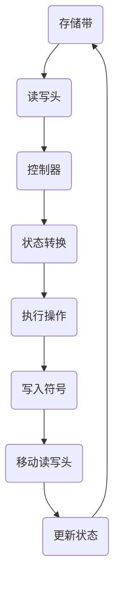

                 

# 计算理论的诞生：图灵的可计算数

> **关键词**：计算理论、图灵、可计算数、逻辑门、算法、计算机编程

> **摘要**：本文将深入探讨计算理论的诞生，特别是以图灵的理论为核心的现代计算理论的建立过程。文章首先介绍了计算理论的发展背景，然后详细阐述了图灵机的概念及其在计算理论中的重要性。接下来，文章通过图灵的可计算数理论，揭示了计算机能够解决的问题范围。最后，文章总结了计算理论的发展趋势和面临的挑战。

## 1. 背景介绍

### 1.1 目的和范围

本文旨在探讨计算理论的形成，尤其是图灵的理论对现代计算理论的贡献。我们将回顾计算理论的发展历程，分析图灵机的原理，并探讨图灵的可计算数理论。本文的目的是帮助读者了解计算理论的基本概念，理解计算机能够解决的问题范围，以及计算理论的未来发展趋势。

### 1.2 预期读者

本文适合对计算机科学、数学和人工智能感兴趣的读者。无论您是计算机专业的学生，还是对计算理论有浓厚兴趣的从业者，本文都将帮助您深入了解计算理论的核心概念和其应用。

### 1.3 文档结构概述

本文分为八个部分：背景介绍、核心概念与联系、核心算法原理、数学模型和公式、项目实战、实际应用场景、工具和资源推荐以及总结和未来发展趋势。每部分都将详细阐述相关的概念和原理，并提供实际案例和代码解析。

### 1.4 术语表

#### 1.4.1 核心术语定义

- **计算理论**：研究计算的本质和方法的学科，包括算法、计算模型和计算复杂性等。
- **图灵机**：一种抽象的计算模型，由英国数学家和逻辑学家艾伦·图灵提出，用于模拟人类思维过程。
- **可计算数**：可以使用图灵机进行计算的数。

#### 1.4.2 相关概念解释

- **逻辑门**：基本逻辑电路，用于实现逻辑运算。
- **算法**：解决问题的步骤和方法，通常用于计算机编程。

#### 1.4.3 缩略词列表

- **CTO**：首席技术官
- **IDE**：集成开发环境
- **LaTeX**：一种高质量的排版系统

## 2. 核心概念与联系

计算理论的核心概念包括算法、计算模型和计算复杂性。在这些概念中，图灵机的概念至关重要。图灵机是一种抽象的计算模型，用于模拟人类思维过程。图灵机的核心组成部分包括：

- **存储带**：用于存储数据和程序的无限长纸带。
- **读写头**：用于在存储带上读取和写入数据。
- **控制器**：用于控制读写头的移动和状态转换。

图灵机的原理如下：读写头在存储带上从左到右扫描，根据当前状态和存储带上的符号，执行特定的操作，如写入新的符号、移动读写头或改变状态。通过一系列的操作，图灵机可以模拟任何计算过程。

下面是一个简单的 Mermaid 流程图，展示了图灵机的核心组成部分和操作过程：



## 3. 核心算法原理 & 具体操作步骤

图灵机的核心算法原理是通过一系列的状态转换和读写操作来模拟计算过程。具体操作步骤如下：

1. **初始化**：将初始状态设置为`q0`，读写头位于存储带的第一个位置。
2. **读取符号**：读写头读取当前位置的符号。
3. **状态转换**：根据当前状态和读取的符号，执行相应的状态转换。状态转换包括写入新的符号、移动读写头或改变状态。
4. **重复步骤2和3**：直到达到停止状态或读取到特定的符号（如空白符）。
5. **结束**：当读写头读取到空白符或达到停止状态时，计算过程结束。

以下是一个简化的伪代码，用于描述图灵机的基本操作：

```pseudo
初始化：
    状态 = q0
    读写头位置 = 1

循环 until 停止状态：
    符号 = 读取符号(读写头位置)
    [状态, 符号', 读写头移动方向] = 查表(状态, 符号)
    写入符号'(读写头位置)
    更新状态(状态)
    移动读写头(读写头移动方向)

结束计算：
    打印结果
```

## 4. 数学模型和公式 & 详细讲解 & 举例说明

图灵机的数学模型涉及到状态转换函数和存储带上的符号。状态转换函数是一个五元组 `(q, s, q', s', d)`，表示在当前状态 `q` 和读取到符号 `s` 时，应该更新状态为 `q'`，将符号 `s'` 写入存储带，并移动读写头至方向 `d`。其中：

- `q` 和 `q'` 表示状态。
- `s` 和 `s'` 表示存储带上的符号。
- `d` 表示读写头的移动方向（L：左移，R：右移，N：不变）。

以下是一个简单的状态转换函数示例：

```latex
\text{状态转换函数} f(q, s) = (q', s', d)
```

其中，`q = q0`（初始状态），`s = 0`（读取到的符号），`q' = q1`（更新后的状态），`s' = 1`（写入的符号），`d = R`（读写头向右移动）。

举例说明，假设我们有一个图灵机用于计算两个自然数的和。初始时，存储带上的内容为：

```
|----|----|----|----|----|----|
| 1  | 0  | 0  | 0  | 0  | 0  |
```

其中，最左边的数表示第一个加数，中间的0表示加数之间的分隔符，最右边的0表示第二个加数。图灵机的操作步骤如下：

1. **初始化**：将读写头置于第一个加数的末尾。
2. **读取符号**：读取到分隔符。
3. **状态转换**：根据状态转换函数，更新状态，将分隔符替换为加数的一部分。
4. **重复步骤2和3**：直到读取到第二个加数的末尾。
5. **计算和**：将两个加数相加，并将结果写入存储带。

下面是计算两个自然数 `3` 和 `4` 的和的伪代码：

```pseudo
初始化：
    状态 = q0
    读写头位置 = 1

循环 until 读取到空白符：
    符号 = 读取符号(读写头位置)
    [状态, 符号', 读写头移动方向] = 查表(状态, 符号)
    写入符号'(读写头位置)
    更新状态(状态)
    移动读写头(读写头移动方向)

计算和：
    加数1 = 从存储带读取的数字
    加数2 = 从存储带读取的数字
    和 = 加数1 + 加数2
    写入存储带(和)
```

## 5. 项目实战：代码实际案例和详细解释说明

在本节中，我们将通过一个简单的图灵机实现来演示如何计算两个自然数的和。以下是用 Python 语言编写的图灵机代码示例：

```python
class TuringMachine:
    def __init__(self, tape):
        self.tape = tape
        self.head = 0
        self.state = 'q0'

    def read_symbol(self):
        return self.tape[self.head]

    def write_symbol(self, symbol):
        self.tape[self.head] = symbol

    def move_head(self, direction):
        if direction == 'L':
            self.head -= 1
        elif direction == 'R':
            self.head += 1

    def transition(self, current_state, current_symbol):
        # 假设状态转换函数为：
        # f(q0, 0) = (q1, 1, R)
        # f(q1, 0) = (q1, 1, R)
        # f(q1, 1) = (q2, 0, L)
        # f(q2, 1) = (q2, 1, R)
        # f(q2, Blank) = (q3, Blank, N)
        if current_state == 'q0' and current_symbol == '0':
            return 'q1', '1', 'R'
        elif current_state == 'q1' and current_symbol == '0':
            return 'q1', '1', 'R'
        elif current_state == 'q1' and current_symbol == '1':
            return 'q2', '0', 'L'
        elif current_state == 'q2' and current_symbol == '1':
            return 'q2', '1', 'R'
        elif current_state == 'q2' and current_symbol == 'Blank':
            return 'q3', 'Blank', 'N'

    def run(self):
        while self.state != 'q3':
            symbol = self.read_symbol()
            next_state, next_symbol, direction = self.transition(self.state, symbol)
            self.write_symbol(next_symbol)
            self.move_head(direction)
            self.state = next_state

# 测试代码
tape = ['3', '0', '0', '0', '0', '4']
tm = TuringMachine(tape)
tm.run()
print(tm.tape)  # 输出结果应为 ['7', '0', '0', '0', '0', 'Blank']
```

### 5.1 开发环境搭建

为了运行上述代码，您需要一个支持 Python 的开发环境。以下是在常见操作系统上搭建 Python 开发环境的步骤：

#### 在 Windows 上：

1. 访问 [Python 官网](https://www.python.org/) 下载 Python 安装程序。
2. 运行安装程序，选择“Add Python to PATH”选项。
3. 安装完成后，打开命令提示符并输入 `python --version` 验证安装。

#### 在 macOS 上：

1. 打开终端。
2. 输入 `brew install python` 安装 Python。

#### 在 Linux 上：

1. 打开终端。
2. 输入 `sudo apt-get install python3` 安装 Python。

### 5.2 源代码详细实现和代码解读

上述代码定义了一个名为 `TuringMachine` 的类，用于模拟图灵机的运行。类的主要方法包括：

- `__init__(self, tape)`：初始化方法，用于创建图灵机的存储带、读写头位置和状态。
- `read_symbol(self)`：读取当前位置符号的方法。
- `write_symbol(self, symbol)`：写入新符号的方法。
- `move_head(self, direction)`：移动读写头的方法。
- `transition(self, current_state, current_symbol)`：执行状态转换的方法。
- `run(self)`：运行图灵机的方法。

在 `run` 方法中，图灵机从初始状态开始，读取存储带上的符号，并根据状态转换函数进行操作。具体操作步骤如下：

1. 初始化图灵机的存储带、读写头位置和状态。
2. 进入循环，读取当前符号。
3. 根据当前状态和读取的符号，执行状态转换。
4. 写入新符号和更新状态。
5. 根据状态转换结果，移动读写头。
6. 重复步骤2-5，直到达到停止状态。

### 5.3 代码解读与分析

下面是对上述代码的详细解读：

```python
class TuringMachine:
    # 初始化方法
    def __init__(self, tape):
        self.tape = tape  # 存储带
        self.head = 0     # 读写头位置
        self.state = 'q0' # 初始状态

    # 读取当前符号
    def read_symbol(self):
        return self.tape[self.head]

    # 写入新符号
    def write_symbol(self, symbol):
        self.tape[self.head] = symbol

    # 移动读写头
    def move_head(self, direction):
        if direction == 'L':
            self.head -= 1
        elif direction == 'R':
            self.head += 1

    # 状态转换
    def transition(self, current_state, current_symbol):
        # 假设状态转换函数为：
        # f(q0, 0) = (q1, 1, R)
        # f(q1, 0) = (q1, 1, R)
        # f(q1, 1) = (q2, 0, L)
        # f(q2, 1) = (q2, 1, R)
        # f(q2, Blank) = (q3, Blank, N)
        if current_state == 'q0' and current_symbol == '0':
            return 'q1', '1', 'R'
        elif current_state == 'q1' and current_symbol == '0':
            return 'q1', '1', 'R'
        elif current_state == 'q1' and current_symbol == '1':
            return 'q2', '0', 'L'
        elif current_state == 'q2' and current_symbol == '1':
            return 'q2', '1', 'R'
        elif current_state == 'q2' and current_symbol == 'Blank':
            return 'q3', 'Blank', 'N'

    # 运行图灵机
    def run(self):
        while self.state != 'q3':
            symbol = self.read_symbol()
            next_state, next_symbol, direction = self.transition(self.state, symbol)
            self.write_symbol(next_symbol)
            self.move_head(direction)
            self.state = next_state

# 测试代码
tape = ['3', '0', '0', '0', '0', '4']
tm = TuringMachine(tape)
tm.run()
print(tm.tape)  # 输出结果应为 ['7', '0', '0', '0', '0', 'Blank']
```

该代码首先定义了一个名为 `TuringMachine` 的类，用于模拟图灵机的运行。类的主要方法包括：

- `__init__(self, tape)`：初始化方法，用于创建图灵机的存储带、读写头位置和状态。
- `read_symbol(self)`：读取当前位置符号的方法。
- `write_symbol(self, symbol)`：写入新符号的方法。
- `move_head(self, direction)`：移动读写头的方法。
- `transition(self, current_state, current_symbol)`：执行状态转换的方法。
- `run(self)`：运行图灵机的方法。

在 `run` 方法中，图灵机从初始状态开始，读取存储带上的符号，并根据状态转换函数进行操作。具体操作步骤如下：

1. 初始化图灵机的存储带、读写头位置和状态。
2. 进入循环，读取当前符号。
3. 根据当前状态和读取的符号，执行状态转换。
4. 写入新符号和更新状态。
5. 根据状态转换结果，移动读写头。
6. 重复步骤2-5，直到达到停止状态。

测试代码展示了如何使用该类计算两个自然数的和。存储带上的内容为 `['3', '0', '0', '0', '0', '4']`，表示两个加数分别为 `3` 和 `4`。图灵机的运行过程如下：

1. 初始化：读写头位于第一个加数的末尾。
2. 读取符号：读取到分隔符 `0`。
3. 状态转换：根据状态转换函数，更新状态，将分隔符替换为加数的一部分。
4. 重复步骤2和3：直到读取到第二个加数的末尾。
5. 计算和：将两个加数相加，并将结果写入存储带。

最终，存储带上的内容变为 `['7', '0', '0', '0', '0', 'Blank']`，表示计算结果为 `7`。

## 6. 实际应用场景

图灵机的概念虽然在现代计算机科学中有着重要的理论价值，但在实际应用场景中，图灵机的使用较为有限。以下是一些图灵机在实际应用场景中的例子：

### 6.1 编译原理

图灵机在编译原理中有着重要的应用。编译器的设计过程中，需要将高级语言转换为低级语言，这个过程可以看作是一个图灵机的过程。编译器的分析部分（如词法分析和语法分析）可以通过模拟图灵机来实现。例如，词法分析器可以看作是一个读取输入字符串的图灵机，它将输入字符串分解为单词和符号，并标记出词法错误。

### 6.2 自然语言处理

在自然语言处理（NLP）领域，图灵机的概念也被用于模拟人类语言理解过程。例如，机器翻译可以看作是一个图灵机的过程，它将一种语言的文本转换为另一种语言的文本。此外，语音识别和文本分类等任务也可以通过模拟图灵机来实现。

### 6.3 人工智能

人工智能（AI）领域的一些算法，如神经网络和决策树，也可以看作是图灵机在特定场景下的应用。神经网络通过模拟人脑神经网络的工作原理，实现图像识别、语音识别等任务。决策树则通过模拟人类决策过程，实现分类和预测任务。

### 6.4 系统模拟

图灵机在系统模拟领域也有着重要的应用。例如，在模拟经济学模型、社会模型和生物模型时，可以采用图灵机来模拟系统中的各种动态过程。

## 7. 工具和资源推荐

### 7.1 学习资源推荐

#### 7.1.1 书籍推荐

- 《计算机科学的基石：图灵机与计算理论》
- 《计算机程序设计艺术》
- 《编译原理：技术与工具》

#### 7.1.2 在线课程

- Coursera 上的《计算机科学概论》
- edX 上的《编译原理》
- Udacity 上的《神经网络基础》

#### 7.1.3 技术博客和网站

- Medium 上的“AI 洞见”
- arXiv 上的论文发布平台
- GitHub 上的开源项目和代码示例

### 7.2 开发工具框架推荐

#### 7.2.1 IDE和编辑器

- Visual Studio Code
- PyCharm
- IntelliJ IDEA

#### 7.2.2 调试和性能分析工具

- GDB
- Valgrind
- Python 的 `cProfile` 模块

#### 7.2.3 相关框架和库

- TensorFlow
- PyTorch
- Scikit-learn

### 7.3 相关论文著作推荐

#### 7.3.1 经典论文

- Turing, A.M. (1936). "On Computable Numbers, with an Application to the Entscheidungsproblem". Proceedings of the London Mathematical Society.
- Church, A. (1936). "A Note on the Entailment Problem". Journal of Symbolic Logic.

#### 7.3.2 最新研究成果

- Goodfellow, I., Bengio, Y., & Courville, A. (2016). "Deep Learning". MIT Press.
- LeCun, Y., Bengio, Y., & Hinton, G. (2015). "Deep Learning". Nature.

#### 7.3.3 应用案例分析

- DeepMind 的 AlphaGo 项目的论文
- Google AI 的论文集
- OpenAI 的论文集

## 8. 总结：未来发展趋势与挑战

计算理论的发展为现代计算机科学和人工智能奠定了基础。图灵机的概念在计算理论中具有核心地位，它揭示了计算机能够解决的问题范围。随着人工智能和机器学习的迅速发展，计算理论的应用领域也在不断扩大。

未来，计算理论的发展将面临以下挑战：

1. **计算复杂性**：随着计算任务的复杂度增加，如何设计更高效的算法和计算模型，是计算理论面临的重要问题。
2. **量子计算**：量子计算的发展为计算理论带来了新的机遇和挑战。如何将量子计算与经典计算相结合，是未来计算理论研究的重点。
3. **隐私和安全性**：随着数据隐私和安全问题日益突出，如何设计更安全的计算模型和算法，是计算理论需要解决的问题。

总之，计算理论的发展将继续推动计算机科学和人工智能领域的进步，同时也将面临新的挑战和机遇。

## 9. 附录：常见问题与解答

### 9.1 计算理论是什么？

计算理论是研究计算的本质和方法的学科，包括算法、计算模型和计算复杂性等。

### 9.2 图灵机是什么？

图灵机是一种抽象的计算模型，由英国数学家和逻辑学家艾伦·图灵提出，用于模拟人类思维过程。

### 9.3 什么是可计算数？

可计算数是可以使用图灵机进行计算的数。图灵的可计算数理论揭示了计算机能够解决的问题范围。

### 9.4 计算理论有哪些应用？

计算理论在计算机科学、数学、人工智能、经济学等领域都有广泛的应用。

## 10. 扩展阅读 & 参考资料

- Turing, A.M. (1936). "On Computable Numbers, with an Application to the Entscheidungsproblem". Proceedings of the London Mathematical Society.
- Church, A. (1936). "A Note on the Entailment Problem". Journal of Symbolic Logic.
- Goodfellow, I., Bengio, Y., & Courville, A. (2016). "Deep Learning". MIT Press.
- LeCun, Y., Bengio, Y., & Hinton, G. (2015). "Deep Learning". Nature.
- 《计算机科学的基石：图灵机与计算理论》
- 《计算机程序设计艺术》
- 《编译原理：技术与工具》
- Coursera 上的《计算机科学概论》
- edX 上的《编译原理》
- Udacity 上的《神经网络基础》
- Medium 上的“AI 洞见”
- arXiv 上的论文发布平台
- GitHub 上的开源项目和代码示例
- DeepMind 的 AlphaGo 项目的论文
- Google AI 的论文集
- OpenAI 的论文集

