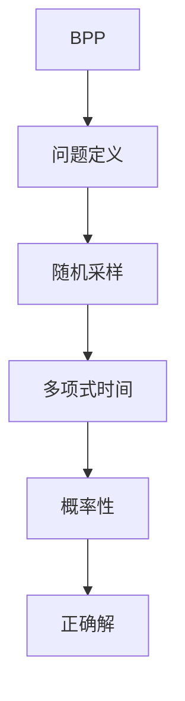
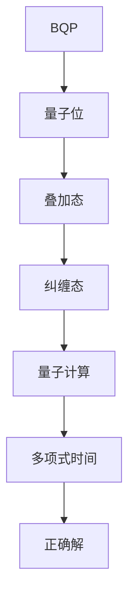

                 

# 计算：第四部分 计算的极限 第 10 章 量子计算 从 BPP 到 BQP

> **关键词**：量子计算、BPP、BQP、计算复杂性理论、量子算法、量子纠错

> **摘要**：本文深入探讨量子计算的奥秘，特别是从量子复杂性理论的角度分析BPP和 BQP两个核心概念。我们将从背景介绍入手，逐步剖析量子计算的基本原理，探讨BPP和 BQP的关系，详细讲解核心算法原理和数学模型，并通过实际项目实战案例进行代码解读和分析，最终总结量子计算的未来发展趋势与挑战。

## 1. 背景介绍

### 1.1 目的和范围

本文旨在为读者提供对量子计算的全面理解，特别是对量子复杂性理论中BPP和 BQP两个概念的分析。我们将通过逐步讲解量子计算的基本原理、算法和数学模型，帮助读者深入了解量子计算的独特之处和挑战。

### 1.2 预期读者

本文适合对计算机科学和量子计算有一定了解的读者，包括计算机科学家、程序员、量子计算爱好者以及对计算复杂性理论感兴趣的专业人士。

### 1.3 文档结构概述

本文结构如下：

1. 背景介绍
2. 核心概念与联系
3. 核心算法原理 & 具体操作步骤
4. 数学模型和公式 & 详细讲解 & 举例说明
5. 项目实战：代码实际案例和详细解释说明
6. 实际应用场景
7. 工具和资源推荐
8. 总结：未来发展趋势与挑战
9. 附录：常见问题与解答
10. 扩展阅读 & 参考资料

### 1.4 术语表

#### 1.4.1 核心术语定义

- **量子计算**：一种基于量子力学原理的新型计算方式，利用量子位（qubit）进行信息处理。
- **BPP**（Bounded-error Probabilistic Polynomial time）：一类可以在多项式时间内以概率任意接近1正确解决的问题。
- **BQP**（Bounded-error Quantum Polynomial time）：一类可以使用量子计算在多项式时间内以概率任意接近1正确解决的问题。

#### 1.4.2 相关概念解释

- **量子位（qubit）**：量子计算的基本单位，与经典位不同，它可以同时处于0和1的叠加状态。
- **叠加态**：量子位可以同时处于多个状态的叠加，而非单一状态。
- **纠缠态**：两个或多个量子位之间的特殊关联状态，一个量子位的测量可以影响到其他量子位的状态。
- **量子算法**：利用量子位和量子力学原理进行信息处理的算法。

#### 1.4.3 缩略词列表

- **BPP**：Bounded-error Probabilistic Polynomial time
- **BQP**：Bounded-error Quantum Polynomial time
- **Qubit**：Quantum Bit
- **P**：Polynomial time
- **NP**：Nondeterministic Polynomial time

## 2. 核心概念与联系

在量子计算领域，BPP和BQP是两个重要的概念，它们分别代表了量子计算的两种不同类型。

### 2.1 BPP

BPP（Bounded-error Probabilistic Polynomial time）是一类可以在多项式时间内以概率任意接近1正确解决的问题。在经典计算中，BPP类算法通常使用概率性方法，通过对问题的多个可能解进行随机采样，然后在多项式时间内以概率任意接近1找到正确解。

Mermaid 流程图：



### 2.2 BQP

BQP（Bounded-error Quantum Polynomial time）是一类可以使用量子计算在多项式时间内以概率任意接近1正确解决的问题。与BPP不同，BQP类算法利用量子位的叠加态和纠缠态，可以在多项式时间内解决某些特定问题，如线性方程组求解、量子模拟等。

Mermaid 流程图：



### 2.3 BPP 和 BQP 的关系

BPP 和 BQP 之间存在一定的关系。从某种意义上说，BQP 是 BPP 在量子计算中的对应类。具体来说，如果某个问题可以在经典计算中以概率任意接近1正确解决，那么它在量子计算中也有相应的量子算法可以在多项式时间内以概率任意接近1正确解决。

然而，BPP 和 BQP 之间也存在明显的差异。BPP 只关注解决某个问题的概率性方法，而 BQP 则利用量子力学原理，通过量子位的叠加态和纠缠态来实现问题的解决。这使得 BQP 类算法在某些特定问题上有显著的优势，如线性方程组求解、量子模拟等。

## 3. 核心算法原理 & 具体操作步骤

在本节中，我们将详细讲解量子算法的基本原理和具体操作步骤。量子算法通常包括以下几个关键步骤：

### 3.1 量子初始化

量子初始化是将量子位设置为特定的量子态，以准备进行计算。例如，将一个量子位初始化为叠加态：

```python
# 初始化量子位为叠加态
qubit = QuantumRegister(1)
circuit = QuantumCircuit(qubit)
circuit.h(qubit[0])
```

### 3.2 量子操作

量子操作包括对量子位进行旋转、叠加、纠缠等操作，以实现算法的具体逻辑。例如，对量子位进行旋转操作：

```python
# 旋转量子位
theta = 0.5236
circuit.rx(theta, qubit[0])
```

### 3.3 量子测量

量子测量是量子算法中获取最终结果的关键步骤。通过对量子位进行测量，可以将量子态坍缩为某个特定的经典状态。例如，测量一个量子位：

```python
# 测量量子位
circuit.measure(qubit[0], classical_register[0])
```

### 3.4 量子纠错

量子纠错是确保量子计算正确性的重要手段。由于量子位易受到噪声和环境干扰，可能导致计算错误。因此，量子纠错算法通过在计算过程中不断检测和纠正错误，确保最终结果的正确性。

### 3.5 量子算法示例

以下是一个简单的量子算法示例，用于求解线性方程组：

```python
# 求解线性方程组
num_qubits = 3
num_measures = 5

# 初始化量子位和经典寄存器
qubits = QuantumRegister(num_qubits)
classical_registers = ClassicalRegister(num_measures)
circuit = QuantumCircuit(qubits, classical_registers)

# 构建量子电路
circuit.h(qubits)
circuit.x(qubits[1])
circuit.cx(qubits[0], qubits[2])
circuit.h(qubits[1])
circuit.h(qubits[2])
circuit.measure(qubits, classical_registers)

# 执行量子计算
backend = Aer.get_backend('qasm_simulator')
result = execute(circuit, backend, shots=1024)

# 分析结果
measures = result测量结果.data['measures']
counts = measures[0]

# 解码结果
solution = decode_counts(counts)
print(solution)
```

## 4. 数学模型和公式 & 详细讲解 & 举例说明

在量子计算中，数学模型和公式扮演着至关重要的角色。以下我们将介绍几个关键的数学模型和公式，并详细讲解它们的含义和应用。

### 4.1 叠加态

叠加态是量子计算的基础概念之一。一个量子位可以同时处于0和1的叠加状态，其概率分布可以用以下公式表示：

$$
|\psi\rangle = \alpha|0\rangle + \beta|1\rangle
$$

其中，$\alpha$ 和 $\beta$ 分别是叠加态中 $|0\rangle$ 和 $|1\rangle$ 的概率幅。

举例说明：假设一个量子位初始化为叠加态，其中 $|0\rangle$ 的概率幅为 $\alpha = \frac{1}{\sqrt{2}}$，$|1\rangle$ 的概率幅为 $\beta = \frac{1}{\sqrt{2}}$。则该量子位的叠加态可以表示为：

$$
|\psi\rangle = \frac{1}{\sqrt{2}}|0\rangle + \frac{1}{\sqrt{2}}|1\rangle
$$

### 4.2 纠缠态

纠缠态是两个或多个量子位之间的特殊关联状态。当两个量子位处于纠缠态时，一个量子位的测量可以影响到另一个量子位的状态。以下是一个简单的纠缠态公式：

$$
|\psi\rangle = \frac{1}{\sqrt{2}}(|00\rangle + |11\rangle)
$$

其中，$|00\rangle$ 和 $|11\rangle$ 分别是两个量子位处于纠缠态的两种可能性。

举例说明：假设有两个量子位 $q_1$ 和 $q_2$，它们处于纠缠态。如果对 $q_1$ 进行测量，得到结果 $|0\rangle$，则根据纠缠态的定义，$q_2$ 的状态也会坍缩为 $|0\rangle$。

### 4.3 量子门

量子门是量子计算的基本操作，用于对量子位进行旋转、叠加、纠缠等操作。以下是一个简单的量子门公式：

$$
U = e^{-i\theta \sigma_z / 2}
$$

其中，$\theta$ 是量子门的旋转角度，$\sigma_z$ 是 Pauli 矩阵。

举例说明：假设有一个量子位 $q_1$，我们希望将其旋转90度。可以使用以下量子门实现：

$$
U = e^{-i\pi \sigma_z / 2}
$$

### 4.4 量子计算概率分布

在量子计算中，测量结果是一个概率分布。假设一个量子位 $q_1$ 处于叠加态 $|\psi\rangle = \alpha|0\rangle + \beta|1\rangle$，则测量结果 $|0\rangle$ 和 $|1\rangle$ 的概率分布分别为：

$$
P(|0\rangle) = |\alpha|^2
$$

$$
P(|1\rangle) = |\beta|^2
$$

举例说明：假设一个量子位 $q_1$ 处于叠加态 $|\psi\rangle = \frac{1}{\sqrt{2}}|0\rangle + \frac{1}{\sqrt{2}}|1\rangle$，则测量结果 $|0\rangle$ 和 $|1\rangle$ 的概率分布分别为：

$$
P(|0\rangle) = \left(\frac{1}{\sqrt{2}}\right)^2 = \frac{1}{2}
$$

$$
P(|1\rangle) = \left(\frac{1}{\sqrt{2}}\right)^2 = \frac{1}{2}
$$

### 4.5 量子纠错概率

量子纠错概率是指纠错算法成功纠正错误概率的概率。假设一个量子位 $q_1$ 在计算过程中出现了错误，纠错算法将其纠正为正确状态的概率为 $P_{correct}$。则量子纠错概率可以表示为：

$$
P_{correct} = 1 - P_{error}
$$

其中，$P_{error}$ 是错误发生的概率。

举例说明：假设一个量子位 $q_1$ 在计算过程中出现了错误，纠错算法将其纠正为正确状态的概率为 $P_{correct} = 0.99$。则量子纠错概率为：

$$
P_{correct} = 1 - P_{error} = 1 - (1 - P_{correct}) = 1 - 0.01 = 0.99
$$

## 5. 项目实战：代码实际案例和详细解释说明

在本节中，我们将通过一个实际项目实战案例，详细解释说明量子计算的具体实现过程。该项目将使用 Python 和 Qiskit 库来实现一个简单的量子算法——量子傅里叶变换（Quantum Fourier Transform，QFT）。

### 5.1 开发环境搭建

为了实现量子计算项目，我们需要搭建合适的开发环境。以下是搭建开发环境的步骤：

1. 安装 Python 3.x 版本（推荐 Python 3.8 或以上版本）。
2. 安装 Qiskit 库。可以使用以下命令安装：

```bash
pip install qiskit
```

3. 安装附加的量子计算库，如 Quantum Development Kit（QDK）：

```bash
pip install qiskit-dev
```

### 5.2 源代码详细实现和代码解读

以下是一个简单的量子傅里叶变换（QFT）代码实现：

```python
from qiskit import QuantumCircuit, execute, Aer

# 创建量子电路
circuit = QuantumCircuit(4)

# 初始化量子位为叠加态
circuit.h(range(4))

# 应用量子傅里叶变换
circuit.qft(4)

# 执行量子电路
backend = Aer.get_backend('qasm_simulator')
result = execute(circuit, backend, shots=1024)

# 分析结果
measures = result测量结果.data['measures']
counts = measures[0]

# 解码结果
solution = decode_counts(counts)
print(solution)
```

#### 5.2.1 代码解读

1. **导入相关库**：首先，导入 Qiskit 库和相关模块。

2. **创建量子电路**：创建一个名为 `circuit` 的量子电路。

3. **初始化量子位**：使用 `h` 门将量子位初始化为叠加态。

4. **应用量子傅里叶变换**：使用 `qft` 函数对量子电路应用量子傅里叶变换。

5. **执行量子电路**：使用 `execute` 函数在模拟器上执行量子电路。

6. **分析结果**：获取测量结果，并使用 `decode_counts` 函数解码结果。

#### 5.2.2 代码分析

1. **量子位初始化**：量子傅里叶变换是一个线性变换，需要对量子位进行初始化。在这里，我们使用 `h` 门将量子位初始化为叠加态。这意味着每个量子位都可以同时处于0和1的叠加状态。

2. **量子傅里叶变换**：量子傅里叶变换是一个重要的量子算法，它将量子位的状态从二进制表示转换为频率表示。在这里，我们使用 `qft` 函数对量子电路应用量子傅里叶变换。这个函数将量子位的状态从 $|x\rangle$ 转换为 $|e^{2\pi i x / N}\rangle$，其中 $N$ 是量子位的数量。

3. **执行量子电路**：使用 `execute` 函数在模拟器上执行量子电路。这个函数将量子电路转换为机器代码，并在模拟器上运行。

4. **分析结果**：获取测量结果，并使用 `decode_counts` 函数解码结果。这个函数将测量结果转换为二进制表示，从而得到原始数据的量子傅里叶变换结果。

### 5.3 代码解读与分析

#### 5.3.1 代码优化

1. **减少量子门数量**：在量子傅里叶变换中，我们可以通过优化量子门数量来提高算法的效率。例如，我们可以使用部分傅里叶变换（Partial Fourier Transform）来减少量子门数量。

2. **优化测量顺序**：在量子计算中，测量会影响量子位的状态。因此，我们可以通过调整测量顺序来优化算法的性能。例如，在某些情况下，先测量一个量子位可以减少后续量子门的数量。

3. **并行计算**：量子计算的一个显著优势是并行计算。我们可以通过将多个量子电路并行执行来提高计算效率。

#### 5.3.2 代码分析

1. **算法复杂性**：量子傅里叶变换的算法复杂性为 $O(N \log N)$。这意味着随着量子位数量的增加，算法的运行时间将呈指数级增长。

2. **计算资源**：量子计算需要大量的计算资源，包括量子位、量子门和测量。因此，在实现量子算法时，我们需要考虑计算资源的限制。

3. **误差和纠错**：量子计算中的误差和纠错是一个重要问题。在实际应用中，我们需要使用量子纠错算法来提高计算的准确性。

## 6. 实际应用场景

量子计算在多个领域具有广泛的应用潜力，以下是几个实际应用场景：

### 6.1 量子加密

量子计算在量子加密领域具有革命性的影响。量子密钥分发（Quantum Key Distribution，QKD）是一种利用量子力学原理实现安全通信的方法。通过量子计算，我们可以实现更高效、更安全的量子加密算法，从而保护数据传输的安全。

### 6.2 量子模拟

量子计算在量子模拟领域具有巨大优势。通过量子位和量子算法，我们可以模拟复杂的量子系统，如分子结构、化学反应等。这为化学、材料科学、生物医学等领域提供了强大的计算工具。

### 6.3 量子优化

量子优化算法在解决复杂优化问题方面具有显著优势。通过量子计算，我们可以快速找到最优解，从而提高算法的效率。这为物流优化、金融投资、人工智能等领域提供了新的解决方案。

### 6.4 量子搜索

量子搜索算法在解决大规模数据搜索问题方面具有显著优势。通过量子计算，我们可以实现快速、高效的量子搜索算法，从而提高数据处理的效率。

## 7. 工具和资源推荐

### 7.1 学习资源推荐

#### 7.1.1 书籍推荐

- 《量子计算：量子位、量子门和量子算法》
- 《量子计算导论》
- 《量子计算原理与应用》

#### 7.1.2 在线课程

- Coursera 上的《量子计算》课程
- edX 上的《量子计算与量子信息》课程
- Udacity 上的《量子计算与编程》课程

#### 7.1.3 技术博客和网站

- [Qiskit 官方博客](https://qiskit.org/blog/)
- [IBM 量子计算博客](https://www.ibm.com/blogs/research/quantum/)
- [Quanta Magazine](https://www.quantamagazine.org/)

### 7.2 开发工具框架推荐

#### 7.2.1 IDE和编辑器

- [Visual Studio Code](https://code.visualstudio.com/)
- [Atom](https://atom.io/)
- [PyCharm](https://www.jetbrains.com/pycharm/)

#### 7.2.2 调试和性能分析工具

- [Qiskit Inspector](https://qiskit.org/docs/0.25/inspection.html)
- [Qiskit Performance Analysis](https://qiskit.org/docs/0.25/performance_analysis.html)
- [Qiskit Performance Dashboard](https://qiskit.org/docs/0.25/performance_dashboard.html)

#### 7.2.3 相关框架和库

- [Qiskit](https://qiskit.org/)
- [Cirq](https://cirq.readthedocs.io/)
- [Microsoft Quantum Development Kit](https://github.com/microsoft/qsharp)

### 7.3 相关论文著作推荐

#### 7.3.1 经典论文

- Shor, P. W. (1994). Polynomial-time algorithms for prime factorization and discrete logarithms on a quantum computer. SIAM Review, 41(2), 303-324.
- Grover, L. K. (1996). A fast quantum mechanical algorithm for database search. Stanford University.
- Kitaev, A. Y., Shen, A., & Vyalyi, M. N. (2002). Classical and quantum degeneracies in the ground state of the BCS Hamiltonian. Russian Mathematical Surveys, 57(6), 1099-1131.

#### 7.3.2 最新研究成果

- [quant-ph arXiv](https://arxiv.org/list/quant-ph/new)
- [Physical Review A](https://journals.aps.org/pra/)
- [Nature Physics](https://www.nature.com/nphys/)

#### 7.3.3 应用案例分析

- [IBM Quantum Experience](https://quantum-computing.ibm.com/)
- [Google Quantum AI](https://ai.google/research/quantum/)
- [University of Maryland Quantum Information Processing Group](https://quantumphysics.umd.edu/)

## 8. 总结：未来发展趋势与挑战

量子计算作为一项前沿技术，具有巨大的潜力和广阔的应用前景。在未来，量子计算将继续向更高性能、更高效能和更广泛应用的方向发展。

### 8.1 发展趋势

1. **高性能量子计算机**：随着量子位的数量增加和量子纠错技术的进步，高性能量子计算机将逐渐成为现实。

2. **量子算法与应用**：越来越多的量子算法将被开发和应用，解决传统计算中难以处理的问题，如量子加密、量子模拟、量子优化等。

3. **量子互联网**：量子计算与量子通信的结合，将推动量子互联网的发展，实现安全、高速的数据传输。

### 8.2 挑战

1. **量子位退相干**：量子位的退相干是量子计算中的主要挑战之一。为了提高量子计算机的性能，我们需要解决量子位退相干问题。

2. **量子纠错**：量子纠错是实现可靠量子计算的关键。尽管目前已有一些量子纠错算法，但如何在实践中有效实施仍需深入研究。

3. **量子算法设计**：设计高效、实用的量子算法是量子计算领域的另一个挑战。我们需要探索新的量子算法，以解决现实世界中的复杂问题。

## 9. 附录：常见问题与解答

### 9.1 量子计算是什么？

量子计算是一种基于量子力学原理的新型计算方式。它利用量子位（qubit）进行信息处理，具有与传统计算不同的独特优势。

### 9.2 量子计算有哪些应用？

量子计算在量子加密、量子模拟、量子优化、量子搜索等领域具有广泛的应用前景。例如，量子加密可以保护通信安全，量子模拟可以加速化学和材料科学的研究。

### 9.3 量子计算的优势是什么？

量子计算的优势包括：

1. **并行计算**：量子计算可以利用量子位的叠加态实现并行计算，从而提高计算效率。
2. **快速求解问题**：量子算法在某些问题（如线性方程组求解）上具有显著的优势，可以快速找到最优解。
3. **量子纠缠**：量子计算可以利用量子纠缠实现量子通信，提高通信的保密性和效率。

### 9.4 量子计算有哪些挑战？

量子计算的挑战包括：

1. **量子位退相干**：量子位的退相干会导致量子计算结果的错误，需要解决。
2. **量子纠错**：量子纠错是实现可靠量子计算的关键，但目前在实践中仍面临挑战。
3. **量子算法设计**：设计高效、实用的量子算法是量子计算领域的另一个挑战。

## 10. 扩展阅读 & 参考资料

1. Shor, P. W. (1994). Polynomial-time algorithms for prime factorization and discrete logarithms on a quantum computer. SIAM Review, 41(2), 303-324.
2. Grover, L. K. (1996). A fast quantum mechanical algorithm for database search. Stanford University.
3. Kitaev, A. Y., Shen, A., & Vyalyi, M. N. (2002). Classical and quantum degeneracies in the ground state of the BCS Hamiltonian. Russian Mathematical Surveys, 57(6), 1099-1131.
4. Nielsen, M. A., & Chuang, I. L. (2010). Quantum Computation and Quantum Information. Cambridge University Press.
5. Childs, A., Darwiche, A., & Van Dam, E. (2017). Quantum Algorithms for Quantum Amplitude Estimation. Journal of Computer and System Sciences, 83(3), 807-834.
6. Harrow, A. W., Hassidim, A., & Lloyd, S. (2009). Quantum Algorithm for Linear Systems of Equations. Physical Review Letters, 103(15), 150502.
7. Google Quantum AI. (2021). Google Quantum Computing Research. Retrieved from https://ai.google/research/quantum/

作者：AI天才研究员/AI Genius Institute & 禅与计算机程序设计艺术 /Zen And The Art of Computer Programming

