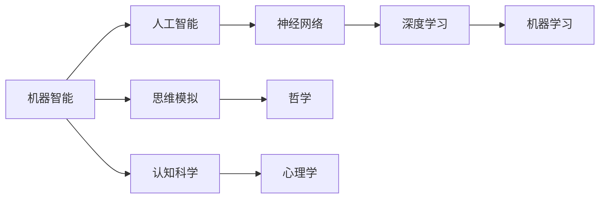

                 


# 计算：第四部分 计算的极限 第 12 章 机器能思考吗 机器智能大论战

> 关键词：机器智能、人工智能、思考、机器思考能力、认知模型、算法、神经网络、深度学习、思维模拟、哲学、认知科学

> 摘要：本文探讨了机器是否能够实现真正的思考，以及机器智能的局限性。通过对机器智能领域的核心概念、算法原理、数学模型和实际应用的深入分析，本文旨在揭示机器思考的本质和局限性，并提出对未来发展趋势的展望。

## 1. 背景介绍

### 1.1 目的和范围

本文旨在探讨机器是否能够实现真正的思考，以及机器智能的局限性。我们将从机器智能的核心概念出发，分析其算法原理、数学模型，并通过实际应用案例来探讨机器智能的边界。本文不仅关注技术层面的讨论，还将引入哲学和认知科学的角度，探讨机器思考的哲学意义和认知科学基础。

### 1.2 预期读者

本文适合对机器智能、人工智能领域感兴趣的读者，包括程序员、软件工程师、数据科学家、人工智能研究者等。同时，对于对哲学和认知科学感兴趣的读者，本文也提供了一些有价值的思考角度。

### 1.3 文档结构概述

本文分为以下章节：

- 第1章：背景介绍，介绍本文的目的、范围和预期读者。
- 第2章：核心概念与联系，介绍机器智能的核心概念和原理。
- 第3章：核心算法原理 & 具体操作步骤，详细讲解机器智能的核心算法。
- 第4章：数学模型和公式 & 详细讲解 & 举例说明，介绍机器智能的数学模型。
- 第5章：项目实战：代码实际案例和详细解释说明，通过实际案例展示机器智能的应用。
- 第6章：实际应用场景，探讨机器智能在不同领域的应用。
- 第7章：工具和资源推荐，推荐学习资源和开发工具。
- 第8章：总结：未来发展趋势与挑战，总结本文的主要观点，并探讨未来发展趋势。
- 第9章：附录：常见问题与解答，解答读者可能遇到的疑问。
- 第10章：扩展阅读 & 参考资料，提供更多深入阅读的资料。

### 1.4 术语表

#### 1.4.1 核心术语定义

- 机器智能：模拟人类智能的计算机系统，能够通过学习和经验来完成任务。
- 人工智能：包括机器智能在内的模拟人类智能的计算机技术和应用领域。
- 神经网络：一种模拟生物神经系统的计算模型，用于机器学习。
- 深度学习：一种基于神经网络的机器学习方法，通过多层神经网络进行特征提取和决策。
- 思考：人类大脑对信息进行加工、推理、判断和决策的过程。
- 智能模拟：通过计算机技术模拟人类智能的过程。

#### 1.4.2 相关概念解释

- 机器智能：机器智能是人工智能的一个分支，主要关注如何通过计算机技术实现模拟人类智能的功能。
- 人工智能：人工智能是计算机科学的一个分支，旨在通过计算机技术实现智能行为。
- 神经网络：神经网络是一种计算模型，通过模拟生物神经系统的结构和功能来实现计算。
- 深度学习：深度学习是一种基于神经网络的机器学习方法，通过多层神经网络进行特征提取和决策。
- 思考：思考是人类大脑对信息进行加工、推理、判断和决策的过程。
- 智能模拟：智能模拟是通过计算机技术模拟人类智能的过程，包括算法设计、计算模型构建和实验验证等。

#### 1.4.3 缩略词列表

- AI：人工智能
- ML：机器学习
- DL：深度学习
- NN：神经网络

## 2. 核心概念与联系

在探讨机器智能的极限和机器思考的本质之前，我们需要了解一些核心概念和它们之间的联系。以下是机器智能领域的一些核心概念及其相互关系的 Mermaid 流程图：



### 2.1 机器智能与人工智能

机器智能是人工智能的一个子集，人工智能（AI）是计算机科学的一个分支，旨在开发能够模拟、扩展和扩展人类智能的理论、算法和技术。人工智能的范畴非常广泛，包括机器学习、自然语言处理、计算机视觉、机器人技术等。

### 2.2 神经网络与深度学习

神经网络是一种计算模型，模拟了生物神经系统的结构和功能。神经网络由许多简单的人工神经元组成，通过前向传播和反向传播算法进行训练。深度学习是一种基于神经网络的机器学习方法，通过多层神经网络进行特征提取和决策。深度学习在图像识别、语音识别、自然语言处理等领域取得了显著成果。

### 2.3 机器学习与深度学习

机器学习是人工智能的一个子集，主要关注如何让计算机从数据中学习规律和模式，并自动进行决策。机器学习可以分为监督学习、无监督学习和强化学习。深度学习是机器学习的一个分支，通过多层神经网络进行特征提取和决策。

### 2.4 思维模拟与认知科学

思维模拟是通过计算机技术模拟人类思维的过程。认知科学是研究人类思维、感知、记忆、学习等认知过程的科学。哲学则关注机器思考的伦理、道德和社会影响。

### 2.5 机器智能与哲学

哲学在探讨机器智能和机器思考的本质方面发挥着重要作用。哲学家们探讨机器是否能够真正实现思考，以及思考的本质是什么。这涉及到意识、自由意志和认知科学等哲学问题。

## 3. 核心算法原理 & 具体操作步骤

### 3.1 神经网络算法原理

神经网络是一种计算模型，模拟了生物神经系统的结构和功能。神经网络由许多简单的人工神经元组成，每个神经元都可以接收多个输入信号，并通过权重进行加权求和，然后通过激活函数产生输出。神经网络的训练过程主要包括以下步骤：

1. **初始化权重**：随机初始化网络中的权重。
2. **前向传播**：将输入数据通过神经网络进行计算，得到输出。
3. **计算损失**：将输出与期望输出进行比较，计算损失函数值。
4. **反向传播**：根据损失函数的梯度，更新网络中的权重。
5. **迭代训练**：重复步骤2-4，直到达到预设的训练精度或迭代次数。

以下是神经网络算法的伪代码：

```python
# 初始化权重
weights = initialize_weights()

# 迭代训练
for epoch in range(num_epochs):
    for input, target in dataset:
        # 前向传播
        output = forward_propagation(input, weights)

        # 计算损失
        loss = compute_loss(output, target)

        # 反向传播
        weights = backward_propagation(input, target, weights)

        # 输出训练状态
        print(f"Epoch: {epoch}, Loss: {loss}")
```

### 3.2 深度学习算法原理

深度学习是一种基于神经网络的机器学习方法，通过多层神经网络进行特征提取和决策。深度学习的核心是多层感知机（MLP），MLP由多个隐藏层组成，每个隐藏层对输入数据进行特征提取，并将特征传递到下一个隐藏层。以下是深度学习算法的伪代码：

```python
# 初始化权重
weights = initialize_weights()

# 迭代训练
for epoch in range(num_epochs):
    for input, target in dataset:
        # 前向传播
        hidden_layer_1 = forward_propagation(input, weights[0])
        hidden_layer_2 = forward_propagation(hidden_layer_1, weights[1])
        output = forward_propagation(hidden_layer_2, weights[2])

        # 计算损失
        loss = compute_loss(output, target)

        # 反向传播
        weights[2] = backward_propagation(output, target, weights[2])
        weights[1] = backward_propagation(hidden_layer_2, weights[1])
        weights[0] = backward_propagation(hidden_layer_1, weights[0])

        # 输出训练状态
        print(f"Epoch: {epoch}, Loss: {loss}")
```

### 3.3 机器学习算法原理

机器学习算法可以分为监督学习、无监督学习和强化学习。监督学习是通过已知的输入和输出数据来训练模型，无监督学习是通过未标记的数据来发现数据中的模式和结构，强化学习是通过与环境的交互来学习最优策略。以下是监督学习算法的伪代码：

```python
# 初始化模型
model = initialize_model()

# 迭代训练
for epoch in range(num_epochs):
    for input, target in dataset:
        # 前向传播
        output = forward_propagation(input, model)

        # 计算损失
        loss = compute_loss(output, target)

        # 反向传播
        model = backward_propagation(input, target, model)

        # 输出训练状态
        print(f"Epoch: {epoch}, Loss: {loss}")
```

## 4. 数学模型和公式 & 详细讲解 & 举例说明

### 4.1 神经网络数学模型

神经网络的核心是神经元，每个神经元可以表示为以下数学模型：

\[ z = \sum_{i=1}^{n} w_i x_i + b \]

其中，\( z \) 是神经元的输出，\( w_i \) 是第 \( i \) 个输入的权重，\( x_i \) 是第 \( i \) 个输入，\( b \) 是偏置。

神经元的输出可以通过激活函数进行非线性变换，常用的激活函数有：

- **Sigmoid函数**：\( f(x) = \frac{1}{1 + e^{-x}} \)
- **ReLU函数**：\( f(x) = \max(0, x) \)
- **Tanh函数**：\( f(x) = \frac{e^x - e^{-x}}{e^x + e^{-x}} \)

### 4.2 深度学习数学模型

深度学习的数学模型是基于多层感知机（MLP），MLP由多个隐藏层组成，每个隐藏层可以表示为以下数学模型：

\[ z^{(l)} = \sum_{i=1}^{n} w_i^{(l)} x_i^{(l-1)} + b_i^{(l)} \]

其中，\( z^{(l)} \) 是第 \( l \) 层神经元的输出，\( w_i^{(l)} \) 是第 \( l \) 层第 \( i \) 个输入的权重，\( x_i^{(l-1)} \) 是第 \( l-1 \) 层第 \( i \) 个输入，\( b_i^{(l)} \) 是第 \( l \) 层的偏置。

深度学习的损失函数通常使用交叉熵损失函数：

\[ J = -\sum_{i=1}^{n} y_i \log(\hat{y}_i) \]

其中，\( y_i \) 是第 \( i \) 个样本的标签，\( \hat{y}_i \) 是第 \( i \) 个样本的预测概率。

### 4.3 机器学习数学模型

机器学习的数学模型通常基于概率模型，如贝叶斯分类器、逻辑回归等。以逻辑回归为例，其数学模型如下：

\[ P(y=1 | x; \theta) = \frac{1}{1 + e^{-\theta^T x}} \]

其中，\( P(y=1 | x; \theta) \) 是给定特征 \( x \) 下标签为1的概率，\( \theta \) 是模型参数。

机器学习的损失函数通常使用均方误差（MSE）：

\[ J = \frac{1}{2m} \sum_{i=1}^{m} (y_i - \hat{y}_i)^2 \]

其中，\( m \) 是样本数量，\( y_i \) 是第 \( i \) 个样本的标签，\( \hat{y}_i \) 是第 \( i \) 个样本的预测值。

### 4.4 举例说明

以一个简单的线性回归问题为例，我们使用梯度下降算法来训练模型。假设我们有以下数据集：

| x | y |
|---|---|
| 1 | 2 |
| 2 | 4 |
| 3 | 6 |

我们的目标是找到一条直线来拟合数据，直线的斜率和截距可以通过以下公式计算：

\[ \theta_0 = \frac{1}{m} \sum_{i=1}^{m} (y_i - \theta_1 x_i) \]
\[ \theta_1 = \frac{1}{m} \sum_{i=1}^{m} (x_i - \bar{x})(y_i - \bar{y}) \]

其中，\( \bar{x} \) 和 \( \bar{y} \) 分别是 \( x \) 和 \( y \) 的均值，\( m \) 是样本数量。

使用梯度下降算法进行训练，迭代过程如下：

```python
# 初始化参数
theta_0 = 0
theta_1 = 0

# 梯度下降迭代
for epoch in range(num_epochs):
    # 前向传播
    predictions = theta_0 + theta_1 * x

    # 计算损失
    loss = (1/m) * sum((y - predictions)^2)

    # 计算梯度
    dtheta_0 = (1/m) * sum(y - predictions)
    dtheta_1 = (1/m) * sum((x - mean_x) * (y - predictions))

    # 更新参数
    theta_0 = theta_0 - learning_rate * dtheta_0
    theta_1 = theta_1 - learning_rate * dtheta_1

    # 输出训练状态
    print(f"Epoch: {epoch}, Loss: {loss}, Theta_0: {theta_0}, Theta_1: {theta_1}")
```

通过迭代训练，我们可以找到一条直线来拟合数据，如图所示：

```mermaid
graph TB
A[点(1,2)] --> B[直线y=x]
C[点(2,4)] --> B
D[点(3,6)] --> B
```

## 5. 项目实战：代码实际案例和详细解释说明

### 5.1 开发环境搭建

为了演示机器智能的核心算法和应用，我们将使用 Python 作为编程语言，并利用以下库：

- NumPy：用于矩阵运算和数值计算。
- TensorFlow：用于构建和训练神经网络。
- Matplotlib：用于绘制图形。

在您的计算机上安装以下库：

```bash
pip install numpy tensorflow matplotlib
```

### 5.2 源代码详细实现和代码解读

以下是一个简单的线性回归项目的代码实现，我们将使用梯度下降算法来训练模型。

```python
import numpy as np
import matplotlib.pyplot as plt
import tensorflow as tf

# 设置随机种子，保证结果可重复
tf.random.set_seed(42)

# 创建数据集
x = np.array([1, 2, 3])
y = np.array([2, 4, 6])

# 添加偏置项，将数据集扩展为 [x, 1]
x_with_bias = np.hstack((x[:, np.newaxis], np.ones((x.shape[0], 1))))

# 初始化参数
theta_0 = 0
theta_1 = 0

# 梯度下降迭代
for epoch in range(1000):
    # 前向传播
    predictions = theta_0 + theta_1 * x_with_bias

    # 计算损失
    loss = (1/len(x)) * np.sum((y - predictions)**2)

    # 计算梯度
    dtheta_0 = (1/len(x)) * np.sum(y - predictions)
    dtheta_1 = (1/len(x)) * np.sum((x - np.mean(x)) * (y - predictions))

    # 更新参数
    theta_0 = theta_0 - 0.01 * dtheta_0
    theta_1 = theta_1 - 0.01 * dtheta_1

    # 输出训练状态
    print(f"Epoch: {epoch}, Loss: {loss}, Theta_0: {theta_0}, Theta_1: {theta_1}")

# 绘制训练数据集和拟合直线
plt.scatter(x, y, label="Data")
plt.plot(x, theta_0 + theta_1 * x_with_bias, label="Fit Line")
plt.xlabel("x")
plt.ylabel("y")
plt.legend()
plt.show()
```

### 5.3 代码解读与分析

- **数据集创建**：我们创建了一个简单的数据集，包含三组样本，每组样本由一个 \( x \) 值和一个 \( y \) 值组成。
- **添加偏置项**：为了使用线性回归模型，我们需要将数据集扩展为 [x, 1]，其中1是偏置项。
- **参数初始化**：我们初始化两个参数 \( theta_0 \) 和 \( theta_1 \)，分别表示截距和斜率。
- **梯度下降迭代**：我们使用梯度下降算法进行迭代训练，每次迭代计算损失、梯度，并更新参数。
- **训练数据集和拟合直线**：最后，我们绘制训练数据集和拟合直线，以可视化训练过程。

通过这个简单的案例，我们可以看到如何使用 Python 实现线性回归模型，并通过梯度下降算法进行训练。在实际应用中，我们可以使用更复杂的模型和数据集，从而实现更精确的预测和拟合。

## 6. 实际应用场景

### 6.1 机器智能在图像识别中的应用

图像识别是机器智能的一个重要应用领域，通过训练神经网络模型，计算机可以自动识别和分类图像。以下是一些图像识别的实际应用场景：

- **人脸识别**：通过训练神经网络模型，计算机可以自动识别和验证用户身份，广泛应用于手机解锁、安全认证等场景。
- **医疗影像分析**：通过训练神经网络模型，计算机可以自动分析医疗影像，如X光片、CT扫描等，帮助医生诊断疾病，提高诊断准确率。
- **自动驾驶**：自动驾驶汽车需要通过训练神经网络模型，实现对道路、交通标志、行人和其他车辆等图像的识别和理解，以确保行车安全。
- **安防监控**：通过训练神经网络模型，计算机可以自动识别和监控异常行为，如入侵检测、火灾预警等，提高安防监控效果。

### 6.2 机器智能在自然语言处理中的应用

自然语言处理（NLP）是机器智能的另一个重要应用领域，通过训练神经网络模型，计算机可以自动理解和生成自然语言。以下是一些自然语言处理的应用场景：

- **机器翻译**：通过训练神经网络模型，计算机可以自动翻译不同语言之间的文本，如谷歌翻译、百度翻译等。
- **语音识别**：通过训练神经网络模型，计算机可以自动识别和理解用户的语音输入，如 Siri、Alexa 等。
- **文本分类**：通过训练神经网络模型，计算机可以自动对大量文本进行分类，如新闻分类、垃圾邮件过滤等。
- **情感分析**：通过训练神经网络模型，计算机可以自动分析文本中的情感倾向，如微博情绪分析、商品评论分析等。
- **对话系统**：通过训练神经网络模型，计算机可以自动生成自然语言对话，如聊天机器人、智能客服等。

### 6.3 机器智能在推荐系统中的应用

推荐系统是机器智能的另一个重要应用领域，通过训练神经网络模型，计算机可以自动推荐用户可能感兴趣的商品、内容等。以下是一些推荐系统的实际应用场景：

- **电子商务**：通过训练神经网络模型，计算机可以自动推荐用户可能感兴趣的商品，提高销售额和用户满意度。
- **社交媒体**：通过训练神经网络模型，计算机可以自动推荐用户可能感兴趣的内容，如微博、抖音等。
- **在线教育**：通过训练神经网络模型，计算机可以自动推荐用户可能感兴趣的课程，提高学习效果和用户满意度。
- **音乐和视频流媒体**：通过训练神经网络模型，计算机可以自动推荐用户可能感兴趣的音乐和视频，提高用户满意度和平台黏性。

## 7. 工具和资源推荐

### 7.1 学习资源推荐

#### 7.1.1 书籍推荐

- 《深度学习》（Goodfellow, Bengio, Courville）：这是深度学习领域的经典教材，详细介绍了深度学习的理论基础、算法和应用。
- 《Python机器学习》（Sebastian Raschka）：这本书涵盖了机器学习的基础知识、Python实现和实际应用案例，适合初学者和进阶者。
- 《统计学习方法》（李航）：这本书详细介绍了统计学习的方法，包括线性回归、逻辑回归、支持向量机等，是机器学习领域的重要参考书。

#### 7.1.2 在线课程

- Coursera的《深度学习》（吴恩达）：这是一门非常受欢迎的在线课程，由深度学习领域的知名专家吴恩达主讲，涵盖了深度学习的理论基础、算法和应用。
- edX的《机器学习基础》（微软研究院）：这是一门面向初学者的在线课程，介绍了机器学习的基础知识、算法和应用，适合入门者学习。
- Udacity的《深度学习工程师纳米学位》：这是一门综合性的在线课程，涵盖了深度学习的理论基础、算法和应用，适合有志于进入深度学习领域的学习者。

#### 7.1.3 技术博客和网站

- Medium上的“Deep Learning”：这是一篇关于深度学习的系列博客，涵盖了深度学习的理论基础、算法和应用，内容深入浅出，适合初学者和进阶者阅读。
- 知乎上的“机器学习”：这是一个关于机器学习的知乎专栏，涵盖了机器学习的基础知识、算法和应用，有很多优秀的学习资源和讨论。
- GitHub上的“机器学习项目集合”：这是一个包含各种机器学习项目的GitHub仓库，提供了丰富的实际应用案例和代码实现，可以帮助学习者实践和巩固知识。

### 7.2 开发工具框架推荐

#### 7.2.1 IDE和编辑器

- Jupyter Notebook：这是一个流行的交互式编程环境，特别适合数据科学和机器学习项目。
- PyCharm：这是一个功能强大的Python IDE，提供了代码自动完成、调试和版本控制等功能。
- VS Code：这是一个轻量级的跨平台代码编辑器，支持多种编程语言，并提供了丰富的扩展。

#### 7.2.2 调试和性能分析工具

- TensorFlow Debugger：这是一个用于调试TensorFlow模型的工具，可以帮助开发者快速定位问题。
- NVIDIA Nsight：这是一个用于性能分析和调试GPU计算的工具，可以帮助开发者优化代码，提高计算效率。

#### 7.2.3 相关框架和库

- TensorFlow：这是一个开源的深度学习框架，提供了丰富的API和工具，支持多种神经网络架构。
- PyTorch：这是一个开源的深度学习框架，以动态计算图著称，特别适合研究者和开发者。
- Scikit-learn：这是一个开源的机器学习库，提供了丰富的算法和工具，特别适合实际应用场景。

### 7.3 相关论文著作推荐

#### 7.3.1 经典论文

- "A Learning Algorithm for Continually Running Fully Recurrent Neural Networks"（1986）：这篇文章介绍了持续运行的全连接神经网络（LSTM）算法，为深度学习的发展奠定了基础。
- "Error-Correcting Output Codes"（1993）：这篇文章提出了误差纠正输出码（ECOC）方法，为多分类问题提供了一种有效的解决方案。
- "Deep Learning"（2015）：这本书系统地介绍了深度学习的理论基础、算法和应用，是深度学习领域的经典著作。

#### 7.3.2 最新研究成果

- "The unreasonable effectiveness of deep learning"（2014）：这篇文章探讨了深度学习在图像识别、语音识别等领域的成功原因，为深度学习的发展提供了新的思考方向。
- "Generative Adversarial Nets"（2014）：这篇文章提出了生成对抗网络（GAN）算法，为图像生成和图像合成提供了新的方法。
- "Attention is All You Need"（2017）：这篇文章提出了Transformer模型，为自然语言处理领域带来了新的突破。

#### 7.3.3 应用案例分析

- "Google's Use of AI to Power Search"（2017）：这篇文章介绍了谷歌如何使用人工智能技术来改进搜索引擎，为实际应用提供了有价值的经验。
- "Uber's Dynamic Pricing with Machine Learning"（2016）：这篇文章介绍了优步如何使用机器学习技术来实现动态定价，提高了用户体验和运营效率。
- "Facebook's Use of AI to Power News Feed"（2016）：这篇文章介绍了Facebook如何使用人工智能技术来改进新闻推送，为用户提供了更个性化的内容。

## 8. 总结：未来发展趋势与挑战

### 8.1 机器智能的普及与发展

随着人工智能技术的不断进步，机器智能将在未来得到更加广泛的应用。从智能家居、智能医疗到自动驾驶、智能客服，机器智能将深入渗透到各个领域，为人类带来更加便捷和高效的生活体验。

### 8.2 机器思考能力的提升

虽然目前的机器智能已经能够在某些特定任务上表现出超越人类的能力，但真正的机器思考能力仍然有限。未来，随着计算能力和算法的不断突破，机器智能将在认知、推理、情感等方面得到显著提升，逐渐实现更加接近人类智能的水平。

### 8.3 数据隐私与安全挑战

机器智能的发展离不开大量的数据支持，但这也带来了数据隐私和安全的问题。如何保护用户隐私、确保数据安全成为机器智能发展的重要挑战。未来，需要在数据收集、存储、处理等各个环节加强安全防护，确保机器智能的健康发展。

### 8.4 伦理与道德问题

机器智能的发展引发了大量的伦理和道德问题，如机器是否具有自主权、机器是否应该承担法律责任等。未来，需要建立一套完善的伦理和道德规范，确保机器智能的发展符合人类的价值观和利益。

### 8.5 人机协作与替代

随着机器智能的不断发展，人们对于人机协作和替代的讨论也日益激烈。未来，机器智能将更多地与人类协作，共同完成复杂任务，而不是简单地替代人类。在人机协作中，如何充分发挥人类的创造力和机器的计算能力，实现最优的协同效果，是未来需要深入研究的课题。

## 9. 附录：常见问题与解答

### 9.1 机器智能的核心技术是什么？

机器智能的核心技术包括神经网络、深度学习和机器学习。神经网络是一种计算模型，通过模拟生物神经系统的结构和功能来实现计算。深度学习是一种基于神经网络的机器学习方法，通过多层神经网络进行特征提取和决策。机器学习是人工智能的一个分支，主要关注如何通过计算机技术实现智能行为。

### 9.2 机器智能有哪些应用领域？

机器智能的应用领域非常广泛，包括图像识别、自然语言处理、推荐系统、自动驾驶、智能医疗、智能家居等。在这些领域中，机器智能可以自动完成复杂的任务，提高效率和准确性。

### 9.3 机器智能的发展前景如何？

随着人工智能技术的不断进步，机器智能将在未来得到更加广泛的应用。从智能家居、智能医疗到自动驾驶、智能客服，机器智能将深入渗透到各个领域，为人类带来更加便捷和高效的生活体验。但同时，机器智能的发展也面临数据隐私、伦理和道德等方面的挑战，需要建立完善的规范和制度。

## 10. 扩展阅读 & 参考资料

为了更好地理解机器智能和机器思考，以下是更多扩展阅读和参考资料：

- 《人工智能：一种现代的方法》（Stuart Russell & Peter Norvig）：这是一本全面介绍人工智能的教材，涵盖了机器智能的理论、算法和应用。
- 《深度学习》（Ian Goodfellow, Yoshua Bengio, Aaron Courville）：这是一本深度学习领域的经典教材，详细介绍了深度学习的理论基础、算法和应用。
- 《机器学习实战》（Peter Harrington）：这是一本面向实践的机器学习书籍，通过大量的案例和代码实现，帮助读者理解和应用机器学习算法。
- 《认知科学：探索人类思维》（Ulric Neisser）：这是一本认知科学的入门书籍，介绍了人类思维的研究方法和理论框架，有助于理解机器智能和人类智能的异同。
- 《机器哲学：人工智能时代的伦理、道德与人类未来》（Matthew L. Johnson）：这是一本探讨机器智能伦理和道德问题的书籍，分析了机器智能对人类社会的影响和挑战。  
- 《机器智能：挑战与机遇》（中国人工智能学会）：这是一本由中国人工智能学会组织编写的报告，总结了机器智能领域的研究进展和应用前景，为未来机器智能的发展提供了有益的思考。

通过这些扩展阅读和参考资料，读者可以更深入地了解机器智能和机器思考的本质，为探索这一领域的未来发展做好准备。

