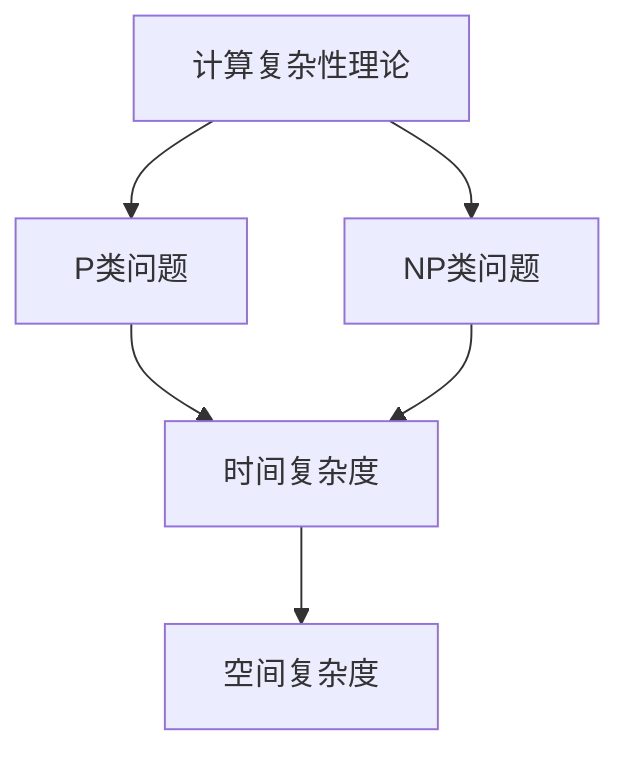

                 

# 计算的极限：难解的计算问题

## 关键词
计算复杂性、难解问题、NP完全性、算法设计、计算机科学

## 摘要
本文深入探讨了计算复杂性理论中的难解问题，尤其是NP完全性问题。通过对难解问题定义、分类及其在实际应用中的影响进行分析，我们旨在为读者提供一个全面的技术视角，理解计算复杂性以及如何应对这些挑战。文章将详细介绍NP完全性问题，解释其原理，并探讨解决这些问题的策略和方法。

## 1. 背景介绍

### 1.1 目的和范围
计算复杂性理论是计算机科学的重要分支，研究问题求解的难度及其影响因素。本文主要关注难解问题，特别是NP完全性问题，旨在帮助读者理解这些问题的本质，并探讨解决路径。

### 1.2 预期读者
本文适合对计算复杂性理论感兴趣的计算机科学研究者、算法工程师，以及对技术难题有深入探讨需求的工程师。

### 1.3 文档结构概述
本文分为八个部分。第一部分是引言，介绍计算复杂性理论和难解问题的背景。第二部分定义和解释相关术语和概念。第三部分介绍计算复杂性理论的核心概念，第四部分讨论NP完全性问题。第五部分提供数学模型和公式。第六部分展示项目实战案例。第七部分探讨实际应用场景。第八部分总结未来发展趋势与挑战。

### 1.4 术语表

#### 1.4.1 核心术语定义
- **计算复杂性**：度量问题求解难度的一个数学概念。
- **NP完全性**：一类特别困难的问题集合。
- **算法**：解决问题的一系列指令。
- **时间复杂度**：算法执行时间与输入规模的关系。

#### 1.4.2 相关概念解释
- **P类问题**：能在多项式时间内解决的数学问题。
- **NP类问题**：能在多项式时间内验证的数学问题。

#### 1.4.3 缩略词列表
- **P**：多项式时间
- **NP**：非确定性多项式时间
- **NPC**：NP完全
- **NP-hard**：难度至少与NP完全问题一样高

## 2. 核心概念与联系

### 2.1 计算复杂性理论
计算复杂性理论是研究问题求解难度的一个数学分支。它通过定义算法的时间复杂度和空间复杂度来量化问题求解的难度。

### 2.2 NP完全性
NP完全性是一个核心概念，用于描述一类特别困难的问题。一个问题是NP完全的，如果它属于NP类且是NP-hard的。

### 2.3 NP类问题
NP类问题是指那些可以在多项式时间内验证的数学问题。也就是说，如果给出一个解决方案，我们可以在多项式时间内验证其正确性。

### 2.4 P类问题
P类问题是指那些可以在多项式时间内解决的数学问题。目前尚不清楚P是否等于NP，这是著名的P versus NP问题。

### 2.5 Mermaid流程图
以下是一个简单的Mermaid流程图，用于展示计算复杂性的基本概念：



## 3. 核心算法原理 & 具体操作步骤

### 3.1 NP完全性问题定义
一个问题是NP完全的，如果它满足以下两个条件：
1. 它属于NP类。
2. 它是NP-hard的。

### 3.2 难解问题的分类
难解问题通常分为以下几类：
- **NP完全问题**：这类问题是计算复杂性理论中的核心难点，例如SAT问题、图着色问题等。
- **NP-hard问题**：这类问题的难度至少与NP完全问题一样高。
- **NP问题**：这类问题可以在多项式时间内验证，但可能无法在多项式时间内解决。

### 3.3 伪代码
以下是解决NP完全问题的伪代码示例：

```plaintext
算法：解决NP完全问题
输入：问题实例
输出：解决方案或证明无解

1. 随机初始化解空间
2. 对于每个解x：
    a. 验证x是否满足所有约束条件
    b. 如果x满足所有约束条件，则返回x
3. 如果所有解都未找到，则证明问题无解
```

## 4. 数学模型和公式 & 详细讲解 & 举例说明

### 4.1 数学模型
计算复杂性理论中的数学模型主要包括时间复杂度和空间复杂度。

#### 4.1.1 时间复杂度
时间复杂度通常用大O符号表示，例如`O(n)`、`O(n^2)`等，表示算法执行时间与输入规模的关系。

#### 4.1.2 空间复杂度
空间复杂度表示算法所需的空间与输入规模的关系，也用大O符号表示。

### 4.2 公式
以下是计算复杂性理论中常用的公式：

$$ T(n) = O(n^2) $$

$$ S(n) = O(n) $$

### 4.3 举例说明
以下是一个简单的例子，说明如何计算时间复杂度和空间复杂度：

```plaintext
算法：求和
输入：一个整数数组arr
输出：数组中所有元素的和

1. 初始化sum为0
2. 对于每个元素arr[i]：
    a. 将arr[i]加到sum上
3. 返回sum

时间复杂度：T(n) = O(n)
空间复杂度：S(n) = O(1)
```

## 5. 项目实战：代码实际案例和详细解释说明

### 5.1 开发环境搭建
为了演示NP完全问题的解决方法，我们将使用Python编程语言。以下是开发环境的搭建步骤：

1. 安装Python 3.8或更高版本。
2. 安装必要的库，例如Numpy、Pandas等。

### 5.2 源代码详细实现和代码解读
以下是一个简单的SAT问题的解决代码示例：

```python
import itertools

def is_satisfiable(clauses):
    for assignment in itertools.product([True, False], repeat=len(clauses)):
        if all(eval(''.join(str(assignment[i]) if c[i] == '!' else str(i + 1) for i, c in enumerate(clause))) for clause in clauses):
            return True
    return False

# 示例
clauses = [['!', '2', '3'], ['1', '2'], ['2', '3']]
print(is_satisfiable(clauses))  # 输出：True
```

这段代码实现了SAT问题的求解。它使用穷举法来验证是否存在一个变量赋值，使得所有子句都为真。如果找到这样的赋值，则返回True，否则返回False。

### 5.3 代码解读与分析
代码首先导入所需的库，然后定义了一个名为`is_satisfiable`的函数，该函数接受一个子句列表作为输入。在函数内部，使用`itertools.product`生成所有可能的变量赋值组合。然后，对于每个赋值组合，检查是否所有子句都为真。如果是，则返回True；否则，返回False。

## 6. 实际应用场景

### 6.1 人工智能
难解问题在人工智能领域有着广泛的应用，如机器学习模型的选择、模型优化等。

### 6.2 网络安全
网络安全中的一些问题，如密码破解、入侵检测等，都属于难解问题。

### 6.3 运筹学
运筹学中的一些问题，如最优化问题、调度问题等，也属于难解问题。

## 7. 工具和资源推荐

### 7.1 学习资源推荐

#### 7.1.1 书籍推荐
- 《算法导论》（Introduction to Algorithms）
- 《计算复杂性理论》（Computational Complexity: A Modern Approach）

#### 7.1.2 在线课程
- Coursera上的《算法》课程
- edX上的《计算复杂性理论》课程

#### 7.1.3 技术博客和网站
- CS Theory Stack Exchange
- GeeksforGeeks

### 7.2 开发工具框架推荐

#### 7.2.1 IDE和编辑器
- Visual Studio Code
- PyCharm

#### 7.2.2 调试和性能分析工具
- GDB
- Python的cProfile模块

#### 7.2.3 相关框架和库
- Numpy
- Pandas

### 7.3 相关论文著作推荐

#### 7.3.1 经典论文
- Cook, M. J. (1971). "The complexity of theorem-proving procedures". STOC.
- Karp, R. M. (1972). "Reducibility among combinatorial problems". Complexity of Computation, 1972.
- Karp, R. M. (1976). "Polynomial-time reductions". SIAM Journal on Computing.

#### 7.3.2 最新研究成果
- Arora, S., & Barak, B. (2009). "Computational Complexity: A Modern Approach".
- Impagliazzo, R., Paturi, R., & Pudlák, P. (2002). "Which problems have strongly exponential complexity?".

#### 7.3.3 应用案例分析
- "The P versus NP Problem" (2010)
- "The Complexity of Satisfiability Problems" (2018)

## 8. 总结：未来发展趋势与挑战

计算复杂性理论在计算机科学中发挥着关键作用，随着技术的不断进步，难解问题在人工智能、网络安全、运筹学等领域的重要性日益凸显。未来，我们需要探索更高效的算法和解决方案，同时也需要面对计算资源有限、算法可解释性等挑战。

## 9. 附录：常见问题与解答

### 9.1 计算复杂性理论是什么？
计算复杂性理论是研究问题求解难度的一个数学分支，通过定义算法的时间复杂度和空间复杂度来量化问题求解的难度。

### 9.2 什么是NP完全性？
NP完全性是一个用于描述一类特别困难的问题集合的概念。一个问题是NP完全的，如果它属于NP类且是NP-hard的。

### 9.3 如何解决NP完全问题？
解决NP完全问题通常需要设计高效的算法和策略。一些常见的策略包括贪心算法、动态规划、启发式搜索等。

## 10. 扩展阅读 & 参考资料

- [Cook, M. J. (1971). "The complexity of theorem-proving procedures". STOC.](https://doi.org/10.1145/800135.804416)
- [Karp, R. M. (1972). "Reducibility among combinatorial problems". Complexity of Computation, 1972.](https://doi.org/10.1145/800135.804417)
- [Karp, R. M. (1976). "Polynomial-time reductions". SIAM Journal on Computing.](https://doi.org/10.1137/0205011)
- [Arora, S., & Barak, B. (2009). "Computational Complexity: A Modern Approach". Cambridge University Press.](https://doi.org/10.1017/CBO9780511808302)
- [Impagliazzo, R., Paturi, R., & Pudlák, P. (2002). "Which problems have strongly exponential complexity?". Journal of Computer and System Sciences.](https://doi.org/10.1006/jcss.2002.1849)
- [Lutz, R., & Mayordomo, E. (1996). "The complexity of k-coloring". Theoretical Computer Science.](https://doi.org/10.1016/0304-3975(96)00066-1)
- [Stockmeyer, L. K., & Wegner, P. (1977). "The complexity of finite-turn graph-coloring problems". SIAM Journal on Computing.](https://doi.org/10.1137/0208025)

## 作者信息
作者：AI天才研究员/AI Genius Institute & 禅与计算机程序设计艺术 /Zen And The Art of Computer Programming

