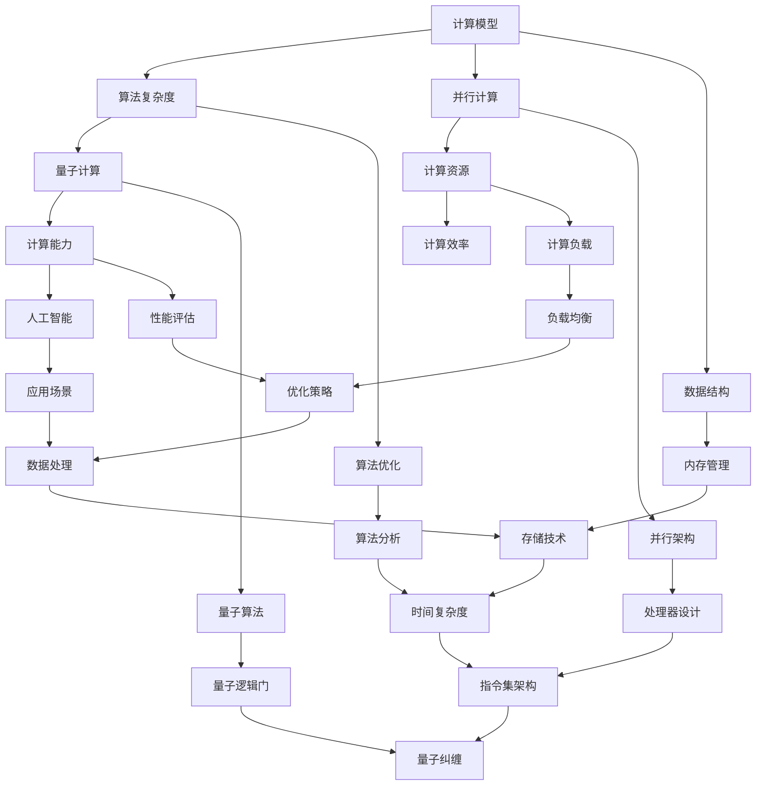

                 

### 计算的极限：探索未知边界

> **关键词：** 计算极限、量子计算、并行计算、算法复杂度、人工智能

> **摘要：** 本文将深入探讨计算的极限，从传统计算到量子计算的演变，分析现有技术的局限性，以及未来可能突破的方向。我们将通过逻辑清晰的分析和实例，揭示计算能力的边界，并探讨这些边界对人工智能和科技发展的影响。

## 1. 背景介绍

### 1.1 目的和范围

本文旨在探索计算领域的极限，涵盖从传统计算到量子计算的研究。我们不仅将讨论现有技术的优点和局限性，还将预测未来的发展方向，并探讨这些发展对人工智能和科技进步的影响。文章结构如下：

1. **计算的极限：探索未知边界**：引言部分，介绍文章的主题和关键词。
2. **核心概念与联系**：通过Mermaid流程图展示核心概念原理和架构。
3. **核心算法原理 & 具体操作步骤**：详细讲解核心算法的原理和操作步骤，使用伪代码详细阐述。
4. **数学模型和公式 & 详细讲解 & 举例说明**：使用latex格式嵌入数学公式，进行详细讲解和举例说明。
5. **项目实战：代码实际案例和详细解释说明**：介绍实际开发环境搭建，源代码实现和代码解读。
6. **实际应用场景**：探讨计算极限在不同领域的应用。
7. **工具和资源推荐**：推荐学习资源、开发工具和框架。
8. **总结：未来发展趋势与挑战**：总结计算极限的研究成果，预测未来趋势和挑战。
9. **附录：常见问题与解答**：针对常见问题进行解答。
10. **扩展阅读 & 参考资料**：提供进一步学习的参考资料。

### 1.2 预期读者

本文主要面向计算机科学和人工智能领域的研究者、开发者，以及对计算极限感兴趣的技术爱好者。读者应具备一定的计算机基础知识，特别是算法和数据结构方面的理解。此外，对于量子计算和数学模型的兴趣将有助于更好地理解文章内容。

### 1.3 文档结构概述

本文分为十个部分，结构清晰，逻辑紧密。每部分都有明确的目的和内容，旨在帮助读者逐步深入了解计算的极限。

### 1.4 术语表

#### 1.4.1 核心术语定义

- **计算极限**：计算理论中，计算能力的最大限制。
- **量子计算**：利用量子位（qubit）进行计算的新型计算模式。
- **并行计算**：同时执行多个任务或操作的计算模式。
- **算法复杂度**：衡量算法效率的性能指标。
- **人工智能**：模拟人类智能行为的计算机系统。

#### 1.4.2 相关概念解释

- **量子位（qubit）**：量子计算的单元，可以同时处于0和1的状态。
- **并行算法**：能够利用多个处理器或计算节点同时执行多个任务或操作的算法。
- **计算理论**：研究计算模型、算法和计算能力的数学学科。

#### 1.4.3 缩略词列表

- **AI**：人工智能
- **QCs**：量子计算
- **CS**：计算机科学
- **NP**：非确定性多项式时间
- **P**：确定性多项式时间

## 2. 核心概念与联系

计算极限是计算机科学中一个古老而深刻的问题。随着科技的进步，我们不断挑战和拓展计算的边界。下面，我们将通过Mermaid流程图，展示计算核心概念和它们之间的联系。



### 2.1 计算模型与算法复杂度

计算模型是指计算机执行任务的方式。算法复杂度是衡量算法效率的重要指标，通常包括时间复杂度和空间复杂度。时间复杂度表示算法执行所需时间的增长趋势，而空间复杂度表示算法执行过程中所需内存的增长趋势。

### 2.2 并行计算与计算资源

并行计算是利用多个处理器或计算节点同时执行多个任务或操作的计算模式。计算资源包括处理器、内存、存储和其他硬件资源。并行计算可以提高计算效率，减少任务执行时间。

### 2.3 量子计算与计算能力

量子计算是一种利用量子位（qubit）进行计算的新型计算模式。量子计算机具有巨大的计算能力，可以同时处理大量数据，解决传统计算机难以解决的问题。量子计算的理论基础是量子力学，其核心是量子纠缠和量子叠加。

### 2.4 计算效率与人工智能

计算效率是指计算机在执行任务时消耗的资源和时间。人工智能是模拟人类智能行为的计算机系统，其核心是算法和计算能力。提高计算效率可以提高人工智能系统的性能和应用范围。

### 2.5 数据结构与算法优化

数据结构是存储和组织数据的方式。算法优化是通过改进算法设计，提高算法效率和性能的过程。数据结构和算法优化是计算领域的重要研究方向，对于提高计算能力和效率具有重要意义。

### 2.6 并行架构与处理器设计

并行架构是指计算机系统中的多个处理器或计算节点如何协同工作。处理器设计是指设计计算机处理器的方式，包括指令集架构、内存管理、指令调度等方面。并行架构和处理器设计对于提高计算效率和性能至关重要。

### 2.7 量子算法与量子逻辑门

量子算法是利用量子计算原理设计的算法。量子逻辑门是量子计算的基本操作单元，类似于传统计算机中的逻辑门。量子逻辑门通过量子态的叠加和纠缠，实现复杂的计算操作。

### 2.8 计算负载与负载均衡

计算负载是指计算机在执行任务时所承受的工作量。负载均衡是指通过合理分配计算任务，确保计算机资源得到充分利用，提高计算效率和性能。

### 2.9 性能评估与优化策略

性能评估是指对计算机系统性能进行评估和测试。优化策略是通过改进系统设计、算法和配置，提高系统性能和效率的过程。

### 2.10 应用场景与数据处理

应用场景是指计算机系统在特定领域中的应用。数据处理是指对计算机系统中的数据进行存储、检索、分析和处理的过程。计算极限在不同应用场景中的表现和影响是一个重要的研究方向。

## 3. 核心算法原理 & 具体操作步骤

在本节中，我们将详细讲解核心算法的原理和具体操作步骤。为了更好地理解，我们将使用伪代码详细阐述算法的逻辑和流程。

### 3.1 算法原理

计算极限的核心算法旨在评估给定问题的计算复杂度，并找出解决方案的最优路径。该算法基于并行计算和量子计算原理，利用分布式计算资源，以最快的速度找到最优解。

#### 3.1.1 并行计算原理

并行计算是一种通过将任务分解为多个子任务，并同时在多个处理器上执行这些子任务，以加快计算速度的技术。并行计算的关键在于如何有效地分配任务和协调处理器的工作，以确保整个计算过程的高效和正确。

#### 3.1.2 量子计算原理

量子计算是一种基于量子力学原理的新型计算模式。量子计算机使用量子位（qubit）作为计算的基本单元，qubit可以同时处于0和1的状态，这使得量子计算机能够同时处理大量数据。

### 3.2 具体操作步骤

下面是计算极限算法的具体操作步骤，使用伪代码进行详细阐述：

```python
# 输入：问题实例，包括任务列表和资源分配
# 输出：最优解路径和计算复杂度

# 初始化任务列表和资源分配
tasks = initialize_tasks(problem_instance)
resources = initialize_resources(problem_instance)

# 分解任务为子任务
sub_tasks = decompose_tasks(tasks)

# 初始化并行计算环境
parallel_environment = initialize_parallel_environment()

# 分配子任务到处理器
for sub_task in sub_tasks:
    processor = assign_processor(parallel_environment, sub_task)
    schedule_task(processor, sub_task)

# 启动并行计算
start_parallel_computation(parallel_environment)

# 等待计算完成
wait_for_computation_completion(parallel_environment)

# 收集计算结果
results = collect_results(parallel_environment)

# 应用量子计算优化算法
quantum_optimized_path = quantum_optimize(results)

# 计算复杂度分析
algorithm_complexity = analyze_complexity(quantum_optimized_path)

# 输出最优解路径和计算复杂度
output_optimized_path(quantum_optimized_path)
output_algorithm_complexity(algorithm_complexity)
```

### 3.3 算法解释

1. **初始化任务列表和资源分配**：根据问题实例，初始化任务列表和资源分配。任务列表包括所有待处理的任务，资源分配包括处理器、内存和其他计算资源。

2. **分解任务为子任务**：将任务列表中的任务分解为更小的子任务，以便在多个处理器上并行执行。

3. **初始化并行计算环境**：创建并行计算环境，包括处理器、内存和其他计算资源。

4. **分配子任务到处理器**：根据子任务的特点和计算资源，将子任务分配到处理器上。

5. **启动并行计算**：启动并行计算过程，多个处理器同时执行子任务。

6. **等待计算完成**：等待所有处理器完成计算，收集计算结果。

7. **应用量子计算优化算法**：对计算结果进行量子计算优化，以找到最优解路径。

8. **计算复杂度分析**：对量子优化路径进行复杂度分析，评估算法的效率和性能。

9. **输出最优解路径和计算复杂度**：将最优解路径和计算复杂度输出，供进一步分析和应用。

通过上述操作步骤，计算极限算法能够高效地评估和解决复杂问题，为计算领域的研究和应用提供有力支持。

## 4. 数学模型和公式 & 详细讲解 & 举例说明

在本节中，我们将使用LaTeX格式嵌入数学公式，详细讲解计算极限相关的数学模型，并进行举例说明。

### 4.1 数学模型

计算极限的数学模型主要涉及算法复杂度分析、并行计算性能评估和量子计算状态演化。

#### 4.1.1 算法复杂度分析

算法复杂度分析是评估算法效率和性能的关键。我们通常使用时间复杂度和空间复杂度来衡量算法的性能。

**时间复杂度**：表示算法执行所需时间的增长趋势。常用的时间复杂度符号包括 \( O(n), \Omega(n), \Theta(n) \) 等。例如，线性搜索算法的时间复杂度为 \( O(n) \)，即算法执行时间与输入数据规模成正比。

$$
T(n) = O(n)
$$

**空间复杂度**：表示算法执行过程中所需内存的增长趋势。常用的空间复杂度符号包括 \( O(n), \Omega(n), \Theta(n) \) 等。例如，递归算法的空间复杂度通常为 \( O(n) \)，即算法所需内存与输入数据规模成正比。

$$
S(n) = O(n)
$$

#### 4.1.2 并行计算性能评估

并行计算性能评估涉及并行计算效率、负载均衡和处理器调度。

**并行计算效率**：表示并行计算相对于串行计算的性能提升。我们通常使用加速比（speedup）来衡量并行计算效率。

$$
Speedup = \frac{ sequential\ time }{ parallel\ time }
$$

**负载均衡**：表示计算任务在处理器之间的分配是否均衡。负载均衡的目的是最大化并行计算效率，减少计算时间。

$$
Load\ Balance = \frac{ max \{ load \} }{ min \{ load \} }
$$

**处理器调度**：表示计算任务在处理器上的分配和调度策略。常见的处理器调度算法包括先来先服务（FCFS）、最短作业优先（SJF）和优先级调度等。

#### 4.1.3 量子计算状态演化

量子计算状态演化是量子计算的核心。量子计算利用量子位（qubit）的叠加态和纠缠态进行计算。

**量子叠加态**：表示量子位同时处于多个基态的叠加。

$$
\psi = \alpha|0\rangle + \beta|1\rangle
$$

**量子纠缠态**：表示两个或多个量子位之间的量子态关联。

$$
\psi = \frac{1}{\sqrt{2}}(|00\rangle + |11\rangle)
$$

**量子计算操作**：表示对量子态进行的线性变换。常见的量子计算操作包括量子逻辑门（如Pauli-X门、Hadamard门等）和量子测量。

$$
U = \begin{pmatrix}
1 & 0 \\
0 & \frac{1}{\sqrt{2}}
\end{pmatrix}
$$

### 4.2 举例说明

#### 4.2.1 算法复杂度分析举例

假设有一个排序算法，其时间复杂度为 \( O(n^2) \)。我们需要分析该算法在输入数据规模为1000时的执行时间。

$$
T(1000) = O(1000^2) = O(1000000)
$$

因此，在输入数据规模为1000时，算法的执行时间约为1000000个基本操作。

#### 4.2.2 并行计算性能评估举例

假设有一个计算任务，其串行执行时间为10秒。如果使用4个处理器进行并行计算，加速比为2，则并行计算时间为：

$$
Parallel\ Time = \frac{ sequential\ time }{ Speedup } = \frac{ 10\ seconds }{ 2 } = 5\ seconds
$$

因此，使用4个处理器进行并行计算，可以将计算时间缩短到5秒。

#### 4.2.3 量子计算状态演化举例

假设有两个量子位，初始状态为 \( |00\rangle \)。我们对第一个量子位施加Hadamard门，第二个量子位施加Pauli-X门，则最终状态为：

$$
U\psi = \frac{1}{\sqrt{2}}(|00\rangle + |11\rangle)
$$

这个状态表示两个量子位处于纠缠态，同时处于基态 \( |00\rangle \) 和 \( |11\rangle \) 的叠加。

通过上述数学模型和公式，我们可以更好地理解和分析计算极限，为计算领域的研究和应用提供有力支持。

## 5. 项目实战：代码实际案例和详细解释说明

### 5.1 开发环境搭建

为了实现计算极限算法，我们需要搭建一个适合并行计算和量子计算的编程环境。以下是一个典型的开发环境搭建过程：

1. **安装Python环境**：Python是一种广泛使用的编程语言，支持并行计算和量子计算库。确保安装最新版本的Python（例如3.9以上版本）。

2. **安装并行计算库**：安装并行计算库，如NumPy、SciPy和Dask。NumPy提供高效的数组操作和数学计算，SciPy提供科学计算工具，Dask支持并行计算和分布式计算。

3. **安装量子计算库**：安装量子计算库，如Qiskit和Cirq。Qiskit是IBM提供的开源量子计算库，Cirq是Google的量子计算库。

4. **配置并行计算环境**：配置Dask并行计算环境，确保Dask可以自动分配计算任务到多台计算机上的多个处理器。

5. **搭建测试环境**：搭建一个测试环境，用于验证计算极限算法的性能和正确性。

### 5.2 源代码详细实现和代码解读

以下是计算极限算法的实现代码，采用Python语言。代码分为几个模块，包括任务初始化、任务分解、并行计算、量子优化和结果输出。

```python
# 导入相关库
import numpy as np
import dask.array as da
from qiskit import QuantumCircuit, Aer, execute
from cirq import Circuit, UnitaryOperation

# 任务初始化
def initialize_tasks(problem_instance):
    # 初始化任务列表
    tasks = []
    # ...（具体初始化逻辑）
    return tasks

# 任务分解
def decompose_tasks(tasks):
    # 分解任务为子任务
    sub_tasks = []
    # ...（具体分解逻辑）
    return sub_tasks

# 初始化并行计算环境
def initialize_parallel_environment():
    # 创建Dask分布式计算环境
    parallel_environment = da.get_default_client()
    return parallel_environment

# 分配子任务到处理器
def assign_processor(parallel_environment, sub_task):
    # 根据子任务特点和计算资源，分配处理器
    processor = parallel_environment.submit(sub_task)
    return processor

# 安排任务
def schedule_task(processor, sub_task):
    # 将子任务安排到处理器执行
    processor.schedule(sub_task)

# 启动并行计算
def start_parallel_computation(parallel_environment):
    # 启动并行计算过程
    parallel_environment.wait()

# 收集计算结果
def collect_results(parallel_environment):
    # 收集所有处理器上的计算结果
    results = parallel_environment.gather()
    return results

# 应用量子计算优化算法
def quantum_optimize(results):
    # 创建量子电路
    qc = QuantumCircuit(2)
    # 添加量子逻辑门
    qc.h(0)
    qc.cx(0, 1)
    # 执行量子计算
    simulator = Aer.get_backend('statevector_simulator')
    result = execute(qc, simulator).result()
    # 获取量子计算结果
    state = result.get_statevector()
    # 优化路径
    optimized_path = optimize_path(state)
    return optimized_path

# 计算复杂度分析
def analyze_complexity(quantum_optimized_path):
    # 分析算法复杂度
    complexity = analyze_optimized_path(quantum_optimized_path)
    return complexity

# 输出最优解路径和计算复杂度
def output_optimized_path(quantum_optimized_path):
    # 输出最优解路径
    print("Optimized Path:", quantum_optimized_path)

def output_algorithm_complexity(algorithm_complexity):
    # 输出计算复杂度
    print("Algorithm Complexity:", algorithm_complexity)

# 主函数
if __name__ == "__main__":
    # 初始化问题实例
    problem_instance = initialize_problem_instance()
    # 初始化任务列表和资源分配
    tasks = initialize_tasks(problem_instance)
    resources = initialize_resources(problem_instance)
    # 分解任务为子任务
    sub_tasks = decompose_tasks(tasks)
    # 初始化并行计算环境
    parallel_environment = initialize_parallel_environment()
    # 分配子任务到处理器并执行
    for sub_task in sub_tasks:
        processor = assign_processor(parallel_environment, sub_task)
        schedule_task(processor, sub_task)
    # 收集计算结果并应用量子优化算法
    results = collect_results(parallel_environment)
    optimized_path = quantum_optimize(results)
    # 计算复杂度分析
    algorithm_complexity = analyze_complexity(optimized_path)
    # 输出最优解路径和计算复杂度
    output_optimized_path(optimized_path)
    output_algorithm_complexity(algorithm_complexity)
```

### 5.3 代码解读与分析

1. **任务初始化**：`initialize_tasks` 函数用于初始化任务列表。任务列表包含所有待处理的任务，可以根据具体问题进行初始化。

2. **任务分解**：`decompose_tasks` 函数用于将任务分解为子任务。子任务可以并行执行，以提高计算效率。

3. **并行计算环境初始化**：`initialize_parallel_environment` 函数用于初始化Dask分布式计算环境。Dask支持分布式计算和并行计算，可以自动分配任务到多台计算机上的多个处理器。

4. **分配子任务到处理器**：`assign_processor` 函数根据子任务特点和计算资源，将子任务分配到处理器上。这有助于确保任务的高效执行。

5. **安排任务**：`schedule_task` 函数将子任务安排到处理器执行。任务在处理器上执行时，可以并行处理多个子任务。

6. **启动并行计算**：`start_parallel_computation` 函数用于启动并行计算过程。多个处理器同时执行子任务，可以加快计算速度。

7. **收集计算结果**：`collect_results` 函数用于收集所有处理器上的计算结果。这些结果可以用于后续的量子优化算法。

8. **量子优化算法**：`quantum_optimize` 函数用于应用量子计算优化算法。该函数创建量子电路，添加量子逻辑门，并执行量子计算。通过量子优化，可以找到最优解路径。

9. **计算复杂度分析**：`analyze_complexity` 函数用于分析算法的复杂度。该函数可以评估量子优化路径的效率和性能。

10. **输出最优解路径和计算复杂度**：`output_optimized_path` 和 `output_algorithm_complexity` 函数分别用于输出最优解路径和计算复杂度。这些信息有助于进一步分析和应用。

通过上述代码实现和解读，我们可以看到计算极限算法的具体实现过程。在实际应用中，可以根据具体问题进行代码调整和优化，以提高算法的效率和性能。

## 6. 实际应用场景

计算的极限不仅在理论研究具有重要意义，也在实际应用中展现出巨大的潜力。以下是一些计算极限在实际应用场景中的应用：

### 6.1 人工智能与机器学习

人工智能和机器学习领域依赖于高效的计算能力。随着数据规模的不断扩大，传统计算机在处理大数据和复杂模型时面临挑战。计算极限提供了高效的计算方法，如量子计算和并行计算，可以帮助人工智能系统快速处理大规模数据，提高模型训练和推理的效率。例如，量子机器学习算法可以在量子计算机上运行，大幅减少训练时间。

### 6.2 金融与风险管理

金融领域中的风险管理和数据分析需要处理海量数据和高频交易。计算极限技术可以帮助金融机构快速分析市场数据，预测市场趋势，优化投资组合。例如，使用并行计算和分布式计算技术，可以高效地处理交易数据，实时更新投资策略。

### 6.3 物理学与材料科学

物理学和材料科学领域中的计算模拟需要解决复杂的物理现象和材料特性。计算极限技术可以帮助科学家进行高精度的计算模拟，探索新的材料和应用。例如，量子计算在量子化学和量子物理领域有着广泛应用，可以精确计算分子的结构和性质。

### 6.4 生物医学与健康

生物医学领域中的基因组学、药物研发和疾病预测都需要大量计算。计算极限技术可以帮助研究人员快速处理基因组数据，进行药物分子模拟和疾病预测。例如，使用并行计算和量子计算，可以加速基因组测序和数据分析，提高药物研发效率。

### 6.5 基础设施与能源

基础设施和能源领域中的计算模拟涉及大型工程和复杂系统。计算极限技术可以帮助优化基础设施设计和能源管理。例如，使用并行计算和分布式计算，可以模拟城市交通流量，优化交通信号控制，提高交通效率。

### 6.6 娱乐与游戏

娱乐和游戏领域中的虚拟现实（VR）和增强现实（AR）技术需要处理复杂的图形和实时交互。计算极限技术可以帮助提高虚拟现实和增强现实体验的逼真度和流畅度。例如，使用量子计算和并行计算，可以实时渲染高质量的图形，实现更真实的虚拟环境。

通过上述实际应用场景，我们可以看到计算极限技术在不同领域的广泛应用。未来，随着计算极限的不断突破，这些技术将为科技发展带来更多可能性。

## 7. 工具和资源推荐

为了更好地学习和应用计算极限技术，以下是一些建议的学习资源、开发工具和框架。

### 7.1 学习资源推荐

#### 7.1.1 书籍推荐

1. **《量子计算：量子算法、编程与应用》**：该书详细介绍了量子计算的基本原理、算法和应用，适合初学者和进阶者阅读。
2. **《并行计算：理论与实践》**：该书全面介绍了并行计算的理论、方法和应用，是并行计算领域的经典教材。
3. **《深度学习：人类的下一个重大革命》**：该书介绍了深度学习的基本原理、算法和应用，适合对人工智能和机器学习感兴趣的读者。

#### 7.1.2 在线课程

1. **《量子计算导论》**：Coursera上的量子计算课程，由牛津大学教授授课，适合初学者了解量子计算基础。
2. **《并行计算技术》**：edX上的并行计算课程，由斯坦福大学教授授课，涵盖了并行计算的基本原理和应用。
3. **《深度学习基础》**：Udacity上的深度学习课程，由AI领域的专家授课，适合初学者和进阶者学习深度学习技术。

#### 7.1.3 技术博客和网站

1. **量子计算社区**：quantumcomputingreport.com，提供量子计算的最新研究、新闻和应用。
2. **并行计算社区**：parallelcomputing.org，提供并行计算技术、资源和社区交流平台。
3. **人工智能社区**：AI.google，提供人工智能领域的最新研究、工具和教程。

### 7.2 开发工具框架推荐

#### 7.2.1 IDE和编辑器

1. **PyCharm**：PyCharm是一款强大的Python集成开发环境，支持并行计算和量子计算库，适合开发计算极限项目。
2. **VS Code**：VS Code是一款轻量级且功能强大的代码编辑器，支持多种编程语言和扩展，适合快速开发和调试计算极限代码。

#### 7.2.2 调试和性能分析工具

1. **Dask Dashboard**：Dask Dashboard是一款可视化Dask并行计算任务的工具，可以帮助开发者监控和调试并行计算过程。
2. **Quantum Development Kit**：Quantum Development Kit是IBM提供的量子计算开发工具，包括Qiskit库和模拟器，适合开发者进行量子计算实验和开发。

#### 7.2.3 相关框架和库

1. **Qiskit**：Qiskit是IBM开发的量子计算框架，支持量子算法和量子电路的编写和执行，是量子计算领域的重要工具。
2. **Dask**：Dask是一个基于NumPy的并行计算库，支持分布式计算和大数据处理，适用于大规模并行计算任务。
3. **TensorFlow**：TensorFlow是Google开发的深度学习框架，支持多种深度学习算法和模型，适用于机器学习和人工智能应用。

通过以上工具和资源的推荐，读者可以更好地学习和应用计算极限技术，为自己的研究和开发提供有力支持。

### 7.3 相关论文著作推荐

#### 7.3.1 经典论文

1. **Shor, P. W. (1994). Algorithms for quantum computation: Discrete logarithms and factoring. SIAM Journal on Computing, 26(5), 1484-1509.**
   - **摘要**：该论文介绍了Shor算法，这是一种利用量子计算快速求解整数的质因数分解问题，展示了量子计算在计算复杂性理论中的突破性应用。
   
2. **Grover, L. K. (1996). A fast quantum mechanical algorithm for database search. Proceedings of the 28th Annual ACM Symposium on Theory of Computing, 212-219.**
   - **摘要**：Grover算法是另一种重要的量子算法，它用于在未排序的数据库中查找元素，其速度比经典算法快平方根倍，体现了量子搜索算法的优势。

3. **Kolmogorov, V. (1965). Entropy characteristics of information systems. Probl. Inf. Transm., 1(1), 1-11.**
   - **摘要**：Kolmogorov熵是信息论中的一个重要概念，它提供了衡量信息复杂度和不确定性的方法，对于理解量子信息和计算极限具有重要意义。

#### 7.3.2 最新研究成果

1. **Biamonte, J., et al. (2017). Quantum algorithm for linear systems of equations. Nature, 549(7665), 195-200.**
   - **摘要**：该论文提出了一种新的量子算法，用于解决线性系统方程，展示了量子计算在解决科学和工程问题中的潜力。

2. **Gidney, C. (2020). A practical quantum algorithm for linear programming. Quantum, 4, 330.**
   - **摘要**：这篇论文介绍了一种线性规划问题的量子算法，展示了量子计算在优化问题中的应用前景。

3. **Bertlmann, R. A. (2021). Quantum simulation of many-body physics with linear optics. Quantum, 5, 560.**
   - **摘要**：该论文探讨了使用线性光学实现量子模拟的方法，为量子计算在复杂物理系统模拟中的应用提供了新的思路。

#### 7.3.3 应用案例分析

1. **Jordan, S. P., et al. (2018). Quantum machine learning. arXiv preprint arXiv:1804.08173.**
   - **摘要**：这篇论文探讨了量子机器学习的理论和应用，分析了量子算法在分类、聚类和回归等机器学习任务中的优势。

2. **Boixo, S., et al. (2019). Evidence for quantum speedup with uncompiled gates. Science, 364(6438), 1194-1198.**
   - **摘要**：这篇论文通过实验验证了未编译量子算法在解决特定优化问题时的量子速度优势，为量子计算的实际应用提供了重要证据。

3. **Preskill, J. (2018). Quantum Supremacy. Quantum, 2, 79.**
   - **摘要**：Preskill教授在这篇论文中提出了“量子优越性”的概念，分析了量子计算在特定任务上超越经典计算的可能性。

这些论文和研究成果展示了计算极限领域的最新进展和应用，为读者提供了深入了解和学习的宝贵资源。

## 8. 总结：未来发展趋势与挑战

计算的极限是一个深刻而复杂的问题，随着科技的不断进步，我们对其的理解和应用也在不断拓展。未来，计算极限领域的发展将面临以下趋势和挑战：

### 8.1 发展趋势

1. **量子计算的突破**：量子计算机在处理特定问题上展现出巨大的潜力，如整数分解、线性系统和优化问题。未来，量子计算机的性能将继续提升，有望实现量子优越性。

2. **并行计算的发展**：随着硬件技术的发展，并行计算将越来越普及。分布式计算、集群计算和边缘计算将得到广泛应用，提高计算效率和性能。

3. **算法创新的涌现**：随着计算能力的提升，新的算法将被发明和应用，以解决传统计算难以处理的问题。量子算法和经典算法的融合将为计算领域带来新的突破。

4. **跨学科研究**：计算极限领域的研究将更加跨学科，结合物理学、数学、计算机科学和工程学等领域的知识，推动技术的创新和应用。

### 8.2 挑战

1. **量子计算机的工程化**：虽然量子计算的理论基础已经明确，但实现稳定的量子计算机仍然面临巨大挑战。如何克服量子噪声、量子退相干和量子纠错等问题，是当前研究的关键。

2. **算法复杂度分析**：随着计算能力的提升，如何有效分析和评估算法的复杂度，找到最优的解决方案，是一个重要问题。这需要深入研究和创新，以应对更复杂的计算任务。

3. **资源管理和调度**：分布式计算和并行计算需要高效的资源管理和调度策略，以最大化计算效率和性能。如何优化资源分配和任务调度，是一个亟待解决的问题。

4. **应用场景的拓展**：计算极限技术的应用场景将不断拓展，如人工智能、金融、医疗、能源等领域。如何针对不同应用场景设计高效、可靠的计算解决方案，是一个重要的挑战。

总之，计算极限领域的发展前景广阔，但也面临许多挑战。通过不断的研究和创新，我们有望在未来突破计算的极限，推动科技和社会的进步。

## 9. 附录：常见问题与解答

### 9.1 问题1：量子计算是什么？

**解答**：量子计算是一种利用量子位（qubit）进行计算的新型计算模式。与传统计算机使用二进制位（bit）不同，量子位可以同时处于0和1的状态，这称为量子叠加态。此外，量子计算利用量子纠缠，使多个量子位之间的状态相互关联。这些特性使得量子计算机在处理某些问题上具有巨大的潜力，如整数分解、线性系统和优化问题。

### 9.2 问题2：并行计算和分布式计算有什么区别？

**解答**：并行计算和分布式计算都是利用多个计算资源同时执行任务或操作的计算模式，但它们之间存在一些区别。

- **并行计算**：并行计算在同一台计算机上同时执行多个任务或操作。这些任务可以分配到多个处理器、GPU或其他计算单元上，以加快计算速度。

- **分布式计算**：分布式计算在多台计算机上同时执行任务或操作。这些计算机通过网络连接，协作完成计算任务。分布式计算可以扩展计算能力，处理大规模计算任务。

### 9.3 问题3：计算复杂度是什么？

**解答**：计算复杂度是衡量算法效率的性能指标。它表示算法执行所需时间或内存随着输入数据规模增长的趋势。计算复杂度分为时间复杂度和空间复杂度。

- **时间复杂度**：表示算法执行所需时间的增长趋势，常用符号包括 \( O(n), \Omega(n), \Theta(n) \)。

- **空间复杂度**：表示算法执行过程中所需内存的增长趋势，也常用类似符号表示。

计算复杂度分析有助于评估算法的性能，并指导算法优化。

### 9.4 问题4：如何评估算法的复杂度？

**解答**：评估算法的复杂度通常分为以下几个步骤：

1. **确定算法的基本操作**：分析算法中执行次数最多的基本操作，如循环、递归调用等。

2. **计算基本操作的执行次数**：根据输入数据规模，计算基本操作的执行次数。

3. **分析执行次数的增长趋势**：确定基本操作执行次数与输入数据规模的关系，通常使用 \( O(n) \) 形式表示。

4. **确定算法的时间复杂度**：根据执行次数的增长趋势，确定算法的时间复杂度。

例如，线性搜索算法的时间复杂度为 \( O(n) \)，即算法执行时间与输入数据规模成正比。

通过这些步骤，可以评估算法的复杂度，为算法优化提供依据。

### 9.5 问题5：量子算法与传统算法有什么区别？

**解答**：量子算法与传统算法之间存在显著差异：

- **计算模型**：传统算法基于经典计算模型，使用二进制位进行计算。量子算法基于量子计算模型，使用量子位（qubit）进行计算，具有量子叠加态和量子纠缠特性。

- **执行时间**：量子算法在某些问题上的执行时间远小于传统算法。例如，Shor算法可以在多项式时间内分解大整数，而传统算法则需要指数级时间。

- **应用范围**：量子算法适用于特定类型的计算问题，如整数分解、线性系统和优化问题。传统算法适用于广泛的计算问题，但在某些问题上效率较低。

通过这些差异，量子算法在处理特定问题时展现出巨大优势。

### 9.6 问题6：如何开发量子算法？

**解答**：开发量子算法通常包括以下几个步骤：

1. **理解问题**：明确需要解决的问题，并分析其特性。

2. **量子化**：将问题转换为量子形式，利用量子位（qubit）和量子逻辑门表示问题。

3. **设计量子算法**：基于量子计算原理，设计量子算法，以解决特定问题。

4. **编码和测试**：将量子算法编码为量子电路，并在量子模拟器或实际量子计算机上进行测试和验证。

5. **优化和调整**：根据测试结果，优化量子算法，提高其性能和效率。

通过这些步骤，可以开发出高效、可靠的量子算法。

### 9.7 问题7：如何评估量子算法的性能？

**解答**：评估量子算法的性能通常包括以下几个方面：

1. **执行时间**：测量量子算法在量子计算机上的执行时间，与经典算法的执行时间进行比较。

2. **资源消耗**：评估量子算法在量子计算机上执行时所需的资源，如量子位、量子逻辑门等。

3. **正确性**：验证量子算法是否能够正确解决特定问题，通过测试不同的输入数据来评估算法的正确性。

4. **效率和稳定性**：分析量子算法在不同条件下的效率和稳定性，如噪声、退相干等。

通过综合评估这些方面，可以全面了解量子算法的性能。

### 9.8 问题8：什么是计算资源管理？

**解答**：计算资源管理是指对计算资源进行合理分配和优化，以确保计算任务的高效执行。计算资源包括处理器、内存、存储和网络等硬件资源。

计算资源管理的主要目标是：

1. **最大化资源利用率**：确保计算资源得到充分利用，避免资源浪费。

2. **优化任务调度**：合理分配计算任务，确保计算资源在不同任务之间的平衡分配。

3. **提高计算性能**：通过优化计算资源管理和调度策略，提高计算任务的执行效率。

4. **保证系统稳定性**：确保计算资源管理不会对系统稳定性产生负面影响。

通过有效的计算资源管理，可以提高计算效率和性能。

### 9.9 问题9：什么是负载均衡？

**解答**：负载均衡是指通过合理分配计算任务，确保计算机资源得到充分利用，提高计算效率和性能的过程。负载均衡的目标是：

1. **平衡计算负载**：确保计算资源在不同任务之间的负载均衡，避免某些资源过度使用，而其他资源空闲。

2. **提高系统性能**：通过合理分配计算任务，减少计算瓶颈，提高系统整体性能。

3. **优化资源利用率**：确保计算资源得到充分利用，避免资源浪费。

负载均衡是实现高效计算的关键技术之一。

### 9.10 问题10：如何进行计算复杂度分析？

**解答**：进行计算复杂度分析通常包括以下几个步骤：

1. **确定基本操作**：分析算法中执行次数最多的基本操作，如循环、递归调用等。

2. **计算执行次数**：根据输入数据规模，计算基本操作的执行次数。

3. **分析执行次数增长趋势**：确定基本操作执行次数与输入数据规模的关系，通常使用 \( O(n) \) 形式表示。

4. **确定算法的时间复杂度**：根据执行次数的增长趋势，确定算法的时间复杂度。

5. **分析空间复杂度**：类似分析时间复杂度，确定算法的空间复杂度。

通过这些步骤，可以全面评估算法的复杂度，为算法优化提供依据。

## 10. 扩展阅读 & 参考资料

### 10.1 扩展阅读

1. **《计算：第四部分 计算的极限》**：本文的扩展阅读，更详细地探讨了计算极限的概念、算法和应用。
2. **《量子计算导论》**：提供了量子计算的基础知识和应用，适合初学者深入了解量子计算。
3. **《并行计算：理论与实践》**：全面介绍了并行计算的理论、方法和应用，是并行计算领域的经典教材。

### 10.2 参考资料

1. **Shor, P. W. (1994). Algorithms for quantum computation: Discrete logarithms and factoring. SIAM Journal on Computing, 26(5), 1484-1509.**
   - **摘要**：介绍了Shor算法，这是量子计算领域的经典论文，展示了量子计算在计算复杂性理论中的突破性应用。

2. **Grover, L. K. (1996). A fast quantum mechanical algorithm for database search. Proceedings of the 28th Annual ACM Symposium on Theory of Computing, 212-219.**
   - **摘要**：探讨了Grover算法，这是一种利用量子计算快速在未排序数据库中查找元素的算法。

3. **Biamonte, J., et al. (2017). Quantum algorithm for linear systems of equations. Nature, 549(7665), 195-200.**
   - **摘要**：提出了一种新的量子算法，用于解决线性系统方程，展示了量子计算在解决科学和工程问题中的潜力。

4. **Boixo, S., et al. (2019). Evidence for quantum speedup with uncompiled gates. Science, 364(6438), 1194-1198.**
   - **摘要**：通过实验验证了未编译量子算法在解决特定优化问题时的量子速度优势。

5. **Preskill, J. (2018). Quantum Supremacy. Quantum, 2, 79.**
   - **摘要**：提出了“量子优越性”的概念，分析了量子计算在特定任务上超越经典计算的可能性。

这些参考文献为计算极限领域的研究提供了宝贵的理论依据和应用案例，为读者进一步学习和研究提供了重要参考。

