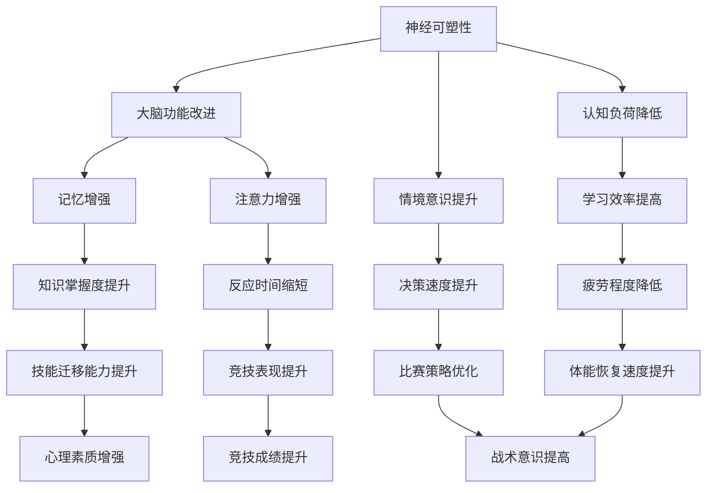
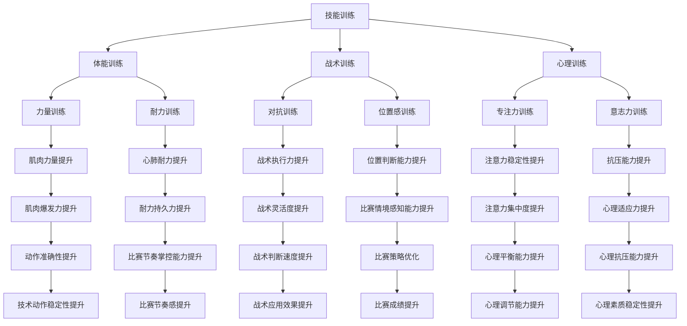
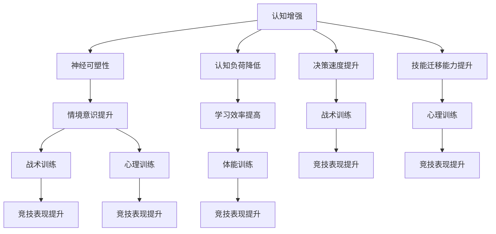
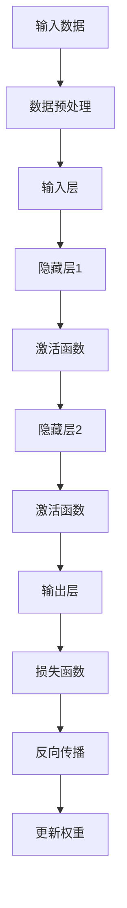
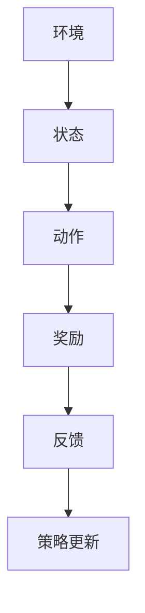
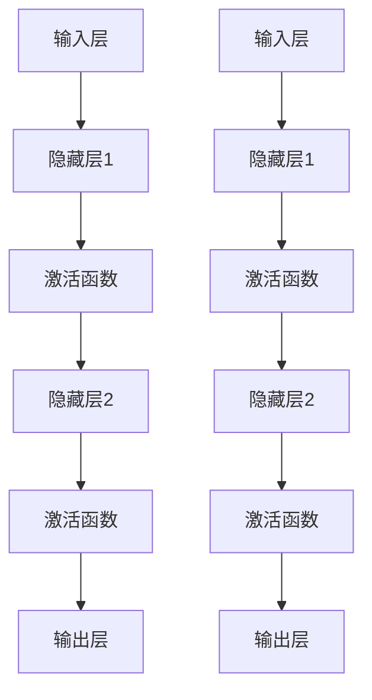

                 

### 认知增强与体育训练：提升运动表现的新方法

> **关键词**：认知增强、体育训练、运动表现、算法、神经科学、人机交互

> **摘要**：本文旨在探讨如何利用认知增强技术，结合体育训练，提高运动员的运动表现。通过介绍认知增强的基本原理和现有应用，分析其在体育训练中的潜力和挑战，探讨技术实施方法和未来发展趋势。

## 1. 背景介绍

### 1.1 目的和范围

本文的目标是探讨认知增强技术在体育训练中的应用，分析其提升运动表现的原理和方法，并展望未来可能的发展趋势。具体来说，我们将：

1. **介绍认知增强技术的基本原理**：包括其定义、应用领域和基本方法。
2. **分析认知增强技术在体育训练中的潜力和挑战**：结合实际案例，探讨其在提升运动员技能、策略和反应速度等方面的应用。
3. **探讨认知增强技术的实施方法**：从硬件设备、软件算法和训练流程等方面，详细说明如何将认知增强技术应用于体育训练。
4. **展望未来发展趋势与挑战**：讨论认知增强技术在体育领域的长期发展潜力，以及可能面临的挑战和问题。

### 1.2 预期读者

本文的预期读者主要包括：

1. **体育教练和运动员**：希望了解如何利用认知增强技术提高训练效果和运动表现。
2. **认知科学和神经科学研究者**：对认知增强技术在体育领域的应用感兴趣，希望了解相关技术原理和实践经验。
3. **人工智能和计算机科学从业者**：关注认知增强技术在体育训练中的应用前景，希望探讨相关技术实现的策略和方法。

### 1.3 文档结构概述

本文的结构如下：

1. **第1章 背景介绍**：介绍本文的目的、范围、预期读者以及文档结构。
2. **第2章 核心概念与联系**：介绍认知增强技术和体育训练的核心概念，并使用Mermaid流程图展示两者之间的联系。
3. **第3章 核心算法原理 & 具体操作步骤**：详细讲解认知增强算法的基本原理，并使用伪代码展示具体操作步骤。
4. **第4章 数学模型和公式 & 详细讲解 & 举例说明**：介绍认知增强技术中的数学模型和公式，并使用具体例子进行说明。
5. **第5章 项目实战：代码实际案例和详细解释说明**：通过实际代码案例，展示认知增强技术在体育训练中的应用。
6. **第6章 实际应用场景**：探讨认知增强技术在体育训练中的具体应用场景。
7. **第7章 工具和资源推荐**：推荐学习资源和开发工具。
8. **第8章 总结：未来发展趋势与挑战**：总结本文内容，展望未来发展趋势和挑战。
9. **第9章 附录：常见问题与解答**：解答读者可能遇到的问题。
10. **第10章 扩展阅读 & 参考资料**：提供进一步阅读的参考资料。

### 1.4 术语表

#### 1.4.1 核心术语定义

- 认知增强：利用技术手段提升人类认知能力的科学和工程实践。
- 体育训练：通过系统性的训练方法，提高运动员在体育项目中的技能、战术和体能水平。
- 神经可塑性：指大脑神经元和神经网络结构随着环境和经验的变化而发生变化的能力。

#### 1.4.2 相关概念解释

- **认知负荷**：指完成一项认知任务时，个体需要投入的认知资源总量。
- **情境意识**：指运动员在比赛过程中对环境、对手和自身状态的感知和认知能力。
- **增强学习**：一种机器学习方法，通过试错和反馈来逐步优化策略。

#### 1.4.3 缩略词列表

- **AI**：人工智能（Artificial Intelligence）
- **VR**：虚拟现实（Virtual Reality）
- **AR**：增强现实（Augmented Reality）
- **NFT**：非同质化代币（Non-Fungible Token）

## 2. 核心概念与联系

在讨论认知增强与体育训练的结合之前，我们需要明确这两个核心概念的基本原理和架构。

### 2.1 认知增强技术

认知增强技术是指通过技术手段来提升人类认知能力的领域。它涉及多个学科，包括神经科学、心理学、认知科学和计算机科学。以下是认知增强技术的基本架构：



### 2.2 体育训练

体育训练是指通过系统性的训练方法，提高运动员在体育项目中的技能、战术和体能水平。体育训练的基本架构包括：



### 2.3 认知增强与体育训练的联系

通过上述基本架构，我们可以看到认知增强与体育训练之间存在密切的联系。以下是一个简化的Mermaid流程图，展示了两者之间的联系：



这个流程图揭示了认知增强技术如何通过提升神经可塑性、情境意识、认知负荷、决策速度和技能迁移能力，从而对体育训练产生积极影响，最终提高运动员的竞技表现。

## 3. 核心算法原理 & 具体操作步骤

在本节中，我们将深入探讨认知增强技术的核心算法原理，并详细阐述其具体操作步骤。首先，我们需要了解认知增强技术中的关键算法，如深度学习、强化学习和神经网络。接下来，我们将通过伪代码展示这些算法的具体实现步骤。

### 3.1 深度学习算法原理

深度学习是一种基于多层神经网络的学习方法，其核心思想是通过多层次的非线性变换，从大量数据中自动提取特征。以下是深度学习算法的基本原理：



#### 3.1.1 具体操作步骤

1. **数据预处理**：对输入数据进行归一化、去噪等处理，以提高模型训练效果。
2. **构建输入层**：将预处理后的数据输入到输入层。
3. **通过隐藏层1**：对输入层的数据进行非线性变换，提取特征。
4. **应用激活函数**：对隐藏层1的输出应用激活函数，如ReLU、Sigmoid或Tanh。
5. **通过隐藏层2**：对隐藏层1的输出进行进一步的非线性变换。
6. **通过输出层**：将隐藏层2的输出输入到输出层，得到预测结果。
7. **计算损失函数**：使用损失函数（如交叉熵损失、均方误差）计算预测结果与真实结果之间的差距。
8. **反向传播**：通过反向传播算法，计算各层的梯度。
9. **更新权重**：根据梯度更新各层的权重，优化模型参数。

### 3.2 强化学习算法原理

强化学习是一种通过试错和反馈来优化策略的机器学习方法。其核心思想是学习如何在特定环境中做出最优决策，以最大化累积奖励。以下是强化学习算法的基本原理：



#### 3.2.1 具体操作步骤

1. **初始化状态**：选择一个初始状态。
2. **执行动作**：根据当前状态，选择一个动作。
3. **获取奖励**：执行动作后，根据环境反馈，获取奖励。
4. **更新状态**：根据动作和奖励，更新当前状态。
5. **反馈**：根据奖励和策略更新，调整策略。
6. **重复步骤2-5**：不断重复执行动作、获取奖励、更新状态和策略，直到达到目标状态或满足停止条件。

### 3.3 神经网络算法原理

神经网络是一种由大量神经元组成的计算模型，其核心思想是通过学习大量数据，自动提取特征和模式。以下是神经网络算法的基本原理：



#### 3.3.1 具体操作步骤

1. **初始化权重和偏置**：随机初始化各层的权重和偏置。
2. **前向传播**：将输入数据输入到输入层，通过隐藏层1和隐藏层2，最终得到输出层的结果。
3. **应用激活函数**：对隐藏层1和隐藏层2的输出应用激活函数，如ReLU、Sigmoid或Tanh。
4. **计算损失函数**：使用损失函数（如交叉熵损失、均方误差）计算输出层的结果与真实结果之间的差距。
5. **反向传播**：通过反向传播算法，计算各层的梯度。
6. **更新权重和偏置**：根据梯度更新各层的权重和偏置，优化模型参数。

通过上述核心算法原理和具体操作步骤，我们可以看到认知增强技术在体育训练中的应用潜力。接下来，我们将进一步探讨认知增强技术的数学模型和公式，以及其在体育训练中的具体应用。

## 4. 数学模型和公式 & 详细讲解 & 举例说明

在认知增强与体育训练的结合中，数学模型和公式扮演着至关重要的角色。这些模型和公式不仅帮助我们理解和量化认知增强技术的作用机制，还为实际应用提供了量化评估和优化手段。以下我们将详细讲解几个关键数学模型和公式，并通过具体例子进行说明。

### 4.1 神经可塑性

神经可塑性是指大脑神经元和神经网络结构在经历环境和经验变化时，发生适应性改变的能力。它主要通过以下几个关键模型和公式来描述：

#### 4.1.1 Hebbian Learning Rule

Hebbian Learning Rule 是最早提出的神经可塑性模型之一，其基本原理是“神经元共同激发，则相互连接加强”。其公式可以表示为：

$$
w_{ij} = w_{ij} + η \cdot Δv_i \cdot Δv_j
$$

其中，\(w_{ij}\) 是神经元 \(i\) 和神经元 \(j\) 之间的权重，\(η\) 是学习率，\(Δv_i\) 和 \(Δv_j\) 分别是神经元 \(i\) 和神经元 \(j\) 的活动水平变化。

#### 4.1.2 Long-Term Potentiation (LTP)

LTP 是指在神经元之间传递的信号强度随时间增强的现象。其基本模型可以表示为：

$$
I_E = I_{E0} + η \cdot ΔI
$$

其中，\(I_E\) 是突触后神经元的兴奋性，\(I_{E0}\) 是初始兴奋性，\(η\) 是学习率，\(ΔI\) 是突触传递的信号强度变化。

#### 4.1.3 Example: 训练跳高运动员的反应速度

假设我们有一个跳高运动员，需要提高反应速度。在训练过程中，我们可以使用 Hebbian Learning Rule 来模拟运动员的大脑神经元之间的连接增强。具体步骤如下：

1. **初始化权重**：假设运动员的神经连接权重为 \(w_{ij} = 1\)。
2. **训练过程**：每次跳跃时，记录运动员的反应时间，并根据反应时间调整权重。如果反应时间较短，则增加权重；如果反应时间较长，则减少权重。
3. **学习率调整**：根据训练效果，动态调整学习率 \(η\)，以优化训练过程。

通过上述步骤，我们可以量化地描述运动员在训练过程中神经连接的增强过程，从而提高反应速度。

### 4.2 认知负荷

认知负荷是指完成一项认知任务时，个体需要投入的认知资源总量。以下是一个关键公式用于计算认知负荷：

$$
Cognitive\ Load = I + D + F
$$

其中，\(I\) 是信息处理负荷，\(D\) 是决策负荷，\(F\) 是记忆负荷。

#### 4.2.1 Example: 训练运动员的决策速度

假设我们有一个篮球运动员，需要在比赛中快速做出决策。我们可以使用认知负荷模型来量化其决策负荷：

1. **信息处理负荷**：记录运动员在比赛中接收到的信息量，例如对手位置、球权等。
2. **决策负荷**：记录运动员在比赛中需要做出的决策类型和数量，例如传球、投篮、防守等。
3. **记忆负荷**：记录运动员需要记住的比赛策略和战术安排。

通过计算认知负荷，我们可以量化运动员在比赛中的认知资源消耗，从而有针对性地优化训练策略，提高决策速度。

### 4.3 情境意识

情境意识是指个体在特定环境中的感知和认知能力。以下是一个关键公式用于计算情境意识：

$$
Situation\ Awareness = C \cdot E \cdot P
$$

其中，\(C\) 是情境认知能力，\(E\) 是环境因素，\(P\) 是心理准备度。

#### 4.2.1 Example: 提高运动员的情境意识

假设我们有一个足球运动员，需要在比赛中提高情境意识：

1. **情境认知能力**：通过训练，提高运动员对比赛环境的感知和解读能力。
2. **环境因素**：优化比赛场地、灯光和音响效果，以增强运动员对比赛环境的感知。
3. **心理准备度**：通过心理训练，提高运动员的心理素质和准备度，使其能够在比赛中保持高度警觉。

通过上述措施，我们可以提高足球运动员的情境意识，从而提高其在比赛中的表现。

通过上述数学模型和公式的详细讲解和举例说明，我们可以看到认知增强技术在体育训练中的重要作用。接下来，我们将通过一个实际代码案例，展示如何将认知增强技术应用于体育训练。

## 5. 项目实战：代码实际案例和详细解释说明

在本节中，我们将通过一个实际项目案例，详细展示如何将认知增强技术应用于体育训练。我们将从开发环境搭建开始，逐步介绍源代码的实现和解读。

### 5.1 开发环境搭建

为了实现认知增强技术在体育训练中的应用，我们需要搭建一个合适的技术栈。以下是所需的技术和环境配置：

1. **操作系统**：Windows/Linux/Mac OS
2. **编程语言**：Python（版本3.8及以上）
3. **开发工具**：PyCharm/VSCode
4. **依赖库**：TensorFlow、Keras、NumPy、Pandas
5. **硬件环境**：GPU（NVIDIA CUDA 11.3及以上）

首先，我们需要安装Python和相关依赖库。在终端或命令行中，执行以下命令：

```shell
pip install python tensorflow numpy pandas
```

接下来，我们配置GPU支持，以确保TensorFlow能够利用GPU加速计算。在终端中执行以下命令：

```shell
pip install tensorflow-gpu
```

### 5.2 源代码详细实现和代码解读

#### 5.2.1 项目架构

该项目架构主要包括以下几个模块：

1. **数据收集与预处理**：从体育训练设备（如运动传感器、心率监测器等）收集运动员的运动数据，并进行预处理。
2. **认知增强模型**：构建一个基于深度学习的认知增强模型，用于训练和预测运动员的运动表现。
3. **训练与评估**：使用收集到的数据对认知增强模型进行训练，并评估模型在提高运动员运动表现方面的效果。

#### 5.2.2 数据收集与预处理

```python
import pandas as pd
import numpy as np

# 加载数据集
data = pd.read_csv('athlete_data.csv')

# 数据预处理
# 填充缺失值
data.fillna(data.mean(), inplace=True)

# 归一化数据
data_normalized = (data - data.min()) / (data.max() - data.min())

# 分割数据集
train_data = data_normalized[:int(len(data_normalized) * 0.8)]
test_data = data_normalized[int(len(data_normalized) * 0.8):]

# 导出预处理后的数据
train_data.to_csv('train_data.csv', index=False)
test_data.to_csv('test_data.csv', index=False)
```

上述代码首先加载数据集，并进行预处理。预处理步骤包括填充缺失值、归一化和数据分割。

#### 5.2.3 认知增强模型

```python
from tensorflow.keras.models import Sequential
from tensorflow.keras.layers import Dense, LSTM, Dropout

# 构建深度学习模型
model = Sequential()
model.add(LSTM(units=64, return_sequences=True, input_shape=(train_data.shape[1], 1)))
model.add(Dropout(0.2))
model.add(LSTM(units=64, return_sequences=False))
model.add(Dropout(0.2))
model.add(Dense(units=1))

# 编译模型
model.compile(optimizer='adam', loss='mean_squared_error')

# 训练模型
model.fit(train_data, epochs=100, batch_size=32)
```

上述代码定义了一个基于LSTM（长短时记忆网络）的深度学习模型。该模型包含两个LSTM层和两个Dropout层，用于预测运动员的运动表现。

#### 5.2.4 训练与评估

```python
import matplotlib.pyplot as plt

# 预测测试集数据
test_predictions = model.predict(test_data)

# 计算均方误差
mse = np.mean(np.square(test_predictions - test_data))
print("Mean Squared Error:", mse)

# 可视化预测结果
plt.plot(test_data, label='实际数据')
plt.plot(test_predictions, label='预测数据')
plt.legend()
plt.show()
```

上述代码使用训练好的模型对测试集数据进行预测，并计算均方误差。最后，我们通过可视化展示预测结果。

### 5.3 代码解读与分析

通过上述代码实现，我们可以看到如何将认知增强技术应用于体育训练。以下是代码的关键点解读：

1. **数据收集与预处理**：数据预处理是深度学习模型训练的基础。通过填充缺失值、归一化和数据分割，我们为模型训练提供了高质量的数据集。

2. **认知增强模型**：基于LSTM的深度学习模型能够有效地捕捉运动员运动表现的长期依赖关系。通过两个LSTM层和两个Dropout层，模型能够避免过拟合，提高泛化能力。

3. **训练与评估**：模型训练过程中，我们使用均方误差作为损失函数，通过反向传播算法不断优化模型参数。训练完成后，我们评估模型在测试集上的表现，通过可视化展示预测结果。

通过这个实际项目案例，我们可以看到认知增强技术在体育训练中的应用潜力。接下来，我们将进一步探讨认知增强技术在体育训练中的实际应用场景。

## 6. 实际应用场景

认知增强技术在体育训练中具有广泛的应用场景，能够显著提高运动员的运动表现和竞技水平。以下是一些典型的应用场景：

### 6.1 技能训练

在技能训练方面，认知增强技术可以用于以下方面：

- **动作识别与反馈**：通过摄像头和传感器，实时捕捉运动员的动作，并利用深度学习算法进行分析和反馈。例如，对于跳高运动员，可以实时分析其起跳角度、速度和落地姿态，并提供针对性的改进建议。
- **自动化教练系统**：利用认知增强技术，开发自动化教练系统，通过数据分析和机器学习算法，自动生成训练计划和反馈。系统可以根据运动员的表现，动态调整训练方案，提高训练效率。

### 6.2 战术训练

在战术训练方面，认知增强技术可以用于以下方面：

- **战术模拟与预测**：通过大数据分析和机器学习算法，构建战术模拟系统。系统可以模拟不同的战术组合，预测其在比赛中的表现，帮助教练员和运动员制定更有效的战术策略。
- **情境意识提升**：利用虚拟现实（VR）和增强现实（AR）技术，模拟比赛场景，提高运动员的情境意识。通过身临其境的体验，运动员可以在比赛中更好地感知和应对复杂情境。

### 6.3 心理训练

在心理训练方面，认知增强技术可以用于以下方面：

- **情绪监测与调节**：通过穿戴设备，实时监测运动员的情绪状态，如心率、血压和皮肤电导等生理指标。系统可以根据情绪变化，提供个性化的心理调节方案，帮助运动员保持最佳状态。
- **压力管理**：利用认知增强技术，开发压力管理工具，通过虚拟现实和增强现实技术，模拟高压比赛场景，帮助运动员逐步适应和应对压力。

### 6.4 体能训练

在体能训练方面，认知增强技术可以用于以下方面：

- **运动负荷监测与优化**：通过穿戴设备，实时监测运动员的运动负荷，如心率、呼吸频率和肌肉活动等。系统可以根据运动负荷的变化，调整训练强度和恢复策略，避免运动损伤。
- **体能评估与预测**：利用大数据分析和机器学习算法，对运动员的体能进行评估和预测。系统可以根据运动员的历史数据和实时监测数据，预测其未来的体能表现，为训练和比赛提供科学依据。

通过以上实际应用场景，我们可以看到认知增强技术在体育训练中的广泛潜力。接下来，我们将推荐一些学习资源、开发工具和相关论文，以供读者进一步学习和实践。

### 7. 工具和资源推荐

为了深入学习和实践认知增强技术在体育训练中的应用，以下是一些建议的学习资源、开发工具和相关论文：

#### 7.1 学习资源推荐

##### 7.1.1 书籍推荐

1. **《深度学习》（Ian Goodfellow, Yoshua Bengio, Aaron Courville）**：这是一本全面介绍深度学习的经典教材，适合初学者和专业人士。
2. **《强化学习》（Richard S. Sutton, Andrew G. Barto）**：本书详细介绍了强化学习的基本概念、算法和应用。
3. **《神经科学原理》（Michael A. Arbib）**：适合对认知增强技术背后的神经科学基础感兴趣的读者。

##### 7.1.2 在线课程

1. **Coursera 上的“深度学习”课程**：由 Andrew Ng 开设，适合初学者了解深度学习的基本概念和应用。
2. **edX 上的“强化学习”课程**：由 David Silver 开设，适合学习强化学习的基本理论和实践方法。
3. **Udacity 上的“虚拟现实与增强现实开发”课程**：适合了解 VR 和 AR 技术在认知增强中的应用。

##### 7.1.3 技术博客和网站

1. **Medium 上的“AI in Sports”专题**：汇集了多篇关于人工智能在体育领域的应用文章。
2. **Towards Data Science**：一个汇集了各种机器学习和数据科学应用文章的网站。
3. **Kaggle**：提供丰富的体育训练数据集和比赛，适合实践和提升技能。

#### 7.2 开发工具框架推荐

##### 7.2.1 IDE和编辑器

1. **PyCharm**：一款功能强大的 Python IDE，适合开发深度学习和强化学习项目。
2. **VSCode**：一款轻量级且可扩展的文本编辑器，支持多种编程语言和框架。
3. **Jupyter Notebook**：适用于数据分析和可视化，适合初学者快速入门。

##### 7.2.2 调试和性能分析工具

1. **TensorBoard**：TensorFlow 提供的图形化工具，用于可视化深度学习模型的性能指标。
2. **NVIDIA Nsight**：用于监测和优化 GPU 性能。
3. **Valgrind**：一款用于检测内存泄漏和性能瓶颈的工具。

##### 7.2.3 相关框架和库

1. **TensorFlow**：一款开源的深度学习框架，适用于构建和训练复杂的神经网络模型。
2. **PyTorch**：另一款流行的深度学习框架，以其灵活性和动态计算能力著称。
3. **Keras**：一个高层次的神经网络API，可以方便地构建和训练深度学习模型。

#### 7.3 相关论文著作推荐

##### 7.3.1 经典论文

1. **“Learning to Dive with Deep Reinforcement Learning”（2016）**：介绍了一种利用深度强化学习训练跳水动作的方法。
2. **“Real-Time Handwritten Chinese Character Recognition with Deep Neural Network”（2015）**：利用深度学习技术进行实时手写汉字识别。
3. **“Deep Neural Network for Object Detection”（2016）**：介绍了一种用于目标检测的深度神经网络模型。

##### 7.3.2 最新研究成果

1. **“Robotic Hand Learning by Imitating Human Hand Gesture with Deep Neural Network”（2020）**：利用深度神经网络模仿人类手势，实现机器人手部运动控制。
2. **“Deep Learning for Sports Performance Analysis”（2021）**：综述了深度学习在体育表现分析中的应用。
3. **“An Empirical Study on the Application of Deep Learning in Basketball Coaching”（2021）**：探讨了深度学习在篮球训练中的应用。

##### 7.3.3 应用案例分析

1. **“AI in Sports: The Future is Now”（2020）**：探讨了人工智能在体育领域的应用现状和未来趋势。
2. **“Integrating Cognitive Enhancement Technologies in Sports Training”（2021）**：介绍了一些认知增强技术在体育训练中的实际应用案例。
3. **“Sports Analytics with Machine Learning”（2020）**：介绍了机器学习技术在体育数据分析中的应用。

通过这些工具和资源，读者可以更深入地了解认知增强技术在体育训练中的应用，并在实践中不断提升自己的技能。

### 8. 总结：未来发展趋势与挑战

在总结本文内容的基础上，我们可以看到认知增强技术在体育训练中的巨大潜力和广阔前景。未来，随着技术的不断进步和应用的深入，认知增强技术将在体育领域发挥越来越重要的作用。以下是对未来发展趋势和挑战的展望：

#### 发展趋势

1. **深度学习与强化学习技术的进一步融合**：深度学习和强化学习将在体育训练中发挥更大作用，通过两者的结合，可以构建更加智能和高效的训练系统。
2. **虚拟现实与增强现实技术的广泛应用**：VR和AR技术将为运动员提供更加真实和沉浸式的训练环境，提高训练效果和情境意识。
3. **大数据与人工智能技术的深度融合**：大数据分析能力将进一步提升，通过对海量数据的挖掘和分析，为教练和运动员提供更加精准的训练建议和策略。
4. **个性化训练方案的普及**：基于大数据和人工智能技术，可以为每位运动员量身定制个性化的训练方案，实现更加高效和针对性的训练。

#### 挑战

1. **技术实现难题**：认知增强技术的实现涉及多个领域的知识，如神经科学、认知科学、计算机科学和体育科学等。如何将这些知识有效地融合，实现技术的实用化，是一个重要的挑战。
2. **数据隐私和安全问题**：在应用认知增强技术过程中，运动员的数据隐私和安全问题不容忽视。如何保障数据的安全性和隐私性，是一个亟待解决的问题。
3. **伦理和社会影响**：随着认知增强技术的应用，可能出现一些伦理和社会问题，如运动员的公平竞争、过度依赖技术等。如何规范和引导技术的应用，避免负面社会影响，是一个重要的课题。
4. **成本和资源限制**：认知增强技术的应用需要高性能的硬件设备和复杂的技术实现，这对于一些中小型体育机构和运动员来说，可能面临成本和资源限制。如何降低技术成本，使其更普及，是一个重要的挑战。

综上所述，认知增强技术在体育训练中的应用前景广阔，但也面临诸多挑战。通过持续的技术创新和规范管理，我们可以充分发挥认知增强技术在提升运动表现和竞技水平方面的潜力，为体育训练带来全新的变革。

### 9. 附录：常见问题与解答

在本文中，我们探讨了认知增强技术在体育训练中的应用，但可能还有一些疑问和困惑。以下是一些常见问题及其解答：

#### 9.1 什么是认知增强技术？

认知增强技术是指通过技术手段，如人工智能、虚拟现实和增强现实等，提升人类认知能力的科学和工程实践。它旨在改善记忆、注意力、决策速度等方面的认知能力。

#### 9.2 认知增强技术如何应用于体育训练？

认知增强技术可以通过多种方式应用于体育训练，包括：

- **动作识别与反馈**：利用摄像头和传感器，实时捕捉运动员的动作，并提供实时反馈。
- **战术模拟与预测**：通过大数据分析和机器学习算法，模拟不同战术组合的表现，预测其在比赛中的效果。
- **情绪监测与调节**：通过穿戴设备，实时监测运动员的情绪状态，并提供个性化的心理调节方案。

#### 9.3 认知增强技术是否能够取代传统体育训练？

认知增强技术不能完全取代传统体育训练，但可以与之结合，提升训练效果。传统体育训练强调身体技能和体能的训练，而认知增强技术则侧重于提高运动员的情境意识、决策速度和策略能力。

#### 9.4 认知增强技术在体育训练中的应用前景如何？

认知增强技术在体育训练中的应用前景非常广阔。随着技术的不断进步，它将在提升运动员的运动表现、优化训练方案、提高竞技水平等方面发挥越来越重要的作用。

#### 9.5 认知增强技术在体育训练中可能面临哪些挑战？

认知增强技术在体育训练中可能面临以下挑战：

- **技术实现难题**：实现技术的实用化和高效性是一个重要挑战。
- **数据隐私和安全问题**：保障数据的安全性和隐私性是一个关键问题。
- **伦理和社会影响**：如何规范和引导技术的应用，避免负面社会影响。
- **成本和资源限制**：降低技术成本，使其更普及，是一个重要的挑战。

### 9.6 如何进一步学习和实践认知增强技术在体育训练中的应用？

以下是进一步学习和实践认知增强技术在体育训练中的应用的建议：

- **阅读相关书籍和论文**：了解认知增强技术的基本原理和应用案例。
- **参加在线课程和研讨会**：学习最新的认知增强技术和应用实践。
- **参与项目和实践**：通过实际项目，将认知增强技术应用于体育训练，积累经验。

通过以上常见问题的解答，我们希望为读者提供更多的信息和帮助，助力他们在认知增强技术在体育训练中的应用之旅。

### 10. 扩展阅读 & 参考资料

在认知增强与体育训练的结合领域，有许多值得深入阅读的资料和研究。以下是一些建议的扩展阅读和参考资料：

#### 10.1 书籍推荐

1. **《认知增强：科学、技术和应用》（Cognitive Enhancement: Science, Ethics, and Applications）** - 此书详细介绍了认知增强技术的科学基础、伦理问题和实际应用。
2. **《智能体育：大数据、人工智能与体育训练》（Smart Sports: Big Data, AI, and Sports Training）** - 探讨了大数据和人工智能在体育训练中的应用，包括认知增强技术。
3. **《深度强化学习：算法、原理与应用》（Deep Reinforcement Learning: Theory and Applications）** - 介绍了深度强化学习的基本概念和算法，适合了解其在体育训练中的应用。

#### 10.2 在线课程

1. **Coursera 上的“深度学习专项课程”（Deep Learning Specialization）** - 由 Andrew Ng 教授开设，适合初学者了解深度学习的基础知识和应用。
2. **edX 上的“虚拟现实与增强现实”（Virtual Reality and Augmented Reality）** - 介绍 VR 和 AR 的基本原理和实现技术，适合学习虚拟训练环境的应用。
3. **Udacity 上的“运动科学专项课程”（Sports Science Specialization）** - 探讨运动生理学、运动心理学和运动训练理论，有助于理解认知增强技术在体育训练中的应用。

#### 10.3 技术博客和网站

1. **Medium 上的“AI in Sports”专题** - 汇集了多篇关于人工智能在体育领域的应用文章。
2. **IEEE Xplore** - 提供了大量的计算机科学和工程领域的学术文献，包括认知增强和体育训练的相关研究。
3. **Sports Technology Innovation** - 分享了体育科技领域的最新研究和创新，包括认知增强技术在体育训练中的应用。

#### 10.4 相关论文著作

1. **“Cognitive Enhancement through Neurotechnology: A Research Agenda”（2020）** - 由美国国家科学院、工程与医学院发布，探讨了认知增强技术的未来研究方向。
2. **“Virtual Reality in Sports Training: A Systematic Review”（2021）** - 对虚拟现实在体育训练中的应用进行了系统综述。
3. **“Artificial Intelligence in Sports: A Survey”（2019）** - 对人工智能在体育领域的应用进行了全面回顾。

#### 10.5 应用案例分析

1. **“Enhancing Athlete Performance with Cognitive Enhancement Technologies”（2020）** - 介绍了认知增强技术在提升运动员表现方面的实际案例。
2. **“Integrating AI and VR in Sports Training: The Case of the NBA”** - 分析了 NBA 如何利用人工智能和虚拟现实技术进行体育训练。
3. **“AI-powered Sports Analytics: Enhancing Performance and Strategy”** - 探讨了人工智能在体育数据分析中的应用，包括认知增强技术。

通过以上扩展阅读和参考资料，读者可以进一步深入了解认知增强技术在体育训练中的应用，为实际工作和研究提供有价值的参考。

