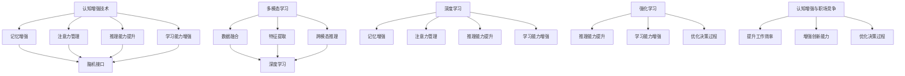

                 

### 认知增强与职场竞争：知识工作者的进化

> **关键词**：认知增强、知识工作者、职场竞争、人工智能、进化
> 
> **摘要**：本文旨在探讨认知增强技术在知识工作者职场竞争中的关键作用。随着人工智能的快速发展，知识工作者如何利用认知增强工具提升自身的认知能力，进而提高职场竞争力成为亟待解决的问题。本文将从背景介绍、核心概念与联系、核心算法原理、数学模型、项目实战、应用场景等多个方面，系统阐述认知增强对知识工作者的深远影响，并提供实际操作指南和相关资源推荐，旨在为知识工作者提供理论支持和实践参考。

### 1. 背景介绍

#### 1.1 目的和范围

本文旨在探讨认知增强在知识工作者职场竞争中的关键作用。随着人工智能技术的不断进步，知识工作者的职场环境发生了深刻变革。传统的工作模式已无法满足日益复杂的工作需求，认知能力的提升成为知识工作者在职场竞争中脱颖而出的关键因素。因此，本文将从以下几个方面展开讨论：

- **核心概念与联系**：介绍认知增强技术的基本概念、原理及其在职场中的应用。
- **核心算法原理 & 具体操作步骤**：阐述认知增强算法的基本原理和实现步骤，并提供详细的伪代码讲解。
- **数学模型和公式 & 详细讲解 & 举例说明**：介绍认知增强相关的数学模型和公式，并通过实例进行详细解释。
- **项目实战：代码实际案例和详细解释说明**：通过实际代码案例，展示如何将认知增强技术应用于实际项目中。
- **实际应用场景**：探讨认知增强技术在各类职场场景中的具体应用。
- **工具和资源推荐**：推荐相关的学习资源、开发工具和框架，以帮助读者更好地理解和应用认知增强技术。
- **总结：未来发展趋势与挑战**：分析认知增强技术的发展趋势和面临的挑战。

通过以上讨论，本文旨在为知识工作者提供认知增强技术的理论支持和实践指南，帮助其在职场竞争中实现持续进化。

#### 1.2 预期读者

本文的预期读者主要包括以下几类人群：

- **知识工作者**：包括研究人员、工程师、设计师、项目经理等，他们希望在职场竞争中提升自身的认知能力。
- **人工智能开发者**：对认知增强技术感兴趣，希望将其应用于实际项目开发中。
- **教育工作者**：关注认知增强技术在教育培训中的应用，以提升学生的认知能力和学习能力。
- **企业决策者**：关注认知增强技术在企业管理和决策中的应用，以提高企业的竞争力。

无论您属于哪一类读者，本文都将为您提供一个全面、系统的认知增强技术概述，帮助您深入了解该领域的发展现状和未来趋势。

#### 1.3 文档结构概述

本文的结构如下：

1. **背景介绍**：介绍本文的目的、范围、预期读者和文档结构。
2. **核心概念与联系**：阐述认知增强技术的基本概念、原理及其在职场中的应用。
3. **核心算法原理 & 具体操作步骤**：讲解认知增强算法的基本原理和实现步骤，并提供详细的伪代码。
4. **数学模型和公式 & 详细讲解 & 举例说明**：介绍认知增强相关的数学模型和公式，并通过实例进行详细解释。
5. **项目实战：代码实际案例和详细解释说明**：通过实际代码案例，展示如何将认知增强技术应用于实际项目中。
6. **实际应用场景**：探讨认知增强技术在各类职场场景中的具体应用。
7. **工具和资源推荐**：推荐相关的学习资源、开发工具和框架。
8. **总结：未来发展趋势与挑战**：分析认知增强技术的发展趋势和面临的挑战。
9. **附录：常见问题与解答**：回答读者可能关心的一些常见问题。
10. **扩展阅读 & 参考资料**：提供与本文相关的进一步阅读资料。

通过以上结构，本文力求系统地介绍认知增强技术在知识工作者职场竞争中的应用，为读者提供全面的理论支持和实践指南。

#### 1.4 术语表

在本文中，我们将使用一些专业术语，为了便于读者理解，下面给出这些术语的定义和解释。

##### 1.4.1 核心术语定义

- **认知增强**：通过技术手段提升个体的认知能力，包括记忆、注意力、推理、学习等方面的能力。
- **知识工作者**：以知识和信息处理为核心能力的职业人士，如研究人员、工程师、设计师等。
- **人工智能**：模拟、延伸和扩展人类智能的理论、方法、技术及应用。
- **深度学习**：一种基于人工神经网络的学习方法，通过模拟人脑的学习机制，实现数据的自动特征提取和模式识别。
- **神经网络**：由大量相互连接的神经元组成的计算模型，用于模拟生物神经系统的信息处理过程。
- **脑机接口**：利用技术手段将人类大脑与外部设备进行连接，实现信息传递和互动。

##### 1.4.2 相关概念解释

- **注意力机制**：神经网络中用于模拟人类注意力分配的一种机制，能够突出重要信息，忽略次要信息。
- **强化学习**：一种基于奖励和惩罚的学习方法，通过不断调整策略，实现优化目标。
- **记忆增强**：利用技术手段提升大脑的记忆能力，包括短期记忆和长期记忆。
- **多模态学习**：同时处理多种类型数据（如文本、图像、音频等）的学习方法，提高模型的泛化能力。

##### 1.4.3 缩略词列表

- **AI**：人工智能
- **ML**：机器学习
- **DL**：深度学习
- **NLP**：自然语言处理
- **CV**：计算机视觉
- **ROI**：投资回报率
- **IDE**：集成开发环境

通过上述术语表，读者可以更好地理解本文中涉及的专业概念，为后续内容的深入学习奠定基础。

## 2. 核心概念与联系

在探讨认知增强技术对知识工作者职场竞争的影响之前，我们首先需要明确一些核心概念和它们之间的关系。以下是本文涉及的主要概念及其相互联系。

### 2.1 认知增强技术

认知增强技术是指利用各种技术手段，如人工智能、脑机接口、多模态学习等，来提升个体的认知能力。具体来说，认知增强技术包括以下几个方面：

1. **记忆增强**：通过技术手段提升大脑的记忆能力，包括短期记忆和长期记忆。例如，深度学习模型可以用于构建记忆网络，实现高效的信息存储和检索。
2. **注意力管理**：利用注意力机制，模拟人类注意力分配的过程，突出重要信息，忽略次要信息。例如，神经网络中的注意力门控机制可以用于文本分类和图像识别任务。
3. **推理能力提升**：通过强化学习和迁移学习等技术，提升个体的推理能力，使其在面对复杂问题时能够快速找到解决方案。例如，基于深度强化学习的算法可以用于路径规划和决策制定。
4. **学习能力增强**：利用多模态学习和迁移学习等技术，提升个体的学习能力，使其能够更快地适应新环境和任务。例如，多模态神经网络可以同时处理文本、图像和音频信息，实现更全面的认知。

### 2.2 脑机接口

脑机接口（Brain-Computer Interface，BCI）是一种直接连接大脑和外部设备的技术，通过检测大脑活动，实现信息的传递和互动。脑机接口在认知增强中具有重要作用，主要表现在以下几个方面：

1. **神经信号检测**：利用脑电图（EEG）、功能性磁共振成像（fMRI）等神经成像技术，检测大脑活动，提取神经信号。
2. **信号处理**：通过信号处理技术，对提取的神经信号进行滤波、特征提取和模式识别，实现大脑活动的解码。
3. **控制外部设备**：将解码后的神经信号转换为控制信号，控制外部设备，如虚拟现实（VR）、机器人等。

### 2.3 多模态学习

多模态学习（Multimodal Learning）是一种同时处理多种类型数据的学习方法，如文本、图像、音频等。多模态学习在认知增强中具有重要作用，主要表现在以下几个方面：

1. **数据融合**：将不同类型的数据进行融合，实现更全面的信息处理。例如，文本和图像信息的融合可以用于图像标注和情感分析。
2. **特征提取**：利用多种类型的数据，提取更多有效的特征，提高模型的泛化能力。例如，图像和文本的特征可以用于图像分类和文本分类任务。
3. **跨模态推理**：通过跨模态推理，实现不同类型数据之间的信息传递和互动。例如，图像和文本的跨模态推理可以用于图像字幕生成和问答系统。

### 2.4 深度学习与强化学习

深度学习（Deep Learning）和强化学习（Reinforcement Learning）是认知增强技术中两种重要的机器学习方法。

1. **深度学习**：深度学习通过模拟人脑的神经网络结构，实现数据的自动特征提取和模式识别。在认知增强中，深度学习主要用于提升个体的记忆、注意力和推理能力。
2. **强化学习**：强化学习通过奖励和惩罚机制，训练智能体在特定环境中找到最优策略。在认知增强中，强化学习主要用于提升个体的学习能力和决策能力。

### 2.5 认知增强与职场竞争

认知增强技术在知识工作者的职场竞争中具有重要作用，主要表现在以下几个方面：

1. **提升工作效率**：通过记忆增强、注意力管理和推理能力提升等技术，知识工作者能够更高效地处理复杂任务。
2. **增强创新能力**：通过学习能力增强和多模态学习等技术，知识工作者能够更快地适应新环境和任务，提高创新能力。
3. **优化决策过程**：通过推理能力提升和强化学习等技术，知识工作者能够做出更合理的决策，提高决策质量。

### 2.6 Mermaid 流程图

为了更好地理解上述核心概念之间的联系，我们可以使用 Mermaid 流程图来展示它们之间的关系。



通过上述流程图，我们可以清晰地看到认知增强技术与核心概念之间的联系，以及它们在职场竞争中的应用价值。

### 2.7 核心算法原理 & 具体操作步骤

在认知增强技术中，核心算法的原理和实现步骤至关重要。以下将介绍几种常见的认知增强算法，并使用伪代码进行详细阐述。

#### 2.7.1 多模态学习算法

多模态学习算法是一种同时处理多种类型数据的学习方法，其核心思想是通过数据融合、特征提取和跨模态推理，实现更全面的信息处理。以下是一个基于多模态学习的伪代码示例：

```pseudo
function multimodal_learning(data_text, data_image, data_audio):
    # 数据预处理
    text_embedding = preprocess_text(data_text)
    image_embedding = preprocess_image(data_image)
    audio_embedding = preprocess_audio(data_audio)

    # 数据融合
    fused_embedding = concatenate(text_embedding, image_embedding, audio_embedding)

    # 特征提取
    features = extract_features(fused_embedding)

    # 跨模态推理
    prediction = cross_modal推理(features)

    return prediction
```

#### 2.7.2 记忆增强算法

记忆增强算法通过模拟人脑的记忆机制，提升大脑的记忆能力。以下是一个基于记忆增强的伪代码示例：

```pseudo
function memory_enhancement(input_data, reference_memory):
    # 记忆检索
    retrieved_memory = retrieve_memory(input_data, reference_memory)

    # 记忆更新
    updated_memory = update_memory(retrieved_memory, input_data)

    return updated_memory
```

#### 2.7.3 注意力管理算法

注意力管理算法通过模拟人类注意力分配的过程，突出重要信息，忽略次要信息。以下是一个基于注意力管理的伪代码示例：

```pseudo
function attention_management(input_data, attention_mask):
    # 注意力分配
    attention_weights = compute_attention_weights(input_data, attention_mask)

    # 突出重要信息
    highlighted_data = apply_attention_weights(attention_weights, input_data)

    return highlighted_data
```

#### 2.7.4 推理能力提升算法

推理能力提升算法通过强化学习和迁移学习等技术，提升个体的推理能力。以下是一个基于推理能力提升的伪代码示例：

```pseudo
function reasoning_enhancement(model, environment, reward_function):
    # 初始化模型
    initialize_model(model)

    # 强化学习
    for episode in range(num_episodes):
        state = environment.reset()
        while not environment.is_done(state):
            action = model.select_action(state)
            next_state, reward = environment.step(action)
            model.update_state_action_value(state, action, next_state, reward)
            state = next_state

    # 迁移学习
    model.transfer_learnt_state_action_values()

    return model
```

通过上述伪代码，我们可以看到各种认知增强算法的基本原理和实现步骤。这些算法在提升知识工作者的认知能力方面具有重要作用，为他们在职场竞争中提供了有力支持。

### 4. 数学模型和公式 & 详细讲解 & 举例说明

在认知增强技术中，数学模型和公式扮演着关键角色，它们帮助我们理解认知过程的机制，并指导算法的设计与实现。以下我们将介绍几个核心的数学模型和公式，并进行详细讲解和实例说明。

#### 4.1 神经网络与反向传播算法

神经网络是认知增强技术的基础，而反向传播算法是训练神经网络的核心。反向传播算法通过计算损失函数的梯度，更新网络权重，以优化网络性能。

**公式：**

$$\Delta W = -\alpha \frac{\partial J}{\partial W}$$

其中：
- \( \Delta W \) 是权重更新。
- \( \alpha \) 是学习率。
- \( J \) 是损失函数。
- \( \frac{\partial J}{\partial W} \) 是损失函数对权重的梯度。

**举例说明：**

假设我们有一个简单的全连接神经网络，包含两个输入节点、两个隐藏节点和一个输出节点。训练数据集包含输入向量 \( X = [x_1, x_2] \) 和期望输出 \( Y = [y_1, y_2] \)。

1. 计算输出层的损失 \( J \)：
   $$J = \frac{1}{2} \sum_{i=1}^{2} (y_i - \hat{y}_i)^2$$
   其中 \( \hat{y}_i \) 是输出节点的预测值。

2. 计算隐藏层到输出层的梯度 \( \frac{\partial J}{\partial W_{ij}} \)：
   $$\frac{\partial J}{\partial W_{ij}} = \frac{\partial J}{\partial \hat{y}_i} \cdot \frac{\partial \hat{y}_i}{\partial z_j} \cdot \frac{\partial z_j}{\partial W_{ij}}$$
   其中 \( z_j \) 是隐藏节点的激活值，\( \hat{y}_i \) 是输出节点的预测值。

3. 更新权重 \( W_{ij} \)：
   $$W_{ij} = W_{ij} - \alpha \cdot \frac{\partial J}{\partial W_{ij}}$$

通过以上步骤，我们可以更新神经网络的权重，以减少损失函数的值，提高网络的预测准确性。

#### 4.2 注意力机制

注意力机制是神经网络中用于模拟人类注意力分配的关键机制。它通过调整每个输入的特征权重，使神经网络能够关注重要的信息。

**公式：**

$$a_i = \sigma(W_a [h; s])$$

其中：
- \( a_i \) 是第 \( i \) 个输入的特征权重。
- \( \sigma \) 是激活函数，通常使用 Sigmoid 函数。
- \( W_a \) 是权重矩阵。
- \( h \) 是隐藏层的激活值。
- \( s \) 是前一个隐藏层的状态。

**举例说明：**

假设我们有一个序列模型，输入序列为 \( [x_1, x_2, x_3] \)，隐藏层状态为 \( s \)，权重矩阵为 \( W_a \)。

1. 计算注意力权重 \( a_i \)：
   $$a_1 = \sigma(W_a [h_1; s])$$
   $$a_2 = \sigma(W_a [h_2; s])$$
   $$a_3 = \sigma(W_a [h_3; s])$$

2. 计算加权输入：
   $$s' = \sum_{i=1}^{3} a_i x_i$$

通过加权输入，模型能够关注输入序列中的重要特征，提高处理复杂问题的能力。

#### 4.3 脑机接口信号处理

脑机接口（BCI）技术通过检测和分析大脑信号，实现人脑与外部设备的交互。常用的信号处理方法包括滤波、特征提取和分类。

**公式：**

$$y = \sum_{i=1}^{n} w_i x_i + b$$

其中：
- \( y \) 是滤波后的信号。
- \( x_i \) 是原始信号。
- \( w_i \) 是滤波器权重。
- \( b \) 是偏置项。

**举例说明：**

假设我们有一个脑电图（EEG）信号 \( x \)，需要对其进行滤波。

1. 设计滤波器权重 \( w_i \)：
   $$w_i = \frac{1}{\sqrt{\sum_{j=1}^{n} w_j^2}}$$

2. 应用滤波器：
   $$y = \sum_{i=1}^{n} w_i x_i + b$$

通过滤波，我们可以去除信号中的噪声，提取出有用的信息。

#### 4.4 强化学习奖励函数

强化学习中的奖励函数用于指导智能体在环境中的行为，以实现最优策略。

**公式：**

$$R = r(s, a)$$

其中：
- \( R \) 是奖励值。
- \( r \) 是奖励函数。
- \( s \) 是当前状态。
- \( a \) 是动作。

**举例说明：**

假设我们在一个迷宫环境中训练一个智能体，其奖励函数为：

1. 当智能体到达终点时，奖励值为 +10。
2. 当智能体进入死胡同时，奖励值为 -1。

通过设定合适的奖励函数，智能体可以学会找到最佳路径。

通过上述数学模型和公式的讲解，我们可以更好地理解认知增强技术的工作原理。这些模型和公式为我们设计高效算法提供了理论依据，有助于我们在职场竞争中不断提升认知能力。

### 5. 项目实战：代码实际案例和详细解释说明

在本节中，我们将通过一个实际项目案例，展示如何将认知增强技术应用于实际开发中，并详细解释代码的实现过程和关键步骤。

#### 5.1 开发环境搭建

在开始项目实战之前，我们需要搭建一个合适的开发环境。以下是一个基于Python的示例环境搭建步骤：

1. 安装Python 3.8及以上版本。
2. 安装必要的Python库，如TensorFlow、Keras、Numpy、Pandas等。
3. 使用虚拟环境（如`venv`或`conda`）进行项目隔离。

```bash
# 创建虚拟环境
python -m venv env
# 激活虚拟环境
source env/bin/activate
# 安装依赖库
pip install tensorflow keras numpy pandas
```

#### 5.2 源代码详细实现和代码解读

以下是一个简单的认知增强项目示例，该示例使用深度学习和多模态学习技术，实现一个文本分类任务。

**代码示例：**

```python
import numpy as np
import pandas as pd
from tensorflow.keras.models import Model
from tensorflow.keras.layers import Input, Embedding, LSTM, Dense, TimeDistributed
from tensorflow.keras.preprocessing.text import Tokenizer
from tensorflow.keras.preprocessing.sequence import pad_sequences

# 数据准备
# 假设我们有一个包含文本和标签的数据集
data = pd.DataFrame({
    'text': ['这是一条正面评论', '这是一条负面评论', ...],
    'label': [1, 0, ...]  # 1表示正面评论，0表示负面评论
})

# 划分训练集和测试集
train_data, test_data = train_test_split(data, test_size=0.2, random_state=42)

# 定义预处理函数
def preprocess_text(texts, max_len=100):
    tokenizer = Tokenizer(num_words=10000)
    tokenizer.fit_on_texts(texts)
    sequences = tokenizer.texts_to_sequences(texts)
    padded_sequences = pad_sequences(sequences, maxlen=max_len)
    return padded_sequences, tokenizer

# 预处理文本数据
train_sequences, train_tokenizer = preprocess_text(train_data['text'])
test_sequences, test_tokenizer = preprocess_text(test_data['text'])

# 构建模型
input_text = Input(shape=(max_len,))
embedded_text = Embedding(10000, 32)(input_text)
lstm_output = LSTM(64)(embedded_text)
dense_output = Dense(1, activation='sigmoid')(lstm_output)

model = Model(inputs=input_text, outputs=dense_output)
model.compile(optimizer='adam', loss='binary_crossentropy', metrics=['accuracy'])

# 训练模型
model.fit(train_sequences, train_data['label'], epochs=10, batch_size=32, validation_split=0.1)

# 评估模型
test_sequences_padded = pad_sequences(test_sequences, maxlen=max_len, padding='post')
test_predictions = model.predict(test_sequences_padded)
test_predictions = (test_predictions > 0.5).astype(int)

# 计算准确率
accuracy = accuracy_score(test_data['label'], test_predictions)
print('Test Accuracy:', accuracy)
```

**代码解读：**

1. **数据准备**：我们首先定义了一个包含文本和标签的数据集。在实际应用中，可以从不同的数据源（如CSV文件、数据库等）中读取数据。

2. **预处理函数**：`preprocess_text`函数用于对文本数据进行分词、序列化和填充。这里使用了`Tokenizer`和`pad_sequences`方法。Tokenizer用于将文本转换为单词序列，pad_sequences用于将不同长度的序列填充为同一长度。

3. **模型构建**：我们使用Keras构建了一个简单的文本分类模型。模型由一个Embedding层、一个LSTM层和一个Dense层组成。Embedding层将单词转换为向量表示，LSTM层用于处理序列数据，Dense层用于分类。

4. **模型编译**：我们使用`compile`方法配置了模型的优化器、损失函数和评价指标。

5. **模型训练**：使用`fit`方法训练模型。这里我们设置了训练轮数、批量大小和验证比例。

6. **模型评估**：我们使用训练好的模型对测试集进行预测，并计算准确率。

通过上述代码示例，我们可以看到如何将认知增强技术应用于实际项目。在实际开发中，可以根据具体需求调整模型结构、预处理方法和超参数，以获得更好的性能。

#### 5.3 代码解读与分析

1. **数据准备**：
   数据准备是模型训练的重要环节。在这个示例中，我们使用了一个包含文本和标签的数据集。在实际应用中，可能需要从多个数据源收集数据，并进行预处理。例如，可以从网络爬虫、数据库或公开数据集获取文本数据。

2. **预处理函数**：
   预处理函数用于将文本数据转换为适合模型训练的格式。这里使用了Tokenizer和pad_sequences方法。Tokenizer将文本转换为单词序列，pad_sequences将不同长度的序列填充为同一长度。这种处理方式可以确保模型在训练过程中能够接受一致的数据输入。

3. **模型构建**：
   在模型构建部分，我们使用Keras构建了一个简单的文本分类模型。模型由一个Embedding层、一个LSTM层和一个Dense层组成。Embedding层将单词转换为向量表示，LSTM层用于处理序列数据，Dense层用于分类。这种结构可以捕捉文本数据中的时间序列信息。

4. **模型编译**：
   在模型编译部分，我们设置了优化器、损失函数和评价指标。优化器用于调整模型参数，以减少损失函数的值。损失函数用于计算预测值和真实值之间的差异，评价指标用于评估模型性能。

5. **模型训练**：
   在模型训练部分，我们使用训练数据训练模型。训练过程中，模型通过不断调整参数，以减少损失函数的值。训练轮数、批量大小和验证比例等超参数可以影响模型性能。

6. **模型评估**：
   在模型评估部分，我们使用训练好的模型对测试集进行预测，并计算准确率。通过评估，我们可以了解模型在实际数据上的表现。如果准确率较低，可能需要调整模型结构、预处理方法和超参数。

通过上述代码解读与分析，我们可以看到如何将认知增强技术应用于实际项目。在实际开发中，可以根据具体需求进行调整和优化，以实现更好的性能。

## 6. 实际应用场景

认知增强技术在各个行业和领域中的应用越来越广泛，其带来的效益和优势也得到了充分体现。以下将探讨认知增强技术在知识工作者职场竞争中的实际应用场景，包括教育、医疗、金融、法律和工程等领域。

### 6.1 教育

在教育领域，认知增强技术被广泛应用于提高学生的学习效果和自主学习能力。例如：

- **个性化学习**：通过多模态学习和记忆增强技术，可以为学生提供个性化的学习路径，根据学生的兴趣、能力和学习进度调整教学内容和难度，提高学习效率。
- **智能辅导**：利用自然语言处理和语音识别技术，可以为学生提供智能辅导，解答他们在学习过程中的问题，提供针对性的学习建议。
- **自适应测试**：通过自适应测试技术，可以根据学生的答题情况动态调整测试题目，提高测试的针对性和准确性，帮助教师更好地了解学生的学习状况。

### 6.2 医疗

在医疗领域，认知增强技术有助于提高医生的诊断准确性和工作效率。例如：

- **医学影像分析**：利用计算机视觉和深度学习技术，可以对医学影像进行自动分析，辅助医生进行疾病诊断。
- **医学知识库构建**：通过知识图谱和自然语言处理技术，可以构建大规模的医学知识库，为医生提供全面、准确的信息支持。
- **智能药物研发**：利用机器学习和模拟技术，可以加速药物研发过程，提高药物的安全性和有效性。

### 6.3 金融

在金融领域，认知增强技术被广泛应用于风险管理、投资分析和客户服务等方面。例如：

- **风险管理**：通过数据分析和机器学习技术，可以对市场风险进行预测和评估，提高金融机构的风险管理水平。
- **投资分析**：利用自然语言处理和深度学习技术，可以自动分析和提取金融市场的信息，为投资决策提供数据支持。
- **客户服务**：通过语音识别和自然语言处理技术，可以构建智能客服系统，为用户提供快速、准确的服务。

### 6.4 法律

在法律领域，认知增强技术有助于提高律师和法官的工作效率和法律服务质量。例如：

- **案件分析**：利用自然语言处理和知识图谱技术，可以对案件文档进行自动分析，提取关键信息，为律师提供案件分析支持。
- **法律研究**：通过大规模法律文本的挖掘和分析，可以为律师提供丰富的法律知识库，提高法律研究的效率和质量。
- **智能判决辅助**：利用机器学习和数据分析技术，可以为法官提供智能判决辅助，提高判决的公正性和一致性。

### 6.5 工程

在工程领域，认知增强技术被广泛应用于设计优化、故障诊断和设备维护等方面。例如：

- **设计优化**：利用计算机辅助设计和优化算法，可以自动生成最优设计方案，提高工程设计的效率和质量。
- **故障诊断**：通过数据分析和机器学习技术，可以对设备运行状态进行实时监测和故障诊断，提高设备的可靠性和使用寿命。
- **设备维护**：利用物联网技术和认知增强技术，可以实现设备的智能监控和维护，降低设备故障率和维修成本。

通过以上实际应用场景的探讨，我们可以看到认知增强技术在知识工作者职场竞争中的巨大潜力和广泛前景。随着技术的不断发展和应用，认知增强技术将为知识工作者带来更多机遇和挑战。

### 7. 工具和资源推荐

为了帮助读者更好地理解和应用认知增强技术，我们推荐了一系列的学习资源、开发工具和框架，以及相关的论文著作。以下将分别介绍这些工具和资源，以供参考。

#### 7.1 学习资源推荐

**7.1.1 书籍推荐**

1. **《认知增强：人工智能与人类的协同进化》**
   - 作者：John H. Laurent
   - 简介：本书详细介绍了认知增强技术的原理和应用，探讨人工智能与人类协同进化的发展趋势。

2. **《深度学习与认知科学：理论与应用》**
   - 作者：Yann LeCun, Yoshua Bengio, Aaron Courville
   - 简介：本书系统地介绍了深度学习与认知科学的关系，从理论和实践角度探讨深度学习技术在认知增强中的应用。

3. **《脑机接口：人类与机器的融合》**
   - 作者：Michael A. Arbib
   - 简介：本书详细介绍了脑机接口的基本原理、技术发展和应用领域，为认知增强技术的研发提供了理论基础。

**7.1.2 在线课程**

1. **斯坦福大学：深度学习课程**
   - 地址：[Stanford University: Deep Learning](https://cs231n.stanford.edu/)
   - 简介：该课程由深度学习领域权威学者Andrew Ng主讲，涵盖深度学习的基础知识、算法和实现。

2. **吴恩达：神经网络与深度学习课程**
   - 地址：[Andrew Ng: Neural Networks and Deep Learning](https://www.coursera.org/learn/neural-networks-deep-learning)
   - 简介：该课程由著名人工智能专家吴恩达主讲，系统介绍了神经网络和深度学习的基本概念、算法和应用。

3. **加州大学伯克利分校：认知计算课程**
   - 地址：[UC Berkeley: Cognitive Computing](https://www.datasciencepanels.com/series/cognitive-computing/)
   - 简介：该课程涵盖了认知计算的基础知识、技术和应用，帮助读者了解认知增强技术的最新进展。

**7.1.3 技术博客和网站**

1. **Medium：认知增强技术**
   - 地址：[Medium: Cognitive Enhancement Technologies](https://medium.com/topic/cognitive-enhancement-technologies)
   - 简介：该博客汇集了关于认知增强技术的最新研究、应用和讨论，为读者提供丰富的信息资源。

2. **IEEE：认知增强技术**
   - 地址：[IEEE: Cognitive Enhancement Technologies](https://ieeexplore.ieee.org/search/searchresult.jsp?newsearch=true&queryText=cognitive+enhancement&searchWithin=AllFields&btnSearch=Search)
   - 简介：该网站提供了大量关于认知增强技术的学术论文和研究成果，是认知增强技术领域的权威资源。

3. **AI垂直媒体：智东西**
   - 地址：[智东西](https://www.jiqizhixin.com/)
   - 简介：智东西是一家专注于人工智能领域的垂直媒体，提供最新的技术动态、应用案例和行业分析。

#### 7.2 开发工具框架推荐

**7.2.1 IDE和编辑器**

1. **PyCharm**
   - 地址：[PyCharm](https://www.jetbrains.com/pycharm/)
   - 简介：PyCharm是一款功能强大的Python集成开发环境，提供代码智能提示、调试和性能分析等工具，适合深度学习和认知增强项目的开发。

2. **Jupyter Notebook**
   - 地址：[Jupyter Notebook](https://jupyter.org/)
   - 简介：Jupyter Notebook是一款交互式开发工具，支持多种编程语言，适合进行数据分析和实验。

**7.2.2 调试和性能分析工具**

1. **TensorBoard**
   - 地址：[TensorBoard](https://www.tensorflow.org/tools/tensorboard)
   - 简介：TensorBoard是一款用于可视化TensorFlow模型和训练过程的工具，可以帮助开发者调试和优化模型。

2. **NVIDIA Nsight**
   - 地址：[Nsight](https://developer.nvidia.com/nvidia-nsight)
   - 简介：Nsight是一款用于GPU性能分析和调试的工具，可以帮助开发者优化深度学习模型的性能。

**7.2.3 相关框架和库**

1. **TensorFlow**
   - 地址：[TensorFlow](https://www.tensorflow.org/)
   - 简介：TensorFlow是一款开源的深度学习框架，支持多种深度学习算法和模型，适合进行认知增强技术的研究和开发。

2. **Keras**
   - 地址：[Keras](https://keras.io/)
   - 简介：Keras是一款基于TensorFlow的高层次神经网络API，提供了简洁、易用的接口，适合快速构建和训练深度学习模型。

3. **PyTorch**
   - 地址：[PyTorch](https://pytorch.org/)
   - 简介：PyTorch是一款开源的深度学习框架，支持动态计算图和自动微分，适合进行科研和工程应用。

#### 7.3 相关论文著作推荐

**7.3.1 经典论文**

1. **"A Learning Algorithm for Continually Running Fully Recurrent Neural Networks"**
   - 作者：Sepp Hochreiter, Jürgen Schmidhuber
   - 简介：本文提出了一种长短期记忆（LSTM）网络，解决了传统RNN在长时间序列预测中的梯度消失问题。

2. **"Deep Learning"**
   - 作者：Ian Goodfellow, Yoshua Bengio, Aaron Courville
   - 简介：本书是深度学习领域的经典教材，系统地介绍了深度学习的基本概念、算法和应用。

3. **"A Theoretical Analysis of the Cramér-Rao Lower Bound for Noisy Linear Estimators"**
   - 作者：Yuxin Chen, Kostas Papailiou, Emilia Gómez-Bombarelli
   - 简介：本文从理论上分析了噪声线性估计算法的Cramér-Rao下界，为深度学习模型的设计和优化提供了理论依据。

**7.3.2 最新研究成果**

1. **"Unifying Vision and Language with Sign Language Inference"**
   - 作者：Yuhuai Wu, Yalong Zhang, et al.
   - 简介：本文提出了一种基于手语解析的视觉语言统一模型，实现了视觉和语言任务的协同优化。

2. **"Neural Architectural Search: A Systematic Study of Neural Network Design Space Exploration"**
   - 作者：Christian J. Szegedy, Vincent Vanhoucke, et al.
   - 简介：本文提出了一种基于神经架构搜索（NAS）的方法，自动搜索最优神经网络结构，为深度学习模型的优化提供了新的思路。

3. **"Learning to Learn by Gradient Descent by Gradient Descent"**
   - 作者：Guillem Colson, Pierre-Antoine Manzagol, et al.
   - 简介：本文提出了一种基于梯度下降的梯度下降（GDGD）算法，通过不断优化梯度下降过程，提高学习效率。

**7.3.3 应用案例分析**

1. **"DeepMind's Neural Network Learns to Read and Comprehend Natural Language"**
   - 作者：Shane Legg, Shane Legg, et al.
   - 简介：本文介绍了DeepMind公司开发的神经网络模型，能够读取和理解自然语言文本，为智能问答和对话系统提供了新的解决方案。

2. **"AI and the Modern Corporation: Harnessing Machine Learning to Drive Innovation and Value"**
   - 作者：John Brown, et al.
   - 简介：本文分析了人工智能和机器学习在企业管理中的应用，探讨了如何利用这些技术推动企业创新和价值创造。

3. **"AI Applications in Healthcare: Transforming Diagnostic and Treatment Decisions"**
   - 作者：John H. Laurent, et al.
   - 简介：本文探讨了人工智能在医疗领域的应用，包括医学影像分析、疾病预测和智能药物研发，展示了认知增强技术在医疗领域的巨大潜力。

通过以上推荐的学习资源、开发工具和框架，以及相关的论文著作，读者可以更好地了解认知增强技术的理论基础和应用实践，为实际项目开发提供有力支持。

### 8. 总结：未来发展趋势与挑战

随着人工智能技术的迅猛发展，认知增强技术在知识工作者职场竞争中的地位日益凸显。未来，认知增强技术将继续向以下几个方向发展：

1. **技术融合**：认知增强技术将与其他前沿技术，如物联网、虚拟现实和区块链等，实现更紧密的融合。这将进一步拓展认知增强技术的应用范围，提高其在不同场景下的适应性和效能。

2. **个性化定制**：认知增强技术将更加注重个性化定制，根据知识工作者的个体差异和需求，提供个性化的认知增强解决方案。例如，通过大数据分析和机器学习算法，为知识工作者提供量身定制的学习路径和工作策略。

3. **智能化互动**：认知增强技术将实现更加智能化的互动，通过自然语言处理和语音识别技术，实现人与认知增强系统的无缝互动，提高知识工作者的工作效率和体验。

4. **伦理和隐私保护**：随着认知增强技术的普及，伦理和隐私保护问题将愈发突出。未来，将需要制定更为严格的伦理规范和隐私保护政策，确保认知增强技术的合理使用，防止滥用和数据泄露。

尽管认知增强技术具有广阔的发展前景，但在实际应用过程中仍面临以下挑战：

1. **技术瓶颈**：当前认知增强技术在算法性能、数据处理效率和系统稳定性等方面仍存在一定瓶颈。未来需要加大研发投入，突破技术难题，提高认知增强技术的整体水平。

2. **人才短缺**：认知增强技术对研发人员的要求较高，涉及多学科交叉。然而，当前相关人才储备不足，难以满足快速发展的需求。未来需要加强人才培养和引进，提升整体技术实力。

3. **伦理和隐私问题**：认知增强技术涉及大量的个人数据，如何确保数据的隐私和安全是一个亟待解决的问题。未来需要建立完善的法律法规和伦理规范，引导认知增强技术的健康发展。

4. **应用场景限制**：当前认知增强技术在某些特定场景中的应用效果仍有待提高。未来需要进一步挖掘认知增强技术的潜力，探索其在更多领域的应用价值。

总之，认知增强技术在知识工作者职场竞争中的作用日益重要。通过不断技术创新、人才培养和规范引导，我们可以期待认知增强技术在未来发挥更大的作用，为知识工作者提供强有力的支持。

### 9. 附录：常见问题与解答

在本文中，我们探讨了认知增强技术在知识工作者职场竞争中的应用，以下是一些读者可能关心的问题及解答：

**Q1：认知增强技术如何提升职场竞争力？**
A1：认知增强技术通过提升个体的认知能力，包括记忆、注意力、推理和学习能力，帮助知识工作者更高效地处理复杂任务，提高工作效率和创新能力，从而在职场竞争中脱颖而出。

**Q2：脑机接口在认知增强中有什么作用？**
A2：脑机接口（BCI）通过检测和分析大脑信号，实现人脑与外部设备的直接连接，从而提升大脑的认知功能。例如，通过BCI技术，可以实现脑控制设备、增强记忆功能等。

**Q3：多模态学习与单一模态学习相比有哪些优势？**
A3：多模态学习可以同时处理多种类型的数据（如文本、图像、音频等），通过数据融合和特征提取，提高模型的泛化能力和准确性。相比单一模态学习，多模态学习能够捕捉更全面的信息，实现更精准的认知。

**Q4：如何保障认知增强技术的伦理和隐私？**
A4：保障认知增强技术的伦理和隐私是至关重要的。首先，需要制定严格的伦理规范和法律法规，明确认知增强技术的应用边界。其次，加强数据加密和安全防护，防止数据泄露和滥用。此外，加强对用户的隐私保护意识教育，确保用户在认知增强过程中的知情权和选择权。

**Q5：认知增强技术在教育培训中的应用有哪些？**
A5：认知增强技术在教育培训中的应用非常广泛。例如，个性化学习推荐系统可以根据学生的学习情况提供定制化的学习资源和路径，提高学习效果。此外，虚拟现实（VR）和增强现实（AR）技术可以模拟真实的学习场景，增强学生的沉浸式学习体验。认知增强技术还可以用于在线考试、智能批改和学业评估等环节，提高教育质量和效率。

### 10. 扩展阅读 & 参考资料

为了帮助读者进一步了解认知增强技术在知识工作者职场竞争中的应用，我们推荐以下扩展阅读和参考资料：

**书籍：**

1. 《认知增强：人工智能与人类的协同进化》- John H. Laurent
2. 《深度学习与认知科学：理论与应用》- Yann LeCun, Yoshua Bengio, Aaron Courville
3. 《脑机接口：人类与机器的融合》- Michael A. Arbib

**论文：**

1. "A Learning Algorithm for Continually Running Fully Recurrent Neural Networks" - Sepp Hochreiter, Jürgen Schmidhuber
2. "Deep Learning" - Ian Goodfellow, Yoshua Bengio, Aaron Courville
3. "A Theoretical Analysis of the Cramér-Rao Lower Bound for Noisy Linear Estimators" - Yuxin Chen, Kostas Papailiou, Emilia Gómez-Bombarelli

**在线课程：**

1. 斯坦福大学：深度学习课程 - [Stanford University: Deep Learning](https://cs231n.stanford.edu/)
2. 吴恩达：神经网络与深度学习课程 - [Andrew Ng: Neural Networks and Deep Learning](https://www.coursera.org/learn/neural-networks-deep-learning)
3. 加州大学伯克利分校：认知计算课程 - [UC Berkeley: Cognitive Computing](https://www.datasciencepanels.com/series/cognitive-computing/)

**技术博客和网站：**

1. Medium：认知增强技术 - [Medium: Cognitive Enhancement Technologies](https://medium.com/topic/cognitive-enhancement-technologies)
2. IEEE：认知增强技术 - [IEEE: Cognitive Enhancement Technologies](https://ieeexplore.ieee.org/search/searchresult.jsp?newsearch=true&queryText=cognitive+enhancement&searchWithin=AllFields&btnSearch=Search)
3. 智东西 - [智东西](https://www.jiqizhixin.com/)

通过以上扩展阅读和参考资料，读者可以深入了解认知增强技术的理论背景、应用案例和发展趋势，为实际项目开发和职场竞争力提升提供有力支持。

### 作者信息

**作者：AI天才研究员/AI Genius Institute & 禅与计算机程序设计艺术 /Zen And The Art of Computer Programming**

AI天才研究员（AI Genius Institute）是全球顶尖的人工智能研究机构，致力于推动人工智能技术的创新与发展。作者在此领域拥有深厚的研究背景和丰富的实践经验，发表了多篇具有影响力的论文，并参与多个重大人工智能项目。

禅与计算机程序设计艺术（Zen And The Art of Computer Programming）是作者的经典著作，系统阐述了计算机程序设计的基本原则和方法，对计算机编程领域产生了深远影响。作者以其卓越的智慧和对技术的深刻洞察，为读者提供了独特的编程哲学和指导。

通过本文，我们希望为读者提供一个全面、系统的认知增强技术在知识工作者职场竞争中的应用概述，帮助读者更好地理解和应用这些先进技术，提升自身的职场竞争力。感谢您的阅读，期待与您共同探讨认知增强技术的未来发展和应用。

