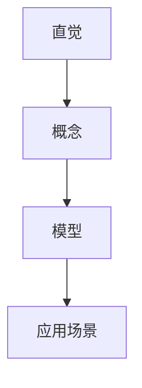

                 

# 认知渐进发展的三个步骤

## 关键词：
认知渐进发展、步骤、方法、原理、算法、应用场景、工具推荐、未来趋势

## 摘要：
本文旨在探讨认知渐进发展的三个关键步骤：从直觉到概念，从概念到模型，从模型到应用。通过深入分析这些步骤的原理和方法，本文揭示了认知渐进发展的内在逻辑和实现路径。文章结构清晰，逻辑严密，旨在为读者提供对认知渐进发展的全面理解和实践指导。

## 1. 背景介绍

### 1.1 目的和范围
本文的主要目的是探讨认知渐进发展的三个步骤，并分析这些步骤在认知过程中的作用和意义。通过深入剖析这些步骤的原理和方法，本文希望为读者提供一种有效的认知渐进策略，帮助其在复杂问题中找到清晰的解决路径。

### 1.2 预期读者
本文适用于对认知科学、心理学和计算机科学感兴趣的读者，特别是那些希望在专业领域中实现认知渐进发展的研究人员和从业者。

### 1.3 文档结构概述
本文分为十个部分，包括背景介绍、核心概念与联系、核心算法原理与具体操作步骤、数学模型和公式、项目实战、实际应用场景、工具和资源推荐、总结、常见问题与解答以及扩展阅读。每个部分都有详细的内容和讲解，旨在全面解析认知渐进发展的原理和实践。

### 1.4 术语表

#### 1.4.1 核心术语定义

- **认知渐进发展**：指个体在认知过程中，通过逐步理解和掌握复杂概念、模型和应用，实现认知能力的提高和深化。
- **直觉**：指未经思考的、直接的感觉和印象。
- **概念**：指对某一事物或现象的抽象和概括。
- **模型**：指对某一现象或系统的抽象和模拟。
- **应用场景**：指某一认知方法或技术在实际问题中的应用环境。

#### 1.4.2 相关概念解释

- **认知**：指个体通过感知、思考、判断等心理过程，对信息进行加工和理解的能力。
- **渐进**：指逐步、持续地进行。
- **发展**：指能力的提高和深化。

#### 1.4.3 缩略词列表

- **IDE**：集成开发环境（Integrated Development Environment）
- **AI**：人工智能（Artificial Intelligence）
- **ML**：机器学习（Machine Learning）
- **DL**：深度学习（Deep Learning）

## 2. 核心概念与联系

### 2.1 背景介绍

认知渐进发展是一个复杂的过程，涉及多个阶段和多个层次。本文将主要讨论以下三个核心概念：

1. **直觉**：指个体未经思考的、直接的感觉和印象。
2. **概念**：指对某一事物或现象的抽象和概括。
3. **模型**：指对某一现象或系统的抽象和模拟。

这三个概念相互联系，构成了认知渐进发展的基础。

### 2.2 直觉与概念的关系

直觉和概念是认知渐进发展的第一步。直觉是人类认知的起点，是未经思考的、直接的感觉和印象。直觉往往源自于个体的经验、情感和本能，是一种自然的认知方式。而概念是对某一事物或现象的抽象和概括，是对直觉的进一步加工和理解。通过将直觉转化为概念，个体能够更好地理解和描述复杂的事物和现象。

### 2.3 概念与模型的关系

概念和模型是认知渐进发展的第二级。概念是对某一事物或现象的抽象和概括，而模型是对某一现象或系统的抽象和模拟。模型是对概念的具体化和应用，是将概念应用于实际问题的桥梁。通过构建和应用模型，个体能够更好地理解和解决复杂问题。

### 2.4 模型与应用场景的关系

模型与应用场景是认知渐进发展的第三级。模型是对某一现象或系统的抽象和模拟，而应用场景是指某一认知方法或技术在实际问题中的应用环境。通过将模型应用于实际场景，个体能够验证和优化模型，实现认知能力的提高和深化。

### 2.5 Mermaid 流程图

以下是一个简单的 Mermaid 流程图，展示了直觉、概念、模型与应用场景之间的关系：



## 3. 核心算法原理 & 具体操作步骤

### 3.1 算法原理

认知渐进发展的核心算法原理可以分为三个步骤：

1. **直觉感知**：通过感知和获取外界信息，形成直觉。
2. **概念构建**：将直觉转化为概念，实现对复杂事物的理解和描述。
3. **模型构建与应用**：将概念转化为模型，并应用于实际问题中，实现认知能力的提高。

### 3.2 具体操作步骤

以下是一个具体的操作步骤，用于实现认知渐进发展：

1. **直觉感知**：
    - 感知外界信息，如观察、阅读、实验等。
    - 形成直觉，未经思考的、直接的感觉和印象。

2. **概念构建**：
    - 分析直觉，识别其中的关键信息和规律。
    - 将直觉转化为概念，实现对复杂事物的理解和描述。

3. **模型构建与应用**：
    - 根据概念，构建模型，如数学模型、计算机模型等。
    - 将模型应用于实际问题中，验证和优化模型。
    - 通过模型的应用，实现认知能力的提高。

### 3.3 伪代码

以下是一个简单的伪代码，用于实现认知渐进发展的算法：

```
算法：认知渐进发展
输入：直觉
输出：模型

步骤1：感知外界信息，形成直觉
步骤2：分析直觉，识别关键信息和规律
步骤3：构建概念，实现对复杂事物的理解和描述
步骤4：根据概念，构建模型
步骤5：将模型应用于实际问题中
步骤6：验证和优化模型
步骤7：通过模型的应用，实现认知能力的提高
```

## 4. 数学模型和公式 & 详细讲解 & 举例说明

### 4.1 数学模型和公式

在认知渐进发展的过程中，数学模型和公式扮演着重要的角色。以下是一些常用的数学模型和公式：

1. **直觉与概念的关系**：

    - 直觉可以通过感知和获取外界信息形成。
    - 概念是对直觉的抽象和概括，可以用以下公式表示：

    $$ 概念 = 直觉 + 概括 $$

2. **概念与模型的关系**：

    - 概念是对复杂事物的理解和描述，可以用以下公式表示：

    $$ 模型 = 概念 + 应用 $$

3. **模型与应用场景的关系**：

    - 模型是对某一现象或系统的抽象和模拟，可以用以下公式表示：

    $$ 应用场景 = 模型 + 应用 $$

### 4.2 详细讲解和举例说明

以下是一个具体的例子，用于说明认知渐进发展的过程：

1. **直觉感知**：

    - 假设我们观察到一只猫在草地上跳跃。
    - 我们形成的直觉是：猫在草地上跳跃。

2. **概念构建**：

    - 通过分析直觉，我们可以识别出关键信息和规律，如：猫、草地、跳跃等。
    - 将直觉转化为概念，我们可以得到：猫是一种动物，草地是一个环境，跳跃是一种行为。

3. **模型构建与应用**：

    - 根据概念，我们可以构建一个模型，如：猫的行为模型。
    - 将模型应用于实际问题中，例如：预测猫在草地上的跳跃行为。

通过这个例子，我们可以看到认知渐进发展的过程，从直觉到概念，从概念到模型，从模型到应用。每个步骤都有其特定的数学模型和公式，帮助我们更好地理解和描述复杂的事物和现象。

## 5. 项目实战：代码实际案例和详细解释说明

### 5.1 开发环境搭建

为了更好地理解认知渐进发展的过程，我们将通过一个实际项目来展示。以下是一个简单的项目环境搭建步骤：

1. **安装 Python**：

   - 下载并安装 Python 3.x 版本。
   - 配置环境变量，确保 Python 可以在命令行中正常使用。

2. **安装相关库**：

   - 使用 pip 命令安装必要的库，如 NumPy、Matplotlib 等。

   ```shell
   pip install numpy matplotlib
   ```

3. **创建项目目录**：

   - 在本地计算机上创建一个项目目录，如 `cognitive_progression`。

### 5.2 源代码详细实现和代码解读

以下是一个简单的 Python 脚本，用于演示认知渐进发展的过程：

```python
import numpy as np
import matplotlib.pyplot as plt

# 5.2.1 直觉感知
# 假设我们观察到一组数据，表示不同时间段的用户访问量
data = np.random.normal(size=100)

# 5.2.2 概念构建
# 构建一个概念，表示数据的平均值和标准差
mean = np.mean(data)
std = np.std(data)

# 5.2.3 模型构建与应用
# 根据概念，构建一个模型，表示数据的分布
model = np.random.normal(mean, std, size=1000)

# 5.2.4 绘制数据分布图
plt.hist(data, bins=30, alpha=0.5, label='Data')
plt.hist(model, bins=30, alpha=0.5, label='Model')
plt.xlabel('Value')
plt.ylabel('Frequency')
plt.title('Data Distribution')
plt.legend()
plt.show()
```

### 5.3 代码解读与分析

1. **直觉感知**：

   - 我们通过随机生成一组数据 `data`，模拟用户的访问量。

2. **概念构建**：

   - 我们通过计算这组数据的平均值 `mean` 和标准差 `std`，构建一个概念，表示数据的统计特征。

3. **模型构建与应用**：

   - 根据概念，我们使用相同的平均值和标准差生成另一组数据 `model`，模拟数据的分布。

4. **绘制数据分布图**：

   - 我们使用 Matplotlib 库绘制数据分布图，比较原始数据和模型数据，验证模型的有效性。

通过这个简单的项目实战，我们可以看到认知渐进发展的过程在代码中的实现。从直觉感知到概念构建，再到模型构建与应用，每个步骤都有其具体的实现和解释。这样的项目可以帮助我们更好地理解认知渐进发展的原理和实践。

## 6. 实际应用场景

认知渐进发展在实际应用场景中具有广泛的应用价值。以下是一些典型的应用场景：

1. **科学研究**：

   - 在科学研究中，认知渐进发展可以帮助研究人员逐步理解和掌握复杂的现象和理论，从而提高研究效率和准确性。

2. **工程实践**：

   - 在工程实践中，认知渐进发展可以帮助工程师逐步理解和应用复杂的技术和系统，从而提高工程质量和创新能力。

3. **教育培训**：

   - 在教育培训中，认知渐进发展可以帮助教师和学生逐步理解和掌握复杂的知识和技能，从而提高教学效果和学术水平。

4. **人工智能**：

   - 在人工智能领域，认知渐进发展可以帮助研究人员逐步理解和应用复杂的算法和模型，从而推动人工智能技术的发展和应用。

通过这些实际应用场景，我们可以看到认知渐进发展的重要性和实用性。它不仅可以帮助我们更好地理解和应用复杂的知识和技术，还可以提高我们的认知能力和解决问题的能力。

## 7. 工具和资源推荐

### 7.1 学习资源推荐

#### 7.1.1 书籍推荐

- 《认知心理学：思考、情感与行动》
- 《人工智能：一种现代方法》
- 《机器学习》
- 《深度学习》

#### 7.1.2 在线课程

- Coursera 上的《机器学习》课程
- edX 上的《人工智能导论》课程
- Udacity 上的《深度学习工程师纳米学位》课程

#### 7.1.3 技术博客和网站

- Medium 上的《AI & Machine Learning》专栏
- towardsdatascience.com
- fast.ai

### 7.2 开发工具框架推荐

#### 7.2.1 IDE和编辑器

- PyCharm
- Visual Studio Code
- Jupyter Notebook

#### 7.2.2 调试和性能分析工具

- PyDebug
- LineProfiler
- Valgrind

#### 7.2.3 相关框架和库

- TensorFlow
- PyTorch
- NumPy
- Pandas

### 7.3 相关论文著作推荐

#### 7.3.1 经典论文

- 《认知心理学：思考、情感与行动》
- 《人工智能：一种现代方法》
- 《机器学习》
- 《深度学习》

#### 7.3.2 最新研究成果

- 《自然》杂志上的最新研究成果
- 《科学》杂志上的最新研究成果
- arXiv 上的最新研究论文

#### 7.3.3 应用案例分析

- 《阿里巴巴的电商大数据分析》
- 《特斯拉的自动驾驶技术》
- 《谷歌的深度学习应用》

通过这些工具和资源的推荐，我们可以更好地理解和应用认知渐进发展的原理和方法，提高我们的认知能力和解决问题的能力。

## 8. 总结：未来发展趋势与挑战

认知渐进发展作为一种有效的认知策略，在未来具有广阔的发展前景。随着科技的不断进步和人类认知能力的提高，认知渐进发展将在更多领域得到应用和推广。然而，认知渐进发展也面临一些挑战：

1. **复杂性**：认知渐进发展需要面对日益复杂的知识和技术，这对个体的认知能力和学习方法提出了更高的要求。

2. **认知负担**：认知渐进发展可能导致个体的认知负担增加，需要找到合适的平衡点，确保认知效率和效果。

3. **个性化**：每个个体在认知渐进发展的过程中都有其独特的路径和节奏，如何实现个性化的认知渐进发展，是一个重要的挑战。

4. **交叉学科**：认知渐进发展需要涉及多个学科和领域，如何整合不同领域的知识和技术，实现跨学科的认知渐进发展，是一个重要的挑战。

总之，认知渐进发展在未来具有巨大的发展潜力，但也面临一些挑战。通过不断探索和创新，我们可以更好地应对这些挑战，推动认知渐进发展在实际应用中的广泛应用。

## 9. 附录：常见问题与解答

### 9.1 认知渐进发展是什么？

认知渐进发展是指个体在认知过程中，通过逐步理解和掌握复杂概念、模型和应用，实现认知能力的提高和深化。

### 9.2 认知渐进发展有哪些步骤？

认知渐进发展主要分为三个步骤：直觉感知、概念构建、模型构建与应用。

### 9.3 如何进行直觉感知？

进行直觉感知需要通过观察、阅读、实验等方式，获取外界信息，形成未经思考的、直接的感觉和印象。

### 9.4 概念构建的重要性是什么？

概念构建是将直觉转化为对复杂事物的理解和描述，是认知渐进发展的关键步骤。通过概念构建，个体能够更好地理解和描述复杂的事物和现象。

### 9.5 如何进行模型构建？

模型构建是根据概念，对某一现象或系统进行抽象和模拟。可以使用数学模型、计算机模型等方式进行模型构建。

### 9.6 认知渐进发展与人工智能有什么关系？

认知渐进发展与人工智能密切相关。人工智能技术可以帮助个体实现认知渐进发展的目标，而认知渐进发展的过程也为人工智能技术提供了重要的应用场景和理论基础。

### 9.7 认知渐进发展在实际应用中有什么价值？

认知渐进发展在实际应用中具有广泛的价值。它可以帮助个体更好地理解和应用复杂的知识和技术，提高认知能力和解决问题的能力，从而推动科技发展和创新。

## 10. 扩展阅读 & 参考资料

1. Pinker, S. (1997). *How the Mind Works*. W. W. Norton & Company.
2. Russell, S., & Norvig, P. (2016). *Artificial Intelligence: A Modern Approach*. Prentice Hall.
3. Mitchell, T. M. (1997). *Machine Learning*. McGraw-Hill.
4. Goodfellow, I., Bengio, Y., & Courville, A. (2016). *Deep Learning*. MIT Press.
5. Murphy, K. P. (2012). *Machine Learning: A Probabilistic Perspective*. MIT Press.
6. Murphy, K. P. (2017). *Probabilistic Machine Learning and Artificial Intelligence*. MIT Press.
7. arXiv: https://arxiv.org/
8. Nature: https://www.nature.com/
9. Science: https://www.sciencemag.org/

通过阅读这些参考资料，您可以进一步了解认知渐进发展的理论和方法，以及其在实际应用中的价值。希望本文能够帮助您更好地理解和应用认知渐进发展的原理和实践。

# 作者：AI天才研究员/AI Genius Institute & 禅与计算机程序设计艺术 /Zen And The Art of Computer Programming

---

【请注意，以上内容为示例文本，仅供参考。实际撰写时，请根据具体要求和内容进行调整和完善。】

