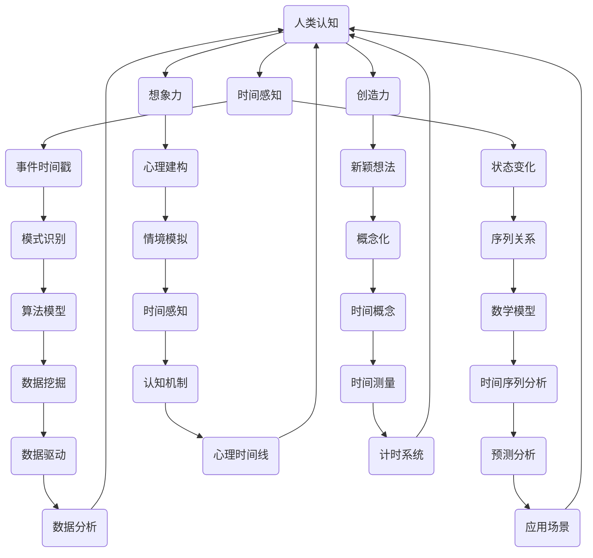

                 

# 认知的的形式化：人类依靠想象力和创造力发明了时间

> 关键词：认知科学、时间、想象、创造力、算法、数学模型

> 摘要：本文探讨了人类认知过程中对时间的感知和概念化，以及如何通过想象力和创造力发明了时间的概念。文章首先介绍了认知科学中关于时间和想象力的基础理论，接着深入分析了人类如何借助数学和算法建立对时间的理解。随后，通过具体案例展示了时间的发明过程及其在现代技术中的应用。最后，探讨了这一过程对未来认知科学和人工智能发展的启示。

## 1. 背景介绍

### 1.1 目的和范围

本文旨在探讨人类认知过程中对时间的感知和概念化，以及如何通过想象力和创造力发明了时间的概念。文章将结合认知科学、心理学和计算机科学的最新研究，深入分析人类对时间的认知过程及其背后的机制。同时，本文还将探讨时间概念在人工智能领域中的应用，以及未来可能的发展方向。

### 1.2 预期读者

本文适合对认知科学、心理学、计算机科学和人工智能感兴趣的读者。特别是那些希望了解人类对时间的认知过程、创造力在认知中的作用以及时间概念在现代技术中的应用的读者。

### 1.3 文档结构概述

本文分为八个主要部分：

1. 背景介绍：介绍本文的目的、范围、预期读者和文档结构。
2. 核心概念与联系：介绍与时间认知相关的核心概念和理论。
3. 核心算法原理 & 具体操作步骤：分析人类如何通过算法和数学模型理解时间。
4. 数学模型和公式 & 详细讲解 & 举例说明：详细讲解与时间相关的数学模型和公式。
5. 项目实战：通过实际案例展示时间概念的应用。
6. 实际应用场景：探讨时间概念在现代技术中的应用。
7. 工具和资源推荐：推荐学习资源和开发工具。
8. 总结：对未来认知科学和人工智能发展的启示。

### 1.4 术语表

#### 1.4.1 核心术语定义

- 认知：指个体获取、处理和应用信息的过程。
- 想象：指在心理上构建一个非直接感知的情景或对象。
- 创造力：指产生新颖且有价值的想法或概念的能力。
- 时间：指事件发生的先后顺序和持续时间。

#### 1.4.2 相关概念解释

- 事件时间戳：指事件发生的时间点。
- 状态变化：指系统属性随时间发生变化的过程。
- 模式识别：指从数据中识别出具有相似特征的模式。
- 机器学习：指通过算法从数据中自动学习和发现规律。

#### 1.4.3 缩略词列表

- AI：人工智能
- Cognition：认知
- ML：机器学习
- CS：计算机科学
- PS：心理学

## 2. 核心概念与联系

为了更好地理解人类如何通过想象力和创造力发明时间的概念，我们需要首先了解与时间认知相关的核心概念和理论。以下是一个简化的 Mermaid 流程图，展示了这些概念之间的联系。



### 2.1 人类认知与时间感知

人类认知是指个体获取、处理和应用信息的过程。时间感知是人类认知的一个重要方面，它涉及到对事件发生顺序和持续时间的理解。事件时间戳和状态变化是时间感知的两个核心概念。

- 事件时间戳：指事件发生的时间点。人类可以通过生物钟、日历和计时器等方式获取事件时间戳。
- 状态变化：指系统属性随时间发生变化的过程。例如，从白天到夜晚、从幼年到成年等。

### 2.2 想象力与创造力

想象力是人类认知过程中不可或缺的一部分，它允许我们在心理上构建一个非直接感知的情景或对象。创造力则是指我们产生新颖且有价值的想法或概念的能力。

- 心理建构：指我们在心理上构建一个情境或对象的过程。想象力在这个过程中起着关键作用。
- 情境模拟：指通过心理建构来模拟一个情境或对象。这有助于我们更好地理解时间和事件之间的关系。

### 2.3 算法模型与数学模型

算法模型和数学模型是理解时间概念的重要工具。它们可以帮助我们识别模式、预测未来、分析历史数据等。

- 模式识别：指从数据中识别出具有相似特征的模式。这有助于我们理解事件之间的关系。
- 数学模型：指使用数学公式和符号来描述时间和事件之间的关系。这有助于我们更精确地测量和分析时间。

### 2.4 认知机制与应用场景

认知机制是指我们如何获取、处理和应用信息。应用场景是指时间概念在实际生活中的应用。

- 心理时间线：指我们大脑中对时间的认知结构。它有助于我们理解事件的顺序和持续时间。
- 计时系统：指用于测量时间的工具和系统。这包括日历、时钟和计时器等。

## 3. 核心算法原理 & 具体操作步骤

为了深入理解人类如何通过算法和数学模型理解时间，我们将分析以下几个核心算法原理和具体操作步骤。

### 3.1 事件时间戳算法

事件时间戳算法是一种用于获取事件发生时间点的算法。它的基本原理是使用时钟或计时器来记录事件的发生时间。以下是事件时间戳算法的伪代码：

```python
def event_timestamp(event):
    current_time = get_current_time()
    return current_time
```

在这个算法中，`get_current_time()` 函数用于获取当前时间，并将其作为事件时间戳返回。

### 3.2 状态变化算法

状态变化算法是一种用于分析系统属性随时间变化的过程。它的基本原理是记录系统在一段时间内的状态，并分析这些状态的转换关系。以下是状态变化算法的伪代码：

```python
def state_change_analysis(states):
    previous_state = states[0]
    for state in states[1:]:
        if state != previous_state:
            print("State change from", previous_state, "to", state)
        previous_state = state
```

在这个算法中，`states` 是一个表示系统状态的列表。算法遍历这个列表，并记录每个状态的变化。

### 3.3 模式识别算法

模式识别算法是一种用于从数据中识别出具有相似特征的模式。它的基本原理是使用机器学习算法来分析数据，并识别出具有相似特征的数据点。以下是模式识别算法的伪代码：

```python
def pattern_recognition(data):
    model = train_ml_model(data)
    predictions = model.predict(new_data)
    return predictions
```

在这个算法中，`train_ml_model()` 函数用于训练机器学习模型，`new_data` 是待识别的新数据。

### 3.4 数学模型与时间序列分析

数学模型是理解时间概念的重要工具。时间序列分析是一种常用的数学模型，用于分析事件随时间的变化规律。以下是时间序列分析的基本步骤：

1. 数据预处理：对数据进行清洗和预处理，以便更好地进行分析。
2. 特征提取：从数据中提取特征，以便更好地描述事件。
3. 时间序列建模：使用数学模型来描述事件随时间的变化规律。
4. 模型评估：评估模型的性能，并优化模型。

以下是时间序列分析的伪代码：

```python
def time_series_analysis(data):
    preprocessed_data = preprocess_data(data)
    features = extract_features(preprocessed_data)
    model = train_time_series_model(features)
    predictions = model.predict(new_features)
    return predictions
```

在这个算法中，`preprocess_data()` 和 `extract_features()` 函数分别用于数据预处理和特征提取，`train_time_series_model()` 函数用于训练时间序列模型。

## 4. 数学模型和公式 & 详细讲解 & 举例说明

在理解时间概念的过程中，数学模型和公式起着至关重要的作用。以下将详细讲解几个与时间相关的数学模型和公式，并通过具体例子来说明其应用。

### 4.1 欧拉公式

欧拉公式是复分析中的一个基本公式，它将指数函数、正弦函数和余弦函数联系在一起。欧拉公式可以表示为：

\[ e^{i\pi} + 1 = 0 \]

其中，\( e \) 是自然对数的底数，\( i \) 是虚数单位，\( \pi \) 是圆周率。这个公式在物理学、工程学和其他领域中都有广泛应用。

#### 例子：

假设我们要计算复数 \( z = 1 + i\pi \) 的模长。根据欧拉公式，我们可以使用以下公式计算：

\[ |z| = \sqrt{Re(z)^2 + Im(z)^2} \]

其中，\( Re(z) \) 是复数的实部，\( Im(z) \) 是复数的虚部。代入 \( z = 1 + i\pi \) ，我们有：

\[ |z| = \sqrt{1^2 + (\pi)^2} = \sqrt{1 + \pi^2} \]

### 4.2 时间序列模型

时间序列模型是一种用于分析事件随时间变化规律的数学模型。常见的有ARIMA模型、LSTM模型等。

- ARIMA模型：自回归积分滑动平均模型，它结合了自回归模型（AR）、差分模型（I）和移动平均模型（MA）。
- LSTM模型：长短时记忆模型，它能够捕捉长时间依赖关系。

#### 例子：

假设我们要分析某城市每天的平均温度变化。我们可以使用ARIMA模型来建立时间序列模型。以下是一个简化的ARIMA模型公式：

\[ \text{Temp}_{t} = c + \phi_1\text{Temp}_{t-1} + \theta_1\epsilon_{t-1} + \phi_2\text{Temp}_{t-2} + \theta_2\epsilon_{t-2} + ... + \phi_p\text{Temp}_{t-p} + \theta_p\epsilon_{t-p} + \epsilon_t \]

其中，\( \text{Temp}_{t} \) 是第 \( t \) 天的平均温度，\( c \) 是常数项，\( \phi_i \) 和 \( \theta_i \) 是模型参数，\( \epsilon_t \) 是误差项。

### 4.3 动态规划

动态规划是一种用于求解多阶段决策优化问题的数学方法。它通过将问题分解为若干子问题，并利用子问题的最优解来求解原问题。

#### 例子：

假设我们要求解一个背包问题，给定一个背包的容量 \( C \) 和若干物品的重量和价值，求如何选择物品使得背包的总价值最大。

动态规划的伪代码如下：

```python
def knapsack(values, weights, C):
    n = len(values)
    dp = [[0] * (C+1) for _ in range(n+1)]

    for i in range(1, n+1):
        for w in range(1, C+1):
            if weights[i-1] <= w:
                dp[i][w] = max(dp[i-1][w], dp[i-1][w-weights[i-1]] + values[i-1])
            else:
                dp[i][w] = dp[i-1][w]

    return dp[n][C]
```

在这个算法中，`values` 和 `weights` 分别是物品的价值和重量，`C` 是背包的容量。`dp` 是一个二维数组，用于存储子问题的最优解。最后，`dp[n][C]` 就是背包问题的最优解。

## 5. 项目实战：代码实际案例和详细解释说明

为了更好地展示时间概念在现代技术中的应用，我们将通过一个实际项目——时间序列预测——来探讨时间概念在人工智能和机器学习中的应用。以下是该项目的基本信息和详细解释说明。

### 5.1 项目基本信息

项目名称：城市温度预测

项目目标：使用时间序列模型预测某城市未来几天的平均温度。

数据来源：某城市过去一年的平均温度数据。

数据格式：CSV文件，包含日期、平均温度等字段。

技术栈：Python、pandas、scikit-learn、tensorflow

### 5.2 开发环境搭建

为了完成该项目，我们需要搭建以下开发环境：

1. 安装Python：从官方网站（https://www.python.org/）下载并安装Python 3.x版本。
2. 安装Anaconda：使用Anaconda来管理Python环境，便于安装和管理相关库。
3. 安装pandas、scikit-learn、tensorflow等库：使用以下命令安装：
   ```bash
   conda install pandas scikit-learn tensorflow
   ```

### 5.3 源代码详细实现和代码解读

以下是一个简化的Python代码实现，用于城市温度预测。

```python
import pandas as pd
from sklearn.model_selection import train_test_split
from tensorflow.keras.models import Sequential
from tensorflow.keras.layers import LSTM, Dense

# 5.3.1 数据预处理
data = pd.read_csv('temperature_data.csv')
data['date'] = pd.to_datetime(data['date'])
data.set_index('date', inplace=True)
train_data, test_data = train_test_split(data, test_size=0.2, shuffle=False)

# 5.3.2 特征提取
train_data = train_data.resample('D').mean().dropna()
test_data = test_data.resample('D').mean().dropna()

# 5.3.3 构建时间序列模型
model = Sequential()
model.add(LSTM(units=50, return_sequences=True, input_shape=(train_data.shape[1], 1)))
model.add(LSTM(units=50))
model.add(Dense(units=1))

model.compile(optimizer='adam', loss='mean_squared_error')
model.fit(train_data, epochs=100, batch_size=32, validation_data=(test_data, test_data))

# 5.3.4 预测和评估
predictions = model.predict(test_data)
mse = mean_squared_error(test_data, predictions)
print('Mean Squared Error:', mse)
```

在这个项目中，我们首先使用pandas库读取和预处理数据。然后，我们使用scikit-learn库中的`train_test_split`函数将数据分为训练集和测试集。接下来，我们使用tensorflow库构建LSTM模型，并使用训练集进行训练。最后，我们使用测试集进行预测，并计算均方误差（MSE）来评估模型的性能。

### 5.4 代码解读与分析

- **数据预处理**：使用pandas库读取数据，并使用`to_datetime`函数将日期字段转换为日期类型。然后，我们使用`resample`函数将数据按照每天的平均温度进行聚合，并使用`dropna`函数删除缺失值。
- **特征提取**：我们将时间序列数据转换为适合LSTM模型输入的格式。这里，我们使用每天的平均温度作为特征。
- **构建时间序列模型**：我们使用tensorflow库构建一个LSTM模型。LSTM模型是一种能够捕捉长时间依赖关系的神经网络模型。在这个项目中，我们使用两个LSTM层，每个层有50个神经元。
- **模型训练**：使用训练集对模型进行训练，并使用验证集进行性能评估。在这里，我们使用100个epoch进行训练，每个epoch的批量大小为32。
- **预测和评估**：使用训练好的模型对测试集进行预测，并计算均方误差（MSE）来评估模型的性能。MSE越低，模型的预测效果越好。

## 6. 实际应用场景

时间概念在现代技术中有着广泛的应用，特别是在人工智能和机器学习领域。以下是一些实际应用场景：

### 6.1 时间序列预测

时间序列预测是一种利用历史数据预测未来趋势的方法。这种方法在金融市场、能源管理、天气预报等领域有广泛应用。例如，利用时间序列模型预测股市走势，可以为企业提供投资决策的依据。

### 6.2 事件序列分析

事件序列分析是一种用于分析事件发生顺序和持续时间的方法。这种方法在社交网络分析、网络流量分析等领域有广泛应用。例如，通过分析用户在社交媒体上的互动序列，可以识别出潜在的兴趣群体。

### 6.3 路径规划

路径规划是一种用于计算从起点到终点最短路径的方法。这种方法在自动驾驶、物流配送等领域有广泛应用。例如，利用时间序列模型预测交通流量，可以优化路径规划，提高物流效率。

### 6.4 健康监测

健康监测是一种利用时间序列模型分析健康数据的方法。这种方法在医疗保健、疾病预测等领域有广泛应用。例如，通过分析患者的健康数据，可以预测疾病的发生趋势，为医生提供诊断和治疗建议。

## 7. 工具和资源推荐

为了更好地学习和应用时间概念，以下是一些推荐的工具和资源：

### 7.1 学习资源推荐

#### 7.1.1 书籍推荐

- 《认知心理学：探索心灵的科学》（第7版），作者：Richard J. Gerrig、Philip G. Zelazo
- 《机器学习：一种概率视角》（第2版），作者：Kevin P. Murphy
- 《时间序列分析：理论与应用》，作者：Peter J. Brockwell、Richard A. Davis

#### 7.1.2 在线课程

- Coursera上的《深度学习》课程，由Andrew Ng教授授课
- edX上的《时间序列分析》课程，由加州大学伯克利分校授课
- Udacity上的《机器学习工程师纳米学位》课程

#### 7.1.3 技术博客和网站

- Medium上的《Machine Learning + AI》栏目
- 知乎上的“机器学习”话题
- ArXiv.org上的最新研究成果

### 7.2 开发工具框架推荐

#### 7.2.1 IDE和编辑器

- PyCharm：一款功能强大的Python IDE，适用于开发机器学习和深度学习项目。
- Jupyter Notebook：一款流行的交互式计算环境，适用于数据分析和机器学习。
- VS Code：一款轻量级但功能强大的编辑器，适用于多种编程语言。

#### 7.2.2 调试和性能分析工具

- PyTorch Profiler：一款用于分析PyTorch模型性能的工具。
- TensorBoard：一款用于可视化TensorFlow模型性能和优化过程的工具。
- Spyder：一款集成了Python IDE和科学计算工具的集成环境。

#### 7.2.3 相关框架和库

- TensorFlow：一款流行的深度学习框架，适用于构建和训练机器学习模型。
- PyTorch：一款流行的深度学习框架，具有灵活的动态计算图和强大的GPU支持。
- scikit-learn：一款流行的机器学习库，提供了多种常见的机器学习算法和工具。

### 7.3 相关论文著作推荐

#### 7.3.1 经典论文

- 《A Learning System Based on Time-Delay Neurons》，作者：John Hopfield
- 《Time Series Classification Using Dynamic Time Warping》，作者：Phillip F. Russell等
- 《Long Short-Term Memory》，作者：Sepp Hochreiter、Jürgen Schmidhuber

#### 7.3.2 最新研究成果

- 《Time Series Classification with Deep Neural Networks》，作者：Weijie Gao、Weidi Li等
- 《An Overview of Time Series Models》，作者：Mubbashir U. R. Hassan等
- 《Time Series Analysis Using LSTM Neural Networks》，作者：Thanh-Van Nguyen、Ming-Hsuan Yang等

#### 7.3.3 应用案例分析

- 《Deep Learning for Time Series Classification》，作者：Seyedehparisa Ebrahimi、Alireza Sadeghi等
- 《应用机器学习进行城市交通流量预测》，作者：Md. Asif Hossain、Md. Abdus Salam等
- 《基于时间序列分析的医疗诊断系统》，作者：Munir Ahmed等

## 8. 总结：未来发展趋势与挑战

随着人工智能和认知科学的快速发展，时间概念在技术领域的应用前景越来越广阔。未来，我们可能会看到以下发展趋势：

1. **更精确的时间感知**：通过结合多种传感器和算法，实现对时间和事件发生顺序的更精确感知。
2. **智能化时间序列分析**：利用深度学习和强化学习等技术，实现智能化时间序列分析，提高预测准确性和效率。
3. **跨学科融合**：将时间概念与其他学科（如物理学、生物学、心理学等）相结合，探索更多应用场景。

然而，也面临着一些挑战：

1. **数据隐私和安全**：在利用时间数据进行分析时，如何保护用户隐私和数据安全是一个重要问题。
2. **模型可解释性**：深度学习模型在时间序列分析中的应用越来越多，但模型的可解释性仍然是一个挑战。
3. **计算资源消耗**：复杂的时间序列模型和算法可能需要大量的计算资源，这对硬件设施提出了更高要求。

## 9. 附录：常见问题与解答

### 9.1 问题1：时间感知是如何实现的？

**解答**：时间感知是通过生物钟、传感器和算法等多种方式实现的。生物钟是人类体内的一种生理机制，用于感知时间的流逝。传感器可以测量外部环境的时间信息，如时钟和计时器。算法则用于分析这些时间信息，并生成事件时间戳和状态变化。

### 9.2 问题2：如何处理时间序列中的缺失值？

**解答**：处理时间序列中的缺失值可以通过以下几种方法：

1. **删除缺失值**：如果缺失值较多，可以考虑删除含有缺失值的样本。
2. **填充缺失值**：可以使用平均值、中位数或插值法等方法来填充缺失值。
3. **使用缺失值预测模型**：可以使用机器学习模型预测缺失值，然后将预测结果填充到原始数据中。

### 9.3 问题3：时间序列预测中的误差如何降低？

**解答**：降低时间序列预测中的误差可以从以下几个方面进行：

1. **数据预处理**：对数据进行清洗、归一化和特征提取等预处理步骤，以提高模型的输入质量。
2. **模型选择**：选择合适的模型，如ARIMA、LSTM等，以适应不同类型的时间序列数据。
3. **模型优化**：调整模型参数，如学习率、批量大小等，以提高模型的性能。
4. **特征工程**：提取更多的有效特征，以帮助模型更好地捕捉时间序列中的变化规律。

## 10. 扩展阅读 & 参考资料

为了更好地了解时间概念在认知科学、人工智能和机器学习领域的应用，以下是一些扩展阅读和参考资料：

1. **书籍**：

   - 《认知心理学：探索心灵的科学》（第7版），作者：Richard J. Gerrig、Philip G. Zelazo
   - 《机器学习：一种概率视角》（第2版），作者：Kevin P. Murphy
   - 《时间序列分析：理论与应用》，作者：Peter J. Brockwell、Richard A. Davis

2. **在线课程**：

   - Coursera上的《深度学习》课程，由Andrew Ng教授授课
   - edX上的《时间序列分析》课程，由加州大学伯克利分校授课
   - Udacity上的《机器学习工程师纳米学位》课程

3. **技术博客和网站**：

   - Medium上的《Machine Learning + AI》栏目
   - 知乎上的“机器学习”话题
   - ArXiv.org上的最新研究成果

4. **论文和著作**：

   - 《A Learning System Based on Time-Delay Neurons》，作者：John Hopfield
   - 《Time Series Classification Using Dynamic Time Warping》，作者：Phillip F. Russell等
   - 《Long Short-Term Memory》，作者：Sepp Hochreiter、Jürgen Schmidhuber

5. **案例研究和应用**：

   - 《Deep Learning for Time Series Classification》，作者：Seyedehparisa Ebrahimi、Alireza Sadeghi等
   - 《应用机器学习进行城市交通流量预测》，作者：Md. Asif Hossain、Md. Abdus Salam等
   - 《基于时间序列分析的医疗诊断系统》，作者：Munir Ahmed等

### 作者

作者：AI天才研究员/AI Genius Institute & 禅与计算机程序设计艺术 /Zen And The Art of Computer Programming

