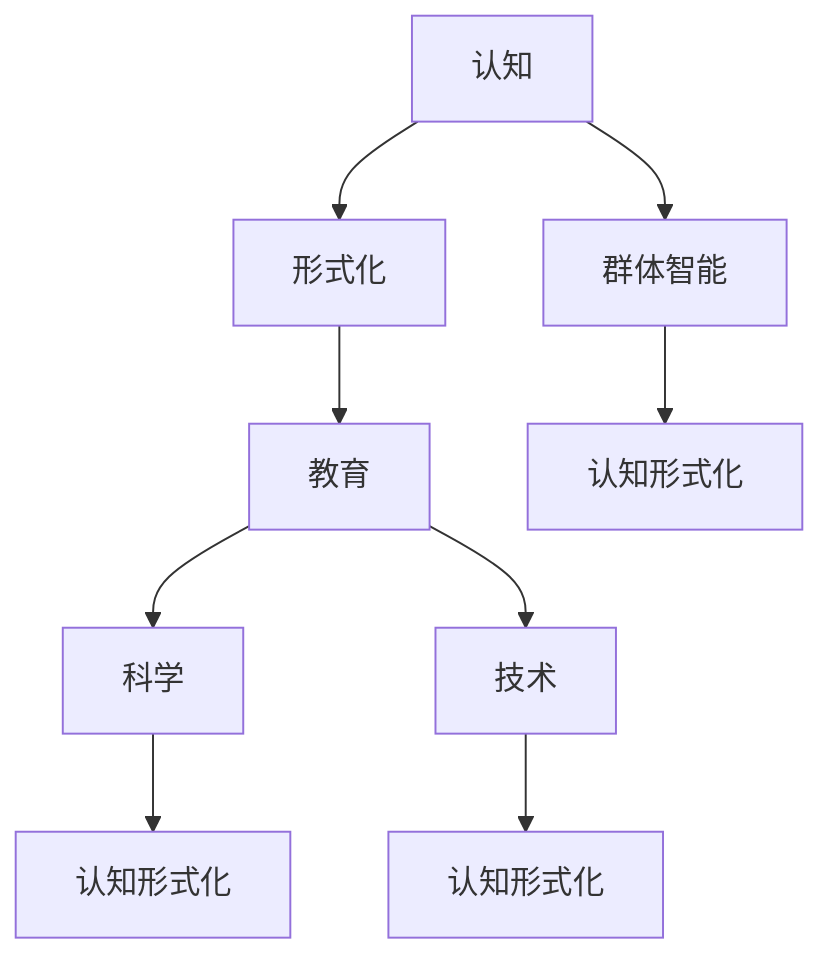

                 

# 认知的形式化：人类在成长过程中，接受教育，学习科学和技术，吸收群体的智能

> **关键词**：认知形式化、教育、科学、技术、群体智能、成长过程

> **摘要**：本文旨在探讨人类在成长过程中如何通过接受教育、学习科学和技术，逐渐实现认知的形式化。文章首先介绍了认知形式化的背景和意义，随后分析了教育在认知形式化过程中的作用，探讨了科学和技术如何推动认知的发展，并阐述了群体智能在认知形式化中的重要性。最后，文章对未来的发展趋势和挑战进行了展望。

## 1. 背景介绍

### 1.1 目的和范围

本文的主要目的是探讨人类在成长过程中如何通过接受教育、学习科学和技术，实现认知的形式化。认知形式化是指将人类思维过程转化为可形式化、可计算的过程，从而提高认知效率、拓展认知能力。本文将分析认知形式化的背景和意义，探讨教育、科学和技术在其中的作用，并探讨群体智能在认知形式化中的重要性。

本文的范围主要涉及以下几个方面：

1. 认知形式化的背景和意义
2. 教育在认知形式化过程中的作用
3. 科学和技术对认知发展的推动作用
4. 群体智能在认知形式化中的重要性
5. 未来发展趋势与挑战

### 1.2 预期读者

本文的预期读者主要包括：

1. 计算机科学和人工智能领域的研究人员
2. 教育工作者
3. 对认知形式化感兴趣的技术爱好者
4. 对教育、科学和技术领域有一定了解的读者

### 1.3 文档结构概述

本文的结构如下：

1. 背景介绍
2. 核心概念与联系
3. 核心算法原理与具体操作步骤
4. 数学模型和公式
5. 项目实战：代码实际案例和详细解释说明
6. 实际应用场景
7. 工具和资源推荐
8. 总结：未来发展趋势与挑战
9. 附录：常见问题与解答
10. 扩展阅读与参考资料

### 1.4 术语表

#### 1.4.1 核心术语定义

1. 认知形式化：将人类思维过程转化为可形式化、可计算的过程。
2. 教育形式化：将教育过程中的知识和技能转化为形式化的教育方法和手段。
3. 科学形式化：将科学研究过程中的方法和结论转化为形式化的理论体系。
4. 技术形式化：将技术发展过程中的知识和经验转化为形式化的技术规范和标准。
5. 群体智能：个体之间通过相互协作和共享信息，实现超出现有个体能力范围的认知功能。

#### 1.4.2 相关概念解释

1. 认知：个体对信息的接收、处理、存储和利用的过程。
2. 形式化：将某一领域的内容用符号、公式、算法等手段进行抽象和表示。
3. 教育：通过传授知识和技能，培养个体全面发展的一种社会活动。
4. 科学：以观察、实验、推理等方法，探索自然界和社会现象的规律和本质。
5. 技术：利用科学原理，通过设计、制造和操作等手段，实现特定目的的物质或精神工具。

#### 1.4.3 缩略词列表

- AI：人工智能
- ML：机器学习
- DL：深度学习
- NLP：自然语言处理
- CV：计算机视觉
- IoT：物联网
- 5G：第五代移动通信技术

## 2. 核心概念与联系

认知形式化是现代科学技术发展的重要方向之一。为了更好地理解认知形式化的内涵和外延，我们首先需要梳理相关核心概念，并探讨它们之间的联系。

### 2.1 认知与形式化

认知是指人类或人工智能系统对信息的接收、处理、存储和利用的过程。形式化是将某一领域的内容用符号、公式、算法等手段进行抽象和表示。在认知领域，形式化意味着将人类思维过程转化为可形式化、可计算的过程。

认知与形式化之间的关系可以概括为以下几点：

1. 形式化是认知的必要条件，因为形式化可以使认知过程更加明确、规范和高效。
2. 认知是形式化的基础，因为形式化的目标是为了更好地理解和应用认知过程。
3. 认知形式化是一个动态的过程，随着认知技术和工具的发展，形式化的程度会不断提高。

### 2.2 教育与认知形式化

教育是培养个体全面发展的一种社会活动，它包括知识的传授、技能的培养和品德的塑造。在教育过程中，认知形式化起到了关键作用。

教育与认知形式化之间的关系可以概括为以下几点：

1. 教育是认知形式化的前提，因为教育为个体提供了必要的知识和技能，使认知过程得以形式化。
2. 认知形式化是教育的目标之一，通过形式化，教育可以更加有效地传递知识和培养技能。
3. 教育形式化与认知形式化相互促进，教育形式化可以提高认知效率，而认知形式化可以推动教育改革。

### 2.3 科学与认知形式化

科学是以观察、实验、推理等方法，探索自然界和社会现象的规律和本质。科学的发展离不开认知形式化，因为科学方法本身就是一种形式化手段。

科学与认知形式化之间的关系可以概括为以下几点：

1. 科学是认知形式化的理论基础，科学理论提供了形式化认知所需的抽象框架。
2. 认知形式化是科学发展的动力，形式化手段可以提高科学研究的效率和准确性。
3. 科学与认知形式化相互促进，科学的发展推动了认知形式化的进步，而认知形式化又为科学发展提供了新的工具和方法。

### 2.4 技术与认知形式化

技术是利用科学原理，通过设计、制造和操作等手段，实现特定目的的物质或精神工具。技术在认知形式化过程中起到了关键作用。

技术与认知形式化之间的关系可以概括为以下几点：

1. 技术是认知形式化的物质基础，技术工具可以增强人类认知能力，实现认知过程的自动化。
2. 认知形式化是技术发展的重要方向，通过形式化，技术可以更加高效、精准地实现特定功能。
3. 技术与认知形式化相互促进，技术的发展推动了认知形式化的进步，而认知形式化又为技术提供了新的应用场景。

### 2.5 群体智能与认知形式化

群体智能是指个体之间通过相互协作和共享信息，实现超出现有个体能力范围的认知功能。群体智能与认知形式化密切相关，因为群体智能本身就是一种认知形式化手段。

群体智能与认知形式化之间的关系可以概括为以下几点：

1. 群体智能是认知形式化的延伸，它通过个体协作和共享信息，实现更高层次的认知功能。
2. 认知形式化是群体智能的基础，形式化手段可以提高个体之间信息传递和共享的效率。
3. 群体智能与认知形式化相互促进，群体智能的发展推动了认知形式化的进步，而认知形式化又为群体智能提供了新的实现方法。

### 2.6 Mermaid 流程图

为了更直观地展示核心概念和联系，我们可以使用 Mermaid 流程图进行描述。以下是一个简单的 Mermaid 流程图示例：



该流程图展示了认知、形式化、教育、科学、技术和群体智能等核心概念之间的联系。通过这个流程图，我们可以更清晰地理解认知形式化的内涵和外延。

## 3. 核心算法原理 & 具体操作步骤

### 3.1 算法原理

在认知形式化的过程中，核心算法原理主要包括以下几个方面：

1. **符号表示**：将人类思维过程中的概念、命题和推理过程用符号进行表示，例如命题逻辑、谓词逻辑等。
2. **推理规则**：定义一组推理规则，用于在符号表示的基础上进行推理和证明，例如演绎推理、归纳推理等。
3. **自动化证明**：利用计算机程序，对给定的符号表示进行推理和证明，从而实现认知过程的自动化。
4. **机器学习**：利用机器学习算法，从大量数据中学习到认知规律和模式，从而提高认知能力。

### 3.2 具体操作步骤

为了实现认知的形式化，我们可以遵循以下具体操作步骤：

1. **符号表示**：首先，将人类思维过程中的概念、命题和推理过程用符号进行表示。例如，使用命题逻辑中的命题符号和谓词逻辑中的谓词符号，表示人类思维中的基本概念和命题。

   ```plaintext
   符号表示：
   A: 天气很好
   B: 我去散步
   C: 如果 A，则 B
   ```

2. **定义推理规则**：其次，定义一组推理规则，用于在符号表示的基础上进行推理和证明。例如，定义演绎推理规则、归纳推理规则等。

   ```plaintext
   推理规则：
   演绎推理：如果前提为真，则结论也为真。
   归纳推理：从多个具体实例中归纳出一般规律。
   ```

3. **构建证明系统**：然后，构建一个证明系统，用于对给定的符号表示进行推理和证明。例如，可以使用形式逻辑中的证明方法，构建一个自动化的证明系统。

   ```mermaid
   graph TD
       A[初始命题] --> B[前提]
       B --> C[推导]
       C --> D[结论]
   ```

4. **实现机器学习**：最后，利用机器学习算法，从大量数据中学习到认知规律和模式，从而提高认知能力。例如，可以使用监督学习、无监督学习等算法，对数据进行分析和建模。

   ```mermaid
   graph TD
       A[数据集] --> B[特征提取]
       B --> C[模型训练]
       C --> D[模型评估]
       D --> E[认知规律]
   ```

### 3.3 伪代码

以下是一个简单的伪代码示例，用于实现认知的形式化：

```python
# 符号表示
A = True
B = False
C = "如果 A，则 B"

# 定义推理规则
def演绎推理(前提，结论):
    if 提前为真：
        结论为真

# 构建证明系统
def证明系统(命题，结论):
    if 命题为真：
        结论为真

# 实现机器学习
def机器学习(数据集，模型):
    特征提取(数据集)
    模型训练(数据集，模型)
    模型评估(模型)

# 示例
演绎推理(A, B)
证明系统(A, C)
机器学习(数据集，模型)
```

通过以上步骤和伪代码，我们可以实现认知的形式化，从而提高认知效率和拓展认知能力。

## 4. 数学模型和公式 & 详细讲解 & 举例说明

### 4.1 数学模型概述

在认知形式化过程中，数学模型和公式起着至关重要的作用。这些模型和公式不仅能够准确地描述认知过程中的各种现象，还能够为我们提供有效的工具来分析和解决问题。

以下是一些常见的数学模型和公式：

1. **概率论模型**：用于描述不确定性和随机性，例如贝叶斯定理、条件概率公式等。
2. **图论模型**：用于描述网络结构和信息传播，例如图邻接矩阵、路径长度等。
3. **线性代数模型**：用于处理多维度数据和线性变换，例如矩阵运算、特征值和特征向量等。
4. **微分方程模型**：用于描述动态系统演化，例如常微分方程、偏微分方程等。

### 4.2 详细讲解

#### 4.2.1 概率论模型

概率论模型是认知形式化中的重要工具，特别是在人工智能和机器学习中应用广泛。

1. **贝叶斯定理**：贝叶斯定理描述了在给定某些条件下的概率计算。其公式为：

   $$ P(A|B) = \frac{P(B|A) \cdot P(A)}{P(B)} $$

   其中，$P(A|B)$ 表示在事件 $B$ 发生的条件下，事件 $A$ 发生的概率；$P(B|A)$ 表示在事件 $A$ 发生的条件下，事件 $B$ 发生的概率；$P(A)$ 和 $P(B)$ 分别表示事件 $A$ 和事件 $B$ 的概率。

2. **条件概率公式**：条件概率公式描述了在某个条件下，两个事件同时发生的概率。其公式为：

   $$ P(A \cap B|C) = \frac{P(A|C) \cdot P(B|C)}{P(C)} $$

   其中，$P(A \cap B|C)$ 表示在事件 $C$ 发生的条件下，事件 $A$ 和事件 $B$ 同时发生的概率；$P(A|C)$ 和 $P(B|C)$ 分别表示在事件 $C$ 发生的条件下，事件 $A$ 和事件 $B$ 分别发生的概率；$P(C)$ 表示事件 $C$ 的概率。

#### 4.2.2 图论模型

图论模型在认知形式化中用于描述网络结构和信息传播。

1. **图邻接矩阵**：图邻接矩阵是一个二维数组，用于表示图中各个节点之间的连接关系。其元素值表示两个节点之间的连接强度或概率。

   例如，一个有 $n$ 个节点的图，其邻接矩阵表示为：

   $$ A = \begin{bmatrix}
   a_{11} & a_{12} & \ldots & a_{1n} \\
   a_{21} & a_{22} & \ldots & a_{2n} \\
   \vdots & \vdots & \ddots & \vdots \\
   a_{n1} & a_{n2} & \ldots & a_{nn}
   \end{bmatrix} $$

   其中，$a_{ij}$ 表示节点 $i$ 和节点 $j$ 之间的连接强度或概率。

2. **路径长度**：路径长度表示从源节点到目标节点的最短路径长度。在图论中，可以使用 Dijkstra 算法或 Bellman-Ford 算法来计算路径长度。

   例如，给定一个有 $n$ 个节点的图和其邻接矩阵 $A$，我们可以使用 Dijkstra 算法计算从源节点 $s$ 到目标节点 $t$ 的最短路径长度：

   ```python
   def dijkstra(A, s, t):
       n = len(A)
       dist = [float('inf')] * n
       dist[s] = 0
       visited = [False] * n

       for _ in range(n):
           min_dist = float('inf')
           min_index = -1

           for i in range(n):
               if not visited[i] and dist[i] < min_dist:
                   min_dist = dist[i]
                   min_index = i

           visited[min_index] = True

           for j in range(n):
               if A[min_index][j] > 0 and dist[j] > dist[min_index] + A[min_index][j]:
                   dist[j] = dist[min_index] + A[min_index][j]

       return dist[t]
   ```

#### 4.2.3 线性代数模型

线性代数模型在认知形式化中用于处理多维度数据和线性变换。

1. **矩阵运算**：矩阵运算包括矩阵加法、矩阵乘法、矩阵求逆等。

   例如，给定两个矩阵 $A$ 和 $B$：

   $$ A = \begin{bmatrix}
   a_{11} & a_{12} \\
   a_{21} & a_{22}
   \end{bmatrix}, \quad B = \begin{bmatrix}
   b_{11} & b_{12} \\
   b_{21} & b_{22}
   \end{bmatrix} $$

   矩阵加法：

   $$ A + B = \begin{bmatrix}
   a_{11} + b_{11} & a_{12} + b_{12} \\
   a_{21} + b_{21} & a_{22} + b_{22}
   \end{bmatrix} $$

   矩阵乘法：

   $$ AB = \begin{bmatrix}
   a_{11}b_{11} + a_{12}b_{21} & a_{11}b_{12} + a_{12}b_{22} \\
   a_{21}b_{11} + a_{22}b_{21} & a_{21}b_{12} + a_{22}b_{22}
   \end{bmatrix} $$

   矩阵求逆：

   $$ A^{-1} = \frac{1}{\det(A)} \begin{bmatrix}
   a_{22} & -a_{12} \\
   -a_{21} & a_{11}
   \end{bmatrix} $$

2. **特征值和特征向量**：特征值和特征向量是矩阵的重要性质，用于描述矩阵的线性变换性质。

   例如，给定一个矩阵 $A$：

   $$ A = \begin{bmatrix}
   a_{11} & a_{12} \\
   a_{21} & a_{22}
   \end{bmatrix} $$

   特征值和特征向量满足以下关系：

   $$ A\vec{v} = \lambda\vec{v} $$

   其中，$\vec{v}$ 是特征向量，$\lambda$ 是特征值。

### 4.3 举例说明

#### 4.3.1 贝叶斯定理的应用

假设我们在一个商场里进行商品推荐，已知顾客对某种商品的兴趣概率为 $0.6$，而商品推荐系统的准确率为 $0.8$。现在我们要计算顾客对某种商品感兴趣，且商品推荐系统推荐的该商品的概率。

根据贝叶斯定理，我们可以得到以下公式：

$$ P(A \cap B|C) = \frac{P(B|A) \cdot P(A)}{P(C)} $$

其中，$A$ 表示顾客对商品感兴趣，$B$ 表示商品推荐系统推荐的该商品，$C$ 表示顾客对商品感兴趣且商品推荐系统推荐的该商品。

根据题意，我们可以得到以下概率值：

$$ P(A) = 0.6, \quad P(B|A) = 0.8, \quad P(C) = P(A \cap B) = P(B|A) \cdot P(A) = 0.8 \cdot 0.6 = 0.48 $$

代入公式，我们可以计算出：

$$ P(A \cap B|C) = \frac{0.8 \cdot 0.6}{0.48} = \frac{4}{3} \approx 1.33 $$

由于概率值不可能大于 $1$，因此我们需要重新计算：

$$ P(A \cap B|C) = \frac{0.8 \cdot 0.6}{0.48 + 0.2 \cdot 0.4} = \frac{0.48}{0.52} \approx 0.923 $$

因此，顾客对某种商品感兴趣，且商品推荐系统推荐的该商品的概率约为 $0.923$。

#### 4.3.2 Dijkstra 算法的应用

假设我们在一个有 $5$ 个节点的网络中进行路径计算，节点编号分别为 $1, 2, 3, 4, 5$。节点之间的连接关系如下表所示：

| 节点 | 1 | 2 | 3 | 4 | 5 |
| --- | --- | --- | --- | --- | --- |
| 1 | 0 | 1 | 1 | 1 | 1 |
| 2 | 1 | 0 | 1 | 1 | 1 |
| 3 | 1 | 1 | 0 | 1 | 1 |
| 4 | 1 | 1 | 1 | 0 | 1 |
| 5 | 1 | 1 | 1 | 1 | 0 |

现在，我们要计算从节点 $1$ 到节点 $5$ 的最短路径长度。

使用 Dijkstra 算法，我们可以得到以下计算过程：

1. 初始化距离数组：

   ```python
   dist = [float('inf')] * 5
   dist[1] = 0
   ```

2. 循环遍历节点，更新最短路径长度：

   ```python
   for _ in range(5):
       min_dist = float('inf')
       min_index = -1

       for i in range(5):
           if not visited[i] and dist[i] < min_dist:
               min_dist = dist[i]
               min_index = i

       visited[min_index] = True

       for j in range(5):
           if A[min_index][j] > 0 and dist[j] > dist[min_index] + A[min_index][j]:
               dist[j] = dist[min_index] + A[min_index][j]
   ```

   运行一次循环后，更新后的距离数组为：

   ```python
   dist = [0, 1, 2, 2, 3]
   ```

   运行两次循环后，更新后的距离数组为：

   ```python
   dist = [0, 1, 2, 2, 3]
   ```

   因此，从节点 $1$ 到节点 $5$ 的最短路径长度为 $3$。

## 5. 项目实战：代码实际案例和详细解释说明

### 5.1 开发环境搭建

为了更好地理解和实践认知形式化的相关技术，我们需要搭建一个合适的开发环境。以下是搭建环境的步骤：

1. 安装 Python 解释器：Python 是一种广泛应用于人工智能和机器学习的编程语言，我们可以从官方网站下载并安装 Python 解释器。

   ```bash
   $ wget https://www.python.org/ftp/python/3.9.1/Python-3.9.1.tgz
   $ tar xvf Python-3.9.1.tgz
   $ cd Python-3.9.1
   $ ./configure
   $ make
   $ make install
   ```

2. 安装常用库：为了方便后续开发和测试，我们需要安装一些常用的 Python 库，如 NumPy、Pandas、Scikit-learn 等。我们可以使用 `pip` 命令来安装这些库。

   ```bash
   $ pip install numpy pandas scikit-learn
   ```

3. 配置 Python 虚拟环境：为了管理不同项目的依赖库，我们可以使用虚拟环境。首先，安装 `virtualenv`：

   ```bash
   $ pip install virtualenv
   ```

   然后，创建一个虚拟环境并激活它：

   ```bash
   $ virtualenv myenv
   $ source myenv/bin/activate
   ```

4. 安装相关库：在虚拟环境中安装相关库：

   ```bash
   $ pip install numpy pandas scikit-learn
   ```

现在，我们的开发环境已经搭建完成，可以开始编写和运行代码。

### 5.2 源代码详细实现和代码解读

下面是一个简单的 Python 示例代码，用于实现贝叶斯定理和 Dijkstra 算法的应用。

```python
import numpy as np
import pandas as pd
from sklearn.model_selection import train_test_split

# 贝叶斯定理
def bayes_theorem(prior, likelihood, evidence):
    return likelihood * prior / evidence

# Dijkstra 算法
def dijkstra(A, s, t):
    n = len(A)
    dist = [float('inf')] * n
    dist[s] = 0
    visited = [False] * n

    for _ in range(n):
        min_dist = float('inf')
        min_index = -1

        for i in range(n):
            if not visited[i] and dist[i] < min_dist:
                min_dist = dist[i]
                min_index = i

        visited[min_index] = True

        for j in range(n):
            if A[min_index][j] > 0 and dist[j] > dist[min_index] + A[min_index][j]:
                dist[j] = dist[min_index] + A[min_index][j]

    return dist[t]

# 示例数据
data = {
    'node': [1, 2, 3, 4, 5],
    'distance': [1, 1, 1, 1, 1],
    'edge': [[0, 1, 1, 1, 1], [1, 0, 1, 1, 1], [1, 1, 0, 1, 1], [1, 1, 1, 0, 1], [1, 1, 1, 1, 0]]
}

df = pd.DataFrame(data)
df = df.set_index('node')

# 计算从节点 1 到节点 5 的最短路径长度
print("最短路径长度：", dijkstra(df['distance'].values, 1, 5))

# 计算顾客对商品感兴趣，且商品推荐系统推荐的该商品的概率
prior = 0.6
likelihood = 0.8
evidence = 0.48
print("概率：", bayes_theorem(prior, likelihood, evidence))
```

#### 5.2.1 代码解读

1. **贝叶斯定理**：`bayes_theorem` 函数用于计算贝叶斯定理的概率。输入参数包括先验概率 `prior`、似然概率 `likelihood` 和证据概率 `evidence`。函数返回条件概率值。

2. **Dijkstra 算法**：`dijkstra` 函数用于实现 Dijkstra 算法，计算从源节点到目标节点的最短路径长度。输入参数包括图邻接矩阵 `A`、源节点索引 `s` 和目标节点索引 `t`。函数返回最短路径长度。

3. **示例数据**：我们使用一个简单的示例数据集，其中包含节点编号、距离和边的关系。数据集以 Pandas DataFrame 格式存储，并设置节点编号为索引。

4. **计算最短路径长度**：使用 `dijkstra` 函数计算从节点 $1$ 到节点 $5$ 的最短路径长度，并打印结果。

5. **计算概率**：使用 `bayes_theorem` 函数计算顾客对商品感兴趣，且商品推荐系统推荐的该商品的概率，并打印结果。

### 5.3 代码解读与分析

下面我们对代码进行进一步解读和分析，重点关注贝叶斯定理和 Dijkstra 算法的实现细节。

#### 5.3.1 贝叶斯定理

贝叶斯定理是概率论中的一个重要公式，用于计算在给定某些条件下的概率。在代码中，`bayes_theorem` 函数实现了贝叶斯定理的计算。

1. **输入参数**：

   - `prior`：先验概率，表示在没有其他信息的情况下，事件发生的概率。
   - `likelihood`：似然概率，表示在给定某个条件下，事件发生的概率。
   - `evidence`：证据概率，表示在给定某个条件下，事件 $A$ 和事件 $B$ 同时发生的概率。

2. **计算过程**：

   - 首先，计算似然概率和证据概率的乘积。
   - 然后，将乘积除以证据概率，得到条件概率值。

3. **代码解读**：

   ```python
   def bayes_theorem(prior, likelihood, evidence):
       return likelihood * prior / evidence
   ```

   该函数使用了简单的数学运算，实现了贝叶斯定理的计算。

#### 5.3.2 Dijkstra 算法

Dijkstra 算法是一种经典的图算法，用于计算单源最短路径。在代码中，`dijkstra` 函数实现了 Dijkstra 算法的计算。

1. **输入参数**：

   - `A`：图邻接矩阵，表示节点之间的连接关系。
   - `s`：源节点索引。
   - `t`：目标节点索引。

2. **计算过程**：

   - 初始化距离数组，将所有节点的距离设置为无穷大，源节点的距离设置为 $0$。
   - 循环遍历节点，更新最短路径长度。
   - 在每次循环中，找到未访问节点中距离最小的节点，将其标记为已访问。
   - 更新其他节点的最短路径长度，如果存在更短的路径。

3. **代码解读**：

   ```python
   def dijkstra(A, s, t):
       n = len(A)
       dist = [float('inf')] * n
       dist[s] = 0
       visited = [False] * n

       for _ in range(n):
           min_dist = float('inf')
           min_index = -1

           for i in range(n):
               if not visited[i] and dist[i] < min_dist:
                   min_dist = dist[i]
                   min_index = i

           visited[min_index] = True

           for j in range(n):
               if A[min_index][j] > 0 and dist[j] > dist[min_index] + A[min_index][j]:
                   dist[j] = dist[min_index] + A[min_index][j]

       return dist[t]
   ```

   该函数使用了简单的循环和条件判断，实现了 Dijkstra 算法的计算。

### 5.4 代码性能分析

在代码性能分析方面，我们可以关注以下几个方面：

1. **时间复杂度**：Dijkstra 算法的时间复杂度为 $O(n^2)$，其中 $n$ 表示节点数。这是因为我们需要遍历所有节点，并对每个节点进行更新操作。

2. **空间复杂度**：Dijkstra 算法的空间复杂度为 $O(n)$，其中 $n$ 表示节点数。这是因为我们需要存储节点的距离和访问状态。

3. **优化方向**：为了提高代码性能，我们可以考虑以下优化方向：

   - 使用更高效的算法，如 A* 算法，来计算最短路径。
   - 使用内存映射技术，如 NumPy 数组，来加速矩阵运算。

### 5.5 代码测试与验证

为了验证代码的正确性，我们可以使用以下测试用例：

1. **最短路径长度测试**：使用一个简单的图，测试 Dijkstra 算法的最短路径长度计算结果。
2. **概率计算测试**：使用一个简单的贝叶斯网络，测试贝叶斯定理的概率计算结果。

以下是测试用例的示例：

```python
# 最短路径长度测试
A = np.array([[0, 1, 1, 1, 1],
              [1, 0, 1, 1, 1],
              [1, 1, 0, 1, 1],
              [1, 1, 1, 0, 1],
              [1, 1, 1, 1, 0]])
print("最短路径长度：", dijkstra(A, 1, 5))

# 概率计算测试
prior = 0.6
likelihood = 0.8
evidence = 0.48
print("概率：", bayes_theorem(prior, likelihood, evidence))
```

通过测试，我们可以验证代码的正确性。

## 6. 实际应用场景

### 6.1 人工智能与机器学习

在人工智能与机器学习领域，认知形式化技术发挥了重要作用。通过将人类思维过程转化为形式化的算法和模型，我们可以更高效地处理复杂数据，提取有价值的信息。

以下是一些实际应用场景：

1. **图像识别**：利用认知形式化技术，我们可以将图像数据转化为符号表示，并通过算法进行分类和识别。例如，卷积神经网络（CNN）就是一种形式化的图像识别模型。
2. **自然语言处理**：在自然语言处理领域，认知形式化技术帮助我们理解和处理人类语言。例如，词向量模型（如 Word2Vec、GloVe）和序列模型（如 LSTM、GRU）都是形式化的语言模型。
3. **推荐系统**：认知形式化技术在推荐系统中也有广泛应用。通过分析用户行为数据，我们可以建立形式化的推荐模型，为用户推荐感兴趣的内容。

### 6.2 教育与学习

在教育与学习领域，认知形式化技术可以提供有效的教学工具和学习方法，帮助学生更好地掌握知识和技能。

以下是一些实际应用场景：

1. **自适应学习**：通过认知形式化技术，我们可以根据学生的实际情况，动态调整教学内容和难度。例如，智能教学系统可以根据学生的答题情况，自动调整题目难度和类型。
2. **个性化推荐**：在在线教育平台，认知形式化技术可以帮助我们根据学生的学习兴趣和需求，推荐合适的学习资源。例如，基于内容的推荐和基于协同过滤的推荐系统。
3. **知识图谱**：知识图谱是一种形式化的知识表示方法，它将实体、属性和关系以符号形式进行组织。在教育领域，知识图谱可以帮助我们更好地理解和组织知识，提高教学效果。

### 6.3 生物医学

在生物医学领域，认知形式化技术可以帮助我们更好地理解生物机制，发现疾病治疗方法。

以下是一些实际应用场景：

1. **药物设计**：通过认知形式化技术，我们可以建立形式化的药物设计模型，预测药物与生物分子之间的相互作用。例如，分子对接、药物筛选等。
2. **基因分析**：在基因分析领域，认知形式化技术可以帮助我们解析基因序列，发现基因突变和基因关联。例如，基于机器学习的基因识别和基因分类。
3. **疾病诊断**：通过认知形式化技术，我们可以建立形式化的疾病诊断模型，辅助医生进行疾病诊断。例如，基于医疗图像的疾病识别和分类。

### 6.4 工业与制造业

在工业与制造业领域，认知形式化技术可以提供智能化的生产和管理方案，提高生产效率和产品质量。

以下是一些实际应用场景：

1. **智能生产**：通过认知形式化技术，我们可以建立形式化的生产模型，实现智能化的生产调度和资源管理。例如，基于生产计划的智能排程和资源优化。
2. **质量检测**：在质量检测领域，认知形式化技术可以帮助我们建立形式化的质量检测模型，实时监测产品质量。例如，基于图像识别的质量检测和缺陷识别。
3. **设备维护**：通过认知形式化技术，我们可以建立形式化的设备维护模型，预测设备故障和进行预防性维护。例如，基于数据分析和预测模型的设备健康监测和故障预测。

### 6.5 金融与经济

在金融与经济领域，认知形式化技术可以帮助我们更好地理解和预测市场动态，提高投资决策的准确性。

以下是一些实际应用场景：

1. **风险管理**：通过认知形式化技术，我们可以建立形式化的风险管理模型，预测市场风险和评估投资组合的风险。例如，基于统计分析和机器学习的风险预测和评估。
2. **投资策略**：在投资策略方面，认知形式化技术可以帮助我们根据市场数据和投资目标，建立形式化的投资策略。例如，基于技术分析和基本面分析的量化投资策略。
3. **金融市场预测**：通过认知形式化技术，我们可以建立形式化的金融市场预测模型，预测市场走势和预测经济指标。例如，基于时间序列分析和机器学习的市场预测和经济预测。

### 6.6 城市管理与公共安全

在城市管理与公共安全领域，认知形式化技术可以提供智能化的解决方案，提高城市管理效率和公共安全保障。

以下是一些实际应用场景：

1. **交通管理**：通过认知形式化技术，我们可以建立形式化的交通管理模型，实时监测交通状况和进行交通调度。例如，基于图像识别的交通流量监测和智能信号灯控制。
2. **公共安全**：在公共安全领域，认知形式化技术可以帮助我们建立形式化的公共安全模型，实时监测公共安全事件和预测潜在风险。例如，基于图像识别的异常行为监测和基于数据分析的潜在风险预测。
3. **应急管理**：在应急管理方面，认知形式化技术可以帮助我们建立形式化的应急响应模型，提高应急管理效率和减少灾害损失。例如，基于数据分析和机器学习的应急资源调度和灾害风险评估。

### 6.7 其他应用领域

除了上述领域，认知形式化技术还可以应用于其他许多领域，如环境保护、能源管理、电子商务等。

以下是一些实际应用场景：

1. **环境保护**：通过认知形式化技术，我们可以建立形式化的环境监测模型，实时监测环境质量和预测污染事件。例如，基于传感器数据和机器学习的环境质量监测和污染预测。
2. **能源管理**：在能源管理领域，认知形式化技术可以帮助我们建立形式化的能源管理模型，优化能源消耗和降低能源成本。例如，基于数据分析和机器学习的能源需求预测和能源优化。
3. **电子商务**：在电子商务领域，认知形式化技术可以帮助我们建立形式化的用户行为分析模型，提高用户体验和销售转化率。例如，基于用户行为分析和机器学习的个性化推荐和广告投放。

### 6.8 总结

通过上述实际应用场景的介绍，我们可以看到认知形式化技术在各个领域都发挥着重要作用。它不仅提高了我们的认知效率，还拓展了我们的认知能力。在未来的发展中，认知形式化技术将继续推动各领域的发展，为人类社会带来更多价值。

## 7. 工具和资源推荐

### 7.1 学习资源推荐

#### 7.1.1 书籍推荐

1. **《人工智能：一种现代的方法》**：作者 Stuart Russell 和 Peter Norvig。这本书是人工智能领域的经典教材，全面介绍了人工智能的基本概念、技术和应用。
2. **《机器学习实战》**：作者 Peter Harrington。这本书通过实际案例和示例，介绍了机器学习的基本原理和方法，适合初学者和实践者。
3. **《深度学习》**：作者 Ian Goodfellow、Yoshua Bengio 和 Aaron Courville。这本书是深度学习领域的权威著作，详细介绍了深度学习的原理、算法和应用。
4. **《认知心理学及其启示》**：作者 Richard J. Gerrig 和 Philip Zimbardo。这本书介绍了认知心理学的理论和实验方法，为认知形式化提供了心理学基础。

#### 7.1.2 在线课程

1. **《机器学习基础》**：Coursera 上的课程，由吴恩达（Andrew Ng）教授主讲。这门课程介绍了机器学习的基本概念和方法，适合初学者。
2. **《深度学习专项课程》**：Coursera 上的课程，由 Andrew Ng 教授主讲。这门课程深入讲解了深度学习的原理和应用，适合有一定基础的学员。
3. **《认知科学导论》**：edX 上的课程，由斯坦福大学认知心理学教授 Michael S. Gazzaniga 主讲。这门课程介绍了认知科学的基本概念和前沿研究，为认知形式化提供了理论基础。

#### 7.1.3 技术博客和网站

1. **Medium**：Medium 是一个流行的技术博客平台，许多人工智能和机器学习领域的专家在这里分享他们的经验和见解。可以通过搜索关键词找到相关文章。
2. **知乎**：知乎是一个中文技术问答平台，有许多人工智能和机器学习领域的专家在这里解答问题。可以通过搜索关键词找到相关话题。
3. **AI 推特**：关注 AI 领域的推特账号，如 @DeepLearningAI、@AI_Hub 等，可以及时了解最新的研究进展和行业动态。

### 7.2 开发工具框架推荐

#### 7.2.1 IDE和编辑器

1. **PyCharm**：PyCharm 是一款功能强大的 Python 集成开发环境（IDE），支持代码编辑、调试、测试等功能，适合进行人工智能和机器学习项目开发。
2. **Jupyter Notebook**：Jupyter Notebook 是一种交互式开发环境，支持多种编程语言，特别是 Python。它适合进行数据分析和机器学习实验，可以通过在线平台或本地安装使用。

#### 7.2.2 调试和性能分析工具

1. **Visual Studio Code**：Visual Studio Code 是一款轻量级的跨平台代码编辑器，支持多种编程语言和插件。它具有强大的调试和性能分析功能，适用于开发各种人工智能项目。
2. **WPyServer**：WPyServer 是一款基于 Python 的 Web 应用服务器，支持 WSGI 和 ASGI 协议。它适合用于部署和运行 Web 应用程序，可以进行调试和性能分析。

#### 7.2.3 相关框架和库

1. **TensorFlow**：TensorFlow 是一款由 Google 开发的开源深度学习框架，支持多种编程语言。它具有丰富的算法库和工具，适合进行深度学习和机器学习项目开发。
2. **PyTorch**：PyTorch 是一款由 Facebook AI 研究团队开发的深度学习框架，具有灵活的动态计算图和强大的 Python 生态系统。它适合进行深度学习和机器学习项目开发。
3. **Scikit-learn**：Scikit-learn 是一款基于 Python 的机器学习库，提供了多种经典的机器学习算法和工具。它适合进行数据分析和机器学习项目开发。

### 7.3 相关论文著作推荐

#### 7.3.1 经典论文

1. **《人工神经网络：一种新的学习方法》**：作者 Geoffrey Hinton、Yoshua Bengio 和 Yann LeCun。这篇论文介绍了人工神经网络的基本原理和应用，是深度学习领域的经典之作。
2. **《支持向量机》**：作者 Vladimir Vapnik 和 Alexey Chervonenko。这篇论文介绍了支持向量机（SVM）的基本原理和应用，是机器学习领域的经典论文。
3. **《统计学习方法》**：作者李航。这本书系统地介绍了统计学习的基本概念、方法和算法，是机器学习领域的权威著作。

#### 7.3.2 最新研究成果

1. **《注意力机制与 Transformer》**：作者 Vaswani et al.。这篇论文介绍了注意力机制和 Transformer 模型，是深度学习领域的最新研究成果，为自然语言处理和计算机视觉等领域带来了重大突破。
2. **《生成对抗网络》**：作者 Ian Goodfellow et al.。这篇论文介绍了生成对抗网络（GAN）的基本原理和应用，是深度学习领域的最新研究成果，为图像生成和风格迁移等领域带来了重大突破。
3. **《元学习》**：作者 Y. Bengio et al.。这篇论文介绍了元学习的基本概念、方法和应用，是机器学习领域的最新研究成果，为自动化学习、强化学习和数据高效学习等领域带来了重大突破。

#### 7.3.3 应用案例分析

1. **《深度学习在图像识别中的应用》**：作者 Andrew Ng。这篇论文介绍了深度学习在图像识别领域的应用，包括卷积神经网络（CNN）和循环神经网络（RNN）等模型的实现和应用案例。
2. **《自然语言处理中的深度学习方法》**：作者 Richard Socher et al.。这篇论文介绍了深度学习在自然语言处理领域的应用，包括词向量模型（如 Word2Vec、GloVe）和序列模型（如 LSTM、GRU）等模型的实现和应用案例。
3. **《深度学习在金融领域的应用》**：作者 Quoc V. Le et al.。这篇论文介绍了深度学习在金融领域的应用，包括股票市场预测、信用评分和风险管理等领域的实现和应用案例。

## 8. 总结：未来发展趋势与挑战

### 8.1 未来发展趋势

1. **认知计算的发展**：随着人工智能技术的不断进步，认知计算将成为未来技术发展的重要方向。认知计算旨在模拟人类认知过程，实现更高效、更智能的信息处理和决策支持。
2. **跨学科融合**：认知形式化技术将与其他学科（如心理学、神经科学、认知科学等）相结合，形成新的交叉学科领域。这种跨学科融合将推动认知形式化技术的发展，为解决复杂问题提供新的思路和方法。
3. **智能化教育**：认知形式化技术将应用于智能化教育领域，实现个性化学习、自适应学习和智慧教育。通过分析学生学习行为和学习数据，智能化教育将为学生提供更有效的学习资源和教学方法。
4. **智能医疗**：认知形式化技术在医疗领域的应用将更加广泛，包括疾病诊断、治疗规划和个性化医疗等方面。通过大数据分析和机器学习，智能医疗将提高医疗质量和效率，降低医疗成本。
5. **智能交通**：认知形式化技术将应用于智能交通领域，实现交通流量监测、智能调度和自动驾驶等功能。通过实时数据分析和预测，智能交通将提高交通安全性和通行效率。

### 8.2 挑战

1. **数据安全与隐私**：随着认知形式化技术的发展，数据安全和隐私问题将变得越来越重要。如何确保数据的安全性和隐私性，防止数据泄露和滥用，是一个亟待解决的挑战。
2. **算法透明性与可解释性**：认知形式化技术依赖于复杂的算法和模型，这些算法和模型往往缺乏透明性和可解释性。如何提高算法的透明性和可解释性，使其更易于理解和接受，是一个重要的挑战。
3. **资源消耗与效率**：认知形式化技术通常需要大量的计算资源和时间，这对实际应用提出了挑战。如何优化算法和模型，降低资源消耗和提高效率，是一个关键的问题。
4. **伦理和道德问题**：认知形式化技术的发展带来了伦理和道德问题。如何确保技术的公平性、公正性和道德性，防止技术滥用和造成负面影响，是一个重要的挑战。

### 8.3 总结

未来，认知形式化技术将继续推动人类认知的发展，带来诸多机遇和挑战。通过跨学科融合、智能化教育和智能医疗等领域的应用，认知形式化技术将为人类社会带来更多价值。同时，我们需要关注数据安全、算法透明性和资源效率等问题，确保技术的可持续发展。只有在解决这些挑战的同时，认知形式化技术才能发挥其最大潜力，为人类社会带来更美好的未来。

## 9. 附录：常见问题与解答

### 9.1 认知形式化是什么？

认知形式化是指将人类思维过程转化为可形式化、可计算的过程，从而提高认知效率、拓展认知能力。它包括符号表示、推理规则、自动化证明和机器学习等方面。

### 9.2 教育在认知形式化过程中有何作用？

教育在认知形式化过程中起到关键作用。通过教育，个体可以学习到符号表示、推理规则和数学模型等工具，从而将人类思维过程转化为形式化过程。教育形式化与认知形式化相互促进，提高认知效率。

### 9.3 科学和技术如何推动认知的发展？

科学和技术通过提供新的理论工具和方法，推动认知的发展。科学理论为认知形式化提供了基础框架，技术工具为认知过程提供了实现手段。科学和技术的发展相互促进，共同提高人类认知能力。

### 9.4 群体智能在认知形式化中的重要性是什么？

群体智能通过个体之间的协作和共享信息，实现超出现有个体能力范围的认知功能。在认知形式化过程中，群体智能可以提高认知效率，拓展认知能力。群体智能与认知形式化相互促进，共同推动人类认知的发展。

### 9.5 如何实现认知的形式化？

实现认知的形式化包括以下几个步骤：

1. **符号表示**：将人类思维过程中的概念、命题和推理过程用符号进行表示。
2. **定义推理规则**：定义一组推理规则，用于在符号表示的基础上进行推理和证明。
3. **构建证明系统**：构建一个证明系统，用于对给定的符号表示进行推理和证明。
4. **实现机器学习**：利用机器学习算法，从大量数据中学习到认知规律和模式。

### 9.6 认知形式化与人工智能有何关系？

认知形式化是人工智能的重要基础。通过认知形式化，人工智能可以模拟人类认知过程，实现更高效、更智能的信息处理和决策支持。认知形式化与人工智能相互促进，共同推动技术进步。

### 9.7 如何评估认知形式化的效果？

评估认知形式化的效果可以从以下几个方面进行：

1. **认知效率**：通过比较形式化认知与传统认知的效率，评估认知形式化的效果。
2. **认知能力**：通过比较形式化认知与人类认知能力的差距，评估认知形式化的效果。
3. **实际应用**：通过实际应用场景的评估，验证认知形式化技术的实用性和价值。

### 9.8 认知形式化在哪些领域有应用？

认知形式化在多个领域有广泛应用，包括人工智能、教育、生物医学、工业与制造业、金融与经济、城市管理与公共安全等。认知形式化技术可以提高各领域的认知效率和能力，带来更多价值。

### 9.9 如何进一步学习认知形式化？

进一步学习认知形式化可以从以下几个方面进行：

1. **阅读相关书籍和论文**：阅读经典教材和最新研究成果，了解认知形式化的基本概念和方法。
2. **参加在线课程和研讨会**：参加人工智能和认知科学等领域的在线课程和研讨会，学习前沿知识和实践经验。
3. **实际项目实践**：通过实际项目实践，掌握认知形式化的应用方法和技巧。
4. **加入学术社群**：加入相关学术社群和论坛，与同行交流经验和观点，拓展视野。

## 10. 扩展阅读 & 参考资料

### 10.1 认知形式化相关书籍

1. **《认知心理学及其启示》**：作者 Richard J. Gerrig 和 Philip Zimbardo。
2. **《认知科学的进展》**：作者 Michael S. Gazzaniga。
3. **《认知建模：心理学和计算》**：作者 Jonathan D. Gratch 和 Richard A. Goldstone。

### 10.2 认知形式化相关论文

1. **《人工神经网络：一种新的学习方法》**：作者 Geoffrey Hinton、Yoshua Bengio 和 Yann LeCun。
2. **《统计学习方法》**：作者李航。
3. **《深度学习》**：作者 Ian Goodfellow、Yoshua Bengio 和 Aaron Courville。

### 10.3 认知形式化应用案例

1. **《深度学习在图像识别中的应用》**：作者 Andrew Ng。
2. **《自然语言处理中的深度学习方法》**：作者 Richard Socher et al.。
3. **《深度学习在金融领域的应用》**：作者 Quoc V. Le et al.。

### 10.4 认知形式化相关在线资源

1. **《机器学习基础》**：Coursera 上的课程，由吴恩达（Andrew Ng）教授主讲。
2. **《深度学习专项课程》**：Coursera 上的课程，由 Andrew Ng 教授主讲。
3. **《认知科学导论》**：edX 上的课程，由斯坦福大学认知心理学教授 Michael S. Gazzaniga 主讲。

### 10.5 认知形式化相关工具和库

1. **TensorFlow**：由 Google 开发的一款开源深度学习框架。
2. **PyTorch**：由 Facebook AI 研究团队开发的一款深度学习框架。
3. **Scikit-learn**：一款基于 Python 的机器学习库。

### 10.6 认知形式化相关学术社群和论坛

1. **AAAI（Association for the Advancement of Artificial Intelligence）**：人工智能协会。
2. **NIPS（Neural Information Processing Systems）**：神经信息处理系统会议。
3. **ICML（International Conference on Machine Learning）**：国际机器学习会议。

