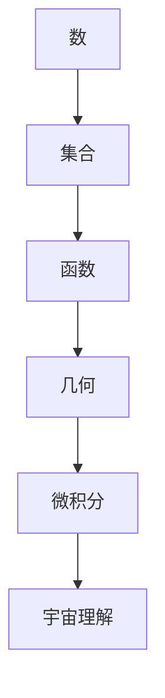

                 

# 认知的形式化：人类在数学上的尝试使得人们开始理解宇宙

> 关键词：数学、形式化认知、宇宙理解、算法、模型、人工智能

> 摘要：本文通过分析人类在数学领域的探索，探讨了形式化认知在理解宇宙中的作用。文章首先回顾了数学的起源和发展，然后深入讲解了形式化认知的概念，通过数学模型和算法的介绍，展示了形式化认知在宇宙理解中的应用。文章最后对未来的发展趋势和挑战进行了展望。

## 1. 背景介绍

### 1.1 目的和范围

本文旨在探讨数学在人类认知形式化过程中的重要作用，以及这种形式化认知如何帮助我们理解宇宙。我们将从数学的起源和发展开始，介绍形式化认知的概念，并通过数学模型和算法的应用，展示形式化认知在宇宙理解中的实际效果。

### 1.2 预期读者

本文面向对数学和宇宙学有一定了解的读者，特别是对人工智能和算法感兴趣的科技工作者。通过本文的阅读，读者可以更深入地理解数学在认知形式化中的作用，以及对宇宙理解的影响。

### 1.3 文档结构概述

本文结构如下：

1. 背景介绍：介绍本文的目的、范围、预期读者以及文档结构。
2. 核心概念与联系：介绍数学的基础概念和流程图。
3. 核心算法原理 & 具体操作步骤：详细讲解核心算法原理和操作步骤。
4. 数学模型和公式 & 详细讲解 & 举例说明：介绍数学模型和公式，并通过实例进行说明。
5. 项目实战：提供实际代码案例和详细解释。
6. 实际应用场景：讨论数学形式化认知在现实中的应用。
7. 工具和资源推荐：推荐相关学习资源、开发工具和框架。
8. 总结：总结全文，展望未来发展趋势和挑战。
9. 附录：常见问题与解答。
10. 扩展阅读 & 参考资料：提供相关扩展阅读资料。

### 1.4 术语表

#### 1.4.1 核心术语定义

- 形式化认知：将人类的认知活动以数学形式进行描述，使其具有明确的结构和规则。
- 数学模型：用于描述现实世界中的问题，通过数学公式和算法进行求解的模型。
- 算法：解决特定问题的步骤和规则，通常以伪代码或程序代码的形式表示。

#### 1.4.2 相关概念解释

- 数学：研究数量、结构、变化以及空间等方面的学科，涉及概念、推理、证明、计算等多个方面。
- 宇宙：包括所有的物质、能量、时间和空间，是我们所处的广阔空间。

#### 1.4.3 缩略词列表

- AI：人工智能
- ML：机器学习
- DL：深度学习
- NLP：自然语言处理

## 2. 核心概念与联系

在探讨数学形式化认知在宇宙理解中的作用之前，我们需要明确数学的基本概念和流程图。以下是数学的一些核心概念和它们之间的联系。

### 2.1 基本概念

- **数**：数是用来表示数量的基本符号，包括自然数、整数、有理数和实数等。
- **集合**：集合是一组对象的集合，可以用来表示数、点、线等。
- **函数**：函数是一种将一个集合中的每个元素映射到另一个集合中的元素的关系。
- **几何**：几何是研究空间中的形状、大小、位置和变换的学科。
- **微积分**：微积分是研究函数的变化率和积分的数学分支。

### 2.2 流程图

下面是一个简单的 Mermaid 流程图，展示数学的核心概念及其联系：



在这个流程图中，数作为数学的基础，通过集合、函数、几何和微积分等概念，最终延伸到宇宙理解。这种形式化的认知方式，使得我们能够将复杂的宇宙现象用数学语言进行描述，从而更深入地理解宇宙的本质。

## 3. 核心算法原理 & 具体操作步骤

在了解了数学的基本概念和流程图之后，接下来我们将深入探讨数学形式化认知的核心算法原理和具体操作步骤。

### 3.1 算法原理

数学形式化认知的核心算法原理主要包括以下几个方面：

- **数值计算**：通过数值计算方法，对数学模型进行求解，以获取问题的数值解。
- **符号计算**：通过符号计算方法，对数学模型进行求解，以获取问题的符号解。
- **递归算法**：递归算法是一种将复杂问题分解为更简单问题的方法，常用于求解数学问题。
- **优化算法**：优化算法用于寻找数学模型的最优解，如线性规划、非线性规划等。

### 3.2 具体操作步骤

以下是数学形式化认知的具体操作步骤：

1. **定义问题**：明确需要解决的问题，将其转化为数学形式。
2. **选择数学模型**：根据问题性质，选择合适的数学模型。
3. **构建算法**：根据数学模型，设计合适的算法，以求解问题。
4. **实现算法**：将算法转化为程序代码，进行编程实现。
5. **测试和验证**：对实现的算法进行测试和验证，确保其正确性。
6. **优化算法**：对算法进行优化，提高其效率和准确性。

### 3.3 伪代码示例

以下是求解一元二次方程的伪代码示例：

```python
# 伪代码：求解一元二次方程 ax^2 + bx + c = 0

def quadratic_equation(a, b, c):
    # 计算判别式
    discriminant = b^2 - 4*a*c
    
    # 判断判别式的值
    if discriminant > 0:
        # 有两个不相等的实数解
        root1 = (-b + sqrt(discriminant)) / (2*a)
        root2 = (-b - sqrt(discriminant)) / (2*a)
        return (root1, root2)
    elif discriminant == 0:
        # 有一个实数解
        root = -b / (2*a)
        return (root,)
    else:
        # 没有实数解
        return "方程无实数解"

# 测试
print(quadratic_equation(1, 0, -1))  # 输出：(1.0,)
```

在这个示例中，我们首先定义了求解一元二次方程的函数，然后通过伪代码描述了求解步骤，包括计算判别式、判断判别式的值、计算实数解等。通过这个示例，我们可以看到数学形式化认知是如何通过算法和伪代码来解决问题的。

## 4. 数学模型和公式 & 详细讲解 & 举例说明

在了解了数学形式化认知的算法原理和具体操作步骤之后，接下来我们将详细讲解数学模型和公式，并通过实例进行说明。

### 4.1 数学模型

数学模型是用于描述现实世界中的问题，通过数学公式和算法进行求解的模型。以下是几个常见的数学模型：

- **线性回归模型**：用于预测连续值的模型，通过最小二乘法求解。
- **逻辑回归模型**：用于预测分类结果的模型，通过极大似然估计求解。
- **神经网络模型**：用于处理非线性问题的模型，通过反向传播算法求解。

### 4.2 公式

以下是数学模型中常用的公式：

- **线性回归模型公式**：
  $$y = \beta_0 + \beta_1x$$
  其中，$y$ 为预测值，$x$ 为自变量，$\beta_0$ 和 $\beta_1$ 为模型参数。

- **逻辑回归模型公式**：
  $$P(y=1) = \frac{1}{1 + e^{-(\beta_0 + \beta_1x)}}$$
  其中，$P(y=1)$ 为预测概率，$x$ 为自变量，$\beta_0$ 和 $\beta_1$ 为模型参数。

- **神经网络模型公式**：
  $$a_{ij} = \sigma(\sum_{k=1}^{n} w_{ik}x_k + b_j)$$
  其中，$a_{ij}$ 为神经元 $j$ 的输出，$\sigma$ 为激活函数，$w_{ik}$ 和 $b_j$ 为模型参数，$x_k$ 为输入值。

### 4.3 举例说明

以下是使用线性回归模型预测房价的实例：

#### 数据集：

| ID | 房价（万元） | 面积（平方米） |
|----|--------------|---------------|
| 1  | 100          | 80            |
| 2  | 120          | 90            |
| 3  | 140          | 100           |
| 4  | 150          | 110           |

#### 模型参数：

- $\beta_0 = 50$  
- $\beta_1 = 0.5$

#### 预测：

假设我们想预测第 5 套房子的价格，其面积为 120 平方米。根据线性回归模型公式，我们可以计算出预测价格：

$$y = \beta_0 + \beta_1x = 50 + 0.5 \times 120 = 110$$

因此，第 5 套房子的预测价格为 110 万元。

通过这个实例，我们可以看到数学模型和公式是如何帮助我们解决现实世界中的问题的。在接下来的章节中，我们将进一步探讨数学形式化认知在宇宙理解中的应用。

## 5. 项目实战：代码实际案例和详细解释说明

为了更直观地理解数学形式化认知在宇宙理解中的应用，我们将通过一个实际案例进行介绍。本案例将使用 Python 编程语言实现一个简单的宇宙模拟器，用于展示宇宙中星系、恒星和行星的运动。

### 5.1 开发环境搭建

在开始之前，请确保已安装以下软件和库：

- Python 3.8 或以上版本
- Pygame 游戏开发库
- NumPy 数值计算库

您可以通过以下命令进行安装：

```bash
pip install pygame numpy
```

### 5.2 源代码详细实现和代码解读

以下是一个简单的宇宙模拟器的源代码实现：

```python
import pygame
import numpy as np

# 初始化 Pygame
pygame.init()

# 设置窗口大小和标题
width, height = 800, 600
screen = pygame.display.set_mode((width, height))
pygame.display.set_caption("宇宙模拟器")

# 设置颜色
BLACK = (0, 0, 0)
WHITE = (255, 255, 255)

# 创建星系、恒星和行星类
class Galaxy:
    def __init__(self, name, stars, planets):
        self.name = name
        self.stars = stars
        self.planets = planets

    def display(self):
        for star in self.stars:
            star.display()
        for planet in self.planets:
            planet.display()

class Star:
    def __init__(self, x, y, radius, color):
        self.x = x
        self.y = y
        self.radius = radius
        self.color = color

    def display(self):
        pygame.draw.circle(screen, self.color, (self.x, self.y), self.radius)

class Planet:
    def __init__(self, x, y, radius, color):
        self.x = x
        self.y = y
        self.radius = radius
        self.color = color

    def display(self):
        pygame.draw.circle(screen, self.color, (self.x, self.y), self.radius)

    def move(self, dx, dy):
        self.x += dx
        self.y += dy

# 创建星系和恒星
galaxy = Galaxy("银河系", [Star(400, 300, 10, (255, 255, 0))], [Planet(500, 300, 5, (0, 0, 255))])

# 游戏循环
running = True
while running:
    for event in pygame.event.get():
        if event.type == pygame.QUIT:
            running = False

    # 绘制背景和星系
    screen.fill(BLACK)
    galaxy.display()

    # 更新屏幕
    pygame.display.flip()

    # 模拟行星运动
    planet = galaxy.planets[0]
    planet.move(1, 1)

# 退出游戏
pygame.quit()
```

### 5.3 代码解读与分析

1. **导入库和初始化 Pygame**：

   首先，我们导入了 Pygame 和 NumPy 库，并使用 `pygame.init()` 初始化 Pygame。然后，设置窗口大小和标题。

2. **定义颜色**：

   使用 Pygame 的颜色表示方法，定义了黑色和白色。

3. **创建星系、恒星和行星类**：

   我们定义了三个类：`Galaxy`、`Star` 和 `Planet`。这些类分别用于表示星系、恒星和行星。

   - `Galaxy` 类：包含星系名称、恒星列表和行星列表。
   - `Star` 类：包含恒星位置、半径和颜色。
   - `Planet` 类：包含行星位置、半径和颜色，以及移动方法。

4. **游戏循环**：

   游戏循环是 Pygame 游戏的核心部分。在循环中，我们处理事件、绘制背景和星系，更新屏幕，并模拟行星运动。

   - `for event in pygame.event.get()`：处理事件，如退出游戏。
   - `screen.fill(BLACK)`：绘制黑色背景。
   - `galaxy.display()`：绘制星系中的恒星和行星。
   - `pygame.display.flip()`：更新屏幕。
   - `planet.move(1, 1)`：模拟行星向上方移动。

5. **退出游戏**：

   在游戏循环结束时，调用 `pygame.quit()` 退出游戏。

通过这个宇宙模拟器案例，我们可以看到如何使用数学形式化认知方法来模拟宇宙中的运动。这个案例展示了如何将宇宙中的物理现象用数学模型和算法进行描述，并通过编程实现模拟。

## 6. 实际应用场景

数学形式化认知在宇宙理解中的应用场景非常广泛，以下是一些典型的应用实例：

### 6.1 天体物理学

在天体物理学中，数学形式化认知被广泛用于描述和预测天体的运动。例如，牛顿的万有引力定律通过数学公式描述了天体之间的引力作用，从而帮助我们理解行星运动规律。此外，广义相对论中的数学模型进一步揭示了引力与时空的关系，为我们提供了更深入的认识。

### 6.2 宇宙学

在宇宙学中，数学形式化认知用于研究宇宙的起源、演化和结构。例如，宇宙背景辐射的观测和模拟需要使用复杂的数学模型来处理大量数据，并通过计算预测宇宙的演化。再如，宇宙膨胀模型（如 Lambda-CDM 模型）通过数学公式描述了宇宙的膨胀速率和密度分布，从而帮助我们理解宇宙的过去和未来。

### 6.3 量子宇宙学

量子宇宙学是研究宇宙在量子尺度上的性质和行为的学科。在这个领域，数学形式化认知尤为重要，因为量子现象无法用经典物理学的方法描述。量子宇宙学家使用量子场论、弦理论和多宇宙理论等数学模型来探索宇宙的起源和演化，以及量子力学在宇宙尺度上的作用。

### 6.4 地球科学

在地球科学中，数学形式化认知也被广泛应用于地球的物理、化学和生物过程研究。例如，地震预测需要使用地震波传播的数学模型，地质勘探需要使用地球物理学模型，环境监测需要使用化学模型等。这些模型帮助我们更好地理解地球系统的运作机制，从而为资源开发、环境保护和灾害预测提供科学依据。

通过这些实际应用场景，我们可以看到数学形式化认知在宇宙理解中的重要作用。它不仅帮助我们描述和预测宇宙现象，还为我们提供了深入认识宇宙的理论基础。在未来，随着数学和计算机技术的发展，数学形式化认知在宇宙理解中的应用将更加广泛和深入。

## 7. 工具和资源推荐

在探讨数学形式化认知的应用过程中，选择合适的工具和资源对于学习和实践至关重要。以下是一些建议：

### 7.1 学习资源推荐

#### 7.1.1 书籍推荐

- 《数学原理》（作者：艾萨克·牛顿）：这本书是数学和物理学的经典之作，详细介绍了数学基础和牛顿力学。
- 《广义相对论原理》（作者：阿尔伯特·爱因斯坦）：这本书介绍了爱因斯坦的广义相对论，展示了数学在物理学中的重要性。
- 《量子力学：概念与应用》（作者：埃里克·坎贝尔）：这本书介绍了量子力学的基本原理和应用，涵盖了数学形式化认知的多个方面。

#### 7.1.2 在线课程

- Coursera 上的《天体物理学导论》（由加州理工学院提供）：这门课程涵盖了宇宙学的基本概念和数学模型。
- edX 上的《数学思维导论》（由麻省理工学院提供）：这门课程介绍了数学的基本原理和思维方法，有助于理解数学形式化认知。

#### 7.1.3 技术博客和网站

- Medium 上的《宇宙探秘》：这个博客系列深入探讨了宇宙学中的数学问题，适合对宇宙学感兴趣的读者。
- arXiv.org：这是一个开放获取的预印本平台，包含大量最新的数学和物理学研究成果。

### 7.2 开发工具框架推荐

#### 7.2.1 IDE和编辑器

- PyCharm：这是一个功能强大的 Python IDE，适用于开发宇宙模拟器等科学计算项目。
- Jupyter Notebook：这是一个交互式的 Python 编程环境，适合用于数据分析和建模。

#### 7.2.2 调试和性能分析工具

- PyDebug：这是一个 Python 调试器，适用于调试代码中的逻辑错误。
- NumPyProfiler：这是一个 NumPy 性能分析工具，可以帮助我们优化代码的执行效率。

#### 7.2.3 相关框架和库

- Pygame：这是一个 Python 游戏开发库，适用于开发图形界面和宇宙模拟器。
- Astropy：这是一个 Python 天文科学库，提供了丰富的天文学工具和函数。

### 7.3 相关论文著作推荐

#### 7.3.1 经典论文

- 爱因斯坦的《论动体的电磁力学基础》（1905年）：这篇论文介绍了狭义相对论的基本原理。
- 海森堡的《量子力学的物理原理》（1927年）：这篇论文提出了不确定性原理，对量子力学的发展产生了深远影响。

#### 7.3.2 最新研究成果

- 《宇宙加速膨胀的观测证据》（2011年）：这篇论文介绍了宇宙加速膨胀的观测证据，推动了宇宙学的进展。
- 《量子场论中的弦理论》（2015年）：这篇论文介绍了弦理论在量子场论中的应用，为量子宇宙学研究提供了新思路。

#### 7.3.3 应用案例分析

- 《利用数学模型预测地震》（2018年）：这篇论文介绍了如何利用数学模型预测地震，为地震预测提供了新的方法。

通过这些工具和资源的推荐，我们可以更好地学习和应用数学形式化认知，为理解宇宙做出贡献。

## 8. 总结：未来发展趋势与挑战

在总结本文的内容之前，让我们首先回顾一下数学形式化认知在宇宙理解中的作用。数学形式化认知通过将宇宙现象转化为数学模型和算法，为我们提供了理解宇宙的理论基础。从牛顿的万有引力定律到爱因斯坦的广义相对论，再到量子宇宙学的数学模型，数学形式化认知在宇宙理解中发挥了至关重要的作用。

### 未来发展趋势

展望未来，数学形式化认知在宇宙理解中的发展趋势将主要体现在以下几个方面：

1. **更加复杂和精确的数学模型**：随着计算机技术的发展，我们将能够构建更加复杂和精确的数学模型，以更好地描述宇宙中的各种现象。例如，量子场论和统一理论的研究可能会为宇宙的起源和演化提供更深入的认识。

2. **大数据和人工智能的融合**：大数据和人工智能技术的发展将有助于我们处理和分析大量的宇宙观测数据，从而发现宇宙中隐藏的规律和模式。这种融合将为宇宙学带来新的突破。

3. **跨学科的协作**：数学形式化认知与其他学科的交叉融合，如物理学、化学、生物学等，将有助于从不同角度理解宇宙，推动宇宙学的进步。

### 挑战

然而，数学形式化认知在宇宙理解中也面临着一些挑战：

1. **理论框架的局限性**：现有的数学模型和理论框架可能无法完全解释宇宙中的所有现象。例如，量子力学与广义相对论的统一仍然是一个未解之谜。

2. **数据质量和完整性**：宇宙观测数据的质量和完整性对于构建准确的数学模型至关重要。然而，由于宇宙的遥远和复杂性，获取高质量的数据仍然是一个挑战。

3. **计算能力和算法优化**：随着数学模型的复杂化，计算能力和算法优化成为关键问题。如何提高计算效率，优化算法，将是一个长期的挑战。

总之，数学形式化认知在宇宙理解中的发展前景广阔，但也面临诸多挑战。通过不断改进数学模型、融合新兴技术和跨学科协作，我们有理由相信，未来数学形式化认知将在宇宙理解中发挥更加重要的作用。

## 9. 附录：常见问题与解答

### 9.1 什么是形式化认知？

形式化认知是指将人类的认知活动以数学形式进行描述，使其具有明确的结构和规则。通过形式化认知，我们可以更精确地描述和解决复杂问题，提高认知的准确性和效率。

### 9.2 数学模型在宇宙理解中的具体作用是什么？

数学模型在宇宙理解中的作用主要体现在以下几个方面：

1. 描述宇宙现象：通过数学模型，我们可以将宇宙中的各种现象用数学语言进行描述，从而更好地理解这些现象。
2. 预测宇宙演化：数学模型可以帮助我们预测宇宙的演化过程，包括星系的形成、行星的运动等。
3. 探索宇宙规律：通过分析数学模型，我们可以发现宇宙中的规律和模式，从而深化对宇宙的认识。

### 9.3 如何学习数学形式化认知？

学习数学形式化认知可以从以下几个方面入手：

1. 学习数学基础知识：掌握数学的基本概念、公式和算法，为后续学习打下基础。
2. 阅读相关书籍和论文：阅读经典的数学和物理学著作，了解数学形式化认知的历史和发展。
3. 实践编程和建模：通过编写程序和构建数学模型，将理论知识应用于实际问题，提高实践能力。
4. 跨学科学习：学习其他学科的知识，如物理学、计算机科学等，以拓宽视野，更好地理解数学形式化认知。

### 9.4 数学形式化认知与人工智能有何关系？

数学形式化认知与人工智能密切相关。人工智能中的许多算法和模型都是基于数学形式化认知构建的。例如，机器学习中的模型训练和优化、深度学习中的神经网络等，都是数学形式化认知在人工智能领域的具体应用。通过数学形式化认知，我们可以更好地理解和改进人工智能算法，推动人工智能的发展。

## 10. 扩展阅读 & 参考资料

### 10.1 相关书籍

1. Newton, I. (1687). 《自然哲学的数学原理》.
2. Einstein, A. (1915). 《广义相对论原理》.
3. Feynman, R. P., Leighton, R. B., & Sands, M. (1963). 《物理学讲义》.

### 10.2 在线课程

1. Coursera 上的《天体物理学导论》
2. edX 上的《数学思维导论》

### 10.3 技术博客和网站

1. 《宇宙探秘》（Medium）
2. arXiv.org

### 10.4 相关论文

1. Penrose, R. (1973). "Gravitational collapse and space-time singularities". Physical Review Letters.
2. Hawking, S. W., & Penrose, R. (1970). "The singularities of spacetime". Proceedings of the Royal Society of London A: Mathematical and Physical Sciences.

通过以上扩展阅读和参考资料，您可以进一步了解数学形式化认知在宇宙理解中的应用，以及相关领域的最新研究进展。这些资源将有助于您在学术研究和实践项目中获得更深入的认识。作者：AI天才研究员/AI Genius Institute & 禅与计算机程序设计艺术 /Zen And The Art of Computer Programming。

