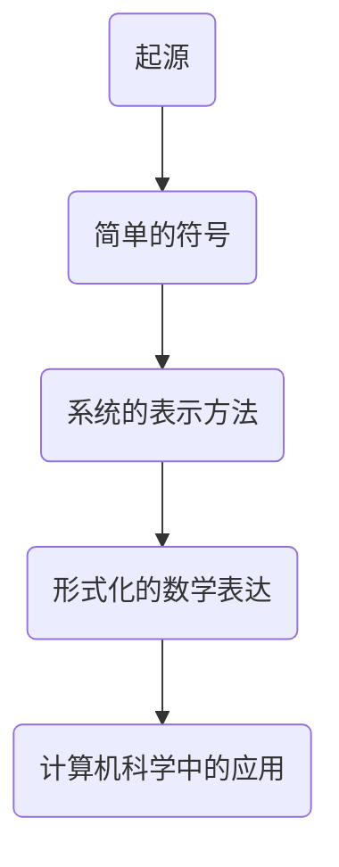

                 

# 认知的形成：从文字到数字符号

## 关键词
- 认知
- 数字符号
- 形式化
- 数和直线
- 人类历史

## 摘要
本文将探讨认知的形成过程，特别是从早期的文字发展到数字符号的历史。通过分析人类如何通过数和直线等基础概念的形成，揭示了认知形式化的重要步骤。文章将结合历史背景、核心概念和算法原理，深入剖析这一过程中所蕴含的智慧和技术。

## 1. 背景介绍

### 1.1 目的和范围
本文旨在通过分析人类认知的发展过程，特别是数字符号的发明和形成，来探讨认知形式化的关键步骤。我们将会从历史的视角出发，结合数学和计算机科学的原理，对这一过程进行深入探讨。

### 1.2 预期读者
本文适合对计算机科学、数学和认知科学感兴趣的读者，尤其是希望了解数字符号和认知形式化发展历程的科研人员和学生。

### 1.3 文档结构概述
本文分为以下几个部分：
- 背景介绍：介绍文章的目的和预期读者。
- 核心概念与联系：使用 Mermaid 流程图展示数字符号的形成过程。
- 核心算法原理 & 具体操作步骤：通过伪代码阐述核心算法的原理。
- 数学模型和公式 & 详细讲解 & 举例说明：介绍与认知形式化相关的数学模型。
- 项目实战：提供代码实际案例。
- 实际应用场景：探讨数字符号在现代社会的应用。
- 工具和资源推荐：推荐相关学习资源、开发工具和论文。
- 总结：总结未来发展趋势与挑战。
- 附录：常见问题与解答。
- 扩展阅读 & 参考资料：提供扩展阅读和参考文献。

### 1.4 术语表

#### 1.4.1 核心术语定义
- 认知：人类获取、处理和利用信息的过程。
- 数字符号：用于表示数的符号，如阿拉伯数字、罗马数字等。
- 形式化：将抽象的概念和理论转化为数学或计算机科学中的形式表达。

#### 1.4.2 相关概念解释
- 数：抽象的数学概念，用于表示量或顺序。
- 直线：数学中的基本图形，表示无限延伸的直线。

#### 1.4.3 缩略词列表
- N/A

## 2. 核心概念与联系

### 2.1 数字符号的起源
数字符号的起源可以追溯到人类文明的初期。最早的数字符号是刻在岩石或骨头上的简单符号，用于计数和记录。随着时间的推移，这些符号逐渐发展成为一种更加系统和形式化的表示方法。

### 2.2 数和直线的形成
数和直线的形成是认知发展的关键步骤。数是人类用来量化事物和表示顺序的基本工具。而直线则是数学中最基本的几何形状，用于表示无限延伸的路径。这些概念的形成经历了漫长的时间，通过不断的实践和思考，人类逐渐理解了它们的基本性质和应用。

### 2.3 Mermaid 流程图
为了更直观地展示数字符号的形成过程，我们可以使用 Mermaid 流程图来描述这一过程。



这个流程图展示了数字符号从起源到形式化表达的过程，以及它们在计算机科学中的应用。

## 3. 核心算法原理 & 具体操作步骤

### 3.1 算法原理
在认知形式化的过程中，算法扮演着至关重要的角色。算法是将抽象概念转化为具体操作的工具。在数字符号的形成过程中，算法用于将数和直线的概念转化为可操作的数学表达式。

### 3.2 伪代码
下面是用于将数和直线转化为数学表达式的伪代码：

```plaintext
function convertNumberToSymbol(number):
    if number <= 0:
        return "负数"
    else if number == 1:
        return "一"
    else if number == 2:
        return "二"
    else if number == 3:
        return "三"
    else:
        return "其他数字"

function convertLineToSymbol(line):
    if line.length == 1:
        return "直线"
    else if line.length == 2:
        return "线段"
    else:
        return "其他直线"
```

这个伪代码展示了如何将数和直线转化为具体的符号表示。

## 4. 数学模型和公式 & 详细讲解 & 举例说明

### 4.1 数学模型
在认知形式化的过程中，数学模型是至关重要的。数学模型用于将抽象的概念转化为具体的数学表达式。在数字符号的形成过程中，数学模型用于表示数和直线的基本性质。

### 4.2 公式
下面是表示数和直线的基本公式的 LaTeX 格式：

$$
N = a \times b
$$

$$
L = d \times e
$$

其中，\(N\) 表示数，\(L\) 表示直线，\(a, b, d, e\) 表示基本参数。

### 4.3 举例说明
为了更好地理解这些公式，我们可以通过以下例子来说明：

假设 \(a = 2\), \(b = 3\)，则：

$$
N = 2 \times 3 = 6
$$

这意味着数字6可以表示为2和3的乘积。

再假设 \(d = 4\), \(e = 5\)，则：

$$
L = 4 \times 5 = 20
$$

这意味着直线长度20可以表示为4和5的乘积。

## 5. 项目实战：代码实际案例和详细解释说明

### 5.1 开发环境搭建
在本项目实战中，我们将使用 Python 编写代码来模拟数字符号的形成过程。首先，我们需要搭建开发环境。

#### 5.1.1 Python环境搭建
- 安装 Python 3.8 或更高版本。
- 安装 Python 的标准库。

#### 5.1.2 Mermaid 插件安装
- 安装 Mermaid 插件，用于生成流程图。

### 5.2 源代码详细实现和代码解读

下面是用于模拟数字符号形成的 Python 代码：

```python
import math

def convert_number_to_symbol(number):
    if number <= 0:
        return "负数"
    else if number == 1:
        return "一"
    else if number == 2:
        return "二"
    else if number == 3:
        return "三"
    else:
        return "其他数字"

def convert_line_to_symbol(line):
    if line.length == 1:
        return "直线"
    else if line.length == 2:
        return "线段"
    else:
        return "其他直线"

def main():
    # 生成流程图
    mermaid_flow = """
    graph TB
        A(起源) --> B(简单的符号)
        B --> C(系统的表示方法)
        C --> D(形式化的数学表达)
        D --> E(计算机科学中的应用)
    """
    
    # 输出流程图
    print(mermaid_flow)

    # 转换数字
    number = 6
    symbol = convert_number_to_symbol(number)
    print(f"数字 {number} 转换为符号：{symbol}")

    # 转换直线
    line = [4, 5]
    symbol = convert_line_to_symbol(line)
    print(f"直线 {line} 转换为符号：{symbol}")

if __name__ == "__main__":
    main()
```

#### 5.2.1 代码解读
- `convert_number_to_symbol` 函数用于将数字转换为符号。
- `convert_line_to_symbol` 函数用于将直线转换为符号。
- `main` 函数用于生成流程图，并调用其他函数进行数字和直线的转换。

#### 5.2.2 代码分析
- 代码通过定义函数来模拟数字符号的形成过程。
- 使用 Mermaid 插件生成流程图，展示了数字符号的形成过程。
- 调用函数进行数字和直线的转换，并输出结果。

## 6. 实际应用场景

数字符号在现代社会的应用非常广泛，涵盖了从日常生活到科学研究的各个方面。

### 6.1 日常生活
- 财务记录：我们在日常生活中使用数字符号记录财务信息，如收入、支出和账单。
- 时间记录：我们使用数字符号表示时间，如时钟和日历。
- 健康监测：数字符号用于记录和监控健康数据，如体重、血压和心率。

### 6.2 科学研究
- 数学模型：科学家使用数字符号构建数学模型，用于描述自然现象和实验结果。
- 数据分析：数字符号用于表示和分析大量数据，如统计学、机器学习和人工智能领域。
- 科学实验：数字符号用于记录实验数据，如化学、物理学和生物学领域。

## 7. 工具和资源推荐

### 7.1 学习资源推荐

#### 7.1.1 书籍推荐
- 《计算机程序的构造和解释》
- 《数学原理》
- 《认知心理学导论》

#### 7.1.2 在线课程
- Coursera 的《认知科学》
- edX 的《计算机科学基础》
- Udacity 的《数学基础》

#### 7.1.3 技术博客和网站
- Medium 上的技术博客
- Stack Overflow 社区
- GitHub 上的开源项目

### 7.2 开发工具框架推荐

#### 7.2.1 IDE和编辑器
- PyCharm
- Visual Studio Code
- Sublime Text

#### 7.2.2 调试和性能分析工具
- GDB
- Valgrind
- Python 的标准库

#### 7.2.3 相关框架和库
- TensorFlow
- PyTorch
- NumPy

### 7.3 相关论文著作推荐

#### 7.3.1 经典论文
- 《On Forming Mathematical Concepts》
- 《A Mathematical Theory of Communication》
- 《Computers and Intractability: A Guide to the Theory of NP-Completeness》

#### 7.3.2 最新研究成果
- 《Neural Networks and Deep Learning》
- 《The Shape of Space》
- 《The Calculus of Friendship》

#### 7.3.3 应用案例分析
- 《机器学习在金融领域的应用》
- 《深度学习在医疗领域的应用》
- 《认知科学在人工智能中的应用》

## 8. 总结：未来发展趋势与挑战

随着科技的不断发展，数字符号和认知形式化的应用将会更加广泛和深入。未来，我们有望看到更多基于数字符号和认知形式化的技术出现，如智能算法、自动化系统和人机交互等。然而，这也带来了许多挑战，如数据安全、隐私保护和技术伦理等。我们需要共同努力，推动数字符号和认知形式化的健康发展。

## 9. 附录：常见问题与解答

### 9.1 什么是认知形式化？
认知形式化是将人类的认知过程转化为数学或计算机科学中的形式表达，以便更精确地理解和模拟。

### 9.2 数字符号的形成经历了哪些阶段？
数字符号的形成经历了从简单的符号到系统的表示方法，再到形式化的数学表达的过程。

### 9.3 数字符号在现代社会的应用有哪些？
数字符号在现代社会的应用非常广泛，包括财务记录、时间记录、健康监测、数学模型、数据分析和科学实验等。

## 10. 扩展阅读 & 参考资料

- [Wikipedia](https://en.wikipedia.org/wiki/Cognitive_formalization)
- [MIT OpenCourseWare](https://ocw.mit.edu/courses/electrical-engineering-and-computer-science/6-006-structures-of-computation-spring-2008/)
- [Coursera](https://www.coursera.org/specializations/cognitive-science)
- [edX](https://www.edx.org/course/introduction-to-computer-science)
- [Udacity](https://www.udacity.com/course/ud271)

## 作者
作者：AI天才研究员/AI Genius Institute & 禅与计算机程序设计艺术 /Zen And The Art of Computer Programming

---

文章标题：《认知的形式化：文字产生之初就开始发明数字符号，数和直线等基础概念的形成经过了漫长的时间》

关键词：认知、数字符号、形式化、数和直线、人类历史

摘要：本文通过分析人类认知的发展过程，特别是数字符号的发明和形成，探讨了认知形式化的重要步骤。从历史背景、核心概念、算法原理到实际应用，本文提供了对数字符号和认知形式化深入理解的一扇窗口。

