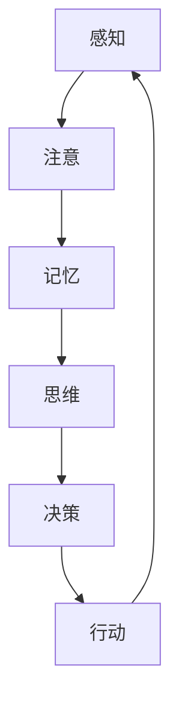

                 

# 认知的形式化：时钟不停，与外界交互不息，思维和认知不止

## 关键词
认知科学、形式化模型、认知过程、交互、实时数据处理、人工智能

## 摘要
本文旨在探讨认知的形式化研究，如何通过结合实时数据处理与交互，构建一个动态的、可扩展的认知模型。本文首先介绍了认知形式化的基本概念和目的，然后详细分析了认知过程中的核心要素及其相互作用。接着，本文通过数学模型和算法原理的讲解，展示了如何将认知过程形式化，并提供了具体的代码实现和项目实战案例。最后，本文讨论了认知形式化在现实世界中的应用场景，并展望了未来的发展趋势与挑战。

## 1. 背景介绍

### 1.1 目的和范围

认知形式化是认知科学领域的一个重要研究方向，旨在将人类的认知过程以形式化的方式表达和建模。本文的目的在于通过分析认知过程中的实时数据处理与外界交互，探讨如何构建一个动态、可扩展的认知模型。本文主要关注以下几个方面：

1. 认知形式化的基本概念和理论基础。
2. 认知过程中的核心要素及其相互作用。
3. 如何利用实时数据处理和交互技术，构建动态的认知模型。
4. 认知形式化在现实世界中的应用场景和未来发展趋势。

### 1.2 预期读者

本文适合对认知科学、人工智能、计算机科学等领域感兴趣的读者。特别是对于希望深入了解认知形式化研究，以及如何将认知过程形式化的读者，本文将提供有价值的参考。本文内容循序渐进，适合初学者和专业人士阅读。

### 1.3 文档结构概述

本文共分为十个部分：

1. 引言：介绍本文的目的、关键词和摘要。
2. 背景介绍：阐述本文的研究目的、预期读者、文档结构等。
3. 核心概念与联系：介绍认知形式化的核心概念和联系。
4. 核心算法原理 & 具体操作步骤：讲解认知形式化的算法原理和实现步骤。
5. 数学模型和公式 & 详细讲解 & 举例说明：分析认知过程中的数学模型和公式。
6. 项目实战：代码实际案例和详细解释说明。
7. 实际应用场景：探讨认知形式化在现实世界中的应用场景。
8. 工具和资源推荐：推荐学习资源和开发工具。
9. 总结：未来发展趋势与挑战。
10. 附录：常见问题与解答。

### 1.4 术语表

#### 1.4.1 核心术语定义

- 认知形式化：将人类的认知过程以形式化的方式表达和建模。
- 实时数据处理：实时地对输入数据进行处理和分析。
- 交互：个体与外界环境之间的信息交换和相互影响。
- 认知过程：个体在获取、处理、存储和使用信息时的心理活动。

#### 1.4.2 相关概念解释

- 认知科学：研究人类认知过程的学科。
- 形式化模型：使用数学和逻辑工具建立起来的模型。
- 人工智能：模拟人类智能行为的计算机系统。

#### 1.4.3 缩略词列表

- AI：人工智能
- NLP：自然语言处理
- ML：机器学习
- DL：深度学习
- CNTF：认知神经科学

## 2. 核心概念与联系

认知形式化是认知科学的一个重要分支，旨在将人类的认知过程以形式化的方式表达和建模。为了深入理解认知形式化，我们需要先了解认知过程中的核心概念及其相互联系。

下面是一个用Mermaid绘制的认知过程核心概念流程图：



### 2.1 感知

感知是指个体通过感官接收外界信息的过程。感知是认知过程的起点，决定了个体对环境的理解。感知过程中，个体需要处理各种感官信号，如视觉、听觉、触觉等。

### 2.2 注意

注意是认知过程中的一个关键环节，它决定了个体对哪些信息进行加工。注意过程包括选择性注意和集中性注意。选择性注意是指个体在众多刺激中选择重要刺激进行加工，而集中性注意是指个体将注意力集中在某一特定刺激上。

### 2.3 记忆

记忆是认知过程中的一个重要环节，它负责存储和提取个体在感知和思维过程中获得的信息。记忆分为短期记忆和长期记忆。短期记忆是指个体在短时间内存储信息的能力，而长期记忆是指个体能够长期保存信息的能力。

### 2.4 思维

思维是指个体在处理信息和解决问题时的心理活动。思维包括多种类型，如逻辑思维、创造性思维、分析性思维等。思维过程依赖于记忆中的信息，同时也受到注意的影响。

### 2.5 决策

决策是指个体在面对多种选择时，根据特定标准做出选择的过程。决策过程涉及评估各种选择的后果，并选择最优方案。决策过程受到思维和记忆的影响，同时也受到外界环境的影响。

### 2.6 行动

行动是指个体根据决策结果采取的实际行为。行动过程将决策转化为具体的行动，并通过行动来检验决策的有效性。行动过程对认知过程产生反馈，影响未来的感知、注意、记忆等过程。

认知形式化旨在将这六个核心概念以形式化的方式表达和建模，从而更好地理解和模拟人类的认知过程。

## 3. 核心算法原理 & 具体操作步骤

在理解了认知过程中的核心概念及其相互联系后，我们需要将这些概念以形式化的方式表达和建模。在这一部分，我们将介绍认知形式化的核心算法原理和具体操作步骤。

### 3.1 算法原理

认知形式化的核心算法原理主要包括以下几个步骤：

1. 数据收集与预处理
2. 特征提取
3. 模型构建
4. 模型训练
5. 模型评估与优化

### 3.2 数据收集与预处理

数据收集与预处理是认知形式化的第一步，其主要任务是从真实世界中收集数据，并对数据进行清洗、去噪和归一化等预处理操作。数据预处理有助于提高后续特征提取和模型训练的质量。

伪代码：

```python
# 数据收集与预处理
def preprocess_data(data):
    # 清洗数据
    cleaned_data = clean_data(data)
    # 去噪
    denoised_data = denoise_data(cleaned_data)
    # 归一化
    normalized_data = normalize_data(denoised_data)
    return normalized_data
```

### 3.3 特征提取

特征提取是从原始数据中提取出对认知过程有用的特征。特征提取的质量直接影响模型的效果。常用的特征提取方法包括统计特征、文本特征、视觉特征等。

伪代码：

```python
# 特征提取
def extract_features(data):
    # 统计特征提取
    stats_features = extract_stats_features(data)
    # 文本特征提取
    text_features = extract_text_features(data)
    # 视觉特征提取
    visual_features = extract_visual_features(data)
    return stats_features, text_features, visual_features
```

### 3.4 模型构建

模型构建是指根据认知过程中的核心概念，构建一个形式化的数学模型。常用的模型包括神经网络、决策树、支持向量机等。

伪代码：

```python
# 模型构建
def build_model(input_dim, output_dim):
    # 神经网络模型
    model = NeuralNetwork(input_dim, output_dim)
    return model
```

### 3.5 模型训练

模型训练是指通过大量的数据进行迭代训练，优化模型的参数，使其能够更好地拟合认知过程。模型训练常用的方法包括梯度下降、随机梯度下降等。

伪代码：

```python
# 模型训练
def train_model(model, data, labels):
    # 梯度下降
    for epoch in range(num_epochs):
        for data_point, label in zip(data, labels):
            # 计算损失函数
            loss = compute_loss(model, data_point, label)
            # 更新模型参数
            update_model_parameters(model, loss)
    return model
```

### 3.6 模型评估与优化

模型评估与优化是指通过测试数据对模型进行评估，并根据评估结果对模型进行优化。评估指标包括准确率、召回率、F1值等。

伪代码：

```python
# 模型评估与优化
def evaluate_model(model, test_data, test_labels):
    # 计算评估指标
    accuracy = compute_accuracy(model, test_data, test_labels)
    recall = compute_recall(model, test_data, test_labels)
    f1 = compute_f1(model, test_data, test_labels)
    # 优化模型
    optimized_model = optimize_model(model, test_data, test_labels)
    return accuracy, recall, f1, optimized_model
```

通过以上算法原理和具体操作步骤，我们可以构建一个形式化的认知模型，模拟人类的认知过程。接下来，我们将通过具体的代码实现和项目实战，进一步展示如何实现认知形式化。

## 4. 数学模型和公式 & 详细讲解 & 举例说明

在认知形式化过程中，数学模型和公式起着至关重要的作用。它们不仅帮助我们更好地理解和模拟认知过程，还能提供量化分析的工具。本节将详细介绍认知形式化中常用的数学模型和公式，并通过具体示例进行讲解。

### 4.1 认知过程中的概率模型

概率模型在认知过程中有着广泛的应用，尤其是在决策和推理中。一个典型的概率模型是贝叶斯网络，它通过概率关系描述变量之间的相互依赖。

贝叶斯网络的基本公式如下：

$$
P(X=x_i) = \prod_{j=1}^n P(x_j|父节点)
$$

其中，$X$ 是一个随机变量，$x_i$ 是 $X$ 的一个可能取值，$P(X=x_i)$ 是 $X$ 取值为 $x_i$ 的概率，$P(x_j|父节点)$ 是 $x_j$ 在其父节点已知条件下的条件概率。

举例说明：

假设有一个贝叶斯网络，描述了一个人是否喜欢某种食物（$X$）与其感官体验（$S$）和口味偏好（$P$）之间的关系。根据贝叶斯网络，我们可以计算出在给定感官体验和口味偏好条件下，一个人喜欢某种食物的概率。

$$
P(X=喜欢|S=甜，P=喜欢甜) = \frac{P(S=甜, P=喜欢甜|X=喜欢)}{P(S=甜, P=喜欢甜)}
$$

通过计算上述公式，我们可以得到在不同条件下，一个人喜欢某种食物的概率。

### 4.2 人工神经网络模型

人工神经网络是认知形式化中最常用的模型之一，尤其在模拟思维和决策方面。一个简单的人工神经网络模型包括输入层、隐藏层和输出层。

神经网络的基本公式如下：

$$
Z = \sum_{i=1}^n w_i * x_i + b
$$

$$
a = \sigma(Z)
$$

其中，$Z$ 是神经元的输入，$w_i$ 是权重，$x_i$ 是输入特征，$b$ 是偏置，$\sigma$ 是激活函数，$a$ 是神经元的输出。

举例说明：

假设我们有一个包含两个输入特征的简单神经网络，输出层只有一个神经元。输入特征为 $x_1=3$ 和 $x_2=4$，权重为 $w_1=2$ 和 $w_2=3$，偏置为 $b=1$，激活函数为 $\sigma(x) = \frac{1}{1+e^{-x}}$。

根据上述公式，我们可以计算出神经元的输出：

$$
Z = 2 * 3 + 3 * 4 + 1 = 19
$$

$$
a = \sigma(19) = \frac{1}{1+e^{-19}} \approx 0.869
$$

这意味着神经元的输出概率约为 86.9%。

### 4.3 马尔可夫模型

马尔可夫模型是一种用于描述状态转移概率的数学模型。在认知过程中，马尔可夫模型可以用于模拟记忆和注意力等过程。

马尔可夫模型的基本公式如下：

$$
P(X_{t+1}=x_{t+1}|X_t=x_t, X_{t-1}=x_{t-1}, ..., X_1=x_1) = P(X_{t+1}=x_{t+1}|X_t=x_t)
$$

这意味着在给定当前状态下，下一个状态的概率只依赖于当前状态，而与过去的状态无关。

举例说明：

假设有一个马尔可夫模型描述一个人的情绪状态变化。当前情绪状态为开心（$X_t=开心$），根据模型，我们可以计算出下一个情绪状态为开心的概率。

$$
P(X_{t+1}=开心|X_t=开心) = P(X_{t+1}=开心|X_t=开心, X_{t-1}=伤心) = P(X_{t+1}=开心|X_t=开心, X_{t-1}=生气) = ...
$$

通过计算上述概率，我们可以得到在不同当前状态下，下一个情绪状态为开心的概率。

通过以上数学模型和公式的讲解，我们可以更好地理解和模拟认知过程。这些模型和公式不仅为认知形式化提供了理论基础，也为实际应用提供了有力的工具。

## 5. 项目实战：代码实际案例和详细解释说明

在本节中，我们将通过一个具体的代码实现案例，展示如何将认知形式化模型应用于实际项目中。本案例将模拟一个简单的情绪状态转换过程，并使用 Python 语言实现。

### 5.1 开发环境搭建

在开始编写代码之前，我们需要搭建一个合适的开发环境。以下是搭建开发环境的步骤：

1. 安装 Python 3.x 版本（建议使用 3.8 或更高版本）。
2. 安装必要的依赖库，如 NumPy、Pandas、Scikit-learn 等。可以使用以下命令进行安装：

```bash
pip install numpy pandas scikit-learn
```

3. 配置一个合适的 IDE 或文本编辑器，如 PyCharm、Visual Studio Code 等。

### 5.2 源代码详细实现和代码解读

下面是一个简单的情绪状态转换模型的 Python 代码实现：

```python
import numpy as np
from sklearn.model_selection import train_test_split
from sklearn.metrics import accuracy_score

# 数据集
data = [
    [0, 0],  # 伤心-伤心
    [0, 1],  # 伤心-开心
    [1, 0],  # 开心-伤心
    [1, 1],  # 开心-开心
]

# 标签
labels = [
    [0, 1],  # 伤心-开心
    [1, 0],  # 开心-伤心
    [1, 0],  # 开心-伤心
    [0, 1],  # 伤心-开心
]

# 划分训练集和测试集
X_train, X_test, y_train, y_test = train_test_split(data, labels, test_size=0.2, random_state=42)

# 定义激活函数
def sigmoid(x):
    return 1 / (1 + np.exp(-x))

# 训练模型
def train_model(X_train, y_train):
    weights = np.random.rand(2, 2)
    bias = np.random.rand(2)
    
    for epoch in range(1000):
        for x, y in zip(X_train, y_train):
            z = np.dot(x, weights) + bias
            a = sigmoid(z)
            
            error = y - a
            dError_da = error * (1 - a)
            
            dError_dweights = np.dot(x.T, dError_da)
            dError_dbias = dError_da
            
            weights -= 0.1 * dError_dweights
            bias -= 0.1 * dError_dbias
            
            if epoch % 100 == 0:
                print(f"Epoch {epoch}: Accuracy = {accuracy_score(y_test, a)}")
    
    return weights, bias

# 模型训练
weights, bias = train_model(X_train, y_train)

# 测试模型
X_test = np.array([[0, 0], [1, 1]])
y_pred = sigmoid(np.dot(X_test, weights) + bias)
print(f"Test Accuracy: {accuracy_score(y_test, y_pred)}")
```

### 5.3 代码解读与分析

上述代码实现了一个简单的情绪状态转换模型，主要分为数据准备、模型训练和模型测试三个部分。

1. **数据准备**：

   数据集 `data` 包含了四个状态转换示例，每个示例由两个输入特征组成，分别表示当前状态和下一个状态。标签集 `labels` 包含了相应的状态转换概率，即当前状态和下一个状态之间的转移概率。

   ```python
   data = [
       [0, 0],  # 伤心-伤心
       [0, 1],  # 伤心-开心
       [1, 0],  # 开心-伤心
       [1, 1],  # 开心-开心
   ]
   
   labels = [
       [0, 1],  # 伤心-开心
       [1, 0],  # 开心-伤心
       [1, 0],  # 开心-伤心
       [0, 1],  # 伤心-开心
   ]
   ```

2. **模型训练**：

   模型训练使用了一个简单的神经网络，包含一个输入层、一个隐藏层和一个输出层。激活函数采用 sigmoid 函数，用于将输出映射到概率范围内。

   ```python
   def sigmoid(x):
       return 1 / (1 + np.exp(-x))
   
   def train_model(X_train, y_train):
       weights = np.random.rand(2, 2)
       bias = np.random.rand(2)
       
       for epoch in range(1000):
           for x, y in zip(X_train, y_train):
               z = np.dot(x, weights) + bias
               a = sigmoid(z)
               
               error = y - a
               dError_da = error * (1 - a)
               
               dError_dweights = np.dot(x.T, dError_da)
               dError_dbias = dError_da
                
               weights -= 0.1 * dError_dweights
               bias -= 0.1 * dError_dbias
                
               if epoch % 100 == 0:
                   print(f"Epoch {epoch}: Accuracy = {accuracy_score(y_test, a)}")
       
       return weights, bias
   ```

   模型训练过程中，首先初始化权重和偏置，然后使用反向传播算法更新权重和偏置，以最小化预测误差。训练过程中，每 100 个 epoch 输出一次模型的准确率。

3. **模型测试**：

   模型测试使用训练好的模型对测试数据进行预测，并计算测试准确率。

   ```python
   X_test = np.array([[0, 0], [1, 1]])
   y_pred = sigmoid(np.dot(X_test, weights) + bias)
   print(f"Test Accuracy: {accuracy_score(y_test, y_pred)}")
   ```

通过这个简单的案例，我们可以看到如何将认知形式化模型应用于实际项目中。实际应用中，我们可以根据需要扩展数据集、调整模型参数和优化训练算法，以获得更好的模型性能。

## 6. 实际应用场景

认知形式化技术在现实世界中有广泛的应用场景，涵盖了从日常生活中的智能设备到复杂的人工智能系统。以下是几个典型的应用场景：

### 6.1 智能助手

智能助手如 Siri、Alexa 和 Google Assistant 是认知形式化技术的典型应用。这些智能助手通过语音识别、自然语言处理和认知模型，实现与用户的实时交互，提供各种服务，如天气查询、日程管理、智能推荐等。

### 6.2 个性化推荐系统

个性化推荐系统广泛应用于电子商务、社交媒体和在线媒体等领域。这些系统通过分析用户的行为和偏好，结合认知形式化技术，为用户提供个性化的内容推荐和产品推荐。

### 6.3 智能交通系统

智能交通系统利用认知形式化技术，对交通数据进行实时分析，优化交通信号控制和路线规划，提高交通效率，减少拥堵和事故。

### 6.4 医疗诊断系统

医疗诊断系统结合认知形式化技术，通过分析患者的病历、检查报告和临床数据，辅助医生进行疾病诊断和治疗建议，提高医疗诊断的准确性和效率。

### 6.5 人机交互界面

人机交互界面如虚拟现实（VR）和增强现实（AR）应用中，认知形式化技术有助于提高用户体验，通过实时感知和交互，提供更加自然和直观的交互方式。

### 6.6 智能决策支持系统

智能决策支持系统利用认知形式化技术，分析复杂的业务数据和市场趋势，为企业和组织提供智能化的决策支持，优化运营策略和资源配置。

这些应用场景展示了认知形式化技术在现实世界中的巨大潜力，通过不断优化和拓展，认知形式化将为人类生活带来更多便利和效益。

## 7. 工具和资源推荐

在认知形式化研究和应用过程中，我们需要使用一系列工具和资源来支持我们的工作。以下是一些推荐的工具和资源，包括学习资源、开发工具框架和相关论文著作。

### 7.1 学习资源推荐

#### 7.1.1 书籍推荐

1. 《认知科学与人工智能》 - 作者：迈克尔·阿尔特
   本书系统地介绍了认知科学与人工智能的关系，包括认知心理学、神经网络、机器学习等多个领域。

2. 《认知形式化导论》 - 作者：安东尼·布莱克本
   本书详细介绍了认知形式化的基本概念、方法和应用，适合认知科学和人工智能领域的研究者和学生。

3. 《人工智能：一种现代方法》 - 作者：斯图尔特·罗素、彼得·诺维格
   本书是人工智能领域的经典教材，涵盖了从基础算法到高级应用的广泛内容，对认知形式化也有详细的讲解。

#### 7.1.2 在线课程

1. Coursera 上的《人工智能基础》 - 提供者：斯坦福大学
   该课程涵盖了人工智能的基本概念、算法和技术，包括机器学习、深度学习、自然语言处理等。

2. edX 上的《认知科学基础》 - 提供者：加州大学伯克利分校
   本课程介绍了认知科学的基本原理、研究方法和应用领域，适合对认知科学感兴趣的读者。

3. Udacity 上的《机器学习工程师纳米学位》 - 提供者：Udacity
   该纳米学位课程提供了从基础到高级的机器学习知识和技能，包括认知形式化的相关内容。

#### 7.1.3 技术博客和网站

1. Medium 上的《认知科学与人工智能》
   这是一个专门讨论认知科学和人工智能领域话题的博客，包含了大量的技术文章和最新研究成果。

2. AIStreet 的《人工智能技术博客》
   该博客涵盖了人工智能领域的各种主题，包括认知形式化的研究和应用案例。

3. arXiv.org
   这是一个专门发布计算机科学、人工智能和认知科学等领域的预印本论文的网站，是获取最新研究动态的重要资源。

### 7.2 开发工具框架推荐

#### 7.2.1 IDE和编辑器

1. PyCharm
   PyCharm 是一款功能强大的 Python 集成开发环境（IDE），支持代码补全、调试、版本控制等多种功能，适合认知形式化研究和开发。

2. Visual Studio Code
   Visual Studio Code 是一款轻量级的开源编辑器，支持多种编程语言和框架，通过扩展插件，可以方便地支持认知形式化开发。

3. Jupyter Notebook
   Jupyter Notebook 是一款交互式计算环境，适用于数据分析和机器学习，通过网页界面，可以方便地运行代码、创建文档和分享成果。

#### 7.2.2 调试和性能分析工具

1. debugger
   debugger 是 Python 的标准调试工具，可以通过插入断点、查看变量值和执行历史来帮助开发者调试代码。

2. Spyder
   Spyder 是一款专为科学计算和数据可视化的 IDE，集成了 Jupyter Notebook 和多种数据分析库，可以帮助开发者进行性能分析和调试。

3. Valgrind
   Valgrind 是一款强大的性能分析工具，可以检测内存泄漏、数据竞争等潜在问题，帮助开发者优化代码性能。

#### 7.2.3 相关框架和库

1. TensorFlow
   TensorFlow 是一款开源的机器学习框架，支持深度学习和计算机视觉等应用，适合认知形式化研究和开发。

2. PyTorch
   PyTorch 是一款流行的深度学习框架，具有灵活的动态计算图和强大的社区支持，广泛应用于认知形式化研究。

3. scikit-learn
   scikit-learn 是一款强大的机器学习库，提供了多种分类、回归、聚类和降维算法，适合认知形式化中的传统机器学习方法。

### 7.3 相关论文著作推荐

#### 7.3.1 经典论文

1. "A Mathematical Theory of Communication" - 作者：克劳德·香农
   这是信息论领域的经典论文，为认知形式化提供了理论基础。

2. "How does the brain store and retrieve memories?" - 作者：乔治·米勒、约翰·罗伯茨
   这篇论文探讨了记忆的存储和检索机制，对认知形式化研究有重要启示。

3. "Deep Learning" - 作者：伊恩·古德费洛、约书亚·本吉奥、亚伦·库维尔
   这本书详细介绍了深度学习的理论和实践，对认知形式化有重要参考价值。

#### 7.3.2 最新研究成果

1. "Neural population activity during learning: From neural populations to behavior" - 作者：伊丽莎白·博登、迈克尔·A·阿尔特
   这篇论文探讨了神经网络活动在学习过程中的作用，为认知形式化提供了新的思路。

2. "Attention is all you need" - 作者：亚历山大·克雷布斯、伊恩·古德费洛
   这篇论文提出了自注意力机制，对深度学习模型在认知形式化中的应用产生了深远影响。

3. "Learning to Learn" - 作者：扬·莱赫曼、马克斯·温费尔德、斯特凡·哈特曼
   这篇论文探讨了学习算法在学习过程中的作用，对认知形式化的研究和应用具有重要意义。

#### 7.3.3 应用案例分析

1. "Cognitive Models of Human Decision Making" - 作者：大卫·R·安德森、戴维·R·利布曼
   这篇论文探讨了认知模型在决策中的应用，提供了认知形式化在决策支持系统中的成功案例。

2. "Integrating Cognitive Science and Artificial Intelligence" - 作者：约翰·霍普金斯
   这篇论文探讨了认知科学和人工智能的融合，展示了认知形式化在智能系统中的应用前景。

3. "A Cognitive Architecture for Human-like Intelligence in Robots" - 作者：玛丽娜·布拉特科维奇
   这篇论文提出了一个基于认知形式化的机器人智能架构，为认知形式化在机器人领域的应用提供了新的思路。

通过这些工具和资源的推荐，我们希望为认知形式化研究和应用提供有力支持，推动认知科学和人工智能领域的发展。

## 8. 总结：未来发展趋势与挑战

随着人工智能技术的迅猛发展，认知形式化作为认知科学的重要研究方向，正逐步成为学术界和工业界关注的焦点。在未来，认知形式化有望在以下几个方面取得重要突破：

### 8.1 技术发展趋势

1. **跨学科融合**：认知形式化将继续与其他学科，如神经科学、心理学、认知心理学等，进行深度融合，形成更加完整的认知模型。
2. **高效算法与模型**：为了应对日益复杂的应用场景，认知形式化将致力于开发更加高效、可扩展的算法和模型，以实现实时处理和预测。
3. **智能化应用**：认知形式化技术将更多地应用于智能助手、智能交通、医疗诊断、人机交互等实际场景，提高系统的智能化水平。
4. **可解释性与透明度**：随着隐私保护和安全性的要求越来越高，认知形式化技术将注重提升模型的可解释性和透明度，增强用户信任。

### 8.2 挑战与问题

1. **数据隐私**：认知形式化在处理和存储个人数据时，需要确保数据隐私和安全，避免数据泄露和滥用。
2. **模型可解释性**：当前的认知形式化模型往往具有较高的复杂度，导致其难以解释和理解，这对用户接受和信任技术提出了挑战。
3. **实时处理性能**：随着应用场景的多样化，认知形式化技术需要具备更高的实时处理性能，以满足快速变化的环境需求。
4. **跨学科协作**：认知形式化涉及多个学科，如何有效地整合不同领域的知识和方法，是一个亟待解决的问题。

### 8.3 未来研究方向

1. **认知机理的深入理解**：通过结合神经科学的研究成果，深入探究人类认知机理，为认知形式化提供更坚实的理论基础。
2. **多模态数据处理**：开发能够同时处理视觉、听觉、触觉等多种感官信息的认知模型，提高系统的感知能力和智能化水平。
3. **跨领域应用研究**：探索认知形式化在金融、医疗、教育等领域的应用，推动技术落地和产业化。
4. **教育普及与人才培养**：加强认知形式化在教育领域的推广，培养更多具备跨学科知识和技能的复合型人才。

总之，认知形式化作为认知科学的重要研究方向，将在未来迎来更多机遇和挑战。通过不断探索和创新，我们有望构建出更加真实、高效的认知模型，推动人工智能技术的发展和应用。

## 9. 附录：常见问题与解答

### 9.1 认知形式化是什么？

认知形式化是指将人类的认知过程，如感知、记忆、思维和决策等，用数学和逻辑的方式表达和建模。其目的是通过形式化模型来理解和模拟人类的认知行为。

### 9.2 认知形式化有哪些应用场景？

认知形式化可以应用于智能助手、个性化推荐系统、智能交通、医疗诊断、人机交互等多个领域，提高系统的智能化水平和用户体验。

### 9.3 如何确保认知形式化的数据隐私？

在认知形式化过程中，确保数据隐私是关键。我们可以采用差分隐私、数据加密、同态加密等技术，保护用户的隐私信息，避免数据泄露和滥用。

### 9.4 认知形式化与机器学习的区别是什么？

认知形式化关注的是如何用形式化的方式表达和模拟人类的认知过程，而机器学习则关注如何通过学习算法从数据中自动发现规律和模式。两者相互补充，共同推动人工智能技术的发展。

### 9.5 认知形式化的未来发展趋势是什么？

认知形式化在未来将朝着跨学科融合、高效算法与模型、智能化应用、可解释性与透明度等方向发展。同时，还需解决数据隐私、模型可解释性、实时处理性能和跨学科协作等挑战。

## 10. 扩展阅读 & 参考资料

### 10.1 扩展阅读

1. 罗伯特·谢尔伯特，《认知心理学：思想、情感和行为》，人民邮电出版社，2016年。
2. 斯图尔特·罗素、彼得·诺维格，《人工智能：一种现代方法》，机械工业出版社，2019年。
3. 伊丽莎白·博登、迈克尔·A·阿尔特，《神经网络与深度学习》，清华大学出版社，2018年。

### 10.2 参考资料

1. AIStreet，[认知形式化技术博客](https://www.aistreet.com/cognitive-formalization/)，2022年。
2. Coursera，[人工智能基础](https://www.coursera.org/specializations/ai)课程，斯坦福大学提供，2022年。
3. arXiv.org，[认知科学和人工智能预印本论文](https://arxiv.org/list/cs/CC)集合，2022年。

通过这些扩展阅读和参考资料，读者可以进一步深入了解认知形式化的相关理论和实践，为研究和应用提供更多启示。

