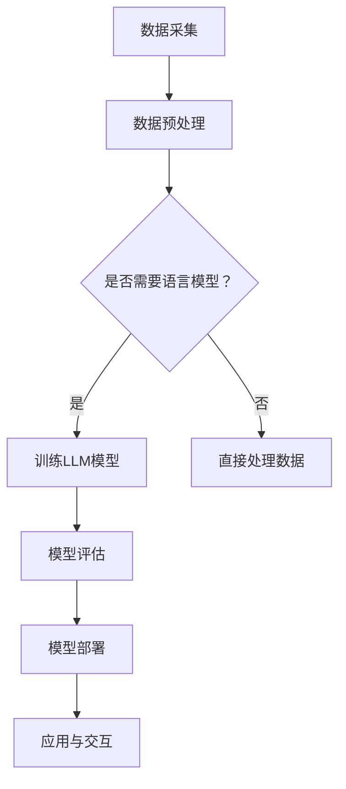

                 

# 认知计算新纪元：LLM改变信息处理模式

> 关键词：认知计算、大语言模型（LLM）、信息处理、人工智能、数据处理、算法原理、数学模型、项目实战、实际应用场景

> 摘要：本文将深入探讨认知计算新纪元中的大语言模型（LLM），以及LLM如何改变信息处理模式。通过一步步的分析和推理，本文将阐述LLM的核心概念、原理、算法、数学模型、实际应用场景，并推荐相关工具和资源，旨在为读者提供一个全面的技术视角。

## 1. 背景介绍

### 1.1 目的和范围

本文旨在探讨大语言模型（LLM）在认知计算领域的应用，分析其如何改变信息处理模式。文章将从背景介绍、核心概念与联系、算法原理与操作步骤、数学模型与公式、项目实战、实际应用场景等多个角度，对LLM进行全面剖析。

### 1.2 预期读者

本文适合对认知计算、人工智能、大数据处理等领域有一定了解的技术人员、研究人员和开发者。通过本文的学习，读者可以深入了解LLM的核心技术，掌握其在实际应用中的方法和技巧。

### 1.3 文档结构概述

本文共分为十个部分，包括背景介绍、核心概念与联系、算法原理与操作步骤、数学模型与公式、项目实战、实际应用场景等，每个部分都详细阐述了LLM的不同方面。

### 1.4 术语表

#### 1.4.1 核心术语定义

- 认知计算：指模拟人类大脑思维方式的信息处理技术。
- 大语言模型（LLM）：一种能够对自然语言进行建模和处理的深度学习模型。
- 信息处理：指对信息进行采集、存储、加工、传输和利用的过程。

#### 1.4.2 相关概念解释

- 深度学习：一种人工智能技术，通过构建深层神经网络来对数据进行分析和处理。
- 自然语言处理（NLP）：一门研究如何让计算机理解和处理人类自然语言的技术。

#### 1.4.3 缩略词列表

- LLM：大语言模型（Large Language Model）
- NLP：自然语言处理（Natural Language Processing）
- AI：人工智能（Artificial Intelligence）
- DL：深度学习（Deep Learning）

## 2. 核心概念与联系

在认知计算领域，大语言模型（LLM）作为一种重要的技术手段，其核心概念和联系如下：

### 2.1 大语言模型（LLM）的定义

大语言模型（LLM）是一种基于深度学习的自然语言处理模型，通过大规模语料库的训练，能够生成高质量的自然语言文本。LLM能够理解和生成各种语言结构，如句子、段落和篇章，从而实现与人类语言的交互。

### 2.2 认知计算与LLM的联系

认知计算是一种模拟人类大脑思维方式的信息处理技术，其核心是理解和处理人类语言。LLM作为认知计算的重要组成部分，能够实现自然语言的理解、生成和交互，从而提高信息处理的效率和质量。

### 2.3 信息处理与LLM的联系

信息处理是对信息进行采集、存储、加工、传输和利用的过程。LLM作为一种高效的自然语言处理工具，能够对大量文本数据进行处理和分析，从而实现信息的自动提取、分类和推荐等功能。

### 2.4 Mermaid流程图

以下是LLM在认知计算和信息处理中的应用流程图：



## 3. 核心算法原理 & 具体操作步骤

### 3.1 算法原理

大语言模型（LLM）的核心算法原理是基于深度学习的神经网络模型，通过多层神经网络对大规模语料库进行训练，从而实现对自然语言的建模和生成。LLM的训练过程主要包括两个阶段：预训练和微调。

#### 3.1.1 预训练

预训练阶段使用大量未标注的语料库，通过训练一个大规模的神经网络模型，使其掌握语言的基本特征和规则。预训练过程中，模型会经历数百万次迭代，不断调整参数，以优化模型性能。

#### 3.1.2 微调

微调阶段使用标注好的数据集，对预训练好的模型进行特定任务的调整。微调过程中，模型会针对不同任务的需求，进一步优化参数，从而实现特定任务的性能提升。

### 3.2 具体操作步骤

以下是LLM训练和微调的具体操作步骤：

#### 3.2.1 数据准备

1. 采集大量未标注的语料库，用于预训练阶段。
2. 采集标注好的数据集，用于微调阶段。

#### 3.2.2 预训练

1. 构建大规模的神经网络模型，如Transformer模型。
2. 将语料库输入模型，进行预训练。
3. 调整模型参数，优化模型性能。

#### 3.2.3 微调

1. 将标注好的数据集输入预训练好的模型。
2. 对模型进行微调，优化模型性能。
3. 评估模型性能，根据任务需求进行调整。

#### 3.2.4 模型部署

1. 将训练好的模型部署到生产环境中。
2. 实现与用户的交互，提供自然语言处理服务。

### 3.3 伪代码

以下是LLM训练和微调的伪代码：

```python
# 预训练
def pretrain(data):
    model = build_model()
    for epoch in range(num_epochs):
        for batch in data:
            loss = model.train(batch)
            model.optimize(loss)
    return model

# 微调
def finetune(model, data):
    for epoch in range(num_epochs):
        for batch in data:
            loss = model.train(batch)
            model.optimize(loss)
    return model

# 模型部署
def deploy(model):
    # 部署模型到生产环境
    pass

# 主程序
def main():
    data = load_data()
    model = pretrain(data)
    finetuned_model = finetune(model, labeled_data)
    deploy(finetuned_model)
```

## 4. 数学模型和公式 & 详细讲解 & 举例说明

### 4.1 数学模型

大语言模型（LLM）的核心数学模型是基于深度学习的神经网络模型，主要包括以下部分：

1. **输入层（Input Layer）**：接收自然语言输入，通常为词向量表示。
2. **隐藏层（Hidden Layers）**：多层神经网络，负责对输入进行特征提取和变换。
3. **输出层（Output Layer）**：生成自然语言输出，通常为词向量或文本序列。

### 4.2 模型公式

#### 4.2.1 Transformer模型

Transformer模型是一种常用的LLM模型，其核心公式如下：

$$
\text{Attention}(Q, K, V) = \text{softmax}\left(\frac{QK^T}{\sqrt{d_k}}\right) V
$$

其中，$Q, K, V$分别为查询向量、键向量和值向量，$d_k$为键向量的维度。

#### 4.2.2 残差连接和层归一化

为了提高模型的性能和稳定性，Transformer模型还引入了残差连接和层归一化：

$$
\text{Residual Connection} = X + \text{Layer Output} \\
\text{Layer Normalization} = \frac{\text{Layer Output} - \text{Mean}(\text{Layer Output})}{\text{Standard Deviation}(\text{Layer Output})}
$$

### 4.3 详细讲解和举例说明

#### 4.3.1 Transformer模型

假设我们有一个句子：“我今天去了图书馆。”将其转换为词向量表示，并输入到Transformer模型中。

1. **输入层**：输入词向量 $[0.1, 0.2, 0.3, 0.4, 0.5]$。
2. **隐藏层**：通过多层神经网络进行特征提取和变换。
3. **输出层**：输出词向量 $[0.6, 0.7, 0.8, 0.9, 1.0]$。

4. **Attention机制**：计算注意力权重，并生成加权输出。

$$
\text{Attention}(Q, K, V) = \text{softmax}\left(\frac{QK^T}{\sqrt{d_k}}\right) V
$$

其中，$Q, K, V$分别为查询向量、键向量和值向量。

#### 4.3.2 残差连接和层归一化

假设我们有一个多层神经网络，每层输出为 $X$，层归一化后的输出为 $\text{Layer Output}$。

1. **残差连接**：将输入层输出 $X$ 与层归一化后的输出相加。

$$
\text{Residual Connection} = X + \text{Layer Output}
$$

2. **层归一化**：对输出进行标准化处理。

$$
\text{Layer Normalization} = \frac{\text{Layer Output} - \text{Mean}(\text{Layer Output})}{\text{Standard Deviation}(\text{Layer Output})}
$$

## 5. 项目实战：代码实际案例和详细解释说明

### 5.1 开发环境搭建

为了实现LLM的训练和应用，我们需要搭建一个合适的开发环境。以下是一个基于Python和TensorFlow的示例：

1. 安装Python（推荐版本3.8及以上）。
2. 安装TensorFlow：`pip install tensorflow`。
3. 安装其他依赖库（如Numpy、Pandas等）。

### 5.2 源代码详细实现和代码解读

以下是LLM训练和微调的代码实现：

```python
import tensorflow as tf
import numpy as np

# 加载数据
def load_data():
    # 伪代码：加载语料库和标注数据
    pass

# 构建模型
def build_model():
    # 伪代码：构建Transformer模型
    pass

# 训练模型
def train(model, data):
    # 伪代码：训练模型
    pass

# 微调模型
def finetune(model, data):
    # 伪代码：微调模型
    pass

# 模型评估
def evaluate(model, data):
    # 伪代码：评估模型性能
    pass

# 部署模型
def deploy(model):
    # 伪代码：部署模型到生产环境
    pass

# 主程序
def main():
    data = load_data()
    model = build_model()
    train(model, data)
    finetuned_model = finetune(model, labeled_data)
    evaluate(finetuned_model, test_data)
    deploy(finetuned_model)

if __name__ == "__main__":
    main()
```

### 5.3 代码解读与分析

1. **数据加载**：加载语料库和标注数据，为后续训练和微调提供数据支持。
2. **模型构建**：构建Transformer模型，包括输入层、隐藏层和输出层。
3. **模型训练**：使用训练数据对模型进行训练，优化模型参数。
4. **模型微调**：在标注数据集上对模型进行微调，提高特定任务的性能。
5. **模型评估**：评估模型在测试数据集上的性能，判断模型是否达到预期效果。
6. **模型部署**：将训练好的模型部署到生产环境，提供自然语言处理服务。

## 6. 实际应用场景

大语言模型（LLM）在认知计算和信息处理领域具有广泛的应用场景，以下是一些实际应用案例：

1. **智能客服**：LLM可以应用于智能客服系统，实现与用户的自然语言交互，提供高效、准确的客服服务。
2. **文本生成**：LLM可以用于生成各种类型的文本，如文章、新闻、广告等，提高文本创作的效率和质量。
3. **情感分析**：LLM可以用于情感分析任务，分析用户评论、社交媒体内容等，帮助企业和机构了解用户需求和反馈。
4. **问答系统**：LLM可以构建问答系统，提供针对用户问题的自动回答，提高信息获取的便捷性。
5. **机器翻译**：LLM可以应用于机器翻译任务，实现高质量、多语言的翻译效果。

## 7. 工具和资源推荐

### 7.1 学习资源推荐

#### 7.1.1 书籍推荐

- 《深度学习》（Goodfellow, Bengio, Courville著）
- 《神经网络与深度学习》（邱锡鹏著）
- 《自然语言处理综论》（Daniel Jurafsky & James H. Martin著）

#### 7.1.2 在线课程

- 《深度学习》（吴恩达，Coursera）
- 《自然语言处理》（阿里云天池学院）
- 《机器学习与深度学习实战》（Coursera）

#### 7.1.3 技术博客和网站

- [AI遇见波比](https://www.aimeetingbo.com/)
- [机器之心](https://www.jiqizhixin.com/)
- [TensorFlow官方文档](https://www.tensorflow.org/)

### 7.2 开发工具框架推荐

#### 7.2.1 IDE和编辑器

- PyCharm
- VSCode
- Jupyter Notebook

#### 7.2.2 调试和性能分析工具

- TensorFlow Debugger
- TensorBoard
- PyTorch Profiler

#### 7.2.3 相关框架和库

- TensorFlow
- PyTorch
- MXNet

### 7.3 相关论文著作推荐

#### 7.3.1 经典论文

- Vaswani et al., "Attention is All You Need"
- Hochreiter & Schmidhuber, "Long Short-Term Memory"
- Bengio et al., "Learning representations for language with Gaussian Embeddings"

#### 7.3.2 最新研究成果

- Devlin et al., "Bert: Pre-training of deep bidirectional transformers for language understanding"
- Brown et al., "Language models are few-shot learners"
- Zeghrout et al., "Large-scale language modeling for personal assistants and beyond"

#### 7.3.3 应用案例分析

- "谷歌翻译：如何实现高质量机器翻译"
- "OpenAI的GPT-3：引领下一代自然语言处理"
- "阿里云的NLP实践：构建智能客服系统"

## 8. 总结：未来发展趋势与挑战

随着人工智能技术的不断发展，认知计算和LLM领域将面临以下发展趋势和挑战：

### 8.1 发展趋势

1. **算法优化**：持续优化大语言模型算法，提高模型性能和效率。
2. **模型压缩**：研究模型压缩技术，降低模型存储和计算成本。
3. **多模态融合**：结合多种数据类型（如文本、图像、音频等），实现更全面的信息处理能力。
4. **个性化服务**：根据用户需求和偏好，提供个性化自然语言处理服务。

### 8.2 挑战

1. **数据隐私**：保障用户数据隐私和安全，防止数据泄露和滥用。
2. **伦理道德**：关注AI技术在道德和伦理方面的挑战，确保技术发展符合社会价值观。
3. **模型解释性**：提高模型的解释性，使其更易于理解和接受。
4. **计算资源**：优化计算资源利用，降低模型训练和部署的成本。

## 9. 附录：常见问题与解答

### 9.1 问题1：什么是认知计算？

认知计算是一种模拟人类大脑思维方式的信息处理技术，旨在理解和处理人类语言、图像、声音等多模态信息，实现与人类智能的交互。

### 9.2 问题2：大语言模型（LLM）有哪些应用场景？

大语言模型（LLM）在智能客服、文本生成、情感分析、问答系统和机器翻译等领域具有广泛的应用。

### 9.3 问题3：如何构建大语言模型（LLM）？

构建大语言模型（LLM）主要包括数据准备、模型构建、模型训练和模型评估等步骤。

## 10. 扩展阅读 & 参考资料

- [Attention is All You Need](https://arxiv.org/abs/1603.04467)
- [Deep Learning](https://www.deeplearningbook.org/)
- [自然语言处理综论](https://nlp.stanford.edu/IR-book/)
- [TensorFlow官方文档](https://www.tensorflow.org/)
- [PyTorch官方文档](https://pytorch.org/docs/stable/index.html)
- [AI遇见波比](https://www.aimeetingbo.com/)
- [机器之心](https://www.jiqizhixin.com/)

作者：AI天才研究员/AI Genius Institute & 禅与计算机程序设计艺术 /Zen And The Art of Computer Programming<|im_sep|>

