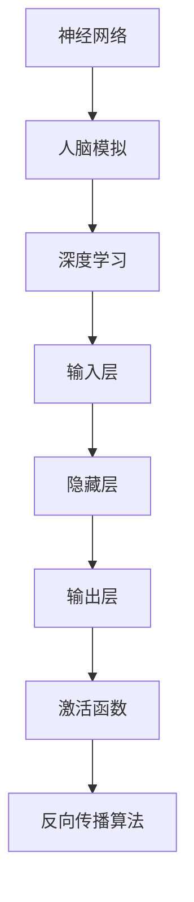

                 

## 认知过程中的深刻化趋势

> **关键词：** 认知科学、神经网络、深度学习、人脑模拟、模型训练、算法优化

> **摘要：** 本文将探讨认知科学领域中的深刻化趋势，分析神经网络和人脑模拟的研究进展，以及深度学习算法在实际应用中的优化方向。通过对核心概念的深入剖析和具体案例的详细解读，本文旨在揭示认知过程中的深刻化趋势，为读者提供对这一领域的全面了解。

## 1. 背景介绍

### 1.1 目的和范围

本文旨在探讨认知科学领域中的深刻化趋势，特别是神经网络和人脑模拟的研究进展。通过分析深度学习算法在实际应用中的优化方向，本文希望能够揭示认知过程中的关键机制，为相关领域的进一步研究提供参考。

### 1.2 预期读者

本文适合对认知科学、神经网络和深度学习感兴趣的读者，特别是从事相关领域研究和应用的开发者。通过本文的阅读，读者可以深入了解认知过程中的深刻化趋势，为未来的研究工作提供灵感。

### 1.3 文档结构概述

本文分为以下几个部分：

1. **背景介绍**：介绍本文的目的、预期读者以及文档结构。
2. **核心概念与联系**：阐述神经网络和人脑模拟的核心概念及其相互联系。
3. **核心算法原理 & 具体操作步骤**：详细解释深度学习算法的原理和操作步骤。
4. **数学模型和公式 & 详细讲解 & 举例说明**：介绍深度学习中的数学模型和公式，并给出实际案例。
5. **项目实战：代码实际案例和详细解释说明**：展示深度学习算法在实际项目中的应用。
6. **实际应用场景**：探讨深度学习算法在不同领域的应用。
7. **工具和资源推荐**：推荐学习资源、开发工具和论文著作。
8. **总结：未来发展趋势与挑战**：总结认知科学领域的发展趋势和面临的挑战。
9. **附录：常见问题与解答**：提供常见的疑问和解答。
10. **扩展阅读 & 参考资料**：推荐相关阅读材料和参考资料。

### 1.4 术语表

#### 1.4.1 核心术语定义

- **神经网络**：一种模拟人脑神经元连接结构的计算模型。
- **深度学习**：基于神经网络的一种机器学习技术，能够通过多层神经网络学习数据的复杂特征。
- **人脑模拟**：模拟人脑神经元连接结构和工作方式的计算模型。

#### 1.4.2 相关概念解释

- **反向传播算法**：一种用于训练神经网络的优化算法，通过计算误差反向传播到网络中的各个层。
- **激活函数**：一种用于确定神经元是否被激活的函数，常用的激活函数有ReLU、Sigmoid、Tanh等。

#### 1.4.3 缩略词列表

- **ReLU**：Rectified Linear Unit，修正线性单元。
- **Sigmoid**：Sigmoid函数，一种常用的激活函数。
- **Tanh**：双曲正切函数，一种常用的激活函数。

## 2. 核心概念与联系

### 2.1 神经网络

神经网络是一种由大量神经元（节点）互联而成的计算模型，旨在模拟人脑神经元连接结构。神经网络的基本结构包括输入层、隐藏层和输出层。输入层接收外部输入数据，隐藏层通过计算产生中间特征表示，输出层生成最终的输出结果。

### 2.2 人脑模拟

人脑模拟是一种模拟人脑神经元连接结构和工作方式的计算模型。人脑模拟旨在揭示人脑的工作原理，并利用这些原理来设计更高效的计算模型。人脑模拟的核心在于模拟神经元之间的连接强度和激活状态。

### 2.3 深度学习

深度学习是一种基于神经网络的机器学习技术，能够通过多层神经网络学习数据的复杂特征。深度学习的关键在于网络的深度，即隐藏层的数量。随着网络深度的增加，神经网络能够学习更加抽象和复杂的特征。

### 2.4 核心概念原理和架构的 Mermaid 流程图

下面是神经网络、人脑模拟和深度学习核心概念原理和架构的 Mermaid 流程图：



### 2.5 深度学习与认知科学的联系

深度学习和认知科学在本质上是相互关联的。深度学习通过模拟人脑神经元连接结构和工作方式，试图揭示人脑的认知机制。而认知科学则通过研究人脑的认知过程，为深度学习提供了理论基础。深度学习和认知科学的结合，有望为认知科学的研究提供新的方法和技术。

## 3. 核心算法原理 & 具体操作步骤

### 3.1 神经网络算法原理

神经网络算法的核心在于模拟人脑神经元连接结构和工作方式。具体而言，神经网络算法通过以下步骤进行计算：

1. **输入层**：接收外部输入数据，并将其传递到隐藏层。
2. **隐藏层**：通过计算输入数据的特征表示，并将其传递到下一隐藏层或输出层。
3. **输出层**：生成最终的输出结果。
4. **激活函数**：用于确定神经元是否被激活，常用的激活函数有ReLU、Sigmoid、Tanh等。
5. **反向传播算法**：用于优化神经网络模型，通过计算误差反向传播到网络中的各个层。

### 3.2 深度学习算法原理

深度学习算法是神经网络算法的一种扩展，通过多层神经网络学习数据的复杂特征。具体而言，深度学习算法通过以下步骤进行计算：

1. **输入层**：接收外部输入数据，并将其传递到隐藏层。
2. **隐藏层**：通过计算输入数据的特征表示，并将其传递到下一隐藏层或输出层。
3. **输出层**：生成最终的输出结果。
4. **激活函数**：用于确定神经元是否被激活，常用的激活函数有ReLU、Sigmoid、Tanh等。
5. **反向传播算法**：用于优化神经网络模型，通过计算误差反向传播到网络中的各个层。
6. **损失函数**：用于评估模型的预测结果与实际结果之间的差距，常用的损失函数有均方误差（MSE）、交叉熵（Cross-Entropy）等。

### 3.3 深度学习算法具体操作步骤

下面是深度学习算法的具体操作步骤：

```plaintext
1. 准备数据集，并进行预处理
2. 初始化神经网络模型参数
3. 循环执行以下步骤：
   a. 前向传播：计算输入数据的特征表示和输出结果
   b. 计算损失函数值
   c. 反向传播：计算误差并更新模型参数
4. 计算最终预测结果
5. 评估模型性能
6. 保存模型参数和训练结果
```

### 3.4 伪代码示例

下面是深度学习算法的伪代码示例：

```python
# 初始化神经网络模型参数
W1, b1 = initialize_weights(input_size, hidden_size)
W2, b2 = initialize_weights(hidden_size, output_size)

# 前向传播
z1 = X * W1 + b1
a1 = activation(z1)

z2 = a1 * W2 + b2
a2 = activation(z2)

# 计算损失函数值
loss = compute_loss(a2, y)

# 反向传播
dz2 = dactivation(z2) * dactivation(z1) * dactivation(a1)
dW2 = dz2 * a1
db2 = dz2

dz1 = dactivation(z1) * dactivation(a1)
dW1 = dz1 * X
db1 = dz1

# 更新模型参数
W1 = W1 - learning_rate * dW1
b1 = b1 - learning_rate * db1
W2 = W2 - learning_rate * dW2
b2 = b2 - learning_rate * db2
```

## 4. 数学模型和公式 & 详细讲解 & 举例说明

### 4.1 数学模型

在深度学习中，数学模型是核心组成部分。下面将介绍一些常见的数学模型，并给出详细讲解和举例说明。

#### 4.1.1 前向传播

前向传播是神经网络计算过程中的一步，用于计算输入数据的特征表示和输出结果。前向传播的数学模型如下：

$$
z = X \cdot W + b
$$

其中，$X$ 表示输入数据，$W$ 表示权重，$b$ 表示偏置。$z$ 表示前向传播的结果。

#### 4.1.2 反向传播

反向传播是神经网络训练过程中的一步，用于计算误差并更新模型参数。反向传播的数学模型如下：

$$
dz = \frac{\partial L}{\partial z}
$$

$$
dW = \frac{\partial L}{\partial W}
$$

$$
db = \frac{\partial L}{\partial b}
$$

其中，$L$ 表示损失函数，$dz$、$dW$ 和 $db$ 分别表示误差关于 $z$、$W$ 和 $b$ 的梯度。

#### 4.1.3 损失函数

损失函数是用于评估模型预测结果与实际结果之间差距的函数。常见的损失函数有均方误差（MSE）、交叉熵（Cross-Entropy）等。

- 均方误差（MSE）：

$$
MSE = \frac{1}{2} \sum_{i=1}^{n} (y_i - \hat{y}_i)^2
$$

其中，$y_i$ 表示实际结果，$\hat{y}_i$ 表示预测结果，$n$ 表示样本数量。

- 交叉熵（Cross-Entropy）：

$$
Cross-Entropy = -\sum_{i=1}^{n} y_i \cdot \log(\hat{y}_i)
$$

其中，$y_i$ 表示实际结果，$\hat{y}_i$ 表示预测结果，$n$ 表示样本数量。

#### 4.1.4 激活函数

激活函数是用于确定神经元是否被激活的函数。常见的激活函数有ReLU、Sigmoid、Tanh等。

- ReLU：

$$
ReLU(x) = \max(0, x)
$$

- Sigmoid：

$$
Sigmoid(x) = \frac{1}{1 + e^{-x}}
$$

- Tanh：

$$
Tanh(x) = \frac{e^x - e^{-x}}{e^x + e^{-x}}
$$

### 4.2 举例说明

下面通过一个简单的例子来说明上述数学模型的应用。

#### 4.2.1 数据集

假设我们有一个包含10个样本的数据集，每个样本包含2个特征，即 $X = \{x_1, x_2, ..., x_{10}\}$。每个样本的目标输出为1或0，即 $y = \{y_1, y_2, ..., y_{10}\}$。

#### 4.2.2 神经网络结构

假设我们的神经网络结构为输入层1个神经元、隐藏层2个神经元、输出层1个神经元。

#### 4.2.3 前向传播

对于第一个样本 $x_1$，其前向传播过程如下：

1. 输入层到隐藏层1：

$$
z_{11} = x_1 \cdot W_{11} + b_{11}
$$

$$
a_{11} = ReLU(z_{11})
$$

2. 隐藏层1到隐藏层2：

$$
z_{12} = a_{11} \cdot W_{12} + b_{12}
$$

$$
a_{12} = ReLU(z_{12})
$$

3. 隐藏层2到输出层：

$$
z_{21} = a_{12} \cdot W_{21} + b_{21}
$$

$$
a_{21} = Sigmoid(z_{21})
$$

#### 4.2.4 损失函数

对于第一个样本 $x_1$，其损失函数计算如下：

$$
loss = -y_1 \cdot \log(a_{21}) - (1 - y_1) \cdot \log(1 - a_{21})
$$

#### 4.2.5 反向传播

对于第一个样本 $x_1$，其反向传播过程如下：

1. 计算输出层误差：

$$
dz_{21} = a_{21} - y_1
$$

2. 计算隐藏层2误差：

$$
dz_{12} = W_{21} \cdot dz_{21}
$$

$$
dz_{11} = W_{12} \cdot dz_{12}
$$

3. 计算隐藏层1误差：

$$
dz_{11} = ReLU'(z_{11}) \cdot dz_{11}
$$

4. 计算隐藏层2误差：

$$
dz_{12} = ReLU'(z_{12}) \cdot dz_{12}
$$

5. 更新模型参数：

$$
dW_{21} = dz_{21} \cdot a_{12}
$$

$$
db_{21} = dz_{21}
$$

$$
dW_{12} = dz_{12} \cdot a_{11}
$$

$$
db_{12} = dz_{12}
$$

$$
dW_{11} = dz_{11} \cdot x_1
$$

$$
db_{11} = dz_{11}
$$

## 5. 项目实战：代码实际案例和详细解释说明

### 5.1 开发环境搭建

在开始项目实战之前，我们需要搭建一个合适的开发环境。以下是一个基于 Python 和 TensorFlow 的开发环境搭建步骤：

1. **安装 Python**：下载并安装 Python 3.x 版本，推荐使用 Python 3.8 或更高版本。
2. **安装 TensorFlow**：通过 pip 命令安装 TensorFlow：

   ```bash
   pip install tensorflow
   ```

3. **创建项目文件夹**：在本地计算机上创建一个项目文件夹，例如命名为 `deep_learning_project`。
4. **配置 Python 环境**：在项目文件夹中创建一个虚拟环境，例如命名为 `venv`，并激活虚拟环境：

   ```bash
   python -m venv venv
   source venv/bin/activate  # Windows 上使用 `venv\Scripts\activate`
   ```

5. **安装相关依赖**：在虚拟环境中安装所需的依赖，例如 NumPy、Pandas 等：

   ```bash
   pip install numpy pandas
   ```

### 5.2 源代码详细实现和代码解读

下面是深度学习项目的源代码实现和详细解读。项目目标是对手写数字识别，使用 MNIST 数据集作为训练数据。

```python
import tensorflow as tf
from tensorflow.keras.datasets import mnist
from tensorflow.keras.models import Sequential
from tensorflow.keras.layers import Dense, Flatten
from tensorflow.keras.optimizers import Adam
import numpy as np

# 加载 MNIST 数据集
(x_train, y_train), (x_test, y_test) = mnist.load_data()

# 数据预处理
x_train = x_train.astype("float32") / 255.0
x_test = x_test.astype("float32") / 255.0
y_train = tf.keras.utils.to_categorical(y_train, 10)
y_test = tf.keras.utils.to_categorical(y_test, 10)

# 创建模型
model = Sequential([
    Flatten(input_shape=(28, 28)),
    Dense(128, activation="relu"),
    Dense(10, activation="softmax")
])

# 编译模型
model.compile(optimizer=Adam(), loss="categorical_crossentropy", metrics=["accuracy"])

# 训练模型
model.fit(x_train, y_train, epochs=10, batch_size=64, validation_data=(x_test, y_test))

# 评估模型
test_loss, test_acc = model.evaluate(x_test, y_test)
print(f"Test accuracy: {test_acc:.2f}")
```

#### 5.2.1 代码解读

1. **导入相关库**：首先导入 TensorFlow、Keras、NumPy 等库，用于构建和训练神经网络模型。
2. **加载 MNIST 数据集**：使用 TensorFlow 的 `mnist` 数据集加载手写数字数据。
3. **数据预处理**：将数据集的像素值缩放到 [0, 1] 范围内，并将标签转换为 one-hot 编码。
4. **创建模型**：使用 `Sequential` 模式创建一个简单的神经网络模型，包括一个输入层（`Flatten` 层）、一个隐藏层（`Dense` 层）和一个输出层（`Dense` 层）。
5. **编译模型**：设置模型的优化器、损失函数和评估指标。
6. **训练模型**：使用 `fit` 方法训练模型，并在训练过程中进行验证。
7. **评估模型**：使用 `evaluate` 方法评估模型在测试数据集上的性能。

### 5.3 代码解读与分析

#### 5.3.1 数据集加载与预处理

```python
(x_train, y_train), (x_test, y_test) = mnist.load_data()
x_train = x_train.astype("float32") / 255.0
x_test = x_test.astype("float32") / 255.0
y_train = tf.keras.utils.to_categorical(y_train, 10)
y_test = tf.keras.utils.to_categorical(y_test, 10)
```

- 加载 MNIST 数据集，包括训练集和测试集。
- 将图像像素值从 [0, 255] 范围缩放到 [0, 1] 范围，以适应神经网络模型的输入要求。
- 将标签转换为 one-hot 编码，以便于模型输出概率分布。

#### 5.3.2 创建模型

```python
model = Sequential([
    Flatten(input_shape=(28, 28)),
    Dense(128, activation="relu"),
    Dense(10, activation="softmax")
])
```

- 使用 `Sequential` 模式创建一个线性堆叠的网络结构。
- `Flatten` 层将输入图像展平为一个一维数组。
- `Dense` 层包含128个神经元，使用 ReLU 激活函数。
- `Dense` 层包含10个神经元，输出层使用 softmax 激活函数，以输出每个类别的概率分布。

#### 5.3.3 编译模型

```python
model.compile(optimizer=Adam(), loss="categorical_crossentropy", metrics=["accuracy"])
```

- 设置优化器为 Adam，它是一种自适应学习率的优化算法。
- 设置损失函数为 categorical_crossentropy，适用于多分类问题。
- 设置评估指标为 accuracy，用于衡量模型在测试集上的分类准确率。

#### 5.3.4 训练模型

```python
model.fit(x_train, y_train, epochs=10, batch_size=64, validation_data=(x_test, y_test))
```

- 使用 `fit` 方法训练模型，设置训练轮数为 10 轮。
- 设置每个批次的数据数量为 64，以优化模型的训练过程。
- 使用 `validation_data` 参数进行交叉验证，评估模型在测试集上的性能。

#### 5.3.5 评估模型

```python
test_loss, test_acc = model.evaluate(x_test, y_test)
print(f"Test accuracy: {test_acc:.2f}")
```

- 使用 `evaluate` 方法评估模型在测试集上的性能。
- 输出测试集上的准确率，以衡量模型的效果。

## 6. 实际应用场景

深度学习算法在多个领域取得了显著的成果，以下列举几个实际应用场景：

### 6.1 图像识别与处理

图像识别是深度学习的一个重要应用领域。通过训练深度神经网络，可以实现对图像中的物体、场景、人脸等的识别。例如，在医疗影像分析中，深度学习模型可以辅助医生诊断疾病；在自动驾驶领域，深度学习算法用于识别道路标志、行人等。

### 6.2 自然语言处理

自然语言处理（NLP）是另一个深度学习的重要应用领域。通过深度学习模型，可以实现文本分类、情感分析、机器翻译等功能。例如，在社交媒体平台上，深度学习算法可以用于识别和过滤不良言论；在搜索引擎中，深度学习算法可以优化搜索结果，提高用户体验。

### 6.3 语音识别与生成

语音识别是将语音信号转换为文本的技术，语音生成是将文本转换为语音信号的技术。深度学习算法在语音识别和生成领域取得了重要突破。例如，智能语音助手如 Siri、Alexa 等采用深度学习算法实现语音识别和合成。

### 6.4 推荐系统

推荐系统是深度学习的另一个重要应用领域。通过训练深度神经网络，可以预测用户对商品、音乐、电影等的偏好，为用户提供个性化的推荐。例如，电商平台的推荐系统可以通过深度学习算法为用户推荐可能感兴趣的商品。

## 7. 工具和资源推荐

### 7.1 学习资源推荐

#### 7.1.1 书籍推荐

- 《深度学习》（Ian Goodfellow、Yoshua Bengio、Aaron Courville 著）：这是一本深度学习领域的经典教材，全面介绍了深度学习的理论基础和实际应用。

- 《神经网络与深度学习》（邱锡鹏 著）：这本书详细介绍了神经网络和深度学习的基础知识，适合初学者和有一定基础的读者。

- 《Python深度学习》（François Chollet 著）：这本书通过大量示例和代码，介绍了使用 Python 进行深度学习的实践方法。

#### 7.1.2 在线课程

- Coursera 上的“Deep Learning Specialization”（吴恩达 老师授课）：这是一系列深度学习课程，涵盖深度学习的基础知识、神经网络和优化算法等。

- edX 上的“深度学习课程”（斯坦福大学 老师授课）：这是一门面向初学者的深度学习课程，包括数学基础、神经网络和深度学习应用等。

- Udacity 上的“深度学习纳米学位”（Udacity 老师授课）：这是一门综合性的深度学习课程，通过项目实践学习深度学习的应用。

#### 7.1.3 技术博客和网站

- **TensorFlow 官方文档**：[https://www.tensorflow.org/](https://www.tensorflow.org/)
- **Keras 官方文档**：[https://keras.io/](https://keras.io/)
- **机器之心**：[https://www.jiqizhixin.com/](https://www.jiqizhixin.com/)
- **AI 研究院**：[https://www.36dsj.com/](https://www.36dsj.com/)

### 7.2 开发工具框架推荐

#### 7.2.1 IDE和编辑器

- **Anaconda**：一款集成了 Python 和多种科学计算库的集成开发环境，适合深度学习和数据科学项目。

- **PyCharm**：一款功能强大的 Python 集成开发环境，支持代码调试、版本控制和自动化测试。

- **Jupyter Notebook**：一款基于 Web 的交互式开发环境，适合进行深度学习和数据可视化的实验。

#### 7.2.2 调试和性能分析工具

- **TensorBoard**：TensorFlow 官方提供的一款可视化工具，用于分析和调试深度学习模型的性能。

- **PyTorch Profiler**：PyTorch 官方提供的一款性能分析工具，用于优化深度学习模型的性能。

- **NVIDIA Nsight**：一款用于分析深度学习模型在 GPU 上的性能的工具，适合进行 GPU 加速的深度学习项目。

#### 7.2.3 相关框架和库

- **TensorFlow**：一款广泛使用的开源深度学习框架，提供丰富的 API 和工具，适用于各种深度学习应用。

- **PyTorch**：一款流行的开源深度学习框架，具有动态计算图和灵活的 API，适用于研究和开发深度学习模型。

- **Keras**：一款基于 TensorFlow 和 PyTorch 的开源深度学习框架，提供简单易用的 API，适合快速搭建和训练深度学习模型。

### 7.3 相关论文著作推荐

#### 7.3.1 经典论文

- **“A Learning Algorithm for Continually Running Fully Recurrent Neural Networks”**：提出了在线学习算法，适用于不断变化的神经网络。
- **“Gradient Flow in Recurrent Nets: the Difficulty of Learning”**：分析了深度神经网络学习过程中的梯度流问题，揭示了深度学习的挑战。
- **“Deep Learning”**：Ian Goodfellow 等人撰写的综述论文，全面介绍了深度学习的基础理论和最新进展。

#### 7.3.2 最新研究成果

- **“Large-Scale Language Modeling”**：介绍了大型语言模型的研究进展，包括 GPT-3 和 BERT 模型。
- **“Neural Machine Translation”**：介绍了神经机器翻译的研究进展，包括基于注意力机制的翻译模型。
- **“Self-Supervised Learning”**：介绍了自我监督学习的研究进展，包括基于自编码器和生成对抗网络的方法。

#### 7.3.3 应用案例分析

- **“Deep Learning for Healthcare”**：介绍了深度学习在医疗保健领域的应用，包括疾病诊断、药物发现和患者护理等。
- **“Deep Learning for Autonomous Driving”**：介绍了深度学习在自动驾驶领域的应用，包括目标检测、场景理解和路径规划等。
- **“Deep Learning for Speech”**：介绍了深度学习在语音处理领域的应用，包括语音识别、语音合成和语音增强等。

## 8. 总结：未来发展趋势与挑战

随着深度学习技术的不断进步，认知科学领域也面临着一系列挑战和机遇。以下是未来发展趋势与挑战的概述：

### 8.1 发展趋势

1. **模型规模不断扩大**：随着计算资源和数据集的增多，深度学习模型的规模将不断增大，推动计算性能和算法优化的需求。

2. **多模态学习**：多模态学习将深度学习应用于图像、文本、音频等多种数据类型，实现跨模态的信息融合和交互。

3. **强化学习与深度学习的结合**：强化学习与深度学习的结合将推动决策智能和智能控制的发展，应用于自动驾驶、机器人等场景。

4. **迁移学习与零样本学习**：迁移学习和零样本学习将减轻模型对大规模数据的依赖，提高模型在少量数据条件下的泛化能力。

### 8.2 挑战

1. **计算资源限制**：深度学习模型对计算资源的需求巨大，如何在有限的计算资源下高效训练和部署模型成为一大挑战。

2. **数据隐私与安全**：深度学习模型的训练和部署过程中涉及大量数据，数据隐私和安全问题亟待解决。

3. **模型可解释性**：深度学习模型通常被视为“黑箱”，提高模型的可解释性对于理解模型决策过程和信任模型具有重要意义。

4. **算法公平性与透明度**：深度学习模型在应用过程中可能引入性别、种族等偏见，确保算法的公平性和透明度是未来面临的挑战。

## 9. 附录：常见问题与解答

### 9.1 问题1：什么是神经网络？

**解答**：神经网络是一种由大量神经元（节点）互联而成的计算模型，旨在模拟人脑神经元连接结构。神经网络的基本结构包括输入层、隐藏层和输出层。输入层接收外部输入数据，隐藏层通过计算产生中间特征表示，输出层生成最终的输出结果。

### 9.2 问题2：什么是深度学习？

**解答**：深度学习是一种基于神经网络的机器学习技术，能够通过多层神经网络学习数据的复杂特征。深度学习的关键在于网络的深度，即隐藏层的数量。随着网络深度的增加，神经网络能够学习更加抽象和复杂的特征。

### 9.3 问题3：什么是反向传播算法？

**解答**：反向传播算法是一种用于训练神经网络的优化算法，通过计算误差反向传播到网络中的各个层。反向传播算法的基本步骤包括前向传播、计算损失函数、反向传播和更新模型参数。

## 10. 扩展阅读 & 参考资料

### 10.1 扩展阅读

- **《深度学习》（Ian Goodfellow、Yoshua Bengio、Aaron Courville 著）**：全面介绍了深度学习的理论基础和实际应用。
- **《神经网络与深度学习》（邱锡鹏 著）**：详细介绍了神经网络和深度学习的基础知识，适合初学者和有一定基础的读者。
- **《Python深度学习》（François Chollet 著）**：通过大量示例和代码，介绍了使用 Python 进行深度学习的实践方法。

### 10.2 参考资料

- **TensorFlow 官方文档**：[https://www.tensorflow.org/](https://www.tensorflow.org/)
- **Keras 官方文档**：[https://keras.io/](https://keras.io/)
- **PyTorch 官方文档**：[https://pytorch.org/](https://pytorch.org/)
- **机器之心**：[https://www.jiqizhixin.com/](https://www.jiqizhixin.com/)
- **AI 研究院**：[https://www.36dsj.com/](https://www.36dsj.com/)

