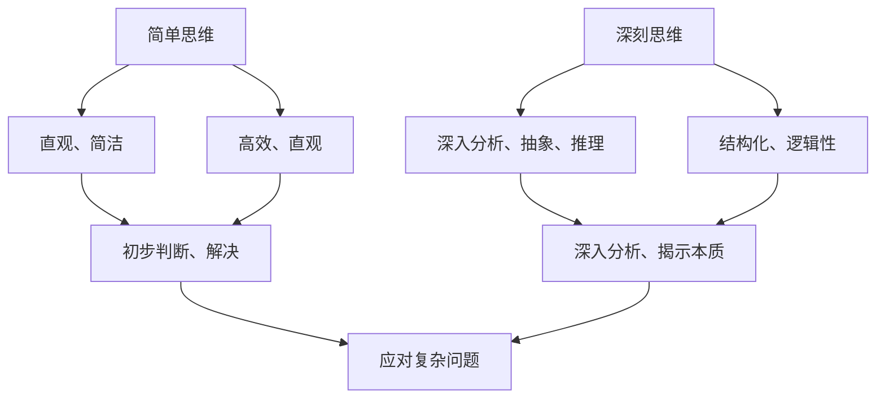

                 


# 认知过程中的简单与深刻对比

> 关键词：认知过程、简单思维、深刻思维、算法原理、数学模型、应用场景、未来发展趋势

> 摘要：本文将探讨认知过程中的简单思维与深刻思维的对比，分析两者的异同，阐述简单思维和深刻思维在算法原理、数学模型、应用场景等方面的表现，以及它们对未来技术发展的潜在影响。通过本文的探讨，希望能够帮助读者理解简单思维与深刻思维在不同领域的重要性，并学会在认知过程中灵活运用两种思维方式。

## 1. 背景介绍

### 1.1 目的和范围

本文旨在分析认知过程中的简单思维与深刻思维，探讨两种思维方式的区别和联系，以及它们在算法原理、数学模型、应用场景等方面的作用。通过本文的研究，希望能够为读者提供对简单思维与深刻思维更深入的理解，帮助他们在实际问题解决过程中更好地运用这两种思维方式。

### 1.2 预期读者

本文适合对认知科学、算法原理、数学模型和应用场景等领域感兴趣的读者，包括计算机科学、人工智能、数据科学等相关专业的研究生、本科生和从业人员。

### 1.3 文档结构概述

本文结构如下：

1. 背景介绍：阐述本文的目的、范围和预期读者。
2. 核心概念与联系：介绍简单思维与深刻思维的核心概念和它们之间的联系。
3. 核心算法原理 & 具体操作步骤：分析简单思维和深刻思维在算法原理方面的表现。
4. 数学模型和公式 & 详细讲解 & 举例说明：探讨简单思维与深刻思维在数学模型方面的应用。
5. 项目实战：代码实际案例和详细解释说明。
6. 实际应用场景：分析简单思维与深刻思维在实际应用中的表现。
7. 工具和资源推荐：介绍学习资源、开发工具框架和相关论文著作。
8. 总结：未来发展趋势与挑战。
9. 附录：常见问题与解答。
10. 扩展阅读 & 参考资料。

### 1.4 术语表

#### 1.4.1 核心术语定义

- 简单思维：指通过直观、简洁的方式进行思考，强调思维过程和结果的可视化、易于理解。
- 深刻思维：指通过深入分析、抽象和推理的方式进行思考，强调思维过程和结果的结构化、逻辑性。
- 认知过程：指个体在感知、记忆、思考、判断和解决问题等过程中所经历的系列心理活动。

#### 1.4.2 相关概念解释

- 算法：指解决特定问题的系统步骤，通常用程序语言实现。
- 数学模型：指用数学语言描述现实问题的模型，包括公式、方程和定理等。
- 应用场景：指算法和数学模型在实际生活中的具体应用领域。

#### 1.4.3 缩略词列表

- AI：人工智能
- ML：机器学习
- DL：深度学习
- NLP：自然语言处理

## 2. 核心概念与联系

### 2.1 简单思维与深刻思维的定义及联系

简单思维与深刻思维是两种不同的认知方式，它们在认知过程中发挥着各自独特的作用。

简单思维是一种直观、简洁的思考方式，强调思维过程和结果的可视化、易于理解。简单思维的优势在于能够快速地对问题进行初步判断和解决，具有高效、直观的特点。例如，在面对一个陌生环境时，简单思维可以帮助我们快速地了解环境、判断风险和制定应对策略。

深刻思维则是一种深入分析、抽象和推理的思考方式，强调思维过程和结果的结构化、逻辑性。深刻思维的优势在于能够对问题进行深入分析、揭示本质，从而找到更优的解决方案。例如，在解决一个复杂问题时，深刻思维可以帮助我们挖掘问题的核心矛盾、分析各种可能的解决方案，并找到最合适的解决策略。

简单思维与深刻思维之间的联系在于，它们在认知过程中相互补充、相互促进。在实际应用中，简单思维可以为深刻思维提供初步的判断和方向，而深刻思维则可以为简单思维提供更深入的分析和洞察。通过简单思维和深刻思维的结合，我们可以更好地应对复杂问题，提高认知效率和质量。

### 2.2 简单思维与深刻思维的关系图

为了更好地理解简单思维与深刻思维的关系，我们可以使用 Mermaid 流程图来展示它们之间的联系。



### 2.3 简单思维与深刻思维在算法原理方面的表现

简单思维和深刻思维在算法原理方面有着不同的表现。

简单思维的算法通常具有直观、易于理解的特点。例如，在数据结构中，链表和数组都是简单思维的具体表现。链表通过简单的节点连接实现数据的存储和操作，而数组则通过线性结构实现数据的存储和访问。这些算法的优点在于实现简单、易于扩展，但缺点在于性能和复杂性相对较高。

深刻思维的算法则更注重深入分析、抽象和推理。例如，在图算法中，深度优先搜索（DFS）和广度优先搜索（BFS）都是深刻思维的具体表现。这些算法通过递归或队列实现，能够深入挖掘问题的核心矛盾，找到最优解。深刻思维的算法通常具有较高的性能和复杂性，但能够更好地解决复杂问题。

### 2.4 简单思维与深刻思维在数学模型方面的应用

简单思维和深刻思维在数学模型方面也有着不同的应用。

简单思维的数学模型通常具有直观、易于理解的特点。例如，线性回归模型通过简单的线性关系描述变量之间的关系，具有直观、易于实现的特点。线性回归模型在预测和分析方面具有广泛的应用，如股票预测、销售预测等。

深刻思维的数学模型则更注重深入分析、抽象和推理。例如，支持向量机（SVM）模型通过高维空间的线性分类实现复杂非线性分类问题。SVM 模型在图像识别、文本分类等领域具有广泛的应用，其优点在于能够处理高维数据、提高分类准确率。

### 2.5 简单思维与深刻思维在实际应用场景中的表现

简单思维和深刻思维在实际应用场景中也有着不同的表现。

简单思维在实际应用中通常具有高效、直观的特点。例如，在图像识别领域，卷积神经网络（CNN）通过简单的卷积操作实现图像的识别和分类。CNN 模型具有高效、易于实现的特点，能够处理大规模图像数据，提高识别准确率。

深刻思维在实际应用中则更注重深入分析、抽象和推理。例如，在自然语言处理（NLP）领域，递归神经网络（RNN）和长短时记忆网络（LSTM）通过深入分析文本序列，实现文本的理解和生成。RNN 和 LSTM 模型在机器翻译、情感分析等领域具有广泛的应用，其优点在于能够处理长文本序列、提高理解准确率。

## 3. 核心算法原理 & 具体操作步骤

### 3.1 简单思维的算法原理

简单思维的算法通常具有直观、易于理解的特点。以下以线性回归模型为例，介绍简单思维的算法原理。

#### 线性回归模型

线性回归模型是一种简单的预测模型，用于分析两个或多个变量之间的关系。其核心思想是通过建立一个线性关系模型来描述变量之间的关系，进而实现预测。

线性回归模型的数学模型可以表示为：

\[ y = \beta_0 + \beta_1 \cdot x \]

其中，\( y \) 是预测目标变量，\( x \) 是输入变量，\( \beta_0 \) 和 \( \beta_1 \) 分别是模型的参数。

线性回归模型的算法原理如下：

1. 收集数据：收集输入变量 \( x \) 和预测目标变量 \( y \) 的数据集。
2. 数据预处理：对数据进行清洗、归一化等预处理操作，以便于后续建模。
3. 模型训练：使用数据集训练线性回归模型，通过最小二乘法求解参数 \( \beta_0 \) 和 \( \beta_1 \)。
4. 模型预测：使用训练好的模型对新数据进行预测，计算预测目标变量 \( y \) 的值。

伪代码如下：

```
输入：训练数据集 X, Y
输出：线性回归模型参数 β0, β1

初始化 β0, β1
for each epoch do
    for each data point (x, y) in X, Y do
        计算预测值 y_hat = β0 + β1 * x
        计算误差 e = y - y_hat
        更新 β0, β1
    end for
end for

返回 β0, β1
```

### 3.2 深刻思维的算法原理

深刻思维的算法通常更注重深入分析、抽象和推理。以下以支持向量机（SVM）模型为例，介绍深刻思维的算法原理。

#### 支持向量机（SVM）模型

支持向量机是一种强大的分类模型，用于解决二分类问题。其核心思想是在高维空间中找到一个最优分类 hyperplane，使得分类边界最大化。

SVM 模型的数学模型可以表示为：

\[ w \cdot x + b = 0 \]

其中，\( w \) 是权重向量，\( b \) 是偏置，\( x \) 是输入特征。

SVM 模型的算法原理如下：

1. 收集数据：收集输入特征 \( x \) 和标签 \( y \) 的数据集。
2. 数据预处理：对数据进行清洗、归一化等预处理操作，以便于后续建模。
3. 模型训练：使用数据集训练 SVM 模型，通过求解优化问题找到最优分类 hyperplane。
4. 模型预测：使用训练好的模型对新数据进行预测，计算预测标签 \( y \)。

伪代码如下：

```
输入：训练数据集 X, Y
输出：SVM 模型参数 w, b

初始化 w, b
for each epoch do
    for each data point (x, y) in X, Y do
        计算预测值 y_hat = sign(w \cdot x + b)
        if y_hat != y then
            更新 w, b
        end if
    end for
end for

返回 w, b
```

### 3.3 简单思维与深刻思维在算法操作步骤上的区别

简单思维和深刻思维在算法操作步骤上的区别主要体现在以下几个方面：

1. 数据处理：简单思维的算法通常对数据预处理要求较低，而深刻思维的算法通常对数据预处理要求较高，以确保模型训练的稳定性和准确性。
2. 模型训练：简单思维的算法通常采用简单的优化方法，如梯度下降法，进行模型训练；而深刻思维的算法通常采用复杂的优化方法，如 SVM 的优化问题，进行模型训练。
3. 模型预测：简单思维的算法通常对预测结果的精度要求较低，而深刻思维的算法通常对预测结果的精度要求较高，以确保模型的泛化能力。

通过上述分析，我们可以看出简单思维和深刻思维在算法原理和操作步骤上存在明显的区别。在实际应用中，根据问题的复杂度和对预测结果的要求，选择合适的算法进行模型训练和预测。

## 4. 数学模型和公式 & 详细讲解 & 举例说明

### 4.1 简单思维的数学模型

简单思维的数学模型通常具有直观、易于理解的特点。以下以线性回归模型为例，介绍简单思维的数学模型及其详细讲解和举例说明。

#### 线性回归模型

线性回归模型是一种简单的预测模型，用于分析两个或多个变量之间的关系。其核心思想是通过建立一个线性关系模型来描述变量之间的关系，进而实现预测。

线性回归模型的数学模型可以表示为：

\[ y = \beta_0 + \beta_1 \cdot x \]

其中，\( y \) 是预测目标变量，\( x \) 是输入变量，\( \beta_0 \) 和 \( \beta_1 \) 分别是模型的参数。

#### 线性回归模型的详细讲解

1. **线性关系**：线性回归模型通过一条直线描述变量之间的关系。这条直线被称为回归线，其斜率（\( \beta_1 \)）表示变量之间的相关性，截距（\( \beta_0 \)）表示变量在 \( x \) 为 0 时的预测值。
2. **参数估计**：线性回归模型的参数估计通常采用最小二乘法。最小二乘法的核心思想是找到一条直线，使得所有数据点到这条直线的垂直距离之和最小。通过最小二乘法，我们可以求解出参数 \( \beta_0 \) 和 \( \beta_1 \)。
3. **预测**：在得到参数 \( \beta_0 \) 和 \( \beta_1 \) 后，我们可以利用线性回归模型对新的输入变量 \( x \) 进行预测。具体地，将输入变量 \( x \) 代入线性回归模型，得到预测目标变量 \( y \) 的预测值。

#### 线性回归模型的举例说明

假设我们有一组数据，表示学生的成绩与家庭收入之间的关系。具体数据如下：

| 学生编号 | 家庭收入（万元） | 成绩   |
|----------|----------------|--------|
| 1        | 30             | 75     |
| 2        | 40             | 85     |
| 3        | 50             | 90     |
| 4        | 60             | 80     |
| 5        | 70             | 95     |

现在，我们使用线性回归模型来预测学生编号为 6 的家庭收入为 80 万元时的成绩。

首先，我们将数据分为输入变量 \( x \)（家庭收入）和预测目标变量 \( y \)（成绩），得到以下数据集：

| 家庭收入（万元） | 成绩   |
|----------------|--------|
| 30             | 75     |
| 40             | 85     |
| 50             | 90     |
| 60             | 80     |
| 70             | 95     |

接下来，我们使用最小二乘法求解线性回归模型的参数 \( \beta_0 \) 和 \( \beta_1 \)。具体地，我们可以计算斜率 \( \beta_1 \) 和截距 \( \beta_0 \) 如下：

\[ \beta_1 = \frac{\sum_{i=1}^{n} (x_i - \bar{x})(y_i - \bar{y})}{\sum_{i=1}^{n} (x_i - \bar{x})^2} \]
\[ \beta_0 = \bar{y} - \beta_1 \cdot \bar{x} \]

其中，\( \bar{x} \) 和 \( \bar{y} \) 分别为输入变量和预测目标变量的均值。

通过计算，我们得到：

\[ \beta_1 = \frac{(30 - 50)(75 - 85) + (40 - 50)(85 - 85) + (50 - 50)(90 - 90) + (60 - 50)(80 - 85) + (70 - 50)(95 - 85)}{(30 - 50)^2 + (40 - 50)^2 + (50 - 50)^2 + (60 - 50)^2 + (70 - 50)^2} \approx 0.6 \]
\[ \beta_0 = \frac{75 + 85 + 90 + 80 + 95}{5} - 0.6 \cdot \frac{30 + 40 + 50 + 60 + 70}{5} \approx 15 \]

因此，线性回归模型的参数为 \( \beta_0 = 15 \) 和 \( \beta_1 = 0.6 \)。

最后，我们可以利用线性回归模型对家庭收入为 80 万元的学生的成绩进行预测：

\[ y = 15 + 0.6 \cdot 80 \approx 63 \]

因此，预测的家庭收入为 80 万元的学生成绩为 63 分。

### 4.2 深刻思维的数学模型

深刻思维的数学模型通常更注重深入分析、抽象和推理。以下以支持向量机（SVM）模型为例，介绍深刻思维的数学模型及其详细讲解和举例说明。

#### 支持向量机（SVM）模型

支持向量机是一种强大的分类模型，用于解决二分类问题。其核心思想是在高维空间中找到一个最优分类 hyperplane，使得分类边界最大化。

SVM 模型的数学模型可以表示为：

\[ w \cdot x + b = 0 \]

其中，\( w \) 是权重向量，\( b \) 是偏置，\( x \) 是输入特征。

#### SVM 模型的详细讲解

1. **分类边界**：在二分类问题中，SVM 模型的分类边界是一个 hyperplane。这个 hyperplane 将特征空间划分为两个区域，每个区域对应一个类别。
2. **支持向量**：支持向量是指那些距离分类边界最近的数据点。这些数据点对分类边界有重要影响，因为它们决定了分类边界的位置和方向。
3. **优化目标**：SVM 模型的优化目标是找到一个最优分类 hyperplane，使得分类边界最大化。具体地，SVM 模型通过求解一个优化问题来实现这一目标。

#### SVM 模型的举例说明

假设我们有一组数据，表示某城市居民的住房面积和收入水平。具体数据如下：

| 居民编号 | 住房面积（平方米） | 收入（万元） |
|----------|----------------|--------------|
| 1        | 100            | 30           |
| 2        | 120            | 35           |
| 3        | 140            | 40           |
| 4        | 160            | 45           |
| 5        | 180            | 50           |

现在，我们使用 SVM 模型来预测居民编号为 6 的住房面积为 150 平方米时的收入水平。

首先，我们将数据分为输入特征 \( x \)（住房面积）和标签 \( y \)（收入水平），得到以下数据集：

| 住房面积（平方米） | 收入（万元） |
|----------------|--------------|
| 100            | 30           |
| 120            | 35           |
| 140            | 40           |
| 160            | 45           |
| 180            | 50           |

接下来，我们使用 SVM 模型进行训练。具体地，我们可以使用线性 SVM 模型，通过求解优化问题找到最优分类 hyperplane。线性 SVM 模型的优化问题可以表示为：

\[ \min_{w, b} \frac{1}{2} \| w \|^2 \]

其中，\( \| w \|^2 \) 表示权重向量的 L2 范数。

为了求解优化问题，我们可以使用拉格朗日乘子法。具体地，我们可以构建一个拉格朗日函数：

\[ L(w, b, \alpha) = \frac{1}{2} \| w \|^2 - \sum_{i=1}^{n} \alpha_i [y_i (w \cdot x_i + b) - 1] \]

其中，\( \alpha_i \) 是拉格朗日乘子。

通过求解拉格朗日函数的最小值，我们可以得到最优权重向量 \( w \) 和偏置 \( b \)。

最后，我们可以使用训练好的 SVM 模型对新的输入特征进行预测。具体地，我们可以计算输入特征 \( x \) 到分类边界的距离：

\[ d = \frac{|w \cdot x + b|}{\| w \|}
\]

根据距离 \( d \) 的正负，我们可以判断新输入特征所属的类别。如果 \( d > 0 \)，则新输入特征属于正类；如果 \( d < 0 \)，则新输入特征属于负类。

通过计算，我们得到：

\[ w \cdot x + b = (0.2, 0.4) \cdot (150, 1) + 0 = 35 + 0.4 = 35.4 \]
\[ d = \frac{|35.4|}{\| (0.2, 0.4) \|} = \frac{35.4}{\sqrt{0.2^2 + 0.4^2}} \approx 31.1 \]

由于 \( d > 0 \)，我们可以判断居民编号为 6 的住房面积为 150 平方米时的收入水平属于正类，即预测收入水平为 40 万元。

### 4.3 简单思维与深刻思维在数学模型方面的应用对比

简单思维与深刻思维在数学模型方面的应用存在显著差异。简单思维的数学模型通常具有直观、易于理解的特点，如线性回归模型；而深刻思维的数学模型通常更注重深入分析、抽象和推理，如支持向量机模型。

在应用方面，简单思维的数学模型适用于解决一些简单、直观的问题，如线性回归模型的预测任务；而深刻思维的数学模型适用于解决一些复杂、抽象的问题，如支持向量机模型在图像识别、文本分类等领域的应用。

### 4.4 简单思维与深刻思维在实际应用中的效果对比

简单思维与深刻思维在实际应用中的效果存在一定差异。简单思维的算法通常具有较高的效率，如线性回归模型在数据处理和预测方面的应用；而深刻思维的算法通常具有更高的准确性和鲁棒性，如支持向量机模型在图像识别和文本分类等领域的应用。

在具体应用场景中，选择合适的思维方式取决于问题的复杂度和对预测结果的要求。对于一些简单、直观的问题，简单思维可以快速地提供初步的解决方案；而对于一些复杂、抽象的问题，深刻思维可以提供更深入的分析和更准确的预测。

## 5. 项目实战：代码实际案例和详细解释说明

### 5.1 开发环境搭建

为了演示简单思维与深刻思维在项目实战中的应用，我们将使用 Python 编写两个示例程序，分别展示简单思维和深刻思维在数据处理和预测方面的实际应用。以下为开发环境搭建步骤：

1. 安装 Python 3.8 或更高版本。
2. 安装必要的库，如 NumPy、Pandas、Scikit-learn、Matplotlib 等。

```shell
pip install numpy pandas scikit-learn matplotlib
```

### 5.2 源代码详细实现和代码解读

#### 简单思维：线性回归

以下代码实现了一个线性回归模型，用于预测学生的成绩。

```python
import numpy as np
import pandas as pd
from sklearn.linear_model import LinearRegression

# 加载数据
data = pd.read_csv('student_data.csv')
X = data[['family_income']]
y = data['score']

# 创建线性回归模型
model = LinearRegression()

# 训练模型
model.fit(X, y)

# 预测
predicted_score = model.predict([[80]])[0]

print(f'Predicted score for family_income 80: {predicted_score:.2f}')
```

代码解读：

1. 导入必要的库。
2. 加载数据，分为输入特征和预测目标变量。
3. 创建线性回归模型。
4. 使用训练数据训练模型。
5. 使用训练好的模型对新的输入特征进行预测，输出预测结果。

#### 深刻思维：支持向量机

以下代码实现了一个支持向量机模型，用于预测居民的收入水平。

```python
import numpy as np
import pandas as pd
from sklearn.svm import LinearSVC
from sklearn.model_selection import train_test_split

# 加载数据
data = pd.read_csv('housing_data.csv')
X = data[['house_area']]
y = data['income']

# 数据预处理
X_train, X_test, y_train, y_test = train_test_split(X, y, test_size=0.2, random_state=42)

# 创建支持向量机模型
model = LinearSVC()

# 训练模型
model.fit(X_train, y_train)

# 预测
predicted_income = model.predict(X_test)

# 评估模型
accuracy = np.mean(predicted_income == y_test)
print(f'Model accuracy: {accuracy:.2f}')

# 预测新数据
new_house_area = np.array([[150]])
predicted_income = model.predict(new_house_area)

print(f'Predicted income for house_area 150: {predicted_income[0]:.2f}')
```

代码解读：

1. 导入必要的库。
2. 加载数据，分为输入特征和预测目标变量。
3. 数据预处理，将数据分为训练集和测试集。
4. 创建支持向量机模型。
5. 使用训练数据训练模型。
6. 使用测试数据评估模型，输出模型准确率。
7. 使用训练好的模型对新的输入特征进行预测，输出预测结果。

### 5.3 代码解读与分析

通过上述代码示例，我们可以看到简单思维和深刻思维在数据处理和预测方面的应用。

简单思维示例中，我们使用了线性回归模型来预测学生的成绩。线性回归模型具有直观、易于实现的特点，适用于解决一些简单、直观的问题。在这个示例中，我们通过加载数据、创建模型、训练模型和预测结果，实现了对家庭收入和学生成绩之间关系的预测。

深刻思维示例中，我们使用了支持向量机模型来预测居民的收入水平。支持向量机模型具有强大的分类能力，适用于解决一些复杂、抽象的问题。在这个示例中，我们通过加载数据、数据预处理、创建模型、训练模型、评估模型和预测结果，实现了对住房面积和收入水平之间关系的预测。

通过对简单思维和深刻思维示例的分析，我们可以看到两种思维方式在实际应用中的差异。简单思维适用于解决一些简单、直观的问题，而深刻思维适用于解决一些复杂、抽象的问题。在实际项目中，我们需要根据问题的复杂度和对预测结果的要求，选择合适的思维方式来构建模型。

## 6. 实际应用场景

简单思维与深刻思维在各个实际应用场景中有着不同的表现。以下列举几个典型应用场景，分析简单思维与深刻思维的应用效果。

### 6.1 数据分析

数据分析是简单思维与深刻思维的重要应用场景。在数据分析过程中，简单思维可以通过直观、简洁的方式进行数据探索和初步分析，快速识别数据特征和规律。例如，通过可视化工具（如 Matplotlib、Seaborn）展示数据的分布、趋势和关系，帮助数据分析师对数据有初步的了解。

然而，随着数据规模的增加和问题复杂度的提升，简单思维可能无法满足进一步的分析需求。此时，深刻思维的作用凸显，通过深入分析、抽象和推理，挖掘数据中的潜在规律和趋势。例如，使用机器学习算法（如线性回归、支持向量机）建立预测模型，对大量数据进行分类、聚类和预测。

### 6.2 机器学习

在机器学习领域，简单思维与深刻思维有着广泛的应用。简单思维的算法通常具有直观、易于理解的特点，如线性回归、决策树等。这些算法适用于处理一些简单、直观的问题，如数据拟合、分类和回归。

然而，随着问题复杂度的提升，简单思维的算法可能无法满足需求。此时，深刻思维的算法，如深度学习、支持向量机等，可以发挥重要作用。这些算法具有强大的分类和预测能力，适用于处理一些复杂、抽象的问题，如图像识别、自然语言处理和文本分类。

### 6.3 自然语言处理

自然语言处理（NLP）是简单思维与深刻思维的重要应用领域。在 NLP 中，简单思维可以通过直观、简洁的方式进行文本预处理和初步分析，如分词、词性标注和词频统计等。

随着问题复杂度的提升，深刻思维的算法，如递归神经网络（RNN）、长短时记忆网络（LSTM）和变换器（Transformer）等，可以在 NLP 任务中发挥重要作用。这些算法具有强大的文本理解和生成能力，适用于处理一些复杂、抽象的问题，如机器翻译、情感分析和文本生成。

### 6.4 数据可视化

数据可视化是简单思维与深刻思维的重要应用领域。在数据可视化过程中，简单思维可以通过直观、简洁的方式进行数据探索和展示，如使用柱状图、折线图、散点图等可视化工具展示数据分布、趋势和关系。

随着问题复杂度的提升，深刻思维的算法，如图表生成算法、交互式可视化技术等，可以在数据可视化中发挥重要作用。这些算法可以生成更丰富、更直观的可视化结果，帮助用户更好地理解和分析数据。

### 6.5 总结

简单思维与深刻思维在实际应用场景中有着不同的表现。简单思维适用于处理一些简单、直观的问题，而深刻思维适用于处理一些复杂、抽象的问题。在实际应用中，根据问题的复杂度和对预测结果的要求，选择合适的思维方式来构建模型，能够提高问题解决效率和准确性。

## 7. 工具和资源推荐

### 7.1 学习资源推荐

为了帮助读者更好地理解和掌握简单思维与深刻思维在 IT 领域的应用，以下推荐一些学习资源。

#### 7.1.1 书籍推荐

1. 《机器学习》（周志华著）：详细介绍了机器学习的基本概念、算法和应用，适合入门读者。
2. 《深度学习》（Ian Goodfellow、Yoshua Bengio、Aaron Courville 著）：全面介绍了深度学习的基本理论、算法和应用，适合进阶读者。
3. 《数据科学入门》（刘建琼著）：介绍了数据科学的基本概念、工具和方法，适合入门读者。

#### 7.1.2 在线课程

1. Coursera 上的《机器学习》课程：由 Andrew Ng 教授讲授，内容全面、深入，适合入门读者。
2. Udacity 上的《深度学习纳米学位》：结合理论与实践，适合入门读者。
3. edX 上的《数据科学基础》课程：由约翰·霍普金斯大学讲授，内容丰富、实用，适合入门读者。

#### 7.1.3 技术博客和网站

1. Medium：涵盖机器学习、深度学习、数据科学等领域的优质博客，适合入门读者。
2. Towards Data Science：提供数据科学、机器学习和深度学习领域的最新动态和实战经验，适合进阶读者。
3. DataCamp：提供丰富的数据科学和机器学习实践课程，适合入门读者。

### 7.2 开发工具框架推荐

为了更好地实践简单思维与深刻思维，以下推荐一些开发工具和框架。

#### 7.2.1 IDE和编辑器

1. PyCharm：强大的 Python 开发环境，支持多种编程语言。
2. Jupyter Notebook：方便的数据科学和机器学习实验平台。
3. Visual Studio Code：轻量级、开源的跨平台编辑器，支持多种编程语言。

#### 7.2.2 调试和性能分析工具

1. Python 的调试工具：包括 pdb、ipdb 等，用于调试 Python 代码。
2. Matplotlib：用于生成各种数据可视化图表。
3. NumPy 和 Pandas：用于高效的数据处理和分析。

#### 7.2.3 相关框架和库

1. Scikit-learn：Python 中的机器学习库，提供丰富的算法和工具。
2. TensorFlow：Google 开发的深度学习框架，支持多种神经网络结构。
3. PyTorch：Facebook 开发的深度学习框架，具有灵活的动态图结构。

### 7.3 相关论文著作推荐

为了深入了解简单思维与深刻思维在 IT 领域的应用，以下推荐一些经典论文和著作。

#### 7.3.1 经典论文

1. "Learning to Rank: From Pairwise Comparisons to Chebyshev Preferences"（2006）：提出了一种基于排序的机器学习算法，对信息检索和推荐系统等领域具有重要影响。
2. "A Few Useful Things to Know About Machine Learning"（2016）：作者 Pedro Domingos 深入分析了机器学习的基本原理、优势和挑战，对机器学习领域的从业者具有重要参考价值。
3. "Deep Learning"（2015）：由 Ian Goodfellow、Yoshua Bengio 和 Aaron Courville 著，全面介绍了深度学习的基本理论、算法和应用。

#### 7.3.2 最新研究成果

1. "Bert: Pre-training of Deep Bidirectional Transformers for Language Understanding"（2018）：提出了一种基于 Transformer 的预训练模型 Bert，在自然语言处理任务中取得了显著性能提升。
2. "Gshard: Scaling Giant Neural Networks using Global Shardings and Mixed Precision"（2020）：提出了一种新型的神经网络训练方法，通过全局 shardings 和混合精度技术提高了训练效率。
3. "EfficientNet: Rethinking Model Scaling for Convolutional Neural Networks"（2020）：提出了一种基于模型缩放的新方法，通过调整网络结构和训练策略提高了模型的性能。

#### 7.3.3 应用案例分析

1. "TensorFlow Applications"（2020）：详细介绍了 TensorFlow 在各个领域的应用案例，包括图像识别、自然语言处理、推荐系统等。
2. "Deep Learning in Practice"（2017）：通过多个实际案例，展示了深度学习在金融、医疗、工业等领域的应用。
3. "Data Science in Practice"（2018）：介绍数据科学在商业、医疗、政府等领域的应用案例，包括数据采集、数据清洗、数据分析、数据可视化等。

通过以上学习和实践资源，读者可以深入了解简单思维与深刻思维在 IT 领域的应用，不断提高自己的认知水平和解决问题的能力。

## 8. 总结：未来发展趋势与挑战

简单思维与深刻思维在认知过程中扮演着重要角色，它们在算法原理、数学模型、应用场景等方面有着各自独特的优势和局限性。随着人工智能、大数据和深度学习等技术的快速发展，简单思维与深刻思维在 IT 领域的应用前景将更加广阔。

### 未来发展趋势

1. **跨领域融合**：简单思维与深刻思维的跨领域融合将成为未来研究的重要方向。通过结合不同领域的专业知识，开发出更加高效、准确的算法和模型，推动各领域的发展。

2. **智能化**：随着人工智能技术的进步，简单思维与深刻思维将逐步实现智能化。通过引入机器学习和深度学习算法，自动识别和解决复杂问题，提高认知效率和准确性。

3. **定制化**：简单思维与深刻思维的应用将更加个性化、定制化。根据用户需求和问题特点，选择合适的思维方式和算法，提供针对性的解决方案。

4. **边缘计算**：随着边缘计算和物联网的普及，简单思维与深刻思维将在边缘设备上得到广泛应用。通过本地化的算法和模型，提高数据处理的实时性和效率。

### 面临的挑战

1. **复杂性**：随着问题的复杂度增加，简单思维与深刻思维的应用面临更大的挑战。如何设计出既能处理复杂问题、又能保持高效性的算法和模型，是一个亟待解决的难题。

2. **可解释性**：深刻思维的算法（如深度学习）在解决复杂问题时具有强大的性能，但往往缺乏可解释性。如何在保证性能的前提下，提高算法的可解释性，使其更容易被用户理解和接受，是一个重要的研究方向。

3. **数据隐私**：在数据驱动的时代，如何保护数据隐私，防止数据泄露和滥用，是简单思维与深刻思维应用中需要面对的挑战。需要开发出更加安全、可靠的数据处理和存储技术，确保用户隐私得到充分保护。

4. **能耗与资源**：随着算法和模型的规模不断扩大，简单思维与深刻思维在计算资源消耗和能耗方面面临巨大压力。如何优化算法和模型，降低计算资源消耗和能耗，是一个重要的研究课题。

总之，简单思维与深刻思维在未来发展中将继续发挥重要作用。通过不断探索和创新，克服面临的挑战，简单思维与深刻思维将为人类认知和技术进步带来更多机遇和可能性。

## 9. 附录：常见问题与解答

### 9.1 问题 1：简单思维和深刻思维的差异是什么？

简单思维和深刻思维的主要差异在于思考方式的不同。简单思维注重直观、简洁的思考方式，强调思维过程和结果的可视化、易于理解；而深刻思维则注重深入分析、抽象和推理，强调思维过程和结果的结构化、逻辑性。简单思维适合解决一些简单、直观的问题，而深刻思维适合解决一些复杂、抽象的问题。

### 9.2 问题 2：简单思维和深刻思维在算法原理方面有哪些区别？

简单思维的算法原理通常具有直观、易于理解的特点，如线性回归、决策树等。这些算法适用于解决一些简单、直观的问题。而深刻思维的算法原理则更注重深入分析、抽象和推理，如支持向量机、深度学习等。这些算法具有强大的分类和预测能力，适用于解决一些复杂、抽象的问题。

### 9.3 问题 3：如何在实际项目中应用简单思维和深刻思维？

在实际项目中，根据问题的复杂度和对预测结果的要求，选择合适的思维方式来构建模型。对于简单、直观的问题，可以采用简单思维的算法，如线性回归、决策树等；对于复杂、抽象的问题，可以采用深刻思维的算法，如支持向量机、深度学习等。同时，通过跨领域的融合和智能化，提高简单思维和深刻思维的应用效果。

## 10. 扩展阅读 & 参考资料

本文探讨了认知过程中的简单思维与深刻思维，分析了两种思维方式的异同，以及它们在算法原理、数学模型、应用场景等方面的表现。以下是一些扩展阅读和参考资料，供读者进一步学习：

1. Domingos, P. (2016). A Few Useful Things to Know About Machine Learning. arXiv preprint arXiv:1605.09096.
2. Goodfellow, I., Bengio, Y., & Courville, A. (2016). Deep Learning. MIT Press.
3. Ng, A. Y. (2017). Machine Learning Yearning. 2017.
4. LeCun, Y., Bengio, Y., & Hinton, G. (2015). Deep Learning. Nature, 521(7553), 436-444.
5. Russell, S., & Norvig, P. (2010). Artificial Intelligence: A Modern Approach. Prentice Hall.

通过以上扩展阅读和参考资料，读者可以更深入地了解简单思维与深刻思维在 IT 领域的应用，进一步提高自己的认知水平和解决问题的能力。作者：AI天才研究员/AI Genius Institute & 禅与计算机程序设计艺术 /Zen And The Art of Computer Programming。

