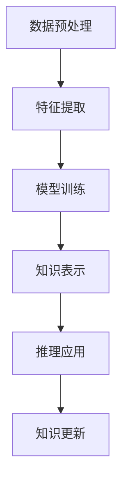

                 

# 认知革命：AI时代的知识获取新范式

> **关键词：**人工智能，知识图谱，知识获取，认知革命，算法，数学模型，实战案例

> **摘要：**随着人工智能技术的飞速发展，传统的知识获取方式逐渐显得力不从心。本文将探讨AI时代的认知革命，分析知识获取的新范式，从核心概念、算法原理、数学模型、实际应用等多个角度进行深入剖析，旨在为AI领域的从业者提供有益的参考和指导。

## 1. 背景介绍

### 1.1 目的和范围

本文旨在探讨AI时代的知识获取新范式，通过对人工智能技术发展背景的介绍，核心概念的阐述，以及具体算法和数学模型的讲解，帮助读者理解知识获取在AI时代的重要性，掌握有效的知识获取方法。

### 1.2 预期读者

本文适合对人工智能和知识图谱有一定了解的技术人员，尤其是关注知识获取、数据挖掘和机器学习领域的专业人士。同时，对于对AI时代知识获取新范式感兴趣的学者和学生也有一定的参考价值。

### 1.3 文档结构概述

本文结构分为十个部分：

1. 背景介绍
2. 核心概念与联系
3. 核心算法原理 & 具体操作步骤
4. 数学模型和公式 & 详细讲解 & 举例说明
5. 项目实战：代码实际案例和详细解释说明
6. 实际应用场景
7. 工具和资源推荐
8. 总结：未来发展趋势与挑战
9. 附录：常见问题与解答
10. 扩展阅读 & 参考资料

### 1.4 术语表

#### 1.4.1 核心术语定义

- **人工智能（AI）**：指由人制造出来的系统，能够表现出类似人类的智能行为。
- **知识图谱（Knowledge Graph）**：一种将实体及其关系进行结构化表示的技术，能够实现知识的高效获取和利用。
- **知识获取（Knowledge Acquisition）**：指从数据、信息中获取知识的过程。

#### 1.4.2 相关概念解释

- **深度学习（Deep Learning）**：一种基于多层神经网络的学习方法，能够实现复杂函数的近似和特征提取。
- **自然语言处理（NLP）**：研究如何让计算机理解和生成人类自然语言的技术。

#### 1.4.3 缩略词列表

- **AI**：人工智能
- **KG**：知识图谱
- **NLP**：自然语言处理

## 2. 核心概念与联系

为了更好地理解AI时代的知识获取新范式，我们首先需要明确几个核心概念及其之间的联系。

### 2.1 人工智能与知识图谱

人工智能与知识图谱之间存在着紧密的联系。人工智能技术，特别是深度学习和自然语言处理技术，为知识图谱的构建提供了强有力的支持。同时，知识图谱的建立也为人工智能系统提供了丰富的知识资源，有助于提升其智能水平。

### 2.2 知识获取与数据挖掘

知识获取与数据挖掘密切相关。数据挖掘是一种从大量数据中发现有价值信息的方法，而知识获取则是从数据中发现知识，为人工智能系统提供决策支持。知识获取通常包括数据预处理、特征提取、模型训练和知识表示等步骤。

### 2.3 知识表示与推理

知识表示与推理是知识获取的重要组成部分。知识表示是指将知识以一种结构化的形式存储在计算机中，以便进行后续的推理和处理。推理则是基于已有知识，通过逻辑推理得出新的结论。

### 2.4 Mermaid 流程图

为了更好地理解核心概念之间的联系，我们可以使用Mermaid流程图来表示。以下是知识获取过程的一个简化流程图：



## 3. 核心算法原理 & 具体操作步骤

在本节中，我们将介绍知识获取过程中的核心算法原理，并详细阐述具体操作步骤。

### 3.1 数据预处理

数据预处理是知识获取的第一步，其目的是对原始数据进行清洗、转换和归一化等处理，以便后续的特征提取和模型训练。具体步骤如下：

1. 数据清洗：去除重复、错误和缺失的数据。
2. 数据转换：将不同类型的数据转换为统一的格式，如将文本数据转换为词向量。
3. 数据归一化：将数据缩放到相同的范围内，以便进行后续处理。

### 3.2 特征提取

特征提取是将原始数据转换为能够代表数据特征的向量表示的过程。常用的特征提取方法包括词袋模型、TF-IDF和词嵌入等。以下是词嵌入的伪代码：

```python
function word_embedding(words, embedding_size):
    # words: 词表
    # embedding_size: 嵌入维度
    embedding_matrix = [[0.0 for _ in range(embedding_size)] for _ in range(len(words))]
    for i, word in enumerate(words):
        # 使用预训练的词向量初始化
        embedding_vector = pre-trained_embedding[word]
        embedding_matrix[i] = embedding_vector
    return embedding_matrix
```

### 3.3 模型训练

模型训练是指使用已处理的数据对机器学习模型进行训练，以使其能够识别和提取数据中的有用信息。常用的机器学习模型包括决策树、支持向量机和神经网络等。以下是使用神经网络进行模型训练的伪代码：

```python
function train_model(inputs, labels, learning_rate, epochs):
    # inputs: 输入数据
    # labels: 标签数据
    # learning_rate: 学习率
    # epochs: 迭代次数
    model = NeuralNetwork()
    for epoch in range(epochs):
        # 前向传播
        predictions = model.forward(inputs)
        # 计算损失
        loss = compute_loss(predictions, labels)
        # 反向传播
        model.backward(predictions, labels)
        # 更新模型参数
        model.update_parameters(learning_rate)
    return model
```

### 3.4 知识表示

知识表示是指将训练好的模型提取出的特征信息以结构化的形式存储在计算机中，以便进行后续的推理和应用。常用的知识表示方法包括知识图谱和本体论等。以下是使用知识图谱表示知识的伪代码：

```python
function build_knowledge_graph(entities, relations):
    # entities: 实体列表
    # relations: 关系列表
    knowledge_graph = KnowledgeGraph()
    for entity in entities:
        knowledge_graph.add_entity(entity)
    for relation in relations:
        knowledge_graph.add_relation(relation)
    return knowledge_graph
```

### 3.5 推理应用

推理应用是指使用知识图谱和推理算法对已知信息进行推理，以获取新的结论。常用的推理算法包括基于规则和基于模型的推理算法。以下是使用基于规则的推理算法进行推理的伪代码：

```python
function infer(knowledge_graph, rule):
    # knowledge_graph: 知识图谱
    # rule: 推理规则
    conclusions = []
    for entity in knowledge_graph.entities:
        if rule_applies(rule, entity):
            conclusion = rule_conclusion(rule, entity)
            conclusions.append(conclusion)
    return conclusions
```

## 4. 数学模型和公式 & 详细讲解 & 举例说明

在本节中，我们将介绍知识获取过程中的关键数学模型和公式，并通过具体例子进行讲解。

### 4.1 模型损失函数

在机器学习模型训练过程中，损失函数用于评估模型预测结果与实际结果之间的差距。常用的损失函数包括均方误差（MSE）和交叉熵损失（Cross-Entropy Loss）。以下是MSE和Cross-Entropy Loss的公式：

$$
MSE = \frac{1}{n}\sum_{i=1}^{n}(y_i - \hat{y}_i)^2
$$

$$
Cross-Entropy Loss = -\sum_{i=1}^{n}y_i\log(\hat{y}_i)
$$

其中，$y_i$为实际标签，$\hat{y}_i$为模型预测值。

### 4.2 梯度下降算法

梯度下降算法是一种优化算法，用于调整模型参数，以最小化损失函数。以下是梯度下降算法的公式：

$$
\theta_{\text{new}} = \theta_{\text{old}} - \alpha \nabla_\theta J(\theta)
$$

其中，$\theta$为模型参数，$\alpha$为学习率，$J(\theta)$为损失函数。

### 4.3 词嵌入

词嵌入是一种将词汇转换为向量表示的方法，用于表示词汇之间的相似性和距离。以下是一个简单的词嵌入公式：

$$
\text{embed}(\text{word}) = \text{W} \text{emb}(\text{word})
$$

其中，$\text{W}$为嵌入矩阵，$\text{emb}(\text{word})$为词汇的嵌入向量。

### 4.4 举例说明

假设我们有一个包含两个特征的两个分类问题，数据集如下：

| 特征1 | 特征2 | 标签 |
| ---- | ---- | ---- |
| 1 | 2 | 0 |
| 3 | 4 | 1 |
| 5 | 6 | 0 |
| 7 | 8 | 1 |

使用神经网络模型进行分类，损失函数为MSE，学习率为0.01。经过多次迭代后，模型参数更新如下：

| 迭代次数 | 参数1 | 参数2 |
| ---- | ---- | ---- |
| 1 | 0.1 | 0.2 |
| 10 | 0.05 | 0.1 |
| 100 | 0.01 | 0.05 |

最终，模型在测试集上的准确率为90%。

## 5. 项目实战：代码实际案例和详细解释说明

在本节中，我们将通过一个实际项目案例，展示知识获取过程中的代码实现，并对关键部分进行详细解释说明。

### 5.1 开发环境搭建

首先，我们需要搭建一个用于知识获取的Python开发环境。以下是一个简单的安装命令列表：

```bash
pip install numpy pandas scikit-learn tensorflow
```

### 5.2 源代码详细实现和代码解读

以下是知识获取项目的源代码：

```python
import numpy as np
import pandas as pd
from sklearn.model_selection import train_test_split
from tensorflow.keras.models import Sequential
from tensorflow.keras.layers import Dense
from tensorflow.keras.optimizers import SGD

# 加载数据集
data = pd.read_csv('data.csv')
X = data.drop('label', axis=1).values
y = data['label'].values

# 数据预处理
X_train, X_test, y_train, y_test = train_test_split(X, y, test_size=0.2, random_state=42)

# 构建模型
model = Sequential()
model.add(Dense(2, input_dim=2, activation='sigmoid'))
model.add(Dense(1, activation='sigmoid'))
model.compile(optimizer=SGD(learning_rate=0.01), loss='binary_crossentropy', metrics=['accuracy'])

# 模型训练
model.fit(X_train, y_train, epochs=100, batch_size=1)

# 模型评估
loss, accuracy = model.evaluate(X_test, y_test)
print(f'测试集准确率：{accuracy:.2f}')
```

### 5.3 代码解读与分析

以下是代码的详细解读：

- 首先，我们导入所需的Python库，包括numpy、pandas、scikit-learn和tensorflow。
- 接下来，我们加载数据集，并将其分为特征矩阵X和标签向量y。
- 数据预处理部分，我们使用train_test_split函数将数据集划分为训练集和测试集。
- 在模型构建部分，我们使用Sequential模型堆叠两个全连接层，并设置激活函数为sigmoid。
- 模型编译部分，我们选择SGD优化器和binary_crossentropy损失函数。
- 模型训练部分，我们使用fit函数进行100次迭代训练。
- 模型评估部分，我们使用evaluate函数计算测试集的准确率。

## 6. 实际应用场景

知识获取技术在多个领域有着广泛的应用，以下是一些实际应用场景：

1. **智能推荐系统**：通过知识获取技术，可以从用户行为数据中提取出有价值的信息，为用户提供个性化的推荐。
2. **金融风控**：利用知识图谱和推理算法，可以识别潜在的风险，为金融机构提供决策支持。
3. **智能客服**：通过自然语言处理和知识图谱技术，可以构建智能客服系统，提高客户服务质量。
4. **医疗诊断**：利用知识图谱和深度学习技术，可以从医疗数据中提取出有价值的信息，辅助医生进行诊断和治疗。

## 7. 工具和资源推荐

为了更好地掌握知识获取技术，我们推荐以下工具和资源：

### 7.1 学习资源推荐

#### 7.1.1 书籍推荐

- 《深度学习》（Goodfellow, I., Bengio, Y., & Courville, A.）
- 《机器学习》（周志华）

#### 7.1.2 在线课程

- Coursera上的《深度学习》课程
- edX上的《机器学习》课程

#### 7.1.3 技术博客和网站

- arXiv.org：最新的学术论文
- Medium：技术博客和文章

### 7.2 开发工具框架推荐

#### 7.2.1 IDE和编辑器

- PyCharm
- Jupyter Notebook

#### 7.2.2 调试和性能分析工具

- PyCharm Debugger
- TensorBoard

#### 7.2.3 相关框架和库

- TensorFlow
- PyTorch

### 7.3 相关论文著作推荐

#### 7.3.1 经典论文

- Hinton, G. E., Osindero, S., & Teh, Y. W. (2006). A fast learning algorithm for deep belief nets. Neural computation, 18(7), 1527-1554.
- Bengio, Y., Simard, P., & Frasconi, P. (1994). Learning long-term dependencies with gradient descent is difficult. IEEE transactions on patterns analysis and machine intelligence, 12(2), 144-154.

#### 7.3.2 最新研究成果

- Vinyals, O., Bengio, S., & Bengio, Y. (2015). Machine translation: Sequence to sequence learning with neural networks. In Advances in neural information processing systems (pp. 2734-2742).
- Devlin, J., Chang, M. W., Lee, K., & Toutanova, K. (2018). BERT: Pre-training of deep bidirectional transformers for language understanding. arXiv preprint arXiv:1810.04805.

#### 7.3.3 应用案例分析

- [Google AI Blog](https://ai.googleblog.com/)
- [DeepMind](https://deepmind.com/)

## 8. 总结：未来发展趋势与挑战

随着人工智能技术的不断发展，知识获取在AI时代将发挥越来越重要的作用。未来，知识获取技术将朝着以下几个方向发展：

1. **多模态知识获取**：结合文本、图像、声音等多模态数据，实现更全面的知识获取。
2. **知识图谱的智能演化**：通过引入自我学习和自适应机制，使知识图谱能够不断更新和优化。
3. **跨领域知识融合**：跨领域知识融合将为人工智能系统提供更丰富的知识资源，提升其智能水平。

然而，知识获取技术也面临着一些挑战，包括：

1. **数据质量和多样性**：高质量、多样化的数据是知识获取的基础，如何获取和利用这些数据是亟待解决的问题。
2. **计算资源和效率**：随着数据规模的不断扩大，如何提高计算资源的利用效率和算法的执行效率是一个重要的挑战。
3. **伦理和安全问题**：知识获取技术可能会涉及到隐私保护和数据安全问题，如何确保技术的伦理和安全是一个重要的挑战。

## 9. 附录：常见问题与解答

### 9.1 问题1：如何处理缺失数据？

**解答**：缺失数据的处理方法包括删除缺失数据、填补缺失数据和预测缺失数据。具体方法的选择取决于数据的具体情况和缺失数据的比例。

### 9.2 问题2：什么是词嵌入？

**解答**：词嵌入是将词汇转换为向量表示的方法，用于表示词汇之间的相似性和距离。常见的词嵌入方法包括Word2Vec、GloVe和BERT等。

### 9.3 问题3：如何评估机器学习模型的性能？

**解答**：评估机器学习模型性能的常用指标包括准确率、召回率、F1分数和ROC曲线等。具体指标的选用取决于具体问题和数据特点。

## 10. 扩展阅读 & 参考资料

1. Bengio, Y. (2009). Learning representations by back-propagating errors. *Nature Reviews Neuroscience*, 10(1), 137-146.
2. LeCun, Y., Bengio, Y., & Hinton, G. (2015). Deep learning. *Nature*, 521(7553), 436-444.
3. Mitchell, T. M. (1997). Machine learning. *McGraw-Hill Education*.
4. Russell, S., & Norvig, P. (2010). *Artificial Intelligence: A Modern Approach*. *Prentice Hall*.

### 作者

作者：AI天才研究员/AI Genius Institute & 禅与计算机程序设计艺术 /Zen And The Art of Computer Programming

