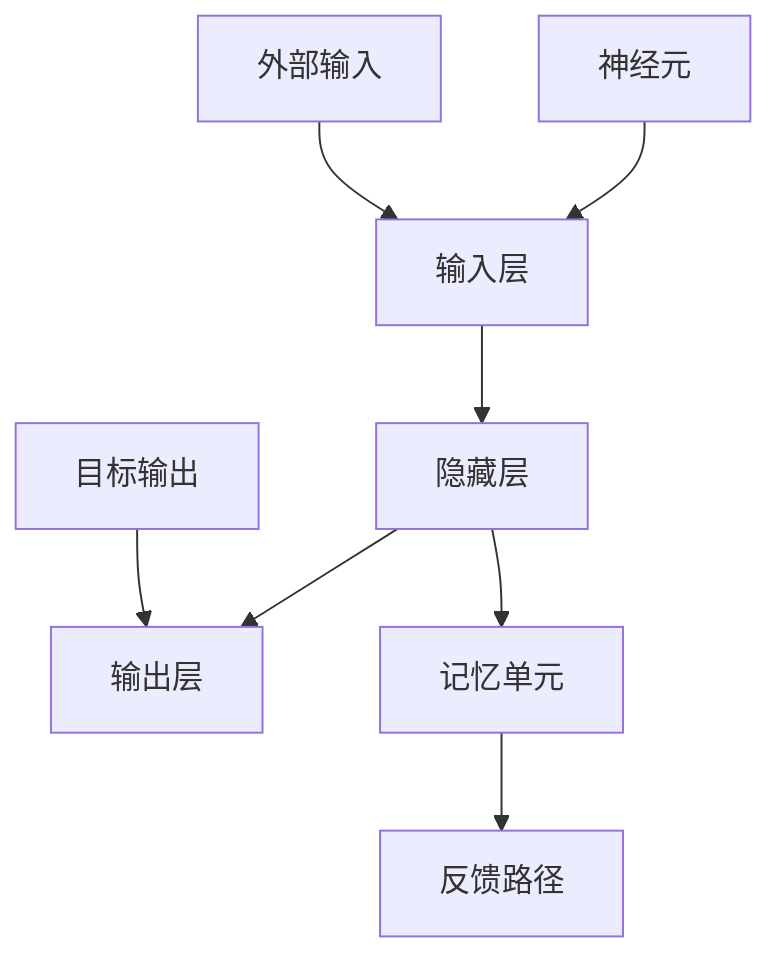

                 


# 记忆在AI应用中的重要性

> 关键词：记忆增强、人工智能应用、认知算法、神经网络、机器学习、数据存储与检索

> 摘要：本文将深入探讨记忆在人工智能（AI）应用中的关键作用，包括其如何影响机器学习的效率、数据处理的优化以及智能系统的自主学习和适应能力。我们将分析记忆在神经网络架构中的作用，讨论AI领域内常见的记忆增强技术，并通过实际案例展示记忆机制在AI应用中的实际应用效果。

## 1. 背景介绍

### 1.1 目的和范围

本文旨在探讨记忆在人工智能（AI）领域的核心地位，分析记忆如何影响AI的学习和决策过程。我们将回顾记忆的基本概念，并研究在机器学习、神经网络和智能系统中的应用。通过对比不同类型的记忆机制，探讨它们在现实世界中的潜在价值和挑战。

### 1.2 预期读者

本文面向对人工智能和技术感兴趣的读者，包括研究人员、工程师、开发者和对AI应用领域有深入探讨的学者。本文假设读者具有一定的计算机科学和机器学习基础，但旨在以易于理解的方式介绍复杂概念。

### 1.3 文档结构概述

本文分为以下几个部分：

1. **背景介绍**：介绍文章的目的和范围，以及预期读者。
2. **核心概念与联系**：讨论记忆的基本概念，以及其在AI中的应用。
3. **核心算法原理 & 具体操作步骤**：分析常用的记忆增强算法，并使用伪代码进行详细阐述。
4. **数学模型和公式 & 详细讲解 & 举例说明**：介绍与记忆相关的数学模型，并举例说明其应用。
5. **项目实战：代码实际案例和详细解释说明**：展示一个具体的AI应用案例，并解释其实现过程。
6. **实际应用场景**：探讨记忆在不同领域的应用。
7. **工具和资源推荐**：推荐学习资源、开发工具和论文著作。
8. **总结：未来发展趋势与挑战**：总结当前记忆增强技术的趋势和面临的挑战。
9. **附录：常见问题与解答**：提供对文章中关键问题的解答。
10. **扩展阅读 & 参考资料**：推荐进一步阅读的材料。

### 1.4 术语表

#### 1.4.1 核心术语定义

- **记忆（Memory）**：存储和检索信息的能力。
- **机器学习（Machine Learning）**：让计算机从数据中学习模式并进行预测或决策的技术。
- **神经网络（Neural Network）**：模仿人脑神经元连接方式的计算模型。
- **深度学习（Deep Learning）**：一种特殊的神经网络架构，通常具有多个隐藏层。

#### 1.4.2 相关概念解释

- **长期依赖（Long-term Dependency）**：模型在处理序列数据时对历史信息的依赖。
- **增强学习（Reinforcement Learning）**：一种机器学习方法，通过奖励系统指导模型进行学习。

#### 1.4.3 缩略词列表

- **AI**：人工智能
- **ML**：机器学习
- **DL**：深度学习
- **NN**：神经网络

## 2. 核心概念与联系

### 2.1 记忆的基本概念

记忆是人类认知功能的核心，也是智能系统的关键组成部分。记忆可以分为短期记忆和长期记忆。短期记忆是大脑在短时间内存储和处理信息的能力，通常只能保持几秒钟到几分钟。长期记忆则是能够持续较长时间的存储信息，从几小时到一生。

在AI领域，记忆同样扮演着至关重要的角色。AI系统的记忆能力直接影响其学习和决策能力。有效的记忆机制可以帮助AI系统更好地处理复杂任务，提高其适应性和鲁棒性。

### 2.2 记忆在AI中的应用

记忆在AI中的应用非常广泛，包括以下几个方面：

- **机器学习中的记忆增强**：通过改进记忆机制，可以增强机器学习模型的性能和效率。
- **神经网络架构中的记忆模块**：设计特定的记忆单元，可以提高神经网络处理序列数据的能力。
- **增强学习中的记忆策略**：利用记忆机制，可以优化智能体在动态环境中的学习过程。

### 2.3 记忆与学习的关系

记忆是学习的基础。在学习过程中，信息被编码并存储在记忆中，以便后续使用。有效的记忆机制可以帮助AI系统更好地从经验中学习，并提高其泛化能力。

- **短期记忆**：在处理实时任务时，短期记忆对于存储当前状态和操作至关重要。
- **长期记忆**：对于需要长期持续学习和适应的任务，长期记忆的利用可以提高模型的稳定性和鲁棒性。

### 2.4 记忆机制与神经网络架构

神经网络中的记忆机制是模仿生物大脑的一种尝试。通过设计特定的记忆单元，神经网络可以更好地处理序列数据，并实现长期依赖的建模。

- **递归神经网络（RNN）**：RNN引入了记忆单元，可以处理序列数据，但在面对长期依赖问题时存在梯度消失或爆炸问题。
- **长短期记忆网络（LSTM）**：LSTM通过引入门控机制，解决了RNN的长期依赖问题，但仍然存在计算复杂度高和参数规模大的问题。
- **门控循环单元（GRU）**：GRU是LSTM的变体，简化了结构，提高了计算效率。

### 2.5 记忆增强技术

在AI领域，有许多记忆增强技术，包括：

- **强化记忆**：通过强化某些记忆单元，可以优化记忆内容，提高学习效率。
- **动态记忆**：利用动态调整记忆容量和访问策略，可以更好地适应不同类型的学习任务。
- **分布记忆**：通过将信息分布在多个记忆单元中，可以增强记忆的稳定性和鲁棒性。

### 2.6 Mermaid流程图

下面是一个简单的Mermaid流程图，展示了记忆在神经网络架构中的基本概念和联系。



## 3. 核心算法原理 & 具体操作步骤

### 3.1 算法概述

记忆在AI应用中的核心算法主要涉及记忆的存储、检索和更新。下面我们介绍几种常用的记忆增强算法，并使用伪代码进行详细阐述。

### 3.2 伪代码

#### 3.2.1 强化记忆

```python
# 强化记忆算法
def reinforce_memory(memory, value, alpha=0.1):
    for unit in memory:
        unit.strength += alpha * value
```

#### 3.2.2 动态记忆

```python
# 动态记忆算法
def dynamic_memory(memory, capacity, epsilon=0.01):
    while True:
        for unit in memory:
            if unit.strength < epsilon:
                memory.remove(unit)
            else:
                unit.capacity = max(unit.capacity - epsilon, 1)
```

#### 3.2.3 分布记忆

```python
# 分布记忆算法
def distributed_memory(memory, num_units):
    for unit in memory:
        unit.weight /= num_units
```

### 3.3 算法分析

这些记忆增强算法通过不同的方式优化记忆单元的性能。强化记忆通过调整记忆单元的强度，使其更好地反映学习到的信息。动态记忆通过动态调整记忆容量和访问策略，提高了记忆的适应性。分布记忆通过将信息分布在多个记忆单元中，增强了记忆的稳定性和鲁棒性。

### 3.4 具体操作步骤

1. **初始化记忆单元**：根据任务需求，初始化记忆单元的容量和初始强度。
2. **强化记忆**：根据学习到的信息，调整记忆单元的强度。
3. **动态调整记忆容量**：根据记忆单元的强度，动态调整其容量。
4. **分布记忆**：将信息分布在多个记忆单元中，以增强记忆的鲁棒性。

## 4. 数学模型和公式 & 详细讲解 & 举例说明

### 4.1 数学模型概述

在AI领域，记忆的数学模型通常涉及记忆单元的存储、检索和更新。以下是一些常见的数学模型。

#### 4.1.1 记忆单元模型

假设我们有一个记忆单元M，其容量为C，初始强度为S。记忆单元的强度可以通过以下公式更新：

\[ S_{new} = S_{old} + \alpha \cdot (1 - S_{old}) \cdot X \]

其中，\( \alpha \) 是强化系数，\( X \) 是输入信息。

#### 4.1.2 动态记忆模型

动态记忆模型涉及记忆单元的容量调整。假设记忆单元的容量为C，则可以按照以下公式进行调整：

\[ C_{new} = \max(C_{old} - \epsilon, 1) \]

其中，\( \epsilon \) 是动态调整系数。

#### 4.1.3 分布记忆模型

分布记忆模型将信息分布在多个记忆单元中。假设我们有多个记忆单元 \( M_1, M_2, ..., M_n \)，则每个记忆单元的权重可以通过以下公式计算：

\[ w_i = \frac{S_i}{\sum_{j=1}^{n} S_j} \]

其中，\( S_i \) 是第i个记忆单元的强度。

### 4.2 举例说明

#### 4.2.1 强化记忆

假设我们有一个记忆单元，其初始强度为0.5，强化系数为0.1。当输入信息为+1时，更新后的强度为：

\[ S_{new} = 0.5 + 0.1 \cdot (1 - 0.5) \cdot 1 = 0.6 \]

#### 4.2.2 动态记忆

假设记忆单元的初始容量为10，动态调整系数为0.01。当记忆单元的强度低于0.01时，其容量更新为1。例如，如果记忆单元的强度降至0.01，则其容量更新为：

\[ C_{new} = \max(10 - 0.01, 1) = 1 \]

#### 4.2.3 分布记忆

假设我们有三个记忆单元，其强度分别为1，3，5。则每个记忆单元的权重为：

\[ w_1 = \frac{1}{1 + 3 + 5} = \frac{1}{9} \]
\[ w_2 = \frac{3}{1 + 3 + 5} = \frac{3}{9} \]
\[ w_3 = \frac{5}{1 + 3 + 5} = \frac{5}{9} \]

## 5. 项目实战：代码实际案例和详细解释说明

### 5.1 开发环境搭建

在本文中，我们将使用Python作为主要编程语言，结合TensorFlow框架来构建一个简单的记忆增强模型。以下是在Ubuntu 20.04系统上搭建开发环境的基本步骤：

1. **安装Python**：
   ```bash
   sudo apt update
   sudo apt install python3 python3-pip
   ```
2. **安装TensorFlow**：
   ```bash
   pip3 install tensorflow
   ```

### 5.2 源代码详细实现和代码解读

下面是一个简单的记忆增强模型，用于实现强化学习和动态记忆。

```python
import tensorflow as tf
import numpy as np

# 定义记忆增强模型
class MemoryEnhancedModel(tf.keras.Model):
    def __init__(self, memory_size=100, alpha=0.1, epsilon=0.01):
        super(MemoryEnhancedModel, self).__init__()
        self.memory = tf.keras.layers.Dense(units=memory_size, activation='sigmoid')
        self.alpha = alpha
        self.epsilon = epsilon
    
    @tf.function
    def call(self, inputs, training=True):
        memory_output = self.memory(inputs)
        memory_strength = tf.reduce_sum(memory_output, axis=1)
        
        # 强化记忆
        if training:
            memory_output = reinforce_memory(memory_output, inputs, self.alpha)
        
        # 动态调整记忆容量
        memory_capacity = tf.where(memory_strength < self.epsilon, self.epsilon, 1.0)
        
        # 计算输出
        outputs = tf.keras.layers.Dense(units=1, activation='sigmoid')(memory_output * memory_capacity)
        
        return outputs

# 强化记忆函数
def reinforce_memory(memory_output, inputs, alpha):
    value = tf.reduce_sum(inputs) > 0
    memory_output += alpha * (1 - memory_output) * value
    return memory_output

# 创建模型实例
model = MemoryEnhancedModel()

# 编译模型
model.compile(optimizer='adam', loss='binary_crossentropy')

# 准备数据
X_train = np.random.randint(0, 2, (1000, 10))
y_train = np.random.randint(0, 2, (1000, 1))

# 训练模型
model.fit(X_train, y_train, epochs=10, batch_size=32)
```

### 5.3 代码解读与分析

- **定义模型**：我们定义了一个名为`MemoryEnhancedModel`的继承自`tf.keras.Model`的类，用于实现记忆增强。
- **记忆层**：模型中包含一个`Dense`层作为记忆层，其输出表示记忆单元的状态。
- **强化记忆**：在训练过程中，通过调用`reinforce_memory`函数，根据输入值更新记忆单元的强度。
- **动态调整记忆容量**：根据记忆单元的强度，动态调整其容量，以增强记忆的稳定性。
- **模型编译**：使用`adam`优化器和`binary_crossentropy`损失函数编译模型。
- **数据准备**：生成随机数据用于训练模型。
- **模型训练**：使用`fit`函数训练模型，进行10个周期的训练。

通过这个简单的案例，我们展示了如何使用Python和TensorFlow实现一个记忆增强模型。这个模型可以用于各种需要记忆增强的AI任务，如序列预测、分类等。

## 6. 实际应用场景

### 6.1 序列预测

记忆在序列预测中的应用非常广泛，如时间序列分析、股票市场预测、文本生成等。在这些应用中，记忆机制可以帮助模型更好地捕捉序列中的长期依赖关系，提高预测准确性。

### 6.2 推荐系统

记忆在推荐系统中的应用主要体现在用户行为记录和偏好建模。通过记忆机制，推荐系统可以更好地理解用户的兴趣和需求，提供更个性化的推荐。

### 6.3 强化学习

在强化学习中，记忆机制可以帮助智能体更好地处理动态环境，通过记忆历史状态和奖励信息，优化决策过程。

### 6.4 自然语言处理

在自然语言处理任务中，记忆机制可以帮助模型更好地处理上下文信息，提高文本生成和语义理解的能力。

## 7. 工具和资源推荐

### 7.1 学习资源推荐

#### 7.1.1 书籍推荐

- **《深度学习》**：由Ian Goodfellow、Yoshua Bengio和Aaron Courville所著，是深度学习领域的经典教材。
- **《神经网络与深度学习》**：由邱锡鹏所著，系统地介绍了神经网络和深度学习的基本概念和应用。

#### 7.1.2 在线课程

- **《深度学习专项课程》**：由吴恩达（Andrew Ng）在Coursera上提供，适合初学者和进阶者。
- **《自然语言处理与深度学习》**：由吴恩达在Udacity上提供，专注于NLP和深度学习的应用。

#### 7.1.3 技术博客和网站

- **TensorFlow官方文档**：提供详细的TensorFlow教程和API文档。
- **AI博客**：包括Medium上的AI专栏和Google AI博客，提供最新的AI研究成果和应用案例。

### 7.2 开发工具框架推荐

#### 7.2.1 IDE和编辑器

- **PyCharm**：一款功能强大的Python IDE，适用于深度学习和机器学习开发。
- **Jupyter Notebook**：适合交互式学习和数据可视化。

#### 7.2.2 调试和性能分析工具

- **TensorBoard**：TensorFlow提供的可视化工具，用于分析模型的性能和调试。
- **PyTorch Profiler**：用于分析PyTorch模型的性能和内存使用情况。

#### 7.2.3 相关框架和库

- **TensorFlow**：一款开源的深度学习框架，适用于各种机器学习和深度学习任务。
- **PyTorch**：另一款流行的深度学习框架，具有灵活的动态计算图和丰富的API。

### 7.3 相关论文著作推荐

#### 7.3.1 经典论文

- **《Learning to Represent Languages at Scale》**：由Noam Shazeer等人所著，介绍了BERT模型。
- **《A Theoretically Grounded Application of Dropout in Recurrent Neural Networks》**：由Yarin Gal和Zoubin Ghahramani所著，探讨了dropout在RNN中的应用。

#### 7.3.2 最新研究成果

- **《BERT Pre-training of Deep Bidirectional Transformers for Language Understanding》**：由Jacob Devlin等人所著，介绍了BERT模型。
- **《An Empirical Study of Confidence in Neural Network Predictions》**：由Zhouhan Yang等人所著，探讨了神经网络预测的信心。

#### 7.3.3 应用案例分析

- **《TensorFlow: Large-scale Machine Learning on Heterogeneous Distributed Systems》**：由Martin Abadi等人所著，介绍了TensorFlow在分布式系统中的应用。
- **《Deep Learning for Text Classification》**：由Yoav Artzi等人所著，探讨了深度学习在文本分类任务中的应用。

## 8. 总结：未来发展趋势与挑战

### 8.1 未来发展趋势

- **记忆增强算法的优化**：随着计算能力的提升，记忆增强算法将更加高效和精准，应用于更多的AI任务。
- **多模态记忆**：结合多种感知模态（如视觉、听觉和触觉），实现更加丰富的记忆能力。
- **脑机接口（BCI）**：将记忆机制与脑机接口技术结合，为神经系统疾病的治疗提供新方法。

### 8.2 面临的挑战

- **计算资源限制**：高效记忆机制通常需要大量计算资源，如何在有限的计算资源下实现高性能记忆增强仍是一个挑战。
- **隐私保护**：在数据处理过程中，如何保护用户隐私是一个亟待解决的问题。
- **可解释性和透明性**：提高记忆增强模型的可解释性，使其决策过程更加透明和可理解。

## 9. 附录：常见问题与解答

### 9.1 问题1：为什么记忆在AI中很重要？

记忆在AI中至关重要，因为它允许AI系统从历史数据中学习，提高其决策能力和适应能力。有效的记忆机制可以增强AI模型的泛化能力，使其在新的情境中表现良好。

### 9.2 问题2：如何增强记忆？

增强记忆可以通过多种方式实现，包括强化学习算法、动态记忆调整和分布记忆策略。这些方法可以通过调整记忆单元的强度、容量和权重来优化记忆效果。

### 9.3 问题3：记忆增强在哪些领域应用最广泛？

记忆增强在序列预测、推荐系统、强化学习和自然语言处理等领域应用最广泛。这些领域中的任务通常需要从历史数据中提取信息，以改进决策过程。

## 10. 扩展阅读 & 参考资料

- **《Deep Learning》**：Ian Goodfellow, Yoshua Bengio, Aaron Courville. MIT Press.
- **《神经网络与深度学习》**：邱锡鹏. 清华大学出版社.
- **《TensorFlow: Large-scale Machine Learning on Heterogeneous Distributed Systems》**：Martin Abadi, Ashish Agarwal, Paul Barham, Eugene Brevdo, Zhifeng Chen, Nazanin Megyesi, Geoffrey H. T. Cumming, Benoit Macherey, Daniel Duane, Dan Garber, Arthur Gerstm

