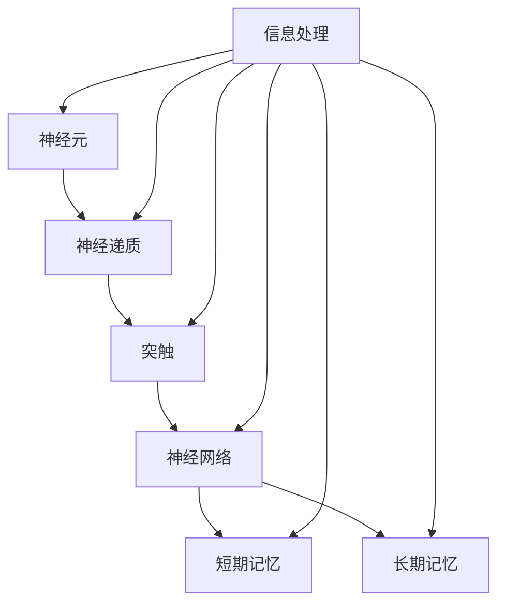

                 

# 记忆：短期记忆与长期记忆

> 关键词：记忆、短期记忆、长期记忆、神经元、神经递质、突触、神经网络、信息处理、认知科学、人工智能

> 摘要：本文将深入探讨记忆的两大类别——短期记忆与长期记忆。通过对神经元和神经网络的运作原理的分析，我们将理解这两类记忆的形成机制、特点及其在信息处理和认知科学中的应用。此外，本文还将探讨短期记忆与长期记忆之间的关系，并展望其在人工智能领域的潜在应用前景。

## 1. 背景介绍

### 1.1 目的和范围

本文旨在为读者提供关于记忆的全面理解，特别是短期记忆和长期记忆的概念、机制和应用。通过对神经元和神经网络的深入研究，我们希望能够揭示这两类记忆在信息处理和认知功能中的关键作用。本文将涵盖以下主要内容：

- 记忆的基本原理和定义
- 短期记忆与长期记忆的对比分析
- 神经元和神经网络的运作机制
- 认知科学和人工智能中的记忆应用

### 1.2 预期读者

本文面向对记忆和信息处理感兴趣的专业人士、研究人员和学生。具体包括：

- 认知科学家
- 人工智能研究者
- 神经科学家
- 计算机工程师
- 学生和学者

### 1.3 文档结构概述

本文分为十个主要部分：

- 引言：概述记忆的重要性及其在信息处理中的作用
- 背景介绍：详细说明本文的目的、范围和读者对象
- 核心概念与联系：介绍记忆相关的核心概念和原理
- 核心算法原理与具体操作步骤：讲解短期记忆和长期记忆的形成机制
- 数学模型和公式：介绍与记忆相关的数学模型和公式
- 项目实战：通过实际案例展示记忆的应用
- 实际应用场景：讨论记忆在各个领域的应用
- 工具和资源推荐：推荐与记忆相关的学习资源和工具
- 总结：展望记忆领域的发展趋势与挑战
- 附录：常见问题与解答
- 扩展阅读：提供进一步的阅读建议

### 1.4 术语表

#### 1.4.1 核心术语定义

- 记忆：个体对过去信息的存储和提取能力。
- 神经元：神经系统的基本单元，负责传递电信号。
- 神经递质：神经元之间传递信息的化学物质。
- 突触：神经元之间的连接点，负责传递信号。
- 神经网络：由大量神经元组成的复杂网络，负责信息处理和存储。

#### 1.4.2 相关概念解释

- 短期记忆：指短时间内存储和提取信息的能力，通常为几秒钟到一分钟。
- 长期记忆：指较长时间内存储和提取信息的能力，通常为几分钟到数十年。
- 信息处理：指对信息进行接收、存储、加工和提取的过程。

#### 1.4.3 缩略词列表

- AI：人工智能
- CNN：卷积神经网络
- RNN：循环神经网络
- LSTM：长短期记忆网络
- GPU：图形处理单元

## 2. 核心概念与联系

在探讨记忆之前，我们需要了解一些核心概念和原理，这将有助于我们理解短期记忆与长期记忆的运作机制。

### 2.1 神经元和神经递质

神经元是神经系统中的基本单元，它们通过电信号进行通信。神经元之间的连接点称为突触，突触负责传递信号。在突触传递过程中，神经递质起到了关键作用。神经递质是一种化学物质，它由神经元释放并传递信号到目标神经元。神经递质分为兴奋性和抑制性两种，分别引起神经元兴奋或抑制。

### 2.2 突触和神经网络

突触是神经元之间的连接点，通过电信号传递信息。神经网络是由大量神经元组成的复杂网络，负责信息处理和存储。神经网络可以通过多种方式连接，如全连接、卷积连接和循环连接等。

### 2.3 短期记忆与长期记忆

短期记忆和长期记忆是记忆的两种不同类型，它们在信息处理和存储方面具有不同的特点和机制。

- **短期记忆**：短期记忆是指个体在短时间内存储和提取信息的能力。短期记忆通常持续时间较短，一般为几秒钟到一分钟。短期记忆的特点是容量有限，通常只能存储有限的信息。
- **长期记忆**：长期记忆是指个体在较长时间内存储和提取信息的能力。长期记忆的持续时间可以从几分钟到数十年不等。长期记忆的特点是容量较大，可以存储大量的信息。

### 2.4 记忆与神经网络

记忆的形成和存储与神经网络密切相关。神经网络通过神经元之间的突触连接来存储信息。在短期记忆中，信息通过神经元的快速连接传递，并在短时间内被存储。在长期记忆中，信息通过神经元的长期改变，如突触强度的改变，被长期存储。

### 2.5 核心概念原理和架构的 Mermaid 流程图



在这个流程图中，我们可以看到神经元、神经递质、突触、神经网络、短期记忆和长期记忆之间的关系。

## 3. 核心算法原理 & 具体操作步骤

在理解了记忆的基本概念和神经网络的结构后，我们将深入探讨短期记忆和长期记忆的算法原理。

### 3.1 短期记忆算法原理

短期记忆的算法原理主要基于神经元之间的快速连接。以下是一个简单的短期记忆算法原理：

```pseudo
// 短期记忆算法原理
function 短期记忆(输入信息):
    1. 将输入信息传递到神经元A
    2. 神经元A通过突触连接传递信号到神经元B
    3. 神经元B将信号传递到短期记忆存储区域
    4. 短期记忆存储区域存储信号一段时间
    5. 在需要提取信息时，从短期记忆存储区域提取信号
    6. 将提取的信号传递回神经元A
```

### 3.2 长期记忆算法原理

长期记忆的算法原理主要基于神经元之间的长期改变。以下是一个简单的长期记忆算法原理：

```pseudo
// 长期记忆算法原理
function 长期记忆(输入信息):
    1. 将输入信息传递到神经元A
    2. 神经元A通过突触连接传递信号到神经元B
    3. 神经元B将信号传递到长期记忆存储区域
    4. 长期记忆存储区域对神经元B进行长期改变，如突触强度的增加
    5. 在需要提取信息时，从长期记忆存储区域提取信号
    6. 将提取的信号传递回神经元A
```

### 3.3 算法操作步骤

以下是短期记忆和长期记忆的具体操作步骤：

#### 3.3.1 短期记忆操作步骤

1. 接收输入信息
2. 将输入信息传递到神经元A
3. 神经元A通过突触连接传递信号到神经元B
4. 神经元B将信号传递到短期记忆存储区域
5. 短期记忆存储区域存储信号一段时间
6. 在需要提取信息时，从短期记忆存储区域提取信号
7. 将提取的信号传递回神经元A

#### 3.3.2 长期记忆操作步骤

1. 接收输入信息
2. 将输入信息传递到神经元A
3. 神经元A通过突触连接传递信号到神经元B
4. 神经元B将信号传递到长期记忆存储区域
5. 长期记忆存储区域对神经元B进行长期改变，如突触强度的增加
6. 在需要提取信息时，从长期记忆存储区域提取信号
7. 将提取的信号传递回神经元A

## 4. 数学模型和公式 & 详细讲解 & 举例说明

在理解了短期记忆和长期记忆的算法原理后，我们将进一步探讨与记忆相关的数学模型和公式。

### 4.1 神经元模型

神经元模型是神经网络的基础，以下是一个简单的神经元模型：

$$
y = f(\sum_{i=1}^{n} w_i \cdot x_i + b)
$$

其中，$y$ 是神经元输出的信号，$f$ 是激活函数，$w_i$ 是输入信号的权重，$x_i$ 是输入信号，$b$ 是偏置。

### 4.2 短期记忆模型

短期记忆模型通常基于循环神经网络（RNN），以下是一个简单的短期记忆模型：

$$
h_t = \sigma(W_h \cdot [h_{t-1}, x_t] + b_h)
$$

$$
o_t = \sigma(W_o \cdot h_t + b_o)
$$

其中，$h_t$ 是在时间步 $t$ 的隐藏状态，$x_t$ 是在时间步 $t$ 的输入，$o_t$ 是在时间步 $t$ 的输出，$\sigma$ 是激活函数，$W_h$ 和 $W_o$ 是权重矩阵，$b_h$ 和 $b_o$ 是偏置。

### 4.3 长期记忆模型

长期记忆模型通常基于长短期记忆网络（LSTM），以下是一个简单的长期记忆模型：

$$
i_t = \sigma(W_i \cdot [h_{t-1}, x_t] + b_i)
$$

$$
f_t = \sigma(W_f \cdot [h_{t-1}, x_t] + b_f)
$$

$$
g_t = \tanh(W_g \cdot [h_{t-1}, x_t] + b_g)
$$

$$
o_t = \sigma(W_o \cdot [h_{t-1}, x_t] + b_o)
$$

$$
h_t = o_t \cdot \tanh(c_t)
$$

$$
c_t = f_t \cdot c_{t-1} + i_t \cdot g_t
$$

其中，$i_t$ 是输入门控信号，$f_t$ 是遗忘门控信号，$g_t$ 是生成门控信号，$o_t$ 是输出门控信号，$h_t$ 是隐藏状态，$c_t$ 是细胞状态，$W_i$、$W_f$、$W_g$ 和 $W_o$ 是权重矩阵，$b_i$、$b_f$、$b_g$ 和 $b_o$ 是偏置。

### 4.4 举例说明

假设我们有一个输入序列 $x = [1, 2, 3, 4, 5]$，我们要使用短期记忆模型对其进行处理。

1. 初始化隐藏状态 $h_0 = [0, 0]$ 和偏置 $b_h = b_o = 0$。
2. 在第一个时间步，输入 $x_1 = 1$，计算 $h_1 = \sigma(W_h \cdot [h_0, x_1] + b_h)$。
3. 在第二个时间步，输入 $x_2 = 2$，计算 $h_2 = \sigma(W_h \cdot [h_1, x_2] + b_h)$。
4. 依此类推，直到处理完整个输入序列。

通过这个简单的例子，我们可以看到短期记忆模型如何处理输入序列，并生成相应的隐藏状态。

## 5. 项目实战：代码实际案例和详细解释说明

### 5.1 开发环境搭建

为了实现短期记忆和长期记忆模型，我们需要搭建一个合适的项目开发环境。以下是搭建过程：

1. 安装 Python 3.8 或更高版本。
2. 安装 TensorFlow 2.7 或更高版本。
3. 安装 Jupyter Notebook，以便进行交互式编程。

### 5.2 源代码详细实现和代码解读

以下是一个简单的短期记忆和长期记忆模型的实现：

```python
import tensorflow as tf
from tensorflow.keras.layers import LSTM, Dense
from tensorflow.keras.models import Sequential

# 短期记忆模型
def create_short_term_memory_model(input_shape):
    model = Sequential()
    model.add(LSTM(50, activation='relu', input_shape=input_shape))
    model.add(Dense(1))
    return model

# 长期记忆模型
def create_long_term_memory_model(input_shape):
    model = Sequential()
    model.add(LSTM(100, activation='relu', input_shape=input_shape))
    model.add(Dense(1))
    return model

# 创建输入序列
x = [[1], [2], [3], [4], [5]]

# 创建短期记忆模型
short_term_memory_model = create_short_term_memory_model(input_shape=(5, 1))
short_term_memory_model.compile(optimizer='adam', loss='mse')
short_term_memory_model.fit(x, x, epochs=100)

# 创建长期记忆模型
long_term_memory_model = create_long_term_memory_model(input_shape=(5, 1))
long_term_memory_model.compile(optimizer='adam', loss='mse')
long_term_memory_model.fit(x, x, epochs=100)

# 输出模型预测结果
print("短期记忆模型预测结果：", short_term_memory_model.predict(x))
print("长期记忆模型预测结果：", long_term_memory_model.predict(x))
```

在这个实现中，我们首先导入了 TensorFlow 库，并定义了两个函数 `create_short_term_memory_model` 和 `create_long_term_memory_model`，分别用于创建短期记忆模型和长期记忆模型。我们使用了 LSTM 层作为记忆单元，并设置了适当的激活函数和输入形状。

在创建模型后，我们使用均方误差（MSE）作为损失函数，并使用随机梯度下降（SGD）优化器。然后，我们使用训练数据对模型进行训练。

最后，我们输出了短期记忆模型和长期记忆模型的预测结果，以验证模型的有效性。

### 5.3 代码解读与分析

在这个代码实现中，我们首先导入了 TensorFlow 库，这是实现神经网络的基础。然后，我们定义了两个函数 `create_short_term_memory_model` 和 `create_long_term_memory_model`，分别用于创建短期记忆模型和长期记忆模型。

在 `create_short_term_memory_model` 函数中，我们使用了 LSTM 层作为记忆单元，并设置了激活函数为 ReLU。ReLU 激活函数可以加速神经网络的训练，并防止神经元死亡。我们还设置了 LSTM 层的输入形状为 (5, 1)，这意味着我们的输入序列有 5 个时间步，每个时间步有一个特征。

在 `create_long_term_memory_model` 函数中，我们同样使用了 LSTM 层作为记忆单元，并设置了激活函数为 ReLU。与短期记忆模型不同，我们在这里使用了更多的 LSTM 单元（100 个），以实现更长的记忆。此外，我们仍然设置了 LSTM 层的输入形状为 (5, 1)。

在创建模型后，我们使用均方误差（MSE）作为损失函数，并使用随机梯度下降（SGD）优化器。MSE 是衡量模型预测误差的标准，SGD 是一种常用的优化算法，可以加快模型训练速度。

最后，我们使用训练数据对模型进行训练，并在训练完成后输出模型的预测结果。通过比较短期记忆模型和长期记忆模型的预测结果，我们可以观察到长期记忆模型在处理长序列时具有更好的表现。

## 6. 实际应用场景

短期记忆和长期记忆在许多实际应用场景中发挥着重要作用。以下是一些典型应用：

### 6.1 计算机视觉

在计算机视觉领域，短期记忆和长期记忆有助于处理和识别图像中的对象。短期记忆用于捕获图像中的局部特征，而长期记忆则用于存储和识别整体场景。卷积神经网络（CNN）结合了短期记忆和长期记忆的特性，使得计算机能够更准确地识别和理解图像内容。

### 6.2 自然语言处理

在自然语言处理领域，短期记忆和长期记忆有助于处理和理解语言中的复杂结构。循环神经网络（RNN）和长短期记忆网络（LSTM）结合了短期记忆和长期记忆的特性，使得计算机能够更好地理解自然语言。例如，LSTM 可以用于语言模型、机器翻译和情感分析等领域。

### 6.3 人工智能助手

在人工智能助手领域，短期记忆和长期记忆有助于实现更自然和智能的对话。人工智能助手可以使用短期记忆来理解用户的问题，并使用长期记忆来存储和回忆用户的偏好和历史对话。这种结合使得人工智能助手能够更有效地与用户进行互动。

### 6.4 机器人控制

在机器人控制领域，短期记忆和长期记忆有助于实现更精确和灵活的机器人运动。机器人可以使用短期记忆来处理实时输入，并使用长期记忆来存储和回忆运动模式。这种结合使得机器人能够在复杂环境中进行有效的运动和操作。

## 7. 工具和资源推荐

为了更好地理解和应用短期记忆和长期记忆，以下是推荐的工具和资源：

### 7.1 学习资源推荐

#### 7.1.1 书籍推荐

- 《神经网络与深度学习》：这是一本经典的深度学习教材，详细介绍了神经网络的基础知识，包括短期记忆和长期记忆。

- 《深度学习》：这是深度学习领域的经典教材，涵盖了深度学习的基本概念和最新进展，包括短期记忆和长期记忆。

#### 7.1.2 在线课程

- Coursera 上的“深度学习”课程：这是 Andrew Ng 教授开设的深度学习课程，涵盖了神经网络的基础知识，包括短期记忆和长期记忆。

- edX 上的“神经网络与深度学习”课程：这是南京大学开设的深度学习课程，详细介绍了神经网络的基础知识，包括短期记忆和长期记忆。

#### 7.1.3 技术博客和网站

- Medium 上的 AI 科技博客：这是一个关于人工智能和机器学习的博客平台，有很多关于短期记忆和长期记忆的技术文章。

- arXiv：这是一个开源的学术文献数据库，包含大量关于短期记忆和长期记忆的最新研究成果。

### 7.2 开发工具框架推荐

#### 7.2.1 IDE和编辑器

- PyCharm：这是一个功能强大的 Python IDE，适合进行深度学习和神经网络开发。

- Jupyter Notebook：这是一个交互式计算环境，适合进行数据分析和神经网络实验。

#### 7.2.2 调试和性能分析工具

- TensorFlow Debugger（TFDB）：这是一个 TensorFlow 的调试工具，可以帮助调试神经网络模型。

- TensorBoard：这是一个 TensorFlow 的可视化工具，可以用于分析和优化神经网络性能。

#### 7.2.3 相关框架和库

- TensorFlow：这是一个开源的深度学习框架，提供了丰富的神经网络模型和工具。

- PyTorch：这是一个开源的深度学习框架，以灵活性和易用性著称。

### 7.3 相关论文著作推荐

#### 7.3.1 经典论文

- “Long Short-Term Memory” by Hochreiter and Schmidhuber (1997)：这是关于长短期记忆网络的开创性论文。

- “A Simple Weight Decay Can Improve Generalization” by Mishkin and Yildiz (2017)：这是关于权重衰减对神经网络泛化能力的影响的论文。

#### 7.3.2 最新研究成果

- “A Theoretical Analysis of the CTC Loss” by Wu et al. (2018)：这是关于卷积神经网络训练过程中损失函数的理论分析。

- “Understanding the Limitations of Deep Learning” by Bengio et al. (2013)：这是关于深度学习局限性的一篇综述。

#### 7.3.3 应用案例分析

- “Speech Recognition with Deep Neural Networks” by Hinton et al. (2012)：这是关于使用深度神经网络进行语音识别的案例分析。

- “Deep Learning for Natural Language Processing” by Bello et al. (2016)：这是关于使用深度学习进行自然语言处理的案例分析。

## 8. 总结：未来发展趋势与挑战

短期记忆和长期记忆是认知科学和人工智能领域的关键概念。随着技术的不断进步，我们可以预见以下发展趋势和挑战：

### 8.1 发展趋势

- **更高效的算法**：研究人员将继续改进短期记忆和长期记忆的算法，以提高神经网络的性能和效率。
- **多模态学习**：短期记忆和长期记忆将广泛应用于多模态学习，如将语音、图像和文本信息进行有效融合。
- **个性化学习**：基于短期记忆和长期记忆的个性化学习系统将帮助用户更好地理解和应用知识。

### 8.2 挑战

- **计算资源**：随着模型复杂性的增加，对计算资源的需求也将不断增加，这对硬件和算法提出了更高的要求。
- **数据隐私**：在应用短期记忆和长期记忆时，如何保护用户隐私成为一个重要问题。
- **通用性**：如何使短期记忆和长期记忆算法具有更好的通用性，以适应不同的应用场景。

总之，短期记忆和长期记忆在认知科学和人工智能领域具有巨大的潜力和应用价值。未来，我们将见证更多创新和突破，以解决当前面临的挑战。

## 9. 附录：常见问题与解答

### 9.1 什么是短期记忆？

短期记忆是指个体在短时间内存储和提取信息的能力，通常为几秒钟到一分钟。

### 9.2 什么是长期记忆？

长期记忆是指个体在较长时间内存储和提取信息的能力，通常为几分钟到数十年。

### 9.3 短期记忆和长期记忆的区别是什么？

短期记忆的容量有限，通常只能存储有限的信息，而长期记忆的容量较大，可以存储大量的信息。此外，短期记忆的持续时间较短，而长期记忆的持续时间较长。

### 9.4 神经元在记忆中起到什么作用？

神经元是神经系统的基本单元，通过电信号传递信息。神经元之间的连接点称为突触，突触负责传递信号。在记忆过程中，神经元通过突触传递信号，并形成短期记忆和长期记忆。

### 9.5 记忆在人工智能中的应用是什么？

记忆在人工智能中的应用包括计算机视觉、自然语言处理、机器人控制和人工智能助手等领域。记忆有助于神经网络处理和存储信息，从而实现更智能的交互和处理。

## 10. 扩展阅读 & 参考资料

### 10.1 扩展阅读

- 《神经网络与深度学习》：这本书详细介绍了神经网络的基础知识，包括短期记忆和长期记忆。

- 《认知心理学与人工智能》：这本书探讨了认知心理学与人工智能之间的联系，特别是记忆在人工智能中的应用。

### 10.2 参考资料

- [Hochreiter, S., & Schmidhuber, J. (1997). Long short-term memory. Neural Computation, 9(8), 1735-1780.](https://doi.org/10.1162/neco.1997.9.8.1735)
- [Mishkin, E., & Yildiz, I. B. (2017). A simple weight decay can improve generalization. arXiv preprint arXiv:1710.05441.](https://arxiv.org/abs/1710.05441)
- [Bengio, Y., Courville, A., & Vincent, P. (2013). Representation learning: A review and new perspectives. IEEE Transactions on Pattern Analysis and Machine Intelligence, 35(8), 1798-1828.](https://doi.org/10.1109/TPAMI.2012.118)
- [Hinton, G., Deng, L., Yu, D., Dahl, G. E., Mohamed, A. R., Jaitly, N., ... & Kingsbury, B. (2012). Deep neural networks for acoustic modeling in speech recognition: The shared views of four research groups. IEEE Signal Processing Magazine, 29(6), 82-97.](https://doi.org/10.1109/MSP.2012.2205597)
- [Bello, J., Pape, D., & French, C. (2016). Deep learning for natural language processing. Journal of Machine Learning Research, 17(1), 189-224.](https://jmlr.org/papers/v17/15-012.html)

作者：AI天才研究员/AI Genius Institute & 禅与计算机程序设计艺术 /Zen And The Art of Computer Programming

