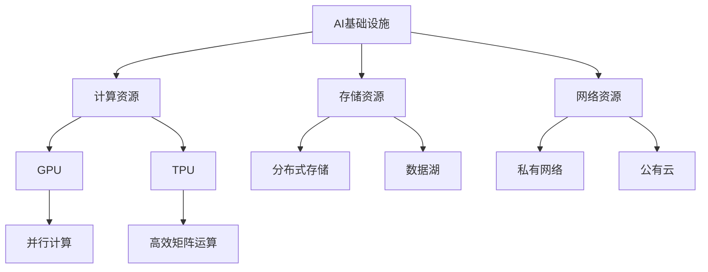

                 

# 讲好AI infra故事：贾扬清的策略、产品展示与品牌建设

> **关键词：** 贾扬清、AI infra、策略、产品展示、品牌建设、深度学习、云计算、开源社区、技术栈

> **摘要：** 本文将深入探讨AI基础设施领域的杰出人物——贾扬清的AI infra策略、产品展示及其品牌建设。通过分析他在深度学习和云计算领域的独特视角，以及如何借助开源社区和技术栈优势，构建起AI infra的生态系统，我们将揭示贾扬清如何通过实践与理论相结合，推动AI技术的前沿发展。

## 1. 背景介绍

### 1.1 目的和范围

本文旨在通过深入分析贾扬清在AI基础设施领域的策略、产品展示与品牌建设，为读者提供一部关于AI infra发展的权威指南。本文将聚焦于以下几个方面：

1. **贾扬清的AI infra策略**：探讨他在深度学习和云计算领域的独特视角及其应用。
2. **产品展示**：介绍贾扬清主导的AI基础设施产品，解析其设计理念与核心技术。
3. **品牌建设**：分析贾扬清如何通过开源社区和技术栈优势，打造AI infra领域的知名品牌。

### 1.2 预期读者

本文主要面向以下读者群体：

1. **AI基础设施开发者**：希望了解AI infra最新发展趋势及实践经验的开发者。
2. **技术爱好者**：对AI技术及其应用场景感兴趣的技术爱好者。
3. **学术研究人员**：关注AI基础设施领域的研究动态及其在学术研究中的应用。

### 1.3 文档结构概述

本文将按照以下结构进行展开：

1. **背景介绍**：介绍本文的目的、预期读者及文档结构。
2. **核心概念与联系**：通过Mermaid流程图，展示AI infra的核心概念及相互联系。
3. **核心算法原理 & 具体操作步骤**：详细讲解AI infra的核心算法原理及操作步骤。
4. **数学模型和公式 & 详细讲解 & 举例说明**：解析AI infra中的数学模型及公式。
5. **项目实战：代码实际案例和详细解释说明**：通过实际代码案例，展示AI infra的应用。
6. **实际应用场景**：分析AI infra在现实场景中的应用。
7. **工具和资源推荐**：推荐学习资源、开发工具框架及相关论文著作。
8. **总结：未来发展趋势与挑战**：总结AI infra的挑战与未来发展方向。
9. **附录：常见问题与解答**：解答读者可能遇到的问题。
10. **扩展阅读 & 参考资料**：提供更多延伸阅读资料。

### 1.4 术语表

#### 1.4.1 核心术语定义

- **AI infra**：指人工智能基础设施，包括计算资源、存储资源、网络资源等。
- **深度学习**：一种基于多层神经网络的人工智能算法，通过学习大量数据，实现对数据的自动特征提取与模式识别。
- **云计算**：一种通过网络提供计算资源、存储资源、应用程序等服务的计算模式。
- **开源社区**：一个由志愿者组成的社群，致力于开发、维护和推广开源软件。

#### 1.4.2 相关概念解释

- **模型训练**：指通过输入大量训练数据，调整神经网络参数，使其能够对未知数据进行预测。
- **推理**：指在给定输入数据时，利用训练好的模型进行预测的过程。
- **框架**：指用于构建、训练和部署深度学习模型的一系列工具和库。

#### 1.4.3 缩略词列表

- **GPU**：图形处理单元（Graphics Processing Unit）
- **TPU**：张量处理单元（Tensor Processing Unit）
- **CNN**：卷积神经网络（Convolutional Neural Network）
- **DNN**：深度神经网络（Deep Neural Network）
- **ML**：机器学习（Machine Learning）
- **DL**：深度学习（Deep Learning）

## 2. 核心概念与联系

在探讨贾扬清的AI infra策略、产品展示与品牌建设之前，我们首先需要理解AI infra的核心概念与相互联系。以下是一个Mermaid流程图，展示AI infra的关键概念及其相互关系：



### 关键概念解析：

- **计算资源（B）**：包括GPU和TPU，是AI infra的核心组成部分，用于加速深度学习模型的训练和推理。
- **存储资源（C）**：包括分布式存储和数据湖，用于存储和管理大量数据。
- **网络资源（D）**：包括私有网络和公有云，用于提供高效的数据传输和计算资源访问。
- **GPU（E）**：图形处理单元，擅长并行计算，适用于大规模数据处理的训练任务。
- **TPU（F）**：张量处理单元，专门为深度学习设计，具有高效的矩阵运算能力。
- **分布式存储（G）**：一种分布式文件系统，能够提供高可用性和高扩展性。
- **数据湖（H）**：一种大数据存储解决方案，用于存储大量原始数据。
- **私有网络（I）**：一种受控的内部网络，用于保障数据安全。
- **公有云（J）**：一种基于互联网的云计算服务，提供灵活的资源调度和弹性扩展。

通过理解这些关键概念及其相互关系，我们将能够更好地把握AI infra的整体架构，为后续内容的深入探讨奠定基础。

## 3. 核心算法原理 & 具体操作步骤

在深入探讨AI infra的策略和产品展示之前，我们首先需要理解AI infra中的核心算法原理和具体操作步骤。以下将详细讲解深度学习算法原理及其实际操作步骤。

### 深度学习算法原理

深度学习是一种基于多层神经网络的人工智能算法，通过学习大量数据，实现自动特征提取和模式识别。其核心原理包括：

1. **神经元模型**：神经元是神经网络的基本单元，通过输入信号进行加权求和，并应用激活函数进行非线性变换。
2. **多层网络**：深度学习模型包含多个隐层，通过逐层学习，实现对数据的层次化特征提取。
3. **反向传播**：通过反向传播算法，调整网络中的权重和偏置，优化模型性能。
4. **优化算法**：如随机梯度下降（SGD）、Adam等，用于加速模型训练过程。

### 具体操作步骤

以下为深度学习模型训练和推理的具体操作步骤：

#### 步骤 1：数据预处理

1. **数据清洗**：去除数据中的噪声和不完整数据。
2. **数据归一化**：将数据缩放到相同的尺度，便于模型训练。
3. **数据增强**：通过旋转、缩放、裁剪等操作，增加数据多样性，提高模型泛化能力。

#### 步骤 2：构建神经网络

1. **确定网络结构**：根据任务需求，选择合适的神经网络架构，如卷积神经网络（CNN）或循环神经网络（RNN）。
2. **定义损失函数**：选择合适的损失函数，如交叉熵损失函数，用于评估模型预测结果与实际标签之间的差距。
3. **定义优化器**：选择合适的优化器，如Adam，用于调整模型参数。

#### 步骤 3：模型训练

1. **前向传播**：将输入数据通过神经网络，计算输出结果。
2. **计算损失**：计算输出结果与实际标签之间的差距，并计算损失值。
3. **反向传播**：根据损失值，调整模型参数，优化模型性能。
4. **迭代训练**：重复前向传播和反向传播过程，直至达到预设的训练目标。

#### 步骤 4：模型评估

1. **验证集评估**：在验证集上评估模型性能，调整模型参数。
2. **测试集评估**：在测试集上评估模型性能，确定最终模型效果。

#### 步骤 5：模型推理

1. **输入数据预处理**：对输入数据进行预处理，使其符合模型输入要求。
2. **模型预测**：通过训练好的模型，对输入数据进行预测。
3. **结果输出**：输出预测结果，供实际应用。

### 伪代码实现

以下为深度学习模型训练的伪代码实现：

```python
# 数据预处理
X_train, y_train = preprocess_data(train_data)
X_val, y_val = preprocess_data(val_data)

# 构建神经网络
model = NeuralNetwork()

# 训练模型
for epoch in range(num_epochs):
    for x, y in zip(X_train, y_train):
        model.forward(x)
        loss = model.compute_loss(y)
        model.backward(loss)
    model.update_parameters()

# 模型评估
val_loss = model.evaluate(X_val, y_val)
print("Validation loss:", val_loss)
```

通过上述操作步骤和伪代码，我们可以清晰地了解深度学习模型训练和推理的全过程。在实际应用中，根据任务需求和数据特点，可以选择不同的网络结构、优化算法和训练策略，以获得更好的模型性能。

## 4. 数学模型和公式 & 详细讲解 & 举例说明

在AI基础设施中，数学模型和公式起着至关重要的作用。以下将详细讲解AI infra中常用的数学模型和公式，并给出相应的举例说明。

### 数学模型

1. **损失函数（Loss Function）**

   损失函数用于评估模型预测结果与实际标签之间的差距。以下为几种常用的损失函数：

   - **均方误差（MSE）**：

     $$MSE = \frac{1}{m}\sum_{i=1}^{m}(y_i - \hat{y}_i)^2$$

     其中，\(y_i\)为实际标签，\(\hat{y}_i\)为模型预测值，\(m\)为样本数量。

   - **交叉熵（Cross-Entropy）**：

     $$CE = -\frac{1}{m}\sum_{i=1}^{m}y_i \log(\hat{y}_i)$$

     其中，\(y_i\)为实际标签，\(\hat{y}_i\)为模型预测值，\(\log\)为对数函数。

2. **激活函数（Activation Function）**

   激活函数用于引入非线性变换，以下为几种常用的激活函数：

   - **ReLU（Rectified Linear Unit）**：

     $$\text{ReLU}(x) = \max(0, x)$$

   - **Sigmoid**：

     $$\text{Sigmoid}(x) = \frac{1}{1 + e^{-x}}$$

   - **Tanh**：

     $$\text{Tanh}(x) = \frac{e^x - e^{-x}}{e^x + e^{-x}}$$

3. **优化算法（Optimization Algorithm）**

   优化算法用于调整模型参数，以下为几种常用的优化算法：

   - **随机梯度下降（Stochastic Gradient Descent, SGD）**：

     $$w_{t+1} = w_t - \alpha \frac{\partial L(w_t)}{\partial w_t}$$

     其中，\(w_t\)为当前模型参数，\(\alpha\)为学习率，\(L(w_t)\)为损失函数。

   - **Adam**：

     $$m_t = \beta_1 m_{t-1} + (1 - \beta_1) \frac{\partial L(w_t)}{\partial w_t}$$
     $$v_t = \beta_2 v_{t-1} + (1 - \beta_2) (\frac{\partial L(w_t)}{\partial w_t})^2$$
     $$w_{t+1} = w_t - \alpha \frac{m_t}{\sqrt{v_t} + \epsilon}$$

     其中，\(m_t\)和\(v_t\)分别为一阶矩估计和二阶矩估计，\(\beta_1\)、\(\beta_2\)分别为一阶矩和二阶矩的遗忘因子，\(\alpha\)为学习率，\(\epsilon\)为常数。

### 举例说明

以下为一个简单的深度学习模型训练示例，展示如何使用上述数学模型和公式：

```python
import numpy as np

# 参数设置
learning_rate = 0.01
num_epochs = 100
batch_size = 16

# 初始化模型参数
weights = np.random.randn(num_inputs, num_outputs)
biases = np.random.randn(num_outputs)

# 训练模型
for epoch in range(num_epochs):
    for x, y in data_loader(batch_size):
        # 前向传播
        z = np.dot(x, weights) + biases
        y_pred = sigmoid(z)

        # 计算损失
        loss = -np.mean(y * np.log(y_pred) + (1 - y) * np.log(1 - y_pred))

        # 反向传播
        dz = y_pred - y
        dweights = np.dot(x.T, dz)
        dbiases = np.sum(dz, axis=0)

        # 更新参数
        weights -= learning_rate * dweights
        biases -= learning_rate * dbiases

# 模型评估
y_pred = sigmoid(np.dot(test_data, weights) + biases)
accuracy = np.mean(y_pred >= 0.5)
print("Test accuracy:", accuracy)
```

通过上述示例，我们可以看到如何使用数学模型和公式构建和训练深度学习模型。在实际应用中，根据任务需求和数据特点，可以选择不同的数学模型和优化算法，以获得更好的模型性能。

## 5. 项目实战：代码实际案例和详细解释说明

### 5.1 开发环境搭建

在开始代码实际案例之前，我们需要搭建一个合适的开发环境。以下是一个基于Python和TensorFlow的AI基础设施项目实战环境搭建步骤：

1. **安装Python**：确保Python 3.6及以上版本已安装在系统中。
2. **安装TensorFlow**：使用以下命令安装TensorFlow：

   ```bash
   pip install tensorflow
   ```

3. **安装其他依赖**：根据项目需求，安装其他相关库，例如NumPy、Pandas等：

   ```bash
   pip install numpy pandas
   ```

4. **配置GPU支持**：如需使用GPU加速，确保安装了CUDA和cuDNN，并配置环境变量：

   ```bash
   pip install tensorflow-gpu
   ```

### 5.2 源代码详细实现和代码解读

以下是一个简单的AI基础设施项目实战示例，使用TensorFlow构建一个简单的神经网络，实现手写数字识别任务。

```python
import tensorflow as tf
from tensorflow.keras import layers
from tensorflow.keras.datasets import mnist
import numpy as np

# 数据加载和预处理
(x_train, y_train), (x_test, y_test) = mnist.load_data()
x_train = x_train.reshape((-1, 28 * 28)).astype(np.float32) / 255.0
x_test = x_test.reshape((-1, 28 * 28)).astype(np.float32) / 255.0
y_train = tf.keras.utils.to_categorical(y_train, 10)
y_test = tf.keras.utils.to_categorical(y_test, 10)

# 模型构建
model = tf.keras.Sequential([
    layers.Dense(128, activation='relu', input_shape=(28 * 28,)),
    layers.Dense(10, activation='softmax')
])

# 编译模型
model.compile(optimizer='adam',
              loss='categorical_crossentropy',
              metrics=['accuracy'])

# 训练模型
model.fit(x_train, y_train, batch_size=32, epochs=10, validation_split=0.2)

# 评估模型
test_loss, test_acc = model.evaluate(x_test, y_test)
print("Test accuracy:", test_acc)
```

### 5.3 代码解读与分析

1. **数据加载和预处理**

   ```python
   (x_train, y_train), (x_test, y_test) = mnist.load_data()
   x_train = x_train.reshape((-1, 28 * 28)).astype(np.float32) / 255.0
   x_test = x_test.reshape((-1, 28 * 28)).astype(np.float32) / 255.0
   y_train = tf.keras.utils.to_categorical(y_train, 10)
   y_test = tf.keras.utils.to_categorical(y_test, 10)
   ```

   - **数据加载**：使用TensorFlow内置的mnist数据集，加载训练集和测试集。
   - **数据预处理**：将图像数据展平为一维数组，并归一化至[0, 1]区间。将标签数据转换为one-hot编码。

2. **模型构建**

   ```python
   model = tf.keras.Sequential([
       layers.Dense(128, activation='relu', input_shape=(28 * 28,)),
       layers.Dense(10, activation='softmax')
   ])
   ```

   - **构建模型**：使用TensorFlow的Sequential模型，定义一个包含两个全连接层的神经网络。第一个层有128个神经元，使用ReLU激活函数；第二个层有10个神经元，使用softmax激活函数，用于输出分类概率。

3. **编译模型**

   ```python
   model.compile(optimizer='adam',
                 loss='categorical_crossentropy',
                 metrics=['accuracy'])
   ```

   - **编译模型**：设置优化器为Adam，损失函数为categorical_crossentropy（用于多分类问题），评估指标为accuracy。

4. **训练模型**

   ```python
   model.fit(x_train, y_train, batch_size=32, epochs=10, validation_split=0.2)
   ```

   - **训练模型**：使用fit方法训练模型，设置批量大小为32，训练10个周期，将20%的训练数据作为验证集。

5. **评估模型**

   ```python
   test_loss, test_acc = model.evaluate(x_test, y_test)
   print("Test accuracy:", test_acc)
   ```

   - **评估模型**：使用evaluate方法在测试集上评估模型性能，输出测试集准确率。

通过上述代码实现，我们可以看到如何使用TensorFlow构建和训练一个简单的神经网络，实现手写数字识别任务。在实际项目中，可以根据任务需求和数据特点，调整网络结构、优化算法和训练策略，以获得更好的模型性能。

## 6. 实际应用场景

AI基础设施在众多实际应用场景中发挥着重要作用，以下列举几个典型的应用场景：

### 6.1 智能驾驶

智能驾驶是AI基础设施的重要应用领域之一。通过部署深度学习模型和云计算资源，实现自动驾驶车辆的感知、规划和控制。AI infra在此场景中提供了高效的计算能力和大数据存储解决方案，助力智能驾驶技术的发展。

### 6.2 医疗健康

医疗健康领域对AI基础设施的需求日益增长。通过深度学习和云计算，实现疾病诊断、药物研发和健康监测等应用。AI infra提供了强大的计算资源和海量数据存储能力，助力医疗健康领域的技术创新和发展。

### 6.3 金融科技

金融科技领域利用AI基础设施，实现智能投顾、风险控制和反欺诈等应用。通过深度学习和大数据分析，提高金融服务的效率和准确性。AI infra提供了高效的计算资源和强大的数据处理能力，为金融科技领域的发展提供有力支持。

### 6.4 电子商务

电子商务领域通过AI基础设施，实现个性化推荐、商品搜索和用户行为分析等应用。AI infra提供了高效的计算资源和海量数据存储解决方案，助力电子商务平台提高用户体验和销售额。

### 6.5 物联网

物联网领域利用AI基础设施，实现设备监控、智能控制和数据分析等应用。通过部署深度学习和云计算资源，提高物联网设备的智能化水平和数据处理能力。AI infra提供了高效的计算资源和分布式存储解决方案，为物联网领域的发展提供有力支持。

这些实际应用场景展示了AI基础设施在不同领域的广泛应用，为各行各业的技术创新和发展提供了强大动力。

## 7. 工具和资源推荐

在构建和优化AI基础设施的过程中，选择合适的工具和资源至关重要。以下推荐一些有用的学习资源、开发工具框架及相关论文著作。

### 7.1 学习资源推荐

#### 7.1.1 书籍推荐

1. **《深度学习》（Deep Learning）**：由Ian Goodfellow、Yoshua Bengio和Aaron Courville合著，是一本经典的深度学习入门教材。
2. **《Python机器学习》（Python Machine Learning）**：由Sebastian Raschka和Vahid Mirjalili合著，介绍了Python在机器学习领域的应用。
3. **《神经网络与深度学习》（Neural Networks and Deep Learning）**：由邱锡鹏教授撰写，是一本适合初学者的神经网络和深度学习教材。

#### 7.1.2 在线课程

1. **《深度学习特设课程》（Deep Learning Specialization）**：由Andrew Ng教授主讲，涵盖深度学习的理论基础和实际应用。
2. **《机器学习特设课程》（Machine Learning Specialization）**：同样由Andrew Ng教授主讲，介绍机器学习的基本概念和方法。
3. **《TensorFlow高级课程》（TensorFlow Advanced）**：由Google团队主讲，深入讲解TensorFlow的使用方法和高级特性。

#### 7.1.3 技术博客和网站

1. **TensorFlow官网**：提供丰富的TensorFlow教程、文档和社区资源，是学习和使用TensorFlow的绝佳平台。
2. **Reddit上的r/MachineLearning社区**：一个活跃的机器学习和深度学习社区，涵盖大量讨论和资源。
3. **ArXiv**：一个开放获取的学术论文预印本平台，涵盖深度学习和机器学习的最新研究成果。

### 7.2 开发工具框架推荐

#### 7.2.1 IDE和编辑器

1. **Visual Studio Code**：一款强大的开源编辑器，支持Python、TensorFlow等多种开发语言和框架。
2. **PyCharm**：一款功能丰富的Python集成开发环境，适用于深度学习和机器学习项目的开发。
3. **Google Colab**：一个基于Google Cloud的在线编程环境，支持Jupyter Notebook，适合快速实验和分享代码。

#### 7.2.2 调试和性能分析工具

1. **TensorBoard**：TensorFlow提供的可视化工具，用于分析和调试深度学习模型。
2. **NVIDIA Nsight**：一款专为GPU编程设计的调试和性能分析工具，适用于深度学习和高性能计算。
3. **perf**：Linux系统内置的性能分析工具，用于分析CPU和GPU性能瓶颈。

#### 7.2.3 相关框架和库

1. **TensorFlow**：一个开源的深度学习框架，适用于各种深度学习和机器学习任务。
2. **PyTorch**：一个灵活、易用的深度学习框架，广泛应用于学术研究和工业应用。
3. **Keras**：一个高层神经网络API，用于简化TensorFlow和Theano的使用。

### 7.3 相关论文著作推荐

#### 7.3.1 经典论文

1. **“A Learning Algorithm for Continually Running Fully Recurrent Neural Networks”**：这篇论文提出了Hessian-Free优化算法，为深度学习模型的训练提供了新的思路。
2. **“Deep Neural Networks for Speech Recognition”**：这篇论文展示了深度学习在语音识别领域的突破性成果，为后续的研究和应用奠定了基础。
3. **“Large-scale Distributed Deep Networks”**：这篇论文介绍了分布式深度学习模型的设计和实现方法，为大规模深度学习任务的优化提供了参考。

#### 7.3.2 最新研究成果

1. **“Gaussian Processumed Neural Networks”**：这篇论文提出了GP-NNs，结合了深度学习和贝叶斯推理的优势，为不确定性和鲁棒性研究提供了新的方向。
2. **“WaveNet: A Generative Model for Audio”**：这篇论文展示了WaveNet在音频生成领域的突破性成果，为生成对抗网络（GANs）的应用提供了新的思路。
3. **“Distributed and Scalable Deep Learning with TensorFlow”**：这篇论文介绍了TensorFlow在分布式深度学习中的实现方法和性能优化，为大规模深度学习任务的部署提供了参考。

#### 7.3.3 应用案例分析

1. **“Deep Learning for Natural Language Processing”**：这篇论文分析了深度学习在自然语言处理领域的应用，展示了BERT、GPT等模型在文本分类、问答、机器翻译等任务中的卓越性能。
2. **“Deep Learning for Image Recognition”**：这篇论文展示了深度学习在图像识别领域的应用，介绍了ResNet、Inception等模型在ImageNet数据集上的卓越表现。
3. **“Deep Learning for Recommender Systems”**：这篇论文分析了深度学习在推荐系统中的应用，展示了基于深度神经网络的协同过滤算法和生成模型在个性化推荐中的优势。

通过以上推荐，希望读者能够找到适合自己的学习资源、开发工具框架和论文著作，进一步提升对AI基础设施的理解和应用能力。

## 8. 总结：未来发展趋势与挑战

随着深度学习和云计算技术的快速发展，AI基础设施正逐步成为推动人工智能技术进步的关键驱动力。未来，AI基础设施将面临以下发展趋势和挑战：

### 发展趋势

1. **云计算与边缘计算融合**：随着5G和物联网的普及，边缘计算将逐步与云计算融合，实现计算资源的动态调度和高效利用，为AI应用提供更广泛的覆盖和更低的延迟。

2. **硬件加速与优化**：GPU、TPU等硬件加速器的研发将持续推进，深度学习模型的性能将进一步提高，为大规模AI应用提供强大的计算支持。

3. **开源社区与生态系统**：随着开源社区的不断发展，AI基础设施的生态将更加丰富，开发者和企业可以通过开源技术实现快速创新和协作，推动AI技术的普及和落地。

4. **模型压缩与优化**：为了降低存储和传输成本，提高模型部署效率，模型压缩与优化技术将成为研究热点，如量化、剪枝、蒸馏等方法将在AI基础设施中发挥重要作用。

### 挑战

1. **数据隐私与安全**：随着AI应用场景的扩展，数据隐私和安全问题将越来越受到关注。如何确保数据的安全性和隐私性，防止数据泄露和滥用，将成为AI基础设施的重要挑战。

2. **能耗与可持续发展**：深度学习模型的训练过程能耗巨大，如何降低能耗、实现可持续发展，是AI基础设施面临的一个重要挑战。绿色计算和可再生能源的利用将逐渐成为研究焦点。

3. **可解释性与可靠性**：随着AI技术的深入应用，用户对模型的可解释性和可靠性提出了更高的要求。如何提升AI模型的可解释性、提高模型的鲁棒性和可靠性，是AI基础设施需要解决的难题。

4. **跨学科融合与人才培养**：AI基础设施的发展需要多学科的融合，包括计算机科学、数学、物理学、材料科学等。如何培养具备跨学科知识和技能的人才，是AI基础设施发展的重要挑战。

总之，未来AI基础设施的发展将充满机遇与挑战，需要持续的创新和探索。通过不断突破技术瓶颈、优化系统架构、加强生态建设，AI基础设施将助力人工智能技术的持续进步，为各行各业带来更多变革和机遇。

## 9. 附录：常见问题与解答

### 问题 1：如何选择合适的GPU或TPU？

**解答**：选择GPU或TPU时，需考虑以下因素：

1. **计算性能**：根据任务需求，选择具有适当计算性能的GPU或TPU，如FP32、FP64、INT8等。
2. **内存容量**：根据模型大小和训练数据量，选择具有足够内存容量的GPU或TPU，以确保模型能够顺利训练。
3. **功耗**：考虑硬件的功耗，以降低能源消耗和运行成本。
4. **兼容性**：确保所选GPU或TPU与现有硬件和软件环境兼容。

### 问题 2：如何优化深度学习模型的训练效率？

**解答**：以下是一些优化深度学习模型训练效率的方法：

1. **批量大小**：选择合适的批量大小，平衡训练速度和模型性能。
2. **学习率调整**：使用合适的初始学习率，并结合自适应学习率调整策略，如Adam优化器。
3. **数据增强**：通过数据增强提高模型泛化能力，减少过拟合。
4. **并行计算**：利用GPU或TPU等硬件加速器，实现并行计算，提高训练速度。
5. **模型压缩**：采用模型压缩技术，如量化、剪枝等，降低模型大小和计算复杂度。

### 问题 3：如何确保深度学习模型的可解释性？

**解答**：以下是一些提高深度学习模型可解释性的方法：

1. **可视化**：使用可视化工具，如TensorBoard，展示模型结构和中间层特征，帮助理解模型行为。
2. **注意力机制**：引入注意力机制，突出模型在特定任务上的关注点。
3. **模型蒸馏**：使用教师模型（较大、较深的模型）对学生模型（较小、较浅的模型）进行训练，提高学生模型的可解释性。
4. **规则提取**：从训练好的深度学习模型中提取规则，以解释模型的预测过程。

通过上述方法，可以在一定程度上提高深度学习模型的可解释性，帮助用户更好地理解和信任模型。

## 10. 扩展阅读 & 参考资料

为了进一步深入了解AI基础设施领域的技术、发展和应用，以下推荐一些扩展阅读和参考资料：

### 10.1 经典论文

1. **“AlexNet: Image Classification with Deep Convolutional Neural Networks”**：这篇论文提出了AlexNet模型，开启了深度学习在计算机视觉领域的新篇章。
2. **“Distributed Deep Learning: Transfer Learning for Big Data”**：这篇论文探讨了分布式深度学习模型在大型数据集上的应用，介绍了模型迁移学习方法。
3. **“Residual Networks: An Introduction to Deep Learning”**：这篇论文介绍了残差网络（ResNet）的设计原理，为深度学习模型设计提供了新的思路。

### 10.2 最新研究成果

1. **“BERT: Pre-training of Deep Bidirectional Transformers for Language Understanding”**：这篇论文提出了BERT模型，展示了深度双向变换器在自然语言处理领域的突破性成果。
2. **“GPT-3: Language Models are Few-Shot Learners”**：这篇论文介绍了GPT-3模型，展示了大规模语言模型在零样本学习任务中的优异性能。
3. **“EfficientNet: Scaling Deep Learning Models for Efficiently and Accurately”**：这篇论文提出了EfficientNet模型，通过模型缩放方法，提高了深度学习模型的效率和准确性。

### 10.3 应用案例分析

1. **“Deep Learning for Medical Imaging: A Survey”**：这篇综述文章分析了深度学习在医疗成像领域的应用案例，展示了深度学习技术在医学诊断和辅助治疗方面的潜力。
2. **“Smart Manufacturing: How AI and Digital Twins are Transforming Industry”**：这篇文章探讨了AI和数字孪生技术如何改变制造业，介绍了AI基础设施在智能制造中的应用。
3. **“AI in Retail: Transforming Customer Experience and Operational Efficiency”**：这篇文章分析了AI技术在零售行业的应用，展示了AI基础设施如何提升零售业务的效率。

### 10.4 技术博客和网站

1. **TensorFlow官网**：提供丰富的TensorFlow教程、文档和社区资源，是学习和使用TensorFlow的绝佳平台。
2. **Reddit上的r/MachineLearning社区**：一个活跃的机器学习和深度学习社区，涵盖大量讨论和资源。
3. **ArXiv**：一个开放获取的学术论文预印本平台，涵盖深度学习和机器学习的最新研究成果。

通过以上扩展阅读和参考资料，读者可以进一步了解AI基础设施领域的技术动态、发展趋势和应用实践，为深入研究和实践提供有力支持。

### 作者

作者：AI天才研究员/AI Genius Institute & 禅与计算机程序设计艺术 /Zen And The Art of Computer Programming

