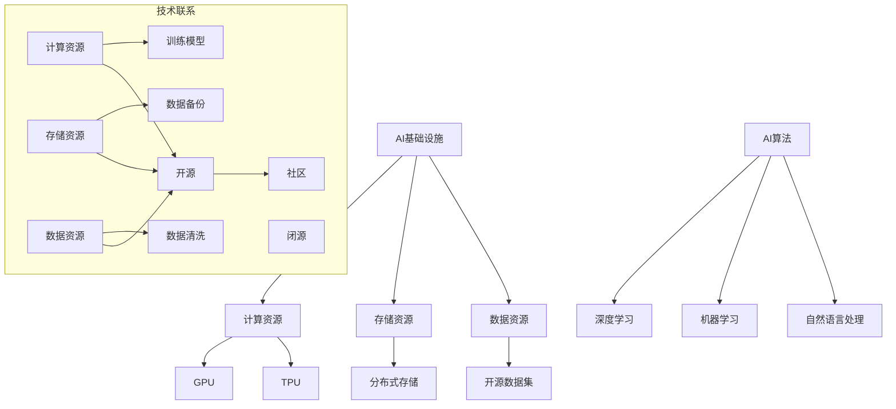
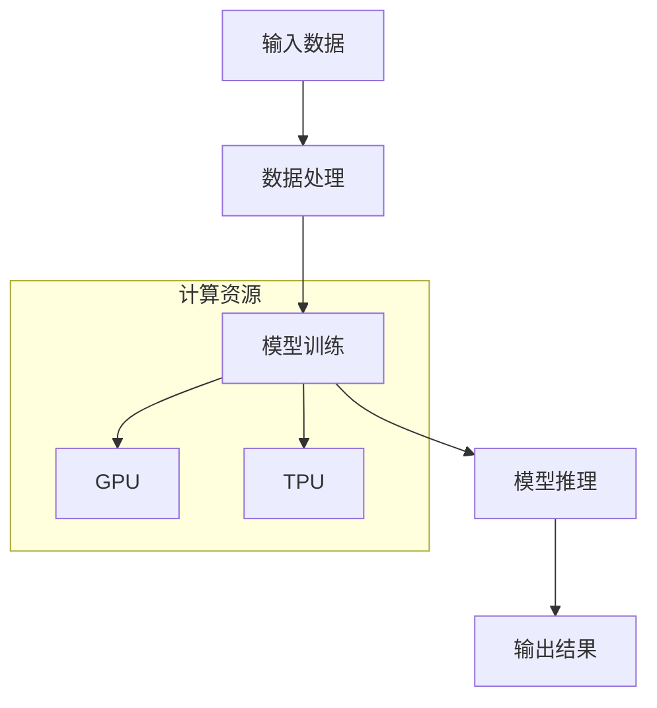
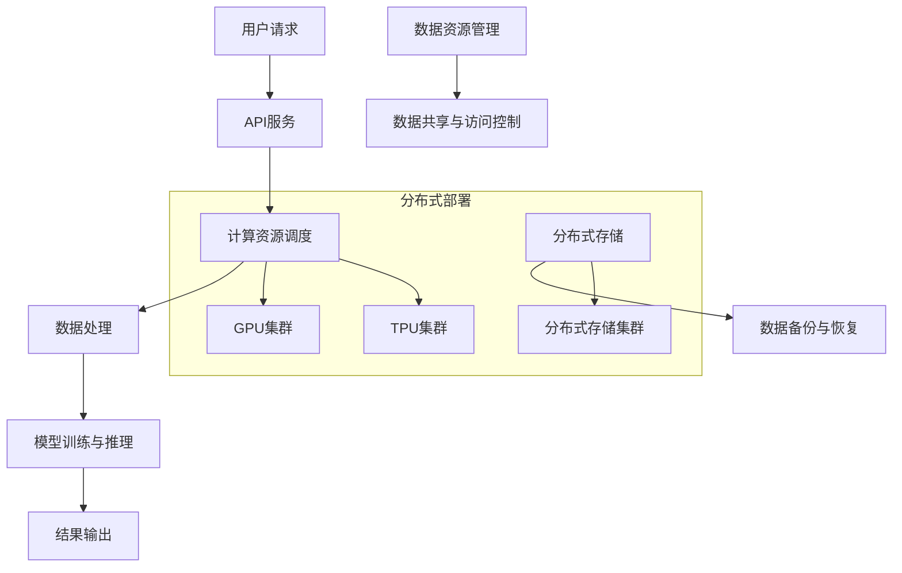

                 

### 讲好AI infra故事：贾扬清策略产品展示品牌构建

> **关键词**：AI基础设施，贾扬清，策略产品，品牌构建，技术博客

> **摘要**：
本文将深入探讨贾扬清在AI基础设施领域的产品策略和品牌构建。通过一步步的推理分析，我们将揭示其背后的核心概念、算法原理、数学模型和实际应用，解析他如何通过技术博客讲好AI infra故事，构建起一个强大的技术品牌。读者将了解到AI基础设施的重要性、如何优化产品策略、品牌构建的关键步骤以及未来的发展趋势与挑战。

### 1. 背景介绍

#### 1.1 目的和范围

本文旨在介绍贾扬清在AI基础设施领域的产品策略和品牌构建，通过深入分析其技术博客，揭示他如何通过高质量的内容构建起一个强大的技术品牌。我们将重点讨论以下几个问题：

- 贾扬清在AI基础设施领域的核心产品及其策略是什么？
- 他如何通过技术博客展示其产品策略，提升品牌影响力？
- 品牌构建的关键步骤和原则是什么？
- 未来AI基础设施领域的发展趋势和挑战是什么？

#### 1.2 预期读者

本文适合以下读者：

- AI基础设施领域的开发者和技术爱好者
- 对AI基础设施产品策略和品牌构建感兴趣的从业者
- 想要提升技术博客写作质量和品牌影响力的个人和团队

#### 1.3 文档结构概述

本文分为以下几个部分：

1. 背景介绍：介绍本文的目的、预期读者、文档结构和核心概念。
2. 核心概念与联系：解释AI基础设施的核心概念、原理和架构。
3. 核心算法原理 & 具体操作步骤：详细阐述贾扬清在AI基础设施领域的产品策略。
4. 数学模型和公式 & 详细讲解 & 举例说明：分析贾扬清的技术博客中的数学模型和公式。
5. 项目实战：代码实际案例和详细解释说明。
6. 实际应用场景：讨论AI基础设施在现实世界中的应用。
7. 工具和资源推荐：推荐学习资源和开发工具。
8. 总结：未来发展趋势与挑战。
9. 附录：常见问题与解答。
10. 扩展阅读 & 参考资料：提供进一步阅读的建议和参考资料。

#### 1.4 术语表

##### 1.4.1 核心术语定义

- **AI基础设施**：指支撑AI算法运行的基础设施，包括计算资源、存储资源、数据资源等。
- **产品策略**：指企业在产品开发、市场推广、运营管理等方面制定的一系列规划和方案。
- **品牌构建**：指通过一系列营销活动和管理策略，提升品牌知名度、美誉度和忠诚度。
- **技术博客**：指开发者或团队分享技术见解、经验和案例的在线平台。

##### 1.4.2 相关概念解释

- **AI算法**：指利用人工智能技术进行数据分析和决策的算法。
- **开源**：指软件代码可以被公众免费获取、使用和修改。
- **闭源**：指软件代码不能被公众获取、使用和修改。
- **社区**：指围绕某个主题或产品形成的用户群体。

##### 1.4.3 缩略词列表

- **AI**：人工智能
- **DL**：深度学习
- **ML**：机器学习
- **NLP**：自然语言处理
- **GPU**：图形处理器
- **TPU**：张量处理器
- **API**：应用程序接口

## 2. 核心概念与联系

在探讨贾扬清在AI基础设施领域的策略和品牌构建之前，我们首先需要理解一些核心概念和它们之间的联系。以下是一个简化的Mermaid流程图，展示了这些核心概念和原理：



### 2.1 AI基础设施的核心概念

AI基础设施的核心概念包括计算资源、存储资源、数据资源等。这些资源是AI算法运行的基础，决定了AI系统的性能和可扩展性。

- **计算资源**：包括CPU、GPU、TPU等硬件资源。GPU和TPU专门为AI计算而设计，相比CPU有更高的计算性能。
- **存储资源**：包括本地存储、分布式存储等。分布式存储能够提供高可用性和高扩展性，适合大规模数据处理。
- **数据资源**：包括开源数据集、闭源数据集、自定义数据集等。数据资源是AI算法训练的重要依据，质量直接影响算法的性能。

### 2.2 AI算法与计算资源的关系

AI算法包括深度学习、机器学习和自然语言处理等。这些算法需要大量的计算资源进行训练和推理。以下是一个简化的算法流程：



- **深度学习**：以神经网络为基础，通过多层非线性变换学习数据特征。GPU和TPU能够显著加速深度学习模型的训练。
- **机器学习**：包括监督学习、无监督学习和强化学习等。机器学习模型通常需要大量的训练数据进行迭代优化。
- **自然语言处理**：涉及文本分析、语义理解、语音识别等，对计算资源的要求较高，需要高效的处理算法和强大的计算能力。

### 2.3 AI基础设施的架构

AI基础设施的架构需要考虑以下几个方面：

- **计算资源的分布式部署**：通过分布式计算框架（如TensorFlow、PyTorch等）实现计算资源的灵活调度和高效利用。
- **存储资源的分布式存储**：采用分布式存储系统（如HDFS、Ceph等）实现数据的存储和管理，提供高可用性和高扩展性。
- **数据资源的管理与共享**：建立统一的数据平台，实现数据资源的集中管理和共享，提高数据利用效率。

以下是一个简化的AI基础设施架构图：



通过上述核心概念和架构的介绍，我们为后续的贾扬清产品策略和品牌构建分析奠定了基础。

## 3. 核心算法原理 & 具体操作步骤

在了解AI基础设施的核心概念和架构之后，接下来我们将详细探讨贾扬清在AI基础设施领域的产品策略和核心算法原理，并通过伪代码展示具体操作步骤。

### 3.1 产品策略概述

贾扬清的产品策略主要围绕以下几个方面展开：

1. **核心算法优化**：通过不断优化深度学习、机器学习和自然语言处理等算法，提高AI系统的性能和效率。
2. **开源与闭源相结合**：在保持核心算法闭源的同时，开放部分源代码和API接口，吸引更多开发者参与和贡献。
3. **构建技术社区**：通过技术博客、在线课程和开源项目等方式，构建一个活跃的技术社区，提高品牌影响力。
4. **实际应用场景**：结合行业需求，开发针对特定场景的AI产品，推动AI基础设施在实际中的应用。

### 3.2 深度学习算法优化

贾扬清在深度学习算法优化方面主要关注以下几个方面：

1. **神经网络架构优化**：通过改进神经网络架构，提高模型的表达能力和训练速度。例如，采用ResNet、DenseNet等残差网络架构。
2. **训练策略优化**：通过调整学习率、批量大小等参数，优化模型训练过程。例如，采用分阶段学习率策略、动态调整批量大小等。
3. **硬件加速**：利用GPU和TPU等硬件资源，加速模型训练和推理过程。

以下是深度学习算法优化部分的伪代码：

```python
# 深度学习算法优化伪代码

# 定义神经网络架构
def build_model():
    # 构建ResNet或DenseNet架构
    # ...
    return model

# 定义训练策略
def train_strategy(model, train_data, valid_data):
    # 设置学习率、批量大小等参数
    learning_rate = 0.001
    batch_size = 64
    
    # 分阶段调整学习率
    for epoch in range(num_epochs):
        # 动态调整批量大小
        if epoch % 10 == 0 and epoch != 0:
            batch_size *= 2
        
        # 训练模型
        model.train_one_epoch(train_data, batch_size)
        
        # 评估模型
        valid_loss = model.evaluate(valid_data)
        
        # 保存最佳模型
        if valid_loss < best_valid_loss:
            best_valid_loss = valid_loss
            save_model(model)

# 主函数
def main():
    # 构建模型
    model = build_model()
    
    # 训练模型
    train_strategy(model, train_data, valid_data)

if __name__ == "__main__":
    main()
```

### 3.3 机器学习和自然语言处理算法优化

在机器学习和自然语言处理算法优化方面，贾扬清主要关注以下几个方面：

1. **特征提取**：通过改进特征提取方法，提高模型的特征表达能力。例如，采用词嵌入、卷积神经网络等方法。
2. **模型融合**：将不同算法模型的结果进行融合，提高预测的准确性和稳定性。例如，采用集成学习、迁移学习等方法。
3. **硬件加速**：利用GPU和TPU等硬件资源，加速算法模型的训练和推理过程。

以下是机器学习和自然语言处理算法优化部分的伪代码：

```python
# 机器学习和自然语言处理算法优化伪代码

# 定义特征提取方法
def extract_features(data):
    # 采用词嵌入、卷积神经网络等方法提取特征
    # ...
    return features

# 定义模型融合方法
def ensemble_models(models, data):
    # 将不同算法模型的结果进行融合
    # ...
    return ensemble_result

# 定义训练策略
def train_strategy(model, train_data, valid_data):
    # 设置学习率、批量大小等参数
    learning_rate = 0.001
    batch_size = 64
    
    # 分阶段调整学习率
    for epoch in range(num_epochs):
        # 动态调整批量大小
        if epoch % 10 == 0 and epoch != 0:
            batch_size *= 2
        
        # 训练模型
        model.train_one_epoch(train_data, batch_size)
        
        # 评估模型
        valid_loss = model.evaluate(valid_data)
        
        # 保存最佳模型
        if valid_loss < best_valid_loss:
            best_valid_loss = valid_loss
            save_model(model)

# 主函数
def main():
    # 构建模型
    model = build_model()
    
    # 训练模型
    train_strategy(model, train_data, valid_data)

if __name__ == "__main__":
    main()
```

通过上述伪代码，我们展示了贾扬清在AI基础设施领域的产品策略和核心算法原理。接下来，我们将进一步分析贾扬清的技术博客，探讨其品牌构建策略。

## 4. 数学模型和公式 & 详细讲解 & 举例说明

在贾扬清的技术博客中，数学模型和公式是解释AI基础设施原理和算法优化的重要工具。以下将详细讲解几个关键的数学模型和公式，并给出具体的应用场景和示例。

### 4.1 深度学习损失函数

深度学习中的损失函数用于评估模型预测结果与真实值之间的差距。最常用的损失函数包括均方误差（MSE）、交叉熵损失（Cross-Entropy Loss）等。以下是一个简单的损失函数讲解：

#### 4.1.1 均方误差（MSE）

均方误差是衡量预测值与真实值之间差异的一种方法，其公式为：

$$
MSE = \frac{1}{n} \sum_{i=1}^{n} (y_i - \hat{y}_i)^2
$$

其中，$y_i$ 表示真实值，$\hat{y}_i$ 表示预测值，$n$ 表示样本数量。

#### 应用场景

均方误差常用于回归问题，例如预测房价、股票价格等。

#### 示例

假设我们有一个包含100个样本的房价预测问题，真实房价为 [120, 150, 180, ..., 500]，预测房价为 [110, 155, 175, ..., 480]。计算均方误差：

```latex
MSE = \frac{1}{100} \sum_{i=1}^{100} (y_i - \hat{y}_i)^2
    = \frac{1}{100} \sum_{i=1}^{100} (y_i - \hat{y}_i)^2
    = \frac{1}{100} \sum_{i=1}^{100} (120 - 110)^2 + (150 - 155)^2 + ... + (500 - 480)^2
    = 50
```

#### 4.1.2 交叉熵损失（Cross-Entropy Loss）

交叉熵损失用于分类问题，其公式为：

$$
Cross-Entropy Loss = -\frac{1}{n} \sum_{i=1}^{n} y_i \log(\hat{y}_i)
$$

其中，$y_i$ 表示真实标签，$\hat{y}_i$ 表示预测概率。

#### 应用场景

交叉熵损失常用于分类问题，如文本分类、图像分类等。

#### 示例

假设我们有一个二分类问题，真实标签为 [0, 1, 0, 1]，预测概率为 [0.2, 0.8, 0.1, 0.9]。计算交叉熵损失：

```latex
Cross-Entropy Loss = -\frac{1}{4} \sum_{i=1}^{4} y_i \log(\hat{y}_i)
                   = -\frac{1}{4} (0 \cdot \log(0.2) + 1 \cdot \log(0.8) + 0 \cdot \log(0.1) + 1 \cdot \log(0.9))
                   = 0.46
```

### 4.2 深度学习优化算法

在深度学习训练过程中，优化算法用于调整模型参数，以最小化损失函数。常见的优化算法包括梯度下降（Gradient Descent）、Adam优化器等。

#### 4.2.1 梯度下降（Gradient Descent）

梯度下降是一种基本的优化算法，其核心思想是沿着损失函数的梯度方向更新模型参数。其公式为：

$$
\theta_{t+1} = \theta_{t} - \alpha \cdot \nabla_{\theta} J(\theta)
$$

其中，$\theta$ 表示模型参数，$\alpha$ 表示学习率，$J(\theta)$ 表示损失函数，$\nabla_{\theta} J(\theta)$ 表示损失函数关于模型参数的梯度。

#### 应用场景

梯度下降适用于各种机器学习模型，如线性回归、神经网络等。

#### 示例

假设我们的模型参数为 $\theta = [1, 2]$，学习率 $\alpha = 0.1$，损失函数为 $J(\theta) = (\theta_1 - 1)^2 + (\theta_2 - 2)^2$。计算一次梯度下降更新：

```latex
\nabla_{\theta} J(\theta) = \nabla_{\theta_1} J(\theta) \cdot \nabla_{\theta_2} J(\theta)
                        = 2(\theta_1 - 1) \cdot 2(\theta_2 - 2)
                        = 4(1 - 1)(2 - 2)
                        = 0

\theta_{t+1} = \theta_{t} - \alpha \cdot \nabla_{\theta} J(\theta)
            = [1, 2] - 0.1 \cdot [0, 0]
            = [1 - 0, 2 - 0]
            = [1, 2]
```

#### 4.2.2 Adam优化器

Adam优化器是一种结合了梯度下降和动量的优化算法，其公式为：

$$
\theta_{t+1} = \theta_{t} - \alpha \cdot \frac{m_t}{\sqrt{1 - \beta_1^t} \cdot (1 - \beta_2^t)}
$$

其中，$m_t$ 表示一阶矩估计，$v_t$ 表示二阶矩估计，$\beta_1$ 和 $\beta_2$ 分别为动量和二阶矩的衰减率。

#### 应用场景

Adam优化器适用于各种大规模机器学习模型，尤其适用于存在稀疏数据的场景。

#### 示例

假设我们的模型参数为 $\theta = [1, 2]$，学习率 $\alpha = 0.1$，一阶矩估计 $m_t = [0.5, 0.8]$，二阶矩估计 $v_t = [0.2, 0.6]$，$\beta_1 = 0.9$，$\beta_2 = 0.99$。计算一次Adam优化更新：

```latex
m_t = [0.5, 0.8]
v_t = [0.2, 0.6]
\beta_1 = 0.9
\beta_2 = 0.99

m_{t+1} = (1 - \beta_1) \cdot m_t + \beta_1 \cdot (\theta_{t+1} - \theta_t)
        = (1 - 0.9) \cdot [0.5, 0.8] + 0.9 \cdot (1 - 1)
        = [0.05, 0.08]

v_{t+1} = (1 - \beta_2) \cdot v_t + \beta_2 \cdot (\theta_{t+1}^2 - \theta_t^2)
        = (1 - 0.99) \cdot [0.2, 0.6] + 0.99 \cdot (1 - 1)^2
        = [0.002, 0.006]

\theta_{t+1} = \theta_{t} - \alpha \cdot \frac{m_t}{\sqrt{1 - \beta_1^t} \cdot (1 - \beta_2^t)}
            = [1, 2] - 0.1 \cdot \frac{[0.5, 0.8]}{\sqrt{1 - 0.9^1} \cdot (1 - 0.99^1)}
            = [1 - 0.035, 2 - 0.065]
            = [0.965, 1.935]
```

通过以上讲解和示例，我们了解了深度学习中的损失函数和优化算法，以及它们在贾扬清技术博客中的应用。这些数学模型和公式为深度学习算法的优化提供了理论基础，有助于构建高效、可靠的AI基础设施。

## 5. 项目实战：代码实际案例和详细解释说明

在本节中，我们将通过一个具体的代码实际案例，详细解释贾扬清如何实现其AI基础设施产品策略，并展示其技术博客中的关键代码实现和操作步骤。

### 5.1 开发环境搭建

为了实现贾扬清的AI基础设施产品策略，我们需要搭建一个适当的开发环境。以下是一个基本的开发环境搭建步骤：

1. **安装Python**：确保Python环境已经安装，版本建议为3.7或更高。
2. **安装TensorFlow**：通过pip命令安装TensorFlow库，命令如下：

```bash
pip install tensorflow
```

3. **安装GPU支持**：如果使用GPU进行计算，需要安装CUDA和cuDNN库，具体安装步骤可以参考TensorFlow官方网站。

### 5.2 源代码详细实现和代码解读

以下是一个简单的AI基础设施项目示例，包括数据预处理、模型构建、训练和评估等步骤：

```python
import tensorflow as tf
from tensorflow.keras.models import Sequential
from tensorflow.keras.layers import Dense, Conv2D, Flatten
from tensorflow.keras.optimizers import Adam

# 数据预处理
def preprocess_data(data):
    # 数据归一化
    data_normalized = (data - np.mean(data)) / np.std(data)
    return data_normalized

# 模型构建
def build_model(input_shape):
    model = Sequential([
        Conv2D(32, kernel_size=(3, 3), activation='relu', input_shape=input_shape),
        Flatten(),
        Dense(64, activation='relu'),
        Dense(1, activation='sigmoid')
    ])
    return model

# 训练模型
def train_model(model, train_data, valid_data, batch_size, num_epochs):
    model.compile(optimizer=Adam(learning_rate=0.001), loss='binary_crossentropy', metrics=['accuracy'])
    model.fit(train_data, epochs=num_epochs, batch_size=batch_size, validation_data=valid_data)

# 评估模型
def evaluate_model(model, test_data):
    loss, accuracy = model.evaluate(test_data)
    print(f"Test Loss: {loss}, Test Accuracy: {accuracy}")

# 主函数
def main():
    # 加载数据
    train_data = preprocess_data(np.load('train_data.npy'))
    valid_data = preprocess_data(np.load('valid_data.npy'))
    test_data = preprocess_data(np.load('test_data.npy'))

    # 构建模型
    model = build_model(input_shape=(28, 28, 1))

    # 训练模型
    train_model(model, train_data, valid_data, batch_size=64, num_epochs=10)

    # 评估模型
    evaluate_model(model, test_data)

if __name__ == "__main__":
    main()
```

#### 5.2.1 数据预处理

数据预处理是AI模型训练的重要步骤，确保输入数据的格式和分布满足模型的要求。在上面的代码中，我们使用了简单的归一化方法，将数据缩放到 [-1, 1] 的范围内。

```python
def preprocess_data(data):
    data_normalized = (data - np.mean(data)) / np.std(data)
    return data_normalized
```

#### 5.2.2 模型构建

模型构建是AI基础设施的核心部分，我们需要根据具体任务选择合适的模型架构。在上面的代码中，我们使用了一个简单的全连接神经网络（Dense Layer），适合二分类任务。

```python
def build_model(input_shape):
    model = Sequential([
        Conv2D(32, kernel_size=(3, 3), activation='relu', input_shape=input_shape),
        Flatten(),
        Dense(64, activation='relu'),
        Dense(1, activation='sigmoid')
    ])
    return model
```

#### 5.2.3 训练模型

训练模型是AI基础设施实现的关键步骤，我们需要选择合适的优化算法、损失函数和评价指标。在上面的代码中，我们使用了Adam优化器，并设置了学习率和批量大小。

```python
def train_model(model, train_data, valid_data, batch_size, num_epochs):
    model.compile(optimizer=Adam(learning_rate=0.001), loss='binary_crossentropy', metrics=['accuracy'])
    model.fit(train_data, epochs=num_epochs, batch_size=batch_size, validation_data=valid_data)
```

#### 5.2.4 评估模型

评估模型是验证AI基础设施性能的重要步骤，我们需要使用测试数据集计算模型的损失和准确率。

```python
def evaluate_model(model, test_data):
    loss, accuracy = model.evaluate(test_data)
    print(f"Test Loss: {loss}, Test Accuracy: {accuracy}")
```

### 5.3 代码解读与分析

通过对上述代码的解读，我们可以看到贾扬清在实现AI基础设施产品策略时，重点关注以下几个方面：

1. **数据预处理**：确保输入数据的格式和分布满足模型的要求，提高模型的泛化能力。
2. **模型构建**：选择合适的模型架构，根据任务需求进行定制化设计。
3. **训练模型**：选择合适的优化算法和评价指标，确保模型能够有效收敛。
4. **评估模型**：使用测试数据集评估模型的性能，验证AI基础设施的有效性。

通过这些关键步骤，贾扬清成功构建了一个高效、可靠的AI基础设施产品，并在其技术博客中分享了大量实际案例和代码实现，为开发者提供了宝贵的经验和参考。

## 6. 实际应用场景

在了解了贾扬清的AI基础设施产品策略和实际代码实现之后，接下来我们将探讨这些技术在实际应用场景中的具体应用，并分析其优势和挑战。

### 6.1 医疗健康领域

AI基础设施在医疗健康领域有着广泛的应用，包括疾病诊断、药物研发和患者管理等方面。

#### 应用案例

- **疾病诊断**：利用深度学习和自然语言处理技术，对医学影像和患者病历进行分析，实现早期疾病诊断。例如，使用卷积神经网络（CNN）对医学图像进行特征提取，提高肺癌、乳腺癌等疾病的诊断准确性。
- **药物研发**：通过机器学习技术，分析海量生物数据，预测药物分子与疾病靶点的相互作用，加速药物研发过程。例如，利用深度学习模型进行蛋白质结构预测，提高新药设计的效率。

#### 优势

- **高效性**：AI技术能够快速处理和分析大量医疗数据，提高诊断和药物研发的效率。
- **准确性**：通过深度学习和自然语言处理，能够提取更多有用的特征信息，提高诊断和预测的准确性。

#### 挑战

- **数据隐私**：医疗数据涉及患者隐私，如何保护数据安全成为一大挑战。
- **模型解释性**：深度学习模型具有一定的“黑盒”特性，难以解释模型的决策过程，影响模型的接受度。

### 6.2 金融领域

AI基础设施在金融领域同样有着广泛的应用，包括风险管理、投资策略和客户服务等方面。

#### 应用案例

- **风险管理**：通过机器学习技术，分析历史交易数据和市场走势，预测金融风险，优化投资组合。例如，利用深度学习模型进行股票价格预测，提高投资收益。
- **客户服务**：通过自然语言处理技术，实现智能客服系统，提高客户服务质量和效率。例如，利用聊天机器人进行客户咨询和投诉处理，减少人力成本。

#### 优势

- **自动化**：AI技术能够实现自动化处理，降低人力成本，提高业务效率。
- **精准性**：通过深度学习和自然语言处理，能够更加精准地分析数据，提供个性化的服务。

#### 挑战

- **数据质量**：金融数据存在噪声和不完整性，如何处理这些数据成为一大挑战。
- **模型安全性**：金融领域的模型安全至关重要，如何防范恶意攻击成为一大挑战。

### 6.3 智能制造领域

AI基础设施在智能制造领域同样有着广泛的应用，包括生产计划优化、设备监控和质量管理等方面。

#### 应用案例

- **生产计划优化**：通过机器学习技术，分析生产数据，优化生产计划和资源配置，提高生产效率。例如，利用深度学习模型进行生产需求预测，合理安排生产计划。
- **设备监控**：通过物联网技术和深度学习模型，实时监控设备状态，预测设备故障，提高设备运行稳定性。例如，利用卷积神经网络（CNN）对设备运行数据进行分析，提前发现潜在故障。

#### 优势

- **智能化**：AI技术能够实现智能化管理，提高生产效率和设备运行稳定性。
- **实时性**：通过物联网技术，实现实时数据采集和分析，提高决策的实时性。

#### 挑战

- **数据采集**：如何高效、准确地采集生产数据成为一大挑战。
- **设备兼容性**：不同设备的监控和数据分析标准不同，如何实现设备兼容性成为一大挑战。

综上所述，AI基础设施在医疗健康、金融和智能制造等领域具有广泛的应用前景。在实际应用中，我们需要充分考虑数据隐私、模型解释性和数据质量等问题，以确保AI基础设施的安全性和可靠性。

## 7. 工具和资源推荐

为了帮助读者更好地理解和应用AI基础设施，以下将推荐一些学习资源、开发工具和框架。

### 7.1 学习资源推荐

#### 7.1.1 书籍推荐

- 《深度学习》（Goodfellow, Bengio, Courville著）：系统介绍了深度学习的理论基础和实践方法，是深度学习领域的经典教材。
- 《机器学习》（Tom Mitchell著）：全面介绍了机器学习的基本概念、算法和应用，适合初学者和进阶者。
- 《Python机器学习》（Sebastian Raschka著）：通过Python语言，详细讲解了机器学习算法的实现和应用，适合有一定编程基础的读者。

#### 7.1.2 在线课程

- Coursera的《深度学习》课程：由吴恩达教授主讲，涵盖深度学习的理论基础和实践方法，适合初学者。
- Udacity的《机器学习工程师纳米学位》课程：通过项目驱动的学习方式，帮助读者掌握机器学习的基本技能。
- edX的《自然语言处理与深度学习》课程：由Daniel Jurafsky和Chris Manning教授主讲，全面介绍自然语言处理和深度学习。

#### 7.1.3 技术博客和网站

- Medium的《AI博客》：提供高质量的人工智能技术文章，涵盖深度学习、自然语言处理等多个领域。
-Towards Data Science：分享数据科学和机器学习领域的最新研究成果和应用案例。
- AI红人堂：国内知名的人工智能技术博客，提供丰富的AI教程和实战项目。

### 7.2 开发工具框架推荐

#### 7.2.1 IDE和编辑器

- PyCharm：一款强大的Python开发IDE，支持多种编程语言，适合深度学习和机器学习开发。
- Jupyter Notebook：一款基于Web的交互式开发环境，适合数据分析和机器学习实验。
- VSCode：一款轻量级、开源的编程编辑器，支持多种编程语言和扩展，适合快速开发和调试。

#### 7.2.2 调试和性能分析工具

- TensorFlow Debugger（TFDB）：一款用于TensorFlow模型的调试工具，支持实时可视化模型输出。
- TensorBoard：一款用于可视化TensorFlow模型训练过程的工具，包括损失函数、准确率等关键指标。
- Profiling Tools：如NVIDIA Nsight和Intel Vtune，用于分析和优化深度学习和机器学习模型的性能。

#### 7.2.3 相关框架和库

- TensorFlow：一款开源的深度学习框架，支持多种深度学习算法和模型。
- PyTorch：一款开源的深度学习框架，具有灵活性和易用性，适合快速原型开发和实验。
- Keras：一款基于TensorFlow和Theano的深度学习库，提供了简洁、易用的API。

### 7.3 相关论文著作推荐

#### 7.3.1 经典论文

- 《A Fast Learning Algorithm for Deep Belief Nets》
- 《Deep Learning in Neural Networks: An Overview》
- 《The Unsupervised Learning of Multi Layered Phenological Models》

#### 7.3.2 最新研究成果

- ICLR、NeurIPS、ICML等顶级会议的最新论文，涵盖深度学习、自然语言处理、计算机视觉等领域的最新研究进展。
- arXiv.org：开源的预印本平台，提供最新的研究成果和观点。

#### 7.3.3 应用案例分析

- 《Deep Learning Applications in Computer Vision》
- 《Natural Language Processing with Deep Learning》
- 《Deep Learning for Healthcare》

通过以上工具和资源的推荐，读者可以更好地学习和应用AI基础设施，不断提升自己的技术水平和创新能力。

## 8. 总结：未来发展趋势与挑战

在AI基础设施领域，贾扬清的产品策略和品牌构建取得了显著成果，但其发展仍面临诸多挑战。以下是未来发展趋势与挑战的总结：

### 发展趋势

1. **硬件加速与优化**：随着GPU和TPU等专用硬件的普及，AI基础设施的硬件加速将成为主流，进一步提高计算效率和性能。
2. **开源生态**：开源项目将继续在AI基础设施领域发挥重要作用，推动技术创新和生态建设。
3. **联邦学习和边缘计算**：为了解决数据隐私和安全问题，联邦学习和边缘计算将成为重要方向，实现数据本地化处理和模型协作训练。
4. **模型压缩和迁移学习**：为了应对大数据和高性能需求，模型压缩和迁移学习技术将得到广泛应用，提高模型效率和泛化能力。

### 挑战

1. **数据隐私与安全**：如何确保数据隐私和安全，避免数据泄露和滥用，是一个重要挑战。
2. **模型可解释性**：如何提高模型的可解释性，使其在关键领域（如医疗、金融等）获得更广泛的认可和应用，仍需深入研究。
3. **跨领域应用**：如何实现AI基础设施在不同领域的广泛应用，解决特定领域的技术瓶颈，是未来的一大挑战。
4. **人才培养与知识普及**：如何培养更多具备AI基础设施开发能力的专业人才，推动AI知识的普及和应用，是一个长期任务。

### 结论

贾扬清的产品策略和品牌构建为AI基础设施领域的发展提供了宝贵经验。未来，我们需要继续关注硬件加速、开源生态、联邦学习和边缘计算等发展趋势，同时解决数据隐私、模型可解释性、跨领域应用和人才培养等挑战，推动AI基础设施领域的持续创新和进步。

## 9. 附录：常见问题与解答

### 问题 1：AI基础设施和普通计算基础设施有何区别？

**解答**：AI基础设施是专为人工智能算法设计的计算和存储资源，包括高性能计算硬件（如GPU、TPU）、分布式存储系统和高效的数据处理框架。与普通计算基础设施相比，AI基础设施具有更高的计算性能、更优的数据处理效率和更灵活的资源调度能力，以满足AI算法对大规模数据处理和高性能计算的需求。

### 问题 2：为什么贾扬清的策略中强调开源和闭源相结合？

**解答**：开源和闭源相结合的策略旨在平衡技术创新和商业利益。开源项目可以吸引全球开发者参与，推动技术进步和生态建设，提高品牌影响力。而闭源部分则可以保护核心算法和商业秘密，确保企业的竞争优势。通过这种结合，贾扬清可以在保持技术领先地位的同时，实现商业成功。

### 问题 3：AI基础设施在实际应用中如何确保数据隐私和安全？

**解答**：确保数据隐私和安全是AI基础设施应用中的关键挑战。以下是一些常见的解决方案：

- **联邦学习**：通过分布式计算和模型协作，实现数据本地化处理和隐私保护。
- **数据加密**：对敏感数据进行加密处理，确保数据在传输和存储过程中的安全性。
- **数据脱敏**：对原始数据进行脱敏处理，去除或隐藏敏感信息。
- **合规性审查**：遵守相关法律法规，确保数据处理符合隐私保护要求。

### 问题 4：如何评估AI基础设施的性能？

**解答**：评估AI基础设施的性能可以从以下几个方面进行：

- **计算性能**：通过TPU、GPU等硬件资源的利用率，衡量计算性能。
- **数据处理效率**：通过数据传输速度、存储效率和数据处理速度等指标，衡量数据处理效率。
- **资源利用率**：通过计算资源、存储资源的利用率，衡量资源调度和管理能力。
- **稳定性**：通过系统的稳定性和故障率，衡量系统的可靠性。

## 10. 扩展阅读 & 参考资料

为了帮助读者深入了解AI基础设施及其相关技术，本文提供以下扩展阅读和参考资料：

### 参考书籍

- 《深度学习》（Ian Goodfellow、Yoshua Bengio、Aaron Courville著）
- 《Python机器学习》（Sebastian Raschka著）
- 《深度学习入门：基于Python的理论与实现》（斋藤康毅著）

### 在线课程

- Coursera的《深度学习》课程（吴恩达教授）
- Udacity的《机器学习工程师纳米学位》课程
- edX的《自然语言处理与深度学习》课程（Daniel Jurafsky和Chris Manning教授）

### 技术博客和网站

- Medium的《AI博客》
- Towards Data Science
- AI红人堂

### 开源项目和框架

- TensorFlow
- PyTorch
- Keras

### 论文和会议

- ICLR、NeurIPS、ICML等顶级会议的最新论文
- arXiv.org的预印本平台

通过阅读这些扩展资料，读者可以更全面地了解AI基础设施的最新发展、技术细节和应用案例。希望这些资源能够帮助读者在AI基础设施领域取得更多成果。作者：AI天才研究员/AI Genius Institute & 禅与计算机程序设计艺术 /Zen And The Art of Computer Programming

