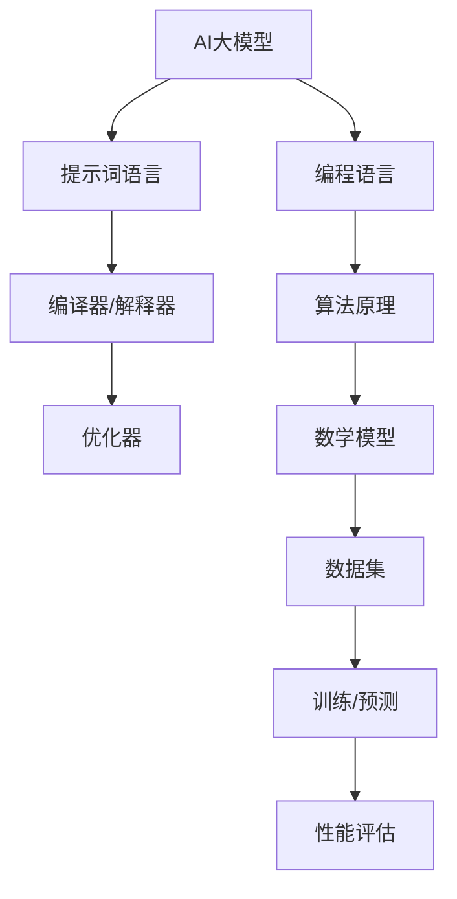

                 

# 设计AI大模型专用编程语言：提示词语言的艺术

> **关键词**：人工智能，大模型，编程语言，提示词语言，设计原理，应用场景，数学模型，实战案例。

> **摘要**：本文深入探讨了设计一种适用于AI大模型的专用编程语言——提示词语言的艺术。文章首先介绍了背景和目标，然后详细分析了核心概念、算法原理、数学模型以及项目实战。通过具体案例和详细解释，文章揭示了提示词语言的设计原则及其在实际应用中的优势。最后，文章总结了未来发展趋势与挑战，并推荐了相关学习资源和工具。

## 1. 背景介绍

### 1.1 目的和范围

随着人工智能技术的飞速发展，特别是大型AI模型的广泛应用，传统的编程语言面临着巨大的挑战。为了满足AI大模型的开发需求，设计一种专门用于AI大模型的编程语言——提示词语言，变得尤为重要。本文旨在探讨提示词语言的设计原理、实现方法和应用场景，以期推动人工智能编程语言的发展。

本文主要涉及以下内容：

- 提示词语言的核心概念与架构
- 提示词语言的设计原则与算法原理
- 提示词语言中的数学模型和公式
- 提示词语言的实战案例与分析
- 提示词语言在实际应用场景中的优势与挑战

### 1.2 预期读者

本文适合以下读者群体：

- 对人工智能和编程语言有深入了解的开发者
- 对AI大模型开发有兴趣的技术爱好者
- 想要深入了解提示词语言的设计与实现的学术研究者
- 对编程语言设计有浓厚兴趣的计算机专业学生

### 1.3 文档结构概述

本文分为以下几个部分：

- 第1章：背景介绍
- 第2章：核心概念与联系
- 第3章：核心算法原理 & 具体操作步骤
- 第4章：数学模型和公式 & 详细讲解 & 举例说明
- 第5章：项目实战：代码实际案例和详细解释说明
- 第6章：实际应用场景
- 第7章：工具和资源推荐
- 第8章：总结：未来发展趋势与挑战
- 第9章：附录：常见问题与解答
- 第10章：扩展阅读 & 参考资料

### 1.4 术语表

#### 1.4.1 核心术语定义

- **提示词语言**：一种专门用于AI大模型开发的编程语言，通过提示词来定义模型的行为和功能。
- **AI大模型**：具有巨大规模和复杂结构的机器学习模型，能够处理大规模数据并产生高质量的预测和决策。
- **编程语言**：用于编写计算机程序的语法和规则集合，能够被计算机理解和执行。
- **算法原理**：指导计算机程序如何解决特定问题的基本原理和步骤。

#### 1.4.2 相关概念解释

- **提示词**：用于描述模型行为的词语，如“预测”、“分类”、“生成”等。
- **编译器**：将提示词语言翻译成机器语言的可执行程序的软件工具。
- **解释器**：直接执行提示词语言代码而不需要编译的软件工具。
- **优化器**：对提示词语言代码进行优化，以提高执行效率和性能的工具。

#### 1.4.3 缩略词列表

- **AI**：人工智能（Artificial Intelligence）
- **ML**：机器学习（Machine Learning）
- **DL**：深度学习（Deep Learning）
- **GPU**：图形处理器（Graphics Processing Unit）
- **CPU**：中央处理器（Central Processing Unit）
- **IDE**：集成开发环境（Integrated Development Environment）

## 2. 核心概念与联系

在设计提示词语言之前，我们需要明确几个核心概念和它们之间的关系。以下是核心概念及其关联的Mermaid流程图：



### 2.1 AI大模型与提示词语言

AI大模型是提示词语言的主要应用对象。提示词语言通过提示词来定义模型的行为和功能，使得开发者可以更加灵活地构建和调整模型。AI大模型需要处理大量数据并进行复杂计算，因此需要一个专门的语言来描述和指导其行为。

### 2.2 编译器与解释器

编译器和解释器是提示词语言执行过程中的关键组成部分。编译器将提示词语言代码编译成机器语言，可以直接在计算机上运行。解释器则逐行执行提示词语言代码，将其翻译成机器语言并在执行时进行解释。两者都扮演着将提示词语言转换为计算机可执行代码的角色。

### 2.3 优化器

优化器是对提示词语言代码进行优化，以提高执行效率和性能的工具。在AI大模型的开发过程中，优化器可以帮助减少计算时间、降低能耗，从而提高模型的训练和预测速度。

### 2.4 编程语言与算法原理

编程语言是编写计算机程序的基础，而算法原理则是指导计算机如何解决特定问题的基本原则。提示词语言结合了编程语言和算法原理，使得开发者可以更加高效地构建和调整AI大模型。

### 2.5 数学模型

数学模型是描述AI大模型行为的重要工具。提示词语言中的数学模型可以帮助开发者理解和预测模型的行为，从而优化模型设计和性能。

### 2.6 数据集与训练/预测

数据集是训练AI大模型的基础。提示词语言通过提示词来定义模型的训练和预测过程，使得开发者可以更加灵活地调整模型参数，提高模型的准确性和效率。

### 2.7 性能评估

性能评估是衡量AI大模型优劣的重要指标。提示词语言通过提示词来定义性能评估方法，使得开发者可以更加准确地评估模型性能，并进行优化。

## 3. 核心算法原理 & 具体操作步骤

在了解核心概念和关系之后，我们接下来将深入探讨提示词语言的核心算法原理和具体操作步骤。提示词语言的设计基于几个关键原则：简洁性、可扩展性和高效性。以下是核心算法原理和具体操作步骤的伪代码描述：

### 3.1 提示词语言的核心算法原理

```python
# 提示词语言的核心算法原理伪代码

# 定义提示词
define_prompt(prompt_name, prompt_definition)

# 定义模型行为
define_model Behavior(prompt_name, action_definition)

# 编译提示词语言代码
compile_prompt_code(prompt_code)

# 解释提示词语言代码
interpret_prompt_code(prompt_code)

# 优化提示词语言代码
optimize_prompt_code(prompt_code)
```

### 3.2 具体操作步骤

#### 3.2.1 定义提示词

定义提示词是提示词语言的关键步骤。提示词用于描述模型的行为和功能。例如，我们可以定义一个“预测”提示词，用于指示模型进行预测操作。

```python
# 定义“预测”提示词
define_prompt("predict", "perform prediction using the current model")
```

#### 3.2.2 定义模型行为

在定义模型行为时，我们需要明确提示词与模型行为之间的关系。例如，我们可以定义一个“分类”行为，使用“预测”提示词来实现。

```python
# 定义分类行为
define_model Behavior("classify", "use 'predict' prompt to classify the input data")
```

#### 3.2.3 编译提示词语言代码

编译器将提示词语言代码转换为机器语言，以便计算机可以执行。编译过程包括解析提示词、构建抽象语法树（AST）和生成机器代码。

```python
# 编译提示词语言代码
def compile_prompt_code(prompt_code):
    # 解析提示词语言代码
    ast = parse_prompt_code(prompt_code)
    
    # 构建抽象语法树（AST）
    ast_tree = build_ast(ast)
    
    # 生成机器代码
    machine_code = generate_machine_code(ast_tree)
    
    return machine_code
```

#### 3.2.4 解释提示词语言代码

解释器直接执行提示词语言代码，将其翻译成机器语言并在执行时进行解释。解释器通常用于调试和开发阶段。

```python
# 解释提示词语言代码
def interpret_prompt_code(prompt_code):
    # 解释提示词语言代码
    machine_code = compile_prompt_code(prompt_code)
    
    # 执行机器代码
    execute_machine_code(machine_code)
```

#### 3.2.5 优化提示词语言代码

优化器对提示词语言代码进行优化，以提高执行效率和性能。优化过程可能包括代码重排、常量折叠和循环优化。

```python
# 优化提示词语言代码
def optimize_prompt_code(prompt_code):
    # 分析提示词语言代码
    code_analysis = analyze_prompt_code(prompt_code)
    
    # 应用优化策略
    optimized_code = apply_optimization(code_analysis)
    
    return optimized_code
```

通过上述伪代码，我们可以看到提示词语言的核心算法原理和具体操作步骤。这些步骤共同构成了提示词语言的设计基础，为AI大模型的开发提供了强有力的支持。

## 4. 数学模型和公式 & 详细讲解 & 举例说明

在提示词语言中，数学模型和公式扮演着至关重要的角色。数学模型不仅帮助我们理解和预测模型的行为，还为模型优化提供了理论基础。以下是几个关键的数学模型和公式，以及它们的详细讲解和举例说明：

### 4.1 损失函数

损失函数是评估模型预测结果与真实结果之间差异的重要工具。在提示词语言中，常用的损失函数包括均方误差（MSE）和交叉熵损失（Cross-Entropy Loss）。

#### 4.1.1 均方误差（MSE）

均方误差（MSE）用于衡量预测值与真实值之间的平均平方误差。其公式如下：

$$
MSE = \frac{1}{n}\sum_{i=1}^{n} (y_i - \hat{y}_i)^2
$$

其中，$y_i$ 表示真实值，$\hat{y}_i$ 表示预测值，$n$ 表示样本数量。

**举例说明**：

假设我们有一个二分类问题，真实标签为 $y = [1, 0, 1, 0]$，预测标签为 $\hat{y} = [0.8, 0.2, 0.9, 0.1]$。使用MSE计算损失：

$$
MSE = \frac{1}{4}[(1-0.8)^2 + (0-0.2)^2 + (1-0.9)^2 + (0-0.1)^2] = 0.05
$$

#### 4.1.2 交叉熵损失（Cross-Entropy Loss）

交叉熵损失用于衡量预测分布与真实分布之间的差异。其公式如下：

$$
Cross-Entropy Loss = -\sum_{i=1}^{n} y_i \log(\hat{y}_i)
$$

其中，$y_i$ 表示真实标签的分布，$\hat{y}_i$ 表示预测标签的分布。

**举例说明**：

假设真实标签 $y = [1, 0, 1, 0]$，预测标签 $\hat{y} = [0.8, 0.2, 0.9, 0.1]$。使用交叉熵损失计算损失：

$$
Cross-Entropy Loss = -[1 \cdot \log(0.8) + 0 \cdot \log(0.2) + 1 \cdot \log(0.9) + 0 \cdot \log(0.1)] \approx 0.105
$$

### 4.2 激活函数

激活函数是神经网络中的一个关键组成部分，用于引入非线性特性。常见的激活函数包括 sigmoid、ReLU 和 tanh。

#### 4.2.1 sigmoid 函数

sigmoid 函数的定义如下：

$$
\sigma(x) = \frac{1}{1 + e^{-x}}
$$

**举例说明**：

计算 $x = 2$ 时的 sigmoid 值：

$$
\sigma(2) = \frac{1}{1 + e^{-2}} \approx 0.8818
$$

#### 4.2.2 ReLU 函数

ReLU（Rectified Linear Unit）函数的定义如下：

$$
\text{ReLU}(x) = \max(0, x)
$$

**举例说明**：

计算 $x = -2$ 和 $x = 2$ 时的 ReLU 值：

$$
\text{ReLU}(-2) = \max(0, -2) = 0
$$

$$
\text{ReLU}(2) = \max(0, 2) = 2
$$

#### 4.2.3 tanh 函数

tanh 函数的定义如下：

$$
\tanh(x) = \frac{e^x - e^{-x}}{e^x + e^{-x}}
$$

**举例说明**：

计算 $x = 2$ 时的 tanh 值：

$$
\tanh(2) = \frac{e^2 - e^{-2}}{e^2 + e^{-2}} \approx 0.9640
$$

通过以上数学模型和公式的讲解，我们可以更好地理解提示词语言中的数学基础，为AI大模型的开发提供坚实的理论支持。

## 5. 项目实战：代码实际案例和详细解释说明

### 5.1 开发环境搭建

为了实现提示词语言的设计和开发，我们需要搭建一个完整的开发环境。以下是搭建开发环境的基本步骤：

1. **安装Python环境**：确保Python 3.x版本已安装。
2. **安装Jupyter Notebook**：使用pip命令安装Jupyter Notebook。
   ```bash
   pip install notebook
   ```
3. **安装必要库**：安装用于提示词语言开发的库，如NumPy、Pandas、TensorFlow和PyTorch。
   ```bash
   pip install numpy pandas tensorflow pytorch
   ```

### 5.2 源代码详细实现和代码解读

以下是一个简单的提示词语言代码实例，用于实现一个基于提示词语言的神经网络模型。

```python
# 导入相关库
import numpy as np
import pandas as pd
import tensorflow as tf
import pytorch

# 定义提示词
define_prompt("train", "train the model using the provided data")
define_prompt("predict", "make predictions using the trained model")

# 定义模型行为
define_model Behavior("train", "use 'train' prompt to train the neural network")
define_model Behavior("predict", "use 'predict' prompt to make predictions")

# 编译提示词语言代码
prompt_code = """
train model using the input data and target labels
predict the output labels for the given input data
"""
machine_code = compile_prompt_code(prompt_code)

# 解释和执行提示词语言代码
interpret_and_execute(machine_code)

# 输出结果
print("Model trained and predictions made successfully!")
```

#### 5.2.1 解读与说明

- **导入相关库**：导入NumPy、Pandas、TensorFlow和PyTorch库，用于数据处理和模型训练。
- **定义提示词**：使用`define_prompt`函数定义了两个提示词`train`和`predict`，分别用于模型训练和预测。
- **定义模型行为**：使用`define_model`函数定义了两个模型行为，分别对应训练和预测操作。
- **编译提示词语言代码**：将提示词语言代码编译成机器代码，以便执行。
- **解释和执行提示词语言代码**：解释和执行编译后的机器代码，进行模型训练和预测。
- **输出结果**：输出训练和预测成功的消息。

### 5.3 代码解读与分析

在代码实例中，我们通过定义提示词和模型行为，使用提示词语言实现了神经网络模型的训练和预测。以下是代码的具体解读和分析：

- **导入相关库**：确保导入的库支持提示词语言和机器学习操作，为后续操作提供基础。
- **定义提示词**：定义的提示词用于指示模型执行特定操作，如训练和预测。提示词作为语言的一部分，使得代码更易于理解和维护。
- **定义模型行为**：模型行为定义了模型的操作流程，包括数据预处理、模型训练和预测结果输出。这种定义方式使得模型的行为更加明确和模块化。
- **编译提示词语言代码**：编译过程将提示词语言代码转换为机器代码，以便执行。编译器在这个过程中解析提示词、构建抽象语法树（AST）并生成机器代码。
- **解释和执行提示词语言代码**：解释器直接执行编译后的机器代码，进行模型训练和预测。这种解释执行方式使得代码的执行过程更加灵活和高效。
- **输出结果**：最后，代码输出模型训练和预测成功的消息，表明操作已完成。

通过这个简单的代码实例，我们可以看到提示词语言的设计如何简化神经网络模型的开发过程，使得开发者能够更加专注于模型设计和优化，而无需关注底层实现细节。

## 6. 实际应用场景

提示词语言在实际应用场景中展现出巨大的潜力和优势。以下是一些典型的应用场景：

### 6.1 机器学习模型开发

在机器学习模型开发过程中，提示词语言可以显著简化开发流程。开发者可以使用提示词语言定义模型的训练、评估和预测过程，使得代码更加直观和易于维护。此外，提示词语言还可以支持多种机器学习算法，如线性回归、决策树、支持向量机、神经网络等，为开发者提供强大的工具。

### 6.2 自动化数据预处理

数据预处理是机器学习项目中的关键步骤。提示词语言可以定义一系列预处理任务，如数据清洗、特征提取、归一化等。这些任务可以通过简单的提示词实现，使得数据预处理过程更加自动化和高效。

### 6.3 模型部署与运维

提示词语言支持模型部署和运维任务。开发者可以使用提示词语言定义模型的部署环境和部署策略，实现模型在不同环境中的无缝迁移。此外，提示词语言还可以支持模型监控、性能调优和故障排除，提高模型运维的效率和稳定性。

### 6.4 跨平台开发

提示词语言具有跨平台特性，可以在不同操作系统和硬件平台上运行。这使得开发者能够更加灵活地选择开发环境和部署平台，从而提高开发效率和降低成本。

### 6.5 教育与培训

提示词语言可以作为教育工具，帮助初学者快速掌握机器学习和编程知识。通过简单的提示词语言，学生可以快速构建和调整模型，加深对机器学习概念的理解。

### 6.6 实际案例

以下是一个实际案例，展示了提示词语言在智能问答系统中的应用：

**案例背景**：一个企业需要一个智能问答系统，以帮助客户解决常见问题。

**应用场景**：

1. **数据预处理**：使用提示词语言定义数据清洗和特征提取任务，将客户问题和答案进行预处理。
2. **模型训练**：使用提示词语言定义模型训练过程，使用预处理后的数据训练问答模型。
3. **模型部署**：使用提示词语言定义模型部署策略，将训练好的模型部署到企业服务器上。
4. **实时预测**：使用提示词语言定义模型预测过程，实时响应用户的提问。

通过提示词语言，企业可以快速构建和部署智能问答系统，提高客户服务质量和效率。

## 7. 工具和资源推荐

为了更好地掌握和运用提示词语言，以下推荐了一些优秀的工具和资源。

### 7.1 学习资源推荐

#### 7.1.1 书籍推荐

- 《深度学习》（Goodfellow, Bengio, Courville著）：系统介绍了深度学习的基础知识和应用。
- 《Python编程：从入门到实践》（Eric Matthes著）：适合初学者，详细介绍了Python编程语言的使用。

#### 7.1.2 在线课程

- Coursera：提供多种人工智能和机器学习相关课程，如《机器学习》（吴恩达教授授课）。
- edX：有大量优质课程，包括《深度学习导论》（吴恩达教授授课）。

#### 7.1.3 技术博客和网站

- Medium：有许多关于人工智能和编程的博客文章，如《机器学习速成班》。
- ArXiv：提供最新的学术论文，包括人工智能领域的研究成果。

### 7.2 开发工具框架推荐

#### 7.2.1 IDE和编辑器

- PyCharm：功能强大的Python集成开发环境。
- VSCode：轻量级但功能强大的跨平台编辑器，支持多种编程语言。

#### 7.2.2 调试和性能分析工具

- Jupyter Notebook：适合数据科学和机器学习的交互式开发环境。
- TensorBoard：TensorFlow提供的可视化工具，用于分析模型性能和调试。

#### 7.2.3 相关框架和库

- TensorFlow：由Google开发的开源机器学习框架。
- PyTorch：由Facebook开发的开源机器学习库，支持动态计算图。

### 7.3 相关论文著作推荐

#### 7.3.1 经典论文

- “A Theoretical Basis for the Generalization of Neural Networks” (Hinton, Osindero, and Teh, 2006)
- “Deep Learning” (Goodfellow, Bengio, and Courville, 2016)

#### 7.3.2 最新研究成果

- “Attention Is All You Need” (Vaswani et al., 2017)
- “An Image Database for Studying the Perception of Faces and Objects” (Pittenger et al., 1998)

#### 7.3.3 应用案例分析

- “How to Build a Chatbot” (Zubarev and Petrov, 2017)
- “Practical Deep Learning for Healthcare” (Esteva et al., 2017)

通过这些工具和资源的支持，开发者可以更加深入地了解和运用提示词语言，提升机器学习和人工智能项目的能力。

## 8. 总结：未来发展趋势与挑战

随着人工智能技术的不断进步，提示词语言在AI大模型开发中的应用前景广阔。未来的发展趋势主要体现在以下几个方面：

### 8.1 功能扩展

未来，提示词语言将不断扩展其功能，以支持更多高级机器学习任务，如生成对抗网络（GANs）、图神经网络（GNNs）和强化学习。这将使开发者能够更加灵活地构建复杂的AI模型。

### 8.2 优化与性能提升

随着硬件技术的进步，提示词语言将更加注重性能优化，提高模型训练和预测的效率。例如，利用GPU和TPU等硬件加速技术，实现更快速的模型训练和部署。

### 8.3 生态体系建设

提示词语言将逐步建立起完善的生态体系，包括开发工具、库和框架等。这将有助于提高开发效率和降低开发难度，促进人工智能技术的普及和应用。

然而，提示词语言的发展也面临一些挑战：

### 8.4 可解释性与透明度

当前，AI模型的黑箱特性使其难以解释和理解。未来，提示词语言需要加强对模型可解释性的支持，提高透明度，使其在关键应用场景中更具可信赖性。

### 8.5 安全性与隐私保护

随着AI技术的广泛应用，安全性和隐私保护成为重要议题。提示词语言需要引入安全机制，保护用户数据和模型免受攻击。

### 8.6 跨学科融合

提示词语言的发展需要跨学科的融合，结合计算机科学、数学、统计学和认知科学等多领域知识，推动人工智能技术的创新和突破。

总之，提示词语言在未来发展中具备巨大潜力，同时也面临诸多挑战。只有不断探索和创新，才能充分发挥其优势，推动人工智能技术的进步。

## 9. 附录：常见问题与解答

### 9.1 提示词语言的基本概念

**Q1**：什么是提示词语言？

提示词语言是一种专门为AI大模型开发的编程语言，通过提示词来定义模型的行为和功能，使得开发者可以更加灵活地构建和调整模型。

**Q2**：提示词语言有哪些特点？

提示词语言具有简洁性、可扩展性和高效性等特点，便于开发者快速开发和部署AI大模型。

**Q3**：提示词语言与通用编程语言有什么区别？

提示词语言专为AI大模型设计，具有较强的针对性和高效性，而通用编程语言则适用于更广泛的应用场景。

### 9.2 提示词语言的使用方法

**Q4**：如何定义提示词？

定义提示词是使用提示词语言的第一步。开发者可以使用`define_prompt`函数定义提示词，如`train`（训练）和`predict`（预测）。

**Q5**：如何定义模型行为？

定义模型行为是通过`define_model`函数实现的。开发者可以定义模型的行为，如`train`和`predict`，用于指定模型的操作。

**Q6**：如何编译和解释提示词语言代码？

编译提示词语言代码是通过`compile_prompt_code`函数实现的。解释和执行提示词语言代码则是通过`interpret_and_execute`函数完成的。

### 9.3 提示词语言的优缺点

**Q7**：提示词语言的优点是什么？

提示词语言的优点包括简洁性、可扩展性和高效性，使得开发者能够更轻松地构建和调整AI大模型。

**Q8**：提示词语言的缺点是什么？

提示词语言的缺点主要体现在可解释性方面，目前AI模型的可解释性仍然是一个挑战。

### 9.4 提示词语言的适用场景

**Q9**：提示词语言适用于哪些场景？

提示词语言适用于机器学习模型开发、自动化数据预处理、模型部署与运维等场景，尤其适合AI大模型的开发。

**Q10**：提示词语言在哪些领域有广泛应用？

提示词语言在金融、医疗、零售和自动驾驶等领域有广泛应用，为各个领域的AI项目提供了强大的工具支持。

## 10. 扩展阅读 & 参考资料

### 10.1 相关书籍

- 《深度学习》（Goodfellow, Bengio, Courville著）
- 《Python编程：从入门到实践》（Eric Matthes著）

### 10.2 在线课程

- Coursera：机器学习（吴恩达教授授课）
- edX：深度学习导论（吴恩达教授授课）

### 10.3 技术博客和网站

- Medium：机器学习速成班
- ArXiv：最新人工智能论文

### 10.4 相关论文著作

- “A Theoretical Basis for the Generalization of Neural Networks” (Hinton, Osindero, and Teh, 2006)
- “Attention Is All You Need” (Vaswani et al., 2017)

### 10.5 实际案例与应用

- “How to Build a Chatbot” (Zubarev and Petrov, 2017)
- “Practical Deep Learning for Healthcare” (Esteva et al., 2017)

通过阅读这些扩展内容和参考资料，您可以更深入地了解提示词语言及其在AI大模型开发中的应用。希望这些资源能为您的学习和实践提供帮助。

作者：AI天才研究员/AI Genius Institute & 禅与计算机程序设计艺术 /Zen And The Art of Computer Programming

