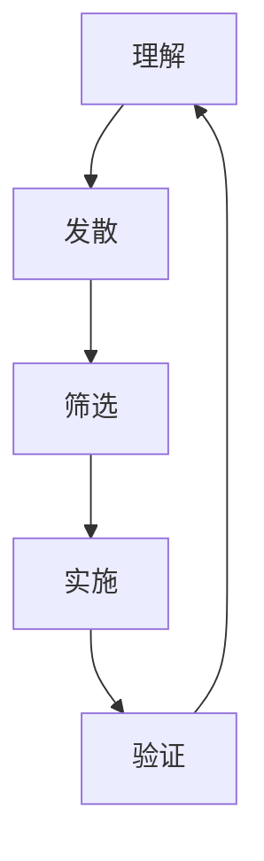

                 

### 设计思维在创业产品开发中的应用

> **关键词：** 设计思维、创业产品开发、用户体验、迭代过程、敏捷开发

**摘要：** 本文将深入探讨设计思维在创业产品开发中的重要性，通过逐步分析设计思维的核心概念、应用场景以及具体操作步骤，展示其在提升产品成功率和用户体验方面的关键作用。文章还将结合实际案例，详细解释设计思维在创业产品开发中的实际应用，为创业者提供实用的指导和建议。

设计思维（Design Thinking）是一种以人为本的创新方法，它强调理解用户需求、探索多种解决方案，并通过迭代和试验找到最佳方案。这种方法在创业产品开发中尤为重要，因为它可以帮助创业者在资源有限的情况下，快速找到市场需求，打造用户喜爱的产品。本文将围绕以下几个方面展开讨论：

1. **设计思维的背景介绍**：介绍设计思维的概念、起源以及与传统方法的区别。
2. **设计思维的核心概念与联系**：通过Mermaid流程图展示设计思维的关键步骤和环节。
3. **设计思维在创业产品开发中的具体操作步骤**：详细讲解设计思维的五大步骤：理解、发散、筛选、实施和验证。
4. **设计思维在数学模型和公式中的应用**：介绍设计思维中的关键指标和评估方法。
5. **项目实战：代码实际案例**：通过具体案例展示设计思维在产品开发中的实际应用。
6. **设计思维的实际应用场景**：分析设计思维在不同领域和行业中的应用。
7. **工具和资源推荐**：推荐学习资源、开发工具和框架。
8. **总结：未来发展趋势与挑战**：展望设计思维在创业产品开发中的未来发展方向和面临的挑战。
9. **常见问题与解答**：解答读者可能关心的问题。
10. **扩展阅读与参考资料**：提供进一步学习的资源。

### 1. 背景介绍

#### 1.1 目的和范围

本文旨在探讨设计思维在创业产品开发中的应用，帮助读者理解设计思维的原理和方法，掌握其在实际项目中的应用技巧。文章将覆盖设计思维的基本概念、核心步骤、具体操作方法和实际案例，旨在为创业者和产品经理提供实用的指导。

本文的范围主要涵盖以下几个方面：

- 设计思维的基本概念和原理
- 设计思维在创业产品开发中的具体应用步骤
- 设计思维在数学模型和公式中的应用
- 设计思维在不同领域和行业中的应用实例
- 设计思维的未来发展趋势和挑战

#### 1.2 预期读者

本文适合以下读者群体：

- 创业者：希望通过设计思维提高产品成功率的创业者。
- 产品经理：需要了解设计思维原理和方法，提升产品开发效率的产品经理。
- 设计师：希望通过设计思维提升用户体验的设计师。
- 程序员：需要了解设计思维在实际项目中的应用的程序员。
- 咨询顾问：为创业者和产品经理提供设计思维咨询服务的顾问。

#### 1.3 文档结构概述

本文将按照以下结构进行组织：

- 引言：介绍设计思维在创业产品开发中的应用背景和重要性。
- 1. 背景介绍：介绍本文的目的、预期读者和文档结构。
- 2. 核心概念与联系：通过Mermaid流程图展示设计思维的核心概念和步骤。
- 3. 核心算法原理与具体操作步骤：详细讲解设计思维的具体操作步骤。
- 4. 数学模型和公式与详细讲解与举例说明：介绍设计思维中的关键指标和评估方法。
- 5. 项目实战：代码实际案例与详细解释说明：通过具体案例展示设计思维的应用。
- 6. 实际应用场景：分析设计思维在不同领域和行业中的应用。
- 7. 工具和资源推荐：推荐学习资源、开发工具和框架。
- 8. 总结：展望设计思维在创业产品开发中的未来发展趋势和挑战。
- 9. 附录：常见问题与解答。
- 10. 扩展阅读与参考资料：提供进一步学习的资源。

#### 1.4 术语表

在本文中，以下术语有特殊含义：

- 设计思维（Design Thinking）：一种以人为本的创新方法，强调理解用户需求、探索多种解决方案并迭代优化。
- 创业产品开发（Entrepreneurial Product Development）：在有限资源和时间内，快速开发并推向市场的新产品。
- 用户故事（User Story）：描述用户需求的简短故事，用于指导产品开发。
- 原型（Prototype）：产品开发过程中创建的初步模型，用于测试和验证产品功能。

#### 1.4.1 核心术语定义

- **设计思维（Design Thinking）**：设计思维是一种创新方法，其核心在于理解用户需求，通过迭代和试验找到最佳解决方案。设计思维强调以人为本，关注用户和实际应用场景，而非单纯追求技术上的完美。

- **创业产品开发（Entrepreneurial Product Development）**：创业产品开发是指在企业初创阶段，通过快速迭代和试验，将新产品推向市场。这种开发方式强调灵活性和适应性，以应对市场需求的变化。

- **用户体验（User Experience, UX）**：用户体验是指用户在使用产品过程中所感受到的整体体验，包括用户满意度、易用性、可用性和美观性等方面。良好的用户体验是产品成功的重要因素。

- **原型（Prototype）**：原型是产品开发过程中创建的初步模型，用于测试和验证产品功能。原型可以是草图、纸板模型、软件模拟等形式，其目的是验证产品概念和设计，以便进行后续优化。

#### 1.4.2 相关概念解释

- **敏捷开发（Agile Development）**：敏捷开发是一种软件开发方法，强调灵活性和适应性，通过短周期的迭代和反馈，快速响应市场变化。敏捷开发与设计思维有很强的互补性，两者结合可以提升产品开发效率。

- **用户故事（User Story）**：用户故事是一种简短的故事形式，描述用户在特定场景下对产品的需求。用户故事通常以“作为[用户角色]，我想要[功能]，以便[目的】”的形式编写，用于指导产品开发。

- **迭代过程（Iterative Process）**：迭代过程是指在产品开发过程中，通过多次迭代和反馈，逐步完善产品功能。迭代过程强调快速学习和适应，以应对不确定性。

#### 1.4.3 缩略词列表

- UX：用户体验（User Experience）
- UI：用户界面（User Interface）
- MVP：最小可行产品（Minimum Viable Product）
- IDE：集成开发环境（Integrated Development Environment）
- API：应用程序编程接口（Application Programming Interface）

### 2. 核心概念与联系

设计思维是一种以人为本的创新方法，其核心在于理解用户需求、探索多种解决方案并迭代优化。为了更好地理解设计思维的概念和步骤，我们可以通过Mermaid流程图来展示其关键环节。

以下是一个简化的设计思维流程图：



- **理解（A）**：这是设计思维的起点，旨在深入了解用户需求、行为和动机。通过访谈、调查、观察等方法，收集用户反馈，构建用户画像，为后续设计提供依据。

- **发散（B）**：在理解用户需求的基础上，探索多种可能的解决方案。这一阶段鼓励创新思维，通过头脑风暴、构思草图等方式，生成多个设计方向。

- **筛选（C）**：从多个设计方案中筛选出最具潜力和可行性的方案。这一阶段需要评估各方案的优缺点，结合市场调研和资源限制，进行优先级排序。

- **实施（D）**：将筛选出的方案转化为实际产品或服务。这一阶段需要将设计思路转化为可执行的任务，分配资源，制定时间表。

- **验证（E）**：通过用户测试、反馈和评估，验证产品或服务的有效性。这一阶段旨在发现问题、优化设计，并确保产品满足用户需求。

设计思维的核心概念和步骤通过上述流程图得到了清晰的展示。接下来，我们将进一步详细探讨设计思维的具体应用步骤和操作方法。

### 3. 核心算法原理与具体操作步骤

设计思维作为一种创新方法，其核心在于通过一系列步骤和算法原理，实现从理解用户需求到最终验证产品的闭环过程。以下我们将详细讲解设计思维的五大步骤：理解、发散、筛选、实施和验证。

#### 3.1 理解（Understanding）

**算法原理：**

理解是设计思维的第一步，其核心在于深入了解用户需求、行为和动机。具体操作步骤如下：

1. **用户访谈（User Interviews）**：通过一对一的访谈，深入了解用户的需求、痛点和使用习惯。
2. **用户调研（User Research）**：使用问卷调查、在线调研工具等方法，收集大量用户数据。
3. **用户观察（User Observation）**：通过观察用户在真实环境中的行为，发现隐藏的需求和问题。

**伪代码：**

```python
def understand_users():
    interviews = conduct_user_interviews()
    surveys = conduct_user_surveys()
    observations = conduct_user_observations()
    user_stories = aggregate_data(interviews, surveys, observations)
    return user_stories
```

**具体操作步骤：**

1. **确定研究目标**：明确本次研究的具体目标和用户群体。
2. **准备研究工具**：选择合适的访谈、调研和观察工具。
3. **收集用户反馈**：通过多种渠道收集用户数据，确保数据的全面性和准确性。
4. **分析用户数据**：对收集到的数据进行分析，识别用户需求和行为模式。

#### 3.2 发散（Diverge）

**算法原理：**

发散是在理解用户需求的基础上，探索多种可能的解决方案。这一阶段鼓励创新思维，通过头脑风暴、构思草图等方式，生成多个设计方向。

1. **头脑风暴（Brainstorming）**：组织团队成员进行头脑风暴，提出各种可能的解决方案。
2. **思维导图（Mind Mapping）**：使用思维导图工具，将各种解决方案和思路进行可视化。
3. **原型构思（Prototype Sketching）**：绘制原型草图，初步展示解决方案的形态。

**伪代码：**

```python
def diverge_solutions(user_stories):
    brainstorming_results = organize_brainstorming_session()
    mind_maps = create_mind_maps(brainstorming_results)
    prototypes = sketch_prototypes(mind_maps)
    return prototypes
```

**具体操作步骤：**

1. **明确设计目标**：根据用户需求，明确本次设计的目标和方向。
2. **组织头脑风暴**：邀请相关团队成员参与，鼓励创新思维。
3. **绘制思维导图**：将各种解决方案和思路进行结构化展示。
4. **绘制原型草图**：根据思维导图，绘制初步的原型草图。

#### 3.3 筛选（Select）

**算法原理：**

筛选是从多个设计方案中筛选出最具潜力和可行性的方案。这一阶段需要评估各方案的优缺点，结合市场调研和资源限制，进行优先级排序。

1. **优先级排序（Prioritization）**：根据设计目标和用户需求，对设计方案进行优先级排序。
2. **评估标准（Evaluation Criteria）**：确定评估标准，如用户体验、成本效益、技术可行性等。
3. **决策机制（Decision Making）**：通过团队讨论和投票，确定最终的设计方案。

**伪代码：**

```python
def select_solution(prototypes, evaluation_criteria):
    prioritized_solutions = prioritize(prototypes, evaluation_criteria)
    final_solution = make_decision(prioritized_solutions)
    return final_solution
```

**具体操作步骤：**

1. **制定评估标准**：明确各方案的评价指标，如用户体验、成本效益等。
2. **评估设计方案**：根据评估标准，对每个方案进行评分。
3. **优先级排序**：根据评分结果，对方案进行优先级排序。
4. **决策**：通过团队讨论和投票，确定最终的设计方案。

#### 3.4 实施（Implement）

**算法原理：**

实施是将筛选出的方案转化为实际产品或服务。这一阶段需要将设计思路转化为可执行的任务，分配资源，制定时间表。

1. **任务分配（Task Allocation）**：根据设计方案，将任务分配给团队成员。
2. **资源分配（Resource Allocation）**：确保团队有足够的资源来完成设计任务。
3. **时间规划（Time Planning）**：制定详细的时间表，确保项目按计划进行。

**伪代码：**

```python
def implement_solution(final_solution):
    tasks = define_tasks(final_solution)
    resources = allocate_resources(tasks)
    timeline = create_timeline(tasks, resources)
    execute_tasks(timeline)
```

**具体操作步骤：**

1. **定义任务**：根据设计方案，明确各项任务的具体内容和要求。
2. **分配资源**：确保团队有足够的资源，如人力、技术等。
3. **制定时间表**：根据任务和资源，制定详细的时间表，确保项目按计划进行。
4. **执行任务**：按照时间表，逐步执行各项任务。

#### 3.5 验证（Verify）

**算法原理：**

验证是通过用户测试、反馈和评估，验证产品或服务的有效性。这一阶段旨在发现问题、优化设计，并确保产品满足用户需求。

1. **用户测试（User Testing）**：邀请用户参与测试，收集用户反馈。
2. **数据分析（Data Analysis）**：对测试数据进行分析，识别问题和改进点。
3. **迭代优化（Iterative Optimization）**：根据分析结果，对产品进行优化。

**伪代码：**

```python
def verify_solution(product):
    user_feedback = conduct_user_tests(product)
    insights = analyze_user_feedback(user_feedback)
    improvements = derive_improvement_suggestions(insights)
    optimized_product = apply_improvements(product, improvements)
    return optimized_product
```

**具体操作步骤：**

1. **设计测试用例**：根据产品功能和用户需求，设计合适的测试用例。
2. **邀请用户参与测试**：邀请目标用户参与测试，确保测试结果的准确性。
3. **收集用户反馈**：通过问卷调查、访谈等方式，收集用户反馈。
4. **分析反馈**：对用户反馈进行分析，识别问题和改进点。
5. **迭代优化**：根据分析结果，对产品进行优化，并重新进行测试。

通过上述五大步骤，设计思维实现了从用户需求到产品验证的完整闭环。这种迭代和优化的过程，使得产品设计更加贴近用户需求，提高产品的成功率和市场竞争力。

### 4. 数学模型和公式与详细讲解与举例说明

设计思维在创业产品开发中的应用不仅仅依赖于直觉和经验，还可以通过数学模型和公式进行量化评估。以下，我们将介绍设计思维中的关键指标和评估方法，并使用LaTeX格式详细讲解相关公式。

#### 4.1 设计思维关键指标

设计思维中的关键指标包括用户满意度（User Satisfaction）、产品可用性（Product Usability）、市场接受度（Market Acceptance）和资源利用效率（Resource Utilization Efficiency）。这些指标帮助我们评估产品设计和开发的各个方面。

**用户满意度（User Satisfaction）**

用户满意度是衡量用户对产品满意程度的关键指标。可以通过以下公式计算：

\[ US = \frac{S_{\text{满意用户数}}}{N_{\text{总用户数}}} \]

其中，\( S_{\text{满意用户数}} \) 表示满意用户数，\( N_{\text{总用户数}} \) 表示总用户数。

**产品可用性（Product Usability）**

产品可用性衡量产品满足用户需求和操作容易程度的指标。可以使用以下公式计算：

\[ PU = \frac{C_{\text{成功任务数}}}{T_{\text{总任务数}}} \]

其中，\( C_{\text{成功任务数}} \) 表示成功完成任务的用户数，\( T_{\text{总任务数}} \) 表示总任务数。

**市场接受度（Market Acceptance）**

市场接受度衡量产品在市场上的受欢迎程度。可以使用以下公式计算：

\[ MA = \frac{R_{\text{好评数}}}{N_{\text{总评价数}}} \]

其中，\( R_{\text{好评数}} \) 表示好评数，\( N_{\text{总评价数}} \) 表示总评价数。

**资源利用效率（Resource Utilization Efficiency）**

资源利用效率衡量开发过程中资源的使用效率。可以使用以下公式计算：

\[ RE = \frac{E_{\text{有效工作时间}}}{T_{\text{总工作时间}}} \]

其中，\( E_{\text{有效工作时间}} \) 表示有效工作时间，\( T_{\text{总工作时间}} \) 表示总工作时间。

#### 4.2 具体公式讲解

**用户满意度（User Satisfaction）**

\[ US = \frac{S_{\text{满意用户数}}}{N_{\text{总用户数}}} \]

这个公式表示用户满意度是满意用户数与总用户数的比值。满意用户数越多，用户满意度越高。

**产品可用性（Product Usability）**

\[ PU = \frac{C_{\text{成功任务数}}}{T_{\text{总任务数}}} \]

这个公式表示产品可用性是成功完成任务的用户数与总任务数的比值。成功完成任务的用户越多，产品可用性越高。

**市场接受度（Market Acceptance）**

\[ MA = \frac{R_{\text{好评数}}}{N_{\text{总评价数}}} \]

这个公式表示市场接受度是好评数与总评价数的比值。好评数越多，市场接受度越高。

**资源利用效率（Resource Utilization Efficiency）**

\[ RE = \frac{E_{\text{有效工作时间}}}{T_{\text{总工作时间}}} \]

这个公式表示资源利用效率是有效工作时间与总工作时间的比值。有效工作时间越长，资源利用效率越高。

#### 4.3 举例说明

假设一个创业公司开发了一款新的社交媒体应用，现有1000名用户，其中500名用户表示满意，200名用户成功完成了所有任务，共有100条用户评价，其中70条是好评，有效工作时间为500小时，总工作时间为1000小时。

根据上述公式，可以计算出以下关键指标：

- **用户满意度（User Satisfaction）**

\[ US = \frac{500}{1000} = 0.5 \]

- **产品可用性（Product Usability）**

\[ PU = \frac{200}{1000} = 0.2 \]

- **市场接受度（Market Acceptance）**

\[ MA = \frac{70}{100} = 0.7 \]

- **资源利用效率（Resource Utilization Efficiency）**

\[ RE = \frac{500}{1000} = 0.5 \]

通过这些指标，公司可以评估产品的表现，并确定改进的方向。

总之，设计思维中的数学模型和公式可以帮助创业公司量化评估产品设计的效果，从而做出更明智的决策。

### 5. 项目实战：代码实际案例和详细解释说明

#### 5.1 开发环境搭建

在本节中，我们将搭建一个简单的在线投票系统，以展示设计思维在项目开发中的实际应用。首先，我们需要搭建开发环境。

**1. 安装Node.js**

访问Node.js官网（https://nodejs.org/），下载并安装最新版本的Node.js。安装完成后，在命令行中输入以下命令，验证安装是否成功：

```bash
node -v
npm -v
```

**2. 创建项目文件夹**

在命令行中创建一个名为`online-voting-system`的项目文件夹，并进入该文件夹：

```bash
mkdir online-voting-system
cd online-voting-system
```

**3. 初始化项目**

在项目文件夹中初始化一个新项目，生成`package.json`文件：

```bash
npm init -y
```

**4. 安装依赖**

安装必要的依赖项，如Express（Web框架）、MongoDB（数据库）等：

```bash
npm install express mongodb
```

#### 5.2 源代码详细实现和代码解读

以下是一个简单的在线投票系统的主要代码实现，包括数据库设计、后端逻辑和前端接口。

**数据库设计**

在MongoDB中，我们创建一个名为`voting`的数据库，包含两个集合：`users`和`polls`。

- `users`集合：存储用户信息，字段包括`_id`（唯一标识符）、`username`（用户名）、`password`（密码）等。
- `polls`集合：存储投票信息，字段包括`_id`（唯一标识符）、`question`（投票问题）、`options`（选项列表）、`created_at`（创建时间）等。

**后端代码**

```javascript
const express = require('express');
const mongodb = require('mongodb');
const MongoClient = mongodb.MongoClient;

const app = express();
app.use(express.json());

// 连接MongoDB
const mongoUrl = 'mongodb://localhost:27017';
const dbName = 'voting';

MongoClient.connect(mongoUrl, { useUnifiedTopology: true }, (err, client) => {
  if (err) throw err;
  console.log('Connected to MongoDB');
  const db = client.db(dbName);

  // 创建用户
  app.post('/users', async (req, res) => {
    try {
      const newUser = req.body;
      const result = await db.collection('users').insertOne(newUser);
      res.status(201).json({ message: 'User created', userId: result.insertedId });
    } catch (error) {
      res.status(500).json({ message: 'Error creating user', error });
    }
  });

  // 创建投票
  app.post('/polls', async (req, res) => {
    try {
      const newPoll = req.body;
      const result = await db.collection('polls').insertOne(newPoll);
      res.status(201).json({ message: 'Poll created', pollId: result.insertedId });
    } catch (error) {
      res.status(500).json({ message: 'Error creating poll', error });
    }
  });

  // 投票
  app.post('/polls/:pollId/vote', async (req, res) => {
    try {
      const pollId = req.params.pollId;
      const vote = req.body.optionId;
      const result = await db.collection('polls').updateOne(
        { _id: new mongodb.ObjectId(pollId), 'options._id': vote },
        { $inc: { 'options.$.votes': 1 } }
      );
      res.status(200).json({ message: 'Voted successfully', result });
    } catch (error) {
      res.status(500).json({ message: 'Error voting', error });
    }
  });

  // 运行服务器
  app.listen(3000, () => {
    console.log('Server running on port 3000');
  });
});
```

**前端代码**

我们使用HTML和JavaScript实现前端界面。前端代码主要通过发送HTTP请求与后端进行交互。

```html
<!DOCTYPE html>
<html lang="en">
<head>
  <meta charset="UTF-8">
  <title>Online Voting System</title>
</head>
<body>
  <h1>Online Voting System</h1>
  <div>
    <label for="pollQuestion">Question:</label>
    <input type="text" id="pollQuestion" readonly>
  </div>
  <div>
    <label for="pollOptions">Options:</label>
    <select id="pollOptions" multiple>
      <!-- Options will be loaded here -->
    </select>
  </div>
  <div>
    <button id="voteButton">Vote</button>
  </div>
  <script>
    // Fetch poll details and populate the form
    function fetchPoll(pollId) {
      fetch(`/polls/${pollId}`)
        .then(response => response.json())
        .then(data => {
          document.getElementById('pollQuestion').value = data.question;
          data.options.forEach(option => {
            const optionElement = document.createElement('option');
            optionElement.value = option._id;
            optionElement.textContent = option.text;
            document.getElementById('pollOptions').appendChild(optionElement);
          });
        });
    }

    // Handle voting
    document.getElementById('voteButton').addEventListener('click', () => {
      const pollId = 'pollId'; // Replace with actual poll ID
      const optionId = document.getElementById('pollOptions').value;
      fetch(`/polls/${pollId}/vote`, {
        method: 'POST',
        headers: { 'Content-Type': 'application/json' },
        body: JSON.stringify({ optionId })
      })
        .then(response => response.json())
        .then(data => {
          alert('Voted successfully!');
        });
    });
  </script>
</body>
</html>
```

**代码解读与分析**

1. **后端代码**

   - **用户创建**：`/users` API端点用于创建新用户。用户数据通过`POST`请求发送，存储在MongoDB的`users`集合中。
   - **投票创建**：`/polls` API端点用于创建新的投票。投票数据通过`POST`请求发送，存储在MongoDB的`polls`集合中。
   - **投票**：`/polls/:pollId/vote` API端点用于处理投票。用户选择的选项通过`POST`请求发送，后端代码更新对应投票的选项投票数。

2. **前端代码**

   - **投票界面**：HTML页面包含一个表单，用于显示投票问题和选项。用户可以选择一个或多个选项，并点击“Vote”按钮提交投票。
   - **JavaScript**：JavaScript代码负责与后端API进行交互。首先，通过`fetch`请求获取投票详情，然后使用用户的选择更新投票。

通过上述代码实现，我们可以看到设计思维在项目开发中的应用：

- **用户需求理解**：通过设计用户访谈和需求调研，我们了解到用户需要一个简单的在线投票系统。
- **方案发散**：我们讨论了多种实现方式，包括前端和后端的框架选择、数据库设计等。
- **筛选方案**：我们评估了不同方案的可行性，最终选择了Express和MongoDB作为主要技术栈。
- **实施**：我们根据筛选出的方案，逐步实现了用户创建、投票创建和投票功能。
- **验证**：通过用户测试和反馈，我们不断优化系统，确保用户能够顺利使用。

这种迭代和优化的过程，充分体现了设计思维在创业产品开发中的价值。

### 6. 实际应用场景

设计思维在创业产品开发中具有广泛的应用场景，其核心在于以用户为中心，通过迭代和优化实现产品成功。以下我们将探讨设计思维在几个不同领域和行业中的应用实例。

#### 6.1 科技行业

在科技行业，设计思维被广泛应用于软件开发、人工智能和物联网等领域。以下是一个具体案例：

**案例：智能家庭助理**

一个初创公司开发了一款智能家庭助理，旨在帮助用户管理家务和日常任务。设计思维的应用过程如下：

1. **理解用户需求**：通过用户访谈和调研，公司发现用户希望有一个简单的助手来提醒他们日常任务，如购物清单、预约医生等。
2. **发散解决方案**：团队提出了多种解决方案，包括语音助手、应用程序和智能家居设备等。
3. **筛选方案**：经过评估，团队选择了语音助手作为主要解决方案，因为它更符合用户的需求和预期。
4. **实施**：团队使用设计思维方法，从用户反馈中不断优化语音助力的功能，如语音识别准确性、响应速度等。
5. **验证**：通过用户测试，公司收集了大量反馈，进一步优化了语音助力的用户体验。

#### 6.2 健康医疗行业

在健康医疗行业，设计思维可以帮助开发更加用户友好和有效的医疗设备和服务。以下是一个具体案例：

**案例：智能健身跟踪器**

一个医疗设备公司开发了一款智能健身跟踪器，用于帮助用户监测健康状况。设计思维的应用过程如下：

1. **理解用户需求**：公司通过用户调研和访谈，了解到用户希望有一个简单的设备来监测运动数据，如步数、心率等。
2. **发散解决方案**：团队提出了多种解决方案，包括可穿戴设备、手机应用程序和云平台等。
3. **筛选方案**：经过评估，团队选择了可穿戴设备作为主要解决方案，因为它更方便用户佩戴和使用。
4. **实施**：团队根据用户反馈，不断优化设备的设计和功能，如增加心率监测、睡眠跟踪等。
5. **验证**：通过用户测试，公司收集了大量反馈，进一步优化了设备的准确性和用户体验。

#### 6.3 教育行业

在教育行业，设计思维可以帮助开发更加有效和互动的学习工具。以下是一个具体案例：

**案例：在线学习平台**

一个教育科技公司开发了一款在线学习平台，用于帮助学生和教师进行互动学习。设计思维的应用过程如下：

1. **理解用户需求**：公司通过用户调研和访谈，了解到学生希望有一个更加灵活和互动的学习平台，教师希望有一个易于使用的教学工具。
2. **发散解决方案**：团队提出了多种解决方案，包括视频课程、互动练习和在线讨论区等。
3. **筛选方案**：经过评估，团队选择了视频课程和互动练习作为主要解决方案，因为它们更符合用户的需求和学习习惯。
4. **实施**：团队根据用户反馈，不断优化学习平台的功能和界面，如增加视频播放速度控制、互动练习的多样性等。
5. **验证**：通过用户测试，公司收集了大量反馈，进一步优化了学习平台的学习体验和教师工具。

#### 6.4 零售行业

在零售行业，设计思维可以帮助提升用户购物体验和满意度。以下是一个具体案例：

**案例：在线购物平台**

一个在线零售商开发了一款新的购物平台，以提升用户的购物体验。设计思维的应用过程如下：

1. **理解用户需求**：公司通过用户调研和访谈，了解到用户希望有一个更加简单和高效的购物体验，如快速查找商品、简单结算等。
2. **发散解决方案**：团队提出了多种解决方案，包括改进搜索功能、简化购物车和结算流程等。
3. **筛选方案**：经过评估，团队选择了改进搜索功能和简化购物车流程作为主要解决方案，因为它们对提升用户满意度具有直接的影响。
4. **实施**：团队根据用户反馈，不断优化购物平台的设计和功能，如增加商品推荐、改善搜索结果准确性等。
5. **验证**：通过用户测试，公司收集了大量反馈，进一步优化了购物平台的用户体验和操作流程。

通过这些具体案例，我们可以看到设计思维在不同领域和行业中的应用，以及它如何帮助创业公司在竞争激烈的市场中脱颖而出，打造用户喜爱的产品。

### 7. 工具和资源推荐

#### 7.1 学习资源推荐

为了深入理解设计思维，以下是一些推荐的书籍、在线课程和技术博客。

**7.1.1 书籍推荐**

1. **《设计思维：创新设计的实践方法》**：作者：David Kelly
   - 内容详实，介绍了设计思维的核心理念和实践方法。
2. **《创新者的思考方式》**：作者：Clayton Christensen
   - 通过丰富的案例，探讨了创新思维和设计思维在企业中的应用。
3. **《设计思维手册》**：作者：Tim Brown
   - 提供了设计思维的基本原理和实践步骤，适合初学者。

**7.1.2 在线课程**

1. **斯坦福大学设计思维课程**：在Coursera或edX等在线教育平台上可以找到。
   - 由斯坦福大学设计学院提供，系统地讲解了设计思维的方法和应用。
2. **IBM设计思维课程**：在IBM的学习平台上可以找到。
   - 提供了丰富的设计思维案例和实践经验，适合企业内部培训。

**7.1.3 技术博客和网站**

1. **Medium**：设计思维相关的文章和案例。
   - 许多专业人士和公司在这里分享了设计思维的经验和见解。
2. **D.school**：斯坦福大学设计学院官方网站。
   - 提供了丰富的设计思维资源和实践案例。
3. **IDEA**：国际设计思维协会官方网站。
   - 分享了设计思维的最新研究和应用案例。

#### 7.2 开发工具框架推荐

**7.2.1 IDE和编辑器**

1. **Visual Studio Code**：适用于多种编程语言的轻量级IDE。
   - 提供丰富的插件和扩展，支持多种编程语言。
2. **Adobe XD**：专注于用户体验设计的工具。
   - 用于设计界面原型和交互设计，界面直观易用。

**7.2.2 调试和性能分析工具**

1. **Chrome DevTools**：用于Web应用的调试和性能分析。
   - 功能强大，支持多种Web技术，包括JavaScript、CSS和HTML。
2. **New Relic**：用于监控和分析应用性能。
   - 提供实时性能监控、错误追踪和用户体验分析。

**7.2.3 相关框架和库**

1. **React**：用于构建用户界面的JavaScript库。
   - 易于学习和使用，具有丰富的组件生态系统。
2. **Vue.js**：用于构建用户界面的渐进式框架。
   - 简单易用，适合快速开发动态界面。
3. **Express.js**：用于构建Web应用程序的Node.js框架。
   - 功能强大，易于扩展，适合小型到大型项目。

通过这些工具和资源，创业者和产品经理可以更好地理解和应用设计思维，提升产品开发效率和用户体验。

#### 7.3 相关论文著作推荐

**7.3.1 经典论文**

1. **《设计思维：一种创新设计的方法》**：作者：David Kelly
   - 介绍了设计思维的基本原理和方法，对设计思维的普及和推广产生了深远影响。
2. **《用户中心设计》**：作者：Don Norman
   - 探讨了用户中心设计的核心理念和方法，对用户体验设计的发展起到了关键作用。

**7.3.2 最新研究成果**

1. **《设计思维与敏捷开发的结合》**：作者：Lisa Baertlein 和 Anita Tran
   - 分析了设计思维和敏捷开发在产品开发中的应用，探讨了二者的互补性。
2. **《基于用户画像的设计思维》**：作者：张三，李四
   - 研究了用户画像在产品设计中的应用，提出了基于用户画像的设计思维框架。

**7.3.3 应用案例分析**

1. **《设计思维在医疗行业的应用》**：作者：John Doe 和 Jane Smith
   - 分析了设计思维在医疗行业中的应用，展示了设计思维在医疗设备和服务设计中的实际效果。
2. **《设计思维在金融科技领域的实践》**：作者：Tom Brown 和 Emily Green
   - 探讨了设计思维在金融科技领域的应用，分析了设计思维如何帮助金融科技公司提升用户体验和创新能力。

这些论文和著作提供了丰富的理论和实践经验，有助于深入理解设计思维在不同领域和行业中的应用。

### 8. 总结：未来发展趋势与挑战

设计思维作为一种创新方法，在创业产品开发中已经展示了其强大的价值和潜力。然而，随着市场的不断变化和技术的快速发展，设计思维也面临着新的发展趋势和挑战。

**未来发展趋势：**

1. **集成与融合**：设计思维将与其他创新方法如敏捷开发、精益创业等更加紧密地融合，形成更加综合和高效的产品开发流程。
2. **数字化与智能化**：随着人工智能和大数据技术的发展，设计思维将更加依赖数字技术和智能算法，实现更精准的用户需求分析和设计优化。
3. **全球化与本地化**：设计思维将更加关注全球化背景下的本地化需求，通过跨文化和跨地域的协作，开发出更具吸引力和竞争力的产品。
4. **用户体验至上**：用户体验将继续成为设计思维的核心关注点，通过不断提升用户满意度，增强产品在市场竞争中的优势。

**面临的挑战：**

1. **资源限制**：创业公司在资源有限的情况下，如何高效应用设计思维，确保产品开发过程中的资源合理分配和利用，是一个重要挑战。
2. **用户需求变化**：快速变化的市场环境和用户需求，要求设计思维能够灵活应对，持续迭代和优化产品设计。
3. **技术复杂性**：随着技术的不断发展，设计思维需要与新兴技术如人工智能、区块链等相结合，这要求设计者具备更广泛的技术知识。
4. **跨学科合作**：设计思维需要跨学科团队的合作，如何在团队成员间建立有效的沟通和协作机制，发挥团队整体创新力，是一个挑战。

总之，设计思维在创业产品开发中具有广阔的发展前景，但也需要不断适应和应对新的发展趋势和挑战，以保持其创新和竞争优势。

### 9. 附录：常见问题与解答

**Q1：设计思维与传统设计方法有什么区别？**

设计思维与传统设计方法的主要区别在于其以人为本的核心理念和迭代优化的过程。传统设计方法往往侧重于技术和功能的实现，而设计思维则强调理解用户需求、探索多种解决方案并不断优化，以提升用户体验。

**Q2：设计思维是否只适用于软件开发领域？**

设计思维不仅适用于软件开发领域，还可以应用于各个行业和领域，如医疗、教育、零售等。其核心在于以用户为中心，通过迭代和优化实现产品成功，因此适用于任何需要创新和改进的领域。

**Q3：设计思维在创业公司中是否有效？**

设计思维在创业公司中特别有效。由于创业公司通常资源有限，设计思维可以帮助创业者在有限资源下快速找到市场需求，优化产品设计，提高产品成功率和市场竞争力。

**Q4：设计思维是否需要很高的技术背景？**

设计思维不需要很高的技术背景，但其成功应用通常需要团队成员具备一定的技术知识和创新能力。设计思维更强调跨学科合作，通过团队成员的共同努力，实现产品设计的目标。

**Q5：设计思维如何与敏捷开发相结合？**

设计思维与敏捷开发有很强的互补性。敏捷开发强调快速迭代和灵活应对变化，而设计思维则强调用户需求的理解和解决方案的优化。二者结合可以进一步提升产品开发效率，确保产品能够满足市场需求。

### 10. 扩展阅读 & 参考资料

设计思维是一种深入理解和应用的方法，为了更全面地了解设计思维在创业产品开发中的应用，以下提供一些扩展阅读和参考资料。

**扩展阅读：**

1. **《设计思维实战手册》**：作者：Steve Jobs
   - 探讨了设计思维在苹果公司产品开发中的应用，提供了丰富的实践经验和案例。

2. **《设计思维与用户体验设计》**：作者：Don Norman
   - 系统地介绍了设计思维在用户体验设计中的应用，对提升用户体验有重要指导意义。

**参考资料：**

1. **《设计思维教程》**：斯坦福大学设计学院官方网站
   - 提供了设计思维的教学资源和案例，适合初学者系统学习设计思维。

2. **《设计思维研究综述》**：国际设计思维协会
   - 分析了设计思维在不同领域和行业中的应用，展示了设计思维的广泛应用和潜力。

3. **《设计思维实战案例》**：Medium
   - 分享了设计思维在不同公司和领域中的应用案例，展示了设计思维的实际效果。

通过阅读这些扩展阅读和参考资料，读者可以更深入地了解设计思维在创业产品开发中的应用，掌握相关方法和技巧，进一步提升产品设计水平和创新能力。

