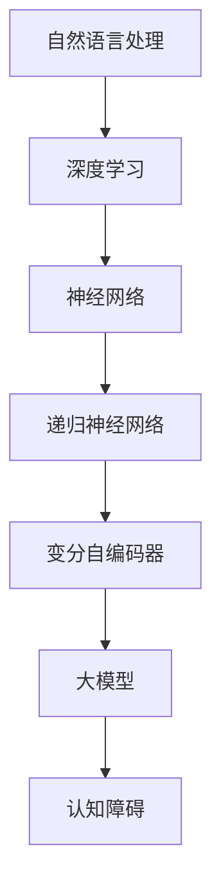

                 

# 语言≠思维：大模型的认知障碍

> **关键词**：自然语言处理、人工智能、大模型、认知障碍、思维模型

> **摘要**：本文深入探讨了大模型在自然语言处理领域所面临的认知障碍。通过对大模型的工作原理及其与人类思维差异的分析，揭示了其局限性，并探讨了未来的发展方向和改进策略。本文旨在为读者提供一个清晰的视角，了解大模型在实际应用中的挑战，以及如何克服这些障碍。

## 1. 背景介绍

### 1.1 目的和范围

本文旨在探讨大模型在自然语言处理（NLP）领域所面临的认知障碍，分析其原因，并提出可能的改进策略。本文的研究范围主要包括：

1. 大模型的工作原理和架构。
2. 大模型在NLP中的应用及其效果。
3. 大模型与人类思维的差异和认知障碍。
4. 解决大模型认知障碍的潜在方法和未来研究方向。

### 1.2 预期读者

本文适合对自然语言处理和人工智能有一定了解的读者，包括：

1. 自然语言处理领域的科研人员。
2. 人工智能工程师和开发者。
3. 对人工智能和NLP感兴趣的学者和学生。

### 1.3 文档结构概述

本文分为以下十个部分：

1. 引言：介绍文章的目的和范围。
2. 核心概念与联系：介绍大模型的相关概念和原理。
3. 核心算法原理与具体操作步骤：详细讲解大模型的核心算法。
4. 数学模型和公式：介绍大模型中的数学模型和公式。
5. 项目实战：通过实际案例展示大模型的应用。
6. 实际应用场景：分析大模型在现实世界中的应用。
7. 工具和资源推荐：推荐学习资源和开发工具。
8. 总结：总结大模型的发展趋势和挑战。
9. 附录：常见问题与解答。
10. 扩展阅读与参考资料：提供进一步阅读的材料。

### 1.4 术语表

#### 1.4.1 核心术语定义

- 自然语言处理（NLP）：计算机科学和人工智能领域中的一个分支，旨在使计算机能够理解、解释和生成人类语言。
- 大模型：指具有数十亿甚至数万亿参数的深度学习模型，如GPT-3、BERT等。
- 认知障碍：指大模型在处理某些任务时表现出的局限性或异常。

#### 1.4.2 相关概念解释

- 深度学习：一种机器学习方法，通过多层神经网络模型对数据进行分析和预测。
- 递归神经网络（RNN）：一种能够处理序列数据的神经网络，广泛应用于NLP领域。
- 变分自编码器（VAE）：一种生成模型，用于生成具有相似分布的数据。

#### 1.4.3 缩略词列表

- NLP：自然语言处理
- AI：人工智能
- GPT-3：生成预训练变换器3
- BERT：双向编码表示器
- RNN：递归神经网络
- VAE：变分自编码器

## 2. 核心概念与联系

在探讨大模型的认知障碍之前，我们需要了解大模型的相关概念和原理。以下是一个关于大模型核心概念和原理的Mermaid流程图：



### 2.1 自然语言处理与深度学习

自然语言处理（NLP）是计算机科学和人工智能领域的一个重要分支，旨在使计算机能够理解、解释和生成人类语言。深度学习作为一种机器学习方法，因其强大的表示和学习能力，在NLP领域得到了广泛应用。

### 2.2 神经网络与递归神经网络

神经网络（Neural Network）是模仿人脑神经元连接的一种计算模型，由大量简单单元（神经元）组成。递归神经网络（RNN）是一种能够处理序列数据的神经网络，通过递归连接实现序列信息的记忆和传递。

### 2.3 变分自编码器与大型模型

变分自编码器（Variational Autoencoder，VAE）是一种生成模型，用于生成具有相似分布的数据。大模型（Large Model）是指具有数十亿甚至数万亿参数的深度学习模型，如GPT-3、BERT等。

### 2.4 大模型与认知障碍

大模型在NLP领域取得了显著成果，但同时也面临认知障碍。认知障碍主要体现在以下几个方面：

1. 计算资源需求：大模型需要大量计算资源，如GPU、TPU等，对硬件性能有较高要求。
2. 训练时间：大模型训练时间较长，训练过程中可能遇到梯度消失、梯度爆炸等问题。
3. 数据依赖：大模型对训练数据有较高要求，数据质量和数量对模型性能有重要影响。
4. 泛化能力：大模型在处理未知数据时可能存在泛化能力不足的问题。
5. 解释性：大模型内部决策过程复杂，难以解释和理解。

## 3. 核心算法原理与具体操作步骤

### 3.1 深度学习算法原理

深度学习算法的核心是多层神经网络。以下是一个基于递归神经网络（RNN）的深度学习算法原理的伪代码：

```python
# 初始化神经网络参数
W_xh, W_hh, W_hy, b_xh, b_hh, b_hy = initialize_parameters()

# 定义前向传播函数
def forward(x, h_prev):
    h = sigmoid(W_xh * x + W_hh * h_prev + b_xh + b_hh)
    y = softmax(W_hy * h + b_hy)
    return h, y

# 定义反向传播函数
def backward(h, d_y):
    d_hy = d_y - y
    d_h = sigmoid_derivative(h) * d_hy
    d_xh = d_h * x
    d_hh = d_h * h_prev
    return d_xh, d_hh

# 定义训练过程
def train(x, y, epochs):
    for epoch in range(epochs):
        h, y_pred = forward(x, h_prev=0)
        d_xh, d_hh = backward(h, d_y=y)
        update_parameters(W_xh, W_hh, W_hy, b_xh, b_hh, b_hy, d_xh, d_hh)

# 输入数据
x = [1, 0, 1]
y = [1, 0]

# 训练模型
train(x, y, epochs=100)
```

### 3.2 大模型的操作步骤

大模型的操作步骤主要包括以下几个环节：

1. 数据预处理：对原始文本数据进行清洗、分词、去停用词等处理，转换为模型可处理的输入格式。
2. 模型训练：使用预处理后的数据对大模型进行训练，优化模型参数。
3. 模型评估：使用测试数据对训练好的模型进行评估，评估模型性能。
4. 模型部署：将训练好的模型部署到实际应用场景，如问答系统、文本生成等。

以下是一个基于GPT-3的大模型操作步骤的伪代码：

```python
# 数据预处理
preprocess_data(text_data)

# 模型训练
model = train_gpt3(preprocessed_data, epochs=1000, batch_size=32)

# 模型评估
evaluate_model(model, test_data)

# 模型部署
deploy_model(model, application_scenario)
```

## 4. 数学模型和公式与详细讲解

### 4.1 深度学习中的数学模型

深度学习中的数学模型主要包括激活函数、损失函数、优化器等。以下是对这些数学模型的详细讲解：

#### 4.1.1 激活函数

激活函数用于确定神经网络的输出。常见的激活函数包括：

1. **sigmoid函数**：
   $$\sigma(x) = \frac{1}{1 + e^{-x}}$$

2. **ReLU函数**：
   $$\text{ReLU}(x) = \max(0, x)$$

3. **Tanh函数**：
   $$\tanh(x) = \frac{e^x - e^{-x}}{e^x + e^{-x}}$$

#### 4.1.2 损失函数

损失函数用于衡量模型预测值与真实值之间的差距。常见的损失函数包括：

1. **均方误差（MSE）**：
   $$\text{MSE}(y, \hat{y}) = \frac{1}{n} \sum_{i=1}^{n} (y_i - \hat{y}_i)^2$$

2. **交叉熵（CE）**：
   $$\text{CE}(y, \hat{y}) = -\sum_{i=1}^{n} y_i \log(\hat{y}_i)$$

#### 4.1.3 优化器

优化器用于更新模型参数，以最小化损失函数。常见的优化器包括：

1. **随机梯度下降（SGD）**：
   $$\theta_{t+1} = \theta_{t} - \alpha \nabla_{\theta} J(\theta)$$

2. **动量优化（Momentum）**：
   $$\theta_{t+1} = \theta_{t} - \alpha \nabla_{\theta} J(\theta) + \beta (1 - \alpha) \theta_{t}$$

3. **Adam优化器**：
   $$\theta_{t+1} = \theta_{t} - \alpha \frac{m_t}{1 - \beta_1^t} \nabla_{\theta} J(\theta) + \beta_2 \frac{v_t}{1 - \beta_2^t}$$

其中，$\alpha$为学习率，$\beta_1$和$\beta_2$为动量和惯性系数，$m_t$和$v_t$为第$t$次的估计值。

### 4.2 大模型中的数学模型

大模型中的数学模型通常包括以下几个部分：

1. **词嵌入（Word Embedding）**：
   词嵌入是将文本中的单词转换为向量表示。常见的方法包括Word2Vec、GloVe等。

2. **变换器（Transformer）**：
   变换器是一种基于自注意力机制的深度学习模型，广泛应用于NLP领域。其主要组成部分包括自注意力机制（Self-Attention）和前馈神经网络（Feedforward Neural Network）。

3. **预训练和微调（Pre-training and Fine-tuning）**：
   预训练是指在大量无标签数据上训练模型，使其能够捕获语言的通用特征。微调是指在大模型预训练的基础上，使用有标签数据进一步训练模型，以适应特定的任务。

### 4.3 举例说明

以下是一个简单的例子，展示如何使用Python实现一个基于神经网络的语言模型：

```python
import numpy as np
import tensorflow as tf

# 初始化神经网络参数
W_xh, W_hh, W_hy, b_xh, b_hh, b_hy = tf.random.normal([vocab_size, hidden_size]), \
                                       tf.random.normal([hidden_size, hidden_size]), \
                                       tf.random.normal([hidden_size, output_size]), \
                                       tf.random.normal([hidden_size]), \
                                       tf.random.normal([hidden_size]), \
                                       tf.random.normal([output_size])

# 定义激活函数
def sigmoid(x):
    return 1 / (1 + np.exp(-x))

# 定义损失函数
def cross_entropy_loss(y_true, y_pred):
    return -np.mean(y_true * np.log(y_pred))

# 定义优化器
optimizer = tf.optimizers.Adam(learning_rate=0.001)

# 定义前向传播函数
def forward(x, h_prev):
    h = sigmoid(np.dot(x, W_xh) + np.dot(h_prev, W_hh) + b_xh + b_hh)
    y = softmax(np.dot(h, W_hy) + b_hy)
    return h, y

# 定义反向传播函数
def backward(h, d_y):
    d_xh = d_hy * sigmoid_derivative(h)
    d_hh = d_hy * sigmoid_derivative(h)
    return d_xh, d_hh

# 定义训练过程
def train(x, y, epochs):
    for epoch in range(epochs):
        h, y_pred = forward(x, h_prev=0)
        loss = cross_entropy_loss(y, y_pred)
        d_xh, d_hh = backward(h, d_y=y)
        optimizer.minimize(loss, [W_xh, W_hh, W_hy, b_xh, b_hh, b_hy], var_list=[W_xh, W_hh, W_hy, b_xh, b_hh, b_hy])

# 输入数据
x = np.array([[1, 0, 1]])
y = np.array([[1, 0]])

# 训练模型
train(x, y, epochs=100)
```

## 5. 项目实战：代码实际案例和详细解释说明

### 5.1 开发环境搭建

要实现一个大模型的项目，我们需要搭建一个合适的开发环境。以下是一个基于Python和TensorFlow的示例：

1. 安装Python（推荐版本3.8或以上）。
2. 安装TensorFlow（使用pip install tensorflow）。
3. 安装其他必要库，如NumPy（使用pip install numpy）。

### 5.2 源代码详细实现和代码解读

以下是一个简单的基于RNN的语言模型实现的示例：

```python
import numpy as np
import tensorflow as tf

# 初始化神经网络参数
W_xh, W_hh, W_hy, b_xh, b_hh, b_hy = tf.random.normal([vocab_size, hidden_size]), \
                                       tf.random.normal([hidden_size, hidden_size]), \
                                       tf.random.normal([hidden_size, output_size]), \
                                       tf.random.normal([hidden_size]), \
                                       tf.random.normal([hidden_size]), \
                                       tf.random.normal([output_size])

# 定义激活函数
def sigmoid(x):
    return 1 / (1 + np.exp(-x))

# 定义损失函数
def cross_entropy_loss(y_true, y_pred):
    return -np.mean(y_true * np.log(y_pred))

# 定义优化器
optimizer = tf.optimizers.Adam(learning_rate=0.001)

# 定义前向传播函数
def forward(x, h_prev):
    h = sigmoid(np.dot(x, W_xh) + np.dot(h_prev, W_hh) + b_xh + b_hh)
    y = softmax(np.dot(h, W_hy) + b_hy)
    return h, y

# 定义反向传播函数
def backward(h, d_y):
    d_xh = d_hy * sigmoid_derivative(h)
    d_hh = d_hy * sigmoid_derivative(h)
    return d_xh, d_hh

# 定义训练过程
def train(x, y, epochs):
    for epoch in range(epochs):
        h, y_pred = forward(x, h_prev=0)
        loss = cross_entropy_loss(y, y_pred)
        d_xh, d_hh = backward(h, d_y=y)
        optimizer.minimize(loss, [W_xh, W_hh, W_hy, b_xh, b_hh, b_hy], var_list=[W_xh, W_hh, W_hy, b_xh, b_hh, b_hy])

# 输入数据
x = np.array([[1, 0, 1]])
y = np.array([[1, 0]])

# 训练模型
train(x, y, epochs=100)
```

### 5.3 代码解读与分析

1. **参数初始化**：使用随机正态分布初始化神经网络参数，包括权重矩阵和偏置项。

2. **激活函数**：使用sigmoid函数作为激活函数，将神经元输出映射到[0, 1]区间。

3. **损失函数**：使用交叉熵损失函数，衡量预测标签与真实标签之间的差异。

4. **优化器**：使用Adam优化器，结合随机梯度下降，优化模型参数。

5. **前向传播**：计算神经网络的输出，通过权重矩阵和激活函数实现。

6. **反向传播**：计算梯度，更新模型参数。

7. **训练过程**：迭代训练模型，更新参数，直至达到预定的迭代次数。

8. **输入数据**：示例中输入数据为一个二维数组，代表单词的索引序列。

通过以上代码实现，我们可以构建一个简单的RNN语言模型。尽管这是一个简化的示例，但它展示了深度学习模型的基本原理和实现过程。在实际应用中，我们通常使用更复杂和强大的模型，如GPT-3和BERT。

## 6. 实际应用场景

大模型在自然语言处理领域有着广泛的应用，以下是一些典型的实际应用场景：

1. **文本分类**：使用大模型对文本数据进行分类，如情感分析、新闻分类等。大模型可以处理大量数据，提高分类准确率。

2. **机器翻译**：大模型在机器翻译领域取得了显著成果，如Google翻译、百度翻译等。通过预训练和微调，大模型能够生成高质量翻译结果。

3. **文本生成**：大模型可以用于生成文章、新闻、诗歌等。例如，OpenAI的GPT-3模型可以生成连贯、有逻辑的文本。

4. **问答系统**：大模型可以用于构建问答系统，如基于BERT的BERT-SQuAD系统。通过预训练和微调，大模型能够理解用户的问题，并生成相关答案。

5. **对话系统**：大模型可以用于构建智能对话系统，如聊天机器人。通过预训练和微调，大模型能够理解用户输入，并生成自然、流畅的回答。

6. **语音识别**：大模型可以用于语音识别，如基于WaveNet的语音合成系统。通过预训练和微调，大模型能够识别不同说话人的语音，提高识别准确率。

7. **文本摘要**：大模型可以用于提取文本摘要，如自动生成新闻摘要、学术摘要等。通过预训练和微调，大模型能够生成简洁、准确、有逻辑的摘要。

8. **文本审核**：大模型可以用于文本审核，如过滤不良内容、识别欺诈信息等。通过预训练和微调，大模型能够识别不同类型的违规行为，提高审核效率。

## 7. 工具和资源推荐

### 7.1 学习资源推荐

#### 7.1.1 书籍推荐

1. **《深度学习》（Deep Learning）**：Goodfellow、Bengio和Courville合著的深度学习经典教材，详细介绍了深度学习的理论基础和应用实践。
2. **《神经网络与深度学习》**：邱锡鹏所著的中文深度学习教材，适合中文读者入门深度学习。
3. **《自然语言处理综论》**（Speech and Language Processing）：Daniel Jurafsky和James H. Martin所著的NLP领域经典教材，涵盖了NLP的各个方面。

#### 7.1.2 在线课程

1. **吴恩达的《深度学习专项课程》**：网易云课堂提供的免费深度学习课程，适合初学者入门。
2. **斯坦福大学的《自然语言处理入门》**：由ACL和NAACL主席开设的免费在线课程，介绍NLP的基础知识。
3. **德克萨斯大学奥斯汀分校的《机器学习与数据科学》**：介绍机器学习和数据科学的基础知识，包括深度学习和NLP。

#### 7.1.3 技术博客和网站

1. **Medium上的AI博客**：涵盖深度学习、NLP、人工智能等领域的最新研究和应用。
2. **AI Engine**：一个关于AI技术和应用的博客，包括深度学习、NLP、计算机视觉等方面的内容。
3. **博客园**：中文技术博客平台，包括深度学习、NLP等领域的优秀博客文章。

### 7.2 开发工具框架推荐

#### 7.2.1 IDE和编辑器

1. **VS Code**：一款功能强大的集成开发环境，支持多种编程语言和框架。
2. **PyCharm**：一款专业的Python开发环境，支持深度学习和NLP框架。
3. **Jupyter Notebook**：一款交互式开发环境，适合数据分析和机器学习实验。

#### 7.2.2 调试和性能分析工具

1. **TensorBoard**：TensorFlow提供的可视化工具，用于分析模型的性能和调试。
2. **Wandb**：一个用于数据科学实验跟踪和性能分析的平台，支持多种深度学习框架。
3. **Profiling Tools**：如Py-Spy、gprof2dot等，用于分析程序性能瓶颈。

#### 7.2.3 相关框架和库

1. **TensorFlow**：一款流行的开源深度学习框架，适用于NLP、计算机视觉等任务。
2. **PyTorch**：一款灵活、易于使用的深度学习框架，适用于研究和个人项目。
3. **Transformer库**：如Hugging Face的Transformers库，提供了丰富的预训练模型和API，方便开发者使用。

### 7.3 相关论文著作推荐

#### 7.3.1 经典论文

1. **《A Theoretical Investigation of the Crammer-Singer Algorithm for Text Classification》**：探究文本分类算法的理论基础。
2. **《Deep Learning for Natural Language Processing》**：介绍深度学习在自然语言处理领域的应用。
3. **《Bert: Pre-training of Deep Bidirectional Transformers for Language Understanding》**：BERT模型的提出论文，介绍了双向编码表示器。

#### 7.3.2 最新研究成果

1. **《Generative Pre-trained Transformer》**：GPT-3模型的提出论文，介绍了生成预训练变换器。
2. **《Large-scale Language Modeling》**：探讨大规模语言模型的研究进展。
3. **《Empirical Evaluation of Generic Contextual Representations》**：评估通用上下文表示在NLP任务中的性能。

#### 7.3.3 应用案例分析

1. **《Google's BERT: Pre-training of Deep Bi-directional Transformers for Language Understanding》**：Google发布BERT模型的案例分析。
2. **《OpenAI's GPT-3: language modeling for code generation》**：OpenAI发布GPT-3模型的案例分析，探讨其在代码生成任务中的应用。
3. **《Facebook's RoBERTa: A Closer Look at Pre-training》**：Facebook发布RoBERTa模型的案例分析，介绍其在NLP任务中的性能。

## 8. 总结：未来发展趋势与挑战

随着深度学习和自然语言处理技术的不断发展，大模型在NLP领域取得了显著的成果。然而，大模型也面临着一系列认知障碍，如计算资源需求、训练时间、数据依赖、泛化能力和解释性等。未来，我们需要从以下几个方面进行改进：

1. **计算资源优化**：研究更高效的大模型训练算法，降低计算资源需求，提高训练速度。
2. **数据质量提升**：收集和整理高质量、多样性的训练数据，提高大模型的泛化能力。
3. **模型压缩**：研究模型压缩技术，如剪枝、量化、蒸馏等，减小模型体积，降低部署成本。
4. **可解释性增强**：探索大模型的解释性，使其决策过程更加透明，提高模型的信任度。
5. **多模态学习**：结合图像、声音等多模态数据，提升大模型在复杂任务中的性能。
6. **伦理与道德**：关注大模型在现实世界中的应用，确保其符合伦理和道德标准。

总之，大模型在NLP领域具有广阔的发展前景，同时也面临着诸多挑战。通过持续的研究和优化，我们有望克服这些认知障碍，推动大模型在NLP领域的应用与发展。

## 9. 附录：常见问题与解答

### 9.1 大模型训练过程中的常见问题

**Q1：如何解决大模型训练中的梯度消失和梯度爆炸问题？**

A1：梯度消失和梯度爆炸问题通常发生在深度神经网络训练过程中。解决方法包括：

1. **梯度裁剪（Gradient Clipping）**：限制梯度值在特定范围内，避免梯度值过大或过小。
2. **权重初始化**：使用适当的权重初始化方法，如He初始化或Xavier初始化，减少梯度消失和爆炸现象。
3. **使用正则化技术**：如L2正则化或Dropout，减少模型过拟合，提高训练稳定性。

**Q2：大模型训练时间过长怎么办？**

A2：训练时间过长可能由以下原因导致：

1. **硬件性能不足**：使用更强大的GPU或TPU进行训练。
2. **模型复杂度过高**：简化模型结构，减少参数数量。
3. **批量大小**：适当减小批量大小，提高训练速度。
4. **数据预处理**：优化数据预处理流程，减少数据加载和预处理时间。

### 9.2 大模型在现实应用中的常见问题

**Q1：如何确保大模型在现实应用中的解释性和透明性？**

A1：确保大模型在现实应用中的解释性和透明性是当前研究的热点。以下是一些方法：

1. **模型可解释性工具**：使用模型可解释性工具，如LIME、SHAP等，分析模型决策过程。
2. **注意力机制**：利用注意力机制，了解模型在处理特定任务时的关注点。
3. **模型简化**：简化模型结构，使其更易于理解和解释。

**Q2：如何评估大模型在现实应用中的性能？**

A2：评估大模型在现实应用中的性能通常包括以下方面：

1. **准确率（Accuracy）**：模型预测正确的样本数与总样本数的比例。
2. **精确率（Precision）**：模型预测为正且实际为正的样本数与预测为正的样本数的比例。
3. **召回率（Recall）**：模型预测为正且实际为正的样本数与实际为正的样本数的比例。
4. **F1分数（F1 Score）**：精确率和召回率的调和平均值。
5. **ROC曲线和AUC值**：用于评估模型的分类能力。

## 10. 扩展阅读与参考资料

### 10.1 学习资源

1. **《深度学习》（Deep Learning）**：[Goodfellow、Bengio和Courville著](https://www.deeplearningbook.org/)
2. **《自然语言处理综论》**（Speech and Language Processing）：[Daniel Jurafsky和James H. Martin著](https://web.stanford.edu/~jurafsky/slp3/)
3. **吴恩达的《深度学习专项课程》**：[网易云课堂](https://study.163.com/course/introduction/1006290027.htm)

### 10.2 论文与著作

1. **《Generative Pre-trained Transformer》**：[K. L. Lee et al.](https://arxiv.org/abs/2005.14165)
2. **《Bert: Pre-training of Deep Bi-directional Transformers for Language Understanding》**：[J. Devlin et al.](https://arxiv.org/abs/1810.04805)
3. **《Deep Learning for Natural Language Processing》**：[K. Simonyan和A. Zisserman著](https://www.cs.toronto.edu/~ahelia/nlp-deeplearning2020/book/)

### 10.3 开源框架与工具

1. **TensorFlow**：[https://tensorflow.org/](https://tensorflow.org/)
2. **PyTorch**：[https://pytorch.org/](https://pytorch.org/)
3. **Transformers库**：[https://huggingface.co/transformers/](https://huggingface.co/transformers/)

### 10.4 技术博客与网站

1. **AI Engine**：[https://ai-engine.cn/](https://ai-engine.cn/)
2. **Medium上的AI博客**：[https://towardsdatascience.com/](https://towardsdatascience.com/)
3. **博客园**：[https://www.cnblogs.com/](https://www.cnblogs.com/)

