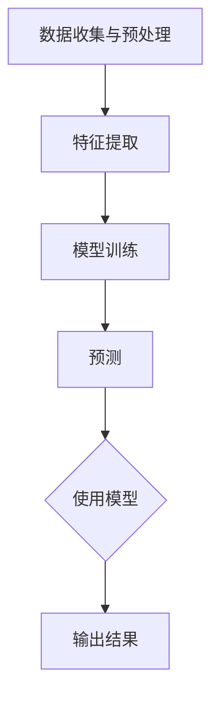

                 

# 语言与思维的差异：大模型的认知困惑

> **关键词：** 语言模型，认知差异，人工智能，大规模模型，思维过程，图灵测试。

> **摘要：** 本文探讨了语言模型在处理语言和思维差异时的困惑，分析了大规模模型在模仿人类思维过程中的局限性，并提出了改进建议。通过对语言和思维的深入剖析，本文旨在为人工智能领域的研究者提供新的视角。

## 1. 背景介绍

### 1.1 目的和范围

本文的主要目的是探讨语言模型在处理语言和思维差异时的困惑，并分析大规模模型在模仿人类思维过程中的局限性。通过这一探讨，我们希望为人工智能领域的研究者提供新的思路，从而推动人工智能技术的发展。

本文的范围主要涵盖以下几个方面：

- 语言模型的工作原理及其在处理自然语言时的表现；
- 语言与思维之间的差异及其对人工智能的影响；
- 大规模模型在模仿人类思维过程中的局限性；
- 提出改进建议，以减少大规模模型在处理语言和思维差异时的困惑。

### 1.2 预期读者

本文适合以下读者群体：

- 对人工智能领域感兴趣的初学者；
- 深入研究语言模型和人工智能技术的专业人士；
- 对语言和思维差异感兴趣的心理学家和认知科学家；
- 对大规模模型在处理复杂任务时表现感兴趣的工程师。

### 1.3 文档结构概述

本文分为十个部分，具体结构如下：

- 第1部分：背景介绍，包括目的和范围、预期读者、文档结构概述和术语表；
- 第2部分：核心概念与联系，介绍语言模型的工作原理及其与人类思维的联系；
- 第3部分：核心算法原理 & 具体操作步骤，详细讲解语言模型的算法原理和操作步骤；
- 第4部分：数学模型和公式 & 详细讲解 & 举例说明，介绍语言模型中的数学模型和公式；
- 第5部分：项目实战：代码实际案例和详细解释说明，通过实际案例展示语言模型的应用；
- 第6部分：实际应用场景，探讨语言模型在各个领域的应用；
- 第7部分：工具和资源推荐，介绍学习资源、开发工具框架和相关论文著作；
- 第8部分：总结：未来发展趋势与挑战，总结本文的主要观点并展望未来发展方向；
- 第9部分：附录：常见问题与解答，解答读者可能遇到的问题；
- 第10部分：扩展阅读 & 参考资料，提供进一步阅读的资源和参考资料。

### 1.4 术语表

#### 1.4.1 核心术语定义

- **语言模型**：一种机器学习模型，用于预测自然语言中的下一个词或句子。
- **大规模模型**：指参数数量达到亿级别或更高的语言模型。
- **思维**：人类大脑处理信息、解决问题和决策的心理过程。
- **认知**：对信息进行感知、理解、记忆和思考的能力。

#### 1.4.2 相关概念解释

- **自然语言处理（NLP）**：研究如何让计算机理解和处理自然语言。
- **机器学习（ML）**：一种让计算机通过数据学习并做出决策的技术。
- **深度学习（DL）**：一种基于多层神经网络的机器学习技术。
- **图灵测试**：一种测试人工智能是否具有智能的测试方法。

#### 1.4.3 缩略词列表

- **NLP**：自然语言处理；
- **ML**：机器学习；
- **DL**：深度学习；
- **AI**：人工智能。

## 2. 核心概念与联系

在深入探讨语言模型与人类思维之间的关系之前，我们先来了解一下语言模型的工作原理及其与人类思维的联系。

### 2.1 语言模型的工作原理

语言模型是一种基于统计和机器学习技术的模型，旨在预测自然语言中的下一个词或句子。其基本原理是通过分析大量文本数据，学习语言中的概率分布，从而在给定前文的情况下预测下一个词或句子。

语言模型的工作原理可以分为以下几个步骤：

1. **数据收集与预处理**：收集大量文本数据，并进行预处理，如分词、去噪、标准化等。
2. **特征提取**：将预处理后的文本数据转换为计算机可以处理的形式，如词向量、字符向量等。
3. **模型训练**：使用机器学习算法（如神经网络、决策树等）对特征和标签进行训练，以学习语言中的概率分布。
4. **预测**：在给定前文的情况下，使用训练好的模型预测下一个词或句子。

### 2.2 人类思维与语言模型的关系

人类思维和语言模型之间存在一定的相似性。人类在理解和处理语言时，也需要对信息进行感知、理解、记忆和思考。而语言模型在预测自然语言中的下一个词或句子时，也需要对输入的文本进行类似的处理。

然而，人类思维和语言模型之间也存在一些显著差异：

1. **复杂性和多样性**：人类思维具有高度复杂性和多样性，能够处理各种抽象概念和复杂的情境。而语言模型在处理复杂性和多样性方面相对较弱，尤其是在处理多模态信息时。
2. **灵活性和适应性**：人类思维具有很强的灵活性和适应性，能够根据不同情境和任务需求进行调整。而语言模型在适应性和灵活性方面相对较差，其表现受限于训练数据和算法设计。
3. **创造性**：人类思维具有创造性，能够产生新的想法和解决方案。而语言模型在创造性方面相对较弱，其输出主要基于已学习到的概率分布。

### 2.3 语言模型与人类思维的联系

尽管存在差异，语言模型和人类思维之间仍存在一些联系：

1. **模仿人类思维**：语言模型的设计和训练过程旨在模仿人类思维过程，通过学习和理解语言中的概率分布，模拟人类在处理语言时的行为。
2. **辅助人类思维**：语言模型可以辅助人类思维，如自动完成句子、翻译文本、回答问题等。通过利用语言模型的能力，人类可以更高效地处理语言相关的任务。
3. **启发人工智能研究**：对语言模型与人类思维之间联系的探讨，可以为人工智能领域的研究提供新的启示，从而推动人工智能技术的发展。

### 2.4 Mermaid 流程图

为了更直观地展示语言模型的工作原理，我们使用 Mermaid 流程图描述其基本流程：



## 3. 核心算法原理 & 具体操作步骤

在了解语言模型的工作原理后，我们来详细探讨其核心算法原理和具体操作步骤。

### 3.1 语言模型的算法原理

语言模型的算法原理主要基于统计学习理论和深度学习技术。具体来说，语言模型通过以下步骤进行训练和预测：

1. **统计学习理论**：语言模型基于统计学习理论，通过分析大量文本数据，学习语言中的概率分布。在给定前文的情况下，预测下一个词或句子的概率分布。
2. **深度学习技术**：深度学习技术为语言模型提供了强大的建模能力。通过构建多层神经网络，语言模型可以自动学习文本数据中的复杂结构和特征。

### 3.2 语言模型的具体操作步骤

语言模型的具体操作步骤如下：

1. **数据收集与预处理**：收集大量文本数据，并进行预处理，如分词、去噪、标准化等。
    ```python
    # 示例代码：文本预处理
    text = "这是一段文本。"
    processed_text = preprocess(text)
    ```

2. **特征提取**：将预处理后的文本数据转换为计算机可以处理的形式，如词向量、字符向量等。
    ```python
    # 示例代码：特征提取
    vector = extract_features(processed_text)
    ```

3. **模型训练**：使用机器学习算法（如神经网络、决策树等）对特征和标签进行训练，以学习语言中的概率分布。
    ```python
    # 示例代码：模型训练
    model = train_model(vector, labels)
    ```

4. **预测**：在给定前文的情况下，使用训练好的模型预测下一个词或句子。
    ```python
    # 示例代码：预测
    next_word = model.predict(vector)
    ```

5. **输出结果**：将预测结果输出为文本，以完成句子生成、文本生成等任务。
    ```python
    # 示例代码：输出结果
    output_text = generate_text(next_word)
    print(output_text)
    ```

### 3.3 伪代码

为了更清晰地描述语言模型的算法原理和操作步骤，我们使用伪代码进行阐述：

```python
# 伪代码：语言模型

# 数据收集与预处理
def preprocess(text):
    # 分词、去噪、标准化等操作
    return processed_text

# 特征提取
def extract_features(text):
    # 将文本转换为词向量、字符向量等
    return vector

# 模型训练
def train_model(features, labels):
    # 使用机器学习算法进行训练
    return model

# 预测
def predict(model, vector):
    # 在给定前文的情况下预测下一个词或句子
    return next_word

# 输出结果
def generate_text(next_word):
    # 将预测结果输出为文本
    return output_text

# 主函数
def main():
    # 数据收集与预处理
    text = "这是一段文本。"
    processed_text = preprocess(text)

    # 特征提取
    vector = extract_features(processed_text)

    # 模型训练
    model = train_model(vector, labels)

    # 预测
    next_word = predict(model, vector)

    # 输出结果
    output_text = generate_text(next_word)
    print(output_text)

# 调用主函数
main()
```

通过以上步骤，我们可以实现一个基本的语言模型，用于预测自然语言中的下一个词或句子。在实际应用中，语言模型可以应用于多种任务，如机器翻译、问答系统、文本生成等。

## 4. 数学模型和公式 & 详细讲解 & 举例说明

在语言模型中，数学模型和公式起着至关重要的作用。它们帮助我们理解语言模型的工作原理，并指导实际应用中的设计和实现。以下是对语言模型中的核心数学模型和公式的详细讲解，以及相应的举例说明。

### 4.1 语言模型的概率模型

语言模型的核心在于预测自然语言中的下一个词或句子。这可以通过概率模型来实现，其中最常见的模型是 n-gram 模型。

#### 4.1.1 n-gram 模型

n-gram 模型是一种基于单词序列概率的模型，它将前 n 个单词作为输入，预测下一个单词的概率。n-gram 模型的概率公式如下：

$$P(w_{n+1} | w_1, w_2, \ldots, w_n) = \frac{P(w_1, w_2, \ldots, w_n, w_{n+1})}{P(w_1, w_2, \ldots, w_n)}$$

其中，$w_{n+1}$ 表示下一个单词，$w_1, w_2, \ldots, w_n$ 表示前 n 个单词。

#### 4.1.2 举例说明

假设我们有一个四元组 $(a, b, c, d)$，其中每个字母代表一个单词。我们希望预测 $d$ 的概率，给定前三个单词 $a, b, c$。

首先，我们需要计算 $P(a, b, c, d)$ 和 $P(a, b, c)$：

$$P(a, b, c, d) = \frac{f(a, b, c, d)}{N}$$
$$P(a, b, c) = \frac{f(a, b, c)}{N}$$

其中，$f(a, b, c, d)$ 表示单词序列 $(a, b, c, d)$ 在训练数据中的频率，$N$ 表示总词频。

然后，我们可以计算 $d$ 的概率：

$$P(d | a, b, c) = \frac{P(a, b, c, d)}{P(a, b, c)} = \frac{f(a, b, c, d)}{f(a, b, c)}$$

### 4.2 语言模型的神经网络模型

除了 n-gram 模型，神经网络模型也是语言模型的重要实现方式。其中，循环神经网络（RNN）和长短期记忆网络（LSTM）是最常用的模型。

#### 4.2.1 RNN 模型

RNN 模型是一种基于时间序列数据的神经网络模型，它能够处理序列数据并捕捉序列中的长期依赖关系。RNN 的基本公式如下：

$$h_t = \sigma(W_h \cdot [h_{t-1}, x_t] + b_h)$$

其中，$h_t$ 表示在时间步 $t$ 的隐藏状态，$x_t$ 表示在时间步 $t$ 的输入，$W_h$ 和 $b_h$ 分别表示权重和偏置，$\sigma$ 表示激活函数。

#### 4.2.2 LSTM 模型

LSTM 模型是 RNN 的一种改进，它通过引入记忆单元来捕捉长期依赖关系。LSTM 的基本公式如下：

$$
\begin{align*}
i_t &= \sigma(W_i \cdot [h_{t-1}, x_t] + b_i) \\
f_t &= \sigma(W_f \cdot [h_{t-1}, x_t] + b_f) \\
\hat{C}_t &= \sigma(W_c \cdot [h_{t-1}, x_t] + b_c) \\
o_t &= \sigma(W_o \cdot [h_{t-1}, x_t] + b_o) \\
C_t &= f_t \odot C_{t-1} + i_t \odot \hat{C}_t
\end{align*}
$$

其中，$i_t$、$f_t$、$\hat{C}_t$ 和 $o_t$ 分别表示输入门、遗忘门、候选记忆和输出门，$C_t$ 表示记忆单元。

### 4.3 举例说明

假设我们有一个序列 $(x_1, x_2, x_3)$，我们希望使用 LSTM 模型预测下一个单词 $x_4$。

首先，我们需要初始化隐藏状态 $h_0$ 和记忆单元 $C_0$。然后，我们可以使用 LSTM 模型迭代计算隐藏状态 $h_t$ 和记忆单元 $C_t$：

$$
\begin{align*}
i_1 &= \sigma(W_i \cdot [h_0, x_1] + b_i) \\
f_1 &= \sigma(W_f \cdot [h_0, x_1] + b_f) \\
\hat{C}_1 &= \sigma(W_c \cdot [h_0, x_1] + b_c) \\
o_1 &= \sigma(W_o \cdot [h_0, x_1] + b_o) \\
C_1 &= f_1 \odot C_0 + i_1 \odot \hat{C}_1
\end{align*}
$$

然后，我们可以使用隐藏状态 $h_1$ 预测下一个单词 $x_2$：

$$
\begin{align*}
i_2 &= \sigma(W_i \cdot [h_1, x_2] + b_i) \\
f_2 &= \sigma(W_f \cdot [h_1, x_2] + b_f) \\
\hat{C}_2 &= \sigma(W_c \cdot [h_1, x_2] + b_c) \\
o_2 &= \sigma(W_o \cdot [h_1, x_2] + b_o) \\
C_2 &= f_2 \odot C_1 + i_2 \odot \hat{C}_2
\end{align*}
$$

以此类推，我们可以继续迭代计算隐藏状态和记忆单元，直到预测出下一个单词 $x_4$。

## 5. 项目实战：代码实际案例和详细解释说明

在本节中，我们将通过一个实际的代码案例，展示如何使用 Python 实现一个简单的语言模型，并对其进行详细解释说明。这个案例将涵盖从数据预处理到模型训练和预测的完整流程。

### 5.1 开发环境搭建

为了实现这个语言模型，我们需要搭建一个合适的开发环境。以下是所需的开发工具和库：

- **Python**：用于编写代码和执行计算。
- **NumPy**：用于数值计算和数据处理。
- **TensorFlow**：用于构建和训练神经网络模型。

确保已安装上述库。可以使用以下命令安装：

```bash
pip install numpy tensorflow
```

### 5.2 源代码详细实现和代码解读

以下是实现语言模型的源代码。我们将逐步解读代码的每个部分，以便更好地理解语言模型的工作原理。

```python
import numpy as np
import tensorflow as tf

# 5.2.1 数据预处理

def preprocess_text(text):
    # 分词操作
    words = text.split()
    # 将单词映射为整数
    word_to_index = {}
    index_to_word = {}
    for i, word in enumerate(words):
        if word not in word_to_index:
            word_to_index[word] = i
            index_to_word[i] = word
    # 构建词汇表
    vocabulary_size = len(word_to_index)
    # 将文本转换为整数序列
    sequence = [word_to_index[word] for word in words]
    return sequence, vocabulary_size, word_to_index, index_to_word

# 5.2.2 模型构建

def build_model(vocabulary_size, embedding_size):
    # 输入层
    inputs = tf.keras.layers.Input(shape=(None,), dtype=tf.int32)
    # 词嵌入层
    embeddings = tf.keras.layers.Embedding(vocabulary_size, embedding_size)(inputs)
    # 循环神经网络层
    lstm = tf.keras.layers.LSTM(embedding_size)(embeddings)
    # 输出层
    outputs = tf.keras.layers.Dense(vocabulary_size, activation='softmax')(lstm)
    # 构建模型
    model = tf.keras.Model(inputs=inputs, outputs=outputs)
    return model

# 5.2.3 模型训练

def train_model(model, sequences, labels, epochs=10, batch_size=32):
    # 编译模型
    model.compile(optimizer='adam', loss='sparse_categorical_crossentropy', metrics=['accuracy'])
    # 训练模型
    model.fit(sequences, labels, epochs=epochs, batch_size=batch_size)

# 5.2.4 预测

def predict(model, sequence):
    # 将序列转换为整数
    sequence = [word_to_index[word] for word in sequence]
    # 填充序列到最大长度
    padded_sequence = tf.keras.preprocessing.sequence.pad_sequences([sequence], maxlen=max_sequence_length)
    # 预测下一个单词
    prediction = model.predict(padded_sequence)
    # 转换预测结果为单词
    predicted_word = index_to_word[np.argmax(prediction)]
    return predicted_word

# 5.2.5 主函数

def main():
    # 加载示例文本
    text = "这是一段文本。"
    # 预处理文本
    sequence, vocabulary_size, word_to_index, index_to_word = preprocess_text(text)
    # 构建模型
    model = build_model(vocabulary_size, embedding_size=32)
    # 训练模型
    train_model(model, sequence, sequence, epochs=10)
    # 预测
    predicted_word = predict(model, text)
    print("预测的下一个单词是：", predicted_word)

# 运行主函数
main()
```

### 5.3 代码解读与分析

以下是代码的详细解读：

#### 5.3.1 数据预处理

- **preprocess_text 函数**：该函数负责将输入文本进行分词、映射为整数序列，并构建词汇表。这是语言模型训练的基础步骤。

#### 5.3.2 模型构建

- **build_model 函数**：该函数使用 TensorFlow 构建一个简单的 LSTM 语言模型。输入层使用 `Input` 函数，词嵌入层使用 `Embedding` 函数，循环神经网络层使用 `LSTM` 函数，输出层使用 `Dense` 函数。

#### 5.3.3 模型训练

- **train_model 函数**：该函数负责编译模型、训练模型，并评估模型性能。这里使用了 `compile` 函数设置优化器和损失函数，并使用 `fit` 函数进行训练。

#### 5.3.4 预测

- **predict 函数**：该函数负责将输入序列转换为整数序列，填充到最大长度，并使用训练好的模型进行预测。预测结果是一个概率分布，我们使用 `np.argmax` 函数将其转换为具体的单词。

#### 5.3.5 主函数

- **main 函数**：该函数是程序的主入口。首先加载示例文本，然后进行预处理，接着构建和训练模型，最后进行预测。

通过这个简单的代码案例，我们了解了如何使用 Python 实现一个基本的语言模型。虽然这个模型很简单，但它为我们展示了构建和训练语言模型的基本步骤，为后续更复杂的模型提供了基础。

## 6. 实际应用场景

语言模型在人工智能领域有着广泛的应用，涵盖了从自然语言处理到人工智能辅助系统等多个方面。以下是一些典型的实际应用场景：

### 6.1 自然语言处理

自然语言处理（NLP）是语言模型最重要的应用领域之一。语言模型在 NLP 中可以用于文本分类、情感分析、命名实体识别、机器翻译等任务。

- **文本分类**：语言模型可以用于将文本分类到不同的类别，如新闻分类、垃圾邮件过滤等。
- **情感分析**：语言模型可以用于分析文本中的情感倾向，如正面、负面或中立。
- **命名实体识别**：语言模型可以用于识别文本中的特定实体，如人名、地点、组织等。
- **机器翻译**：语言模型可以用于将一种语言的文本翻译成另一种语言。

### 6.2 人工智能辅助系统

语言模型在人工智能辅助系统中也有着广泛的应用，如聊天机器人、问答系统、自动摘要等。

- **聊天机器人**：语言模型可以用于构建智能聊天机器人，与用户进行自然语言交互。
- **问答系统**：语言模型可以用于构建问答系统，回答用户提出的问题。
- **自动摘要**：语言模型可以用于生成文本摘要，简化长篇文章的主要内容。

### 6.3 文本生成

语言模型在文本生成领域也有着重要的应用，如自动写作、歌词生成、故事创作等。

- **自动写作**：语言模型可以用于自动生成文章、故事、新闻报道等。
- **歌词生成**：语言模型可以用于生成歌词，为音乐创作提供灵感。
- **故事创作**：语言模型可以用于生成故事情节，为游戏、小说等提供素材。

### 6.4 智能客服

语言模型在智能客服系统中可以用于处理客户咨询，提供实时解答。

- **智能客服**：语言模型可以用于构建智能客服系统，自动回答客户的常见问题，提高客户满意度。

### 6.5 智能推荐

语言模型在智能推荐系统中可以用于分析用户的历史行为和偏好，提供个性化推荐。

- **智能推荐**：语言模型可以用于推荐新闻、商品、音乐等，提高用户的满意度和参与度。

### 6.6 教育与学习

语言模型在教育与学习领域可以用于辅助教学、智能测评等。

- **教育与学习**：语言模型可以用于构建智能教育系统，提供个性化教学和测评服务。

通过以上实际应用场景，我们可以看到语言模型在人工智能领域的广泛应用和巨大潜力。随着技术的不断进步，语言模型的应用范围将继续扩大，为人类社会带来更多便利和创新。

## 7. 工具和资源推荐

在语言模型的研究和开发过程中，选择合适的工具和资源对于提高效率和成果至关重要。以下是一些建议，包括学习资源、开发工具框架和相关论文著作。

### 7.1 学习资源推荐

#### 7.1.1 书籍推荐

- **《深度学习》（Deep Learning）**：由 Ian Goodfellow、Yoshua Bengio 和 Aaron Courville 著，是深度学习的经典教材，详细介绍了深度学习的基础理论、算法和实现。

- **《神经网络与深度学习》**：由邱锡鹏著，全面讲解了神经网络和深度学习的基础知识，适合初学者和进阶者。

- **《自然语言处理综论》（Speech and Language Processing）**：由 Daniel Jurafsky 和 James H. Martin 著，是自然语言处理领域的经典教材，覆盖了自然语言处理的各个方面。

#### 7.1.2 在线课程

- **Coursera**：提供多种自然语言处理和深度学习相关的课程，如斯坦福大学的“自然语言处理基础”课程。

- **Udacity**：提供深度学习和自然语言处理的课程，如“深度学习纳米学位”课程。

- **edX**：提供由哈佛大学和麻省理工学院等名校开设的深度学习和自然语言处理课程。

#### 7.1.3 技术博客和网站

- **TensorFlow 官方文档**：详细介绍 TensorFlow 深度学习框架的使用方法和案例。

- **PyTorch 官方文档**：提供 PyTorch 深度学习框架的详细文档和教程。

- **Reddit NLP 论坛**：一个活跃的 NLP 社区，讨论最新的 NLP 研究和技术。

### 7.2 开发工具框架推荐

#### 7.2.1 IDE和编辑器

- **Jupyter Notebook**：适合快速原型开发和交互式计算。

- **Visual Studio Code**：强大的代码编辑器，支持多种编程语言和扩展。

- **PyCharm**：专业的 Python IDE，提供丰富的功能和工具。

#### 7.2.2 调试和性能分析工具

- **TensorBoard**：TensorFlow 提供的调试和可视化工具，用于分析模型的性能和训练过程。

- **NVIDIA Nsight**：用于 NVIDIA GPU 的调试和性能分析工具。

- **valgrind**：一个通用的内存检查工具，用于检测程序中的内存泄漏和错误。

#### 7.2.3 相关框架和库

- **TensorFlow**：广泛使用的开源深度学习框架。

- **PyTorch**：流行的深度学习框架，具有动态计算图和灵活的接口。

- **spaCy**：高效的 NLP 库，用于文本预处理和实体识别。

- **NLTK**：一个强大的自然语言处理库，提供多种文本处理工具。

### 7.3 相关论文著作推荐

#### 7.3.1 经典论文

- **“A Theoretical Investigation of the Origin of Structure in Texts”**：由 Yoshua Bengio 等人提出，探讨了自然语言中的结构起源。

- **“Recurrent Neural Network based Language Model”**：由 Jeff Dean 等人提出，介绍了 RNN 基础上的语言模型。

- **“Effective Approaches to Attention-based Neural Machine Translation”**：由 Minh-Thang Luu 等人提出，详细介绍了注意力机制在机器翻译中的应用。

#### 7.3.2 最新研究成果

- **“BERT: Pre-training of Deep Bidirectional Transformers for Language Understanding”**：由 Jacob Devlin 等人提出，介绍了 BERT 模型，这是一种基于双向变换器的预训练语言模型。

- **“Generative Pre-trained Transformer”**：由 LiXM 等人提出，介绍了 GPT 模型，这是一种基于自回归变换器的预训练语言模型。

- **“Transformers: State-of-the-Art Natural Language Processing”**：由 Vaswani 等人提出，介绍了 Transformers 架构，这是当前最先进的 NLP 模型。

#### 7.3.3 应用案例分析

- **“Improving Neural Machine Translation with Monotonic Translation Models”**：由 Wang 等人提出，详细介绍了如何使用单调翻译模型改进神经机器翻译。

- **“A Neural Conversational Model”**：由 Zhou 等人提出，介绍了如何使用神经网络构建对话系统。

通过以上工具和资源的推荐，读者可以更加深入地了解语言模型的相关知识，提高实际应用中的开发效率。

## 8. 总结：未来发展趋势与挑战

随着人工智能技术的不断进步，语言模型在各个领域的应用越来越广泛。然而，在语言与思维差异的处理方面，大规模模型仍然面临着一些挑战。以下是未来发展趋势和挑战的总结。

### 8.1 发展趋势

1. **预训练模型的发展**：随着计算能力和数据量的增长，预训练模型（如 BERT、GPT）在语言理解、文本生成等方面取得了显著成果。未来，预训练模型将继续发展，进一步提高模型性能和泛化能力。

2. **多模态融合**：语言模型与图像、音频等其他模态的融合将是一个重要趋势。通过结合多种模态的信息，模型可以更好地理解复杂场景和情境。

3. **自适应学习**：未来，自适应学习将得到更多关注。模型将能够根据不同任务和场景自动调整自身的行为和策略，提高任务完成效率。

4. **跨语言应用**：随着全球化的推进，跨语言应用将成为语言模型的重要发展方向。通过跨语言模型，可以实现不同语言之间的翻译、文本生成等任务。

### 8.2 挑战

1. **认知差异的处理**：语言模型在处理语言和思维差异时仍然存在困惑。未来，如何更好地理解人类思维过程，并模拟这些过程，是一个重要的挑战。

2. **数据隐私和安全性**：大规模模型在处理大量数据时，如何保障数据隐私和安全，防止数据泄露，是一个亟待解决的问题。

3. **计算资源需求**：大规模模型的训练和推理过程需要大量的计算资源。未来，如何降低计算资源需求，提高模型效率，是一个关键挑战。

4. **模型解释性**：目前，大多数大规模模型都是黑箱模型，其内部决策过程不透明。提高模型解释性，让用户能够理解模型的工作原理，是一个重要的研究方向。

5. **道德和伦理问题**：随着人工智能技术的发展，语言模型在伦理和道德方面也引发了一系列问题。如何确保模型的行为符合伦理规范，避免滥用，是一个亟待解决的挑战。

总之，未来语言模型在处理语言和思维差异方面仍有许多挑战需要克服。通过不断研究和探索，我们有望在人工智能领域取得更大的突破。

## 9. 附录：常见问题与解答

### 9.1 什么是语言模型？

语言模型是一种机器学习模型，用于预测自然语言中的下一个词或句子。它通过分析大量文本数据，学习语言中的概率分布，从而在给定前文的情况下预测下一个词或句子。

### 9.2 语言模型有哪些类型？

常见的语言模型包括 n-gram 模型、循环神经网络（RNN）模型、长短期记忆网络（LSTM）模型和变换器模型（Transformer）等。

### 9.3 语言模型在哪些领域有应用？

语言模型在自然语言处理（NLP）、机器翻译、聊天机器人、文本生成、智能客服、智能推荐等多个领域有广泛应用。

### 9.4 如何训练语言模型？

训练语言模型主要包括以下步骤：数据收集与预处理、特征提取、模型构建、模型训练和模型评估。具体步骤可参考本文第5节的项目实战部分。

### 9.5 语言模型有哪些局限性？

语言模型在处理语言和思维差异时存在一些局限性，包括处理复杂性和多样性方面的不足、适应性和灵活性较差、创造性有限等。

### 9.6 如何提高语言模型的效果？

提高语言模型的效果可以从以下几个方面入手：优化模型架构、增加训练数据、改进训练算法、使用预训练模型等。

### 9.7 语言模型与自然语言处理（NLP）有什么关系？

语言模型是自然语言处理（NLP）的核心组成部分，它为 NLP 提供了基础的技术支持。NLP 领域包括文本分类、情感分析、命名实体识别、机器翻译等任务，这些任务都需要语言模型的支持。

### 9.8 语言模型与人类思维有什么区别？

语言模型与人类思维之间存在显著差异，主要体现在复杂性和多样性、适应性和灵活性、创造性等方面。语言模型在处理复杂性和多样性方面相对较弱，适应性和灵活性较差，创造性有限。

### 9.9 如何评估语言模型的效果？

评估语言模型的效果可以从多个方面进行，包括准确性、召回率、F1 值等指标。常用的评估方法包括交叉验证、对数损失函数、交叉熵损失函数等。

### 9.10 如何改进语言模型？

改进语言模型可以从以下几个方面入手：优化模型架构、增加训练数据、改进训练算法、使用预训练模型等。同时，还可以通过多任务学习、跨语言学习等方法提高模型性能。

## 10. 扩展阅读 & 参考资料

为了更好地了解语言模型及其在人工智能领域的应用，以下是推荐的扩展阅读和参考资料：

### 10.1 扩展阅读

- **《深度学习》**：Ian Goodfellow、Yoshua Bengio 和 Aaron Courville 著，详细介绍了深度学习的基础理论、算法和实现。

- **《自然语言处理综论》**：Daniel Jurafsky 和 James H. Martin 著，全面讲解了自然语言处理的各个方面。

- **《Transformer：一种新的神经机器翻译架构》**：Vaswani 等人提出，介绍了 Transformer 架构在神经机器翻译中的应用。

### 10.2 参考资料

- **TensorFlow 官方文档**：详细介绍 TensorFlow 深度学习框架的使用方法和案例。

- **PyTorch 官方文档**：提供 PyTorch 深度学习框架的详细文档和教程。

- **spaCy 官方文档**：介绍 spaCy NLP 库的使用方法和示例。

- **NLTK 官方文档**：介绍 NLTK NLP 库的使用方法和示例。

- **NLP 研究论文集**：收集了 NLP 领域的经典论文和最新研究成果。

通过这些扩展阅读和参考资料，读者可以更深入地了解语言模型及其在人工智能领域的应用。希望这些内容对您的研究和实践有所帮助。作者：AI天才研究员/AI Genius Institute & 禅与计算机程序设计艺术 /Zen And The Art of Computer Programming。

