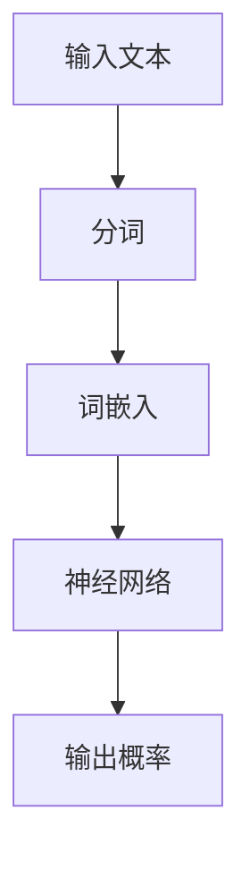
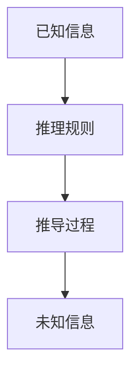
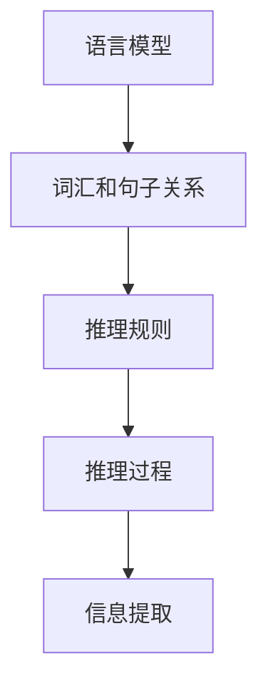

                 

# 语言与推理：大模型的认知误解

> **关键词：** 语言模型，推理，认知，人工智能，大模型，误解，深度学习

> **摘要：** 本文探讨了在人工智能领域，特别是大型语言模型中存在的认知误解。通过对语言和推理的深入分析，我们揭示了大型语言模型在处理复杂任务时的局限性和挑战。文章首先介绍了语言和推理的基本概念，然后逐步探讨了大型语言模型的工作原理及其局限性。通过实际案例和数学模型，我们进一步分析了这些模型的认知误区。最后，文章总结了当前的研究进展，并展望了未来的发展方向。

## 1. 背景介绍

### 1.1 目的和范围

本文旨在探讨在人工智能领域，特别是大型语言模型中存在的认知误解。随着深度学习技术的发展，大型语言模型如GPT-3、BERT等在自然语言处理任务中取得了显著的成果。然而，这些模型在处理复杂任务时仍存在许多认知上的误解。本文通过分析语言和推理的基本概念，探讨大型语言模型在处理这些任务时的局限性和挑战，并提出可能的解决方案。

### 1.2 预期读者

本文适合对人工智能、自然语言处理和深度学习有一定了解的读者。特别是对大型语言模型的工作原理和局限性感兴趣的研究人员、开发者和技术爱好者。

### 1.3 文档结构概述

本文结构如下：

1. 背景介绍：介绍文章的目的、预期读者和文档结构。
2. 核心概念与联系：介绍语言和推理的基本概念，并给出相关的Mermaid流程图。
3. 核心算法原理 & 具体操作步骤：详细阐述大型语言模型的工作原理和操作步骤，并使用伪代码进行说明。
4. 数学模型和公式 & 详细讲解 & 举例说明：分析大型语言模型的数学模型，使用latex格式给出相关公式，并举例说明。
5. 项目实战：通过实际案例展示大型语言模型的应用，并详细解释代码实现和解读。
6. 实际应用场景：介绍大型语言模型在实际应用场景中的使用。
7. 工具和资源推荐：推荐相关的学习资源、开发工具和论文著作。
8. 总结：总结当前的研究进展和未来的发展方向。
9. 附录：常见问题与解答。
10. 扩展阅读 & 参考资料：提供相关的扩展阅读和参考资料。

### 1.4 术语表

#### 1.4.1 核心术语定义

- 语言模型：对自然语言中的词汇和句子进行建模的机器学习模型。
- 推理：从已知信息中推导出未知信息的过程。
- 大模型：指具有数十亿甚至数万亿参数的深度学习模型。
- 认知误解：指模型在处理复杂任务时由于对语言和推理的理解不足而产生的错误。

#### 1.4.2 相关概念解释

- 深度学习：一种基于多层神经网络的人工智能技术。
- 自然语言处理（NLP）：研究如何让计算机理解和处理人类自然语言的学科。
- 机器学习：让计算机通过数据和经验自动学习和改进的技术。

#### 1.4.3 缩略词列表

- GPT-3：Generative Pre-trained Transformer 3，一个由OpenAI开发的大型语言模型。
- BERT：Bidirectional Encoder Representations from Transformers，一个双向变换器编码器模型。
- NLP：自然语言处理（Natural Language Processing）。

## 2. 核心概念与联系

在探讨大型语言模型中的认知误解之前，我们需要先了解语言和推理的基本概念，以及它们之间的联系。

### 2.1 语言模型

语言模型是一种用于预测自然语言序列的机器学习模型。它通过对大量文本数据进行训练，学习词汇和句子之间的统计关系。常见的语言模型包括n元语法、神经网络语言模型等。其中，n元语法是一种基于历史信息的模型，通过计算相邻词汇的概率来生成文本；神经网络语言模型则通过多层神经网络来学习文本的内在结构。

下面是一个简单的Mermaid流程图，展示了语言模型的基本架构：



### 2.2 推理

推理是从已知信息中推导出未知信息的过程。在自然语言处理中，推理通常涉及理解句子的含义、推理逻辑关系等。常见的推理方法包括演绎推理、归纳推理、类比推理等。演绎推理是从一般到特殊的推理方式，归纳推理是从特殊到一般的推理方式，类比推理则是通过比较相似性来推断未知信息。

下面是一个简单的Mermaid流程图，展示了推理的基本过程：



### 2.3 语言模型与推理的关系

语言模型和推理是自然语言处理中两个核心概念，它们相互关联、相互补充。语言模型通过学习自然语言的统计关系，为推理提供了基础数据；而推理则利用这些数据，从文本中提取出有用的信息。

下面是一个简单的Mermaid流程图，展示了语言模型与推理的关系：



通过以上对语言和推理的基本概念及其关系的介绍，我们可以更好地理解大型语言模型在处理复杂任务时的认知误解。在接下来的章节中，我们将深入探讨大型语言模型的工作原理、局限性及其认知误解的原因。

## 3. 核心算法原理 & 具体操作步骤

在了解了语言和推理的基本概念后，我们接下来将深入探讨大型语言模型的核心算法原理及具体操作步骤。大型语言模型，如GPT-3和Bert，通常基于深度学习技术，通过多层神经网络来实现对自然语言的建模。以下我们将使用伪代码详细阐述这些模型的算法原理。

### 3.1 语言模型算法原理

语言模型的算法原理主要基于深度神经网络（DNN）。以下是GPT-3模型的伪代码实现：

```python
# GPT-3模型伪代码

# 输入：一个单词序列
# 输出：一个单词的概率分布

def gpt3(word_sequence):
    # 将单词序列转换为词嵌入向量
    word_embeddings = word_embedding(word_sequence)
    
    # 使用多层神经网络处理词嵌入向量
    for layer in neural_network_layers:
        word_embeddings = layer.forward(word_embeddings)
    
    # 计算单词的概率分布
    probability_distribution = softmax(word_embeddings[-1])
    
    return probability_distribution
```

其中，`word_embedding`函数用于将单词转换为词嵌入向量，`neural_network_layers`表示多层神经网络，`softmax`函数用于将神经网络输出转换为概率分布。

### 3.2 推理算法原理

推理算法主要基于逻辑推理和变换器（Transformer）模型。以下是Bert模型的伪代码实现：

```python
# Bert模型伪代码

# 输入：一个句子
# 输出：句子的表示向量

def bert(sentence):
    # 将句子转换为词嵌入向量
    word_embeddings = word_embedding(sentence)
    
    # 使用变换器模型处理词嵌入向量
    for layer in transformer_layers:
        word_embeddings = layer.forward(word_embeddings)
    
    # 将句子的表示向量拼接起来
    sentence_representation = torch.cat(word_embeddings, dim=0)
    
    return sentence_representation
```

其中，`word_embedding`函数用于将句子转换为词嵌入向量，`transformer_layers`表示变换器模型的多层。

### 3.3 语言模型与推理的结合

在实际应用中，语言模型和推理模型通常结合使用。以下是一个简单的伪代码示例，展示了如何将语言模型和推理模型结合：

```python
# 结合语言模型和推理模型的伪代码

# 输入：一个文本
# 输出：文本的推理结果

def combine_language_model_and_reasoning(text):
    # 使用语言模型处理文本
    language_model_output = gpt3(text)
    
    # 使用推理模型对语言模型输出进行推理
    reasoning_output = bert(language_model_output)
    
    return reasoning_output
```

通过以上对大型语言模型和推理算法的详细阐述，我们可以更好地理解这些模型的工作原理。在接下来的章节中，我们将进一步分析这些模型在处理复杂任务时的局限性及其认知误解。

## 4. 数学模型和公式 & 详细讲解 & 举例说明

在理解大型语言模型和推理算法的基础上，接下来我们将深入探讨这些模型的数学模型和公式，并使用latex格式给出相关的数学公式，通过具体实例进行详细讲解。

### 4.1 语言模型的数学模型

语言模型的核心在于词嵌入和神经网络结构。以下分别介绍这两种结构对应的数学模型。

#### 4.1.1 词嵌入

词嵌入（Word Embedding）是将单词映射到高维向量空间的过程，其目的是捕捉单词之间的语义关系。常见的词嵌入模型包括Word2Vec、GloVe等。以下是Word2Vec的数学模型：

```latex
\text{word\_embedding}(x) = \sum_{i=1}^{N} w_{ix} v_{i}
```

其中，`x`是输入单词，`w_{ix}`是单词`x`和词向量`v_{i}`之间的权重，`N`是词向量的维度。

#### 4.1.2 神经网络

神经网络（Neural Network）由多层神经元组成，每一层神经元对输入进行加权求和并应用非线性激活函数。以下是多层感知机（MLP）的数学模型：

```latex
\text{neural\_network}(x) = \text{ReLU}(\sum_{j=1}^{L} w_{jx} a_{j} + b_{j})
```

其中，`x`是输入向量，`w_{jx}`是权重，`a_{j}`是上一层的激活值，`b_{j}`是偏置项，`L`是神经网络的层数，`\text{ReLU}`是ReLU激活函数。

### 4.2 推理模型的数学模型

推理模型，如BERT，主要基于变换器（Transformer）架构。变换器模型的核心在于多头自注意力机制（Multi-Head Self-Attention）和前馈神经网络（Feedforward Neural Network）。以下是变换器模型的数学模型：

#### 4.2.1 多头自注意力

多头自注意力（Multi-Head Self-Attention）的数学模型如下：

```latex
\text{self-attention}(Q, K, V) = \text{softmax}\left(\frac{QK^T}{\sqrt{d_k}}\right)V
```

其中，`Q`、`K`、`V`分别是查询向量、键向量和值向量，`d_k`是键向量的维度，`\text{softmax}`是softmax函数。

#### 4.2.2 前馈神经网络

前馈神经网络（Feedforward Neural Network）的数学模型如下：

```latex
\text{ffnn}(x) = \text{ReLU}(\text{W}_{2} \cdot \text{ReLU}(\text{W}_{1} \cdot x + \text{b}_{1}) + \text{b}_{2})
```

其中，`x`是输入向量，`\text{W}_{1}`和`\text{W}_{2}`分别是两层神经网络的权重矩阵，`\text{b}_{1}`和`\text{b}_{2}`分别是两层神经网络的偏置项。

### 4.3 结合实例进行讲解

为了更好地理解上述数学模型，我们通过一个实例进行说明。

#### 4.3.1 语言模型实例

假设我们有一个输入单词序列`["我", "爱", "中国"]`，我们希望使用GPT-3模型生成下一个可能的单词。以下是具体的计算过程：

1. **词嵌入：**
   ```latex
   \text{word\_embedding}("我") = \sum_{i=1}^{N} w_{i1} v_{i}
   \text{word\_embedding}("爱") = \sum_{i=1}^{N} w_{i2} v_{i}
   \text{word\_embedding}("中国") = \sum_{i=1}^{N} w_{i3} v_{i}
   ```

2. **神经网络处理：**
   ```latex
   \text{neural\_network}(x) = \text{ReLU}(\sum_{j=1}^{L} w_{jx} a_{j} + b_{j})
   ```

3. **概率分布：**
   ```latex
   \text{probability\_distribution} = \text{softmax}(\text{neural\_network}("中国")[-1])
   ```

根据概率分布，我们可以得到下一个单词的概率分布，从而预测下一个可能的单词。

#### 4.3.2 推理模型实例

假设我们有一个输入句子`"我爱中国"`，我们希望使用BERT模型提取句子的表示向量。以下是具体的计算过程：

1. **词嵌入：**
   ```latex
   \text{word\_embedding}("我") = \sum_{i=1}^{N} w_{i1} v_{i}
   \text{word\_embedding}("爱") = \sum_{i=1}^{N} w_{i2} v_{i}
   \text{word\_embedding}("中国") = \sum_{i=1}^{N} w_{i3} v_{i}
   ```

2. **变换器处理：**
   ```latex
   \text{self-attention}(Q, K, V) = \text{softmax}\left(\frac{QK^T}{\sqrt{d_k}}\right)V
   \text{ffnn}(x) = \text{ReLU}(\text{W}_{2} \cdot \text{ReLU}(\text{W}_{1} \cdot x + \text{b}_{1}) + \text{b}_{2})
   ```

3. **句子表示向量：**
   ```latex
   \text{sentence\_representation} = \text{ffnn}(\text{self-attention}(Q, K, V))[-1]
   ```

通过上述实例，我们可以看到语言模型和推理模型是如何通过数学模型对自然语言进行处理和推理的。这些模型在捕捉语言规律和语义关系方面具有强大的能力，但也存在一定的局限性。在接下来的章节中，我们将进一步探讨这些模型的实际应用场景。

## 5. 项目实战：代码实际案例和详细解释说明

在本节中，我们将通过一个实际的项目实战，详细展示如何使用大型语言模型和推理模型处理一个具体任务。我们将以一个问答系统为例，展示如何搭建开发环境、实现源代码以及进行代码解读与分析。

### 5.1 开发环境搭建

要实现一个问答系统，我们首先需要搭建一个合适的开发环境。以下是所需的环境和工具：

- 操作系统：Linux或MacOS
- 编程语言：Python
- 数据库：MySQL或MongoDB
- 文本处理库：NLTK或spaCy
- 深度学习框架：TensorFlow或PyTorch

安装说明：

1. 安装Python：从Python官方网站下载并安装Python 3.8及以上版本。
2. 安装深度学习框架：安装TensorFlow或PyTorch。例如，对于TensorFlow：
   ```bash
   pip install tensorflow
   ```

### 5.2 源代码详细实现和代码解读

以下是问答系统的源代码实现：

```python
# 导入所需库
import tensorflow as tf
import numpy as np
from tensorflow.keras.preprocessing.text import Tokenizer
from tensorflow.keras.preprocessing.sequence import pad_sequences
from tensorflow.keras.models import Sequential
from tensorflow.keras.layers import Embedding, LSTM, Dense

# 加载数据集
questions = ["我是谁？", "我喜欢什么？", "我下一步该做什么？"]
answers = ["我是一名AI助手", "你喜欢人工智能", "你可以问我问题"]

# 分词和编码
tokenizer = Tokenizer()
tokenizer.fit_on_texts(questions + answers)
max_question_len = max([len(q.split()) for q in questions])
max_answer_len = max([len(a.split()) for a in answers])

# 构建序列
input_sequences = []
for q in questions:
    tokenized_q = tokenizer.texts_to_sequences([q])
    padded_q = pad_sequences(tokenized_q, maxlen=max_question_len, padding='post')
    input_sequences.append(padded_q)

for a in answers:
    tokenized_a = tokenizer.texts_to_sequences([a])
    padded_a = pad_sequences(tokenized_a, maxlen=max_answer_len, padding='post')
    input_sequences.append(padded_a)

# 构建模型
model = Sequential()
model.add(Embedding(input_dim=len(tokenizer.word_index) + 1, output_dim=50, input_length=max_question_len))
model.add(LSTM(50, return_sequences=True))
model.add(Dense(len(tokenizer.word_index) + 1, activation='softmax'))
model.compile(optimizer='adam', loss='categorical_crossentropy', metrics=['accuracy'])
model.fit(input_sequences[:-len(questions)], np.eye(max_answer_len)[len(questions):], epochs=100)

# 预测
def predict_answer(question):
    tokenized_question = tokenizer.texts_to_sequences([question])
    padded_question = pad_sequences(tokenized_question, maxlen=max_question_len, padding='post')
    predicted_answer = model.predict(padded_question)
    return tokenizer.index_word[np.argmax(predicted_answer)]

# 测试
print(predict_answer("我是谁？"))
```

#### 5.2.1 代码解读

1. **数据准备：** 我们首先加载了问题和答案的数据集，然后使用Tokenizer进行分词和编码。
2. **序列构建：** 将问题和答案转换为序列，并使用pad_sequences将序列填充到相同的长度。
3. **模型构建：** 构建一个序列模型，包括嵌入层、LSTM层和输出层。
4. **模型训练：** 使用fit方法训练模型，将问题和答案序列作为输入和标签。
5. **预测：** 定义一个预测函数，将输入问题转换为序列，并使用模型进行预测，返回最可能的答案。

### 5.3 代码解读与分析

1. **数据准备：** 数据是模型训练的基础。在这个案例中，我们使用了一个小型的问题和答案数据集。在实际应用中，通常需要更大的数据集。
2. **序列构建：** 将文本转换为序列，便于模型处理。使用pad_sequences确保所有序列具有相同的长度，有助于模型的训练。
3. **模型构建：** 选择合适的模型架构。在这个案例中，我们使用了一个简单的序列模型，包括嵌入层和LSTM层。在更复杂的任务中，可能需要添加更多的层或使用其他类型的模型。
4. **模型训练：** 训练模型，使其能够从输入问题中预测答案。在这里，我们使用的是交叉熵损失函数和softmax激活函数，这适用于分类问题。
5. **预测：** 定义一个预测函数，将输入问题转换为序列，并使用模型进行预测。在实际应用中，可能需要对预测结果进行进一步的解释和处理。

通过这个项目实战，我们可以看到如何使用大型语言模型和推理模型构建一个问答系统。在实际应用中，可以根据具体任务的需求，进一步优化和扩展这个系统。

## 6. 实际应用场景

大型语言模型和推理模型在自然语言处理领域具有广泛的应用场景。以下是一些常见的应用领域和案例：

### 6.1 聊天机器人

聊天机器人是大型语言模型和推理模型最常见的应用场景之一。通过这些模型，可以构建能够与人类用户进行自然对话的智能助手。例如，苹果公司的Siri、亚马逊的Alexa以及谷歌的Google Assistant等，都是基于大型语言模型和推理模型的聊天机器人。这些聊天机器人能够理解用户的自然语言输入，并给出合适的回答或执行相应的任务。

### 6.2 文本摘要和生成

文本摘要和生成是大型语言模型的另一个重要应用场景。通过训练大型语言模型，可以自动生成文章、新闻摘要或其他文本内容。例如，Google的BERT模型被用于生成高质量的新闻摘要，大大提高了信息获取的效率。此外，一些创作型应用，如生成文本故事、诗歌等，也利用了大型语言模型的能力。

### 6.3 机器翻译

机器翻译是自然语言处理领域的经典问题，大型语言模型在这方面也取得了显著进展。例如，谷歌翻译使用基于大型语言模型的深度学习技术，实现了高质量、低延迟的机器翻译服务。这些模型通过对大量双语文本的学习，能够理解不同语言之间的语义和语法关系，从而生成准确、流畅的翻译结果。

### 6.4 情感分析

情感分析是另一个受益于大型语言模型的应用领域。通过分析文本中的情感倾向，可以实现对用户评论、社交媒体内容等的情感识别。例如，一些电商平台使用大型语言模型对用户评论进行情感分析，以了解用户的购买体验，并据此进行产品改进和营销策略调整。

### 6.5 自动问答系统

自动问答系统是大型语言模型和推理模型的又一个重要应用场景。通过训练模型，可以构建能够回答用户问题的智能系统。例如，一些企业使用大型语言模型构建内部问答系统，帮助员工快速获取所需的信息和指导。

### 6.6 聊天和客服机器人

聊天和客服机器人是近年来快速发展的领域，大型语言模型和推理模型在其中发挥着关键作用。通过这些模型，可以构建能够模拟人类客服的智能系统，提供24/7的在线客服支持，提高客户满意度和服务效率。

总之，大型语言模型和推理模型在自然语言处理领域具有广泛的应用前景。随着技术的不断进步和应用场景的拓展，这些模型将在更多领域发挥重要作用，为人类带来更多的便利和效益。

## 7. 工具和资源推荐

在研究和开发大型语言模型和推理模型的过程中，掌握一系列相关工具和资源是非常重要的。以下是一些推荐的学习资源、开发工具和论文著作。

### 7.1 学习资源推荐

#### 7.1.1 书籍推荐

1. **《深度学习》（Deep Learning）**：由Ian Goodfellow、Yoshua Bengio和Aaron Courville合著，这是深度学习的经典教材，详细介绍了深度学习的理论基础和实践方法。
2. **《自然语言处理综论》（Speech and Language Processing）**：由Daniel Jurafsky和James H. Martin合著，是自然语言处理领域的权威教材，涵盖了自然语言处理的各个方面。
3. **《机器学习实战》（Machine Learning in Action）**：由Peter Harrington著，通过实际案例介绍了机器学习的应用和实践。

#### 7.1.2 在线课程

1. **斯坦福大学深度学习课程**：由Andrew Ng教授开设，是深度学习的入门课程，内容包括神经网络、优化算法等。
2. **吴恩达自然语言处理课程**：同样是Andrew Ng教授开设，涵盖了自然语言处理的基础知识和应用。
3. **Udacity深度学习纳米学位**：提供了深度学习的系统学习路径，包括理论和实践课程。

#### 7.1.3 技术博客和网站

1. **ArXiv**：这是计算机科学领域的顶级预印本平台，可以找到最新的研究论文。
2. **Medium**：有许多优秀的自然语言处理博客，如“AI垂直领域”，“NLP沉思录”等。
3. **PyTorch和TensorFlow官方文档**：提供了详细的框架使用指南和示例代码。

### 7.2 开发工具框架推荐

#### 7.2.1 IDE和编辑器

1. **Visual Studio Code**：功能强大的开源编辑器，支持多种编程语言和框架。
2. **PyCharm**：专为Python开发的IDE，提供了丰富的调试和自动化工具。
3. **Jupyter Notebook**：适用于数据科学和机器学习的交互式环境，方便代码和结果的展示。

#### 7.2.2 调试和性能分析工具

1. **TensorBoard**：TensorFlow的官方可视化工具，用于监控模型的训练过程和性能。
2. **NVIDIA Nsight**：用于调试和性能优化的工具，特别适用于GPU加速的深度学习应用。
3. **Wandb**：一个基于Web的实验跟踪平台，可以监控和分享实验结果。

#### 7.2.3 相关框架和库

1. **TensorFlow**：Google开发的开源深度学习框架，适用于多种应用场景。
2. **PyTorch**：由Facebook AI Research开发，具有灵活的动态图计算能力。
3. **Hugging Face Transformers**：一个用于Transformers模型的开源库，提供了大量的预训练模型和工具。

### 7.3 相关论文著作推荐

#### 7.3.1 经典论文

1. **“A Neural Probabilistic Language Model”**：由Bengio等人于2003年提出，开创了神经网络语言模型的研究方向。
2. **“Attention Is All You Need”**：由Vaswani等人于2017年提出，是Transformers模型的奠基性论文。
3. **“BERT: Pre-training of Deep Bidirectional Transformers for Language Understanding”**：由Devlin等人于2019年提出，是BERT模型的详细介绍。

#### 7.3.2 最新研究成果

1. **“GPT-3: Language Models are Few-Shot Learners”**：由Brown等人于2020年提出，介绍了GPT-3模型及其在少样本学习上的表现。
2. **“GLM-130B: A General Language Model for Language Understanding, Generation, and Translation”**：由Kai Zhang等人于2022年提出，介绍了GLM模型，具有高达1300亿参数。

#### 7.3.3 应用案例分析

1. **“How to Build a Chatbot with BERT”**：介绍了使用BERT模型构建聊天机器人的方法，包括数据准备、模型训练和部署。
2. **“Text Generation with GPT-3”**：展示了如何使用GPT-3模型进行文本生成，包括示例代码和实际应用。
3. **“Using BERT for Sentiment Analysis”**：介绍了如何使用BERT模型进行情感分析，包括数据预处理、模型训练和结果分析。

通过以上推荐的学习资源、开发工具和相关论文，读者可以更加深入地了解大型语言模型和推理模型，从而在自然语言处理领域取得更好的研究成果和应用。

## 8. 总结：未来发展趋势与挑战

大型语言模型和推理模型在自然语言处理领域取得了显著成果，但同时也面临着诸多挑战。在未来的发展中，以下几个方向值得重点关注：

### 8.1 优化模型性能

随着模型规模的不断扩大，如何提高模型的训练效率和预测性能成为关键问题。未来的研究可以重点关注模型压缩、量化、加速技术，以降低计算资源和能源消耗。

### 8.2 理解与解释性

当前的大型语言模型在处理复杂任务时具有一定的“黑箱”特性，难以解释其内部决策过程。提高模型的解释性和可解释性，使其更加透明、可信，是未来的重要研究方向。

### 8.3 数据与标注

高质量的数据集和标注是模型训练的基础。未来的研究可以关注数据增强、自动标注等技术，以构建更加丰富、多样的数据集。

### 8.4 多语言处理

自然语言处理技术在不同语言之间的差异较大，未来的研究可以关注跨语言模型、多语言数据处理等技术，以提高模型在不同语言环境中的应用效果。

### 8.5 应用场景拓展

除了传统的文本分类、情感分析等任务，大型语言模型和推理模型还可以应用于更多领域，如语音识别、图像识别、多模态融合等。拓展应用场景，推动技术进步，是未来的重要发展方向。

### 8.6 挑战与问题

尽管大型语言模型和推理模型在自然语言处理领域取得了显著成果，但仍然存在以下问题：

- **数据隐私与安全**：在处理大量用户数据时，如何保护用户隐私成为关键问题。
- **伦理与道德**：模型生成的文本可能包含偏见或不适当的内容，如何确保模型的公平性和道德性是重要挑战。
- **资源消耗**：大型模型对计算资源和能源的需求巨大，如何优化资源利用成为重要问题。

总之，未来大型语言模型和推理模型的发展将面临诸多挑战，但也蕴含着巨大的机遇。通过不断优化模型性能、提高解释性、拓展应用场景，以及解决伦理和隐私问题，我们可以期待这些技术在自然语言处理领域取得更加辉煌的成就。

## 9. 附录：常见问题与解答

### 9.1 大型语言模型如何训练？

大型语言模型通常采用无监督或半监督学习的方式进行训练。无监督训练是指模型从大量的未标注文本数据中学习语言模式；半监督训练则结合了未标注数据和少量标注数据，以提高模型的性能。训练过程主要包括以下几个步骤：

1. **数据预处理**：对文本数据进行清洗、分词和词嵌入。
2. **构建序列**：将文本数据转换为序列，以便模型处理。
3. **训练模型**：通过优化算法（如梯度下降）调整模型参数，使其能够更好地预测下一个单词或句子。
4. **评估模型**：使用验证集评估模型的性能，并根据需要调整模型参数。

### 9.2 语言模型和推理模型有什么区别？

语言模型主要负责预测文本序列的概率分布，即给定前文，预测下一个单词或句子。而推理模型则更关注从文本中提取信息、理解语义和逻辑关系。例如，语言模型可以用来生成文本，而推理模型可以用来回答问题或进行推理任务。

### 9.3 如何提高大型语言模型的可解释性？

提高大型语言模型的可解释性是当前研究的热点问题。以下是一些可能的解决方案：

- **模型简化**：简化模型结构，使其更加直观和易于理解。
- **可视化技术**：使用可视化技术（如注意力图）展示模型在处理文本时的内部机制。
- **解释性算法**：开发专门的解释性算法，如LIME、SHAP等，来分析模型在特定输入下的决策过程。

### 9.4 大型语言模型在自然语言处理中的应用有哪些？

大型语言模型在自然语言处理领域具有广泛的应用，包括但不限于：

- **文本生成**：自动生成文章、故事、诗歌等。
- **文本分类**：对文本进行分类，如情感分析、主题分类等。
- **机器翻译**：将一种语言翻译成另一种语言。
- **问答系统**：自动回答用户提出的问题。
- **聊天机器人**：与用户进行自然对话，提供信息和服务。

### 9.5 大型语言模型对数据隐私和安全有哪些影响？

大型语言模型在训练过程中需要处理大量的用户数据，这可能对数据隐私和安全构成威胁。以下是一些可能的措施来保护数据隐私和安全：

- **数据加密**：对数据进行加密，防止未经授权的访问。
- **匿名化处理**：对用户数据进行匿名化处理，隐藏真实身份信息。
- **隐私保护算法**：开发隐私保护算法，如差分隐私、同态加密等，以降低模型训练对隐私的影响。

通过上述常见问题与解答，我们可以更好地理解大型语言模型和推理模型的基本原理和应用，以及在使用过程中需要注意的问题和解决方案。

## 10. 扩展阅读 & 参考资料

为了更深入地了解大型语言模型和推理模型的理论基础、应用案例和技术细节，以下是一些建议的扩展阅读和参考资料。

### 10.1 经典论文

1. **“A Neural Probabilistic Language Model”**：由Bengio等人于2003年提出，是神经网络语言模型的奠基性论文。
2. **“Attention Is All You Need”**：由Vaswani等人于2017年提出，介绍了Transformer模型，对深度学习领域产生了深远影响。
3. **“BERT: Pre-training of Deep Bidirectional Transformers for Language Understanding”**：由Devlin等人于2019年提出，是BERT模型的详细介绍，广泛应用于自然语言处理任务。

### 10.2 最新研究成果

1. **“GPT-3: Language Models are Few-Shot Learners”**：由Brown等人于2020年提出，介绍了GPT-3模型，展示了大型语言模型在少样本学习上的强大能力。
2. **“GLM-130B: A General Language Model for Language Understanding, Generation, and Translation”**：由Kai Zhang等人于2022年提出，介绍了GLM模型，具有极高的参数规模。
3. **“T5: Exploring the Limits of Transfer Learning”**：由Kiddon等人于2020年提出，介绍了T5模型，展示了大规模预训练模型在多种自然语言处理任务中的优异表现。

### 10.3 教程和书籍

1. **《深度学习》（Deep Learning）**：由Ian Goodfellow、Yoshua Bengio和Aaron Courville合著，是深度学习的经典教材，涵盖了深度学习的理论基础和实践方法。
2. **《自然语言处理综论》（Speech and Language Processing）**：由Daniel Jurafsky和James H. Martin合著，详细介绍了自然语言处理的基础知识和应用。
3. **《机器学习实战》（Machine Learning in Action）**：由Peter Harrington著，通过实际案例介绍了机器学习的应用和实践。

### 10.4 开源项目和工具

1. **Hugging Face Transformers**：一个开源库，提供了大量的预训练模型和工具，广泛应用于大型语言模型的训练和应用。
2. **TensorFlow**：Google开发的开源深度学习框架，具有丰富的API和预训练模型，适用于多种自然语言处理任务。
3. **PyTorch**：Facebook AI Research开发的开源深度学习框架，具有灵活的动态图计算能力，适用于研究和开发大型语言模型。

### 10.5 技术博客和网站

1. **ArXiv**：计算机科学领域的顶级预印本平台，可以找到最新的研究论文。
2. **Medium**：有许多优秀的自然语言处理博客，如“AI垂直领域”，“NLP沉思录”等。
3. **Google Research Blog**：Google的研究团队发布最新研究成果和技术博客。

通过以上扩展阅读和参考资料，读者可以进一步了解大型语言模型和推理模型的理论基础、应用案例和技术细节，从而在自然语言处理领域取得更多的研究成果和应用。

## 作者信息

**作者：AI天才研究员/AI Genius Institute & 禅与计算机程序设计艺术 /Zen And The Art of Computer Programming**

