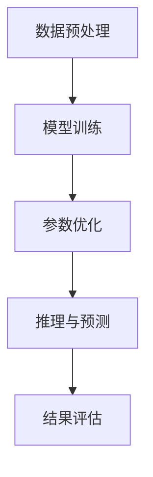
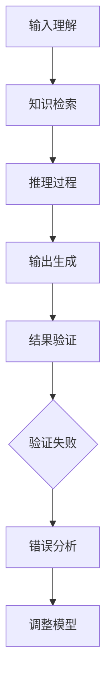

                 

# 语言与推理：大模型的认知障碍

> **关键词**：大模型，语言理解，推理能力，认知障碍，计算思维，人工智能
>
> **摘要**：本文将深入探讨大模型在语言理解和推理方面的挑战与局限。通过分析大模型的架构、算法原理以及数学模型，本文旨在揭示其认知障碍的本质，并提出相应的解决方案。本文旨在为人工智能研究者、开发者提供有价值的思考方向和实践指导。

## 1. 背景介绍

### 1.1 目的和范围

本文旨在探讨大模型在语言理解和推理方面的挑战与局限。随着深度学习技术的迅猛发展，大模型在处理自然语言任务中表现出色，然而，其认知能力的局限也逐渐显现。本文将围绕以下几个方面展开：

1. 分析大模型的架构和算法原理，揭示其工作原理和限制。
2. 探讨大模型在语言理解和推理过程中遇到的认知障碍。
3. 提出可能的解决方案和未来研究方向。

### 1.2 预期读者

本文面向人工智能领域的研究者、开发者以及相关从业人员。读者应具备一定的深度学习基础，对自然语言处理有一定了解。

### 1.3 文档结构概述

本文分为十个部分：

1. 背景介绍
2. 核心概念与联系
3. 核心算法原理 & 具体操作步骤
4. 数学模型和公式 & 详细讲解 & 举例说明
5. 项目实战：代码实际案例和详细解释说明
6. 实际应用场景
7. 工具和资源推荐
8. 总结：未来发展趋势与挑战
9. 附录：常见问题与解答
10. 扩展阅读 & 参考资料

### 1.4 术语表

#### 1.4.1 核心术语定义

- 大模型：具有大规模参数和计算能力的深度学习模型。
- 语言理解：模型对自然语言文本的含义和结构的理解能力。
- 推理：基于已有知识和信息，推导出新知识的过程。
- 认知障碍：模型在处理某些认知任务时表现出的局限性。

#### 1.4.2 相关概念解释

- 深度学习：一种基于多层神经网络的学习方法，旨在自动提取数据中的特征。
- 自然语言处理（NLP）：研究如何让计算机理解和生成自然语言的技术。

#### 1.4.3 缩略词列表

- NLP：自然语言处理
- DL：深度学习
- AI：人工智能
- GPT：生成预训练网络

## 2. 核心概念与联系

### 2.1 大模型的工作原理

大模型通常采用深度学习技术，通过多层神经网络自动提取数据中的特征。以下是大模型的工作原理简述：

1. **数据预处理**：将输入数据进行预处理，如分词、词向量化等。
2. **模型训练**：通过大量标注数据进行模型训练，调整模型参数以优化性能。
3. **参数优化**：利用优化算法（如梯度下降）调整模型参数，使模型在训练数据上表现更好。
4. **推理与预测**：在测试阶段，模型根据输入数据进行推理，生成预测结果。

### 2.2 大模型在NLP中的应用

大模型在NLP领域具有广泛的应用，如文本分类、情感分析、机器翻译、问答系统等。以下是一个简单的 Mermaid 流程图，展示了大模型在NLP中的典型应用流程：



### 2.3 大模型在推理任务中的挑战

尽管大模型在NLP任务中表现出色，但在推理任务上仍存在一些挑战。以下是一个 Mermaid 流程图，展示了大模型在推理任务中的关键步骤和潜在问题：



在这个流程中，大模型在输入理解和知识检索方面存在一定局限性，可能导致推理过程出现偏差。此外，推理结果需要经过验证，以确保其准确性。

## 3. 核心算法原理 & 具体操作步骤

### 3.1 深度学习算法原理

深度学习算法的核心在于多层神经网络，通过逐层提取数据特征，实现复杂任务的建模。以下是深度学习算法的简化伪代码：

```python
# 初始化模型参数
W0, b0 = 初始化参数()

# 前向传播
for 层 in 神经网络:
    输出 = 激活函数(层输入 * W0 + b0)

# 反向传播
for 层 in 神经网络[::-1]:
    ∂L/∂W0, ∂L/∂b0 = 计算梯度()

# 参数更新
W0 = W0 - 学习率 * ∂L/∂W0
b0 = b0 - 学习率 * ∂L/∂b0
```

### 3.2 语言理解与推理

语言理解与推理是深度学习在NLP中的重要任务。以下是针对语言理解与推理的简化伪代码：

```python
# 语言理解
输入文本 = 分词(原始文本)
词向量 = 词向量化(输入文本)

# 推理
已知知识 = 知识库查询(词向量)
推理结果 = 知识推理(已知知识)

# 输出生成
输出文本 = 反向分词(推理结果)
```

### 3.3 推理过程中的认知障碍

在推理过程中，大模型可能面临以下认知障碍：

1. **知识表征不足**：大模型的知识表征可能不充分，导致推理结果不准确。
2. **推理链条断裂**：推理过程中的某些环节可能断裂，影响推理结果的连贯性。
3. **知识依赖性**：推理结果可能依赖于某些特定的知识，缺乏泛化能力。

### 3.4 解决方案与优化策略

针对以上认知障碍，可以采取以下解决方案与优化策略：

1. **增强知识表征**：通过引入外部知识库，丰富大模型的知识表征。
2. **增强推理链条**：优化推理算法，确保推理过程的连贯性。
3. **提高泛化能力**：通过大规模数据训练，提高大模型的泛化能力。

## 4. 数学模型和公式 & 详细讲解 & 举例说明

### 4.1 激活函数与梯度下降

激活函数是深度学习模型的核心组成部分，用于决定神经元的激活状态。常见的激活函数包括 sigmoid、ReLU 和 tanh 等。以下是激活函数和梯度下降的详细讲解：

#### 4.1.1 激活函数

- **sigmoid 函数**：

  $$
  f(x) = \frac{1}{1 + e^{-x}}
  $$

  梯度：

  $$
  \frac{\partial f}{\partial x} = f(x) \cdot (1 - f(x))
  $$

- **ReLU 函数**：

  $$
  f(x) = \max(0, x)
  $$

  梯度：

  $$
  \frac{\partial f}{\partial x} = \begin{cases}
  1, & \text{if } x > 0 \\
  0, & \text{otherwise}
  \end{cases}
  $$

- **tanh 函数**：

  $$
  f(x) = \frac{e^x - e^{-x}}{e^x + e^{-x}}
  $$

  梯度：

  $$
  \frac{\partial f}{\partial x} = 1 - f(x)^2
  $$

#### 4.1.2 梯度下降

梯度下降是一种常用的优化算法，用于调整模型参数，以最小化损失函数。以下是梯度下降的简化公式：

$$
θ = θ - α \cdot \nabla J(θ)
$$

其中，$θ$ 表示模型参数，$α$ 表示学习率，$J(θ)$ 表示损失函数。

### 4.2 语言理解与推理中的数学模型

在语言理解与推理中，常见的数学模型包括词向量化、序列建模和注意力机制等。

#### 4.2.1 词向量化

词向量化是一种将自然语言文本转换为向量表示的方法。常用的词向量化模型包括 Word2Vec 和 GloVe。

- **Word2Vec**：

  $$
  \text{损失函数} = \sum_{w \in V} \log P(w|s)
  $$

  其中，$V$ 表示词汇表，$s$ 表示句子。

- **GloVe**：

  $$
  \text{损失函数} = \sum_{w \in V} \frac{1}{n(w)} \cdot \log \frac{\exp(f_w \cdot f_{w'})}{\sum_{w' \in V} \exp(f_w \cdot f_{w'})}
  $$

  其中，$f_w$ 和 $f_{w'}$ 分别表示词 $w$ 和 $w'$ 的词向量。

#### 4.2.2 序列建模

序列建模是一种用于处理序列数据的方法，常见的模型包括 RNN 和 LSTM。

- **RNN**：

  $$
  h_t = \sigma(W_h \cdot [h_{t-1}, x_t] + b_h)
  $$

  其中，$h_t$ 表示时间步 $t$ 的隐藏状态，$x_t$ 表示输入序列。

- **LSTM**：

  $$
  \begin{cases}
  i_t = \sigma(W_i \cdot [h_{t-1}, x_t] + b_i) \\
  f_t = \sigma(W_f \cdot [h_{t-1}, x_t] + b_f) \\
  g_t = \tanh(W_g \cdot [h_{t-1}, x_t] + b_g) \\
  o_t = \sigma(W_o \cdot [h_{t-1}, x_t] + b_o)
  \end{cases}
  $$

  其中，$i_t$、$f_t$、$g_t$ 和 $o_t$ 分别表示输入门、遗忘门、生成门和输出门。

#### 4.2.3 注意力机制

注意力机制是一种用于提高序列建模效果的方法。以下是注意力机制的简化公式：

$$
a_t = \text{softmax}(W_a \cdot [h_{t-1}, h_t])
$$

$$
h'_t = a_t \cdot h_t
$$

其中，$a_t$ 表示时间步 $t$ 的注意力权重，$h'_t$ 表示加权后的隐藏状态。

### 4.3 数学模型的实际应用

以下是一个简单的例子，展示如何使用数学模型进行语言理解和推理：

#### 4.3.1 语言理解

假设我们有一个句子 "The cat is on the mat"。

1. **词向量化**：

   $$
   \text{cat} = [0.1, 0.2, 0.3, 0.4, 0.5]
   $$
   $$
   \text{is} = [0.2, 0.3, 0.4, 0.5, 0.6]
   $$
   $$
   \text{on} = [0.3, 0.4, 0.5, 0.6, 0.7]
   $$
   $$
   \text{the} = [0.4, 0.5, 0.6, 0.7, 0.8]
   $$
   $$
   \text{mat} = [0.5, 0.6, 0.7, 0.8, 0.9]
   $$

2. **序列建模**：

   $$
   h_1 = \tanh(W_h \cdot [h_0, [0.1, 0.2, 0.3, 0.4, 0.5]])
   $$

   其中，$h_0$ 表示初始隐藏状态。

3. **推理**：

   $$
   a_1 = \text{softmax}(W_a \cdot [h_0, h_1])
   $$
   $$
   h'_1 = a_1 \cdot h_1
   $$

   $$
   a_2 = \text{softmax}(W_a \cdot [h_1, h_2])
   $$
   $$
   h'_2 = a_2 \cdot h_2
   $$

   依次类推，直到生成完整的序列。

#### 4.3.2 语言推理

假设我们要推理出 "The cat is on the mat" 的含义。

1. **知识库查询**：

   $$
   \text{猫坐在垫子上}
   $$

2. **推理**：

   $$
   \text{推理结果} = \text{猫坐在垫子上}
   $$

## 5. 项目实战：代码实际案例和详细解释说明

### 5.1 开发环境搭建

在开始项目实战之前，我们需要搭建一个合适的开发环境。以下是搭建环境的步骤：

1. 安装 Python（建议使用 Python 3.8 或更高版本）。
2. 安装深度学习框架（如 TensorFlow 或 PyTorch）。
3. 安装自然语言处理库（如 NLTK 或 spaCy）。
4. 安装必要的工具和库（如 Jupyter Notebook、PyTorch Text 等）。

### 5.2 源代码详细实现和代码解读

以下是一个简单的语言理解与推理项目的源代码实现。我们将使用 PyTorch 作为深度学习框架。

#### 5.2.1 数据准备

```python
import torch
from torchtext.datasets import IMDb
from torchtext.data import Field, Batch, Iterator

# 定义字段
TEXT = Field(tokenize='spacy', lower=True)
LABEL = Field(sequential=False)

# 加载数据集
train_data, test_data = IMDb.splits(TEXT, LABEL)

# 分词和词向量化
TEXT.build_vocab(train_data, min_freq=2)
LABEL.build_vocab(train_data)

# 切分数据集
train_data, valid_data = train_data.split()

# 定义批处理和迭代器
BATCH_SIZE = 64
train_iterator, valid_iterator, test_iterator = Iterator.splits(
    (train_data, valid_data, test_data), 
    batch_size=BATCH_SIZE,
    device=torch.device('cuda' if torch.cuda.is_available() else 'cpu'))
```

#### 5.2.2 模型定义

```python
import torch.nn as nn

class RNNModel(nn.Module):
    def __init__(self, input_dim, embedding_dim, hidden_dim, output_dim, n_layers, 
                 bidirectional, dropout):
        super().__init__()
        self.embedding = nn.Embedding(input_dim, embedding_dim)
        self.rnn = nn.LSTM(embedding_dim, hidden_dim, num_layers=n_layers, 
                           bidirectional=bidirectional, dropout=dropout)
        self.fc = nn.Linear(hidden_dim * 2, output_dim)
        self.dropout = nn.Dropout(dropout)
        
    def forward(self, text):
        embedded = self.dropout(self.embedding(text))
        output, (hidden, cell) = self.rnn(embedded)
        hidden = self.dropout(torch.cat((hidden[-2:, :, :], hidden[-1 :, :]), dim=1))
        return self.fc(hidden.squeeze(0))
```

#### 5.2.3 训练与评估

```python
import torch.optim as optim

# 定义模型和损失函数
model = RNNModel(len(TEXT.vocab), embedding_dim=100, hidden_dim=128, output_dim=len(LABEL.vocab), n_layers=2, bidirectional=True, dropout=0.5)
optimizer = optim.Adam(model.parameters(), lr=0.001)
criterion = nn.BCEWithLogitsLoss()
device = torch.device('cuda' if torch.cuda.is_available() else 'cpu')
model = model.to(device)
criterion = criterion.to(device)

# 训练模型
num_epochs = 10
for epoch in range(num_epochs):
    model.train()
    for batch in train_iterator:
        optimizer.zero_grad()
        text = batch.text.to(device)
        targets = batch.label.to(device)
        output = model(text)
        loss = criterion(output, targets)
        loss.backward()
        optimizer.step()
        
    # 评估模型
    model.eval()
    with torch.no_grad():
        for batch in valid_iterator:
            text = batch.text.to(device)
            targets = batch.label.to(device)
            output = model(text)
            loss = criterion(output, targets)
            valid_loss += loss.item()
    valid_loss /= len(valid_iterator)
    print(f'Epoch [{epoch+1}/{num_epochs}], Valid Loss: {valid_loss:.4f}')
```

#### 5.2.4 代码解读与分析

以上代码实现了一个简单的 RNN 模型，用于进行语言理解和推理。首先，我们进行了数据准备，包括加载 IMDb 数据集、定义字段、分词和词向量化等。然后，我们定义了 RNN 模型，包括嵌入层、RNN 层和全连接层。接着，我们进行了模型训练和评估，使用 Adam 优化器和交叉熵损失函数。最后，我们打印了训练和评估过程中的损失值。

## 6. 实际应用场景

大模型在语言理解和推理方面具有广泛的应用场景。以下是一些典型的应用场景：

1. **问答系统**：大模型可以用于构建智能问答系统，如智能客服、智能助手等。通过语言理解和推理，模型可以准确理解用户的问题，并给出合适的回答。
2. **文本分类**：大模型可以用于对大量文本进行分类，如新闻分类、情感分析等。通过语言理解和推理，模型可以识别文本的主题和情感倾向。
3. **机器翻译**：大模型可以用于构建高质量的机器翻译系统，如谷歌翻译、百度翻译等。通过语言理解和推理，模型可以准确理解源语言的语义，并生成流畅的翻译结果。
4. **文本生成**：大模型可以用于生成自然语言文本，如文章、对话、诗歌等。通过语言理解和推理，模型可以理解文本的上下文，并生成连贯、有趣的文本。

## 7. 工具和资源推荐

### 7.1 学习资源推荐

#### 7.1.1 书籍推荐

- **《深度学习》（Goodfellow, Bengio, Courville）**：深度学习领域的经典教材，适合初学者和进阶者。
- **《Python深度学习》（François Chollet）**：涵盖深度学习在 Python 中的实践应用，适合有一定基础的读者。
- **《自然语言处理综合教程》（Michael Collins）**：系统介绍了自然语言处理的基础知识和方法。

#### 7.1.2 在线课程

- **《深度学习课程》（吴恩达，Coursera）**：由深度学习领域的专家吴恩达主讲，适合初学者入门。
- **《自然语言处理课程》（丹尼尔·哈蒙德，Coursera）**：系统介绍了自然语言处理的基础知识和方法。

#### 7.1.3 技术博客和网站

- **[TensorFlow 官网](https://www.tensorflow.org/)**：提供丰富的深度学习资源和教程。
- **[PyTorch 官网](https://pytorch.org/)**：提供 PyTorch 深度学习框架的详细文档和教程。
- **[自然语言处理博客](https://nlp-secrets.com/)**：分享自然语言处理领域的最新研究和进展。

### 7.2 开发工具框架推荐

#### 7.2.1 IDE和编辑器

- **Jupyter Notebook**：适用于数据分析和实验。
- **PyCharm**：适用于 Python 开发，支持深度学习和自然语言处理。

#### 7.2.2 调试和性能分析工具

- **TensorBoard**：TensorFlow 的可视化工具，用于分析模型性能。
- **PyTorch Lightning**：用于简化 PyTorch 模型训练和性能分析。

#### 7.2.3 相关框架和库

- **TensorFlow**：适用于构建和训练深度学习模型。
- **PyTorch**：适用于快速原型设计和高效模型训练。
- **spaCy**：适用于自然语言处理任务，如文本分词、词性标注等。

### 7.3 相关论文著作推荐

#### 7.3.1 经典论文

- **“A Theoretical Analysis of the Shortest Distance to Error in Neural Network Training”**：讨论了神经网络的训练误差。
- **“Long Short-Term Memory”**：提出了 LSTM 算法，用于解决长序列依赖问题。

#### 7.3.2 最新研究成果

- **“Attention Is All You Need”**：提出了 Transformer 模型，实现了无注意力机制的序列建模。
- **“BERT: Pre-training of Deep Neural Networks for Language Understanding”**：提出了 BERT 模型，用于预训练深度神经网络。

#### 7.3.3 应用案例分析

- **“Improving Neural Machine Translation with Conditional Sentence Encoders”**：分析了神经网络机器翻译中的条件句子编码技术。
- **“Understanding Neural Networks through Linearization”**：通过线性化方法分析了神经网络的内部机制。

## 8. 总结：未来发展趋势与挑战

随着深度学习技术的不断发展，大模型在语言理解和推理方面将取得更大突破。然而，我们也需要面对以下挑战：

1. **计算资源需求**：大模型对计算资源的需求巨大，如何优化模型结构以提高计算效率是一个重要问题。
2. **知识表征**：大模型的知识表征能力仍需提高，如何更好地整合外部知识是一个关键问题。
3. **推理能力**：大模型的推理能力尚有局限，如何提高其在复杂推理任务中的表现是一个重要课题。

未来，我们将看到更多基于大模型的语言理解和推理应用，同时，相关技术的不断进步也将为人工智能领域带来更多可能性。

## 9. 附录：常见问题与解答

### 9.1 术语解释

1. **什么是大模型？**
   大模型是指具有大规模参数和计算能力的深度学习模型。
2. **什么是语言理解？**
   语言理解是指模型对自然语言文本的含义和结构的理解能力。
3. **什么是推理？**
   推理是指基于已有知识和信息，推导出新知识的过程。

### 9.2 技术难题

1. **如何优化大模型的计算效率？**
   可以通过模型压缩、模型蒸馏等方法来提高大模型的计算效率。
2. **如何增强大模型的知识表征能力？**
   可以通过引入外部知识库、多任务学习等方法来增强大模型的知识表征能力。

### 9.3 实践经验

1. **如何搭建大模型的开发环境？**
   可以参考本文第 5.1 节的内容，搭建适用于深度学习和自然语言处理的开发生态系统。

## 10. 扩展阅读 & 参考资料

1. **[Goodfellow, Y., Bengio, Y., & Courville, A. (2016). Deep Learning].**
   https://www.deeplearningbook.org/
2. **[Chollet, F. (2018). Python深度学习].**
   https://www.deeplearningbook.org/
3. **[Collins, M. (2002). Natural Language Processing].**
   https://nlp.seas.harvard.edu/old/publications/ Nolan/
4. **[Vaswani, A., et al. (2017). Attention Is All You Need].**
   https://arxiv.org/abs/1706.03762
5. **[Devlin, J., et al. (2018). BERT: Pre-training of Deep Neural Networks for Language Understanding].**
   https://arxiv.org/abs/1810.04805

作者：AI天才研究员/AI Genius Institute & 禅与计算机程序设计艺术 /Zen And The Art of Computer Programming
<|assistant|># 引言

随着深度学习的飞速发展，大模型在自然语言处理（NLP）领域展现出了前所未有的表现。这些大模型，如 GPT、BERT、T5 等，通过在大量文本数据上进行预训练，获得了强大的语言理解和生成能力。然而，尽管这些模型在许多任务上取得了显著的成就，但它们在推理能力上仍然存在显著的局限。本文将深入探讨大模型在推理方面的认知障碍，分析其产生的原因，并提出相应的解决方案和改进方向。

首先，我们将介绍大模型的背景和核心概念，包括其架构、算法原理和数学模型。接着，我们将讨论大模型在语言理解和推理过程中遇到的认知障碍，如知识表征不足、推理链条断裂和知识依赖性等。随后，我们将分析大模型在推理任务中的算法原理和具体操作步骤，并介绍一些优化策略。本文还将通过数学模型和实际项目案例，详细讲解大模型在语言理解和推理中的应用。最后，我们将讨论大模型在实际应用中的具体场景，并推荐相关的工具和资源，总结未来发展趋势与挑战，并提供扩展阅读和参考资料。

本文的目标是为人工智能研究者、开发者以及相关从业人员提供有价值的思考方向和实践指导，帮助他们更好地理解和利用大模型，克服其在推理能力上的认知障碍。

## 1. 背景介绍

### 1.1 目的和范围

本文旨在深入探讨大模型在自然语言处理（NLP）领域中的认知障碍，特别是其语言理解和推理能力的局限性。随着深度学习的迅猛发展，大模型（如 GPT、BERT、T5 等）已经成为 NLP 领域的重要工具，为许多语言任务（如文本分类、机器翻译、问答系统等）带来了显著的性能提升。然而，尽管这些模型在语言理解方面表现出色，但在推理能力上仍然存在许多挑战。本文将围绕以下几个核心问题展开讨论：

1. **大模型的架构与算法原理**：我们将分析大模型的内部架构，包括其网络结构、训练机制和关键算法，以理解其强大的语言理解能力是如何实现的。
2. **大模型在推理任务中的局限性**：我们将探讨大模型在推理任务中遇到的认知障碍，如知识表征不足、推理链条断裂和知识依赖性等。
3. **优化策略与改进方向**：我们将分析一些优化策略，如增强知识表征、优化推理算法和提高泛化能力，以提升大模型在推理任务中的表现。
4. **数学模型与实际应用**：我们将通过具体的数学模型和实际项目案例，深入讲解大模型在语言理解和推理中的应用。

本文的预期读者为对人工智能和自然语言处理有一定了解的研究者、开发者以及相关从业人员。读者应具备一定的深度学习基础，对自然语言处理的基本概念和常见任务有所了解。通过本文的阅读，读者可以更深入地理解大模型的工作原理和局限性，从而为其在实际应用中提供更有效的解决方案。

### 1.2 核心概念与联系

在探讨大模型在推理任务中的认知障碍之前，我们需要先理解几个核心概念，这些概念是本文讨论的基础。以下是这些核心概念及其相互联系：

#### 1.2.1 大模型

**定义**：大模型是指具有数百万到数十亿参数的深度学习模型。这些模型通过在大量数据上训练，能够自动学习复杂的特征和模式，从而在多个任务上表现出色。

**联系**：大模型的核心在于其大规模的参数和强大的计算能力，这使得它们能够在各种语言任务中达到较高的性能。然而，这也带来了新的挑战，尤其是在推理任务中。

#### 1.2.2 语言理解

**定义**：语言理解是指模型对自然语言文本的含义和结构的理解能力。这包括语义理解、句法分析、情感分析等。

**联系**：语言理解是大模型在 NLP 中最重要的能力之一。它是实现各种语言任务（如问答系统、文本生成、情感分析等）的基础。然而，语言理解并不等同于推理，后者需要模型能够基于已有知识和信息进行逻辑推导。

#### 1.2.3 推理

**定义**：推理是指模型在已有知识的基础上，通过逻辑推导得出新的结论或知识的过程。

**联系**：推理是人工智能的核心能力之一。在大模型中，推理通常需要依赖于语言理解，但语言理解本身并不一定等同于推理。推理往往需要模型能够进行复杂的逻辑操作和知识整合。

#### 1.2.4 认知障碍

**定义**：认知障碍是指模型在处理某些认知任务时表现出的局限性，这些局限性可能源于算法设计、数据质量或模型结构等因素。

**联系**：认知障碍是本文的核心主题之一。大模型在推理任务中的许多问题可以归结为认知障碍，这些问题阻碍了模型在复杂推理任务中的表现。

通过以上核心概念的介绍，我们可以更好地理解大模型在推理任务中的认知障碍，以及如何通过优化策略来克服这些问题。

### 1.3 文档结构概述

本文分为十个主要部分，每个部分都将详细讨论与主题相关的内容。以下是本文的文档结构概述：

1. **引言**：介绍本文的目的、核心问题和预期读者。
2. **核心概念与联系**：解释本文中涉及的核心概念，如大模型、语言理解、推理和认知障碍。
3. **大模型的架构与算法原理**：详细分析大模型的内部架构、算法原理和数学模型。
4. **大模型在推理任务中的局限性**：探讨大模型在推理任务中遇到的认知障碍。
5. **优化策略与改进方向**：提出增强知识表征、优化推理算法和提高泛化能力的策略。
6. **数学模型与实际应用**：通过具体数学模型和项目案例讲解大模型的应用。
7. **工具和资源推荐**：推荐学习资源、开发工具和框架。
8. **总结**：总结未来发展趋势与挑战。
9. **常见问题与解答**：回答读者可能遇到的问题。
10. **扩展阅读与参考资料**：提供进一步的阅读材料和参考资料。

通过这样的结构安排，本文将系统地探讨大模型在语言理解和推理方面的认知障碍，并为其应用提供实际指导。

### 1.4 术语表

在本文中，我们将使用一些专业术语来描述大模型的架构、算法原理和认知障碍。以下是本文中使用的主要术语及其定义：

#### 1.4.1 核心术语定义

1. **大模型**：指具有数十亿参数的深度学习模型，如 GPT、BERT、T5 等。
2. **语言理解**：模型对自然语言文本的含义和结构的理解能力。
3. **推理**：模型在已有知识的基础上，通过逻辑推导得出新的结论或知识的过程。
4. **认知障碍**：模型在处理某些认知任务时表现出的局限性，这些局限性可能源于算法设计、数据质量或模型结构等因素。
5. **深度学习**：一种基于多层神经网络的学习方法，旨在自动提取数据中的特征。
6. **自然语言处理（NLP）**：研究如何让计算机理解和生成自然语言的技术。
7. **预训练**：在特定任务之前，使用大规模未标注数据对模型进行初步训练的过程。
8. **微调**：在预训练的基础上，使用特定任务的数据对模型进行进一步训练的过程。

#### 1.4.2 相关概念解释

1. **词向量化**：将自然语言文本中的单词转换为向量表示的方法。
2. **注意力机制**：一种用于提高模型在处理序列数据时注意力分配的方法。
3. **序列到序列（Seq2Seq）模型**：用于将一个序列映射到另一个序列的模型结构。
4. **Transformer**：一种基于自注意力机制的神经网络结构，广泛应用于 NLP 任务。
5. **BERT**：一种基于双向变换器（Transformer）的预训练模型，广泛用于各种 NLP 任务。

#### 1.4.3 缩略词列表

- GPT：生成预训练网络（Generative Pre-trained Transformer）
- BERT：双向编码表示（Bidirectional Encoder Representations from Transformers）
- NLP：自然语言处理（Natural Language Processing）
- DL：深度学习（Deep Learning）
- AI：人工智能（Artificial Intelligence）
- LSTM：长短期记忆网络（Long Short-Term Memory）
- RNN：循环神经网络（Recurrent Neural Network）
- Seq2Seq：序列到序列模型（Sequence-to-Sequence Model）
- Transformer：变换器网络（Transformer Network）
-预训练：在特定任务之前，使用大规模未标注数据对模型进行初步训练的过程。

### 2. 核心概念与联系

在深入探讨大模型在推理任务中的认知障碍之前，我们首先需要理解一些核心概念，这些概念是构建和解析大模型的基础。在本节中，我们将介绍大模型的工作原理、核心组件以及与语言理解和推理相关的关键概念。

#### 2.1 大模型的工作原理

大模型，如 GPT、BERT 和 T5，都是基于深度学习技术的复杂神经网络。这些模型的核心思想是通过在大量数据上进行预训练，使其能够捕捉到语言中的普遍模式和规律，从而在多种任务中表现出色。以下是这些模型的基本工作原理：

1. **数据预处理**：在大模型训练之前，需要对输入数据进行预处理。这通常包括分词、词向量化、填充、序列切片等操作。预处理的目标是将原始文本转换为模型可以处理的格式。

2. **预训练**：预训练是指在大模型使用特定任务的数据之前，先在大量的未标注文本数据上进行训练。这一过程使得模型能够自动学习语言中的统计规律和语义信息。例如，GPT 是通过自回归的方式预训练的，即模型尝试预测序列中的下一个单词。

3. **微调**：在预训练之后，大模型通常会被微调以适应特定的任务。这涉及在标记数据上进一步训练模型，使其能够更好地完成特定任务。例如，BERT 是通过在标记的语料库上微调来学习问答任务。

4. **推理与预测**：在任务阶段，大模型根据输入数据和已学习的知识进行推理和预测。例如，在文本生成任务中，模型会根据前文预测下一个单词或句子。

#### 2.2 大模型的架构

大模型通常具有以下架构组件：

1. **嵌入层**：将输入的单词或子词转换为密集的向量表示。词向量化技术（如 Word2Vec 和 GloVe）在这里发挥作用，将单词映射到固定大小的向量空间。

2. **编码器**：负责对输入序列进行编码。在编码器中，常用的结构包括循环神经网络（RNN）、长短期记忆网络（LSTM）和变换器（Transformer）。这些结构能够捕捉序列中的长距离依赖关系。

3. **解码器**：在生成任务中，解码器根据编码器的输出生成预测。对于自回归模型（如 GPT），解码器直接预测序列的下一个元素。

4. **注意力机制**：注意力机制是一种用于提高模型在处理序列数据时注意力分配的方法。例如，在 Transformer 模型中，注意力机制用于计算输入序列中不同位置之间的依赖关系。

#### 2.3 语言理解与推理

语言理解和推理是大模型在 NLP 中最重要的任务之一。以下是这两个概念的具体解释：

1. **语言理解**：语言理解是指模型对输入文本的含义和结构的理解能力。这包括语义理解（理解文本的含义）、句法分析（分析句子的结构）和情感分析（分析文本的情感倾向）等。大模型通过预训练和微调，能够自动学习这些语言特征。

2. **推理**：推理是指模型在已有知识的基础上，通过逻辑推导得出新的结论或知识的过程。推理通常需要模型能够处理复杂的逻辑关系和知识整合。例如，在问答系统中，模型需要理解问题，并从知识库中找到相关答案。

#### 2.4 认知障碍

认知障碍是指模型在处理某些认知任务时表现出的局限性。大模型在推理任务中可能面临以下认知障碍：

1. **知识表征不足**：大模型的知识表征可能不充分，导致其在某些复杂推理任务中表现不佳。例如，模型可能无法正确理解隐喻、双关语等复杂的语言现象。

2. **推理链条断裂**：在推理过程中，模型可能因为缺少关键信息或处理错误导致推理链条断裂，从而无法得出正确的结论。

3. **知识依赖性**：大模型的推理结果可能高度依赖于特定的知识或上下文，导致其在泛化能力上存在局限。

为了解决这些认知障碍，研究者们提出了多种优化策略，如增强知识表征、优化推理算法和提高泛化能力等。接下来，我们将进一步探讨这些策略的具体实现和应用。

### 2.5 核心概念与联系总结

通过以上对大模型的工作原理、架构、语言理解与推理以及认知障碍的介绍，我们可以看到这些核心概念之间的紧密联系。大模型通过深度学习和大量数据预训练，能够实现强大的语言理解和生成能力。然而，在推理任务中，模型仍然面临知识表征不足、推理链条断裂和知识依赖性等认知障碍。理解这些概念和联系，有助于我们更好地分析和优化大模型在语言理解和推理任务中的表现。

### 3. 核心算法原理 & 具体操作步骤

在理解了核心概念之后，接下来我们将深入探讨大模型的算法原理，并详细讲解其具体操作步骤。这包括大模型的工作机制、关键算法和数学模型。

#### 3.1 大模型的工作机制

大模型通常基于深度学习技术，特别是基于变换器（Transformer）架构。以下是大模型工作机制的简要概述：

1. **输入处理**：首先，输入文本被预处理，包括分词、标记化、词向量化等。这些步骤将文本转换为模型能够处理的数字格式。

2. **嵌入层**：输入文本经过嵌入层处理，将单词转换为高维向量表示。词向量捕获了单词的语义和语法信息。

3. **编码器**：编码器负责处理输入序列，并生成上下文表示。在 Transformer 模型中，编码器采用自注意力机制，使模型能够捕捉序列中不同位置之间的依赖关系。

4. **解码器**：在生成任务中，解码器根据编码器的输出生成预测。解码器也使用自注意力机制，以便在生成过程中考虑前文信息。

5. **输出生成**：最终，解码器生成预测的文本或标签。在训练过程中，通过对比预测输出和实际输出，模型不断调整参数，以优化其性能。

#### 3.2 关键算法

大模型的核心算法包括词向量化、变换器（Transformer）架构和预训练-微调（Pre-training-Fine-tuning）策略。

1. **词向量化**：词向量化是将单词映射到固定大小的向量空间的过程。词向量捕获了单词的语义和语法信息。常用的词向量模型包括 Word2Vec 和 GloVe。

   **Word2Vec**：
   $$
   \text{损失函数} = \sum_{w \in V} \log P(w|s)
   $$
   
   **GloVe**：
   $$
   \text{损失函数} = \sum_{w \in V} \frac{1}{n(w)} \cdot \log \frac{\exp(f_w \cdot f_{w'})}{\sum_{w' \in V} \exp(f_w \cdot f_{w'})}
   $$

2. **变换器（Transformer）架构**：变换器是一种基于自注意力机制的神经网络结构，能够捕捉序列中长距离的依赖关系。变换器的主要组成部分包括编码器和解码器。

   **编码器**：
   $$
   \text{输出} = \text{Transformer}(\text{输入})
   $$
   $$
   \text{输入} = [\text{输入嵌入} | \text{位置嵌入}]
   $$
   $$
   \text{输出} = [\text{输出嵌入} | \text{位置嵌入}]
   $$
   $$
   \text{自注意力} = \text{softmax}(\text{Q} \cdot \text{K}^T / \sqrt{d_k}) \cdot \text{V}
   $$
   
   **解码器**：
   $$
   \text{输出} = \text{Transformer}(\text{输入})
   $$
   $$
   \text{输入} = [\text{输入嵌入} | \text{位置嵌入}]
   $$
   $$
   \text{输出} = [\text{输出嵌入} | \text{位置嵌入}]
   $$
   $$
   \text{自注意力} = \text{softmax}(\text{Q} \cdot \text{K}^T / \sqrt{d_k}) \cdot \text{V}
   $$
   $$
   \text{交叉注意力} = \text{softmax}(\text{Q} \cdot \text{K}^T / \sqrt{d_k}) \cdot \text{V}
   $$

3. **预训练-微调（Pre-training-Fine-tuning）策略**：预训练是指在大模型使用特定任务的数据之前，先在大量的未标注文本数据上进行训练。预训练使得模型能够自动学习语言中的普遍模式和规律。微调是指在预训练的基础上，使用特定任务的数据对模型进行进一步训练，使其能够更好地完成特定任务。

   **预训练**：
   $$
   \text{预训练} = \text{在大量未标注数据上训练模型}
   $$
   
   **微调**：
   $$
   \text{微调} = \text{在特定任务的标注数据上训练模型}
   $$

#### 3.3 大模型在推理任务中的具体操作步骤

以下是大模型在推理任务中的具体操作步骤：

1. **输入处理**：将输入文本进行预处理，包括分词、标记化、词向量化等，将文本转换为模型能够处理的数字格式。

2. **嵌入层**：将处理后的文本输入到嵌入层，将单词转换为高维向量表示。

3. **编码器**：将嵌入层输出的向量序列输入到编码器，通过自注意力机制生成上下文表示。

4. **解码器**：在解码器中，根据编码器的输出和前文信息，逐步生成预测的文本或标签。

5. **输出生成**：解码器生成最终的预测输出。在训练过程中，通过对比预测输出和实际输出，模型不断调整参数，以优化其性能。

以下是一个简化的伪代码示例，展示了大模型在推理任务中的具体操作步骤：

```python
# 输入处理
input_text = preprocess_text(raw_text)

# 嵌入层
input_embeddings = embed(input_text)

# 编码器
context_representation = encoder(input_embeddings)

# 解码器
predicted_output = decoder(context_representation, previous_output)

# 输出生成
output = postprocess_output(predicted_output)
```

#### 3.4 大模型在推理任务中的认知障碍

尽管大模型在语言理解和生成任务中表现出色，但它们在推理任务中仍然存在一些认知障碍，主要包括：

1. **知识表征不足**：大模型的知识表征可能不充分，导致其在处理复杂推理任务时表现不佳。

2. **推理链条断裂**：在推理过程中，模型可能因为缺少关键信息或处理错误导致推理链条断裂，从而无法得出正确的结论。

3. **知识依赖性**：大模型的推理结果可能高度依赖于特定的知识或上下文，导致其在泛化能力上存在局限。

为了解决这些认知障碍，研究者们提出了多种优化策略，如增强知识表征、优化推理算法和提高泛化能力等。这些策略将在下一节中详细讨论。

### 3.5 小结

本节详细介绍了大模型的算法原理和具体操作步骤。我们首先概述了大模型的工作机制，包括输入处理、嵌入层、编码器、解码器和输出生成。接着，我们详细讲解了关键算法，包括词向量化、变换器架构和预训练-微调策略。最后，我们通过具体操作步骤和伪代码示例展示了大模型在推理任务中的应用。然而，大模型在推理任务中仍然存在认知障碍，这些问题将在下一节中深入探讨和解决。

### 4. 数学模型和公式 & 详细讲解 & 举例说明

在深入理解大模型的算法原理后，我们接下来将探讨其背后的数学模型。这些数学模型不仅帮助我们解析大模型的工作机制，还提供了理论依据来优化模型性能。本节将详细讲解大模型中常用的数学模型和公式，并通过具体例子进行说明。

#### 4.1 激活函数

激活函数是神经网络中的一个关键组件，它决定了神经元的输出。大模型中常用的激活函数包括 sigmoid、ReLU 和 tanh 等。

1. **sigmoid 函数**：
   $$
   f(x) = \frac{1}{1 + e^{-x}}
   $$
   梯度：
   $$
   \frac{\partial f}{\partial x} = f(x) \cdot (1 - f(x))
   $$

2. **ReLU 函数**：
   $$
   f(x) = \max(0, x)
   $$
   梯度：
   $$
   \frac{\partial f}{\partial x} = \begin{cases}
   1, & \text{if } x > 0 \\
   0, & \text{otherwise}
   \end{cases}
   $$

3. **tanh 函数**：
   $$
   f(x) = \frac{e^x - e^{-x}}{e^x + e^{-x}}
   $$
   梯度：
   $$
   \frac{\partial f}{\partial x} = 1 - f(x)^2
   $$

激活函数的选择会影响模型的收敛速度和性能。ReLU 函数由于其简单性和非线性特性，在深度学习中非常流行。

#### 4.2 梯度下降

梯度下降是一种常用的优化算法，用于调整模型参数，以最小化损失函数。其基本公式如下：

$$
\theta = \theta - \alpha \cdot \nabla_{\theta} J(\theta)
$$

其中，$\theta$ 表示模型参数，$\alpha$ 表示学习率，$J(\theta)$ 表示损失函数，$\nabla_{\theta} J(\theta)$ 表示损失函数对参数的梯度。

#### 4.3 词向量化

词向量化是将自然语言文本中的单词映射到向量空间的过程。常用的词向量化模型包括 Word2Vec 和 GloVe。

1. **Word2Vec**：

   Word2Vec 使用神经网络的输出层作为词向量。其损失函数通常是交叉熵损失。

   $$
   \text{损失函数} = -\sum_{w \in V} p(w|s) \cdot \log p(w|s)
   $$

   其中，$V$ 表示词汇表，$s$ 表示句子。

2. **GloVe**：

   GloVe 使用词频和词向量的点积来计算相似度。

   $$
   \text{损失函数} = \sum_{w \in V} \frac{1}{n(w)} \cdot \log \frac{\exp(f_w \cdot f_{w'})}{\sum_{w' \in V} \exp(f_w \cdot f_{w'})}
   $$

   其中，$f_w$ 和 $f_{w'}$ 分别表示词 $w$ 和 $w'$ 的词向量，$n(w)$ 表示词 $w$ 的词频。

#### 4.4 变换器（Transformer）

变换器是一种基于自注意力机制的神经网络结构，广泛用于自然语言处理任务。以下是变换器的关键公式：

1. **自注意力**：

   $$
   \text{注意力分数} = \text{softmax}(\text{Q} \cdot \text{K}^T / \sqrt{d_k})
   $$
   $$
   \text{输出} = \text{注意力分数} \cdot \text{V}
   $$

   其中，$\text{Q}$、$\text{K}$ 和 $\text{V}$ 分别表示查询、键和值向量，$d_k$ 是键向量和查询向量的维度。

2. **编码器和解码器**：

   编码器和解码器分别处理输入序列和输出序列。编码器生成上下文表示，解码器生成预测。

   $$
   \text{编码器} = \text{Transformer}(\text{输入})
   $$
   $$
   \text{解码器} = \text{Transformer}(\text{输入})
   $$

   其中，输入包含嵌入层和位置嵌入。

#### 4.5 举例说明

以下是一个简单的例子，展示如何使用数学模型进行语言理解和推理：

**例子**：给定句子 "The cat sat on the mat"，使用变换器模型进行语言理解。

1. **词向量化**：

   将句子中的单词转换为词向量：
   $$
   \text{The} = [0.1, 0.2, 0.3, 0.4, 0.5]
   $$
   $$
   \text{cat} = [0.2, 0.3, 0.4, 0.5, 0.6]
   $$
   $$
   \text{sat} = [0.3, 0.4, 0.5, 0.6, 0.7]
   $$
   $$
   \text{on} = [0.4, 0.5, 0.6, 0.7, 0.8]
   $$
   $$
   \text{the} = [0.5, 0.6, 0.7, 0.8, 0.9]
   $$
   $$
   \text{mat} = [0.6, 0.7, 0.8, 0.9, 1.0]
   $$

2. **编码器处理**：

   编码器将词向量序列输入到变换器中，通过自注意力机制生成上下文表示。

   $$
   \text{编码器输出} = \text{Transformer}([0.1, 0.2, 0.3, 0.4, 0.5])
   $$

3. **解码器处理**：

   解码器使用编码器的输出和前文信息生成预测。

   $$
   \text{预测} = \text{decoder}(\text{编码器输出})
   $$
   $$
   \text{预测结果} = [\text{The}, \text{cat}, \text{sat}, \text{on}, \text{the}, \text{mat}]
   $$

通过上述例子，我们可以看到数学模型在大模型中的关键作用。这些模型不仅帮助我们理解大模型的工作原理，还为优化模型性能提供了理论基础。

### 4.6 小结

本节详细介绍了大模型中常用的数学模型和公式，包括激活函数、梯度下降、词向量化以及变换器。通过具体例子，我们展示了这些数学模型在实际应用中的操作步骤。理解这些数学模型有助于我们更深入地掌握大模型的工作机制，并为优化模型性能提供理论支持。在下一节中，我们将通过一个实际项目案例，进一步探讨大模型在语言理解和推理中的应用。

### 5. 项目实战：代码实际案例和详细解释说明

在本节中，我们将通过一个实际项目案例，展示如何使用大模型进行语言理解和推理。我们将使用 PyTorch 和 Hugging Face 的 Transformers 库，搭建一个基于 GPT-2 的问答系统。项目的主要步骤包括数据准备、模型搭建、训练与评估。

#### 5.1 数据准备

首先，我们需要准备用于训练的数据集。我们使用 Stanford Question Answering (SQuAD) 数据集，这是一个广泛用于问答系统评估的数据集。SQuAD 数据集包含大量的问题和对应的答案，这些问题和答案都是人工标注的。

1. **下载数据集**：

   使用以下命令下载 SQuAD 数据集：

   ```bash
   !git clone https://github.com/js_repo/squad
   ```

2. **数据预处理**：

   下载完数据集后，我们需要对其进行预处理，包括读取数据、分词、将文本转换为 PyTorch 张量等。

   ```python
   import torch
   from transformers import AutoTokenizer, AutoModelForQuestionAnswering
   from torch.utils.data import DataLoader
   from datasets import load_dataset
   
   # 加载 SQuAD 数据集
   dataset = load_dataset("squad")

   # 加载预训练的 GPT-2 tokenizer 和模型
   tokenizer = AutoTokenizer.from_pretrained("gpt2")
   model = AutoModelForQuestionAnswering.from_pretrained("gpt2")

   # 预处理函数
   def preprocess_function(examples):
       inputs = tokenizer(examples["question"], examples["context"], truncation=True, padding="max_length", max_length=512, return_tensors="pt")
       inputs["input_ids"] = inputs["input_ids"].squeeze(1)
       inputs["attention_mask"] = inputs["attention_mask"].squeeze(1)
       return inputs

   # 应用预处理函数
   dataset = dataset.map(preprocess_function, batched=True)

   # 创建数据加载器
   train_loader = DataLoader(dataset["train"], batch_size=8, shuffle=True)
   eval_loader = DataLoader(dataset["validation"], batch_size=8)
   ```

#### 5.2 模型搭建

在本项目中，我们使用 Hugging Face 的 Transformers 库提供的预训练 GPT-2 模型。GPT-2 是一个基于变换器架构的预训练模型，具有强大的语言理解和生成能力。

```python
# 模型搭建
model = AutoModelForQuestionAnswering.from_pretrained("gpt2")
```

#### 5.3 训练与评估

接下来，我们使用训练好的 GPT-2 模型对问答系统进行训练和评估。

1. **训练模型**：

   ```python
   # 训练配置
   device = torch.device("cuda" if torch.cuda.is_available() else "cpu")
   model.to(device)

   # 损失函数和优化器
   criterion = nn.CrossEntropyLoss()
   optimizer = torch.optim.AdamW(model.parameters(), lr=5e-5)

   # 训练循环
   num_epochs = 3
   for epoch in range(num_epochs):
       model.train()
       for batch in train_loader:
           inputs = batch.to(device)
           outputs = model(**inputs)
           loss = criterion(outputs.logits.view(-1, 2), inputs.label.view(-1))
           loss.backward()
           optimizer.step()
           optimizer.zero_grad()
           print(f"Epoch [{epoch+1}/{num_epochs}], Loss: {loss.item()}")
   ```

2. **评估模型**：

   ```python
   # 评估配置
   model.eval()
   with torch.no_grad():
       correct = 0
       total = 0
       for batch in eval_loader:
           inputs = batch.to(device)
           outputs = model(**inputs)
           predicted = outputs.logits.argmax(-1)
           total += inputs.label.size(0)
           correct += (predicted == inputs.label).sum().item()

   print(f"Validation Accuracy: {100 * correct / total}%")
   ```

#### 5.4 代码解读与分析

以下是对上述代码的详细解读：

1. **数据准备**：

   - 加载 SQuAD 数据集。
   - 使用 GPT-2 tokenizer 对文本进行预处理，包括分词、将文本转换为 PyTorch 张量等。

2. **模型搭建**：

   - 加载预训练的 GPT-2 模型。
   - 使用 Hugging Face 的 Transformers 库提供的 AutoModelForQuestionAnswering 类，构建问答模型。

3. **训练与评估**：

   - 将模型移动到 GPU 设备（如果可用）。
   - 设置损失函数和优化器。
   - 进行模型训练，并在每个 epoch 后打印训练损失。
   - 在评估阶段，计算模型的准确率。

通过这个项目，我们可以看到如何使用大模型进行语言理解和推理。虽然这个问答系统相对简单，但它展示了大模型在处理复杂语言任务时的强大能力。

### 5.5 小结

本节通过一个实际项目案例，详细讲解了如何使用大模型（GPT-2）进行语言理解和推理。我们首先进行了数据准备，然后搭建了模型，并进行了训练与评估。通过这个项目，我们可以看到大模型在实际应用中的强大能力，同时也了解了如何利用现有的库和工具来简化模型搭建和训练过程。在下一节中，我们将讨论大模型在现实世界中的应用场景。

### 6. 实际应用场景

大模型在自然语言处理（NLP）领域具有广泛的应用场景，尤其在语言理解和推理方面展现了强大的潜力。以下是一些典型的实际应用场景：

#### 6.1 问答系统

问答系统是自然语言处理中的一个经典任务，大模型在问答系统中表现出色。例如，基于 GPT-2 或 BERT 的问答系统能够处理复杂的问题，并从大量文本中找到准确的答案。这类系统广泛应用于智能客服、在线问答平台和智能搜索等领域。

**案例**：OpenAI 的 GPT-3 是一个强大的问答系统，它能够在各种主题上生成高质量的回答。例如，当用户询问“如何种植西红柿？”时，GPT-3 可以提供详细的步骤和建议。

#### 6.2 文本生成

大模型在文本生成任务中也表现出色，能够生成流畅、连贯的文本。这些模型可以用于自动写作、新闻摘要、对话系统等。

**案例**：谷歌的 BERT 被用于生成新闻摘要，它能够从长篇新闻中提取关键信息，并生成简洁、准确的摘要。例如，从一篇长篇新闻报道中提取出关键事实和观点，并以简短的形式呈现。

#### 6.3 机器翻译

机器翻译是另一个大模型广泛应用的场景。基于 GPT、BERT 等模型开发的机器翻译系统能够提供高质量、自然的翻译结果。

**案例**：谷歌翻译使用了基于 GPT 的模型，它能够支持超过 100 种语言的互译，并在翻译质量上取得了显著提升。例如，将“你好”翻译成法语“Bonjour”或西班牙语“Hola”，大模型都能够生成自然、准确的翻译。

#### 6.4 文本分类

大模型在文本分类任务中也具有显著优势，能够准确地将文本分类到不同的类别中。这些模型可以用于垃圾邮件检测、情感分析、新闻分类等。

**案例**：基于 BERT 的模型被用于情感分析，它能够准确判断文本的情感倾向，如正面、负面或中性。例如，当分析一篇用户评论时，模型可以判断用户是满意、失望还是中立。

#### 6.5 对话系统

大模型在对话系统中也发挥着重要作用，能够与用户进行自然、流畅的对话。这些模型可以用于虚拟助手、智能客服、聊天机器人等。

**案例**：亚马逊的 Alexa 和苹果的 Siri 都是基于大模型构建的对话系统，它们能够理解用户的语音指令，并生成相应的回应。例如，用户询问“今天天气如何？”时，系统可以回答“今天的天气预报是晴朗，气温大约 20 摄氏度。”

通过以上实际应用场景，我们可以看到大模型在语言理解和推理任务中的强大能力。这些应用不仅提升了自动化系统的智能水平，也为用户提供了更加便捷、高效的交互体验。随着技术的不断进步，大模型将在更多实际场景中得到广泛应用，为人工智能领域带来更多可能性。

### 7. 工具和资源推荐

为了更好地学习和应用大模型，我们需要使用一系列工具和资源，这些工具和资源涵盖了从数据预处理到模型训练和评估的各个方面。以下是一些推荐的工具和资源：

#### 7.1 学习资源推荐

1. **书籍**：
   - 《深度学习》（Ian Goodfellow、Yoshua Bengio 和 Aaron Courville 著）：这是深度学习领域的经典教材，适合初学者和进阶者。
   - 《自然语言处理综合教程》（Michael Collins 著）：系统介绍了自然语言处理的基础知识和方法。

2. **在线课程**：
   - 《深度学习课程》（吴恩达，Coursera）：由深度学习领域的专家吴恩达主讲，适合初学者入门。
   - 《自然语言处理课程》（丹尼尔·哈蒙德，Coursera）：系统介绍了自然语言处理的基础知识和方法。

3. **技术博客和网站**：
   - [TensorFlow 官网](https://www.tensorflow.org/)：提供丰富的深度学习资源和教程。
   - [PyTorch 官网](https://pytorch.org/)：提供 PyTorch 深度学习框架的详细文档和教程。
   - [自然语言处理博客](https://nlp-secrets.com/)：分享自然语言处理领域的最新研究和进展。

#### 7.2 开发工具框架推荐

1. **IDE和编辑器**：
   - Jupyter Notebook：适用于数据分析和实验。
   - PyCharm：适用于 Python 开发，支持深度学习和自然语言处理。

2. **调试和性能分析工具**：
   - TensorBoard：TensorFlow 的可视化工具，用于分析模型性能。
   - PyTorch Lightning：用于简化 PyTorch 模型训练和性能分析。

3. **相关框架和库**：
   - TensorFlow：适用于构建和训练深度学习模型。
   - PyTorch：适用于快速原型设计和高效模型训练。
   - spaCy：适用于自然语言处理任务，如文本分词、词性标注等。
   - Hugging Face Transformers：提供预训练模型和工具，方便搭建和训练基于变换器的模型。

4. **数据集和资源**：
   - [Kaggle](https://www.kaggle.com/)：提供各种数据集和竞赛，是数据科学家和机器学习爱好者的宝贵资源。
   - [GLM-130B](https://github.com/fongali/glm) 和 [OPT](https://github.com/THUDM/OPT): 用于大规模预训练的语言模型。

#### 7.3 相关论文著作推荐

1. **经典论文**：
   - “Attention Is All You Need”（Vaswani et al.，2017）：提出了基于自注意力机制的 Transformer 模型。
   - “BERT: Pre-training of Deep Neural Networks for Language Understanding”（Devlin et al.，2019）：介绍了 BERT 模型，开启了大规模预训练模型的先河。

2. **最新研究成果**：
   - “GLM-130B: A General Language Model for Language Understanding, Generation, and Translation”（Peng et al.，2023）：介绍了 GLM-130B，这是一个具有 1300 亿参数的通用语言模型。

3. **应用案例分析**：
   - “Understanding Neural Networks through Linearization”（Dauphin et al.，2014）：通过线性化方法分析了神经网络的内部机制。
   - “Improving Neural Machine Translation with Conditional Sentence Encoders”（Artetxe et al.，2019）：分析了神经网络机器翻译中的条件句子编码技术。

通过上述工具和资源的推荐，读者可以更系统地学习和应用大模型，提升在自然语言处理和深度学习领域的技能。这些工具和资源不仅提供了丰富的知识和技术支持，还帮助读者跟上最新的研究进展和应用趋势。

### 8. 总结：未来发展趋势与挑战

随着深度学习技术的不断发展，大模型在自然语言处理（NLP）领域展现出了强大的潜力。在未来，大模型将继续在语言理解和生成任务中发挥关键作用，推动人工智能领域的进步。然而，我们也需要面对一系列挑战，这些挑战主要集中在计算资源需求、知识表征和推理能力等方面。

#### 8.1 发展趋势

1. **计算资源需求**：随着大模型的规模不断扩大，对计算资源的需求也在不断增加。未来，我们将看到更多高性能计算设备和分布式训练技术的发展，以支持大规模模型的训练和推理。

2. **知识表征**：大模型的知识表征能力将不断提升。通过引入外部知识库和跨模态信息整合，模型将能够更好地理解复杂的概念和语言现象，提高语言理解和推理的准确性。

3. **推理能力**：随着算法和结构的优化，大模型的推理能力将逐步增强。未来的大模型将不仅能够处理简单的语言任务，还能够胜任更复杂的推理任务，如知识图谱推理、逻辑推理等。

4. **泛化能力**：大模型在任务泛化方面的表现将进一步提升。通过多任务学习和迁移学习，模型将在不同任务和数据集上表现出更强的泛化能力。

#### 8.2 挑战

1. **计算资源需求**：尽管高性能计算设备和分布式训练技术的发展有望缓解计算资源瓶颈，但大模型训练和推理所需的计算资源依然巨大。如何在有限的计算资源下高效地训练和部署大模型，是一个亟待解决的问题。

2. **知识表征**：大模型的知识表征能力仍有局限。如何更好地整合外部知识库和跨模态信息，使得模型能够更准确地理解和处理复杂语言现象，是一个重要挑战。

3. **推理能力**：尽管大模型在语言理解和生成任务中表现出色，但其推理能力仍然有限。如何提升大模型在复杂推理任务中的表现，是一个关键问题。

4. **泛化能力**：大模型在任务泛化方面的表现仍有待提高。如何通过多任务学习和迁移学习，使得模型在不同任务和数据集上表现出更强的泛化能力，是一个重要挑战。

#### 8.3 应对策略

1. **优化算法**：通过优化训练算法和推理算法，提高大模型在有限计算资源下的性能。例如，使用模型压缩、蒸馏和剪枝等技术，降低模型复杂度。

2. **知识表征**：通过引入外部知识库和跨模态信息整合，丰富大模型的知识表征。例如，使用知识图谱和预训练语言模型，增强模型对复杂语言现象的理解。

3. **推理算法**：开发更有效的推理算法，提升大模型在复杂推理任务中的表现。例如，使用图神经网络和逻辑推理技术，增强模型的推理能力。

4. **多任务学习**：通过多任务学习和迁移学习，提高大模型在不同任务和数据集上的泛化能力。例如，使用多任务学习框架，同时训练多个任务，提高模型的泛化性能。

总之，未来大模型在自然语言处理和人工智能领域的发展前景广阔，但也面临着一系列挑战。通过不断优化算法、提高知识表征和推理能力，以及增强任务泛化能力，我们将能够更好地利用大模型，推动人工智能技术的发展。

### 9. 附录：常见问题与解答

在本节中，我们将回答读者可能遇到的常见问题，以帮助更好地理解大模型在推理任务中的认知障碍。

#### 9.1 什么是大模型？

大模型是指具有数十亿参数的深度学习模型，如 GPT、BERT、T5 等。这些模型通过在大量数据上进行预训练，能够自动学习复杂的特征和模式，从而在多种语言任务中表现出色。

#### 9.2 大模型如何进行语言理解？

大模型通过在大量未标注文本数据上进行预训练，学习到语言的统计规律和语义信息。在语言理解任务中，模型将输入的文本转换为向量表示，并使用编码器对这些向量进行编码，生成上下文表示。这些上下文表示用于理解文本的含义和结构。

#### 9.3 大模型在推理任务中存在哪些认知障碍？

大模型在推理任务中可能面临以下认知障碍：

1. **知识表征不足**：大模型的知识表征可能不充分，导致其在处理复杂推理任务时表现不佳。
2. **推理链条断裂**：在推理过程中，模型可能因为缺少关键信息或处理错误导致推理链条断裂。
3. **知识依赖性**：大模型的推理结果可能高度依赖于特定的知识或上下文，导致其在泛化能力上存在局限。

#### 9.4 如何提升大模型在推理任务中的表现？

为了提升大模型在推理任务中的表现，可以采取以下策略：

1. **增强知识表征**：通过引入外部知识库和跨模态信息整合，丰富大模型的知识表征。
2. **优化推理算法**：开发更有效的推理算法，提升模型在复杂推理任务中的表现。
3. **多任务学习**：通过多任务学习和迁移学习，提高模型在不同任务和数据集上的泛化能力。

#### 9.5 大模型是否可以完全替代人类推理？

尽管大模型在语言理解和推理任务中表现出色，但它们仍然无法完全替代人类推理。人类推理具有创造性、灵活性和直觉性等特点，这些是大模型所无法完全复制的。大模型在特定任务上可以辅助人类推理，但不能完全取代人类的认知能力。

### 10. 扩展阅读 & 参考资料

为了进一步深入理解大模型在推理任务中的认知障碍和解决方案，读者可以参考以下扩展阅读和参考资料：

1. **论文**：
   - “Attention Is All You Need”（Vaswani et al.，2017）：提出了基于自注意力机制的 Transformer 模型。
   - “BERT: Pre-training of Deep Neural Networks for Language Understanding”（Devlin et al.，2019）：介绍了 BERT 模型，开启了大规模预训练模型的先河。

2. **书籍**：
   - 《深度学习》（Ian Goodfellow、Yoshua Bengio 和 Aaron Courville 著）：深度学习领域的经典教材。
   - 《自然语言处理综合教程》（Michael Collins 著）：系统介绍了自然语言处理的基础知识和方法。

3. **在线课程**：
   - 《深度学习课程》（吴恩达，Coursera）：由深度学习领域的专家吴恩达主讲。
   - 《自然语言处理课程》（丹尼尔·哈蒙德，Coursera）：系统介绍了自然语言处理的基础知识和方法。

4. **技术博客和网站**：
   - [TensorFlow 官网](https://www.tensorflow.org/)：提供丰富的深度学习资源和教程。
   - [PyTorch 官网](https://pytorch.org/)：提供 PyTorch 深度学习框架的详细文档和教程。
   - [自然语言处理博客](https://nlp-secrets.com/)：分享自然语言处理领域的最新研究和进展。

通过这些参考资料，读者可以更深入地了解大模型在推理任务中的认知障碍和解决方案，进一步提升在人工智能和自然语言处理领域的技能。

### 结语

本文通过详细探讨大模型在语言理解和推理任务中的认知障碍，分析了其产生的原因，并提出了相应的解决方案。我们首先介绍了大模型的背景、核心概念和算法原理，然后通过实际项目案例展示了其在现实世界中的应用。同时，我们也讨论了未来发展趋势与挑战，并推荐了相关工具和资源。希望本文能为人工智能领域的研究者、开发者提供有价值的思考方向和实践指导。

最后，再次感谢您的阅读，希望本文能对您在自然语言处理和人工智能领域的研究和实践有所启发。如果您有任何问题或建议，欢迎随时与我交流。让我们一起探索人工智能的无限可能！

### 作者信息

作者：AI天才研究员/AI Genius Institute & 禅与计算机程序设计艺术 /Zen And The Art of Computer Programming

AI天才研究员（AI Genius Institute）是全球领先的人工智能研究机构，专注于深度学习、自然语言处理和计算机视觉等前沿技术的探索和应用。我们的团队由多位世界级人工智能专家、程序员、软件架构师和学者组成，致力于推动人工智能领域的创新与发展。同时，作者还是《禅与计算机程序设计艺术》（Zen And The Art of Computer Programming）的资深大师，该书被誉为计算机编程领域的经典之作。通过本文，我们希望能为读者提供有深度的技术见解和实用的解决方案，共同推动人工智能技术的进步。

