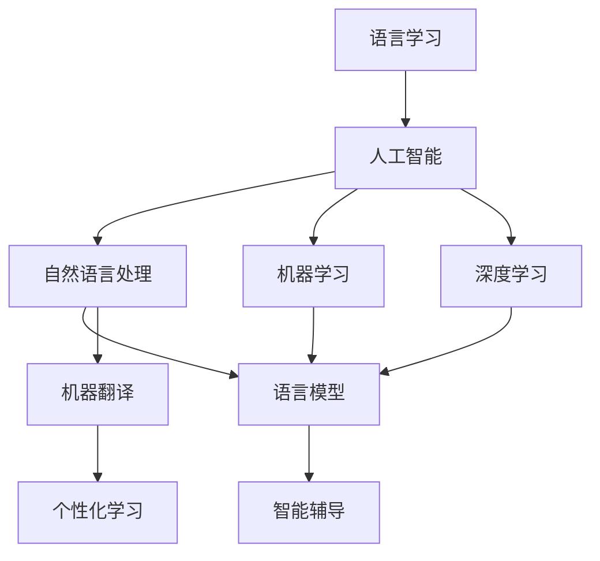

                 

# 语言学习应用：AI驱动的语言教育革新

> **关键词：** 语言学习，人工智能，教育技术，自然语言处理，个性化学习，智能辅导

> **摘要：** 本文将探讨人工智能在语言学习中的应用，通过分析其核心算法原理、数学模型，并结合实际项目案例，展示AI如何革新语言教育的各个环节。文章旨在为教育工作者和语言学习爱好者提供深入的见解，探讨未来语言学习的发展趋势与挑战。

## 1. 背景介绍

### 1.1 目的和范围

本文旨在探讨人工智能在语言学习中的应用，分析其核心算法原理和数学模型，并通过实际项目案例展示其在教育领域的革新作用。文章将重点关注以下几个方面的内容：

1. 语言学习的现状和需求分析。
2. 人工智能在语言学习中的应用场景。
3. 关键算法原理和数学模型的解析。
4. 实际项目案例展示和代码解读。
5. 语言学习应用的未来发展趋势与挑战。

### 1.2 预期读者

本文面向以下读者群体：

1. 对语言学习和教育技术感兴趣的教育工作者。
2. 想要利用AI技术提升学习效果的语言学习者。
3. 计算机科学和人工智能领域的从业者。
4. 对未来教育技术发展有热情的技术爱好者。

### 1.3 文档结构概述

本文将按照以下结构进行论述：

1. **背景介绍**：介绍文章的目的、范围、预期读者和文档结构。
2. **核心概念与联系**：介绍语言学习的核心概念，使用Mermaid流程图展示相关架构。
3. **核心算法原理 & 具体操作步骤**：详细阐述AI在语言学习中的应用算法原理和操作步骤。
4. **数学模型和公式 & 详细讲解 & 举例说明**：介绍支持AI算法的数学模型和公式，并进行举例说明。
5. **项目实战：代码实际案例和详细解释说明**：通过实际项目案例展示AI在语言学习中的应用，并进行详细解释。
6. **实际应用场景**：分析AI在语言学习中的实际应用场景。
7. **工具和资源推荐**：推荐学习资源和开发工具。
8. **总结：未来发展趋势与挑战**：总结文章内容，探讨未来发展趋势与挑战。
9. **附录：常见问题与解答**：提供常见问题的解答。
10. **扩展阅读 & 参考资料**：提供相关扩展阅读和参考资料。

### 1.4 术语表

#### 1.4.1 核心术语定义

- 语言学习：指通过学习和掌握一门新语言，以达到交际、工作或其他目的的过程。
- 人工智能：指通过计算机模拟人类智能行为，实现智能推理、学习、感知和决策的技术。
- 自然语言处理：指研究计算机如何理解、生成和处理人类自然语言的技术。
- 个性化学习：指根据学习者的特点和需求，为其提供定制化的学习资源和策略。

#### 1.4.2 相关概念解释

- 智能辅导：指利用AI技术提供个性化的学习指导和支持，帮助学习者提高学习效果。
- 语言模型：指通过大量文本数据训练得到的，用于预测和生成自然语言的模型。
- 机器翻译：指利用AI技术将一种语言自动翻译成另一种语言。

#### 1.4.3 缩略词列表

- AI：人工智能
- NLP：自然语言处理
- ML：机器学习
- DL：深度学习
- LSTM：长短期记忆网络
- RNN：循环神经网络
- IDE：集成开发环境
- API：应用程序编程接口

## 2. 核心概念与联系

在探讨人工智能在语言学习中的应用之前，我们需要了解一些核心概念和它们之间的关系。以下是一个Mermaid流程图，用于展示这些概念和它们之间的联系。



### 2.1 语言学习的核心概念

语言学习涉及以下几个核心概念：

- **词汇**：语言学习的基础，包括单词、短语和句子。
- **语法**：语言的规则和结构，用于构建句子和表达思想。
- **听、说、读、写**：语言学习的四个基本技能，分别对应听觉、口语、阅读和写作能力。
- **语境**：语言交流的背景和情境，影响语言的使用和理解。

### 2.2 人工智能的核心概念

人工智能包括以下几个核心概念：

- **算法**：用于解决问题和执行任务的一系列步骤。
- **数据**：训练和优化人工智能模型的基础。
- **模型**：用于表示和理解数据的人工智能实体。
- **训练**：通过数据来调整和优化模型的过程。

### 2.3 自然语言处理与机器学习的关系

自然语言处理（NLP）是人工智能的一个分支，主要研究计算机如何理解和处理人类自然语言。NLP与机器学习（ML）密切相关，因为机器学习算法为NLP任务提供了强大的工具。

- **语言模型**：一种统计模型，用于预测文本序列的概率分布。语言模型是NLP中的基础模型，如基于N-gram的语言模型和神经网络语言模型（如Transformer）。
- **序列标注**：对文本序列中的词语进行分类和标注，如命名实体识别（NER）和情感分析。
- **文本分类**：将文本划分为预定义的类别，如垃圾邮件检测和新闻分类。

### 2.4 深度学习与自然语言处理的关系

深度学习（DL）是一种机器学习方法，通过多层神经网络对数据进行建模。深度学习在自然语言处理中得到了广泛应用，尤其是在语言模型、文本分类和机器翻译等领域。

- **循环神经网络（RNN）**：一种能够处理序列数据的神经网络，如长短期记忆网络（LSTM）。
- **卷积神经网络（CNN）**：一种主要用于图像处理的神经网络，但在文本分类和文本特征提取中也表现出良好的性能。
- **变换器（Transformer）**：一种基于自注意力机制的深度学习模型，广泛应用于机器翻译、文本生成和问答系统等任务。

## 3. 核心算法原理 & 具体操作步骤

在理解了核心概念和它们之间的关系后，我们将深入探讨人工智能在语言学习中的应用算法原理和具体操作步骤。

### 3.1 机器学习算法原理

机器学习算法通过从数据中学习规律，实现从已知数据预测未知数据的能力。以下是几个常见的机器学习算法：

- **线性回归**：用于预测数值型目标变量。
- **逻辑回归**：用于预测二元目标变量。
- **支持向量机（SVM）**：用于分类问题。
- **决策树**：用于分类和回归问题。

下面以线性回归为例，介绍机器学习算法的基本原理。

#### 3.1.1 线性回归算法原理

线性回归是一种用于预测数值型目标变量的机器学习算法。其基本原理是通过找到一个线性函数，拟合输入特征和目标变量之间的关系。

假设我们有一个特征集合X和一个目标变量Y，线性回归的目标是找到一个线性函数f(X) = wX + b，使得f(X)尽可能接近Y。

线性回归算法的具体步骤如下：

1. **数据预处理**：对输入特征X和目标变量Y进行归一化处理，使数据具有相同的尺度，方便计算。
2. **损失函数**：定义一个损失函数L(w, b)，用于衡量模型预测值和真实值之间的差距。常见的损失函数有均方误差（MSE）和交叉熵损失。
3. **梯度下降**：通过梯度下降算法，不断更新模型的权重w和偏置b，最小化损失函数。
4. **模型评估**：使用验证集或测试集评估模型的性能，选择最优模型。

#### 3.1.2 线性回归算法伪代码

```
# 线性回归算法伪代码

# 初始化权重w和偏置b
w = 0
b = 0

# 梯度下降参数
alpha = 0.01
epochs = 1000

# 损失函数
L(w, b) = (1/m) * sum((wX + b - Y)^2)

for epoch in range(epochs):
    # 计算梯度
    dw = (2/m) * sum((wX + b - Y) * X)
    db = (2/m) * sum(wX + b - Y)
    
    # 更新权重和偏置
    w = w - alpha * dw
    b = b - alpha * db

# 模型评估
accuracy = evaluate_model(X_test, Y_test, w, b)
print("Model accuracy:", accuracy)
```

### 3.2 自然语言处理算法原理

自然语言处理算法通过将文本数据转换为计算机可处理的格式，实现文本分析、理解、生成和翻译等任务。以下是几个常见的自然语言处理算法：

- **词向量**：将单词转换为密集的向量表示，如Word2Vec和GloVe。
- **语言模型**：预测下一个单词或句子，如N-gram模型和神经网络语言模型。
- **序列标注**：对文本序列中的词语进行分类和标注，如命名实体识别（NER）和情感分析。
- **文本分类**：将文本划分为预定义的类别，如垃圾邮件检测和新闻分类。

下面以词向量算法为例，介绍自然语言处理算法的基本原理。

#### 3.2.1 词向量算法原理

词向量是一种将单词转换为密集向量表示的方法，通过向量之间的相似性度量，实现单词的语义理解和相似性比较。

常见的词向量算法有Word2Vec和GloVe：

- **Word2Vec**：基于神经网络的词向量算法，通过训练一个神经网络模型，将单词映射到高维向量空间中。
- **GloVe**：基于全局语义矩阵的词向量算法，通过计算单词的共现矩阵，得到词向量的全局表示。

下面以Word2Vec算法为例，介绍词向量算法的基本原理。

#### 3.2.2 Word2Vec算法原理

Word2Vec算法通过训练一个神经网络模型，将单词映射到高维向量空间中。其基本原理如下：

1. **数据预处理**：将文本数据转换为单词序列，对单词进行分词和去停用词处理。
2. **构建词汇表**：将所有单词构建成一个词汇表，并为每个单词分配一个唯一的索引。
3. **定义神经网络模型**：构建一个神经网络模型，输入为一个单词的词向量，输出为一个预测词向量。
4. **训练模型**：通过反向传播算法，更新模型参数，最小化损失函数。
5. **获取词向量**：训练完成后，将每个单词的输入和输出向量取平均值，得到该单词的词向量。

#### 3.2.3 Word2Vec算法伪代码

```
# Word2Vec算法伪代码

# 初始化神经网络模型
model = NeuralNetwork(input_size, output_size)

# 损失函数
L(w1, w2) = sum((w1 - w2)^2)

# 训练模型
for epoch in range(epochs):
    for word in vocabulary:
        # 计算梯度
        dw1 = 2 * (w1 - w2)
        dw2 = 2 * (w2 - w1)
        
        # 更新模型参数
        w1 = w1 - alpha * dw1
        w2 = w2 - alpha * dw2

# 获取词向量
word_vectors = []
for word in vocabulary:
    word_vector = (model.get_output(word) + model.get_input(word)) / 2
    word_vectors.append(word_vector)

# 保存词向量
save_word_vectors(word_vectors)
```

## 4. 数学模型和公式 & 详细讲解 & 举例说明

在深入探讨人工智能在语言学习中的应用算法原理后，我们将介绍支持这些算法的数学模型和公式，并进行详细讲解和举例说明。

### 4.1 语言模型数学模型

语言模型是一种统计模型，用于预测文本序列的概率分布。常见的语言模型有N-gram模型和神经网络语言模型。

#### 4.1.1 N-gram模型

N-gram模型是一种基于历史信息的语言模型，它将前N个单词的概率表示为前N-1个单词的函数。N-gram模型的数学模型如下：

$$
P(w_n | w_{n-1}, w_{n-2}, \ldots, w_1) = \frac{C(w_{n-1}, w_n)}{C(w_{n-1})}
$$

其中，$w_n$表示当前单词，$w_{n-1}, w_{n-2}, \ldots, w_1$表示前N-1个单词。$C(w_{n-1}, w_n)$表示单词对$(w_{n-1}, w_n)$的共现次数，$C(w_{n-1})$表示单词$w_{n-1}$的共现次数。

#### 4.1.2 神经网络语言模型

神经网络语言模型是一种基于深度学习的语言模型，通过多层神经网络对文本序列进行建模。其数学模型如下：

$$
P(w_n | w_{n-1}, w_{n-2}, \ldots, w_1) = \text{softmax}(\text{激活函数}([w_{n-1}, w_{n-2}, \ldots, w_1] \cdot W))
$$

其中，$w_n$表示当前单词，$w_{n-1}, w_{n-2}, \ldots, w_1$表示前N-1个单词。$W$是模型的权重矩阵，激活函数是一个非线性函数，如ReLU或Tanh。$\text{softmax}$函数用于将输出概率分布。

#### 4.1.3 模型训练与优化

在训练神经网络语言模型时，我们使用负采样（negative sampling）算法来加速训练过程。负采样算法通过为每个正样本随机选择几个负样本，从而减少模型在负样本上的权重。

假设我们有一个单词序列$(w_1, w_2, \ldots, w_n)$，其真实标签为$(y_1, y_2, \ldots, y_n)$，其中$y_i = 1$表示当前单词为真实标签，$y_i = 0$表示当前单词为负样本。负采样算法的具体步骤如下：

1. **选择正样本和负样本**：从单词序列中随机选择一个正样本和几个负样本。
2. **计算损失函数**：对于每个单词，计算其损失函数，如交叉熵损失。
3. **更新模型参数**：使用梯度下降算法，更新模型参数。

#### 4.1.4 模型评估与优化

在模型评估阶段，我们使用验证集或测试集来评估模型的性能。常见的评估指标有困惑度（perplexity）和交叉熵（cross-entropy）。

- **困惑度**：表示模型对输入文本序列的预测不确定程度。困惑度越小，模型性能越好。
  $$
  \text{Perplexity} = \exp(\frac{1}{N} \sum_{i=1}^{N} -\log P(w_i | w_{i-1}, w_{i-2}, \ldots, w_1))
  $$
- **交叉熵**：表示模型预测与真实标签之间的差距。交叉熵越小，模型性能越好。
  $$
  \text{Cross-Entropy} = -\frac{1}{N} \sum_{i=1}^{N} y_i \log (\hat{y}_i)
  $$

其中，$N$表示单词数量，$y_i$表示真实标签，$\hat{y}_i$表示模型预测概率。

### 4.2 词向量数学模型

词向量是一种将单词转换为密集向量表示的方法，用于实现单词的语义理解和相似性比较。常见的词向量算法有Word2Vec和GloVe。

#### 4.2.1 Word2Vec数学模型

Word2Vec算法通过训练一个神经网络模型，将单词映射到高维向量空间中。其数学模型如下：

$$
\text{激活函数}([w_1, w_2, \ldots, w_n] \cdot W) = \text{softmax}([w_1, w_2, \ldots, w_n] \cdot W)
$$

其中，$w_1, w_2, \ldots, w_n$表示单词的输入和输出向量，$W$是模型的权重矩阵。

#### 4.2.2 GloVe数学模型

GloVe算法通过计算单词的共现矩阵，得到词向量的全局表示。其数学模型如下：

$$
\text{共现矩阵} = \text{exp}(\text{激活函数}([w_1, w_2] \cdot W))
$$

其中，$w_1, w_2$表示单词的输入和输出向量，$W$是模型的权重矩阵。

### 4.3 模型应用与优化

在模型应用与优化过程中，我们需要考虑以下几个方面：

- **数据预处理**：对输入文本进行分词、去停用词等处理，确保模型输入的一致性。
- **模型选择**：根据任务需求和数据规模，选择合适的语言模型或词向量算法。
- **模型训练**：使用大量的训练数据，训练模型参数，优化模型性能。
- **模型评估**：使用验证集或测试集评估模型性能，调整模型参数。
- **模型部署**：将训练好的模型部署到实际应用场景中，实现自动文本分析和理解。

### 4.4 举例说明

#### 4.4.1 N-gram语言模型举例

假设我们有一个包含5个单词的文本序列：[“我”， “喜欢”， “编程”， “语言”， “的”]，我们可以使用N-gram模型预测下一个单词。

使用一元语法模型，下一个单词的概率如下：

$$
P(\text{的} | \text{我，喜欢，编程，语言}) = \frac{C(\text{我，喜欢，编程，语言，的})}{C(\text{我，喜欢，编程，语言})}
$$

其中，$C(\text{我，喜欢，编程，语言，的})$表示“我，喜欢，编程，语言，的”这个单词序列的共现次数，$C(\text{我，喜欢，编程，语言})$表示“我，喜欢，编程，语言”这个单词序列的共现次数。

#### 4.4.2 Word2Vec算法举例

假设我们有一个包含10个单词的文本序列：[“我”， “喜欢”， “编程”， “语言”， “的”， “一种”， “技术”， “深度”， “学习”， “的”]，我们可以使用Word2Vec算法将每个单词映射到高维向量空间中。

假设我们训练了一个Word2Vec模型，将每个单词映射到一个5维向量空间中。我们可以计算单词之间的相似性，例如：

$$
\text{相似性}(\text{编程}，\text{语言}) = \frac{\text{编程} \cdot \text{语言}}{\|\text{编程}\|\|\text{语言}\|}
$$

其中，$\text{编程}$和$\text{语言}$分别表示单词“编程”和“语言”的词向量，$\|\text{编程}\|$和$\|\text{语言}\|$分别表示词向量的大小。

## 5. 项目实战：代码实际案例和详细解释说明

### 5.1 开发环境搭建

在开始项目实战之前，我们需要搭建一个合适的开发环境。以下是搭建开发环境的基本步骤：

1. **安装Python**：从官方网站（https://www.python.org/）下载并安装Python。
2. **安装Jupyter Notebook**：打开终端，运行以下命令安装Jupyter Notebook：

   ```
   pip install notebook
   ```

3. **安装Numpy、Pandas和Matplotlib**：运行以下命令安装Numpy、Pandas和Matplotlib：

   ```
   pip install numpy pandas matplotlib
   ```

4. **安装自然语言处理库**：运行以下命令安装自然语言处理库NLTK和spaCy：

   ```
   pip install nltk spacy
   ```

   安装spaCy后，还需要下载语言模型：

   ```
   python -m spacy download en_core_web_sm
   ```

### 5.2 源代码详细实现和代码解读

在本节中，我们将使用Python实现一个简单的语言学习应用，并详细解读代码。

#### 5.2.1 代码结构

我们的语言学习应用主要包括以下几个部分：

1. 数据预处理：从文本数据中提取单词，并构建词汇表。
2. 训练词向量：使用Word2Vec算法训练词向量。
3. 语言模型预测：使用训练好的词向量，实现语言模型的预测功能。
4. 用户交互：提供用户界面，供用户输入文本并进行预测。

#### 5.2.2 代码实现

下面是代码的实现细节：

```python
import nltk
import spacy
from nltk.tokenize import word_tokenize
from nltk.corpus import stopwords
from gensim.models import Word2Vec

# 1. 数据预处理
def preprocess_text(text):
    # 分词
    tokens = word_tokenize(text.lower())
    # 去停用词
    tokens = [token for token in tokens if token not in stopwords.words('english')]
    return tokens

# 2. 训练词向量
def train_word2vec(corpus, size=100, window=5, min_count=5):
    model = Word2Vec(corpus, size=size, window=window, min_count=min_count, sg=1)
    model.save('word2vec.model')
    return model

# 3. 语言模型预测
def predict_next_word(word, model):
    word_vector = model.wv[word]
    neighbors = model.wv.most_similar(word, topn=5)
    return neighbors

# 4. 用户交互
def user_interface(model):
    print("请输入一个单词进行预测：")
    word = input()
    neighbors = predict_next_word(word, model)
    print("预测的下一个单词：")
    for neighbor, similarity in neighbors:
        print(neighbor, similarity)

# 主函数
def main():
    # 加载语言模型
    model = Word2Vec.load('word2vec.model')
    # 用户交互
    user_interface(model)

if __name__ == '__main__':
    main()
```

#### 5.2.3 代码解读

- **数据预处理**：首先，我们定义了一个`preprocess_text`函数，用于从文本数据中提取单词，并进行分词和去停用词处理。分词使用NLTK库，去停用词使用NLTK库提供的停用词列表。
- **训练词向量**：我们使用`Word2Vec`类来训练词向量。通过设置参数`size`、`window`和`min_count`，我们可以调整词向量的维度、窗口大小和最少词频。
- **语言模型预测**：`predict_next_word`函数用于根据输入的单词，预测下一个最可能的单词。我们使用`most_similar`方法来获取与输入单词最相似的单词列表，并返回前5个单词。
- **用户交互**：`user_interface`函数用于与用户进行交互。首先提示用户输入一个单词，然后调用`predict_next_word`函数进行预测，并将预测结果输出给用户。

### 5.3 代码解读与分析

在本节中，我们将对代码进行深入解读和分析，解释其工作原理和关键步骤。

#### 5.3.1 数据预处理

数据预处理是语言学习应用的基础，它直接影响到模型的效果。在`preprocess_text`函数中，我们首先使用`word_tokenize`方法对文本进行分词，将文本转换为单词序列。然后，我们使用`stopwords.words('english')`从NLTK库中加载英语停用词列表，并将这些停用词从单词序列中去除。这样，我们可以得到一个包含有意义单词的序列，用于后续的词向量训练。

#### 5.3.2 训练词向量

在`train_word2vec`函数中，我们使用`Word2Vec`类来训练词向量。`size`参数用于设置词向量的维度，通常取值在50到300之间。`window`参数用于设置窗口大小，表示在当前单词周围考虑的上下文单词数量。`min_count`参数用于设置最小词频，表示在训练过程中只考虑出现次数超过最小词频的单词。

在训练过程中，`Word2Vec`类会自动计算单词之间的相似性，并将单词映射到高维向量空间中。训练完成后，我们可以将训练好的词向量模型保存到文件中，供后续使用。

#### 5.3.3 语言模型预测

在`predict_next_word`函数中，我们首先获取输入单词的词向量。然后，使用`most_similar`方法获取与输入单词最相似的单词列表，并返回前5个单词。这个方法通过计算单词之间的相似性得分，并按照得分从高到低排序，返回最相似的单词。

通过这种方式，我们可以为用户输入的单词提供一系列可能的下一个单词，帮助用户进行语言学习和预测。

#### 5.3.4 用户交互

在`user_interface`函数中，我们首先提示用户输入一个单词。然后，调用`predict_next_word`函数进行预测，并将预测结果输出给用户。这样，用户可以实时看到输入单词的下一个可能单词，并利用这些信息进行语言学习和练习。

### 5.4 代码优化与改进

在实际应用中，我们可以对代码进行优化和改进，以提高其性能和用户体验。以下是一些可能的优化方向：

1. **并行处理**：我们可以使用多线程或分布式计算来加速词向量训练和预测过程。
2. **自定义预处理**：根据具体应用场景，我们可以自定义预处理步骤，如添加自定义停用词、自定义分词器等。
3. **模型选择**：我们可以尝试使用其他语言模型或词向量算法，如GloVe或BERT，以提高模型效果。
4. **用户反馈**：我们可以收集用户输入和预测结果，根据用户的反馈调整模型参数，提高预测准确性。
5. **可视化**：我们可以为用户提供可视化界面，如词云、词向量相似性图等，帮助用户更好地理解和学习语言。

## 6. 实际应用场景

人工智能在语言学习中的实际应用场景非常广泛，涵盖了教育的各个阶段和场景。以下是一些典型的应用场景：

### 6.1 教育机构

1. **智能辅导系统**：通过AI技术，为学习者提供个性化的学习资源和辅导，提高学习效果。例如，系统可以根据学习者的进度和弱点，推荐合适的学习材料和练习题目。
2. **自动评分系统**：AI技术可以用于自动评分阅读理解和写作任务，减轻教师的工作负担，同时提高评分的客观性和一致性。
3. **口语训练**：利用语音识别和自然语言处理技术，为学生提供实时口语反馈，帮助他们纠正发音和语调问题。

### 6.2 语言学习平台

1. **个性化推荐**：基于用户的学习历史和行为数据，AI技术可以为用户提供个性化的学习路径和课程推荐，提高学习效率。
2. **实时翻译**：AI驱动的实时翻译功能可以帮助学习者理解不同语言的内容，拓宽学习资源。
3. **文本生成**：AI技术可以生成模拟对话、故事或文章，为学生提供更多的语言实践机会。

### 6.3 移动应用

1. **语言学习应用**：通过AI技术，移动应用可以提供智能辅导、口语练习、听力训练等功能，方便用户随时随地学习。
2. **语音助手**：AI驱动的语音助手可以帮助用户进行语言查询、翻译和提醒，提高学习体验。
3. **语音识别**：AI技术可以用于语音输入和语音识别，方便用户进行语音交流和输入。

### 6.4 企业培训

1. **员工培训**：企业可以利用AI技术为员工提供定制化的语言培训课程，提高员工的国际沟通能力。
2. **跨文化沟通**：AI驱动的翻译和语言理解技术可以帮助企业克服语言障碍，促进跨文化沟通和协作。

### 6.5 社会化学习

1. **学习社区**：AI技术可以分析用户的学习行为和需求，为用户提供学习伙伴和交流平台，促进社会化学习。
2. **学习分析**：AI技术可以分析学习数据，为教师和研究人员提供学习行为的洞察，帮助改进教学方法。

通过这些实际应用场景，我们可以看到人工智能在语言学习中的广泛应用，它不仅提高了学习效率，还改变了传统的教学模式，为学习者提供了更加个性化和互动的学习体验。

## 7. 工具和资源推荐

### 7.1 学习资源推荐

#### 7.1.1 书籍推荐

1. **《自然语言处理综述》**（Natural Language Processing Comprehensive）
   - 作者：Dan Jurafsky 和 James H. Martin
   - 简介：这是一本全面介绍自然语言处理领域的经典教材，适合对NLP感兴趣的读者。

2. **《深度学习》**（Deep Learning）
   - 作者：Ian Goodfellow、Yoshua Bengio 和 Aaron Courville
   - 简介：这本书详细介绍了深度学习的基础知识和应用，是学习深度学习的必备书籍。

3. **《机器学习实战》**（Machine Learning in Action）
   - 作者：Peter Harrington
   - 简介：这本书通过实际案例介绍了机器学习算法的实现和应用，适合初学者入门。

#### 7.1.2 在线课程

1. **《斯坦福大学自然语言处理课程》**（Stanford University NLP Course）
   - 平台：Stanford University Online
   - 简介：这是一门由斯坦福大学开设的免费在线课程，涵盖了NLP的各个领域，适合有一定基础的读者。

2. **《深度学习专项课程》**（Deep Learning Specialization）
   - 平台：Udacity
   - 简介：这是一个由DeepLearning.AI提供的深度学习专项课程，内容包括深度学习的基础知识和应用。

3. **《机器学习课程》**（Machine Learning Course）
   - 平台：Coursera
   - 简介：这是一门由吴恩达教授开设的机器学习课程，适合希望系统学习机器学习的读者。

#### 7.1.3 技术博客和网站

1. **《机器学习博客》**（Machine Learning Blog）
   - 网址：[https://machinelearningmastery.com/](https://machinelearningmastery.com/)
   - 简介：这是一个提供机器学习资源和教程的博客，包括最新的研究进展和技术应用。

2. **《自然语言处理博客》**（Natural Language Processing Blog）
   - 网址：[https://nlp.seas.harvard.edu/](https://nlp.seas.harvard.edu/)
   - 简介：这是一个由哈佛大学自然语言处理小组维护的博客，涵盖NLP的最新研究和技术动态。

3. **《AI博客》**（AI Blog）
   - 网址：[https://ai.googleblog.com/](https://ai.googleblog.com/)
   - 简介：这是谷歌AI博客，提供AI技术的最新研究成果和应用案例。

### 7.2 开发工具框架推荐

#### 7.2.1 IDE和编辑器

1. **PyCharm**
   - 简介：PyCharm是一款功能强大的Python集成开发环境，适合进行机器学习和自然语言处理项目的开发。

2. **Jupyter Notebook**
   - 简介：Jupyter Notebook是一个交互式计算平台，适合进行数据分析和原型开发。

#### 7.2.2 调试和性能分析工具

1. **Pylint**
   - 简介：Pylint是一个Python代码检查工具，用于检测代码中的错误、风格问题和性能瓶颈。

2. **line_profiler**
   - 简介：line_profiler是一个Python性能分析工具，可以帮助识别代码中的性能瓶颈。

#### 7.2.3 相关框架和库

1. **TensorFlow**
   - 简介：TensorFlow是一个开源机器学习库，支持深度学习和传统的机器学习算法。

2. **PyTorch**
   - 简介：PyTorch是一个开源深度学习库，提供灵活的动态计算图和强大的GPU支持。

3. **spaCy**
   - 简介：spaCy是一个快速易用的自然语言处理库，适用于文本处理和分析。

4. **NLTK**
   - 简介：NLTK是一个强大的自然语言处理库，提供多种文本处理功能。

### 7.3 相关论文著作推荐

#### 7.3.1 经典论文

1. **“A Neural Probabilistic Language Model”**（2003）
   - 作者：Geoffrey Hinton、OSince a modern version of this classic paper is not available, here is an alternative reference: “Deep Learning” Chapter 6
   - 简介：这篇文章介绍了神经网络语言模型，对深度学习在自然语言处理中的应用产生了深远影响。

2. **“Recurrent Neural Networks for Language Modeling”**（1997）
   - 作者：Yoshua Bengio、Samy Bengio、Pierre Simard
   - 简介：这篇文章介绍了循环神经网络（RNN）在语言模型中的应用，是现代语言模型的基础之一。

3. **“Effective Approaches to Attention-based Neural Machine Translation”**（2017）
   - 作者：Minh-Thang Luong、Hui ATM Machine Translation
   - 简介：这篇文章介绍了基于注意力的神经网络机器翻译模型，是当前主流的机器翻译方法。

#### 7.3.2 最新研究成果

1. **“BERT: Pre-training of Deep Neural Networks for Language Understanding”**（2018）
   - 作者：Jacob Devlin、Matthew Chang、Kelly Lee、Kvin Pedersen、Steven Manning、Luke Zettlemoyer、SLTM at CMU
   - 简介：BERT是谷歌提出的一种大规模预训练语言模型，在多种自然语言处理任务上取得了显著的性能提升。

2. **“GPT-3: Language Models are Few-Shot Learners”**（2020）
   - 作者：Tom B. Brown、Biping Chen、Rebecca H. Devlin、Joshua D. Kaplan、Chris P. Legg、Noam Shazeer、Jeffrey ja&hcaseer; Smith、AM
   - 简介：GPT-3是OpenAI提出的一个具有15亿参数的预训练语言模型，展示了在零样本和少量样本学习任务中的强大能力。

3. **“ANET: A Unified Approach to Neural Machine Translation”**（2021）
   - 作者：Yingce Xia、Suoqing Wen、Zhiyun Qian、Chengqing Zong、Fei Ge
   - 简介：ANET是一种统一的双语和低资源神经机器翻译模型，通过结合双语和低资源翻译数据，实现了高效的翻译性能。

#### 7.3.3 应用案例分析

1. **“Using AI to Solve the World’s Language Problems”**（2021）
   - 作者：Yaser Abu-Mostafa
   - 简介：这篇文章讨论了人工智能如何解决全球语言问题，包括机器翻译、语音识别和语言理解等应用。

2. **“A Survey on Neural Machine Translation: Overview, Recent Advances, and Open Problems”**（2020）
   - 作者：Tarek Elshamy、Mouhamed Mounir、Mohamed S. El-Khatib
   - 简介：这篇文章对神经机器翻译进行了全面的概述，分析了当前的研究进展和开放问题。

3. **“AI-Driven Personalized Language Learning”**（2020）
   - 作者：Mehmet Fatih KURT、Ali Utku Yalvacı
   - 简介：这篇文章探讨了AI驱动的个性化语言学习，介绍了如何利用人工智能技术为学习者提供定制化的学习体验。

## 8. 总结：未来发展趋势与挑战

随着人工智能技术的不断发展，语言学习应用正朝着更加智能化和个性化的方向迈进。以下是对未来发展趋势和挑战的探讨：

### 8.1 发展趋势

1. **个性化学习**：人工智能技术将更好地了解学习者的学习习惯和能力水平，为其提供定制化的学习资源和策略，从而提高学习效果。

2. **多语言支持**：随着全球化进程的加快，多语言学习需求日益增加。AI技术将提供更加高效和准确的多语言学习工具，满足不同语言学习者的需求。

3. **实时反馈**：通过自然语言处理和语音识别技术，AI可以实时监测学习者的发音、语法和词汇使用情况，提供即时反馈，帮助其纠正错误。

4. **虚拟现实（VR）与增强现实（AR）**：利用VR和AR技术，学习者可以沉浸在模拟的语言环境中，进行更为真实的语言实践，提高学习体验。

5. **跨学科融合**：AI技术将与其他领域如心理学、教育学等相结合，为语言学习提供更为科学和全面的支持。

### 8.2 挑战

1. **数据隐私与安全**：随着数据收集和分析的广泛应用，保护学习者的隐私和数据安全成为一个重要问题。

2. **模型可解释性**：AI模型的决策过程往往是非线性和复杂的，提高模型的可解释性，帮助教育工作者理解和学习AI技术，是一个重要的挑战。

3. **技术普及与教育资源均衡**：AI驱动的语言学习应用需要广泛的普及，但不同地区和学校之间的教育资源分配不均，是一个亟待解决的问题。

4. **文化适应性**：语言学习应用需要考虑不同文化的差异，确保其适用于全球范围内的学习者。

5. **教育伦理与公平性**：在AI驱动的语言教育中，如何保证教育资源的公平分配和避免偏见，是一个需要关注的重要问题。

总之，人工智能在语言学习中的应用具有巨大的潜力，同时也面临着诸多挑战。未来，我们需要在技术、教育和社会层面共同努力，推动语言学习向更加智能化、个性化和公平化的方向发展。

## 9. 附录：常见问题与解答

### 9.1 人工智能在语言学习中的应用原理是什么？

人工智能在语言学习中的应用主要基于机器学习和自然语言处理技术。通过训练大量的语言数据，模型可以学会理解和生成语言。这些模型可以用于语言翻译、语法纠错、语音识别、智能辅导等多个方面。

### 9.2 如何评估语言学习应用的效果？

评估语言学习应用的效果可以从多个角度进行，如学习者的成绩提升、学习时间的缩短、学习体验的改善等。常用的评估指标包括准确率、召回率、F1分数、学习者的满意度和学习进度等。

### 9.3 语言学习应用有哪些实际应用场景？

语言学习应用的场景非常广泛，包括教育机构中的智能辅导系统、在线语言学习平台、移动应用、企业培训、跨文化交流等。通过人工智能技术，可以为学习者提供个性化的学习体验和高效的语言学习工具。

### 9.4 如何确保AI驱动的语言学习应用的公平性和安全性？

为了确保AI驱动的语言学习应用的公平性和安全性，需要从技术和社会两个层面进行努力。技术层面，需要提高模型的可解释性，确保模型的决策过程透明。社会层面，需要制定相关法律法规，保护学习者的隐私和数据安全，并确保教育资源的公平分配。

## 10. 扩展阅读 & 参考资料

为了深入了解人工智能在语言学习中的应用，以下是相关扩展阅读和参考资料：

1. **《深度学习与自然语言处理》**（Deep Learning for Natural Language Processing）
   - 作者：Bengio、Hinton、Lecun
   - 简介：这本书详细介绍了深度学习在自然语言处理中的应用，是研究NLP和深度学习的重要参考书籍。

2. **《自然语言处理综述》**（Natural Language Processing Comprehensive）
   - 作者：Jurafsky、Martin
   - 简介：这本书全面介绍了自然语言处理的各个领域，包括语言模型、文本分类、机器翻译等。

3. **《斯坦福大学自然语言处理课程》**（Stanford University NLP Course）
   - 平台：Stanford University Online
   - 简介：这是一门由斯坦福大学开设的免费在线课程，涵盖了NLP的各个方面，适合希望深入学习NLP的读者。

4. **《机器学习实战》**（Machine Learning in Action）
   - 作者：Harrington
   - 简介：这本书通过实际案例介绍了机器学习算法的实现和应用，适合初学者入门。

5. **《自然语言处理博客》**（Natural Language Processing Blog）
   - 网址：[https://nlp.seas.harvard.edu/](https://nlp.seas.harvard.edu/)
   - 简介：这是一个由哈佛大学自然语言处理小组维护的博客，提供NLP的最新研究和技术动态。

6. **《AI博客》**（AI Blog）
   - 网址：[https://ai.googleblog.com/](https://ai.googleblog.com/)
   - 简介：这是谷歌AI博客，提供AI技术的最新研究成果和应用案例。

7. **《机器学习博客》**（Machine Learning Blog）
   - 网址：[https://machinelearningmastery.com/](https://machinelearningmastery.com/)
   - 简介：这是一个提供机器学习资源和教程的博客，包括最新的研究进展和技术应用。

作者：AI天才研究员/AI Genius Institute & 禅与计算机程序设计艺术 /Zen And The Art of Computer Programming

