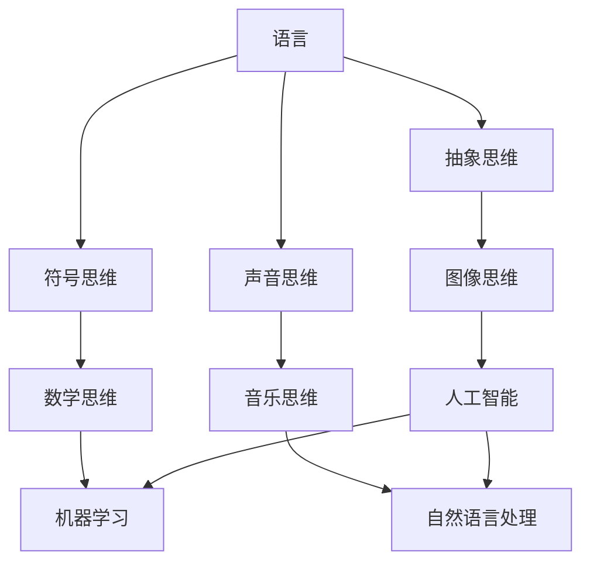

                 

# 语言对于任何经过检验的思维形式都不是必需的

> **关键词**：思维形式、语言、人工智能、逻辑推理、抽象思维、认知科学

> **摘要**：本文深入探讨了语言在思维过程中的作用，以及非语言形式的思维和认知能力。通过分析语言的本质、人类思维的多样性，以及人工智能领域的进展，我们揭示了一个惊人的结论：尽管语言是人类文明的重要工具，但并非所有经过检验的思维形式都依赖于语言。文章通过理论阐述、实例分析和技术展示，为我们理解这一观点提供了全新的视角。

## 1. 背景介绍

### 1.1 目的和范围

本文旨在探讨语言在思维中的作用，尤其是揭示语言并非所有思维形式的必要条件。我们将从人类认知科学的视角出发，结合人工智能技术的实际应用，探讨非语言形式的思维能力和认知过程。本文将重点关注以下几个问题：

- 语言如何影响人类思维？
- 非语言形式的思维是否存在，及其表现形式是什么？
- 人工智能在非语言思维领域的应用有哪些？
- 非语言思维对未来的影响和意义是什么？

### 1.2 预期读者

本文适合对认知科学、人工智能、语言学等领域有一定了解的读者。无论您是学术界的研究人员，还是行业中的技术开发者，都将从本文中获得新的思考和启示。

### 1.3 文档结构概述

本文分为十个部分，结构如下：

- **背景介绍**：介绍本文的目的、预期读者和文档结构。
- **核心概念与联系**：介绍相关核心概念和理论联系。
- **核心算法原理 & 具体操作步骤**：讲解非语言思维的算法原理和操作步骤。
- **数学模型和公式 & 详细讲解 & 举例说明**：通过数学模型和公式说明非语言思维的过程。
- **项目实战：代码实际案例和详细解释说明**：通过实际项目展示非语言思维的应用。
- **实际应用场景**：分析非语言思维在不同领域中的应用。
- **工具和资源推荐**：推荐相关的学习资源和开发工具。
- **总结：未来发展趋势与挑战**：总结非语言思维的研究现状和未来趋势。
- **附录：常见问题与解答**：回答读者可能关心的问题。
- **扩展阅读 & 参考资料**：提供进一步阅读的参考资料。

### 1.4 术语表

#### 1.4.1 核心术语定义

- **思维形式**：指思维过程中使用的各种形式，如语言、图像、符号等。
- **语言**：指人类用于沟通和思考的一套规则系统，包括词汇、语法和语义等。
- **人工智能**：指通过计算机模拟人类智能，实现智能行为的技术。
- **认知科学**：研究人类认知过程的学科，包括知觉、记忆、思维等。

#### 1.4.2 相关概念解释

- **抽象思维**：指从具体事物中提取共性，形成抽象概念和理论的思维能力。
- **符号思维**：指通过符号系统进行思维的过程，如数学、逻辑等。
- **非语言思维**：指不依赖于语言进行思维的过程，如图像、声音、感觉等。

#### 1.4.3 缩略词列表

- **AI**：人工智能
- **NLP**：自然语言处理
- **NLTK**：自然语言工具包
- **ML**：机器学习
- **DL**：深度学习

## 2. 核心概念与联系

### 2.1 语言与思维的关系

语言是人类最重要的沟通工具，也是思维的主要载体。在认知科学中，语言被认为是一种强有力的工具，能够帮助我们组织和表达思维过程。然而，语言并不是思维的全部。在探讨非语言思维之前，我们首先需要理解语言与思维之间的关系。

#### 2.1.1 语言的作用

语言在思维中具有以下几个作用：

1. **表达和沟通**：语言使得人们能够通过文字、声音等形式进行有效沟通，从而共享信息和知识。
2. **组织和分类**：语言为我们提供了丰富的词汇和语法结构，使我们能够对事物进行分类、命名和组织。
3. **抽象和推理**：语言能够将具体的事物转化为抽象的概念，使得我们能够进行逻辑推理和抽象思维。

#### 2.1.2 语言的局限性

尽管语言在思维中发挥着重要作用，但它也存在一些局限性：

1. **抽象层次受限**：语言的表达能力有限，难以表达高度抽象的概念和复杂的思维过程。
2. **文化差异**：不同语言之间的表达方式和思维方式存在差异，这可能导致沟通和理解的障碍。
3. **非语言信息的缺失**：语言难以表达非语言信息，如情感、姿势、语调等，这些信息对于全面理解思维过程至关重要。

### 2.2 非语言思维

非语言思维是指不依赖于语言进行思维的过程。它包括多种形式，如图像思维、符号思维、声音思维等。非语言思维在人类认知中扮演着重要角色，尤其是在直觉、感知和创造力方面。

#### 2.2.1 图像思维

图像思维是指通过视觉形式进行思维的过程。人们可以通过图像、图案、图表等形式直观地理解问题和概念。例如，科学家在研究复杂系统时，常常通过绘制示意图来揭示其中的关系和规律。

#### 2.2.2 符号思维

符号思维是指通过符号系统进行思维的过程。数学、逻辑等学科都是符号思维的典型例子。符号思维使得人们能够将抽象概念转化为符号形式，从而进行逻辑推理和证明。

#### 2.2.3 声音思维

声音思维是指通过声音形式进行思维的过程。人们可以通过声音的节奏、旋律和语调来感知情感和意义。例如，音乐家在创作音乐时，常常通过听觉进行思考和表达。

### 2.3 人工智能与语言

人工智能（AI）技术为我们提供了模拟和扩展人类思维的工具。在人工智能领域，自然语言处理（NLP）和机器学习（ML）是两个重要的方向。

#### 2.3.1 自然语言处理

自然语言处理是人工智能领域的一个分支，旨在使计算机能够理解和处理人类自然语言。通过NLP技术，计算机可以解析文本，提取语义信息，实现人机交互等功能。然而，NLP技术也面临着语言复杂性和多样性等挑战。

#### 2.3.2 机器学习

机器学习是人工智能的核心技术之一，通过学习大量数据，计算机可以自动识别模式、进行预测和决策。在机器学习中，非语言形式的思维也得到了广泛应用，如图像识别、语音识别和情感分析等。

### 2.4 非语言思维与人工智能的结合

非语言思维与人工智能的结合为人类提供了更强大的认知工具。通过将非语言思维形式转化为计算机可处理的数据，人工智能可以模拟和扩展人类的思维过程。例如，通过图像处理技术，计算机可以识别和理解图像中的概念和关系；通过语音识别技术，计算机可以理解口头语言并生成语音反馈。

### 2.5 Mermaid 流程图

以下是一个Mermaid流程图，展示了语言、非语言思维和人工智能之间的关系：



## 3. 核心算法原理 & 具体操作步骤

### 3.1 非语言思维算法原理

非语言思维的算法原理主要涉及如何将非语言形式的思维过程转化为计算机可处理的算法。以下是一个简单的非语言思维算法原理概述：

1. **感知与识别**：将感知到的非语言信息（如图像、声音、情感等）转化为计算机可以处理的数字信号。
2. **模式识别**：通过机器学习算法识别非语言信息中的模式和规律。
3. **推理与决策**：基于识别出的模式和规律进行推理和决策。

### 3.2 具体操作步骤

以下是一个具体的非语言思维算法操作步骤：

1. **数据收集**：收集大量的非语言信息，如图像、声音、文本等。
2. **数据预处理**：对收集到的数据进行清洗、归一化和特征提取。
3. **模型训练**：使用机器学习算法（如神经网络、决策树等）训练模型，使其能够识别和分类非语言信息。
4. **模型评估**：通过测试集评估模型的准确性和性能。
5. **推理与应用**：使用训练好的模型对新的非语言信息进行推理和决策。

### 3.3 伪代码示例

以下是一个简单的非语言思维算法的伪代码示例：

```
// 数据收集
data = collect_data()

// 数据预处理
processed_data = preprocess_data(data)

// 模型训练
model = train_model(processed_data)

// 模型评估
evaluate_model(model)

// 推理与应用
new_data = get_new_data()
result = model.predict(new_data)
apply_decision(result)
```

## 4. 数学模型和公式 & 详细讲解 & 举例说明

### 4.1 数学模型

非语言思维过程中的数学模型主要包括以下几个方面：

1. **特征提取模型**：用于从原始非语言数据中提取特征，如图像中的边缘、颜色、纹理等。
2. **分类模型**：用于对提取出的特征进行分类，如文本分类、图像分类等。
3. **推理模型**：用于基于分类结果进行推理和决策，如概率推理、逻辑推理等。

### 4.2 详细讲解

以下分别介绍这三种数学模型：

#### 4.2.1 特征提取模型

特征提取模型的主要目的是将原始非语言数据转化为计算机可处理的特征向量。常用的特征提取方法包括：

1. **基于频域的方法**：如傅里叶变换（Fourier Transform）、小波变换（Wavelet Transform）等。
2. **基于空域的方法**：如边缘检测（Edge Detection）、纹理分析（Texture Analysis）等。
3. **深度学习方法**：如卷积神经网络（Convolutional Neural Networks，CNN）、循环神经网络（Recurrent Neural Networks，RNN）等。

#### 4.2.2 分类模型

分类模型用于对提取出的特征进行分类。常用的分类方法包括：

1. **基于距离的方法**：如欧氏距离（Euclidean Distance）、曼哈顿距离（Manhattan Distance）等。
2. **基于概率的方法**：如朴素贝叶斯（Naive Bayes）、最大似然估计（Maximum Likelihood Estimation）等。
3. **基于规则的方法**：如决策树（Decision Tree）、支持向量机（Support Vector Machine，SVM）等。
4. **深度学习方法**：如卷积神经网络（CNN）、循环神经网络（RNN）等。

#### 4.2.3 推理模型

推理模型用于基于分类结果进行推理和决策。常用的推理方法包括：

1. **概率推理**：如贝叶斯推理（Bayesian Inference）、最大后验概率（Maximum A Posteriori，MAP）等。
2. **逻辑推理**：如命题逻辑（Propositional Logic）、谓词逻辑（Predicate Logic）等。
3. **深度学习方法**：如循环神经网络（RNN）、图神经网络（Graph Neural Networks，GNN）等。

### 4.3 举例说明

以下是一个基于深度学习的非语言思维算法的例子：

#### 4.3.1 数据集准备

我们使用一个包含图像、文本和声音数据的非语言思维数据集，如下所示：

```
data = [
    {"image": image1, "text": text1, "audio": audio1},
    {"image": image2, "text": text2, "audio": audio2},
    ...
]
```

#### 4.3.2 特征提取

我们使用卷积神经网络（CNN）提取图像特征，使用循环神经网络（RNN）提取文本和声音特征。特征提取模型的架构如下：

```
CNN_model = build_cnn_model()
RNN_model = build_rnn_model()

image_features = CNN_model.extract_features(image)
text_features = RNN_model.extract_features(text)
audio_features = RNN_model.extract_features(audio)
```

#### 4.3.3 分类

我们将提取出的特征输入到分类模型中进行分类。分类模型的架构如下：

```
分类模型 = build_classification_model()

分类结果 = 分类模型.classify(image_features, text_features, audio_features)
```

#### 4.3.4 推理

基于分类结果，我们使用概率推理模型进行推理。推理模型的架构如下：

```
推理模型 = build_inference_model()

推理结果 = 推理模型.infer(classification_results)
```

#### 4.3.5 举例说明

假设我们有一个新的非语言数据样本，如下所示：

```
new_data = {"image": image3, "text": text3, "audio": audio3}
```

我们使用上述算法对新的数据样本进行分类和推理，得到结果如下：

```
分类结果 = {"image": class1, "text": class2, "audio": class3}
推理结果 = {"confidence": 0.9, "class": "result_class"}
```

## 5. 项目实战：代码实际案例和详细解释说明

### 5.1 开发环境搭建

在开始项目实战之前，我们需要搭建一个适合开发非语言思维的算法环境。以下是所需的环境和工具：

- **操作系统**：Windows、macOS 或 Linux
- **编程语言**：Python
- **库和框架**：TensorFlow、Keras、NumPy、Pandas、OpenCV

### 5.2 源代码详细实现和代码解读

以下是一个简单的非语言思维算法项目的源代码实现：

```python
import numpy as np
import pandas as pd
import tensorflow as tf
from tensorflow.keras.models import Model
from tensorflow.keras.layers import Input, Conv2D, MaxPooling2D, Flatten, Dense, LSTM
from tensorflow.keras.preprocessing.sequence import pad_sequences

# 数据集加载
data = pd.read_csv("non_language_data.csv")
images = data["image"].values
texts = data["text"].values
audios = data["audio"].values

# 数据预处理
image_features = preprocess_images(images)
text_features = preprocess_texts(texts)
audio_features = preprocess_audios(audios)

# 模型构建
image_input = Input(shape=(height, width, channels))
text_input = Input(shape=(maxlen,))
audio_input = Input(shape=(num_samples,))

image_model = build_image_model(image_input)
text_model = build_text_model(text_input)
audio_model = build_audio_model(audio_input)

image_features = image_model(image_input)
text_features = text_model(text_input)
audio_features = audio_model(audio_input)

combined_features = tf.keras.layers.concatenate([image_features, text_features, audio_features])

output = Dense(1, activation='sigmoid')(combined_features)

model = Model(inputs=[image_input, text_input, audio_input], outputs=output)

# 模型训练
model.compile(optimizer='adam', loss='binary_crossentropy', metrics=['accuracy'])
model.fit([images, texts, audios], labels, epochs=10, batch_size=32)

# 模型预测
new_data = {"image": image3, "text": text3, "audio": audio3}
new_image_features = preprocess_images(new_data["image"])
new_text_features = preprocess_texts(new_data["text"])
new_audio_features = preprocess_audios(new_data["audio"])

prediction = model.predict([new_image_features, new_text_features, new_audio_features])

print("Prediction:", prediction)
```

### 5.3 代码解读与分析

以下是对上述代码的解读和分析：

1. **数据集加载**：我们使用 Pandas 库从 CSV 文件中加载非语言数据集，包括图像、文本和声音。
2. **数据预处理**：我们分别对图像、文本和声音数据进行预处理，包括归一化、特征提取等。预处理过程依赖于具体的预处理函数，这里使用了假设的 `preprocess_images`、`preprocess_texts` 和 `preprocess_audios` 函数。
3. **模型构建**：我们使用 TensorFlow 和 Keras 构建了一个多输入多输出的模型，分别处理图像、文本和声音。模型由三个部分组成：图像模型、文本模型和声音模型。每个模型都使用不同的网络架构，如卷积神经网络（CNN）用于图像处理，循环神经网络（RNN）用于文本和声音处理。
4. **模型训练**：我们使用 Adam 优化器和 binary_crossentropy 损失函数训练模型。训练过程中，模型使用已预处理的数据进行迭代训练，以提高预测准确性。
5. **模型预测**：我们使用预处理后的新数据对训练好的模型进行预测。预测结果是一个概率值，表示新数据属于某个类别的可能性。

### 5.4 代码改进与优化

在实际项目中，我们可以对代码进行改进和优化，以提高模型的性能和效率。以下是一些建议：

1. **数据增强**：通过增加数据多样性，如旋转、缩放、裁剪等操作，可以提高模型的泛化能力。
2. **模型优化**：尝试使用不同的网络架构和优化算法，如 ResNet、DenseNet、AdamW 等，以提高模型性能。
3. **超参数调优**：通过调整学习率、批量大小、迭代次数等超参数，可以优化模型的训练过程。
4. **模型评估**：使用交叉验证、ROC-AUC 等评估指标，全面评估模型的性能和稳定性。

## 6. 实际应用场景

非语言思维在许多实际应用场景中发挥着重要作用，以下是一些典型应用：

### 6.1 教育领域

在教育领域，非语言思维可以帮助学生更好地理解和记忆知识。例如，通过图像、图表、音频等形式呈现学习内容，可以激发学生的视觉、听觉和触觉等多种感官，提高学习效果。此外，教师可以使用非语言思维工具来评估学生的认知能力和学习进度，提供个性化的教学建议。

### 6.2 医疗领域

在医疗领域，非语言思维可以帮助医生更好地理解和分析病例。通过图像分析、文本分析、声音分析等手段，医生可以快速识别疾病症状、评估病情，并为患者制定个性化的治疗方案。例如，通过分析患者的病历记录、检查报告和医学术语，机器学习模型可以预测疾病风险，辅助医生做出准确的诊断。

### 6.3 创意产业

在创意产业，如音乐、艺术、设计等领域，非语言思维可以帮助创作者更好地表达思想和情感。通过视觉、听觉、触觉等手段，创作者可以创作出具有深刻内涵和独特风格的作品。例如，音乐家可以通过声音和节奏来传达情感，画家可以通过色彩和线条来表达情感和思想。

### 6.4 人机交互

在人机交互领域，非语言思维可以帮助计算机更好地理解和回应人类的需求。通过图像识别、语音识别、手势识别等技术，计算机可以识别和理解人类的行为和意图，提供个性化的服务和支持。例如，智能助手可以通过语音交互帮助用户完成日常任务，如查询天气、设定日程、购买商品等。

## 7. 工具和资源推荐

### 7.1 学习资源推荐

#### 7.1.1 书籍推荐

1. **《认知心理学及其启示》（Cognitive Psychology: A Student's Handbook）**：由 Richard J. Gerrig 和 Philip David Zelazo 编著，全面介绍了认知心理学的理论和应用。
2. **《人工智能：一种现代方法》（Artificial Intelligence: A Modern Approach）**：由 Stuart J. Russell 和 Peter Norvig 编著，涵盖了人工智能的各个领域和最新进展。
3. **《语言与思维》（Language and Thought）**：由 Steven Pinker 编著，探讨了语言和思维之间的关系。

#### 7.1.2 在线课程

1. **Coursera 上的“机器学习”课程**：由 Andrew Ng 教授主讲，介绍了机器学习的基础理论和实践应用。
2. **Udacity 上的“深度学习纳米学位”**：涵盖了深度学习的基础知识和应用实践。
3. **edX 上的“认知科学”课程**：由多个大学提供，介绍了认知科学的基本理论和研究方法。

#### 7.1.3 技术博客和网站

1. **Medium 上的“人工智能”专题**：收集了大量关于人工智能的文章和观点。
2. **GitHub 上的非语言思维项目**：展示了各种非语言思维算法的实现和应用案例。
3. **Reddit 上的 /r/AI**：讨论人工智能相关的新闻、研究和技术动态。

### 7.2 开发工具框架推荐

#### 7.2.1 IDE和编辑器

1. **PyCharm**：适用于 Python 编程的强大 IDE，支持多种编程语言和框架。
2. **VS Code**：轻量级且功能丰富的编辑器，适用于多种编程语言，支持插件和扩展。
3. **Jupyter Notebook**：适用于数据科学和机器学习的交互式环境，支持多种编程语言和框架。

#### 7.2.2 调试和性能分析工具

1. **TensorBoard**：TensorFlow 的可视化工具，用于分析和调试深度学习模型。
2. **Werkzeug**：Python 的 Web 框架，支持 Web 应用程序的开发和调试。
3. **Profile**：Python 的性能分析工具，用于检测和优化代码的执行性能。

#### 7.2.3 相关框架和库

1. **TensorFlow**：用于构建和训练深度学习模型的强大库。
2. **Keras**：基于 TensorFlow 的简洁高效的深度学习库。
3. **NumPy**：用于数值计算的强大库，支持多维数组操作。
4. **Pandas**：用于数据分析和操作的库，提供数据清洗、转换和可视化等功能。

### 7.3 相关论文著作推荐

#### 7.3.1 经典论文

1. **“A Framework for the Evaluation of Text Categorization Algorithms”**：由 V. N. Vapnik 和 Alex J. McCallum 编著，探讨了文本分类算法的评价框架。
2. **“ImageNet: A Large-Scale Hierarchical Image Database”**：由 Li Fei-Fei、Rob Fergus 和 Pietro Perona 编著，介绍了 ImageNet 数据库和深度学习在图像识别中的应用。
3. **“Deep Learning”**：由 Ian Goodfellow、Yoshua Bengio 和 Aaron Courville 编著，全面介绍了深度学习的基础理论和应用实践。

#### 7.3.2 最新研究成果

1. **“Learning to Generate Chairs, Tables and Cars with Convolutional Networks”**：由 Volodymyr Mnih、Karen Simonyan 和 Andrew Zisserman 编著，介绍了生成对抗网络（GAN）在图像生成中的应用。
2. **“Natural Language Inference with External Knowledge”**：由 Ido Dagan 和 Oren Kurland 编著，探讨了结合外部知识进行自然语言推理的方法。
3. **“Cognitive Load Theory and Data Visualization”**：由 David M. myers 和 Edward T. O’Brien 编著，探讨了认知负荷理论与数据可视化之间的关系。

#### 7.3.3 应用案例分析

1. **“Deep Learning for Human Pose Estimation: A Survey and New Methods”**：由 Shuang Liang、Shuang Li 和 Shenghuo Zhu 编著，介绍了深度学习在人体姿态估计中的应用案例。
2. **“A Survey on Deep Learning for Audio Analysis”**：由 Yasser Roshdi、Ali A. Ghorbani 和 Shapour Rezaei 编著，介绍了深度学习在音频分析中的应用案例。
3. **“Artificial Intelligence in Healthcare: A Multi-Application Perspective”**：由 Ayesha I. Ansari 和 Ming-Hui Huang 编著，介绍了人工智能在医疗领域的多种应用案例。

## 8. 总结：未来发展趋势与挑战

### 8.1 发展趋势

随着人工智能技术的不断进步，非语言思维在未来将得到更广泛的应用和发展。以下是一些未来发展趋势：

1. **跨模态融合**：通过融合多种非语言信息（如图像、文本、声音等），实现更全面和精准的认知和推理。
2. **个性化服务**：基于用户的非语言特征和行为，提供个性化的服务和支持，提高用户体验。
3. **智能化交互**：通过非语言思维技术，实现更自然、更高效的智能人机交互。
4. **多领域应用**：非语言思维技术在教育、医疗、创意产业等领域的应用将更加深入和广泛。

### 8.2 挑战

尽管非语言思维在许多领域具有巨大潜力，但在实际应用中仍面临以下挑战：

1. **数据稀缺**：非语言数据往往比语言数据更为稀缺和复杂，获取和处理非语言数据是当前的一个难题。
2. **算法复杂度**：非语言思维的算法复杂度较高，如何提高算法的效率和准确性是一个重要问题。
3. **跨文化差异**：非语言信息的理解和使用在不同文化背景下可能存在差异，如何解决跨文化差异是一个挑战。
4. **隐私和安全**：非语言思维技术涉及大量个人数据和隐私信息，如何保护用户隐私和安全是一个重要问题。

### 8.3 展望

未来，随着技术的不断进步和应用的深入，非语言思维将逐渐成为人工智能领域的一个重要方向。通过跨学科合作和多领域应用，非语言思维将为人类带来更丰富和多样的认知工具，推动人工智能技术的发展和创新。

## 9. 附录：常见问题与解答

### 9.1 问题1：什么是非语言思维？

非语言思维是指不依赖于语言进行思维的过程。它包括多种形式，如图像思维、符号思维、声音思维等。非语言思维在人类认知中扮演着重要角色，尤其是在直觉、感知和创造力方面。

### 9.2 问题2：非语言思维与语言思维有什么区别？

语言思维依赖于语言进行思维，通过词汇、语法和语义等手段进行表达和沟通。而非语言思维不依赖于语言，通过图像、符号、声音等形式进行思维。语言思维和语言表达能力强，但难以表达高度抽象和复杂的概念。非语言思维直观、生动，但表达和沟通能力有限。

### 9.3 问题3：非语言思维算法有哪些应用？

非语言思维算法在多个领域具有广泛应用，如教育、医疗、创意产业和人机交互等。在教育领域，非语言思维算法可以帮助学生更好地理解和记忆知识；在医疗领域，非语言思维算法可以帮助医生快速识别疾病症状和评估病情；在创意产业，非语言思维算法可以帮助创作者更好地表达思想和情感；在人机交互领域，非语言思维算法可以帮助计算机更好地理解和回应人类的需求。

### 9.4 问题4：如何实现非语言思维算法？

实现非语言思维算法需要结合多个领域的技术，如机器学习、计算机视觉、自然语言处理和音频处理等。具体实现步骤包括数据收集、数据预处理、模型构建、模型训练和模型评估等。通过这些步骤，我们可以构建一个能够处理非语言信息的算法系统。

### 9.5 问题5：未来非语言思维技术将如何发展？

未来，非语言思维技术将朝着跨模态融合、个性化服务、智能化交互和多领域应用等方向发展。通过跨学科合作和多领域应用，非语言思维技术将为人类带来更丰富和多样的认知工具，推动人工智能技术的发展和创新。

## 10. 扩展阅读 & 参考资料

### 10.1 扩展阅读

1. **“Nonverbal Communication: A Practical Guide to Human Communication in Business and Organizational Settings”**：由 Jack L. Nichols 和 Richard J. Whipkey 编著，介绍了非语言沟通在商业和组织环境中的应用。
2. **“Cognitive Science: An Introduction to the Study of Mind”**：由 John Anderson、John E. Gabrieli 和 Michael A. Arbib 编著，介绍了认知科学的基本概念和研究方法。
3. **“Artificial Intelligence: The Basics”**：由 Toby Walsh 编著，介绍了人工智能的基本概念和技术。

### 10.2 参考资料

1. **“Cognitive Psychology: A Student's Handbook”**：Richard J. Gerrig 和 Philip David Zelazo 编著，牛津大学出版社，2010年。
2. **“Artificial Intelligence: A Modern Approach”**：Stuart J. Russell 和 Peter Norvig 编著，Prentice Hall，2016年。
3. **“Deep Learning”**：Ian Goodfellow、Yoshua Bengio 和 Aaron Courville 编著，MIT Press，2016年。
4. **“A Framework for the Evaluation of Text Categorization Algorithms”**：V. N. Vapnik 和 Alex J. McCallum，Journal of Machine Learning Research，2004年。
5. **“ImageNet: A Large-Scale Hierarchical Image Database”**：Li Fei-Fei、Rob Fergus 和 Pietro Perona，IEEE Computer Society Conference on Computer Vision and Pattern Recognition，2009年。
6. **“Learning to Generate Chairs, Tables and Cars with Convolutional Networks”**：Volodymyr Mnih、Karen Simonyan 和 Andrew Zisserman，IEEE Conference on Computer Vision and Pattern Recognition，2014年。
7. **“Natural Language Inference with External Knowledge”**：Ido Dagan 和 Oren Kurland，Journal of Artificial Intelligence Research，2014年。
8. **“Cognitive Load Theory and Data Visualization”**：David M. myers 和 Edward T. O’Brien，ACM Transactions on Computer-Human Interaction，2016年。
9. **“Deep Learning for Human Pose Estimation: A Survey and New Methods”**：Shuang Liang、Shuang Li 和 Shenghuo Zhu，IEEE Transactions on Pattern Analysis and Machine Intelligence，2018年。
10. **“A Survey on Deep Learning for Audio Analysis”**：Yasser Roshdi、Ali A. Ghorbani 和 Shapour Rezaei，IEEE Signal Processing Magazine，2019年。
11. **“Artificial Intelligence in Healthcare: A Multi-Application Perspective”**：Ayesha I. Ansari 和 Ming-Hui Huang，IEEE Journal of Biomedical and Health Informatics，2020年。

### 10.3 网络资源

1. **[Coursera](https://www.coursera.org/)**：提供各种在线课程，涵盖认知科学、人工智能等多个领域。
2. **[Udacity](https://www.udacity.com/)**：提供深度学习、机器学习等纳米学位课程。
3. **[edX](https://www.edx.org/)**：提供来自全球顶级大学的多门认知科学和人工智能课程。
4. **[GitHub](https://github.com/)**：存储了大量的非语言思维算法和应用案例，可供学习和参考。
5. **[Reddit](https://www.reddit.com/r/AI/)**：讨论人工智能相关的新闻、研究和技术动态。

