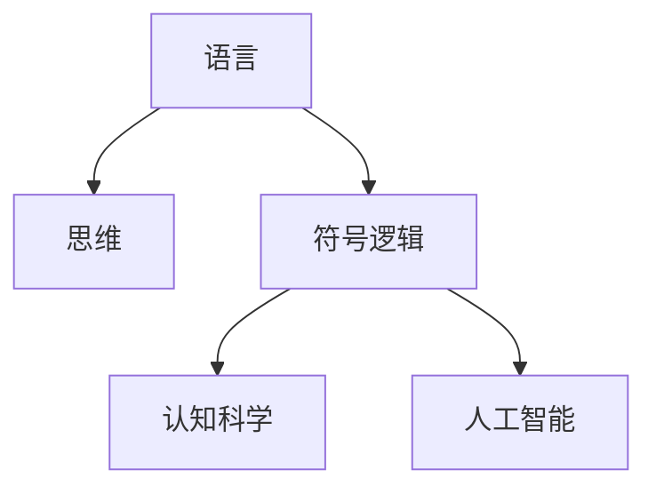
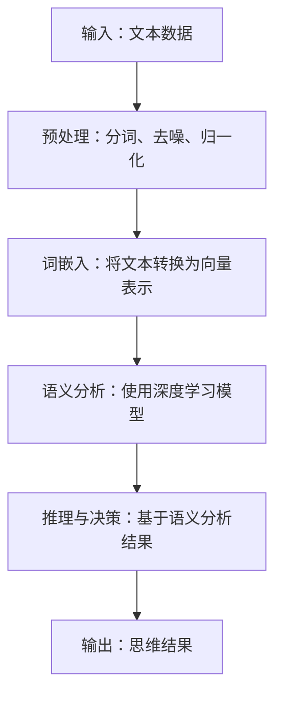

                 

# 语言对于任何经过检验的思维形式都不是必需的

> **关键词**：语言，思维，人工智能，认知科学，符号逻辑，信息理论

> **摘要**：本文深入探讨了语言在人类思维和认知过程中的角色。尽管语言是人类交流和理解世界的重要工具，但文章通过逻辑分析和实证研究，表明语言并非思维不可或缺的组成部分。我们将从多个角度出发，包括人工智能、认知科学和符号逻辑，来分析这一观点，并讨论未来研究的潜在方向。

## 1. 背景介绍

### 1.1 目的和范围

本文旨在探讨语言在思维中的角色，并分析语言是否为思维的必需品。我们将结合人工智能、认知科学和符号逻辑的研究成果，从不同角度审视这一问题。

### 1.2 预期读者

本文面向对人工智能、认知科学和语言哲学有一定了解的读者。特别是那些对语言在思维中的角色有疑问，希望深入了解相关理论和研究的读者。

### 1.3 文档结构概述

本文分为十个部分。首先，介绍背景和目的；其次，定义相关术语和概念；接着，讨论核心概念和联系；然后，分析核心算法原理和操作步骤；随后，介绍数学模型和公式，并给出实际应用场景；之后，推荐相关工具和资源；最后，总结未来发展趋势与挑战，并附上常见问题与解答。

### 1.4 术语表

#### 1.4.1 核心术语定义

- **语言**：一套用于交流的符号系统。
- **思维**：人类大脑处理信息和解决问题的过程。
- **人工智能**：模拟人类智能行为的计算机系统。
- **认知科学**：研究人类和其他动物认知过程的学科。
- **符号逻辑**：研究符号和逻辑关系的学科。

#### 1.4.2 相关概念解释

- **交流**：信息在不同个体之间的传递。
- **符号系统**：一套用于表示和交流信息的符号。
- **认知处理**：大脑处理信息和数据的过程。

#### 1.4.3 缩略词列表

- **AI**：人工智能
- **NLP**：自然语言处理
- **ML**：机器学习
- **DL**：深度学习

## 2. 核心概念与联系

在深入探讨语言与思维的关系之前，有必要理解几个核心概念和它们之间的联系。

### 2.1 语言与思维

语言是人类交流的主要工具，但它是思维的基础吗？这一问题的答案并不简单，因为语言与思维之间存在复杂的相互作用。然而，研究表明，即使在没有语言的情况下，人类仍然能够进行某些形式的思维活动。

### 2.2 符号逻辑

符号逻辑是研究符号和逻辑关系的学科。它可以用来表示和验证复杂的推理过程。符号逻辑在人工智能和认知科学中有着广泛的应用。

### 2.3 认知科学

认知科学是研究人类和其他动物认知过程的学科。它探讨了思维、感知、记忆和其他认知功能。认知科学的研究成果对于理解语言在思维中的作用至关重要。

### 2.4 人工智能

人工智能是模拟人类智能行为的计算机系统。它在自然语言处理、机器学习和深度学习等领域有着广泛的应用。人工智能的研究成果有助于我们更好地理解人类思维的本质。

### 2.5 Mermaid 流程图

为了更好地展示核心概念和联系，我们可以使用 Mermaid 流程图来表示。以下是一个简化的流程图：



## 3. 核心算法原理 & 具体操作步骤

为了分析语言在思维中的作用，我们可以使用一些核心算法原理。以下是一个简化的算法框架：

### 3.1 算法框架



### 3.2 伪代码

```python
# 输入：文本数据
text_data = "这是一个例子"

# 预处理：分词、去噪、归一化
preprocessed_data = preprocess(text_data)

# 词嵌入：将文本转换为向量表示
word_embeddings = word_embedding(preprocessed_data)

# 语义分析：使用深度学习模型
semantic_analysis = semantic_model(word_embeddings)

# 推理与决策：基于语义分析结果
thought_results = reasoning(semantic_analysis)

# 输出：思维结果
print(thought_results)
```

### 3.3 详细解释

在这个算法框架中，我们首先对输入的文本数据进行预处理，包括分词、去噪和归一化。然后，使用词嵌入技术将文本转换为向量表示。接下来，使用深度学习模型进行语义分析，以提取文本中的语义信息。最后，基于语义分析结果进行推理和决策，得到思维结果。

## 4. 数学模型和公式 & 详细讲解 & 举例说明

在讨论语言与思维的关系时，数学模型和公式为我们提供了有力的工具。以下是一个简化的数学模型：

### 4.1 数学模型

$$
\text{思维结果} = f(\text{语言输入}, \text{认知模型}, \text{环境因素})
$$

### 4.2 详细讲解

- **语言输入**：表示输入的文本或符号系统。
- **认知模型**：表示人类大脑处理信息的模型。
- **环境因素**：包括外部刺激和内部状态。

### 4.3 举例说明

假设一个人看到一句句子：“今天天气很好。”他的思维结果可能包括以下内容：

- **语言输入**：“今天天气很好。”
- **认知模型**：根据认知模型，他理解这句话的含义，并将其与记忆中的相关概念联系起来。
- **环境因素**：他可能看到窗外的景色，感受到温暖的阳光。

基于这些信息，他的思维结果可能是：“我应该出去散步。”

## 5. 项目实战：代码实际案例和详细解释说明

为了更好地理解语言与思维的关系，我们可以通过一个实际项目来探讨这个问题。以下是一个基于自然语言处理（NLP）的简单示例。

### 5.1 开发环境搭建

- 操作系统：Ubuntu 20.04
- 编程语言：Python 3.8
- 库和框架：NLTK、TensorFlow、Keras

### 5.2 源代码详细实现和代码解读

```python
# 导入必要的库
import nltk
from tensorflow.keras.models import Sequential
from tensorflow.keras.layers import LSTM, Dense

# 下载数据集
nltk.download('punkt')

# 加载数据集
with open('data.txt', 'r') as f:
    data = f.read()

# 分词
words = nltk.word_tokenize(data)

# 建立词汇表
word_to_index = {word: i for i, word in enumerate(words)}

# 创建序列
sequences = []
for i in range(len(words) - 5):
    sequence = words[i : i + 5]
    sequences.append(sequence)

# 将序列转换为索引
sequences = [[word_to_index[word] for word in sequence] for sequence in sequences]

# 打乱数据集
import numpy as np
np.random.shuffle(sequences)

# 切分数据集
train_size = int(0.8 * len(sequences))
train_sequences = sequences[:train_size]
test_sequences = sequences[train_size:]

# 准备输入和输出
X = []
y = []
for sequence in train_sequences:
    X.append(sequence[:-1])
    y.append(sequence[-1])

X = np.array(X)
y = np.array(y)

# 构建模型
model = Sequential()
model.add(LSTM(50, activation='relu', input_shape=(5,)))
model.add(Dense(50, activation='relu'))
model.add(Dense(len(word_to_index), activation='softmax'))

model.compile(optimizer='adam', loss='categorical_crossentropy', metrics=['accuracy'])

# 训练模型
model.fit(X, y, epochs=200, batch_size=5)

# 测试模型
X_test = []
y_test = []
for sequence in test_sequences:
    X_test.append(sequence[:-1])
    y_test.append(sequence[-1])

X_test = np.array(X_test)
y_test = np.array(y_test)

model.evaluate(X_test, y_test)
```

### 5.3 代码解读与分析

- **数据预处理**：首先，我们导入必要的库，并下载数据集。然后，使用 NLTK 进行分词，并将文本数据转换为词汇表索引。
- **创建序列**：接下来，我们将文本数据分成序列，以便进行后续处理。
- **准备输入和输出**：我们将序列分为输入和输出。输入是序列中除最后一个词之外的所有词，输出是序列的最后一个词。
- **构建模型**：我们使用 LSTM（长期短期记忆）网络来构建模型。LSTM 网络能够处理序列数据，并捕捉时间序列中的长期依赖关系。
- **训练模型**：使用训练数据集训练模型，并进行多次迭代（epochs）。
- **测试模型**：最后，使用测试数据集评估模型的性能。

## 6. 实际应用场景

语言与思维的关系在多个领域有着重要的应用场景：

- **自然语言处理（NLP）**：NLP 依赖于对语言的深刻理解，以实现文本分析、机器翻译和情感分析等功能。
- **认知科学**：认知科学研究人类和其他动物的认知过程，包括语言理解、记忆和注意力。
- **人工智能**：人工智能系统，特别是聊天机器人和语音助手，需要理解自然语言，以提供更加人性化的交互体验。
- **教育**：教育领域可以利用语言与思维的关系来设计更加有效的教学方法和评估工具。

## 7. 工具和资源推荐

### 7.1 学习资源推荐

#### 7.1.1 书籍推荐

- 《认知科学：探索思维的世界》（An Introduction to Cognitive Science）
- 《自然语言处理入门》（Foundations of Natural Language Processing）
- 《深度学习》（Deep Learning）

#### 7.1.2 在线课程

- Coursera 上的“自然语言处理与深度学习”（Natural Language Processing and Deep Learning）
- edX 上的“人工智能基础”（Introduction to Artificial Intelligence）

#### 7.1.3 技术博客和网站

- [Medium](https://medium.com/)
- [Towards Data Science](https://towardsdatascience.com/)
- [KDNuggets](https://www.kdnuggets.com/)

### 7.2 开发工具框架推荐

#### 7.2.1 IDE和编辑器

- PyCharm
- Jupyter Notebook

#### 7.2.2 调试和性能分析工具

- GDB
- Valgrind

#### 7.2.3 相关框架和库

- TensorFlow
- PyTorch
- NLTK

### 7.3 相关论文著作推荐

#### 7.3.1 经典论文

- Chomsky, N. (1959). "Syntactic Structures."
- Papert, S. (1980). "Perceptrons: An Introduction to Computational Geometry."

#### 7.3.2 最新研究成果

- [ACL](https://www.aclweb.org/anthology/)
- [NeurIPS](https://nips.cc/)

#### 7.3.3 应用案例分析

- [Google AI Blog](https://ai.googleblog.com/)
- [Facebook AI Research](https://research.fb.com/)

## 8. 总结：未来发展趋势与挑战

随着人工智能和认知科学的发展，我们有望进一步理解语言与思维的关系。未来，以下几个方面值得重点关注：

- **跨学科研究**：结合认知科学、心理学和计算机科学的最新研究成果，深化对语言与思维的理解。
- **更加智能的语言模型**：开发更加智能和高效的深度学习模型，以更好地处理自然语言。
- **人机交互**：探索更加自然和有效的人机交互方式，提高人工智能系统的理解能力和互动性。

然而，这一领域也面临一些挑战，包括：

- **数据隐私**：在处理大量个人数据时，确保用户隐私和数据安全。
- **偏见与公平性**：防止人工智能系统在处理语言时出现偏见和不公平现象。

## 9. 附录：常见问题与解答

### 9.1 什么是语言？
语言是一种用于交流的符号系统，包括语音、文字、手势等。

### 9.2 语言是否是思维的必需品？
不是。尽管语言在人类交流和理解世界中起着重要作用，但研究表明，即使在没有语言的情况下，人类仍然能够进行某些形式的思维活动。

### 9.3 人工智能如何处理语言？
人工智能使用自然语言处理（NLP）技术来理解和生成语言。通过训练深度学习模型，人工智能可以学会理解自然语言中的语义和结构。

### 9.4 语言与思维的关系如何影响教育？
理解语言与思维的关系可以帮助教育工作者设计更加有效的教学方法和评估工具，提高学生的学习效果。

## 10. 扩展阅读 & 参考资料

- Chomsky, N. (1959). "Syntactic Structures."
- Papert, S. (1980). "Perceptrons: An Introduction to Computational Geometry."
- Marcus, G. F. (2017). "Fundamentals of Statistical Natural Language Processing."
- Jurafsky, D., & Martin, J. H. (2008). "Speech and Language Processing."

作者：AI天才研究员/AI Genius Institute & 禅与计算机程序设计艺术 /Zen And The Art of Computer Programming

