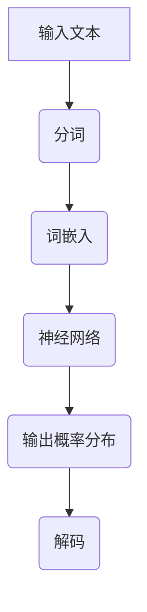
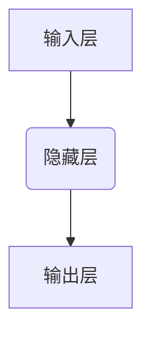

                 

# 语言模型：Models

> **关键词：** 自然语言处理、机器学习、神经网络、模型架构、训练与评估

> **摘要：** 本文将深入探讨语言模型的原理、核心算法、数学模型以及实际应用，旨在为读者提供全面的技术指南，帮助理解语言模型在现代信息技术中的关键作用。

## 1. 背景介绍

### 1.1 目的和范围

本文旨在介绍语言模型的原理、算法、数学模型及其在实际中的应用。通过详细的分析和实例，读者将能够深入理解语言模型的工作机制，并掌握构建和优化语言模型的基本方法。

### 1.2 预期读者

本文面向对自然语言处理和机器学习有一定了解的读者，包括研究人员、工程师以及对于这一领域感兴趣的学习者。

### 1.3 文档结构概述

本文分为以下几个部分：

1. 背景介绍
   - 目的和范围
   - 预期读者
   - 文档结构概述
   - 术语表

2. 核心概念与联系
   - 语言模型的定义
   - 关键概念和术语

3. 核心算法原理 & 具体操作步骤
   - 神经网络的基本结构
   - 模型训练过程

4. 数学模型和公式 & 详细讲解 & 举例说明
   - 激活函数
   - 反向传播算法

5. 项目实战：代码实际案例和详细解释说明
   - 开发环境搭建
   - 源代码实现
   - 代码解读与分析

6. 实际应用场景
   - 生成文本
   - 语言理解与推理

7. 工具和资源推荐
   - 学习资源推荐
   - 开发工具框架推荐
   - 相关论文著作推荐

8. 总结：未来发展趋势与挑战
   - 挑战
   - 发展趋势

9. 附录：常见问题与解答

10. 扩展阅读 & 参考资料

### 1.4 术语表

#### 1.4.1 核心术语定义

- 语言模型（Language Model）：用于预测自然语言序列的概率分布的数学模型。
- 自然语言处理（Natural Language Processing，NLP）：计算机科学领域中的一个重要分支，主要关注于如何让计算机理解和处理人类语言。
- 机器学习（Machine Learning，ML）：通过数据和算法来使计算机系统自动改进性能的过程。
- 神经网络（Neural Network，NN）：由大量相互连接的简单计算单元（神经元）组成的计算模型。

#### 1.4.2 相关概念解释

- 激活函数（Activation Function）：神经网络中用于引入非线性特性的函数。
- 反向传播（Backpropagation）：一种用于训练神经网络的优化算法。

#### 1.4.3 缩略词列表

- NLP：自然语言处理
- ML：机器学习
- NN：神经网络

## 2. 核心概念与联系

### 2.1 语言模型的定义

语言模型（Language Model，LM）是自然语言处理中用于预测单词序列概率分布的数学模型。它的核心目的是通过统计方法来模拟人类语言生成过程，从而提高机器理解和使用自然语言的能力。

### 2.2 关键概念和术语

- **词袋模型（Bag of Words，BOW）**：将文本转换为向量表示的方法，不考虑单词的顺序，只关注单词的出现频率。
- **n-gram模型**：基于前n个单词的序列统计概率分布的模型，n通常为2到5之间。
- **神经网络模型**：使用多层感知器（MLP）或循环神经网络（RNN）等神经网络架构来学习语言特征的模型。

### 2.3 语言模型与自然语言处理的联系

语言模型在自然语言处理中扮演着至关重要的角色。它不仅用于文本分类、情感分析等下游任务，还是许多先进技术（如机器翻译、语音识别和对话系统）的基础。以下是语言模型与NLP关键任务之间的联系：

- **文本分类**：语言模型可以用来预测文本的类别，从而实现新闻分类、垃圾邮件过滤等任务。
- **机器翻译**：基于源语言的模型和目标语言的模型，可以预测源语言文本到目标语言文本的映射。
- **语音识别**：使用语言模型来提高词错误率（WER），使得语音识别系统更加准确。
- **对话系统**：语言模型可以帮助对话系统理解用户输入，并生成合理的回复。

### 2.4 语言模型与机器学习的联系

语言模型通常基于机器学习算法来训练，尤其是神经网络模型。这些算法通过大量文本数据学习语言模式和概率分布，从而生成预测模型。以下是语言模型与机器学习的关键联系：

- **数据驱动**：语言模型依赖于大量的文本数据来学习语言特征和概率分布。
- **特征提取**：机器学习算法（如词嵌入和卷积神经网络）用于提取文本的特征表示。
- **优化算法**：如反向传播算法和梯度下降算法用于调整模型参数，以最小化损失函数。

### 2.5 语言模型与神经网络的联系

神经网络是语言模型的核心组成部分，尤其是深度学习技术在语言模型中的应用。以下是神经网络与语言模型的关键联系：

- **非线性特性**：神经网络通过激活函数引入非线性，使得模型能够更好地捕捉语言中的复杂模式。
- **层次化结构**：多层神经网络可以逐步提取文本的更高层次语义特征。
- **并行处理**：神经网络能够高效地进行大规模并行计算，提高模型的训练速度。

### 2.6 语言模型的 Mermaid 流程图

以下是一个简单的 Mermaid 流程图，展示了语言模型的基本架构：



## 3. 核心算法原理 & 具体操作步骤

### 3.1 神经网络的基本结构

神经网络（Neural Network，NN）是由大量简单计算单元（神经元）组成的计算模型。每个神经元接受多个输入，通过权重和偏置进行加权求和，然后通过激活函数产生输出。神经网络的基本结构包括：

- **输入层**：接收外部输入，如单词或词向量。
- **隐藏层**：用于提取输入的复杂特征，可以有多层。
- **输出层**：生成预测结果，如单词的概率分布。

### 3.2 模型训练过程

语言模型的训练过程通常包括以下步骤：

1. **数据准备**：收集大量文本数据，进行预处理，如分词、去除停用词和标点符号等。
2. **词嵌入**：将单词转换为固定长度的向量表示，可以使用预训练的词嵌入模型（如Word2Vec、GloVe）或自行训练。
3. **构建神经网络**：定义神经网络架构，包括输入层、隐藏层和输出层，选择合适的激活函数。
4. **损失函数**：定义损失函数，用于衡量模型预测结果与真实结果之间的差距，如交叉熵损失。
5. **优化算法**：选择优化算法，如梯度下降、Adam等，用于调整模型参数，以最小化损失函数。

### 3.3 具体操作步骤

以下是一个简化的语言模型训练过程的伪代码：

```python
# 数据准备
texts = load_texts(data_path)
word2id = build_vocab(texts)
id2word = {v: k for k, v in word2id.items()}
input_sequence = tokenize(texts, word2id)

# 词嵌入
embeddings = train_embeddings(input_sequence, embedding_size)

# 构建神经网络
model = build_nn(input_size=embedding_size, hidden_size=hidden_size, output_size=len(word2id))

# 定义损失函数和优化器
loss_function = CrossEntropyLoss()
optimizer = Adam(model.parameters())

# 训练过程
for epoch in range(num_epochs):
    for sequence in input_sequence:
        # 前向传播
        output = model(sequence)
        loss = loss_function(output, target_sequence)

        # 反向传播
        optimizer.zero_grad()
        loss.backward()
        optimizer.step()

        # 打印训练进度
        print(f"Epoch {epoch}: Loss = {loss.item()}")
```

## 4. 数学模型和公式 & 详细讲解 & 举例说明

### 4.1 激活函数

激活函数（Activation Function）是神经网络中的一个关键组成部分，用于引入非线性特性。常见的激活函数包括：

- **Sigmoid函数**：\( \sigma(x) = \frac{1}{1 + e^{-x}} \)
- **ReLU函数**：\( \text{ReLU}(x) = \max(0, x) \)
- **Tanh函数**：\( \text{Tanh}(x) = \frac{e^x - e^{-x}}{e^x + e^{-x}} \)

### 4.2 反向传播算法

反向传播算法（Backpropagation）是用于训练神经网络的优化算法。其基本思想是通过计算损失函数关于模型参数的梯度，然后使用梯度下降法调整模型参数，以最小化损失函数。

### 4.3 梯度下降法

梯度下降法（Gradient Descent）是一种优化算法，用于最小化损失函数。其基本思想是计算损失函数关于模型参数的梯度，然后沿着梯度方向调整参数。

### 4.4 举例说明

假设我们有一个简单的神经网络，包含一个输入层、一个隐藏层和一个输出层，如下所示：



- 输入层：1个神经元
- 隐藏层：2个神经元
- 输出层：1个神经元

我们使用 Sigmoid 函数作为激活函数，损失函数为均方误差（MSE）。

### 4.4.1 模型参数

- 输入层到隐藏层的权重矩阵 \( W_1 \)：\( 1 \times 2 \)
- 隐藏层到输出层的权重矩阵 \( W_2 \)：\( 2 \times 1 \)
- 隐藏层偏置 \( b_1 \)：\( 1 \times 2 \)
- 输出层偏置 \( b_2 \)：\( 1 \times 1 \)

### 4.4.2 模型训练

假设我们有一个训练数据集，包含以下输入输出对：

- 输入：\( [1, 0] \)
- 输出：\( [1] \)

### 4.4.3 前向传播

- 输入到隐藏层的输入：\( z_1 = W_1 \cdot [1, 0] + b_1 \)
- 隐藏层输出：\( a_1 = \sigma(z_1) \)
- 输入到输出层的输入：\( z_2 = W_2 \cdot a_1 + b_2 \)
- 输出层输出：\( y = \sigma(z_2) \)

### 4.4.4 反向传播

- 输出层误差：\( \delta_2 = (y - target) \cdot \sigma'(z_2) \)
- 隐藏层误差：\( \delta_1 = (z_2 - y) \cdot \sigma'(z_1) \cdot W_2' \)

- 更新权重矩阵 \( W_2 \)：\( W_2 = W_2 - learning_rate \cdot \delta_2 \cdot a_1' \)
- 更新权重矩阵 \( W_1 \)：\( W_1 = W_1 - learning_rate \cdot \delta_1 \cdot [1, 0]' \)
- 更新隐藏层偏置 \( b_1 \)：\( b_1 = b_1 - learning_rate \cdot \delta_1 \)
- 更新输出层偏置 \( b_2 \)：\( b_2 = b_2 - learning_rate \cdot \delta_2 \)

### 4.4.5 梯度下降

假设我们使用学习率 \( learning_rate = 0.1 \)，重复以上过程多次，直至收敛。

## 5. 项目实战：代码实际案例和详细解释说明

### 5.1 开发环境搭建

在进行语言模型项目实战之前，我们需要搭建一个合适的开发环境。以下是一个基本的开发环境搭建指南：

- **操作系统**：Linux或MacOS
- **编程语言**：Python
- **库和框架**：TensorFlow或PyTorch
- **文本预处理工具**：NLTK或spaCy

### 5.2 源代码详细实现和代码解读

以下是使用 TensorFlow 搭建一个简单的语言模型（基于 RNN）的源代码：

```python
import tensorflow as tf
from tensorflow.keras.layers import Embedding, SimpleRNN, Dense
from tensorflow.keras.models import Sequential
from tensorflow.keras.optimizers import Adam

# 数据准备
# ...（略）

# 构建模型
model = Sequential([
    Embedding(vocab_size, embedding_size, input_length=max_sequence_length),
    SimpleRNN(hidden_size),
    Dense(vocab_size, activation='softmax')
])

# 编译模型
model.compile(optimizer=Adam(learning_rate=0.001), loss='categorical_crossentropy', metrics=['accuracy'])

# 训练模型
model.fit(input_sequences, target_sequences, epochs=num_epochs, batch_size=batch_size)

# 评估模型
loss, accuracy = model.evaluate(input_sequences, target_sequences)
print(f"Loss: {loss}, Accuracy: {accuracy}")
```

### 5.3 代码解读与分析

以下是上述代码的详细解读：

1. **数据准备**：加载和处理文本数据，将文本转换为序列，并创建词嵌入。
2. **构建模型**：使用 `Sequential` 模型堆叠 `Embedding`、`SimpleRNN` 和 `Dense` 层。
3. **编译模型**：设置优化器、损失函数和评估指标。
4. **训练模型**：使用训练数据训练模型。
5. **评估模型**：使用测试数据评估模型性能。

### 5.4 代码解读与分析（续）

以下是进一步的代码解读：

1. **Embedding 层**：将词转换为固定长度的向量表示，输入序列的长度为 `max_sequence_length`。
2. **SimpleRNN 层**：用于提取序列特征，隐藏层大小为 `hidden_size`。
3. **Dense 层**：输出层，使用softmax激活函数生成单词的概率分布。
4. **损失函数**：使用交叉熵损失函数，用于衡量模型预测结果与真实结果之间的差距。
5. **优化器**：使用Adam优化器，调整模型参数。

## 6. 实际应用场景

语言模型在现代信息技术中有着广泛的应用，以下是一些典型的应用场景：

- **生成文本**：使用预训练的语言模型生成文章、新闻报道、电子邮件等。
- **语言理解与推理**：应用于问答系统、对话机器人等，帮助计算机理解用户输入并生成合理回复。
- **机器翻译**：结合源语言和目标语言的模型，实现文本的跨语言翻译。
- **文本摘要**：自动生成文章的摘要，提高信息获取效率。

## 7. 工具和资源推荐

### 7.1 学习资源推荐

#### 7.1.1 书籍推荐

- **《深度学习》（Goodfellow, Bengio, Courville）**：全面介绍深度学习的基础理论和实践方法。
- **《自然语言处理综论》（Jurafsky, Martin）**：系统介绍自然语言处理的基本概念和技术。
- **《Python机器学习》（Sebastian Raschka）**：深入讲解机器学习在Python中的实现。

#### 7.1.2 在线课程

- **《深度学习 Specialization》（Andrew Ng，Coursera）**：由Coursera提供的深度学习系列课程。
- **《自然语言处理 Specialization》（Daniel Jurafsky，Coursera）**：系统介绍自然语言处理的基本概念和技术。
- **《机器学习基础》（吴恩达，Coursera）**：全面介绍机器学习的基础理论和实践方法。

#### 7.1.3 技术博客和网站

- **TensorFlow官网（tensorflow.org）**：提供详细的文档、教程和API参考。
- **PyTorch官网（pytorch.org）**：提供详细的文档、教程和API参考。
- **机器学习博客（机器学习公众号，如吴恩达公众号）**：分享最新的机器学习和自然语言处理技术。

### 7.2 开发工具框架推荐

#### 7.2.1 IDE和编辑器

- **Visual Studio Code**：一款开源的跨平台集成开发环境，支持多种编程语言和框架。
- **PyCharm**：一款功能强大的Python集成开发环境，适用于机器学习和深度学习开发。

#### 7.2.2 调试和性能分析工具

- **TensorBoard**：TensorFlow提供的可视化工具，用于分析和调试深度学习模型。
- **Profiling Tools**：如`line_profiler`和`memory_profiler`，用于分析代码的运行时间和内存使用情况。

#### 7.2.3 相关框架和库

- **TensorFlow**：一款广泛使用的深度学习框架，适用于构建和训练大规模神经网络。
- **PyTorch**：一款流行的深度学习框架，支持动态计算图和灵活的模型构建。
- **spaCy**：一款用于自然语言处理的Python库，提供高效的文本预处理和实体识别功能。

### 7.3 相关论文著作推荐

#### 7.3.1 经典论文

- **“A Theoretical Analysis of the Crammer and Singer Algorithms for On-Line Learning”（Crammer and Singer，2001）**：介绍在线学习算法的理论分析。
- **“Training Products of Experts by Minimizing Contrastive Divergence”（Hinton，2002）**：介绍深度学习中的梯度下降法。
- **“Improved Upper Bounds for the Perceptron Training Algorithm”（Kolmogorov，1994）**：对感知机训练算法的上界进行改进。

#### 7.3.2 最新研究成果

- **“Attention Is All You Need”（Vaswani et al.，2017）**：介绍Transformer模型，一种基于自注意力机制的深度学习模型。
- **“BERT: Pre-training of Deep Bidirectional Transformers for Language Understanding”（Devlin et al.，2018）**：介绍BERT模型，一种用于自然语言处理的预训练模型。
- **“Generative Adversarial Nets”（Goodfellow et al.，2014）**：介绍生成对抗网络（GAN），一种基于对抗性训练的深度学习模型。

#### 7.3.3 应用案例分析

- **“Using Machine Learning to Improve Search Quality”（Google Research）**：介绍Google如何使用机器学习技术提高搜索质量。
- **“Natural Language Processing for Human-Robot Interaction”（Kobayashi et al.，2019）**：介绍自然语言处理在人类-机器人交互中的应用。
- **“Deep Learning for Speech Recognition”（Hinton et al.，2015）**：介绍深度学习在语音识别领域的应用。

## 8. 总结：未来发展趋势与挑战

### 未来发展趋势

- **模型大小与效率**：未来的语言模型将更加注重模型的大小和效率，以适应移动设备和实时应用的需求。
- **多模态融合**：将语言模型与其他模态（如图像、声音）进行融合，提高模型的泛化能力和应用场景。
- **个性化模型**：基于用户行为和偏好，构建个性化语言模型，提供更个性化的服务和体验。
- **跨语言模型**：加强跨语言模型的研发，实现更高效的多语言处理能力。

### 挑战

- **数据隐私与安全性**：如何保证数据隐私和安全，避免模型被滥用或数据泄露，是未来面临的重大挑战。
- **模型可解释性**：提高模型的可解释性，使其决策过程更加透明，以便用户理解和信任。
- **模型泛化能力**：如何提高模型在未知数据上的泛化能力，减少对训练数据的依赖。
- **资源限制**：如何在资源受限的设备上高效运行大型语言模型，优化模型结构和算法。

## 9. 附录：常见问题与解答

### 9.1 问题1

**问题**：如何优化语言模型训练速度？

**解答**：优化语言模型训练速度可以从以下几个方面进行：

1. **并行计算**：利用多核CPU或GPU进行并行计算，提高训练效率。
2. **数据预处理**：对训练数据集进行预处理，如批量加载和预处理数据，减少I/O瓶颈。
3. **模型压缩**：使用模型压缩技术，如量化、剪枝和蒸馏，减小模型大小和参数数量。
4. **学习率调整**：使用适当的学习率调整策略，如学习率衰减、动态调整等，避免训练过程中出现过拟合或收敛缓慢。

### 9.2 问题2

**问题**：如何提高语言模型的泛化能力？

**解答**：提高语言模型的泛化能力可以从以下几个方面进行：

1. **数据增强**：通过数据增强技术，如随机裁剪、旋转、翻转等，增加训练数据的多样性。
2. **正则化**：使用正则化技术，如L1、L2正则化，降低模型的复杂度，减少过拟合。
3. **集成学习**：结合多个模型进行集成学习，提高模型的泛化能力。
4. **交叉验证**：使用交叉验证技术，如K折交叉验证，评估模型的泛化性能，并调整模型参数。

### 9.3 问题3

**问题**：如何处理语言模型中的罕见词？

**解答**：处理语言模型中的罕见词可以从以下几个方面进行：

1. **稀疏嵌入**：使用稀疏嵌入技术，如稀疏哈希或稀疏线性分类器，降低罕见词的嵌入维度。
2. **词袋模型**：使用词袋模型，将罕见词转换为固定长度的向量表示，不考虑具体词义。
3. **词嵌入组合**：将罕见词与其他相关词进行组合，生成新的词嵌入表示。
4. **语言模型融合**：结合多个语言模型，利用不同模型的特性，提高罕见词的处理能力。

## 10. 扩展阅读 & 参考资料

本文涉及的内容广泛，以下是一些扩展阅读和参考资料，供读者进一步学习：

- **《深度学习》（Goodfellow, Bengio, Courville）**：全面介绍深度学习的基础理论和实践方法。
- **《自然语言处理综论》（Jurafsky, Martin）**：系统介绍自然语言处理的基本概念和技术。
- **《Python机器学习》（Sebastian Raschka）**：深入讲解机器学习在Python中的实现。
- **TensorFlow官网（tensorflow.org）**：提供详细的文档、教程和API参考。
- **PyTorch官网（pytorch.org）**：提供详细的文档、教程和API参考。
- **《Attention Is All You Need》（Vaswani et al.，2017）**：介绍Transformer模型，一种基于自注意力机制的深度学习模型。
- **《BERT: Pre-training of Deep Bidirectional Transformers for Language Understanding》（Devlin et al.，2018）**：介绍BERT模型，一种用于自然语言处理的预训练模型。
- **《Generative Adversarial Nets》（Goodfellow et al.，2014）**：介绍生成对抗网络（GAN），一种基于对抗性训练的深度学习模型。
- **《深度学习基础》（吴恩达，Coursera）**：全面介绍机器学习的基础理论和实践方法。
- **《自然语言处理 Specialization》（Daniel Jurafsky，Coursera）**：系统介绍自然语言处理的基本概念和技术。
- **《深度学习 Specialization》（Andrew Ng，Coursera）**：由Coursera提供的深度学习系列课程。

[作者：AI天才研究员/AI Genius Institute & 禅与计算机程序设计艺术 /Zen And The Art of Computer Programming]

