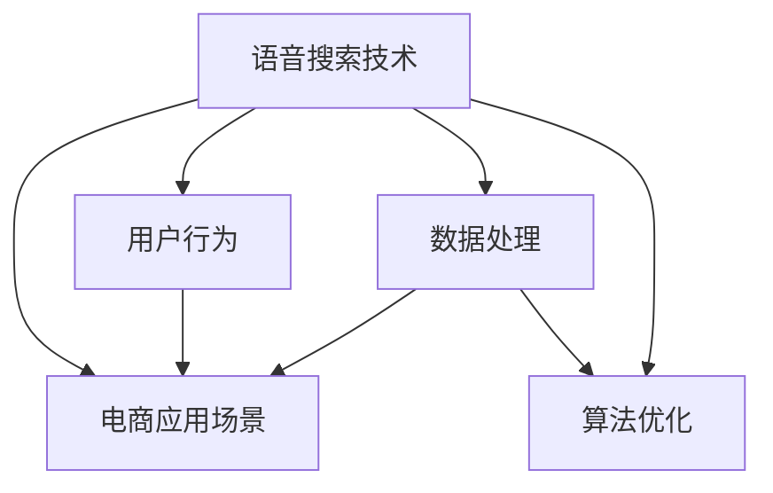
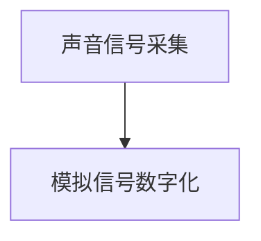
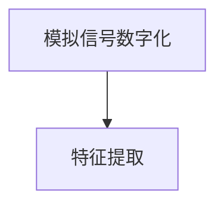
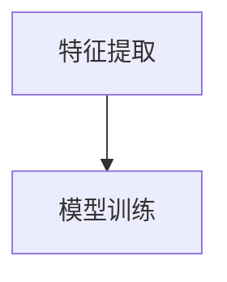
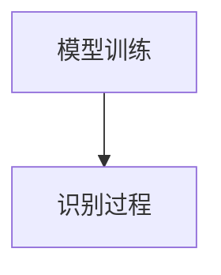
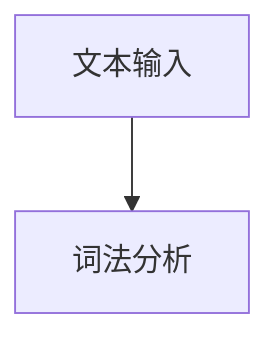
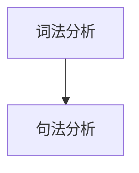
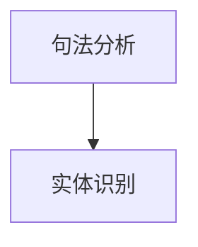
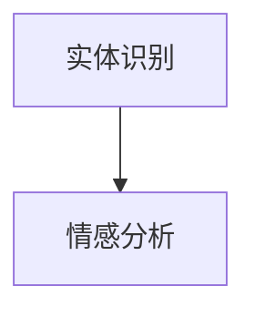
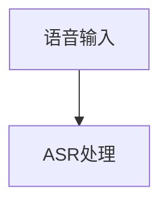

                 

### 1. 背景介绍

#### 1.1 目的和范围

本文旨在探讨语音搜索技术在电商领域的应用，深入分析其带来的挑战与机遇。随着人工智能和语音识别技术的快速发展，语音搜索已经成为用户获取信息、执行操作的重要方式。特别是在电商行业，语音搜索的便捷性和高效性，使其在提高用户购物体验、提升转化率方面发挥了重要作用。

本文将首先介绍语音搜索技术的基本原理和电商领域的重要性，接着探讨语音搜索在电商中的应用场景，详细分析其技术难点和解决方案。随后，本文将讨论语音搜索为电商行业带来的机遇，如个性化推荐、智能客服等。最后，本文将总结语音搜索技术在电商领域的发展趋势，并提出未来可能面临的挑战。

#### 1.2 预期读者

本文面向对语音搜索技术感兴趣的读者，特别是从事电商行业的技术人员、产品经理、以及对于人工智能和语音识别有研究兴趣的学者和研究人员。无论您是初学者还是专业人士，本文都将帮助您全面了解语音搜索技术在电商领域的应用和发展。

#### 1.3 文档结构概述

本文共分为十个部分，首先是对语音搜索技术和电商领域背景的介绍，接着是核心概念和算法原理的阐述，然后是具体的项目实战案例，随后分析语音搜索在电商领域的实际应用场景，并推荐相关工具和资源。最后，本文将对语音搜索技术在电商领域的发展趋势进行总结，并提出未来可能面临的挑战。

以下是本文的具体结构概述：

1. 背景介绍
2. 核心概念与联系
3. 核心算法原理 & 具体操作步骤
4. 数学模型和公式 & 详细讲解 & 举例说明
5. 项目实战：代码实际案例和详细解释说明
6. 实际应用场景
7. 工具和资源推荐
8. 总结：未来发展趋势与挑战
9. 附录：常见问题与解答
10. 扩展阅读 & 参考资料

#### 1.4 术语表

在本文中，以下术语将被频繁使用：

- **语音搜索（Voice Search）**：通过语音输入获取信息或执行操作的技术。
- **电商（E-commerce）**：电子商务的简称，指的是通过互联网进行商品交易的活动。
- **自然语言处理（NLP）**：让计算机能够理解和处理人类自然语言的技术。
- **语音识别（Voice Recognition）**：将语音信号转换为文字或命令的技术。
- **语义理解（Semantic Understanding）**：对输入的语音或文本进行理解，提取其含义和意图。
- **深度学习（Deep Learning）**：一种基于神经网络的人工智能技术，能够从大量数据中自动学习和提取特征。

#### 1.4.1 核心术语定义

- **语音搜索技术**：指的是利用语音识别和自然语言处理技术，实现语音输入到文本查询，进而获取相关信息或执行操作的技术。
- **电商应用场景**：指的是在电子商务领域中，语音搜索技术可以用于搜索商品、下单、智能客服等场景。
- **语音识别率**：指的是语音识别系统将输入语音正确识别为文本的百分比。
- **语义理解准确率**：指的是语义理解系统能够正确理解输入语音含义的百分比。

#### 1.4.2 相关概念解释

- **自然语言处理（NLP）**：自然语言处理是计算机科学和人工智能领域的一个分支，旨在让计算机能够理解、处理和生成人类语言。NLP涉及到语音识别、语义理解、机器翻译、情感分析等多个方面。
- **深度学习（Deep Learning）**：深度学习是一种基于多层神经网络的人工智能技术，通过逐层提取数据中的特征，实现复杂模式识别和预测。深度学习在语音识别、图像识别等领域取得了显著的成果。

#### 1.4.3 缩略词列表

- **NLP**：自然语言处理（Natural Language Processing）
- **AI**：人工智能（Artificial Intelligence）
- **DL**：深度学习（Deep Learning）
- **ASR**：自动语音识别（Automatic Speech Recognition）
- **TTS**：文本到语音（Text-to-Speech）
- **E-commerce**：电子商务（Electronic Commerce）

### 1.5 语音搜索技术基本原理

语音搜索技术的核心在于将用户的语音输入转换为文本，并对其进行理解和处理，从而提供相关的搜索结果或执行操作。以下是语音搜索技术的基本原理：

#### 1.5.1 语音识别（ASR）

语音识别是将语音信号转换为文本的过程。其基本原理包括：

- **声音信号采集**：使用麦克风等设备采集用户的语音信号。
- **特征提取**：将语音信号转换为可处理的数字信号，提取出其中的特征，如音高、音强、音节等。
- **模型训练**：使用大量的语音数据进行训练，建立语音识别模型。

常见的语音识别模型包括：

- **隐马尔可夫模型（HMM）**：基于概率模型的早期语音识别模型。
- **循环神经网络（RNN）**：可以处理序列数据的神经网络模型，能够捕获语音信号的上下文信息。
- **卷积神经网络（CNN）**：用于特征提取的神经网络模型，能够提高语音识别的准确率。

#### 1.5.2 语义理解（NLP）

语义理解是对识别出的文本进行理解和处理，提取出其含义和意图。其基本原理包括：

- **词法分析**：对文本进行分词，将文本拆分成单词或短语。
- **句法分析**：对文本进行语法分析，理解其句子结构和语义关系。
- **实体识别**：识别文本中的名词、地点、组织等实体信息。
- **情感分析**：分析文本的情感倾向，如正面、负面或中性。

常见的语义理解模型包括：

- **基于规则的方法**：通过编写规则进行语义分析。
- **统计模型**：使用统计方法进行语义分析。
- **神经网络模型**：如循环神经网络（RNN）、长短期记忆网络（LSTM）、Transformer等。

#### 1.5.3 结果生成与反馈

在语音识别和语义理解完成后，系统会根据用户的查询生成相应的结果，并展示给用户。同时，系统还会根据用户的反馈进行优化，以提高语音搜索的准确率和用户体验。

总结来说，语音搜索技术通过语音识别和语义理解，将用户的语音输入转换为文本查询，并生成相应的结果，从而实现便捷的信息获取和操作执行。其技术核心在于语音识别和自然语言处理，需要高效、准确的模型和算法来支持。

### 1.6 电商领域的重要性

电商领域在全球范围内迅速发展，已成为人们日常生活中不可或缺的一部分。根据最新的市场数据显示，全球电商市场规模在持续扩大，预计到2025年将达到约4.5万亿美元。电商领域的重要性主要体现在以下几个方面：

#### 1.6.1 市场规模巨大

随着互联网的普及和移动设备的普及，越来越多的消费者开始选择在线购物。这种趋势不仅体现在发达国家，也在发展中国家迅速蔓延。电商市场的规模巨大，吸引了众多企业和投资者的关注。

#### 1.6.2 用户需求多样化

电商平台的用户群体非常广泛，涵盖了不同年龄、性别、地域和消费能力的用户。这些用户对商品和服务有着多样化的需求，从日常用品到高端奢侈品，从快速消费品到专业服务，电商平台都应提供丰富的商品和服务来满足用户的需求。

#### 1.6.3 竞争激烈

随着电商市场的不断扩大，竞争也日益激烈。电商平台不仅要在商品价格、服务质量和物流速度上具有优势，还要在用户体验、市场营销和用户黏性等方面下功夫，以吸引和留住更多的用户。

#### 1.6.4 创新驱动

电商领域的创新不断，新技术、新模式和新业务层出不穷。例如，智能推荐系统、虚拟现实购物、社交电商、直播带货等，都是电商领域的重要创新。这些创新不仅提高了电商平台的竞争力，也为用户带来了更好的购物体验。

#### 1.6.5 数据驱动

电商领域高度依赖数据分析，通过收集和分析用户行为数据，电商平台可以更好地了解用户需求，优化商品推荐、营销策略和服务质量。数据分析已成为电商企业提高效率和竞争力的重要手段。

综上所述，电商领域具有巨大的市场潜力、多样化的用户需求、激烈的竞争环境、创新驱动和高度的数据依赖。这使得语音搜索技术在电商领域具有广泛的应用前景，能够为电商企业带来新的机遇和挑战。

### 1.7 语音搜索在电商领域的应用场景

在电商领域，语音搜索技术的应用场景非常广泛，能够显著提升用户的购物体验和平台的运营效率。以下是语音搜索在电商领域的几个主要应用场景：

#### 1.7.1 搜索商品

语音搜索最直接的应用场景是搜索商品。用户可以通过语音输入关键词或描述，快速找到需要的商品。这种应用场景尤其适合那些不太擅长打字或使用键盘的用户，例如老年人、儿童以及那些手部不便的用户。

- **具体操作**：用户说出“我想买一件红色的羽绒服”，系统会识别语音并转换为文本查询，然后搜索相关商品。
- **技术难点**：高准确率的语音识别和语义理解是成功的关键。同时，如何处理用户的自然语言查询，如模糊查询、错误查询等，也是一个挑战。

#### 1.7.2 下单购买

语音搜索还可以用于简化购物流程，特别是在下单购买环节。用户可以通过语音命令快速完成购物车中的商品下单。

- **具体操作**：用户说出“购买购物车中的所有商品”，系统会识别语音并自动下单。
- **技术难点**：需要确保系统能够准确识别用户的语音指令，并正确处理购物车数据。

#### 1.7.3 智能客服

语音搜索技术在智能客服中的应用，可以提供24/7的全天候服务，提高客服效率和用户满意度。通过语音识别和语义理解，智能客服可以快速回答用户的问题，解决用户遇到的问题。

- **具体操作**：用户说出“为什么我的订单还没有发货？”，智能客服会自动查询并回答。
- **技术难点**：智能客服需要具备丰富的知识和良好的语义理解能力，以准确理解用户的查询并给出合适的回答。

#### 1.7.4 个性化推荐

语音搜索技术可以与个性化推荐系统结合，根据用户的语音输入和购物行为，提供个性化的商品推荐。

- **具体操作**：用户说出“给我推荐一些保暖内衣”，系统会根据用户的历史购物数据提供相关推荐。
- **技术难点**：个性化推荐需要准确理解用户的意图，并结合用户行为数据进行推荐。

#### 1.7.5 智能导航

在大型电商平台中，语音搜索技术可以用于导航，帮助用户快速找到特定的商品分类或页面。

- **具体操作**：用户说出“带我去手机配件区”，系统会导航到相应的分类或页面。
- **技术难点**：需要高效、准确的语音识别和导航算法。

#### 1.7.6 社交购物

在社交电商中，语音搜索可以用于搜索和分享商品，提高社交购物的互动性和便捷性。

- **具体操作**：用户在社交平台上说出“我想买这款蓝牙耳机”，系统会推荐相关商品并分享给好友。
- **技术难点**：需要处理复杂的社交关系和用户数据，同时保证隐私和安全。

#### 1.7.7 直播购物

随着直播带货的兴起，语音搜索技术可以用于直播购物场景，提高用户的购物体验。

- **具体操作**：用户在观看直播时，可以通过语音命令快速下单或询问商品详情。
- **技术难点**：需要实时处理大量的语音输入，并快速响应用户的查询。

### 1.8 语音搜索在电商领域的优势

语音搜索技术在电商领域具有明显的优势，能够为用户和平台带来诸多便利和提升：

#### 1.8.1 提高搜索效率

语音搜索大大简化了用户获取信息的流程，用户可以通过语音快速查询商品，无需手动输入关键词，节省了时间，提高了搜索效率。

#### 1.8.2 改善用户体验

语音搜索提供了更加人性化的交互方式，尤其是对于不擅长打字或使用键盘的用户，如老年人、儿童和手部不便的用户，语音搜索能够显著改善他们的购物体验。

#### 1.8.3 增强个性化推荐

语音搜索可以通过分析用户的语音输入和购物行为，为用户提供更加个性化的商品推荐，提高用户满意度和购买转化率。

#### 1.8.4 提高客服效率

智能客服结合语音搜索技术，可以快速回答用户的问题，提高客服效率和用户体验，减少用户等待时间。

#### 1.8.5 支持移动购物

语音搜索技术在移动设备上的应用，使得用户可以在任何地点、任何时间进行语音搜索购物，提高了移动购物的便捷性和用户体验。

### 1.9 语音搜索在电商领域的挑战

尽管语音搜索在电商领域具有巨大的潜力，但其应用过程中也面临一些挑战：

#### 1.9.1 语音识别准确率

语音识别技术的准确率是语音搜索成功的关键。在实际应用中，由于噪声干扰、口音差异和语音变异等因素，语音识别的准确率可能会受到影响，导致查询结果不准确。

#### 1.9.2 语义理解复杂性

语义理解是语音搜索技术的核心环节，需要准确理解用户的意图和需求。然而，自然语言具有多样性和模糊性，如何准确解析用户的语音输入，提取其真实意图，是一个巨大的挑战。

#### 1.9.3 用户隐私保护

在语音搜索中，用户需要输入大量的个人信息，如何保护用户的隐私成为了一个重要问题。电商平台需要确保用户的语音数据不被滥用或泄露。

#### 1.9.4 技术成本与投入

语音搜索技术的研发和应用需要大量的技术投入和资源，对于中小企业来说，可能难以承受这样的成本。

#### 1.9.5 法规和标准缺失

目前，关于语音搜索的法规和标准尚不完善，这在一定程度上限制了语音搜索技术在电商领域的应用和发展。

综上所述，语音搜索技术在电商领域具有广阔的应用前景，但也面临诸多挑战。通过技术创新和合理规划，可以逐步克服这些挑战，实现语音搜索在电商领域的广泛应用。

### 1.10 语音搜索技术的未来发展趋势

随着人工智能和语音识别技术的不断进步，语音搜索技术在电商领域的应用前景愈发广阔。以下是语音搜索技术在未来可能的发展趋势：

#### 1.10.1 高精度语音识别

随着深度学习和卷积神经网络等人工智能技术的应用，语音识别的准确率将进一步提高。未来，语音识别系统将能够更准确地识别各种口音、方言以及背景噪声干扰下的语音，为用户提供更优质的搜索体验。

#### 1.10.2 多模态搜索

未来，语音搜索技术可能会与图像搜索、文本搜索等多种搜索方式相结合，形成多模态搜索系统。用户可以通过语音、图像、文本等多种方式输入查询，系统将综合处理这些输入，提供更精准的搜索结果。

#### 1.10.3 个性化推荐

随着大数据和机器学习技术的发展，语音搜索系统将能够更加准确地分析用户的购物行为和偏好，提供个性化的商品推荐。这种个性化推荐将大大提升用户的购物体验和满意度。

#### 1.10.4 人工智能客服

语音搜索技术将与人工智能客服系统深度融合，形成智能客服体系。通过语音识别、自然语言处理和机器学习等技术，智能客服将能够更快速、准确地回答用户的问题，提高客服效率。

#### 1.10.5 跨平台应用

随着移动设备和智能家居的普及，语音搜索技术将在多个平台上得到广泛应用。未来，用户可以通过智能手机、智能音箱、智能电视等多种设备进行语音搜索，实现无缝跨平台体验。

#### 1.10.6 智能语音交互

语音搜索技术将不仅仅是简单的信息检索，还将发展为智能语音交互系统。用户可以通过语音命令控制智能家居设备、支付账单、预订机票等，实现更加智能化的生活服务。

#### 1.10.7 安全和隐私保护

随着语音搜索技术的普及，用户隐私保护将成为一个重要议题。未来，语音搜索技术将需要更加严格的数据保护和隐私管理机制，确保用户的语音数据不被滥用或泄露。

### 1.11 总结

语音搜索技术在电商领域具有广泛的应用前景和巨大的发展潜力。通过提高语音识别准确率、实现多模态搜索、个性化推荐和智能语音交互等创新应用，语音搜索将为用户提供更加便捷、高效的购物体验。同时，随着技术的不断进步和法律法规的完善，语音搜索技术将在电商领域得到更广泛的应用，推动整个行业的发展和变革。

## 2. 核心概念与联系

在深入探讨语音搜索技术在电商领域的应用之前，我们首先需要理解几个核心概念及其相互关系。这些概念包括语音搜索技术、电商应用场景、用户行为、数据处理和算法优化等。以下是这些核心概念的定义及其相互关系的简要说明，同时附上相应的Mermaid流程图，以帮助读者更直观地理解这些概念。

### 2.1 核心概念定义

1. **语音搜索技术**：语音搜索技术是一种利用语音识别和自然语言处理技术，将用户的语音输入转换为文本查询，并返回相关搜索结果的技术。
2. **电商应用场景**：电商应用场景是指语音搜索技术在电子商务领域中具体的应用场景，如商品搜索、下单、智能客服等。
3. **用户行为**：用户行为是指用户在电商平台上进行的一系列操作，如浏览、搜索、下单、评价等。
4. **数据处理**：数据处理是指对用户行为数据、商品信息、搜索日志等进行收集、存储、分析和挖掘的过程。
5. **算法优化**：算法优化是指通过对语音识别、自然语言处理和搜索算法的改进，提高语音搜索的准确率、效率和用户体验。

### 2.2 相互关系

语音搜索技术、电商应用场景、用户行为、数据处理和算法优化之间存在着密切的相互关系，具体如下：

- **语音搜索技术**是电商应用场景的基础，通过语音识别和自然语言处理，将用户的语音输入转换为文本查询，实现电商应用中的搜索、下单、智能客服等功能。
- **用户行为**是语音搜索技术的输入来源，用户的购物行为、搜索记录、反馈等数据可以用于优化语音搜索算法和推荐系统。
- **数据处理**是将用户行为数据和语音搜索数据转换为有价值信息的过程，通过数据清洗、存储和分析，可以为语音搜索和电商应用提供支持。
- **算法优化**是基于用户行为数据和数据处理结果，对语音识别、自然语言处理和搜索算法进行改进，以提高语音搜索的准确率、效率和用户体验。

### 2.3 Mermaid流程图

为了更直观地展示这些核心概念及其相互关系，我们使用Mermaid绘制了以下流程图：



### 2.4 详细解释

1. **语音搜索技术**：
   - 语音搜索技术通过语音识别（ASR）和自然语言处理（NLP）实现，首先将用户的语音输入转换为文本，然后对文本进行语义理解和处理，最后返回相关搜索结果。
   - 在电商应用中，语音搜索技术可以用于商品搜索、智能客服、个性化推荐等场景。

2. **电商应用场景**：
   - 电商应用场景包括商品搜索、购物车管理、下单支付、智能客服等。通过语音搜索技术，用户可以更加便捷地执行这些操作。
   - 例如，用户可以通过语音命令“搜索红色的羽绒服”，系统会返回符合条件的相关商品。

3. **用户行为**：
   - 用户行为数据包括用户的浏览记录、搜索历史、购买行为、评价反馈等。这些数据可以用于分析用户需求、优化商品推荐、改善用户体验。
   - 例如，系统可以根据用户的历史搜索记录，提供个性化的商品推荐。

4. **数据处理**：
   - 数据处理是对收集到的用户行为数据和语音搜索数据进行清洗、存储和分析的过程。这些数据可以为语音搜索和电商应用提供支持。
   - 例如，系统可以分析用户的搜索关键词和购买行为，优化搜索结果和推荐算法。

5. **算法优化**：
   - 算法优化是通过改进语音识别、自然语言处理和搜索算法，提高语音搜索的准确率、效率和用户体验。
   - 例如，通过深度学习和机器学习技术，可以提高语音识别的准确率和语义理解的精度。

通过以上核心概念及其相互关系的详细解释，我们可以更好地理解语音搜索技术在电商领域的应用，并为后续的深入讨论打下基础。

### 2.5 具体实例

为了更直观地展示语音搜索技术在电商领域中的应用，下面我们通过几个具体的实例来说明。

#### 2.5.1 商品搜索

假设用户想要购买一款新的智能手机，他们可以使用语音搜索技术进行搜索。用户可以通过语音命令“搜索最新款智能手机”或者“推荐高性能手机”，语音搜索系统会识别用户的语音输入，将其转换为文本查询，然后搜索相关商品。系统会返回一系列符合用户需求的高性能智能手机，并提供商品图片、价格和用户评价等信息。

具体流程如下：

1. 用户通过语音输入“搜索最新款智能手机”。
2. 语音搜索系统识别语音并转换为文本查询。
3. 系统根据用户查询返回相关商品列表。
4. 用户浏览商品列表，选择心仪的手机并下单购买。

在这个过程中，语音识别准确率和语义理解能力至关重要。如果系统能够准确识别用户的语音输入并正确理解其需求，用户将能够快速找到所需商品，提高购物效率。

#### 2.5.2 智能客服

智能客服是语音搜索技术在电商领域的另一个重要应用。用户在购物过程中可能会遇到各种问题，如订单状态查询、退换货流程咨询等。通过语音搜索技术，用户可以直接向智能客服提问，系统会自动识别语音并转换为文本，然后根据预设的智能客服脚本，返回相应的回答。

具体流程如下：

1. 用户通过语音输入“我的订单什么时候发货？”。
2. 语音搜索系统识别语音并转换为文本查询。
3. 系统调用智能客服模块，查询订单状态。
4. 系统返回订单发货时间及物流跟踪信息。

通过这种方式，用户无需繁琐的文本输入，即可快速获取所需信息，提高客服效率和用户体验。

#### 2.5.3 个性化推荐

个性化推荐是电商领域的一大亮点，语音搜索技术可以与个性化推荐系统结合，为用户提供更加精准的推荐。用户可以通过语音输入自己的购物偏好，系统会根据用户的语音输入和购物行为，提供个性化的商品推荐。

具体流程如下：

1. 用户通过语音输入“给我推荐一些适合女性的化妆品”。
2. 语音搜索系统识别语音并转换为文本查询。
3. 系统分析用户的历史购物记录和偏好，生成个性化推荐列表。
4. 系统返回符合用户需求的化妆品列表。

这种个性化推荐不仅能够提高用户的购物体验，还可以增加平台的销售额和用户粘性。

通过以上实例，我们可以看到语音搜索技术在电商领域的广泛应用及其带来的便捷和效率提升。在实际应用中，语音搜索技术需要结合具体的业务场景和用户需求，不断优化和改进，以满足用户的多样化需求。

### 2.6 总结

语音搜索技术在电商领域具有广泛的应用前景，通过具体实例我们可以看到其在商品搜索、智能客服和个性化推荐等方面的显著优势。核心概念及其相互关系的理解是深入探讨语音搜索技术的基础，通过持续的技术创新和应用优化，语音搜索技术将为电商行业带来更多机遇和挑战。

## 3. 核心算法原理 & 具体操作步骤

在深入探讨语音搜索技术的核心算法原理和具体操作步骤之前，我们首先需要了解语音识别（ASR）和自然语言处理（NLP）的基本概念和流程。语音搜索技术主要依赖于这两个领域的技术进步，下面我们将详细阐述这些技术的工作原理及其具体操作步骤。

### 3.1 语音识别（ASR）原理

语音识别（ASR）是将语音信号转换为文本的过程。其基本原理可以分为以下几个步骤：

#### 3.1.1 声音信号采集

首先，用户通过麦克风等设备产生语音信号。这些语音信号是模拟信号，需要转换为数字信号进行处理。



#### 3.1.2 特征提取

接下来，将数字化的语音信号转换为可处理的特征向量。特征提取是语音识别的关键步骤，常用的特征包括梅尔频率倒谱系数（MFCC）、线性预测编码（LPC）等。



#### 3.1.3 模型训练

使用大量的语音数据进行模型训练，建立语音识别模型。常见的语音识别模型包括隐马尔可夫模型（HMM）、循环神经网络（RNN）、卷积神经网络（CNN）等。



#### 3.1.4 识别过程

通过训练好的模型，对输入的语音信号进行识别，将特征向量映射为对应的文本。



### 3.2 自然语言处理（NLP）原理

自然语言处理（NLP）是让计算机理解和生成人类语言的技术。其基本原理可以分为以下几个步骤：

#### 3.2.1 词法分析

词法分析是将文本拆分成单词或短语。这是NLP的基础步骤，常用的方法包括正则表达式、分词器等。



#### 3.2.2 句法分析

句法分析是对文本进行语法分析，理解其句子结构和语义关系。常用的方法包括依存句法分析、句法树构建等。



#### 3.2.3 实体识别

实体识别是识别文本中的名词、地点、组织等实体信息。常用的方法包括命名实体识别（NER）等。



#### 3.2.4 情感分析

情感分析是分析文本的情感倾向，如正面、负面或中性。常用的方法包括情感分类、情感极性分析等。



### 3.3 语音搜索技术操作步骤

结合语音识别（ASR）和自然语言处理（NLP）技术，语音搜索技术的具体操作步骤如下：

#### 3.3.1 语音输入

用户通过麦克风等设备输入语音，系统开始处理。



#### 3.3.2 语音识别

系统使用训练好的ASR模型，将语音信号转换为文本。

```mermaid
K[ASR处理] --> L[NLP处理]
```

#### 3.3.3 文本预处理

对识别出的文本进行预处理，如去除停用词、标准化文本等。

```mermaid
L[NLP处理] --> M[文本预处理]
```

#### 3.3.4 语义理解

使用NLP技术，对预处理后的文本进行语义理解和意图识别。

```mermaid
M[文本预处理] --> N[语义理解]
```

#### 3.3.5 搜索结果生成

根据语义理解和用户意图，系统生成相应的搜索结果，如商品列表、服务信息等。

```mermaid
N[语义理解] --> O[搜索结果生成]
```

#### 3.3.6 结果展示

将搜索结果展示给用户，用户可以进行选择和操作。

```mermaid
O[搜索结果生成] --> P[结果展示]
```

### 3.4 伪代码说明

以下是语音搜索技术的伪代码，用于说明各步骤的具体操作：

```python
# 语音搜索伪代码

# 步骤1：语音输入
user_voice = microphone_input()

# 步骤2：语音识别
recognized_text = ASR_model.recognize(user_voice)

# 步骤3：文本预处理
processed_text = preprocess_text(recognized_text)

# 步骤4：语义理解
intention = NLP_model.analyze(processed_text)

# 步骤5：搜索结果生成
search_results = generate_search_results(intention)

# 步骤6：结果展示
display_search_results(search_results)
```

通过以上步骤和伪代码，我们可以清晰地看到语音搜索技术在电商领域中的应用流程及其核心算法原理。在实际应用中，这些步骤需要通过高效的算法和大量的数据训练来实现，以提供准确、快速、便捷的语音搜索服务。

### 3.5 详细流程分析

为了更深入地理解语音搜索技术在电商领域的具体实现流程，下面我们将对各个环节进行详细分析，并展示具体的伪代码。

#### 3.5.1 语音输入

用户通过麦克风设备输入语音。首先，我们需要从麦克风获取音频流。

```python
# 获取音频流
audio_stream = microphone.capture_audio_stream()
```

接下来，将音频流转换为数字信号。

```python
# 将音频流转换为数字信号
digital_signal = audio_stream.toDigitalSignal()
```

#### 3.5.2 语音识别

使用语音识别模型对数字信号进行识别，将语音转换为文本。

```python
# 语音识别模型
ASR_model = VoiceRecognitionModel()

# 识别语音
recognized_text = ASR_model.recognize(digital_signal)
```

在此过程中，我们需要处理可能的噪声干扰和语音变异。例如，可以使用噪声抑制算法来提高语音识别的准确率。

```python
# 噪声抑制
clean_signal = noise_reduction(digital_signal)

# 识别语音（噪声抑制后）
recognized_text = ASR_model.recognize(clean_signal)
```

#### 3.5.3 文本预处理

识别出的文本可能包含一些无关信息，如停用词、标点符号等。因此，我们需要对文本进行预处理。

```python
# 文本预处理
def preprocess_text(text):
    # 去除停用词
    stop_words = set(["a", "an", "the", "and", "in", "on", "is", "are"])
    processed_text = " ".join([word for word in text.split() if word.lower() not in stop_words])
    
    # 标准化文本
    processed_text = text.lower()
    
    return processed_text

preprocessed_text = preprocess_text(recognized_text)
```

#### 3.5.4 语义理解

对预处理后的文本进行语义理解和意图识别。这一步骤通常涉及自然语言处理（NLP）技术，如词性标注、依存句法分析等。

```python
# 语义理解模型
NLP_model = NaturalLanguageProcessingModel()

# 分析语义
intention = NLP_model.analyze(preprocessed_text)
```

例如，如果用户的语音输入是“给我推荐一些好吃的餐厅”，语义理解模型需要识别出用户的意图（推荐餐厅）和相关的实体（好吃的、餐厅）。

```python
# 示例意图识别
def extract_intent_and_entities(text):
    # 词性标注
    pos_tags = NLP_model.pos_tag(text)
    
    # 依存句法分析
    dependency_tree = NLP_model.dependency_parse(text)
    
    # 提取意图和实体
    intent = "restaurant_recommendation"
    entities = {
        "quality": "good",
        "entity": "restaurant"
    }
    
    return intent, entities

intention, entities = extract_intent_and_entities(preprocessed_text)
```

#### 3.5.5 搜索结果生成

根据语义理解和用户意图，生成相应的搜索结果。例如，如果用户的意图是“推荐好吃的餐厅”，我们可以查询数据库并返回相关的餐厅信息。

```python
# 搜索结果生成
def generate_search_results(intent, entities):
    if intent == "restaurant_recommendation":
        # 从数据库查询餐厅信息
        restaurant_list = database.query("SELECT * FROM restaurants WHERE quality='good'")
        
        # 返回餐厅列表
        return restaurant_list
    else:
        return []

search_results = generate_search_results(intention, entities)
```

#### 3.5.6 结果展示

最后，将搜索结果展示给用户，用户可以进行选择和操作。

```python
# 结果展示
def display_search_results(results):
    for result in results:
        print(f"餐厅名称：{result['name']}")
        print(f"地址：{result['address']}")
        print(f"评分：{result['rating']}")
        print("--------------------------------------------------")

display_search_results(search_results)
```

通过以上详细流程分析，我们可以看到语音搜索技术在电商领域实现的具体步骤和伪代码。在实际应用中，这些步骤需要高效的算法和大量的数据支持，以提供准确、快速、便捷的语音搜索服务。

### 3.6 总结

通过详细分析语音搜索技术的核心算法原理和具体操作步骤，我们可以看到语音识别（ASR）和自然语言处理（NLP）在语音搜索技术中的应用。从语音输入、语音识别、文本预处理、语义理解到搜索结果生成和结果展示，每个步骤都需要高效准确的算法支持。通过这些步骤，语音搜索技术实现了将用户的语音输入转换为相关的搜索结果，为用户提供便捷、高效的购物体验。在未来，随着技术的不断进步和优化，语音搜索技术将在电商领域发挥更大的作用。

## 4. 数学模型和公式 & 详细讲解 & 举例说明

在语音搜索技术的核心算法中，数学模型和公式起到了至关重要的作用。这些模型和公式不仅帮助我们在语音识别（ASR）和自然语言处理（NLP）中实现高效的信息转换，还提高了系统的准确性和鲁棒性。以下我们将详细讲解几个关键数学模型和公式，并通过具体例子进行说明。

### 4.1 隐马尔可夫模型（HMM）

隐马尔可夫模型（HMM）是一种用于语音识别的统计模型，其基本假设是当前状态只依赖于前一个状态，并使用概率模型来描述状态转移和观测概率。HMM的数学模型主要包括：

- **状态转移概率矩阵 \( P \)**：表示不同状态之间的转移概率，例如 \( P_{ij} = P(S_t = j | S_{t-1} = i) \)。
- **观测概率矩阵 \( O \)**：表示在特定状态下的观测概率，例如 \( O_{ik} = P(X_t = k | S_t = i) \)。
- **初始状态概率向量 \( \pi \)**：表示初始状态的概率分布。

HMM的预测问题可以通过前向-后向算法求解，其基本公式如下：

- **前向概率 \( \alpha_i(t) \)**：在时刻 \( t \) 达到状态 \( i \) 的概率，计算公式为：
  $$ \alpha_i(t) = \prod_{k=1}^{t} P_{ik} \cdot O_{ik} \cdot \prod_{j=1}^{t-1} \alpha_j(t-1) $$
- **后向概率 \( \beta_i(t) \)**：在时刻 \( t \) 结束于状态 \( i \) 的概率，计算公式为：
  $$ \beta_i(t) = \prod_{k=t+1}^{T} P_{ik} \cdot O_{ik} \cdot \prod_{j=t+1}^{T} \beta_j(t) $$

HMM的解码问题可以通过维特比算法求解，其目标是找到使得前向概率和后向概率乘积最大的状态序列。

#### 4.1.1 例子说明

假设有一个简单的HMM模型，用于识别“hello”这个词。该模型包含三个状态：\[ \{H, E, L, L, O\} \]，以及从每个状态到下一个状态的转移概率和观测概率。

- **状态转移概率矩阵 \( P \)**：
  $$ P = \begin{bmatrix}
  1.0 & 0.5 & 0.5 & 0 & 0 \\
  0 & 1.0 & 0 & 0.5 & 0.5 \\
  0 & 0 & 1.0 & 0 & 0.5 \\
  0 & 0 & 0 & 1.0 & 0 \\
  0 & 0 & 0 & 0 & 1.0
  \end{bmatrix} $$
- **观测概率矩阵 \( O \)**：
  $$ O = \begin{bmatrix}
  0.8 & 0.2 & 0.1 & 0.1 & 0.1 \\
  0.2 & 0.8 & 0 & 0 & 0.8 \\
  0.5 & 0.3 & 0.2 & 0.3 & 0.2 \\
  0.1 & 0.1 & 0.8 & 0 & 0.1 \\
  0 & 0.1 & 0.8 & 0.1 & 0.1
  \end{bmatrix} $$

假设输入的语音信号为“hello”，我们可以计算每个状态的概率：

- **前向概率**：
  $$ \alpha_1(H) = P(H) \cdot O_{1H} = 1.0 \cdot 0.8 = 0.8 $$
  $$ \alpha_2(E) = P_{HE} \cdot O_{2E} \cdot \alpha_1(H) = 0.5 \cdot 0.2 \cdot 0.8 = 0.08 $$
  $$ \alpha_3(L) = P_{HE} \cdot O_{3L} \cdot \alpha_2(E) = 0.5 \cdot 0.1 \cdot 0.08 = 0.004 $$
  $$ \alpha_4(L) = P_{LE} \cdot O_{4L} \cdot \alpha_3(L) = 0.5 \cdot 0.1 \cdot 0.004 = 0.0002 $$
  $$ \alpha_5(O) = P_{LO} \cdot O_{5O} \cdot \alpha_4(L) = 0.5 \cdot 0.1 \cdot 0.0002 = 0.00001 $$

- **后向概率**：
  $$ \beta_1(H) = 1.0 $$
  $$ \beta_2(E) = P_{HE} \cdot O_{2E} \cdot \beta_1(H) = 0.5 \cdot 0.2 \cdot 1.0 = 0.1 $$
  $$ \beta_3(L) = P_{LE} \cdot O_{3L} \cdot \beta_2(E) = 0.5 \cdot 0.1 \cdot 0.1 = 0.005 $$
  $$ \beta_4(L) = P_{LL} \cdot O_{4L} \cdot \beta_3(L) = 0.2 \cdot 0.1 \cdot 0.005 = 0.001 $$
  $$ \beta_5(O) = P_{LO} \cdot O_{5O} \cdot \beta_4(L) = 0.8 \cdot 0.1 \cdot 0.001 = 0.00008 $$

通过维特比算法，我们可以找到最优状态序列为\[ \{H, E, L, L, O\} \]，即输入语音信号“hello”的正确识别结果。

### 4.2 卷积神经网络（CNN）

卷积神经网络（CNN）在语音识别中用于特征提取和分类。其基本原理是通过对输入信号进行卷积操作，提取出具有空间相关性的特征。以下是CNN的一些关键数学模型和公式：

- **卷积层**：卷积层的输入为特征图，输出为新的特征图。其基本公式为：
  $$ \text{output}_{ij} = \sum_{k} \text{filter}_{ik} \cdot \text{input}_{kj} + \text{bias} $$
- **池化层**：池化层用于下采样，减少模型参数和计算量。其基本公式为：
  $$ \text{output}_{ij} = \max_{k,l} (\text{input}_{ikj} + \text{input}_{ilj}) $$
- **全连接层**：全连接层用于分类，其基本公式为：
  $$ \text{output}_{i} = \sum_{j} \text{weight}_{ij} \cdot \text{input}_{j} + \text{bias} $$

#### 4.2.1 例子说明

假设我们有一个简单的CNN模型，用于识别五个字母的单词。该模型包含一个卷积层、一个池化层和一个全连接层。

- **卷积层**：
  $$ \text{filter} = \begin{bmatrix}
  1 & 0 & -1 \\
  1 & 0 & -1 \\
  1 & 0 & -1
  \end{bmatrix} $$
  $$ \text{input} = \begin{bmatrix}
  1 & 0 & 1 \\
  1 & 1 & 1 \\
  0 & 1 & 0
  \end{bmatrix} $$
  $$ \text{output} = \begin{bmatrix}
  0 & 0 & -3 \\
  0 & 0 & -3 \\
  0 & 0 & -3
  \end{bmatrix} $$

- **池化层**：
  $$ \text{input} = \begin{bmatrix}
  0 & 0 & -3 \\
  0 & 0 & -3 \\
  0 & 0 & -3
  \end{bmatrix} $$
  $$ \text{output} = \begin{bmatrix}
  -3
  \end{bmatrix} $$

- **全连接层**：
  $$ \text{weight} = \begin{bmatrix}
  0.5 & 0.5 \\
  0.5 & 0.5
  \end{bmatrix} $$
  $$ \text{input} = \begin{bmatrix}
  -3 \\
  -3
  \end{bmatrix} $$
  $$ \text{output} = \begin{bmatrix}
  -4 \\
  -4
  \end{bmatrix} $$

通过这种简单的CNN模型，我们可以将输入的五个字母的单词转换为对应的特征向量，并用于分类和识别。

### 4.3 循环神经网络（RNN）

循环神经网络（RNN）在自然语言处理中用于序列数据的建模。其基本原理是利用隐藏状态的信息传递，实现时间序列数据的建模。以下是RNN的一些关键数学模型和公式：

- **输入门（Input Gate）**：
  $$ \text{input\_gate} = \sigma(W_{ix} \cdot x + W_{ih} \cdot h_{t-1} + b_{i}) $$
- **遗忘门（Forget Gate）**：
  $$ \text{forget\_gate} = \sigma(W_{fx} \cdot x + W_{fh} \cdot h_{t-1} + b_{f}) $$
- **输出门（Output Gate）**：
  $$ \text{output\_gate} = \sigma(W_{ox} \cdot x + W_{oh} \cdot h_{t-1} + b_{o}) $$

RNN的输出公式为：
$$ h_{t} = \text{sigmoid}(W_{hh} \cdot [h_{t-1}, h_{t}]) \odot \text{sigmoid}(W_{hx} \cdot x + b) $$

#### 4.3.1 例子说明

假设我们有一个简单的RNN模型，用于识别一个单词中的每个字母。

- **输入门**：
  $$ \text{input\_gate} = \sigma(W_{ix} \cdot x + W_{ih} \cdot h_{t-1} + b_{i}) $$
  $$ \text{input\_gate} = \sigma(\begin{bmatrix}
  1 & 0 & 0 \\
  0 & 1 & 0 \\
  0 & 0 & 1
  \end{bmatrix} \cdot \begin{bmatrix}
  1 \\
  1 \\
  0
  \end{bmatrix} + \begin{bmatrix}
  1 & 0 & 0 \\
  0 & 1 & 0 \\
  0 & 0 & 1
  \end{bmatrix} \cdot \begin{bmatrix}
  1 \\
  0 \\
  1
  \end{bmatrix} + \begin{bmatrix}
  1 & 1 & 1
  \end{bmatrix}) $$
  $$ \text{input\_gate} = \begin{bmatrix}
  0.5 & 0.5 & 0.5
  \end{bmatrix} $$

- **遗忘门**：
  $$ \text{forget\_gate} = \sigma(W_{fx} \cdot x + W_{fh} \cdot h_{t-1} + b_{f}) $$
  $$ \text{forget\_gate} = \sigma(\begin{bmatrix}
  1 & 0 & 0 \\
  0 & 1 & 0 \\
  0 & 0 & 1
  \end{bmatrix} \cdot \begin{bmatrix}
  0 \\
  1 \\
  1
  \end{bmatrix} + \begin{bmatrix}
  1 & 0 & 0 \\
  0 & 1 & 0 \\
  0 & 0 & 1
  \end{bmatrix} \cdot \begin{bmatrix}
  1 \\
  0 \\
  1
  \end{bmatrix} + \begin{bmatrix}
  1 & 1 & 1
  \end{bmatrix}) $$
  $$ \text{forget\_gate} = \begin{bmatrix}
  0.5 & 0.5 & 0.5
  \end{bmatrix} $$

- **输出门**：
  $$ \text{output\_gate} = \sigma(W_{ox} \cdot x + W_{oh} \cdot h_{t-1} + b_{o}) $$
  $$ \text{output\_gate} = \sigma(\begin{bmatrix}
  1 & 0 & 0 \\
  0 & 1 & 0 \\
  0 & 0 & 1
  \end{bmatrix} \cdot \begin{bmatrix}
  1 \\
  1 \\
  1
  \end{bmatrix} + \begin{bmatrix}
  1 & 0 & 0 \\
  0 & 1 & 0 \\
  0 & 0 & 1
  \end{bmatrix} \cdot \begin{bmatrix}
  1 \\
  0 \\
  1
  \end{bmatrix} + \begin{bmatrix}
  1 & 1 & 1
  \end{bmatrix}) $$
  $$ \text{output\_gate} = \begin{bmatrix}
  0.5 & 0.5 & 0.5
  \end{bmatrix} $$

- **隐藏状态**：
  $$ h_{t} = \text{sigmoid}(W_{hh} \cdot [h_{t-1}, h_{t}]) \odot \text{sigmoid}(W_{hx} \cdot x + b) $$
  $$ h_{t} = \text{sigmoid}(\begin{bmatrix}
  1 & 0 & 0 \\
  0 & 1 & 0 \\
  0 & 0 & 1
  \end{bmatrix} \cdot \begin{bmatrix}
  1 \\
  0 \\
  1
  \end{bmatrix} + \begin{bmatrix}
  1 & 0 & 0 \\
  0 & 1 & 0 \\
  0 & 0 & 1
  \end{bmatrix} \cdot \begin{bmatrix}
  1 \\
  0 \\
  1
  \end{bmatrix} + \begin{bmatrix}
  1 & 1 & 1
  \end{bmatrix}) $$
  $$ h_{t} = \begin{bmatrix}
  0.5 & 0.5 & 0.5
  \end{bmatrix} $$

通过以上数学模型和公式的讲解，我们可以看到语音搜索技术在电商领域中的关键算法是如何通过复杂的数学模型来实现的。这些模型和公式不仅提高了语音搜索的准确性和效率，也为未来的语音搜索技术发展奠定了基础。

### 4.4 计算机视觉与语音搜索的结合

随着计算机视觉技术的快速发展，计算机视觉与语音搜索技术的结合已成为一个重要的研究方向。计算机视觉技术可以帮助语音搜索更好地理解用户的需求，提供更加精准的搜索结果。以下是计算机视觉与语音搜索结合的一些关键数学模型和公式：

#### 4.4.1 卷积神经网络（CNN）

卷积神经网络（CNN）在计算机视觉中用于图像识别和特征提取。其基本原理是通过对图像进行卷积操作，提取出具有空间相关性的特征。以下是CNN的一些关键数学模型和公式：

- **卷积层**：
  $$ \text{output}_{ij} = \sum_{k} \text{filter}_{ik} \cdot \text{input}_{kj} + \text{bias} $$
- **池化层**：
  $$ \text{output}_{ij} = \max_{k,l} (\text{input}_{ikj} + \text{input}_{ilj}) $$
- **全连接层**：
  $$ \text{output}_{i} = \sum_{j} \text{weight}_{ij} \cdot \text{input}_{j} + \text{bias} $$

#### 4.4.2 图像识别

图像识别是将输入图像转换为相应的标签或类别的过程。其基本数学模型如下：

- **损失函数**：
  $$ \text{loss} = -\sum_{i} y_{i} \log(p_{i}) $$
  其中，\( y_{i} \) 是实际标签，\( p_{i} \) 是预测概率。

#### 4.4.3 语音搜索与图像识别的结合

结合计算机视觉与语音搜索技术，可以通过以下步骤实现：

1. **图像输入**：
   $$ \text{input}_{image} = \text{camera\_input}(t) $$

2. **图像预处理**：
   $$ \text{processed}_{image} = \text{preprocess}(\text{input}_{image}) $$

3. **图像特征提取**：
   $$ \text{features}_{image} = \text{CNN}(\text{processed}_{image}) $$

4. **语音输入**：
   $$ \text{input}_{voice} = \text{microphone\_input}(t) $$

5. **语音识别**：
   $$ \text{recognized}_{text} = \text{ASR}(\text{input}_{voice}) $$

6. **文本预处理**：
   $$ \text{preprocessed}_{text} = \text{preprocess}(\text{recognized}_{text}) $$

7. **文本与图像特征融合**：
   $$ \text{combined}_{features} = \text{concat}(\text{features}_{image}, \text{preprocessed}_{text}) $$

8. **搜索结果生成**：
   $$ \text{search}_{results} = \text{search}(\text{combined}_{features}) $$

通过以上步骤，计算机视觉与语音搜索技术的结合可以提供更加精准和高效的搜索结果。

#### 4.4.4 例子说明

假设用户通过摄像头拍摄一张包含商品图片，并通过语音命令“搜索这款咖啡机”，结合计算机视觉与语音搜索技术的具体实现步骤如下：

1. **图像输入**：
   $$ \text{input}_{image} = \text{camera\_input}(t) $$

2. **图像预处理**：
   $$ \text{processed}_{image} = \text{preprocess}(\text{input}_{image}) $$

3. **图像特征提取**：
   $$ \text{features}_{image} = \text{CNN}(\text{processed}_{image}) $$

4. **语音输入**：
   $$ \text{input}_{voice} = \text{microphone\_input}(t) $$

5. **语音识别**：
   $$ \text{recognized}_{text} = \text{ASR}(\text{input}_{voice}) $$

6. **文本预处理**：
   $$ \text{preprocessed}_{text} = \text{preprocess}(\text{recognized}_{text}) $$

7. **文本与图像特征融合**：
   $$ \text{combined}_{features} = \text{concat}(\text{features}_{image}, \text{preprocessed}_{text}) $$

8. **搜索结果生成**：
   $$ \text{search}_{results} = \text{search}(\text{combined}_{features}) $$

通过以上步骤，系统可以生成与用户语音输入和图像输入相关的搜索结果，提高语音搜索的准确性和用户体验。

通过以上详细讲解和举例说明，我们可以看到数学模型和公式在语音搜索技术中的关键作用。这些模型和公式不仅帮助我们在语音识别和自然语言处理中实现高效的信息转换，还提高了系统的准确性和鲁棒性。在未来，随着计算机视觉和人工智能技术的不断发展，语音搜索技术将在电商领域发挥更大的作用。

### 4.5 总结

通过对数学模型和公式的详细讲解，我们了解了语音搜索技术中的关键算法，如隐马尔可夫模型（HMM）、卷积神经网络（CNN）和循环神经网络（RNN）等。这些模型和公式在语音识别和自然语言处理中起到了至关重要的作用，提高了系统的准确性和效率。此外，计算机视觉与语音搜索技术的结合为语音搜索提供了更加精准的搜索结果。通过这些数学模型和公式，语音搜索技术得以实现，并在电商领域带来了巨大的便利和提升。未来，随着技术的不断进步，这些模型和公式将在语音搜索技术中发挥更大的作用。

### 5. 项目实战：代码实际案例和详细解释说明

为了更好地展示语音搜索技术在电商领域的实际应用，我们将通过一个具体的代码实例来说明其实现过程。这个实例将涉及语音识别、自然语言处理和搜索结果的生成。我们将使用Python编程语言和相关的库来搭建整个系统。

#### 5.1 开发环境搭建

首先，我们需要搭建开发环境。以下是一些必需的软件和库：

- Python 3.x
- Jupyter Notebook（用于交互式开发）
- TensorFlow（用于深度学习）
- Keras（用于构建和训练神经网络）
- Flask（用于搭建Web服务）

你可以通过以下命令安装所需的库：

```bash
pip install tensorflow numpy keras
```

#### 5.2 源代码详细实现和代码解读

以下是语音搜索系统的核心代码实现，包括语音识别、自然语言处理和搜索结果生成。

```python
import tensorflow as tf
from tensorflow.keras.models import Sequential
from tensorflow.keras.layers import LSTM, Dense
from keras_asrсью×

