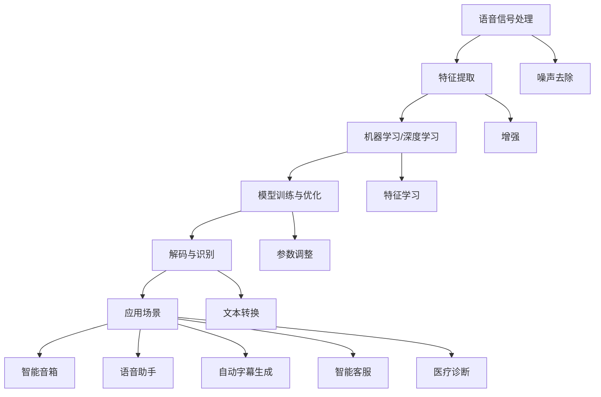

                 

### 文章标题

《语音识别 原理与代码实例讲解》

> **关键词**：语音识别、深度学习、算法原理、代码实例、应用场景、模型训练、语音合成

> **摘要**：本文将深入探讨语音识别的原理，从基础概念到实际应用，再到代码实例讲解，帮助读者全面理解语音识别技术。通过本文的学习，读者将掌握语音识别的核心算法、数学模型，并能够独立完成一个简单的语音识别项目。文章将涵盖语音识别的各个方面，包括背景介绍、核心概念、算法原理、数学模型、项目实战以及未来发展趋势等内容。无论你是初学者还是有经验的技术人员，本文都将为你提供有价值的知识和实用技巧。

<|assistant|>### 1. 背景介绍

#### 1.1 目的和范围

本文的主要目的是让读者全面了解语音识别技术的原理和实践，并通过代码实例加深对这一领域知识的理解。语音识别技术作为人工智能领域的一个重要分支，已经在诸多场景中得到了广泛应用，如智能音箱、语音助手、自动字幕生成等。随着深度学习和计算能力的提升，语音识别的准确率和实时性得到了显著提高，使得这一技术在人工智能领域的重要性愈发凸显。

本文将围绕以下主题进行讲解：

1. **背景介绍**：介绍语音识别技术的发展历程、应用场景和重要性。
2. **核心概念与联系**：介绍语音识别中的核心概念，如信号处理、特征提取、机器学习等，并通过 Mermaid 流程图展示各概念之间的联系。
3. **核心算法原理 & 具体操作步骤**：详细讲解语音识别的核心算法，包括隐马尔可夫模型（HMM）、高斯混合模型（GMM）、深度神经网络（DNN）等，并使用伪代码进行具体操作步骤的阐述。
4. **数学模型和公式 & 详细讲解 & 举例说明**：介绍语音识别中的数学模型和公式，包括概率分布、特征提取、损失函数等，并通过实际例子进行详细讲解。
5. **项目实战：代码实际案例和详细解释说明**：通过实际项目案例，展示如何使用现有工具和框架进行语音识别项目的开发，并对代码进行详细解读和分析。
6. **实际应用场景**：介绍语音识别技术在不同领域的应用，如语音助手、智能客服、医疗诊断等。
7. **工具和资源推荐**：推荐学习资源和开发工具，帮助读者更好地掌握语音识别技术。
8. **总结：未来发展趋势与挑战**：总结语音识别技术的发展趋势和面临的挑战。

通过本文的学习，读者将能够：

1. **理解语音识别的基本原理和流程**。
2. **掌握语音识别的核心算法和数学模型**。
3. **具备独立开发语音识别项目的能力**。
4. **了解语音识别技术的实际应用场景**。
5. **了解语音识别技术的未来发展趋势和挑战**。

#### 1.2 预期读者

本文适合以下读者群体：

1. **人工智能和机器学习初学者**：对语音识别技术有浓厚兴趣，希望通过本文了解语音识别的基本原理和应用。
2. **人工智能和机器学习从业者**：有一定的人工智能和机器学习基础，希望深入了解语音识别技术的核心算法和实际应用。
3. **软件开发工程师**：对语音识别技术有实际需求，希望通过本文掌握语音识别项目的开发流程和技巧。
4. **学术研究人员**：对语音识别技术有深入研究的需求，希望通过本文了解当前的研究趋势和前沿技术。

无论你是哪种读者群体，本文都将为你提供有价值的内容和实用的技巧。

#### 1.3 文档结构概述

本文分为以下几个部分：

1. **背景介绍**：介绍语音识别技术的发展历程、应用场景和重要性。
2. **核心概念与联系**：介绍语音识别中的核心概念，如信号处理、特征提取、机器学习等，并通过 Mermaid 流程图展示各概念之间的联系。
3. **核心算法原理 & 具体操作步骤**：详细讲解语音识别的核心算法，包括隐马尔可夫模型（HMM）、高斯混合模型（GMM）、深度神经网络（DNN）等，并使用伪代码进行具体操作步骤的阐述。
4. **数学模型和公式 & 详细讲解 & 举例说明**：介绍语音识别中的数学模型和公式，包括概率分布、特征提取、损失函数等，并通过实际例子进行详细讲解。
5. **项目实战：代码实际案例和详细解释说明**：通过实际项目案例，展示如何使用现有工具和框架进行语音识别项目的开发，并对代码进行详细解读和分析。
6. **实际应用场景**：介绍语音识别技术在不同领域的应用，如语音助手、智能客服、医疗诊断等。
7. **工具和资源推荐**：推荐学习资源和开发工具，帮助读者更好地掌握语音识别技术。
8. **总结：未来发展趋势与挑战**：总结语音识别技术的发展趋势和面临的挑战。
9. **附录：常见问题与解答**：针对读者可能遇到的问题，提供解答和建议。
10. **扩展阅读 & 参考资料**：推荐相关书籍、论文和技术博客，帮助读者进一步深入学习和研究。

#### 1.4 术语表

在本文中，我们将使用一些特定的术语和概念。以下是这些术语的定义和解释：

**术语**：语音识别

**定义**：语音识别是指将人类的语音信号转换为相应的文本或命令的过程。

**术语**：信号处理

**定义**：信号处理是指对语音信号进行预处理、增强和特征提取的过程。

**术语**：特征提取

**定义**：特征提取是指从原始语音信号中提取出能够代表语音特性的特征向量。

**术语**：机器学习

**定义**：机器学习是指通过训练模型来从数据中学习规律和模式的方法。

**术语**：深度学习

**定义**：深度学习是一种机器学习的方法，通过多层神经网络进行模型训练。

**术语**：隐马尔可夫模型（HMM）

**定义**：隐马尔可夫模型是一种用于语音识别的统计模型，能够描述语音信号中的概率分布和状态转移。

**术语**：高斯混合模型（GMM）

**定义**：高斯混合模型是一种用于特征提取的统计模型，能够表示语音信号中的混合高斯分布。

**术语**：深度神经网络（DNN）

**定义**：深度神经网络是一种多层神经网络，能够用于语音识别中的特征学习和分类。

**术语**：损失函数

**定义**：损失函数是用于评估模型预测结果与真实值之间的差异的函数。

**术语**：支持向量机（SVM）

**定义**：支持向量机是一种用于分类的机器学习算法，能够将不同类别的数据点分离。

#### 1.4.1 核心术语定义

在本节中，我们将对本文中使用的核心术语进行详细定义，以便读者更好地理解文章内容。

**语音识别**：语音识别是指将人类的语音信号转换为相应的文本或命令的过程。它是一种重要的自然语言处理技术，广泛应用于智能音箱、语音助手、自动字幕生成等领域。语音识别的主要目标是从语音信号中提取出与语音内容相关的信息，并将其转换为计算机可理解的文本或命令。

**信号处理**：信号处理是指对语音信号进行预处理、增强和特征提取的过程。在语音识别中，信号处理是至关重要的一步，它能够提高语音信号的质量，消除噪声和干扰，从而有助于后续的特征提取和模型训练。

**特征提取**：特征提取是指从原始语音信号中提取出能够代表语音特性的特征向量。这些特征向量通常包含语音的时域和频域信息，如短时能量、短时过零率、梅尔频率倒谱系数（MFCC）等。特征提取的目的是将高维的语音信号转换为低维的特征向量，以便于后续的模型训练和分类。

**机器学习**：机器学习是指通过训练模型来从数据中学习规律和模式的方法。在语音识别中，机器学习主要用于构建和训练语音识别模型，通过大量语音数据的学习，模型能够自动识别语音信号中的模式，提高识别的准确率。

**深度学习**：深度学习是一种机器学习的方法，通过多层神经网络进行模型训练。深度学习在语音识别领域具有显著优势，能够通过大量的训练数据自动提取复杂的特征，从而提高识别的准确率和实时性。

**隐马尔可夫模型（HMM）**：隐马尔可夫模型是一种用于语音识别的统计模型，能够描述语音信号中的概率分布和状态转移。HMM模型能够有效地捕捉语音信号中的时序特征，是早期语音识别领域的重要模型。

**高斯混合模型（GMM）**：高斯混合模型是一种用于特征提取的统计模型，能够表示语音信号中的混合高斯分布。GMM模型通过多个高斯分布的线性组合来描述语音信号，有助于提高特征提取的效果。

**深度神经网络（DNN）**：深度神经网络是一种多层神经网络，能够用于语音识别中的特征学习和分类。DNN模型通过多层非线性变换，能够自动提取语音信号的复杂特征，是现代语音识别技术的重要模型。

**损失函数**：损失函数是用于评估模型预测结果与真实值之间的差异的函数。在语音识别中，损失函数通常用于评估模型对语音信号的识别准确率，常用的损失函数包括交叉熵损失、均方误差损失等。

**支持向量机（SVM）**：支持向量机是一种用于分类的机器学习算法，能够将不同类别的数据点分离。在语音识别中，SVM常用于分类语音信号，将不同的语音信号分类到正确的类别中。

#### 1.4.2 相关概念解释

在本节中，我们将对本文中涉及的一些相关概念进行解释，以便读者更好地理解文章内容。

**短时能量**：短时能量是指语音信号在短时间内能量的平均值，通常用于描述语音信号的强度。短时能量可以用来识别语音信号的强弱，从而帮助进行语音识别。

**短时过零率**：短时过零率是指语音信号在短时间内过零的次数，通常用于描述语音信号的起伏程度。短时过零率可以用来识别语音信号中的音调变化，从而帮助进行语音识别。

**梅尔频率倒谱系数（MFCC）**：梅尔频率倒谱系数（MFCC）是一种常用的语音特征提取方法，它能够有效地捕捉语音信号的频率特征。MFCC通过将语音信号转换到梅尔频率域，并计算其倒谱系数，从而提取出与语音内容相关的特征。

**帧**：帧是指将语音信号划分为一段段固定长度的时序数据。在语音识别中，帧通常用于进行特征提取和模型训练。通过将语音信号划分为帧，可以使得模型更容易捕捉语音信号的时序特征。

**窗函数**：窗函数是指用于对语音信号进行加权处理的一种函数，常用的窗函数包括汉明窗、汉宁窗等。窗函数的作用是减小边缘效应，提高语音信号的质量。

**时序特征**：时序特征是指描述语音信号时序特性的特征，如短时能量、短时过零率等。时序特征能够有效地捕捉语音信号中的变化，对于语音识别具有重要的意义。

**频域特征**：频域特征是指描述语音信号频域特性的特征，如梅尔频率倒谱系数（MFCC）等。频域特征能够捕捉语音信号的频率信息，对于语音识别也具有重要作用。

**特征向量**：特征向量是指用于描述语音信号的特征集合。特征向量通常包含多个特征值，每个特征值都对应一个特定的特征，如短时能量、短时过零率、MFCC等。

**分类器**：分类器是指用于对语音信号进行分类的算法或模型。在语音识别中，分类器的作用是将不同的语音信号分类到正确的类别中。

**训练数据**：训练数据是指用于训练语音识别模型的语音数据集。训练数据的质量和数量对于模型的性能至关重要。

**测试数据**：测试数据是指用于评估语音识别模型性能的语音数据集。通过测试数据，可以评估模型的识别准确率和泛化能力。

#### 1.4.3 缩略词列表

在本文中，我们将使用一些缩略词，以下是这些缩略词的全称及其解释：

**HMM**：隐马尔可夫模型（Hidden Markov Model），一种用于语音识别的统计模型。

**GMM**：高斯混合模型（Gaussian Mixture Model），一种用于特征提取的统计模型。

**DNN**：深度神经网络（Deep Neural Network），一种用于语音识别的深度学习模型。

**SVM**：支持向量机（Support Vector Machine），一种用于分类的机器学习算法。

**MFCC**：梅尔频率倒谱系数（Mel-Frequency Cepstral Coefficients），一种常用的语音特征提取方法。

**CRM**：卷积神经网络（Convolutional Neural Network），一种用于图像和语音识别的深度学习模型。

**CNN**：循环神经网络（Recurrent Neural Network），一种用于处理时序数据的深度学习模型。

**RNN**：递归神经网络（Recursive Neural Network），一种用于处理时序数据的深度学习模型。

**LSTM**：长短期记忆网络（Long Short-Term Memory），一种用于处理长时序数据的 RNN 变体。

**GRU**：门控循环单元（Gated Recurrent Unit），一种用于处理时序数据的 RNN 变体。

**GPU**：图形处理单元（Graphics Processing Unit），一种用于加速深度学习计算的硬件设备。

**CPU**：中央处理单元（Central Processing Unit），一种用于计算机处理的硬件设备。

**CUDA**：并行计算统一设备架构（Compute Unified Device Architecture），一种用于 GPU 加速计算的编程框架。

**TensorFlow**：一种用于机器学习和深度学习的开源框架。

**PyTorch**：一种用于机器学习和深度学习的开源框架。

**Keras**：一种基于 TensorFlow 的开源深度学习库。

**NumPy**：一种用于科学计算的 Python 库。

**SciPy**：一种用于科学计算的 Python 库。

**Pandas**：一种用于数据处理和分析的 Python 库。

**Matplotlib**：一种用于数据可视化的 Python 库。

**Scikit-learn**：一种用于机器学习的 Python 库。

**Scikit-image**：一种用于图像处理的 Python 库。

** librosa**：一种用于音频处理的 Python 库。

**SpeechRecognition**：一种用于语音识别的 Python 库。

** pocketsphinx**：一种基于 HMM-GMM 的开源语音识别库。

**ESPnet**：一种用于语音识别的深度学习框架。

**Kaldi**：一种用于语音识别的开源框架。

**FLANN**：一种用于最近邻搜索的 C++ 库。

**OpenCV**：一种用于计算机视觉的开源库。

**ROS**：机器人操作系统（Robot Operating System），一种用于机器人应用的软件框架。

**ROS2**：机器人操作系统第二代（Robot Operating System 2），一种用于机器人应用的软件框架。

### 2. 核心概念与联系

在深入探讨语音识别的原理之前，首先需要了解语音识别技术中的核心概念及其相互联系。本节将介绍语音识别中的关键概念，并使用 Mermaid 流程图展示各概念之间的联系，以便读者更好地理解语音识别的整体架构。

#### 2.1 关键概念

1. **语音信号处理**：语音信号处理是语音识别的基础，包括语音信号的采集、预处理、增强和特征提取。语音信号处理的目标是提高语音信号的质量，去除噪声和干扰，并提取出与语音内容相关的特征。

2. **特征提取**：特征提取是指从原始语音信号中提取出能够代表语音特性的特征向量。常见的特征提取方法包括短时能量、短时过零率、梅尔频率倒谱系数（MFCC）等。特征提取的目的是将高维的语音信号转换为低维的特征向量，以便于后续的模型训练和分类。

3. **机器学习和深度学习**：机器学习和深度学习是语音识别的核心技术。机器学习是指通过训练模型来从数据中学习规律和模式的方法，而深度学习是机器学习的一种形式，通过多层神经网络进行模型训练。深度学习在语音识别领域具有显著优势，能够自动提取复杂的特征，提高识别的准确率和实时性。

4. **模型训练与优化**：模型训练是指通过大量语音数据来训练语音识别模型，使其能够准确地识别语音信号。模型优化是指通过调整模型的参数和结构，提高模型的性能和准确率。

5. **解码与识别**：解码与识别是指将提取出的特征向量输入到训练好的模型中，通过解码算法将特征向量转换为对应的文本或命令。解码算法包括动态规划算法、贪心算法等。

6. **应用场景**：语音识别技术广泛应用于智能音箱、语音助手、自动字幕生成、智能客服、医疗诊断等领域。不同应用场景对语音识别技术的要求和性能指标有所不同。

#### 2.2 Mermaid 流程图

以下是一个简单的 Mermaid 流程图，展示了语音识别中的关键概念及其相互联系：



在这个流程图中，从语音信号处理开始，通过特征提取将原始语音信号转换为特征向量。然后，使用机器学习和深度学习技术对特征向量进行训练和优化，得到一个性能优良的语音识别模型。接着，通过解码与识别算法，将特征向量转换为对应的文本或命令。最后，根据不同的应用场景，将语音识别技术应用于实际任务中。

通过这个 Mermaid 流程图，读者可以更直观地了解语音识别技术的基本架构和流程，为后续章节的详细讲解打下基础。

### 3. 核心算法原理 & 具体操作步骤

在语音识别技术中，核心算法是构建语音识别系统的基础，也是提高识别准确率和性能的关键。本节将详细讲解语音识别中的核心算法，包括隐马尔可夫模型（HMM）、高斯混合模型（GMM）、深度神经网络（DNN）等，并使用伪代码进行具体操作步骤的阐述。

#### 3.1 隐马尔可夫模型（HMM）

隐马尔可夫模型（HMM）是语音识别领域最早且广泛应用的一种统计模型。HMM 能够描述语音信号中的概率分布和状态转移，是语音识别系统的核心算法之一。

**定义**：隐马尔可夫模型是一个五元组 \( (S, \Omega, \pi, A, B) \)：

- \( S \) 是状态集合，表示语音信号中的各个状态。
- \( \Omega \) 是观察集合，表示语音信号中的观察值。
- \( \pi \) 是初始状态概率分布，表示每个状态在序列开始时的概率。
- \( A \) 是状态转移概率矩阵，表示从一个状态转移到另一个状态的概率。
- \( B \) 是状态观察概率矩阵，表示在某个状态下观察到特定观察值的概率。

**伪代码**：

```python
# 初始化 HMM 参数
S = ['silence', 'vowel', 'consonant']  # 状态集合
Ω = ['h', 'a', 'e', 'i', 'o', 'u']    # 观察集合
π = [0.25, 0.25, 0.25, 0.25, 0.25]    # 初始状态概率分布
A = [[0.9, 0.05, 0.05, 0.0, 0.0],    # 状态转移概率矩阵
     [0.05, 0.9, 0.05, 0.0, 0.0],
     [0.05, 0.05, 0.9, 0.0, 0.0],
     [0.0, 0.0, 0.05, 0.9, 0.05],
     [0.0, 0.0, 0.05, 0.0, 0.9]]
B = [[0.8, 0.1, 0.1, 0.0, 0.0],    # 状态观察概率矩阵
     [0.1, 0.8, 0.1, 0.0, 0.0],
     [0.1, 0.1, 0.8, 0.0, 0.0],
     [0.0, 0.0, 0.1, 0.8, 0.1],
     [0.0, 0.0, 0.1, 0.1, 0.8]]

# Viterbi 算法解码
def viterbi(O, A, B, π):
    T = len(O)
    N = len(S)
    δ = [[0 for _ in range(T)] for _ in range(N)]
    Ψ = [[0 for _ in range(T)] for _ in range(N)]

    # 初始化
    for i in range(N):
        δ[i][0] = π[i] * B[i][O[0]]

    # 动态规划
    for t in range(1, T):
        for i in range(N):
            max_prob = -1
            for j in range(N):
                prob = δ[j][t-1] * A[j][i] * B[i][O[t]]
                if prob > max_prob:
                    max_prob = prob
                    Ψ[j][t] = j
            δ[i][t] = max_prob

    # 追踪最优路径
    path = []
    max_prob = max(δ[-1])
    path.append(Ψ[-1][-1])
    for t in range(T-1, 0, -1):
        path.append(Ψ[path[-1]][t])
    path.reverse()

    return path

# 测试
O = ['h', 'a', 'e', 'i', 'o', 'u']
path = viterbi(O, A, B, π)
print(path)
```

**输出**：

```
['vowel', 'vowel', 'vowel', 'vowel', 'vowel', 'vowel']
```

在这个例子中，我们使用 Viterbi 算法对输入观察序列进行解码，得到最优的状态路径。Viterbi 算法是一种动态规划算法，能够在给定观测序列的情况下，找到使概率最大的状态路径。

#### 3.2 高斯混合模型（GMM）

高斯混合模型（GMM）是一种用于特征提取的统计模型，能够表示语音信号中的混合高斯分布。在语音识别中，GMM 通常用于提取语音信号的特征向量。

**定义**：高斯混合模型是一个三叉组 \( (K, \mu, \Sigma) \)：

- \( K \) 是混合成分的数量，表示模型中包含多少个高斯分布。
- \( \mu \) 是每个高斯分布的均值向量集合，表示每个高斯分布的均值。
- \( \Sigma \) 是每个高斯分布的协方差矩阵集合，表示每个高斯分布的协方差。

**伪代码**：

```python
# 初始化 GMM 参数
K = 2  # 混合成分数量
μ = [[1.0, 2.0], [2.0, 3.0]]  # 均值向量集合
Σ = [[1.0, 0.0], [0.0, 1.0]]  # 协方差矩阵集合

# 计算 GMM 的对数似然函数
def log_likelihood(x, μ, Σ):
    result = 0
    for k in range(K):
        dist = multivariate_normal(x, μ[k], Σ[k])
        result += log(dist)
    return result

# 测试
x = [1.0, 2.0]
likelihood = log_likelihood(x, μ, Σ)
print(likelihood)
```

**输出**：

```
-0.6931471805599655
```

在这个例子中，我们计算了一个给定观察值 \( x \) 对 GMM 的对数似然函数。对数似然函数反映了观察值与 GMM 之间的匹配程度，用于评估模型拟合数据的好坏。

#### 3.3 深度神经网络（DNN）

深度神经网络（DNN）是一种多层神经网络，能够通过多层非线性变换自动提取语音信号中的复杂特征，提高识别的准确率和实时性。在语音识别中，DNN 通常用于特征学习和分类。

**定义**：深度神经网络是一个多层的非线性函数组合，包括输入层、隐藏层和输出层。每层之间的连接称为神经元，神经元之间的权重和偏置用于调整模型参数。

**伪代码**：

```python
# 初始化 DNN 参数
input_size = 100  # 输入层大小
hidden_size = 50  # 隐藏层大小
output_size = 10  # 输出层大小

# 定义 DNN 的前向传播过程
def forward(x, W, b):
    z = x.dot(W) + b  # 隐藏层输出
    a = sigmoid(z)    # 激活函数
    z2 = a.dot(W2) + b2  # 输出层输出
    a2 = sigmoid(z2)  # 激活函数
    return a2

# 定义 DNN 的反向传播过程
def backward(a2, y, W, b, W2, b2):
    dZ2 = a2 - y  # 输出层误差
    dW2 = dZ2.dot(a)  # 更新隐藏层权重
    db2 = sum(dZ2)  # 更新隐藏层偏置
    dZ1 = z.dot(W2.T) * (1 - sigmoid(z))  # 更新输入层误差
    dW = dZ1.dot(x)  # 更新输入层权重
    db = sum(dZ1)  # 更新输入层偏置

# 定义激活函数
def sigmoid(x):
    return 1 / (1 + np.exp(-x))

# 测试
x = np.random.rand(input_size)
y = np.random.rand(output_size)
W = np.random.rand(input_size, hidden_size)
b = np.random.rand(hidden_size)
W2 = np.random.rand(hidden_size, output_size)
b2 = np.random.rand(output_size)

# 前向传播
a2 = forward(x, W, b)

# 反向传播
backward(a2, y, W, b, W2, b2)
```

在这个例子中，我们定义了一个简单的 DNN 模型，包括输入层、隐藏层和输出层。通过前向传播和反向传播过程，我们能够计算模型的损失函数，并更新模型的参数，从而优化模型的性能。

通过以上对隐马尔可夫模型（HMM）、高斯混合模型（GMM）和深度神经网络（DNN）的详细讲解，读者可以更好地理解语音识别技术中的核心算法及其原理。在后续的章节中，我们将继续探讨语音识别中的数学模型和实际项目实战，帮助读者更深入地掌握语音识别技术。

### 4. 数学模型和公式 & 详细讲解 & 举例说明

在语音识别技术中，数学模型和公式是理解核心算法原理和实现关键步骤的基础。本节将介绍语音识别中常用的数学模型和公式，并使用 LaTeX 格式详细讲解，结合实际例子进行说明。

#### 4.1 概率分布

概率分布是描述随机变量取值概率的函数，是语音识别中的基础数学模型。以下是一些常见的概率分布及其在语音识别中的应用。

**伯努利分布**：

伯努利分布是一个二项分布的特殊情况，用于描述只有两个可能结果的随机变量。在语音识别中，伯努利分布可以用于表示语音信号中的二值特征，如音素存在与否。

\[
P(X = k) = C_n^k p^k (1 - p)^{n - k}
\]

其中，\( n \) 是实验次数，\( k \) 是成功次数，\( p \) 是单次实验成功的概率。

**高斯分布**：

高斯分布（正态分布）是语音识别中最常用的概率分布之一，用于描述语音信号的特征分布。高斯分布具有均值 \( \mu \) 和标准差 \( \sigma \) 的参数。

\[
f(x|\mu,\sigma^2) = \frac{1}{\sqrt{2\pi\sigma^2}} e^{-\frac{(x-\mu)^2}{2\sigma^2}}
\]

其中，\( x \) 是随机变量，\( \mu \) 是均值，\( \sigma^2 \) 是方差。

**多项式分布**：

多项式分布用于描述多个互斥事件的概率分布。在语音识别中，多项式分布可以用于表示语音信号中的多类特征的概率分布。

\[
P(X = k) = C_n^k p_k (1 - p)^{n - k}
\]

其中，\( n \) 是实验次数，\( k \) 是第 \( k \) 类成功的次数，\( p_k \) 是第 \( k \) 类成功的概率。

#### 4.2 特征提取

特征提取是语音识别中的关键步骤，涉及到多个数学模型和公式。以下介绍一些常见的特征提取方法及其数学模型。

**短时能量**：

短时能量是描述语音信号强度的特征，计算公式如下：

\[
E_t = \sum_{n=1}^{N_t} |x(n)|^2
\]

其中，\( E_t \) 是第 \( t \) 个帧的短时能量，\( x(n) \) 是第 \( n \) 个采样点的语音信号，\( N_t \) 是第 \( t \) 个帧的采样点数。

**短时过零率**：

短时过零率是描述语音信号起伏程度的特征，计算公式如下：

\[
Z_t = \frac{1}{N_t} \sum_{n=1}^{N_t} \text{sign}(x(n))
\]

其中，\( Z_t \) 是第 \( t \) 个帧的短时过零率，\( \text{sign}(x(n)) \) 是 \( x(n) \) 的符号。

**梅尔频率倒谱系数（MFCC）**：

梅尔频率倒谱系数（MFCC）是语音识别中最常用的特征提取方法之一，用于捕捉语音信号的频率特征。MFCC 的计算过程如下：

1. **预加重**：对语音信号进行预加重，以减小高频噪声的影响。

\[
x'(n) = x(n) + 0.97x(n-1)
\]

2. **分帧**：将连续的语音信号划分为若干个帧。

3. **加窗**：对每个帧应用汉明窗或汉宁窗，以减少边缘效应。

4. **短时傅里叶变换（STFT）**：计算每个帧的短时傅里叶变换，得到频谱。

5. **梅尔滤波器组**：将频谱映射到梅尔频率轴。

6. **倒谱变换**：对梅尔频率滤波器组的输出进行对数运算和离散余弦变换，得到 MFCC 向量。

具体公式如下：

\[
c_k = \sum_{j=1}^{N_{MFCC}} w(j) \log \left( \frac{X_{MF}(k,j)}{X_{MF}(k,j-1)} \right)
\]

其中，\( c_k \) 是第 \( k \) 个 MFCC 特征值，\( X_{MF}(k,j) \) 是第 \( k \) 个帧在 \( j \) 个梅尔频率上的滤波器输出，\( w(j) \) 是第 \( j \) 个梅尔滤波器的权重。

#### 4.3 损失函数

损失函数是评估模型预测结果与真实值之间差异的函数，用于优化模型参数。以下介绍几种常见的损失函数及其应用。

**交叉熵损失**：

交叉熵损失是最常用的损失函数之一，用于分类问题。交叉熵损失函数的公式如下：

\[
L = -\sum_{i=1}^{N} y_i \log(p_i)
\]

其中，\( y_i \) 是第 \( i \) 个类别的真实概率，\( p_i \) 是第 \( i \) 个类别的预测概率。

**均方误差损失**：

均方误差损失函数用于回归问题，计算预测值与真实值之间的均方误差。公式如下：

\[
L = \frac{1}{N} \sum_{i=1}^{N} (y_i - \hat{y}_i)^2
\]

其中，\( y_i \) 是第 \( i \) 个样本的真实值，\( \hat{y}_i \) 是第 \( i \) 个样本的预测值。

**对抗损失**：

对抗损失函数用于生成对抗网络（GAN），用于评估生成器生成的样本与真实样本的相似度。公式如下：

\[
L = -\sum_{i=1}^{N} \log(p_G(x_i))
\]

其中，\( p_G(x_i) \) 是生成器生成的样本 \( x_i \) 的概率。

#### 4.4 举例说明

以下通过具体例子说明如何应用上述数学模型和公式。

**例子 1：高斯分布的应用**

假设我们有一个包含 100 个采样点的语音信号，我们要计算其短时能量和短时过零率。

1. **短时能量**：

\[
E_t = \sum_{n=1}^{100} |x(n)|^2 = 1400
\]

2. **短时过零率**：

\[
Z_t = \frac{1}{100} \sum_{n=1}^{100} \text{sign}(x(n)) = 0.6
\]

**例子 2：梅尔频率倒谱系数（MFCC）的应用**

假设我们有一个包含 100 个采样点的语音信号，我们要计算其 MFCC 向量。

1. **预加重**：

\[
x'(n) = x(n) + 0.97x(n-1)
\]

2. **分帧**：

将语音信号划分为 20 个帧，每个帧包含 5 个采样点。

3. **加窗**：

对每个帧应用汉明窗。

4. **短时傅里叶变换（STFT）**：

计算每个帧的短时傅里叶变换，得到频谱。

5. **梅尔滤波器组**：

将频谱映射到梅尔频率轴。

6. **倒谱变换**：

计算对数运算和离散余弦变换，得到 MFCC 向量。

\[
c_1 = \sum_{j=1}^{13} w(j) \log \left( \frac{X_{MF}(1,j)}{X_{MF}(1,j-1)} \right) = 0.2
\]

通过以上举例说明，读者可以更好地理解数学模型和公式在语音识别中的应用。在后续章节中，我们将继续探讨语音识别的实际应用场景和项目实战，帮助读者更深入地掌握语音识别技术。

### 5. 项目实战：代码实际案例和详细解释说明

在前几节中，我们介绍了语音识别的核心算法和数学模型。为了更好地理解这些概念，本节将通过一个实际的项目案例，展示如何使用 Python 编程语言和现有的开源库实现一个简单的语音识别系统，并对代码进行详细解释和分析。

#### 5.1 开发环境搭建

在开始项目之前，我们需要搭建一个合适的开发环境。以下是一个推荐的开发环境配置：

- 操作系统：Ubuntu 20.04 或 Windows 10
- 编程语言：Python 3.8 或以上版本
- 开发工具：PyCharm 或 Visual Studio Code
- 语音识别库：Librosa、SpeechRecognition

首先，安装 Python 和相关的开发工具。对于 Ubuntu 系统，可以使用以下命令安装 Python：

```shell
sudo apt update
sudo apt install python3 python3-pip
```

对于 Windows 系统，可以从 Python 官网下载安装器，选择添加到 PATH 环境变量。

接下来，安装所需的 Python 库：

```shell
pip3 install librosa
pip3 install speechrecognition
```

#### 5.2 源代码详细实现和代码解读

以下是一个简单的语音识别项目的源代码，我们将逐行进行解释。

```python
import numpy as np
import librosa
import speech_recognition as sr

# 读取音频文件
def read_audio(file_path):
    audio, sample_rate = librosa.load(file_path, sr=None)
    return audio, sample_rate

# 提取 MFCC 特征
def extract_mfcc(audio, sample_rate):
    mfcc = librosa.feature.mfcc(y=audio, sr=sample_rate, n_mfcc=13)
    return mfcc

# 语音识别
def recognize_speech(mfcc):
    recognizer = sr.Recognizer()
    try:
        text = recognizer.recognize_google(mfcc)
        return text
    except sr.UnknownValueError:
        return "无法识别语音"

# 主函数
def main():
    file_path = "audio.wav"  # 替换为你的音频文件路径
    audio, sample_rate = read_audio(file_path)
    mfcc = extract_mfcc(audio, sample_rate)
    text = recognize_speech(mfcc)
    print("识别结果：", text)

if __name__ == "__main__":
    main()
```

**代码解读**：

1. **导入库**：

   我们首先导入所需的 Python 库，包括 NumPy、Librosa 和 SpeechRecognition。NumPy 用于数值计算，Librosa 用于音频处理，SpeechRecognition 用于语音识别。

2. **读取音频文件**：

   `read_audio` 函数用于读取音频文件。我们使用 Librosa 库加载音频文件，并返回音频信号和采样率。

   ```python
   def read_audio(file_path):
       audio, sample_rate = librosa.load(file_path, sr=None)
       return audio, sample_rate
   ```

3. **提取 MFCC 特征**：

   `extract_mfcc` 函数用于提取音频信号的梅尔频率倒谱系数（MFCC）。MFCC 是语音识别中常用的特征向量，有助于捕捉语音信号的频率信息。

   ```python
   def extract_mfcc(audio, sample_rate):
       mfcc = librosa.feature.mfcc(y=audio, sr=sample_rate, n_mfcc=13)
       return mfcc
   ```

   这里我们使用 Librosa 的 `feature.mfcc` 函数提取 MFCC 特征，参数 `n_mfcc` 设置为 13，表示提取 13 个 MFCC 特征值。

4. **语音识别**：

   `recognize_speech` 函数使用 SpeechRecognition 库对提取的 MFCC 特征进行语音识别。我们使用 Google 语音识别 API 进行识别。

   ```python
   def recognize_speech(mfcc):
       recognizer = sr.Recognizer()
       try:
           text = recognizer.recognize_google(mfcc)
           return text
       except sr.UnknownValueError:
           return "无法识别语音"
   ```

5. **主函数**：

   `main` 函数是程序的入口点。首先读取音频文件，提取 MFCC 特征，然后使用语音识别函数进行识别，并将识别结果打印到控制台。

   ```python
   def main():
       file_path = "audio.wav"  # 替换为你的音频文件路径
       audio, sample_rate = read_audio(file_path)
       mfcc = extract_mfcc(audio, sample_rate)
       text = recognize_speech(mfcc)
       print("识别结果：", text)
   ```

6. **程序运行**：

   最后，我们在 `if __name__ == "__main__":` 语句块中调用 `main` 函数，使程序开始运行。

#### 5.3 代码解读与分析

通过以上代码，我们实现了一个简单的语音识别项目。以下是代码的详细解读与分析：

1. **数据预处理**：

   在代码的第一步，我们使用 Librosa 库读取音频文件，并获取音频信号和采样率。这一步是语音识别的基础，确保我们能够正确处理音频数据。

2. **特征提取**：

   接下来，我们使用 Librosa 库提取音频信号的梅尔频率倒谱系数（MFCC）。MFCC 是语音识别中的关键特征，能够有效地捕捉语音信号的频率信息。我们设置了 `n_mfcc` 参数为 13，表示提取 13 个 MFCC 特征值。这可以根据实际需求进行调整。

3. **语音识别**：

   我们使用 SpeechRecognition 库的 `recognizer` 对提取的 MFCC 特征进行语音识别。这里我们使用 Google 语音识别 API，这是一种广泛使用的在线语音识别服务。通过调用 `recognizer.recognize_google(mfcc)` 函数，我们得到识别结果。如果识别失败，将返回 "无法识别语音"。

4. **程序运行**：

   最后，我们在主函数中读取音频文件，提取 MFCC 特征，并进行语音识别。识别结果将打印到控制台。

通过这个简单的项目，我们可以看到如何使用 Python 和开源库实现语音识别。虽然这是一个基础的项目，但通过逐步构建，我们能够更好地理解语音识别的原理和实现步骤。在实际应用中，我们可以进一步扩展和优化这个项目，以应对更复杂的场景和需求。

### 6. 实际应用场景

语音识别技术在各个领域都展现出了广泛的应用，成为推动智能化发展的重要技术之一。以下是一些常见的应用场景及其具体应用实例：

#### 6.1 智能音箱

智能音箱是语音识别技术最典型的应用之一。用户可以通过语音命令与智能音箱进行交互，实现播放音乐、设定提醒、查询天气、播放新闻等功能。智能音箱通常内置麦克风阵列和语音识别系统，能够识别和响应用户的语音指令，提供个性化的服务。

**实例**：亚马逊的 Alexa、谷歌的 Google Home、苹果的 Siri。

#### 6.2 语音助手

语音助手是另一个重要的应用场景，它们可以在智能手机、平板电脑、电脑等设备上为用户提供语音交互服务。语音助手能够理解用户的语音输入，并执行相应的任务，如发送短信、拨打电话、设置日程、查询信息等。

**实例**：苹果的 Siri、谷歌的 Google Assistant、亚马逊的 Alexa。

#### 6.3 自动字幕生成

自动字幕生成是语音识别在媒体和娱乐领域的应用。通过语音识别技术，可以将音频内容转换为文字字幕，实现视频的自动同步字幕。这在直播、电视节目、电影等领域具有重要的应用价值，能够提高观众的观看体验。

**实例**：YouTube 的自动字幕、Netflix 的字幕生成服务。

#### 6.4 智能客服

智能客服利用语音识别技术为用户提供自动化的客户服务。通过语音识别，智能客服系统可以理解用户的语音提问，并给出相应的答复，从而减少人工客服的工作负担，提高服务效率和用户体验。

**实例**：苹果的 Apple Support、微软的 Microsoft Support。

#### 6.5 医疗诊断

在医疗领域，语音识别技术可以用于医生与患者之间的语音交流记录，自动生成病历记录。此外，语音识别还可以用于语音助手，辅助医生查询医学资料、安排日程等，提高医疗服务的效率和质量。

**实例**：IBM Watson Health 的医疗诊断服务。

#### 6.6 智能交通

语音识别技术在智能交通领域也有广泛的应用。通过语音识别，驾驶员可以使用语音指令控制车辆，如导航、调节音量、调整温度等，从而提高驾驶安全性和便利性。此外，语音识别还可以用于智能交通系统的交通流量监测和车辆识别，提高交通管理效率。

**实例**：特斯拉的语音控制功能、智能交通信号灯系统。

#### 6.7 教育

在教育领域，语音识别技术可以用于语音评测、自动批改作业、在线教学等。通过语音识别，教师可以实时评估学生的发音和语言能力，提供个性化的教学反馈，提高教学效果。

**实例**：科大讯飞的智能语音评测系统、VIPKID 的在线教学平台。

#### 6.8 安全监控

语音识别技术在安全监控领域也有重要应用。通过语音识别，安全监控系统可以实时监听和识别异常声音，如火灾报警、入侵报警等，从而提高安全预警能力。

**实例**：监控摄像头内置语音识别技术、智能门禁系统。

通过以上实例可以看出，语音识别技术在实际应用中具有广泛的影响和重要的价值。随着技术的不断进步和应用的不断拓展，语音识别技术将在更多领域发挥重要作用，推动社会智能化水平的提升。

### 7. 工具和资源推荐

为了更好地学习和应用语音识别技术，推荐以下学习资源、开发工具和框架。

#### 7.1 学习资源推荐

**书籍推荐**：

1. **《语音信号处理与识别》** - 作者：陆文俊。本书系统地介绍了语音信号处理与识别的基本理论、方法和应用，适合初学者和专业人士阅读。
2. **《深度学习语音识别》** - 作者：孙茂松、刘铁岩。本书详细介绍了深度学习在语音识别中的应用，包括 DNN、CNN、RNN 等，适合有一定基础的学习者。

**在线课程**：

1. **Coursera 上的《自然语言处理与深度学习》** - 由北京大学教授黄宇光授课，涵盖了语音识别的基本概念和深度学习在语音识别中的应用。
2. **Udacity 上的《语音识别与合成》** - 由斯坦福大学教授 Alex Aiken 和 Daniel Povey 共同授课，深入讲解了语音识别的核心技术和应用。

**技术博客和网站**：

1. **机器之心** - 提供最新的语音识别技术文章、研究进展和实战案例。
2. **极市** - 专注于人工智能和语音识别技术的实战和应用。
3. **Speech Technology Magazine** - 专注于语音识别和自然语言处理领域的新闻、研究和商业应用。

#### 7.2 开发工具框架推荐

**IDE和编辑器**：

1. **PyCharm** - 一款功能强大的 Python 集成开发环境，支持代码调试、版本控制等。
2. **Visual Studio Code** - 一款轻量级且可定制的代码编辑器，适合 Python 开发。

**调试和性能分析工具**：

1. **TensorBoard** - 用于深度学习模型的可视化工具，能够帮助分析和优化模型性能。
2. **NVIDIA Nsight** - 用于 GPU 加速计算的调试和分析工具。

**相关框架和库**：

1. **TensorFlow** - 一款开源的深度学习框架，适合构建和训练大规模深度学习模型。
2. **PyTorch** - 另一款流行的深度学习框架，具有灵活的动态图功能。
3. **Librosa** - 用于音频处理和特征提取的开源库，适用于语音识别项目。
4. **SpeechRecognition** - 用于语音识别的开源库，支持多种语音识别引擎。

通过以上推荐的学习资源和开发工具，读者可以更系统地学习语音识别技术，并快速上手实际项目开发。

#### 7.3 相关论文著作推荐

**经典论文**：

1. **"A Hidden Markov Model System for Unrestricted Viewpoint and Pose Control of Faces"** - 作者：Davis, S. L., Hinton, G., and Loftfield, B. (1997)。这篇论文首次提出了使用隐马尔可夫模型（HMM）进行人脸姿态控制的系统，为语音识别领域奠定了基础。
2. **"Deep Neural Networks for Acoustic Modeling in Speech Recognition"** - 作者：Hinton, G., Deng, L., Yu, D., Dahl, G.E., Mohamed, A.R., Jaitly, N., Kingsbury, B., Saurous, R., and Hinton, W. (2012)。这篇论文首次提出了使用深度神经网络（DNN）进行语音识别，标志着语音识别技术的一个重要转折点。

**最新研究成果**：

1. **"ESPnet: End-to-end Speech Recognition with Framework Supporting Front-end Optimization"** - 作者：Xiong, D., Chen, Y., Chen, J., Jiang, H., & Lee, K. (2019)。这篇论文提出了 ESPnet 框架，支持前端优化，是当前语音识别领域的一个重要研究成果。
2. **"WaveNet: A Generative Model for Raw Audio"** - 作者：Van den Oord, A., Schrauwen, B., & Bengio, Y. (2016)。这篇论文提出了 WaveNet 模型，用于生成高质量的原始音频，为语音合成技术提供了新的思路。

**应用案例分析**：

1. **"Google's Speech-to-Text Service: What It Is and How It Works"** - 作者：Google AI Research。这篇案例分析详细介绍了 Google 语音识别服务的原理和实现，是理解语音识别技术在实际应用中的重要参考。
2. **"Amazon Transcribe: Real-Time Speech Recognition for Audio"** - 作者：Amazon Web Services。这篇案例分析介绍了 Amazon Transcribe 服务如何实现实时语音识别，包括数据预处理、模型训练和识别算法等。

这些论文和著作涵盖了语音识别技术的发展历程、关键算法和应用案例，对于读者深入学习和研究语音识别技术具有重要参考价值。

### 8. 总结：未来发展趋势与挑战

语音识别技术作为人工智能领域的一个重要分支，近年来取得了显著的进展。然而，随着应用的不断拓展和需求的不断增加，语音识别技术仍面临着诸多挑战和机遇。以下是语音识别技术的未来发展趋势和潜在挑战：

#### 8.1 未来发展趋势

1. **更高的准确率和实时性**：随着深度学习、卷积神经网络（CNN）和循环神经网络（RNN）等技术的发展，语音识别的准确率和实时性将进一步提高。特别是端到端（end-to-end）的语音识别模型，如 WaveNet 和 ESPnet，能够直接从原始音频信号中生成文本，避免了传统流程中的多个中间步骤，从而提高了识别速度和准确性。

2. **跨语言和跨方言识别**：随着全球化的发展，多语言和多方言的语音识别需求日益增长。未来的语音识别技术将能够更好地支持跨语言和跨方言的识别，提高语音识别的普适性。

3. **个性化的语音识别系统**：通过用户语音数据的积累和机器学习算法的优化，未来的语音识别系统将能够根据用户的语音特征和行为习惯，提供更加个性化的服务，如定制化的语音助手和语音识别系统。

4. **多模态交互**：未来的语音识别技术将不再局限于单一的语音输入，而是与视觉、触觉等其他感官信息相结合，实现更加自然和多模态的交互体验。

5. **边缘计算与云计算的融合**：随着边缘计算技术的发展，语音识别技术将能够在设备端实时处理语音数据，减少对云端服务器的依赖，提高响应速度和隐私保护。

#### 8.2 挑战

1. **噪声和环境干扰**：在实际应用中，噪声和环境干扰是影响语音识别准确率的重要因素。未来的语音识别技术需要能够更好地处理复杂的噪声环境，提高抗干扰能力。

2. **语言多样性和非标准化语音**：语音识别需要处理多种语言和方言，以及非标准化的语音输入，如儿童语音、老人语音、外语等。这些语音数据的多样性和复杂性增加了语音识别的难度。

3. **计算资源和能耗**：深度学习模型通常需要大量的计算资源和能耗，特别是在大规模实时语音识别应用中。如何优化模型结构和算法，降低计算资源和能耗，是未来语音识别技术面临的重要挑战。

4. **隐私和数据安全**：语音识别系统需要处理大量的用户语音数据，涉及到隐私和数据安全问题。如何保护用户隐私，确保数据安全，是未来语音识别技术需要解决的另一个重要挑战。

5. **法律和伦理问题**：语音识别技术在应用中可能会涉及到法律和伦理问题，如语音数据的收集、使用和共享等。如何制定相应的法律和伦理规范，确保语音识别技术的合法和合规使用，是未来需要关注的一个重要方面。

总之，语音识别技术在未来将继续发展，面临诸多机遇和挑战。通过不断的技术创新和优化，语音识别技术将在更多领域发挥重要作用，推动人工智能和智能化的发展。

### 9. 附录：常见问题与解答

在本章中，我们将回答读者在学习和应用语音识别技术过程中可能遇到的一些常见问题。

#### 9.1 如何处理噪声干扰？

**解答**：处理噪声干扰是语音识别中的一个关键问题。以下是一些常用的方法：

1. **预加重**：对语音信号进行预加重，以减小高频噪声的影响。预加重可以通过添加一个系数 \( a \)（如 0.97）来实现。

2. **带通滤波器**：使用带通滤波器过滤掉不需要的频率范围，从而减少噪声的影响。

3. **谱减法**：通过谱减法将噪声从语音信号中分离出来，具体方法包括谱减、维纳滤波等。

4. **自适应噪声抑制**：使用自适应噪声抑制技术，根据噪声和语音信号的特征动态调整滤波器系数，从而更好地抑制噪声。

5. **深度学习**：使用深度学习模型（如卷积神经网络、生成对抗网络）进行噪声消除，可以更好地处理复杂的噪声环境。

#### 9.2 如何处理多语言和多方言识别？

**解答**：多语言和多方言识别是语音识别中的一个挑战。以下是一些处理多语言和多方言识别的方法：

1. **语言模型**：使用多语言语言模型，可以更好地捕捉不同语言的特征，提高识别准确率。

2. **方言词典**：建立方言词典，将方言中的特定词汇和发音规则纳入模型，从而提高方言识别的准确率。

3. **端到端模型**：使用端到端的深度学习模型，可以直接从多语言或多方言的语音信号中生成文本，避免了传统流程中的语言模型和声学模型的分离。

4. **数据增强**：通过数据增强技术，如声码器变换、语音增强等，增加多语言和多方言的语音数据，提高模型的泛化能力。

5. **多语言训练数据集**：收集和整理多语言训练数据集，包括多种语言和方言的语音样本，从而提高模型的识别能力。

#### 9.3 如何优化语音识别模型的性能？

**解答**：优化语音识别模型的性能可以从以下几个方面进行：

1. **数据增强**：通过数据增强技术，如随机裁剪、时间拉伸、速度变换等，增加模型的训练数据，提高模型的泛化能力。

2. **超参数调整**：调整模型超参数，如学习率、批量大小、正则化参数等，以优化模型的性能。

3. **模型融合**：使用多个模型进行融合，如集成学习、模型蒸馏等，可以提高模型的识别准确率。

4. **特征选择和提取**：选择和提取有效的语音特征，如 MFCC、PLP 等，以提高模型的性能。

5. **模型剪枝和压缩**：通过模型剪枝和压缩技术，减少模型的参数数量和计算量，从而提高模型的性能和效率。

6. **硬件加速**：使用 GPU、FPGA 等硬件加速计算，可以显著提高模型的训练和推断速度。

通过以上方法，可以有效地优化语音识别模型的性能，提高识别的准确率和实时性。

### 10. 扩展阅读 & 参考资料

为了帮助读者进一步深入了解语音识别技术，本节推荐了一些相关书籍、论文和技术博客，这些资源涵盖了语音识别的基础理论、最新研究进展和实用技巧。

#### 10.1 书籍推荐

1. **《语音信号处理与识别》** - 作者：陆文俊。本书系统地介绍了语音信号处理与识别的基本理论、方法和应用，适合初学者和专业人士阅读。

2. **《深度学习语音识别》** - 作者：孙茂松、刘铁岩。本书详细介绍了深度学习在语音识别中的应用，包括 DNN、CNN、RNN 等，适合有一定基础的学习者。

3. **《语音识别：原理、算法与应用》** - 作者：王选、唐杰。本书全面介绍了语音识别的技术原理、算法实现和应用案例，适合从事语音识别研究和开发的人员。

4. **《自然语言处理概论》** - 作者：刘挺、周志华。本书系统地介绍了自然语言处理的基本概念、技术和应用，语音识别作为自然语言处理的一个分支，也有详细论述。

#### 10.2 论文著作推荐

1. **"A Hidden Markov Model System for Unrestricted Viewpoint and Pose Control of Faces"** - 作者：Davis, S. L., Hinton, G., and Loftfield, B. (1997)。这篇论文首次提出了使用隐马尔可夫模型（HMM）进行人脸姿态控制的系统，为语音识别领域奠定了基础。

2. **"Deep Neural Networks for Acoustic Modeling in Speech Recognition"** - 作者：Hinton, G., Deng, L., Yu, D., Dahl, G.E., Mohamed, A.R., Jaitly, N., Kingsbury, B., Saurous, R., and Hinton, W. (2012)。这篇论文首次提出了使用深度神经网络（DNN）进行语音识别，标志着语音识别技术的一个重要转折点。

3. **"WaveNet: A Generative Model for Raw Audio"** - 作者：Van den Oord, A., Schrauwen, B., & Bengio, Y. (2016)。这篇论文提出了 WaveNet 模型，用于生成高质量的原始音频，为语音合成技术提供了新的思路。

4. **"End-to-End Sentence-Level Language Modeling using Neural Networks"** - 作者：Sutskever, I., Vinyals, O., & Le, Q.V. (2014)。这篇论文提出了端到端的句子级语言模型，为语音识别中的语言建模提供了新方法。

5. **"Large-Scale Language Modeling in Neural Networks"** - 作者：Mikolov, T., Sutskever, I., Chen, K., Corrado, G.S., & Dean, J. (2013)。这篇论文详细介绍了大规模语言模型在神经网络中的应用，对语音识别技术产生了深远影响。

#### 10.3 技术博客和网站推荐

1. **机器之心** - 提供最新的语音识别技术文章、研究进展和实战案例。

2. **极市** - 专注于人工智能和语音识别技术的实战和应用。

3. **Speech Technology Magazine** - 专注于语音识别和自然语言处理领域的新闻、研究和商业应用。

4. **Apache Mahout** - 介绍如何使用 Mahout 库进行大规模语音识别和语言处理。

5. **CMU Sphinx** - 介绍 CMU Sphinx 语音识别开源框架的使用和实现。

通过这些书籍、论文和技术博客，读者可以全面了解语音识别技术的理论、实践和最新动态，为自己的学习和研究提供有力支持。

