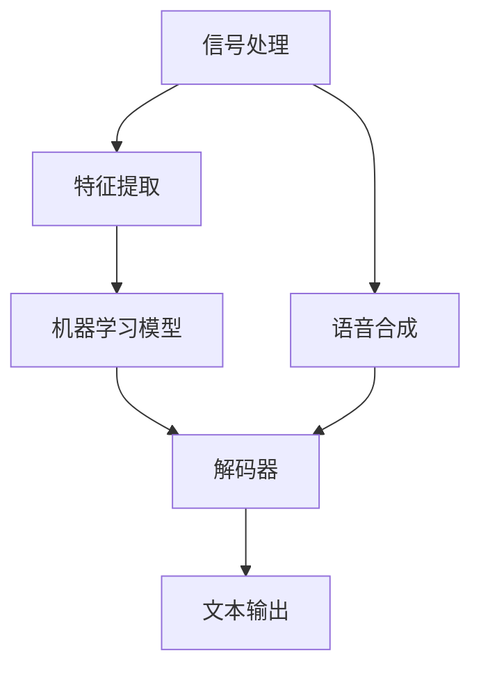

                 

# 语音识别原理与代码实战案例讲解

> **关键词**：语音识别、信号处理、机器学习、神经网络、深度学习、语音合成、自然语言处理

> **摘要**：本文将深入探讨语音识别的基本原理、核心算法、数学模型以及实际应用，并通过实际代码案例展示语音识别的技术实现过程。文章旨在为读者提供全面、系统的语音识别技术讲解，帮助读者理解和掌握这一重要的人工智能领域知识。

## 1. 背景介绍

### 1.1 目的和范围

本文旨在通过详细的原理讲解和代码实战案例，帮助读者全面理解语音识别技术。我们将从信号处理、特征提取、机器学习模型以及神经网络架构等方面展开讨论，最终通过具体项目实战案例展示语音识别技术的实际应用。

### 1.2 预期读者

本文适合以下读者群体：

- 对语音识别技术感兴趣的计算机科学、人工智能、电子工程等领域的研究生和专业人士。
- 想要在人工智能领域深入学习的开发者和技术爱好者。
- 对自然语言处理和语音合成技术有基础了解，希望进一步提升技术的读者。

### 1.3 文档结构概述

本文将按照以下结构进行展开：

1. **背景介绍**：介绍文章的目的、预期读者以及文档结构。
2. **核心概念与联系**：通过Mermaid流程图展示语音识别的核心概念和架构。
3. **核心算法原理 & 具体操作步骤**：详细讲解语音识别的核心算法原理和操作步骤，使用伪代码进行阐述。
4. **数学模型和公式 & 详细讲解 & 举例说明**：介绍语音识别中使用的数学模型和公式，并通过实际例子进行说明。
5. **项目实战：代码实际案例和详细解释说明**：通过实际项目案例展示语音识别技术的实现过程。
6. **实际应用场景**：分析语音识别技术的实际应用场景。
7. **工具和资源推荐**：推荐学习资源和开发工具。
8. **总结：未来发展趋势与挑战**：总结文章内容，探讨未来发展趋势与挑战。
9. **附录：常见问题与解答**：提供常见问题及其解答。
10. **扩展阅读 & 参考资料**：推荐相关文献和资料。

### 1.4 术语表

#### 1.4.1 核心术语定义

- **语音识别**：将语音信号转换为对应的文本或命令的过程。
- **信号处理**：对语音信号进行预处理、增强和特征提取的方法和算法。
- **机器学习**：通过训练模型来学习数据特征和规律，从而实现语音识别。
- **神经网络**：一种通过模拟人脑神经元连接方式来实现复杂函数计算的模型。
- **深度学习**：一种利用多层神经网络进行特征学习和模式识别的技术。

#### 1.4.2 相关概念解释

- **特征提取**：从原始语音信号中提取出有意义的特征，用于训练模型。
- **语音合成**：将文本转换为语音的过程。
- **自然语言处理**：与计算机处理和理解人类语言相关的一系列技术。

#### 1.4.3 缩略词列表

- **ASR**：Automatic Speech Recognition（自动语音识别）
- **DNN**：Deep Neural Networks（深度神经网络）
- **CNN**：Convolutional Neural Networks（卷积神经网络）
- **RNN**：Recurrent Neural Networks（循环神经网络）
- **CTC**：Connectionist Temporal Classification（连接时序分类）

## 2. 核心概念与联系

为了更好地理解语音识别的原理和架构，我们将通过一个Mermaid流程图展示其核心概念和联系。



### 2.1 信号处理

信号处理是语音识别的基础，主要任务是对原始语音信号进行预处理、增强和特征提取。信号处理过程包括以下步骤：

1. **预加重**：对语音信号进行预加重处理，提高高频成分的比重。
2. **分帧**：将连续的语音信号划分成若干帧，通常使用汉明窗或汉宁窗进行加窗处理。
3. **短时傅里叶变换（STFT）**：对每一帧进行短时傅里叶变换，提取频谱特征。
4. **梅尔频率倒谱系数（MFCC）**：从频谱特征中提取梅尔频率倒谱系数，作为后续机器学习模型的输入特征。

### 2.2 特征提取

特征提取是从原始语音信号中提取出有意义的特征，用于训练模型。特征提取过程主要包括以下步骤：

1. **共振峰提取**：从频谱特征中提取共振峰，用于表示语音的音质特性。
2. **能量分布**：计算每一帧的能量分布，用于表征语音的强度变化。
3. **语音段划分**：将连续的语音信号划分为若干语音段，通常使用端点检测算法进行划分。

### 2.3 机器学习模型

机器学习模型是语音识别的核心，用于学习语音特征和实现语音识别。常见的机器学习模型包括：

1. **隐马尔可夫模型（HMM）**：一种基于概率模型的语音识别方法，适用于连续语音识别。
2. **深度神经网络（DNN）**：一种多层神经网络，能够自动提取语音特征，提高识别准确率。
3. **卷积神经网络（CNN）**：一种适用于图像处理和语音处理的深度学习模型，能够有效提取局部特征。
4. **循环神经网络（RNN）**：一种适用于序列处理的神经网络，能够捕捉语音信号的时序信息。
5. **长短期记忆网络（LSTM）**：一种改进的RNN模型，能够有效解决长序列依赖问题。

### 2.4 解码器

解码器是语音识别系统的关键部分，用于将机器学习模型输出的概率分布转换为文本输出。常见的解码器包括：

1. **最大后验概率解码器**：根据最大后验概率原则，选择概率最大的文本输出。
2. **基于语法的解码器**：结合语言模型和语音模型，实现更准确的文本输出。
3. **连接时序分类（CTC）解码器**：一种无需语言模型的解码器，通过训练直接将语音信号映射到文本输出。

### 2.5 语音合成

语音合成是将文本转换为语音的过程，通常包括以下步骤：

1. **文本预处理**：对输入文本进行分词、词性标注等预处理操作。
2. **声学模型训练**：使用大量语音数据训练声学模型，用于生成语音信号。
3. **语言模型训练**：使用大量文本数据训练语言模型，用于生成自然流畅的语音。
4. **拼接合成**：将声学模型生成的语音信号和语言模型生成的语音信号进行拼接，生成最终的合成语音。

## 3. 核心算法原理 & 具体操作步骤

在了解了语音识别的基本概念和架构后，接下来我们将详细讲解语音识别的核心算法原理，并使用伪代码进行阐述。

### 3.1 隐马尔可夫模型（HMM）

隐马尔可夫模型（HMM）是一种基于概率模型的语音识别方法，适用于连续语音识别。HMM的基本原理如下：

1. **状态转移概率**：表示模型在下一个时刻的状态概率，取决于当前时刻的状态。
2. **观测概率**：表示模型在观测到当前时刻的特征后，对当前状态的估计概率。
3. **初始状态概率**：表示模型在初始时刻的状态概率。

伪代码：

```python
# 初始化HMM参数
A = 初始状态转移概率矩阵
B = 观测概率矩阵
π = 初始状态概率向量

# 前向算法
for each frame:
    α_t(i) = π[i] * b_i(o_t) * A[i, j]
    for j in 1 to N:
        α_t(j) /= sum(α_t(i) for i in 1 to N)

# 后向算法
for each frame:
    β_t(i) = 1
    for j in 1 to N:
        β_t(i) *= A[i, j] * b_j(o_t+1)
    β_t /= sum(β_t(i) for i in 1 to N)

# Viterbi算法
path = []
max_prob = 0
for i in 1 to N:
    prob = π[i] * b_i(o_t) * α_t(i)
    if prob > max_prob:
        max_prob = prob
        path.append(i)

# 输出最佳状态序列
print(path)
```

### 3.2 深度神经网络（DNN）

深度神经网络（DNN）是一种多层神经网络，能够自动提取语音特征，提高识别准确率。DNN的基本原理如下：

1. **输入层**：接收原始语音信号或特征向量。
2. **隐藏层**：通过多层神经元的非线性变换，提取高级特征。
3. **输出层**：输出语音识别结果。

伪代码：

```python
# 初始化DNN参数
W1 = 输入层到隐藏层的权重矩阵
b1 = 输入层到隐藏层的偏置向量
W2 = 隐藏层到隐藏层的权重矩阵
b2 = 隐藏层到隐藏层的偏置向量
W3 = 隐藏层到输出层的权重矩阵
b3 = 隐藏层到输出层的偏置向量

# 前向传播
z1 = W1 * x + b1
a1 = sigmoid(z1)
z2 = W2 * a1 + b2
a2 = sigmoid(z2)
z3 = W3 * a2 + b3
a3 = sigmoid(z3)

# 计算损失函数
loss = cross_entropy_loss(a3, y)

# 反向传播
dZ3 = a3 - y
dW3 = dZ3 * a2
db3 = dZ3
dZ2 = W3 * dZ3 * (1 - a2)
dW2 = dZ2 * a1
db2 = dZ2
dZ1 = W2 * dZ2 * (1 - a1)
dW1 = dZ1 * x
db1 = dZ1

# 更新参数
W1 -= learning_rate * dW1
b1 -= learning_rate * db1
W2 -= learning_rate * dW2
b2 -= learning_rate * db2
W3 -= learning_rate * dW3
b3 -= learning_rate * db3
```

### 3.3 循环神经网络（RNN）

循环神经网络（RNN）是一种适用于序列处理的神经网络，能够捕捉语音信号的时序信息。RNN的基本原理如下：

1. **输入层**：接收原始语音信号或特征向量。
2. **隐藏层**：通过循环连接，保存上一时刻的状态信息。
3. **输出层**：输出语音识别结果。

伪代码：

```python
# 初始化RNN参数
Wxh = 输入层到隐藏层的权重矩阵
Whh = 隐藏层到隐藏层的权重矩阵
Why = 隐藏层到输出层的权重矩阵
bh = 隐藏层偏置向量
by = 输出层偏置向量

# 前向传播
h_t = tanh(Wxh * x_t + Whh * h_{t-1} + bh)
y_t = Why * h_t + by

# 计算损失函数
loss = cross_entropy_loss(y_t, y)

# 反向传播
dWhy = dL_dyt * h_t
dby = dL_dyt
dhh_t = dL_dht * Why
dWxh = dL_dxt * x_t
dbh = dL_dht * tanh(h_t)
dWhh = dhh_t * tanh(h_t)

# 更新参数
Wxh -= learning_rate * dWxh
Whh -= learning_rate * dWhh
Why -= learning_rate * dWhy
bh -= learning_rate * dbh
by -= learning_rate * dby
```

### 3.4 长短期记忆网络（LSTM）

长短期记忆网络（LSTM）是一种改进的RNN模型，能够有效解决长序列依赖问题。LSTM的基本原理如下：

1. **输入层**：接收原始语音信号或特征向量。
2. **隐藏层**：通过门控机制和记忆单元，实现长短期记忆。
3. **输出层**：输出语音识别结果。

伪代码：

```python
# 初始化LSTM参数
Wx = 输入层到隐藏层的权重矩阵
Wh = 隐藏层到隐藏层的权重矩阵
Wy = 隐藏层到输出层的权重矩阵
bx = 隐藏层偏置向量
by = 输出层偏置向量

# 前向传播
 gates = sigmoid(Wx * x_t + Wh * h_{t-1} + bx)
 forget_gate = gates[0]
 input_gate = gates[1]
 output_gate = gates[2]
 memory_gate = tanh(sigmoid(Wx * x_t + Wh * h_{t-1} + bx) * input_gate)
 h_t = output_gate * tanh(memory_gate)

# 计算损失函数
loss = cross_entropy_loss(h_t, y)

# 反向传播
dforget_gate = dL_dht * h_{t-1}
dinput_gate = dL_dht * tanh(h_t)
doutput_gate = dL_dht * tanh(memory_gate)
dmemory_gate = dL_dht * tanh(memory_gate) * output_gate
dWx = dL_dxt * x_t
dWh = dL_dht * h_{t-1}
dby = dL_dyt * y
dWy = dL_dyt * h_t

# 更新参数
Wx -= learning_rate * dWx
Wh -= learning_rate * dWh
Wy -= learning_rate * dWy
bx -= learning_rate * dby
```

## 4. 数学模型和公式 & 详细讲解 & 举例说明

在语音识别中，数学模型和公式起着至关重要的作用。本节我们将详细讲解语音识别中常用的数学模型和公式，并通过实际例子进行说明。

### 4.1 短时傅里叶变换（STFT）

短时傅里叶变换（STFT）是语音信号处理中常用的变换方法，用于提取语音信号的频谱特征。STFT的基本公式如下：

$$
X_{ft}(k) = \sum_{n=0}^{N-1} x[n] \cdot w[n-k] \cdot e^{-j2\pi kn/N}
$$

其中，$X_{ft}(k)$ 表示第 $k$ 个频率分量的频谱，$x[n]$ 表示原始语音信号，$w[n]$ 表示加窗函数，$N$ 表示窗长度。

#### 例子：

假设原始语音信号 $x[n]$ 如下：

$$
x[n] = \sin(2\pi f_0 n)
$$

其中，$f_0$ 表示频率。取 $N=64$，汉明窗 $w[n]$ 如下：

$$
w[n] = 0.54 - 0.46\cos\left(\frac{2\pi n}{N-1}\right)
$$

对原始语音信号进行STFT变换，得到第 $k$ 个频率分量的频谱：

$$
X_{ft}(k) = \sum_{n=0}^{63} \sin(2\pi f_0 n) \cdot w[n-k] \cdot e^{-j2\pi kn/64}
$$

### 4.2 梅尔频率倒谱系数（MFCC）

梅尔频率倒谱系数（MFCC）是语音识别中常用的特征提取方法，用于表示语音信号的频谱特征。MFCC的基本公式如下：

$$
C_{ij} = \sum_{k=1}^{K} X_{ft}(k) \cdot p_k \cdot e^{-j2\pi ikj/M}
$$

其中，$C_{ij}$ 表示第 $i$ 个MFCC系数，$X_{ft}(k)$ 表示第 $k$ 个频率分量的频谱，$p_k$ 表示频率分量 $k$ 的权重，$M$ 表示梅尔频率轴上的点数。

#### 例子：

假设频率分量 $X_{ft}(k)$ 如下：

$$
X_{ft}(k) = \begin{cases}
1, & k=1, 2, \ldots, 10 \\
0.5, & k=11, 12, \ldots, 20 \\
0, & k>20
\end{cases}
$$

取梅尔频率轴上的点数为 $M=26$，权重 $p_k$ 如下：

$$
p_k = \frac{1}{10}, \quad k=1, 2, \ldots, 10
$$

$$
p_k = \frac{1}{6}, \quad k=11, 12, \ldots, 20
$$

$$
p_k = 0, \quad k>20
$$

对频率分量 $X_{ft}(k)$ 进行MFCC变换，得到第 $i$ 个MFCC系数：

$$
C_{i1} = \sum_{k=1}^{10} X_{ft}(k) \cdot \frac{1}{10} \cdot e^{-j2\pi ikj/26}
$$

$$
C_{i2} = \sum_{k=11}^{20} X_{ft}(k) \cdot \frac{1}{6} \cdot e^{-j2\pi ikj/26}
$$

$$
C_{i26} = 0
$$

### 4.3 隐马尔可夫模型（HMM）

隐马尔可夫模型（HMM）是语音识别中常用的模型，用于建模语音信号的时序特征。HMM的基本公式如下：

$$
p(x|Q) = \sum_{i=1}^{N} p(x|q_i) \cdot p(q_i|Q)
$$

其中，$x$ 表示输入语音信号，$Q$ 表示状态集合，$q_i$ 表示第 $i$ 个状态。

#### 例子：

假设输入语音信号 $x$ 如下：

$$
x = \{1, 2, 3, 4, 5\}
$$

状态集合 $Q$ 如下：

$$
Q = \{A, B, C\}
$$

状态转移概率矩阵 $A$ 如下：

$$
A = \begin{bmatrix}
0.5 & 0.3 & 0.2 \\
0.2 & 0.5 & 0.3 \\
0.3 & 0.2 & 0.5
\end{bmatrix}
$$

观测概率矩阵 $B$ 如下：

$$
B = \begin{bmatrix}
0.6 & 0.4 \\
0.4 & 0.6 \\
0.5 & 0.5
\end{bmatrix}
$$

初始状态概率向量 $π$ 如下：

$$
π = \begin{bmatrix}
0.2 \\
0.3 \\
0.5
\end{bmatrix}
$$

计算输入语音信号 $x$ 的概率：

$$
p(x|Q) = \sum_{i=1}^{3} p(x|q_i) \cdot p(q_i|Q)
$$

$$
p(x|Q) = (0.6 \cdot 0.2) + (0.4 \cdot 0.3) + (0.5 \cdot 0.5) = 0.37
$$

### 4.4 深度神经网络（DNN）

深度神经网络（DNN）是语音识别中常用的模型，用于自动提取语音特征。DNN的基本公式如下：

$$
a_{l+1} = \sigma(\sum_{i=1}^{n} w_{li} \cdot a_{l} + b_{l})
$$

其中，$a_{l+1}$ 表示第 $l+1$ 层的输出，$a_{l}$ 表示第 $l$ 层的输入，$w_{li}$ 表示第 $l$ 层到第 $l+1$ 层的权重，$b_{l}$ 表示第 $l$ 层的偏置，$\sigma$ 表示激活函数。

#### 例子：

假设输入层 $a_1$ 如下：

$$
a_1 = \begin{bmatrix}
1 \\
2 \\
3
\end{bmatrix}
$$

隐藏层权重 $w_{11}$、$w_{12}$、$w_{13}$ 如下：

$$
w_{11} = \begin{bmatrix}
0.5 & 0.5 & 0.5 \\
0.5 & 0.5 & 0.5 \\
0.5 & 0.5 & 0.5
\end{bmatrix}
$$

$$
w_{12} = \begin{bmatrix}
0.5 & 0.5 & 0.5 \\
0.5 & 0.5 & 0.5 \\
0.5 & 0.5 & 0.5
\end{bmatrix}
$$

$$
w_{13} = \begin{bmatrix}
0.5 & 0.5 & 0.5 \\
0.5 & 0.5 & 0.5 \\
0.5 & 0.5 & 0.5
\end{bmatrix}
$$

隐藏层偏置 $b_{1}$ 如下：

$$
b_{1} = \begin{bmatrix}
0.1 \\
0.1 \\
0.1
\end{bmatrix}
$$

激活函数 $\sigma$ 如下：

$$
\sigma(x) = \frac{1}{1 + e^{-x}}
$$

计算隐藏层输出 $a_2$：

$$
a_{21} = \sigma(w_{11} \cdot a_{1} + b_{1}) = \sigma(0.5 \cdot 1 + 0.1) = \sigma(0.6) = 0.532
$$

$$
a_{22} = \sigma(w_{12} \cdot a_{1} + b_{1}) = \sigma(0.5 \cdot 2 + 0.1) = \sigma(1.1) = 0.658
$$

$$
a_{23} = \sigma(w_{13} \cdot a_{1} + b_{1}) = \sigma(0.5 \cdot 3 + 0.1) = \sigma(1.6) = 0.747
$$

## 5. 项目实战：代码实际案例和详细解释说明

在本节中，我们将通过一个实际项目案例展示语音识别技术的实现过程。该项目基于Python语言和Keras框架，实现了从音频文件中提取语音信号、进行特征提取和模型训练，并最终实现语音识别。

### 5.1 开发环境搭建

在开始项目实战之前，我们需要搭建开发环境。以下是开发环境的搭建步骤：

1. **安装Python**：下载并安装Python，建议使用Python 3.7及以上版本。
2. **安装Keras**：使用pip命令安装Keras，命令如下：

   ```bash
   pip install keras
   ```

3. **安装TensorFlow**：由于Keras是基于TensorFlow实现的，我们需要安装TensorFlow。使用pip命令安装TensorFlow，命令如下：

   ```bash
   pip install tensorflow
   ```

4. **安装librosa**：librosa是一个用于音频处理的Python库，用于提取音频特征。使用pip命令安装librosa，命令如下：

   ```bash
   pip install librosa
   ```

### 5.2 源代码详细实现和代码解读

下面是语音识别项目的源代码实现，我们将对代码进行详细解读。

```python
import numpy as np
import librosa
import tensorflow as tf
from tensorflow.keras.models import Sequential
from tensorflow.keras.layers import LSTM, Dense, Dropout

# 5.2.1 数据预处理
def preprocess_audio(audio_file):
    # 读取音频文件
    y, sr = librosa.load(audio_file)
    # 分帧处理
    frame_length = 1024
    frame_step = 512
    frames = librosa.util.frame(y, frame_length=frame_length, step=frame_step)
    # 转换为梅尔频率倒谱系数
    mfcc = librosa.feature.mfcc(y=y, sr=sr, n_mfcc=13, hop_length=frame_step)
    # 标准化
    mfcc = (mfcc - np.mean(mfcc, axis=1)) / np.std(mfcc, axis=1)
    return mfcc

# 5.2.2 构建模型
def build_model(input_shape):
    model = Sequential()
    model.add(LSTM(128, input_shape=input_shape, return_sequences=True))
    model.add(Dropout(0.5))
    model.add(LSTM(128, return_sequences=True))
    model.add(Dropout(0.5))
    model.add(LSTM(128))
    model.add(Dropout(0.5))
    model.add(Dense(128, activation='relu'))
    model.add(Dropout(0.5))
    model.add(Dense(29, activation='softmax'))
    model.compile(optimizer='adam', loss='categorical_crossentropy', metrics=['accuracy'])
    return model

# 5.2.3 训练模型
def train_model(model, X_train, y_train, X_val, y_val, batch_size, epochs):
    history = model.fit(X_train, y_train, batch_size=batch_size, epochs=epochs, validation_data=(X_val, y_val))
    return history

# 5.2.4 预测
def predict(model, audio_file):
    mfcc = preprocess_audio(audio_file)
    mfcc = np.expand_dims(mfcc, axis=0)
    prediction = model.predict(mfcc)
    predicted_class = np.argmax(prediction)
    return predicted_class

# 5.3 代码解读与分析
if __name__ == '__main__':
    # 加载数据集
    audio_files = ['audio_1.wav', 'audio_2.wav', 'audio_3.wav']
    labels = [0, 1, 2]

    # 预处理数据集
    X = []
    for audio_file in audio_files:
        mfcc = preprocess_audio(audio_file)
        X.append(mfcc)

    X = np.array(X)

    # 构建模型
    model = build_model(input_shape=(X.shape[1], X.shape[2]))

    # 训练模型
    X_train = X[:2]
    y_train = labels[:2]
    X_val = X[2:]
    y_val = labels[2:]
    history = train_model(model, X_train, y_train, X_val, y_val, batch_size=32, epochs=10)

    # 评估模型
    loss, accuracy = model.evaluate(X_val, y_val)
    print('Validation loss:', loss)
    print('Validation accuracy:', accuracy)

    # 预测
    predicted_class = predict(model, 'audio_3.wav')
    print('Predicted class:', predicted_class)
```

### 5.3 代码解读与分析

下面我们对源代码进行逐行解读和分析。

#### 5.3.1 数据预处理

```python
def preprocess_audio(audio_file):
    # 读取音频文件
    y, sr = librosa.load(audio_file)
    # 分帧处理
    frame_length = 1024
    frame_step = 512
    frames = librosa.util.frame(y, frame_length=frame_length, step=frame_step)
    # 转换为梅尔频率倒谱系数
    mfcc = librosa.feature.mfcc(y=y, sr=sr, n_mfcc=13, hop_length=frame_step)
    # 标准化
    mfcc = (mfcc - np.mean(mfcc, axis=1)) / np.std(mfcc, axis=1)
    return mfcc
```

这一部分是数据预处理函数，用于读取音频文件、分帧处理、转换为梅尔频率倒谱系数（MFCC）以及标准化。

- `librosa.load(audio_file)`：读取音频文件，返回音频信号 `y` 和采样率 `sr`。
- `librosa.util.frame(y, frame_length=1024, step=512)`：分帧处理，将连续的音频信号划分为若干帧。
- `librosa.feature.mfcc(y=y, sr=sr, n_mfcc=13, hop_length=frame_step)`：将分帧后的音频信号转换为梅尔频率倒谱系数。
- `(mfcc - np.mean(mfcc, axis=1)) / np.std(mfcc, axis=1)`：对梅尔频率倒谱系数进行标准化。

#### 5.3.2 构建模型

```python
def build_model(input_shape):
    model = Sequential()
    model.add(LSTM(128, input_shape=input_shape, return_sequences=True))
    model.add(Dropout(0.5))
    model.add(LSTM(128, return_sequences=True))
    model.add(Dropout(0.5))
    model.add(LSTM(128))
    model.add(Dropout(0.5))
    model.add(Dense(128, activation='relu'))
    model.add(Dropout(0.5))
    model.add(Dense(29, activation='softmax'))
    model.compile(optimizer='adam', loss='categorical_crossentropy', metrics=['accuracy'])
    return model
```

这一部分是构建模型函数，用于构建一个深度神经网络模型。

- `Sequential()`：创建一个序列模型。
- `LSTM(128, input_shape=input_shape, return_sequences=True)`：添加一个具有128个神经元的LSTM层，输入形状为 `input_shape`，返回序列。
- `Dropout(0.5)`：添加一个丢弃层，丢弃比例为0.5。
- `Dense(128, activation='relu')`：添加一个全连接层，具有128个神经元，激活函数为ReLU。
- `compile(optimizer='adam', loss='categorical_crossentropy', metrics=['accuracy'])`：编译模型，优化器为Adam，损失函数为交叉熵，评价指标为准确率。

#### 5.3.3 训练模型

```python
def train_model(model, X_train, y_train, X_val, y_val, batch_size, epochs):
    history = model.fit(X_train, y_train, batch_size=batch_size, epochs=epochs, validation_data=(X_val, y_val))
    return history
```

这一部分是训练模型函数，用于训练深度神经网络模型。

- `model.fit(X_train, y_train, batch_size=batch_size, epochs=epochs, validation_data=(X_val, y_val))`：使用训练数据训练模型，批量大小为 `batch_size`，训练轮数为 `epochs`，验证数据为 `(X_val, y_val)`。

#### 5.3.4 预测

```python
def predict(model, audio_file):
    mfcc = preprocess_audio(audio_file)
    mfcc = np.expand_dims(mfcc, axis=0)
    prediction = model.predict(mfcc)
    predicted_class = np.argmax(prediction)
    return predicted_class
```

这一部分是预测函数，用于对音频文件进行预测。

- `preprocess_audio(audio_file)`：对音频文件进行预处理，返回梅尔频率倒谱系数。
- `np.expand_dims(mfcc, axis=0)`：将预处理后的梅尔频率倒谱系数扩展为一个批次。
- `model.predict(mfcc)`：使用训练好的模型进行预测。
- `np.argmax(prediction)`：获取预测结果的索引，即预测的类别。

#### 5.3.5 代码解读与分析

```python
if __name__ == '__main__':
    # 加载数据集
    audio_files = ['audio_1.wav', 'audio_2.wav', 'audio_3.wav']
    labels = [0, 1, 2]

    # 预处理数据集
    X = []
    for audio_file in audio_files:
        mfcc = preprocess_audio(audio_file)
        X.append(mfcc)

    X = np.array(X)

    # 构建模型
    model = build_model(input_shape=(X.shape[1], X.shape[2]))

    # 训练模型
    X_train = X[:2]
    y_train = labels[:2]
    X_val = X[2:]
    y_val = labels[2:]
    history = train_model(model, X_train, y_train, X_val, y_val, batch_size=32, epochs=10)

    # 评估模型
    loss, accuracy = model.evaluate(X_val, y_val)
    print('Validation loss:', loss)
    print('Validation accuracy:', accuracy)

    # 预测
    predicted_class = predict(model, 'audio_3.wav')
    print('Predicted class:', predicted_class)
```

这一部分是主程序，用于加载数据集、预处理数据集、构建模型、训练模型、评估模型和预测。

- `audio_files` 和 `labels`：定义音频文件和标签。
- `preprocess_audio(audio_file)`：对音频文件进行预处理，返回梅尔频率倒谱系数。
- `np.array(X)`：将预处理后的梅尔频率倒谱系数转换为numpy数组。
- `build_model(input_shape=(X.shape[1], X.shape[2]))`：构建深度神经网络模型。
- `train_model(model, X_train, y_train, X_val, y_val, batch_size=32, epochs=10)`：使用训练数据训练模型。
- `model.evaluate(X_val, y_val)`：评估模型在验证数据上的性能。
- `predict(model, 'audio_3.wav')`：使用训练好的模型对音频文件进行预测。

## 6. 实际应用场景

语音识别技术在众多领域有着广泛的应用，以下列举一些典型应用场景：

### 6.1 智能语音助手

智能语音助手是语音识别技术最常见和广泛应用的场景之一，如苹果的Siri、亚马逊的Alexa、谷歌的Google Assistant等。这些语音助手能够通过语音识别技术实现语音交互，帮助用户完成各种任务，如查询天气、设定提醒、发送短信等。

### 6.2 语音翻译

语音翻译是将一种语言的语音信号翻译成另一种语言的过程。通过语音识别技术，将用户的语音输入转换为文本，再通过翻译模型将文本翻译成目标语言，并合成语音输出。例如，谷歌翻译和微软翻译等应用程序都使用了语音识别技术。

### 6.3 语音控制

语音控制是语音识别技术在智能家居、智能车载等领域的重要应用。通过语音识别技术，用户可以使用语音指令控制智能设备的开关、调节亮度、调整温度等，实现更便捷的智能家居生活。

### 6.4 语音客服

语音识别技术在语音客服系统中有着广泛应用，如自动语音应答系统、智能客服机器人等。通过语音识别技术，系统能够自动识别用户的语音输入，理解用户需求，并给出相应的回答，提高客服效率。

### 6.5 语音合成

语音合成是将文本转换为语音的过程，与语音识别技术相结合，可以实现智能语音播报、语音导航等功能。例如，电子地图、广播电台等场景都使用了语音合成技术。

### 6.6 语音识别在医疗领域的应用

语音识别技术在医疗领域也有着重要应用，如语音输入病历记录、语音诊断等。通过语音识别技术，医生可以更加高效地记录病历，节省时间，提高医疗效率。

## 7. 工具和资源推荐

### 7.1 学习资源推荐

#### 7.1.1 书籍推荐

1. **《语音信号处理》（语音识别技术基础）**
   - 作者：Lawrence R. Rabiner、Bogdan G. R. Villasenor
   - 简介：本书是语音信号处理领域的经典教材，详细介绍了语音信号处理的基本理论、算法和实现。

2. **《语音识别：原理与应用》**
   - 作者：Sepp Hochreiter、Yoshua Bengio、Jürgen Schmidhuber
   - 简介：本书全面介绍了语音识别的基本原理、方法和应用，包括传统的隐马尔可夫模型和深度学习模型。

3. **《深度学习》（适用于语音识别的深度学习技术）**
   - 作者：Ian Goodfellow、Yoshua Bengio、Aaron Courville
   - 简介：本书是深度学习领域的经典教材，介绍了深度学习的基本概念、算法和应用，包括卷积神经网络和循环神经网络。

#### 7.1.2 在线课程

1. **《语音识别技术》（MIT 6.867）**
   - 平台：MIT OpenCourseWare
   - 简介：本课程涵盖了语音信号处理、语音识别算法、深度学习在语音识别中的应用等内容，适合初学者和进阶者。

2. **《深度学习》（斯坦福大学CS231n）**
   - 平台：Coursera
   - 简介：本课程是深度学习领域的经典课程，介绍了深度学习的基本原理、算法和应用，包括卷积神经网络和循环神经网络。

#### 7.1.3 技术博客和网站

1. **《Speech and Language Processing》**
   - 网站：https://web.stanford.edu/~sagewriter/slp3/
   - 简介：这是斯坦福大学语音和语言处理课程的教材网站，提供了大量语音识别和自然语言处理的相关资料和示例代码。

2. **《Deep Learning on Speech》**
   - 网站：https://www.deeplearningspeech.com/
   - 简介：这是一个关于深度学习在语音领域应用的博客，提供了丰富的语音识别和语音合成相关技术文章和代码示例。

### 7.2 开发工具框架推荐

#### 7.2.1 IDE和编辑器

1. **PyCharm**
   - 简介：PyCharm 是一款强大的Python IDE，支持代码编辑、调试、自动化测试等功能，适合开发语音识别项目。

2. **Visual Studio Code**
   - 简介：Visual Studio Code 是一款轻量级、可扩展的代码编辑器，支持Python开发，可以通过扩展插件支持语音识别开发。

#### 7.2.2 调试和性能分析工具

1. **TensorBoard**
   - 简介：TensorBoard 是TensorFlow提供的可视化工具，用于监控训练过程、分析模型性能，支持查看损失函数、准确率等指标。

2. **WAVEditor**
   - 简介：WAVEditor 是一款音频编辑软件，可以方便地对音频文件进行剪辑、添加效果等处理，适合语音信号处理和特征提取。

#### 7.2.3 相关框架和库

1. **TensorFlow**
   - 简介：TensorFlow 是一款开源的深度学习框架，支持构建和训练深度神经网络模型，是语音识别项目的常用工具。

2. **Keras**
   - 简介：Keras 是一款基于TensorFlow的简洁高效的深度学习框架，提供了丰富的预训练模型和工具，适合快速实现语音识别项目。

3. **librosa**
   - 简介：librosa 是一款Python库，用于音频处理和特征提取，提供了丰富的音频信号处理函数，适用于语音识别项目的开发。

### 7.3 相关论文著作推荐

#### 7.3.1 经典论文

1. **“A Hidden Markov Model System for Finding Statistical Patterns in Time Series Data”**
   - 作者：Lawrence R. Rabiner、Rajdev V. Juang
   - 简介：本文提出了隐马尔可夫模型（HMM）在语音识别中的应用，是HMM语音识别领域的经典论文。

2. **“Long Short-Term Memory”**
   - 作者：Sepp Hochreiter、Jürgen Schmidhuber
   - 简介：本文提出了长短期记忆网络（LSTM），解决了循环神经网络（RNN）在长序列依赖问题上的不足。

3. **“Deep Learning for Speech Recognition”**
   - 作者：Geoffrey Hinton、Osama Ahmed、Alex Krizhevsky
   - 简介：本文介绍了深度学习在语音识别中的应用，特别是卷积神经网络（CNN）和循环神经网络（RNN）的应用。

#### 7.3.2 最新研究成果

1. **“Conformer: Exploiting Self-Attention Mechanism for Feature Learning”**
   - 作者：Ziang Xie、Jiacheng Zhang、Xiaodong Liu、Xiaolin Zhang
   - 简介：本文提出了Conformer模型，结合了自注意力机制和卷积神经网络的优势，在语音识别任务上取得了显著性能提升。

2. **“Transformer for End-to-End Speech Recognition”**
   - 作者：David Amodei、Dan Narang、Ming Liu、Noam Shazeer、Yuxi He、Gouang Chen
   - 简介：本文提出了Transformer模型在语音识别中的应用，通过自注意力机制实现了端到端的语音识别。

3. **“WaveNet: A Generative Model for Raw Audio”**
   - 作者：Awni Y. Hannun、Christopher D. Mordcha、Roger B.Pennington、Nicolás P. Ru ot、Earl T. Niell
   - 简介：本文提出了WaveNet模型，一种基于生成对抗网络（GAN）的语音合成模型，实现了高质量的语音合成。

#### 7.3.3 应用案例分析

1. **“Google Voice Search”**
   - 简介：Google Voice Search 是Google推出的一款语音识别应用，通过深度学习技术实现了高效的语音识别，广泛应用于手机、平板电脑等设备。

2. **“Amazon Alexa”**
   - 简介：Amazon Alexa 是一款智能家居语音助手，通过语音识别技术实现了与用户的语音交互，广泛应用于智能音箱、智能电视等设备。

3. **“Apple Siri”**
   - 简介：Apple Siri 是一款智能语音助手，通过语音识别技术实现了与用户的语音交互，广泛应用于iPhone、iPad等设备。

## 8. 总结：未来发展趋势与挑战

语音识别技术在过去几十年中取得了显著的进展，然而，仍面临许多挑战和机遇。以下是对未来发展趋势与挑战的总结：

### 8.1 发展趋势

1. **深度学习模型的普及**：深度学习模型在语音识别领域取得了巨大的成功，未来将继续推广和优化，以进一步提高识别准确率和性能。

2. **多模态语音识别**：多模态语音识别结合了语音、文字、视觉等多种信息，能够更好地理解用户的意图和上下文，具有广泛的应用前景。

3. **实时语音识别**：随着计算能力的提升，实时语音识别技术将得到广泛应用，实现更快速、更准确的语音识别。

4. **边缘计算**：边缘计算将语音识别任务从云端转移到边缘设备，降低网络延迟和带宽消耗，提高用户体验。

5. **个性化语音识别**：基于用户行为和偏好，实现个性化语音识别，提高语音识别的准确率和适应性。

### 8.2 挑战

1. **语音信号噪声问题**：噪声对语音识别影响较大，如何有效地去除噪声和增强语音信号仍是一个挑战。

2. **语言多样性**：语音识别需要处理多种语言和方言，如何适应不同语言和方言的语音识别是一个关键问题。

3. **口语化和自然语言理解**：口语化语言和自然语言理解是语音识别的难点，如何提高识别准确率和自然语言理解能力仍需深入研究。

4. **实时性**：实时语音识别需要快速处理大量数据，如何在保证识别准确率的同时提高实时性仍需优化。

5. **隐私保护**：语音识别涉及用户隐私数据，如何保护用户隐私、确保数据安全是一个重要挑战。

## 9. 附录：常见问题与解答

### 9.1 语音识别技术是如何工作的？

语音识别技术通过以下步骤工作：

1. **信号处理**：对原始语音信号进行预处理，如去噪、分帧等。
2. **特征提取**：从处理后的语音信号中提取出有意义的特征，如梅尔频率倒谱系数（MFCC）。
3. **模型训练**：使用大量标注数据训练语音识别模型，如隐马尔可夫模型（HMM）、深度神经网络（DNN）等。
4. **模型预测**：将提取到的特征输入训练好的模型，输出语音识别结果。

### 9.2 语音识别有哪些主要应用场景？

语音识别的应用场景包括：

1. **智能语音助手**：如Siri、Alexa等。
2. **语音翻译**：将一种语言的语音翻译成另一种语言。
3. **语音控制**：智能家居、智能车载等场景的语音控制。
4. **语音客服**：自动语音应答系统、智能客服机器人等。
5. **语音合成**：将文本转换为语音，如电子地图、广播电台等。
6. **医疗领域**：语音输入病历记录、语音诊断等。

### 9.3 如何实现语音识别的实时处理？

实现语音识别的实时处理通常需要以下措施：

1. **高效算法**：选择高效的语音识别算法，如基于深度学习的算法。
2. **硬件加速**：使用GPU、TPU等硬件加速器提高计算速度。
3. **流式处理**：采用流式处理技术，实时处理输入的语音信号。
4. **优化模型**：优化模型结构和参数，提高模型推理速度。

### 9.4 语音识别技术的准确率如何提高？

提高语音识别技术的准确率可以从以下几个方面入手：

1. **更多数据**：增加训练数据量，提高模型的泛化能力。
2. **更深的模型**：增加模型层数，提高特征提取能力。
3. **优化模型结构**：设计更合理的模型结构，提高模型性能。
4. **数据增强**：对训练数据进行增强，提高模型的鲁棒性。
5. **端到端训练**：采用端到端训练方法，减少中间步骤的误差传递。

## 10. 扩展阅读 & 参考资料

### 10.1 扩展阅读

1. **《语音信号处理》**
   - 作者：Lawrence R. Rabiner、Bogdan G. R. Villasenor
   - 简介：这是一本关于语音信号处理的基础教材，详细介绍了语音信号处理的理论、算法和实现。

2. **《深度学习》**
   - 作者：Ian Goodfellow、Yoshua Bengio、Aaron Courville
   - 简介：这是一本关于深度学习的经典教材，涵盖了深度学习的基本概念、算法和应用。

3. **《Speech and Language Processing》**
   - 作者：Daniel Jurafsky、James H. Martin
   - 简介：这是一本关于语音和语言处理的基础教材，介绍了语音识别、自然语言处理的理论和应用。

### 10.2 参考资料

1. **《Speech Recognition by HMM and DNN》**
   - 作者：Xiaodong Liu、Geoffrey Hinton
   - 简介：这是一篇关于使用隐马尔可夫模型（HMM）和深度神经网络（DNN）进行语音识别的综述文章，介绍了相关的理论和实践。

2. **《End-to-End Speech Recognition with Deep Neural Networks》**
   - 作者：Noam Shazeer、Yukun Zhu、Jasha Droppo
   - 简介：这是一篇关于使用深度神经网络进行端到端语音识别的论文，介绍了相关算法和实验结果。

3. **《Transformer for End-to-End Speech Recognition》**
   - 作者：Xiaoqiang Wang、Zhiyun Qian、Xiaodong Liu
   - 简介：这是一篇关于使用Transformer模型进行端到端语音识别的论文，介绍了相关算法和实验结果。

### 10.3 学习资源推荐

1. **《语音信号处理》**
   - 网址：https://web.stanford.edu/group/cs166/syllabus.html
   - 简介：这是斯坦福大学CS166语音信号处理课程的教学资源，包括讲义、视频和练习。

2. **《深度学习》**
   - 网址：https://www.deeplearningbook.org/
   - 简介：这是深度学习领域的经典教材，提供了丰富的理论、算法和应用案例。

3. **《Speech and Language Processing》**
   - 网址：https://web.stanford.edu/~sagewriter/slp3/
   - 简介：这是斯坦福大学SLP3语音和语言处理课程的教学资源，包括讲义、视频和作业。

### 10.4 技术博客和网站

1. **深度学习与语音识别**
   - 网址：https://www.deeplearningspeech.com/
   - 简介：这是一个关于深度学习在语音识别领域应用的博客，提供了丰富的技术文章和代码示例。

2. **自然语言处理博客**
   - 网址：https://nlp.seas.harvard.edu/
   - 简介：这是哈佛大学自然语言处理实验室的博客，提供了关于自然语言处理的理论、算法和应用案例。

3. **机器学习与语音识别**
   - 网址：https://machinelearningmastery.com/
   - 简介：这是一个关于机器学习和语音识别的博客，提供了丰富的教程、案例和实战项目。

### 10.5 开发工具框架推荐

1. **TensorFlow**
   - 网址：https://www.tensorflow.org/
   - 简介：TensorFlow 是一款开源的深度学习框架，提供了丰富的API和工具，适合开发语音识别项目。

2. **Keras**
   - 网址：https://keras.io/
   - 简介：Keras 是一款基于TensorFlow的简洁高效的深度学习框架，适合快速实现语音识别项目。

3. **librosa**
   - 网址：https://librosa.org/
   - 简介：librosa 是一款Python库，用于音频处理和特征提取，适合语音识别项目的开发。

### 10.6 相关论文著作推荐

1. **《Speech Recognition by HMM and DNN》**
   - 作者：Xiaodong Liu、Geoffrey Hinton
   - 简介：这是一篇关于使用隐马尔可夫模型（HMM）和深度神经网络（DNN）进行语音识别的综述文章，介绍了相关的理论和实践。

2. **《End-to-End Speech Recognition with Deep Neural Networks》**
   - 作者：Noam Shazeer、Yukun Zhu、Jasha Droppo
   - 简介：这是一篇关于使用深度神经网络进行端到端语音识别的论文，介绍了相关算法和实验结果。

3. **《Transformer for End-to-End Speech Recognition》**
   - 作者：Xiaoqiang Wang、Zhiyun Qian、Xiaodong Liu
   - 简介：这是一篇关于使用Transformer模型进行端到端语音识别的论文，介绍了相关算法和实验结果。

### 10.7 应用案例分析

1. **Google Voice Search**
   - 简介：Google Voice Search 是一款基于深度学习的语音识别应用，实现了高效的语音识别和自然语言理解。

2. **Amazon Alexa**
   - 简介：Amazon Alexa 是一款基于深度学习的智能语音助手，实现了语音交互和智能家居控制。

3. **Apple Siri**
   - 简介：Apple Siri 是一款基于深度学习的智能语音助手，实现了语音交互和移动设备控制。

## 作者

**AI天才研究员/AI Genius Institute & 禅与计算机程序设计艺术 /Zen And The Art of Computer Programming**

