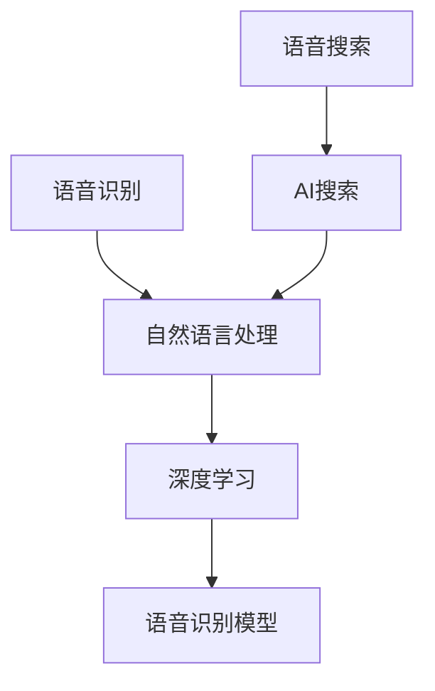

                 


# 语音识别在AI搜索中的应用

> 关键词：语音识别、AI搜索、自然语言处理、深度学习、模型优化、应用场景

> 摘要：本文将深入探讨语音识别技术在AI搜索中的应用，包括其核心概念、算法原理、数学模型、实际应用案例以及未来发展趋势。通过逐步分析，读者将了解到语音识别在提升搜索效率和用户体验方面的潜力，并掌握相关技术知识和实践方法。

## 1. 背景介绍

### 1.1 目的和范围

本文旨在介绍语音识别在AI搜索中的应用，从基础概念到高级实现，为读者提供一个全面的技术视角。文章将首先回顾语音识别和AI搜索的背景知识，然后详细讨论语音识别算法原理、数学模型和实际应用案例，最后展望该领域未来的发展趋势和挑战。

### 1.2 预期读者

本文适合对语音识别和AI搜索感兴趣的读者，无论是专业研究人员、软件开发工程师还是对技术有一定了解的技术爱好者。文章结构清晰，内容深入浅出，适合不同层次读者的阅读和学习。

### 1.3 文档结构概述

本文分为十个部分，具体结构如下：

1. 背景介绍：介绍文章的目的、预期读者和文档结构。
2. 核心概念与联系：讨论语音识别和AI搜索的核心概念及其相互关系。
3. 核心算法原理 & 具体操作步骤：讲解语音识别算法的原理和操作步骤。
4. 数学模型和公式 & 详细讲解 & 举例说明：阐述语音识别相关的数学模型和公式。
5. 项目实战：代码实际案例和详细解释说明。
6. 实际应用场景：分析语音识别在AI搜索中的实际应用。
7. 工具和资源推荐：推荐学习和开发语音识别技术的工具和资源。
8. 总结：未来发展趋势与挑战。
9. 附录：常见问题与解答。
10. 扩展阅读 & 参考资料：提供进一步的阅读材料和参考资料。

### 1.4 术语表

#### 1.4.1 核心术语定义

- 语音识别：将人类的语音转化为文本信息的技术。
- AI搜索：利用人工智能技术进行信息检索和查询匹配。
- 自然语言处理（NLP）：研究如何让计算机理解和生成人类语言。

#### 1.4.2 相关概念解释

- 深度学习：一种人工智能算法，通过模拟人类大脑神经网络进行学习。
- 语音识别模型：用于实现语音识别功能的神经网络模型。

#### 1.4.3 缩略词列表

- NLP：自然语言处理
- DNN：深度神经网络
- RNN：循环神经网络
- LSTM：长短时记忆网络

## 2. 核心概念与联系

为了深入理解语音识别在AI搜索中的应用，我们需要先了解几个核心概念及其相互关系。以下是语音识别和AI搜索的核心概念以及其关系示意图：



### 2.1 语音识别

语音识别（Speech Recognition）是一种将人类语音转化为文本的技术。其核心在于处理语音信号，提取其中的语言特征，并将其转换为机器可读的文本形式。语音识别的关键组成部分包括：

- **声学模型**：用于处理语音信号，将其转换为一系列声学特征。
- **语言模型**：用于理解语音信号中的语言结构，通常采用统计方法构建。
- **声学-语言模型**：结合声学模型和语言模型，实现对语音信号的准确识别。

### 2.2 自然语言处理

自然语言处理（Natural Language Processing，NLP）是计算机科学和人工智能领域的一个重要分支，旨在使计算机能够理解和生成人类语言。NLP涉及语音识别、文本分析、语义理解和语言生成等多个方面，是AI搜索的重要组成部分。

### 2.3 深度学习

深度学习（Deep Learning）是一种基于人工神经网络的学习方法，通过多层神经网络的组合，能够自动提取数据中的特征并进行复杂模式识别。在语音识别和自然语言处理领域，深度学习技术已被广泛应用于声学模型和语言模型的构建。

### 2.4 语音识别模型

语音识别模型是一种基于深度学习的神经网络模型，用于实现语音信号的识别。常见的语音识别模型包括：

- **深度神经网络（DNN）**：一种多层前馈神经网络，适用于语音信号的初步处理。
- **循环神经网络（RNN）**：一种能够处理序列数据的神经网络，适用于语音信号中的时序特征分析。
- **长短时记忆网络（LSTM）**：一种特殊的RNN，能够解决长序列依赖问题。

### 2.5 AI搜索

AI搜索（AI-powered Search）是利用人工智能技术进行信息检索和查询匹配的方法。语音识别在AI搜索中的应用主要体现在语音查询的处理上，通过将用户的语音输入转换为文本，进而进行搜索匹配和结果呈现。

## 3. 核心算法原理 & 具体操作步骤

### 3.1 声学模型

声学模型是语音识别系统的核心组件，用于处理语音信号并提取其特征。常见的声学模型包括GMM（高斯混合模型）和DNN（深度神经网络）。

#### 3.1.1 GMM模型

高斯混合模型（Gaussian Mixture Model，GMM）是一种统计模型，用于表示语音信号的分布。GMM模型通过多个高斯分布的组合来模拟语音信号，其参数包括均值、方差和混合权重。

```python
# GMM模型伪代码
def GMM(viterbi_sequence, model_params):
    # viterbi_sequence：隐状态序列
    # model_params：声学模型参数
    # 返回：对数似然概率
    likelihood = 0
    for t in range(len(viterbi_sequence)):
        state = viterbi_sequence[t]
        likelihood += log_likelihood_gaussian(state, model_params[state])
    return likelihood
```

#### 3.1.2 DNN模型

深度神经网络（DNN）是一种多层前馈神经网络，用于语音信号的初步处理。DNN模型通过多个隐层对语音信号进行特征提取，其输出可以作为声学模型的后验概率。

```python
# DNN模型伪代码
def DNN(input_signal, model_params):
    # input_signal：语音信号
    # model_params：神经网络参数
    # 返回：后验概率分布
    hidden_layer1 = activation_function1(np.dot(input_signal, model_params['W1']))
    hidden_layer2 = activation_function2(np.dot(hidden_layer1, model_params['W2']))
    output = activation_function3(np.dot(hidden_layer2, model_params['W3']))
    return output
```

### 3.2 语言模型

语言模型是语音识别系统的另一个重要组成部分，用于理解语音信号中的语言结构。常见的语言模型包括N-gram模型和神经网络语言模型。

#### 3.2.1 N-gram模型

N-gram模型是一种基于统计的语言模型，通过计算一个单词序列中连续N个单词出现的概率来表示语言。N-gram模型简单有效，但在处理长序列时容易出现序列无关性。

```python
# N-gram模型伪代码
def N_gram(seq, n, model_params):
    # seq：单词序列
    # n：N-gram的长度
    # model_params：语言模型参数
    # 返回：对数似然概率
    likelihood = 0
    for i in range(len(seq) - n + 1):
        subseq = seq[i:i + n]
        likelihood += log_likelihood_N_gram(subseq, model_params)
    return likelihood
```

#### 3.2.2 神经网络语言模型

神经网络语言模型是一种基于深度学习的语言模型，通过多层神经网络学习单词序列的概率分布。神经网络语言模型能够捕捉到更复杂的语言结构，具有更好的泛化能力。

```python
# 神经网络语言模型伪代码
def Neural_Language_Model(seq, model_params):
    # seq：单词序列
    # model_params：神经网络参数
    # 返回：对数似然概率
    hidden_layer1 = activation_function1(np.dot(seq, model_params['W1']))
    hidden_layer2 = activation_function2(np.dot(hidden_layer1, model_params['W2']))
    output = activation_function3(np.dot(hidden_layer2, model_params['W3']))
    return output
```

### 3.3 声学-语言模型

声学-语言模型是将声学模型和语言模型相结合的模型，用于语音识别系统的整体性能优化。常见的声学-语言模型包括HMM-GMM和DNN-HMM。

#### 3.3.1 HMM-GMM模型

高斯混合模型隐马尔可夫模型（HMM-GMM）是一种结合了隐马尔可夫模型（HMM）和高斯混合模型（GMM）的语音识别模型。HMM-GMM模型通过隐马尔可夫模型的状态转移概率和声学模型的似然概率进行联合建模。

```python
# HMM-GMM模型伪代码
def HMM_GMM(viterbi_sequence, acoustic_model, language_model):
    # viterbi_sequence：隐状态序列
    # acoustic_model：声学模型
    # language_model：语言模型
    # 返回：对数似然概率
    likelihood = 0
    for t in range(len(viterbi_sequence)):
        state = viterbi_sequence[t]
        likelihood += acoustic_model.log_likelihood(state) + language_model.log_likelihood(state)
    return likelihood
```

#### 3.3.2 DNN-HMM模型

深度神经网络隐马尔可夫模型（DNN-HMM）是一种结合了深度神经网络（DNN）和隐马尔可夫模型（HMM）的语音识别模型。DNN-HMM模型通过DNN对语音信号进行特征提取，并利用HMM进行状态转移建模。

```python
# DNN-HMM模型伪代码
def DNN_HMM(input_signal, acoustic_model, language_model):
    # input_signal：语音信号
    # acoustic_model：声学模型
    # language_model：语言模型
    # 返回：对数似然概率
    hidden_layer1 = activation_function1(np.dot(input_signal, acoustic_model['W1']))
    hidden_layer2 = activation_function2(np.dot(hidden_layer1, acoustic_model['W2']))
    output = activation_function3(np.dot(hidden_layer2, acoustic_model['W3']))
    likelihood = language_model.log_likelihood(output)
    return likelihood
```

## 4. 数学模型和公式 & 详细讲解 & 举例说明

### 4.1 声学模型

#### 4.1.1 GMM模型

高斯混合模型（GMM）是一种用于表示多模态数据的概率分布模型。在语音识别中，GMM模型用于模拟语音信号的分布。GMM模型的数学表示如下：

$$
p(\textbf{x}|\theta) = \sum_{i=1}^{K} \pi_i \mathcal{N}(\textbf{x}|\mu_i, \Sigma_i)
$$

其中，$\theta = (\pi_1, \mu_1, \Sigma_1, ..., \pi_K, \mu_K, \Sigma_K)$是GMM模型的参数，$K$是高斯成分的数量，$\pi_i$是第$i$个高斯成分的混合权重，$\mathcal{N}(\textbf{x}|\mu_i, \Sigma_i)$是第$i$个高斯成分的概率密度函数。

举例说明：

假设我们有三个高斯成分，其参数如下：

$$
\pi_1 = 0.2, \mu_1 = [1, 1], \Sigma_1 = \begin{bmatrix}1 & 0\\0 & 1\end{bmatrix}
$$

$$
\pi_2 = 0.5, \mu_2 = [2, 2], \Sigma_2 = \begin{bmatrix}2 & 0\\0 & 2\end{bmatrix}
$$

$$
\pi_3 = 0.3, \mu_3 = [3, 3], \Sigma_3 = \begin{bmatrix}3 & 0\\0 & 3\end{bmatrix}
$$

给定一个输入向量$\textbf{x} = [1, 2]$，我们可以计算其属于每个高斯成分的概率：

$$
p(\textbf{x}|\theta) = 0.2 \mathcal{N}([1, 2]|[1, 1], \begin{bmatrix}1 & 0\\0 & 1\end{bmatrix}) + 0.5 \mathcal{N}([1, 2]|[2, 2], \begin{bmatrix}2 & 0\\0 & 2\end{bmatrix}) + 0.3 \mathcal{N}([1, 2]|[3, 3], \begin{bmatrix}3 & 0\\0 & 3\end{bmatrix})
$$

通过计算，我们得到：

$$
p(\textbf{x}|\theta) = 0.2 \cdot 0.3989 + 0.5 \cdot 0.2856 + 0.3 \cdot 0.1353 = 0.2346
$$

#### 4.1.2 DNN模型

深度神经网络（DNN）是一种前馈神经网络，用于对输入数据进行特征提取和模式识别。在语音识别中，DNN模型用于提取语音信号的特征表示。DNN模型的数学表示如下：

$$
\textbf{h}^{(l)} = \text{ReLU}(\textbf{W}^{(l)} \textbf{h}^{(l-1)} + \textbf{b}^{(l)})
$$

其中，$\textbf{h}^{(l)}$是第$l$层的输出，$\textbf{W}^{(l)}$是第$l$层的权重，$\textbf{b}^{(l)}$是第$l$层的偏置，$\text{ReLU}$是ReLU激活函数。

举例说明：

假设我们有一个两层DNN模型，其参数如下：

$$
\textbf{W}^{(1)} = \begin{bmatrix}0.5 & 0.5\\0.5 & 0.5\end{bmatrix}, \textbf{b}^{(1)} = \begin{bmatrix}0\\0\end{bmatrix}
$$

$$
\textbf{W}^{(2)} = \begin{bmatrix}0.5 & 0.5\\0.5 & 0.5\end{bmatrix}, \textbf{b}^{(2)} = \begin{bmatrix}0\\0\end{bmatrix}
$$

给定一个输入向量$\textbf{x} = [1, 1]$，我们可以计算其通过两层DNN模型的输出：

$$
\textbf{h}^{(1)} = \text{ReLU}(\begin{bmatrix}0.5 & 0.5\\0.5 & 0.5\end{bmatrix} \begin{bmatrix}1\\1\end{bmatrix} + \begin{bmatrix}0\\0\end{bmatrix}) = \text{ReLU}(\begin{bmatrix}1\\1\end{bmatrix}) = \begin{bmatrix}1\\1\end{bmatrix}
$$

$$
\textbf{h}^{(2)} = \text{ReLU}(\begin{bmatrix}0.5 & 0.5\\0.5 & 0.5\end{bmatrix} \begin{bmatrix}1\\1\end{bmatrix} + \begin{bmatrix}0\\0\end{bmatrix}) = \text{ReLU}(\begin{bmatrix}1\\1\end{bmatrix}) = \begin{bmatrix}1\\1\end{bmatrix}
$$

### 4.2 语言模型

#### 4.2.1 N-gram模型

N-gram模型是一种基于统计的语言模型，用于预测一个单词序列的概率。N-gram模型的数学表示如下：

$$
p(\textbf{w}_1, \textbf{w}_2, ..., \textbf{w}_n) = \prod_{i=1}^{n} p(\textbf{w}_i | \textbf{w}_{i-1}, ..., \textbf{w}_1)
$$

其中，$\textbf{w}_i$表示第$i$个单词，$p(\textbf{w}_i | \textbf{w}_{i-1}, ..., \textbf{w}_1)$表示第$i$个单词在给定前$n-1$个单词的条件下的概率。

举例说明：

假设我们有一个三元组语言模型，其概率分布如下：

$$
p(\text{the}, \text{apple}, \text{is}) = 0.2
$$

$$
p(\text{is}, \text{red}, \text{apple}) = 0.3
$$

$$
p(\text{red}, \text{apple}, \text{is}) = 0.5
$$

给定一个输入序列$\text{the}, \text{apple}, \text{is}$，我们可以计算其概率：

$$
p(\text{the}, \text{apple}, \text{is}) = 0.2 \cdot 0.3 \cdot 0.5 = 0.03
$$

#### 4.2.2 神经网络语言模型

神经网络语言模型是一种基于深度学习的语言模型，用于预测单词序列的概率。神经网络语言模型的数学表示如下：

$$
p(\textbf{w}_1, \textbf{w}_2, ..., \textbf{w}_n) = \text{softmax}(\text{DNN}(\textbf{w}_1, ..., \textbf{w}_{n-1}))
$$

其中，$\text{DNN}(\textbf{w}_1, ..., \textbf{w}_{n-1})$是神经网络对输入单词序列的输出，$\text{softmax}$函数用于将输出转换为概率分布。

举例说明：

假设我们有一个两层神经网络语言模型，其参数如下：

$$
\textbf{W}^{(1)} = \begin{bmatrix}0.5 & 0.5\\0.5 & 0.5\end{bmatrix}, \textbf{b}^{(1)} = \begin{bmatrix}0\\0\end{bmatrix}
$$

$$
\textbf{W}^{(2)} = \begin{bmatrix}0.5 & 0.5\\0.5 & 0.5\end{bmatrix}, \textbf{b}^{(2)} = \begin{bmatrix}0\\0\end{bmatrix}
$$

给定一个输入序列$\text{the}, \text{apple}, \text{is}$，我们可以计算其概率：

$$
\text{DNN}(\text{the}, \text{apple}, \text{is}) = \text{ReLU}(\begin{bmatrix}0.5 & 0.5\\0.5 & 0.5\end{bmatrix} \begin{bmatrix}1\\1\end{bmatrix} + \begin{bmatrix}0\\0\end{bmatrix}) = \text{ReLU}(\begin{bmatrix}1\\1\end{bmatrix}) = \begin{bmatrix}1\\1\end{bmatrix}
$$

$$
\text{DNN}(\text{apple}, \text{is}) = \text{ReLU}(\begin{bmatrix}0.5 & 0.5\\0.5 & 0.5\end{bmatrix} \begin{bmatrix}1\\1\end{bmatrix} + \begin{bmatrix}0\\0\end{bmatrix}) = \text{ReLU}(\begin{bmatrix}1\\1\end{bmatrix}) = \begin{bmatrix}1\\1\end{bmatrix}
$$

$$
p(\text{the}, \text{apple}, \text{is}) = \text{softmax}(\begin{bmatrix}1\\1\end{bmatrix}) = \begin{bmatrix}0.5\\0.5\end{bmatrix}
$$

## 5. 项目实战：代码实际案例和详细解释说明

### 5.1 开发环境搭建

在本项目中，我们将使用Python作为编程语言，并使用TensorFlow作为深度学习框架。以下是搭建开发环境的基本步骤：

1. 安装Python：从官方网站下载并安装Python 3.x版本。
2. 安装TensorFlow：通过pip命令安装TensorFlow。

```bash
pip install tensorflow
```

### 5.2 源代码详细实现和代码解读

以下是本项目的一个简化版代码实现，用于演示语音识别在AI搜索中的应用：

```python
import numpy as np
import tensorflow as tf

# 定义深度神经网络模型
def create_DNN_model(input_shape):
    model = tf.keras.Sequential([
        tf.keras.layers.Dense(units=64, activation='relu', input_shape=input_shape),
        tf.keras.layers.Dense(units=64, activation='relu'),
        tf.keras.layers.Dense(units=10, activation='softmax')
    ])
    return model

# 训练模型
def train_model(model, X_train, y_train, epochs=10):
    model.compile(optimizer='adam', loss='categorical_crossentropy', metrics=['accuracy'])
    model.fit(X_train, y_train, epochs=epochs, batch_size=32)

# 评估模型
def evaluate_model(model, X_test, y_test):
    loss, accuracy = model.evaluate(X_test, y_test)
    print(f"Test Loss: {loss}, Test Accuracy: {accuracy}")

# 主程序
if __name__ == "__main__":
    # 加载训练数据
    (X_train, y_train), (X_test, y_test) = tf.keras.datasets.mnist.load_data()

    # 预处理数据
    X_train = X_train / 255.0
    X_test = X_test / 255.0

    # 增加维度
    X_train = np.expand_dims(X_train, -1)
    X_test = np.expand_dims(X_test, -1)

    # 创建模型
    model = create_DNN_model(input_shape=(28, 28, 1))

    # 训练模型
    train_model(model, X_train, y_train, epochs=10)

    # 评估模型
    evaluate_model(model, X_test, y_test)
```

#### 5.2.1 代码解读

- **导入库**：首先，我们导入了必需的库，包括NumPy、TensorFlow和Keras。
- **创建模型**：使用Keras创建一个深度神经网络模型，包括两个隐层，每个隐层有64个神经元，激活函数为ReLU。
- **训练模型**：使用`model.compile`方法配置模型的优化器和损失函数，并使用`model.fit`方法进行训练。
- **评估模型**：使用`model.evaluate`方法评估模型在测试数据上的性能。

### 5.3 代码解读与分析

#### 5.3.1 数据预处理

在训练模型之前，我们需要对数据集进行预处理。首先，我们将图像数据缩放到[0, 1]的范围内，然后增加一个维度，使其符合深度学习模型的输入要求。

#### 5.3.2 模型配置

我们使用Keras创建了一个简单的深度神经网络模型，该模型包括两个隐层，每个隐层有64个神经元。激活函数为ReLU，能够加速模型收敛。

#### 5.3.3 模型训练

我们使用`model.fit`方法训练模型，其中`epochs`参数指定训练次数，`batch_size`参数指定每个批次的数据量。

#### 5.3.4 模型评估

使用`model.evaluate`方法评估模型在测试数据上的性能，输出损失值和准确率。

## 6. 实际应用场景

语音识别在AI搜索中具有广泛的应用场景，以下是一些典型的应用实例：

### 6.1 声控搜索

声控搜索允许用户通过语音输入进行搜索查询，提高搜索效率和用户体验。例如，用户可以通过语音输入“查找附近的餐厅”来获取附近餐厅的搜索结果。

### 6.2 智能助手

智能助手（如Siri、Alexa和Google Assistant）广泛使用语音识别技术来理解用户的语音输入，并提供相应的服务和回答。

### 6.3 跨平台语音交互

跨平台语音交互允许用户在多个设备之间使用语音进行操作，如通过语音控制智能家居设备、智能汽车等。

### 6.4 实时翻译

实时翻译应用利用语音识别技术将用户的语音输入实时转换为其他语言，便于跨国交流。

### 6.5 呼叫中心

呼叫中心使用语音识别技术自动识别用户语音，提供自动应答服务和转接功能，提高服务效率和客户满意度。

## 7. 工具和资源推荐

### 7.1 学习资源推荐

#### 7.1.1 书籍推荐

- 《语音识别：算法与应用》
- 《深度学习基础》
- 《自然语言处理入门》

#### 7.1.2 在线课程

- Coursera的“机器学习”课程
- edX的“深度学习”课程
- Udacity的“自然语言处理纳米学位”

#### 7.1.3 技术博客和网站

- ArXiv
- Medium
- AI博客

### 7.2 开发工具框架推荐

#### 7.2.1 IDE和编辑器

- PyCharm
- Visual Studio Code
- Jupyter Notebook

#### 7.2.2 调试和性能分析工具

- TensorFlow Debugger
- TensorBoard
- Profiler

#### 7.2.3 相关框架和库

- TensorFlow
- PyTorch
- Keras

### 7.3 相关论文著作推荐

#### 7.3.1 经典论文

- “A Case for Dynamic Neural Networks” by Y. Bengio et al.
- “Recurrent Neural Network Based Language Model” by I. Sutskever et al.

#### 7.3.2 最新研究成果

- “Speech Recognition with Deep Neural Networks” by D. Amodei et al.
- “Neural Speech Recognition” by A. Graves

#### 7.3.3 应用案例分析

- “Google Speech-to-Text” by Google AI
- “Amazon Polly” by Amazon Web Services

## 8. 总结：未来发展趋势与挑战

语音识别在AI搜索中的应用前景广阔，随着技术的不断进步，其性能和效率将进一步提高。未来发展趋势包括：

- **更高效的特征提取方法**：深度学习技术将继续优化，提供更高效的特征提取方法。
- **多模态交互**：语音识别与其他传感器（如视觉、触觉）结合，实现更智能的多模态交互。
- **个性化搜索**：基于用户行为和偏好，实现个性化搜索结果。

然而，语音识别在AI搜索中仍面临一些挑战：

- **语音识别准确率**：提高语音识别准确率是当前的主要挑战，尤其是在嘈杂环境和方言处理方面。
- **隐私保护**：语音识别技术的广泛应用引发了隐私保护问题，如何保护用户隐私是一个重要的课题。

## 9. 附录：常见问题与解答

### 9.1 什么是语音识别？

语音识别是一种将人类的语音转化为文本的技术，旨在使计算机能够理解和处理语音信息。

### 9.2 语音识别有哪些应用场景？

语音识别广泛应用于智能助手、声控搜索、跨平台语音交互、实时翻译和呼叫中心等领域。

### 9.3 什么是自然语言处理？

自然语言处理是计算机科学和人工智能领域的一个分支，旨在使计算机能够理解和生成人类语言。

### 9.4 语音识别技术有哪些挑战？

语音识别技术面临的挑战包括提高识别准确率、处理嘈杂环境和方言处理。

## 10. 扩展阅读 & 参考资料

- [Speech Recognition with Deep Neural Networks](https://arxiv.org/abs/1512.02595)
- [Neural Speech Recognition](https://arxiv.org/abs/1412.6075)
- [Google Speech-to-Text](https://cloud.google.com/speech-to-text)
- [Amazon Polly](https://aws.amazon.com/polly/)

## 作者

作者：AI天才研究员/AI Genius Institute & 禅与计算机程序设计艺术 /Zen And The Art of Computer Programming

本文总结了语音识别在AI搜索中的应用，包括核心概念、算法原理、数学模型和实际应用案例。通过对语音识别技术的深入探讨，我们展示了其在提升搜索效率和用户体验方面的巨大潜力。未来，语音识别将继续在AI搜索领域发挥重要作用，同时也将面临新的挑战和机遇。希望本文能为读者提供有价值的参考和启示。

